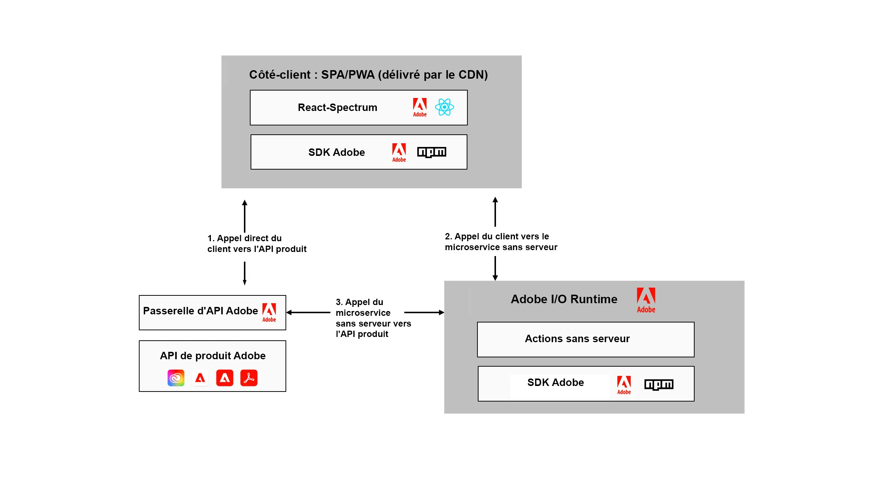

# Extension d’[!DNL Adobe Experience Manager] à l’aide d’Adobe Developer App Builder {#extend-using-app-builder}

## Présentation d’App Builder pour AEM {#project-appbuilder}

Le nouveau développeur d’applications App Builder d’Adobe fournit un framework permettant aux développeurs d’étendre facilement les fonctionnalités d’AEM.

L’App Builder fournit une structure tierce unifiée pour l’intégration et la création d’expériences personnalisées pour étendre Adobe Experience Manager. Grâce à ce framework d’extensibilité complet reposant sur l’infrastructure d’Adobe, les développeurs peuvent créer des microservices personnalisés, étendre et intégrer Adobe Experience Manager à travers les solutions d’Adobe et le reste de la pile informatique.

L’App Builder permet aux clients d’étendre facilement les capacités d’Adobe Experience Manager à divers cas d’utilisation :

* Extensibilité des middleware : connectez des systèmes externes à des applications Adobe qui créent des connecteurs personnalisés, ou exploitez la suite d’intégrations préconfigurées.
* Extensibilité des services principaux : étendez les fonctionnalités de l’application principale en étendant le comportement par défaut grâce à des fonctionnalités personnalisées et à la logique métier.
* Extensibilité de l’expérience utilisateur : étendez l’expérience principale pour prendre en charge les besoins de l’entreprise ou créer des propriétés numériques et des applications storefronts et back-office spécifiques aux clients.

Depuis l’été 2020, le créateur d’applications est disponible pour les clients, les clientes et les partenaires d’entreprise via notre Aperçu du développeur Adobe. La disponibilité générale de l’App Builder est prévue pour décembre 2021. Adobe invite les développeurs à tester App Builder par le biais de l’Adobe [Programme d’évaluation](https://developer.adobe.com/app-builder/trial/).

>[!NOTE]
>
>Pour les clients d’AEM as a Cloud Service qui souhaitent utiliser App Builder, voir [Extension d’Adobe Experience Manager as a Cloud Service à l’aide d’Adobe Developer App Builder](https://experienceleague.adobe.com/docs/experience-manager-65/developing/extending-aem/app-builder.html?lang=fr).

## Architecture {#architecture}

Au lieu d’une solution prête à l’emploi, Adobe Developer App Builder fournit une plateforme de développement commune, cohérente et normalisée permettant d’étendre les solutions Adobe Cloud telles qu’AEM, parmi les suivantes :

* Adobe Developer Console : pour le développement de microservices et d’extensions personnalisés, permet aux développeurs de créer et de gérer des projets tout en accédant à tous les outils et API dont ils ont besoin pour créer des modules externes et des intégrations.
* Outils de développement : outils Open Source, SDK et bibliothèques permettant aux développeurs de créer facilement des extensions et des intégrations personnalisées. Utilisez React Spectrum (boîte à outils de l’interface utilisateur de l’Adobe) pour disposer d’une interface utilisateur commune à toutes les applications Adobe.
* Services : Exécution d’E/S pour l’hébergement de l’infrastructure sur notre plateforme sans serveur Adobe et événements d’E/S pour les intégrations basées sur des événements. Adobe fournit également une prise en charge prête à l’emploi pour le stockage des données et des fichiers.
* Adobe Experience Cloud : les développeurs peuvent soumettre des extensions et des intégrations à publier dans leur organisation Experience Cloud. Les administrateurs système peuvent ensuite examiner, gérer et approuver ces extensions. Une fois la publication effectuée, vos extensions et outils App Builder personnalisés se trouvent aux côtés d’autres applications Adobe Experience Cloud.

Le diagramme suivant illustre la manière dont une application standard créée sur le créateur d’applications tire parti de ces fonctionnalités :

Pour plus d’informations sur l’architecture de l’App Builder, reportez-vous à la section [Présentation de l’architecture](https://developer.adobe.com/app-builder/docs/guides/).

## Prise en main de l’App Builder {#additional-resources}

Pour vous aider à prendre en main App Builder, une série de documents a été créée pour vous aider à commencer :

* [Prise en main de l’App Builder](https://developer.adobe.com/app-builder/docs/getting_started/)

## Poursuivre l’apprentissage avec la documentation {#appbuilder-documentation}

L’App Builder fournit des vidéos et de la documentation à l’intention des développeurs, notamment des guides et une documentation de référence pour vous aider à commencer à développer vos propres applications personnalisées :

* [Documentation de l’App Builder](https://developer.adobe.com/app-builder/docs/overview/)
* [Vidéos sur l’App Builder](https://www.youtube.com/playlist?list=PLcVEYUqU7VRfDij-Jbjyw8S8EzW073F_o)

## Essayez un des exemples d’application. {#appbuilder-codesamples}

Prêts à développer ? Il existe de nombreux exemples d’applications pour vous aider à démarrer rapidement :

* [Laboratoires de code du créateur d’applications sur le site web d’Adobe Developer](https://developer.adobe.com/app-builder/docs/resources/)

