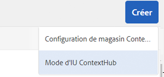
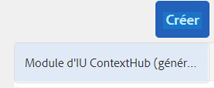
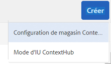

# Configuration de ContextHub {#configuring-contexthub}

ContextHub est une structure pour stocker, manipuler et présenter des données contextuelles. Pour plus de détails sur ContextHub, voir la [documentation destinée aux développeurs](/help/sites-developing/contexthub.md). ContextHub remplace [ClientContext](/help/sites-administering/client-context.md) dans l’IU tactile.

Configurez la barre d’outils [ContextHub](/help/sites-developing/contexthub.md) pour contrôler si elle apparaît dans le mode d’aperçu, afin de créer des magasins ContextHub et d’ajouter des modules d’IU à l’aide de l’IU optimisée pour les écrans tactiles.

## Désactivation de ContextHub {#disabling-contexthub}

Par défaut, ContextHub est activé dans une installation AEM. ContextHub peut être désactivé pour éviter qu’il charge js/css et s’initialise. Il existe deux options pour désactiver ContextHub :

* Modifiez la configuration de ContextHub et cochez l’option **Désactiver ContextHub**

   1. Sur le rail, cliquez ou appuyez sur **Outils > Sites > ContextHub**.
   1. Cliquez ou appuyez sur le **conteneur de configurations** par défaut.
   1. Sélectionnez la **configuration ContextHub** et cliquez ou appuyez sur **Modifier l’élément sélectionné**.
   1. Cliquez ou appuyez sur **Désactiver ContextHub** et cliquez ou appuyez sur **Enregistrer**.

ou

* Utilisez CRXDE Lite pour définir la propriété `disabled` sur **true** sous `/libs/settings/cloudsettings`.

>[!NOTE]
>
>[En raison de la restructuration du référentiel dans AEM 6.4,](/help/sites-deploying/repository-restructuring.md) l’emplacement des configurations ContextHub a été remplacé  `/etc/cloudsettings` par :
>
> * `/libs/settings/cloudsettings`
> * `/conf/global/settings/cloudsettings`
> * `/conf/<tenant>/settings/cloudsettings`


## Affichage et masquage de l’IU ContextHub {#showing-and-hiding-the-contexthub-ui}

Configurez le service Adobe Granite ContextHub OSGi pour afficher ou masquer l’[IU ContextHub](/help/sites-authoring/ch-previewing.md) sur vos pages. Le PID de ce service est `com.adobe.granite.contexthub.impl.ContextHubImpl.`

Pour configurer le service, vous pouvez utiliser la [console Web](/help/sites-deploying/configuring-osgi.md#osgi-configuration-with-the-web-console) ou un noeud [JCR dans le référentiel](/help/sites-deploying/configuring-osgi.md#osgi-configuration-in-the-repository) :

* **Console web :** pour afficher l’IU, sélectionnez la propriété Afficher l’IU. Pour masquer l’IU, désélectionnez la propriété Masquer l’IU.
* **Nœud JCR :** pour afficher l’IU, définissez la propriété booléenne `com.adobe.granite.contexthub.show_ui` sur `true`. Pour masquer l’IU, définissez la propriété sur `false`.

Si l’IU ContextHub est activée, elle s’affiche uniquement sur les pages sur les instances de création AEM. L’IU ne s’affiche pas sur les pages des instances de publication.

## Ajout des modes et des modules d’IU ContextHub  {#adding-contexthub-ui-modes-and-modules}

Configurez les modes et les modules d’IU qui apparaissent dans la barre d’outils ContextHub en mode d’aperçu :

* Modes de l’IU : groupes de modules associés.
* Modules : widgets qui exposent des données contextuelles d’un magasin et permettent aux auteurs de modifier le contexte.

Les modes d’IU s’affichent sous forme d’une série d’icônes dans la partie gauche de la barre d’outils. Lorsqu’un mode d’IU est sélectionné, ses modules s’affichent à droite.


Les icônes sont des références de la [bibliothèque d’icônes CoralUI](https://helpx.adobe.com/fr/experience-manager/6-4/sites/developing/using/reference-materials/coral-ui/coralui3/Coral.Icon.html#availableIcons).

### Ajout d’un mode d’IU  {#adding-a-ui-mode}

Ajoutez un mode d’IU afin de regrouper les modules ContextHub associés. Lorsque vous créez le mode d’IU, vous fournissez le titre et l’icône figurant dans la barre d’outils ContextHub.

1. Sur le rail Experience Manager, cliquez ou appuyez sur Outils > Sites > ContextHub.
1. Cliquez ou appuyez sur le conteneur de configurations par défaut.
1. Cliquez ou appuyez sur la configuration de ContextHub.
1. Cliquez ou appuyez sur le bouton Créer, puis sur le mode d’IU ContextHub.

   

1. Saisissez les valeurs pour les propriétés suivantes :

   * Titre du mode d’IU : titre qui identifie le mode d’IU.
   * Icône de mode : sélecteur de l’[icône de CoralUI](https://helpx.adobe.com/experience-manager/6-4/sites/developing/using/reference-materials/coral-ui/coralui3/Coral.Icon.html#availableIcons) à utiliser ; par exemple `coral-Icon--user`.
   * Activé : sélectionnez cette option pour afficher le mode d’IU dans la barre d’outils ContextHub.

1. Cliquez ou appuyez sur Enregistrer.

### Ajout d’un module d’IU  {#adding-a-ui-module}

Ajoutez un module d’IU ContextHub à un mode d’IU afin qu’il s’affiche dans la barre d’outils ContextHub pour prévisualiser le contenu d’une page. Lorsque vous ajoutez un module d’IU, vous créez une instance d’un type de module qui est enregistré auprès de ContextHub. Pour ajouter un module d’IU, vous devez connaître le nom du type de module associé.

AEM propose un type de module d’IU de base, ainsi que plusieurs types de modules d’IU d’exemple sur lesquels vous pouvez baser un module d’IU. Le tableau suivant présente une brève description de chacun d’entre eux. Pour plus d’informations sur le développement d’un module d’IU personnalisé, voir [Création de modules d’IU ContextHub](/help/sites-developing/ch-extend.md#creating-contexthub-ui-module-types).

Les propriétés du module d’IU incluent une configuration de détails où vous pouvez fournir des valeurs pour des propriétés spécifiques au module. Vous fournissez la configuration de détails au format JSON. La colonne Type de module dans le tableau fournit des liens vers des informations sur le code JSON requis pour chaque type de module d’IU.

| Type de module | Description | Magasin |
|---|---|---|
| [contexthub.base](/help/sites-developing/ch-samplemodules.md#contexthub-base-ui-module-type) | Type de module d’IU générique | Configuré dans les propriétés du module d’IU |
| [contexthub.browserinfo](/help/sites-developing/ch-samplemodules.md#contexthub-browserinfo-ui-module-type) | Affiche des informations sur le navigateur. | surferinfo |
| [contexthub.datetime](/help/sites-developing/ch-samplemodules.md#contexthub-datetime-ui-module-type) | Affiche la date et l’heure. | datetime |
| [contexthub.device](/help/sites-developing/ch-samplemodules.md#contexthub-device-ui-module-type) | Affichage du périphérique client | émulateurs |
| [contexthub.location](/help/sites-developing/ch-samplemodules.md#contexthub-location-ui-module-type) | Affiche la latitude et la longitude du client, ainsi que l’emplacement sur une carte. Vous permet de modifier l’emplacement. | géolocalisation |
| [contexthub.screen-orientation](/help/sites-developing/ch-samplemodules.md#contexthub-screen-orientation-ui-module-type) | Affiche l’orientation de l’écran de l’appareil (paysage ou portrait). | émulateurs |
| [contexthub.tagcloud](/help/sites-developing/ch-samplemodules.md#contexthub-tagcloud-ui-module-type) | Affiche des statistiques sur les balises de page. | tagcloud |
| [granite.profile](/help/sites-developing/ch-samplemodules.md#granite-profile-ui-module-type) | Affiche les informations sur le profil de l’utilisateur actuel, y compris les variables authorizedID, displayName et familyName. Vous pouvez modifier la valeur du nom d’affichage (displayName) et du nom de famille (familyName). | son profil |

1. Sur le rail Experience Manager, cliquez ou appuyez sur Outils > Sites > ContextHub.
1. Cliquez ou appuyez sur le conteneur de configurations auquel vous voulez ajouter un module d’IU.
1. Cliquez ou appuyez sur la configuration ContextHub à laquelle vous voulez ajouter le module d’IU.
1. Cliquez ou appuyez sur le mode d’IU auquel vous ajoutez le module d’IU.
1. Cliquez ou appuyez sur le bouton Créer, puis cliquez ou appuyez sur le module d’IU ContextHub (générique).

   

1. Saisissez les valeurs pour les propriétés suivantes :

   * Titre du module d’IU : titre qui identifie le module d’IU
   * Type de module : type du module
   * Activé : sélectionnez cette option pour afficher le module d’IU dans la barre d’outils ContextHub.

1. (Facultatif) Pour désactiver la configuration de magasin par défaut, saisissez un objet JSON afin de configurer le module d’IU.
1. Cliquez ou appuyez sur Enregistrer.

## Création d’un magasin ContextHub  {#creating-a-contexthub-store}

Créez un magasin ContextHub pour conserver les données utilisateur et accéder aux données selon vos besoins. Les magasins ContextHub sont basés sur des candidats de magasins enregistrés. Lorsque vous créez le magasin, vous avez besoin de la valeur du paramètre storeType avec lequel le candidat de magasin a été enregistré. (Voir [Création de candidats de magasins personnalisés](/help/sites-developing/ch-extend.md#creating-custom-store-candidates).)

### Configuration de magasin détaillée  {#detailed-store-configuration}

Lorsque vous configurez un magasin, la propriété Configuration de détails vous permet de fournir des valeurs pour les propriétés spécifiques au magasin. La valeur est basée sur le paramètre `config` de la fonction `init` du magasin. Par conséquent, la nécessité de fournir ou non cette valeur et son format dépend du magasin.

La valeur de la propriété Configuration de détails est un objet `config` au format JSON.

### Exemples de candidats de magasins {#sample-store-candidates}

AEM fournit des exemples de candidats de magasins sur lesquels vous pouvez baser un magasin.

| Type de magasin | Description |
|---|---|
| [aem.segmentation](/help/sites-developing/ch-samplestores.md#aem-segmentation-sample-store-candidate) | Magasin pour les segments ContextHub résolus et non résolus. Récupère automatiquement les segments de SegmentManager ContextHub |
| [aem.resolvedsegments](/help/sites-developing/ch-samplestores.md#aem-resolvedsegments-sample-store-candidate) | Stocke les segments actuellement résolus. Écoute le service ContextHub SegmentManager pour mettre à jour automatiquement le magasin |
| [contexthub.geolocation](/help/sites-developing/ch-samplestores.md#contexthub-geolocation-sample-store-candidate) | Stocke la latitude et la longitude de l’emplacement du navigateur. |
| [contexthub.datetime](/help/sites-developing/ch-samplestores.md#contexthub-datetime-sample-store-candidate) | Stocke la date, l’heure et la saison actuelles pour l’emplacement du navigateur. |
| [granite.emulators](/help/sites-developing/ch-samplestores.md#granite-emulators-sample-store-candidate) | Définit les propriétés et les fonctionnalités d’un certain nombre d’appareils et détecte l’appareil client actuel. |
| [contexthub.generic-jsonp](/help/sites-developing/ch-samplestores.md#contexthub-generic-jsonp-sample-store-candidate) | Récupère et stocke les données d’un service JSONP. |
| [granite.profil](/help/sites-developing/ch-samplestores.md#granite-profile-sample-store-candidate) | Stocke les données de profil de l’utilisateur actuel. |
| [contexthub.surferinfo](/help/sites-developing/ch-samplestores.md#contexthub-surferinfo-sample-store-candidate) | Stocke des informations sur le client, telles que les informations relatives à l’appareil, le type de navigateur et l’orientation de la fenêtre. |
| [contexthub.tagcloud](/help/sites-developing/ch-samplestores.md#contexthub-tagcloud-sample-data-store) | Stocke les balises de page et le nombre de balises |

1. Sur le rail Experience Manager, cliquez ou appuyez sur Outils > Sites > ContextHub.
1. Cliquez ou appuyez sur le conteneur de configurations par défaut.
1. Cliquez ou appuyez sur Configuration ContextHub.
1. Pour ajouter un magasin, cliquez ou appuyez sur l’icône Créer, puis sur Configuration de magasin ContexHub.

   

1. Saisissez les valeurs des propriétés de configuration de base, puis cliquez ou appuyez sur Suivant :

   * **Titre de configuration :** titre qui identifie le magasin.
   * **Type de magasin :** valeur de la propriété storeType du candidat de magasin sur lequel vous souhaitez baser le magasin.
   * **Obligatoire :** sélectionnez cette option.
   * **Activé :** sélectionnez cette option pour activer le magasin.

1. (Facultatif) Pour remplacer la configuration de magasin par défaut, saisissez un objet JSON dans la case Configuration des détails (JSON).
1. Cliquez ou appuyez sur Enregistrer.

## Exemple : en utilisant un service JSONP  {#example-using-a-jsonp-service}

Cet exemple illustre comment configurer un magasin et afficher les données dans un module d’IU. Dans cet exemple, le service MD5 du site jsontest.com est utilisé comme source de données pour un magasin. Le service renvoie le code de hachage MD5 d’une chaîne donnée, au format JSON.

Le magasin contexthub.generic-jsonp est configuré de sorte qu’il stocke les données de l’appel de service `https://md5.jsontest.com/?text=%22text%20to%20md5%22`. Le service renvoie les données suivantes qui s’affichent dans un module d’IU :

```xml
{
   "md5": "919a56ab62b6d5e1219fe1d95248a2c5",
   "original": "\"text to md5\""
}
```

### Création d’un magasin contexthub.generic-jsonp  {#creating-a-contexthub-generic-jsonp-store}

L’exemple de candidat de magasin contexthub.generic-jsonp vous permet de récupérer les données d’un service JSONP ou web qui renvoie des données JSON. Pour ce candidat de magasin, utilisez la configuration de magasin afin de fournir les détails du service JSONP à utiliser.

La fonction [init](/help/sites-developing/contexthub-api.md#init-name-config) de la classe JavaScript `ContextHub.Store.JSONPStore` définit un objet `config` qui initialise ce candidat de magasin. L’objet `config` contient un objet `service` qui inclut des détails sur le service JSONP. Pour configurer le magasin, il vous suffit de fournir l’objet `service` au format JSON comme valeur de la propriété Configuration de détails.

Pour enregistrer les données à partir du service MD5 du site jsontest.com, suivez la procédure décrite dans [Création d’un magasin ContextHub](/help/sites-developing/ch-configuring.md#creating-a-contexthub-store) à l’aide des propriétés suivantes :

* **Titre de configuration :** md5
* **Type de magasin :** contexthub.generic-jsonp
* **Obligatoire :** sélectionnez cette option.
* **Activé :** sélectionnez cette option.
* **Configuration des détails (JSON) :**

   ```xml
   {
    "service": {
    "jsonp": false,
    "timeout": 1000,
    "ttl": 1800000,
    "secure": false,
    "host": "md5.jsontest.com",
    "port": 80,
    "params":{
    "text":"text to md5"
        }
      }
    }
   ```

### Ajout d’un module d’IU pour les données MD5 {#adding-a-ui-module-for-the-md-data}

Ajoutez un module d’IU à la barre d’outils ContextHub pour afficher les données stockées dans l’exemple de magasin MD5. Dans cet exemple, le module contexthub.base est utilisé pour générer le module d’IU suivant :


Suivez la procédure décrite dans [Ajouter un module d&#39;interface utilisateur](#adding-a-ui-module) pour ajouter le module d&#39;interface à un mode d&#39;interface utilisateur existant, tel que l&#39;exemple de mode d&#39;interface utilisateur Perona. Pour le module d’IU, utilisez les valeurs de propriétés suivantes :

* **Titre du module d’IU :** MD5.
* **Type de module :** contexthub.base.
* **Configuration des détails (JSON) :**

   ```xml
   {
    "icon": "coral-Icon--data",
    "title": "MD5 Converstion",
    "storeMapping": { "md5": "md5" },
    "template": "<p> {{md5.original}}</p>;
                 <p>{{md5.md5}}</p>"
   }
   ```

## Débogage de ContextHub {#debugging-contexthub}

Une procédure de débogage pour ContextHub peut être activée afin de permettre la résolution des incidents. Le mode de débogage peut être activé via la configuration de ContextHub ou CRXDE.

### Via la configuration  {#via-the-configuration}

Modifiez la configuration de ContextHub et cochez l’option **Débogage**.

1. Sur le rail, cliquez ou appuyez sur **Outils > Sites > ContextHub**.
1. Cliquez ou appuyez sur le **conteneur de configurations** par défaut.
1. Sélectionnez la **configuration ContextHub** et cliquez ou appuyez sur **Modifier l’élément sélectionné**.
1. Cliquez ou appuyez sur **Débogage** et cliquez ou appuyez sur **Enregistrer**.

### Via CRXDE {#via-crxde}

Utilisez CRXDE Lite pour définir la propriété `debug` sur **true** sous :

* `/conf/global/settings/cloudsettings` ou
* `/conf/<tenant>/settings/cloudsettings`

>[!NOTE]
>
>Pour les configurations ContextHub toujours situées sous leurs chemins d’accès hérités, l’emplacement où définir `debug property` est `/libs/settings/cloudsettings/legacy/contexthub`.

### Mode silencieux {#silent-mode}

Le mode silencieux supprime toutes les informations de débogage. Contrairement à l’option de débogage normal, qui peut être définie séparément pour chaque configuration ContextHub, le mode silencieux est un paramètre global qui est prioritaire par rapport à tout paramètre de débogage au niveau de la configuration de ContextHub.

Cela est utile pour votre instance de publication, où vous ne souhaitez pas voir d’informations de débogage. Puisqu’il s’agit d’un paramètre global, il est activé via OSGi.

1. Ouvrez la **Configuration de la console web Adobe Experience Manager** à l’adresse `http://<host>:<port>/system/console/configMgr`
1. Recherchez **Adobe Granite ContextHub**.
1. Cliquez sur la configuration **Adobe Granite ContextHub** pour en modifier les propriétés.
1. Cochez l’option **Mode silencieux** et cliquez sur **Enregistrer**.

## Récupération des configurations de ContextHub après une mise à niveau  {#recovering-contexthub-configurations-after-upgrading}

Lors d’une [mise à niveau vers AEM](/help/sites-deploying/upgrade.md), les configurations de ContextHub sont sauvegardées et stockées dans un emplacement sécurisé. Lors de la mise à niveau, les configurations de ContextHub par défaut sont installées et remplacent les configurations existantes. La sauvegarde est nécessaire pour conserver tous les changements ou ajouts que vous avez effectués.

Les configurations ContextHub sont stockées dans un dossier nommé `contexthub` sous les noeuds suivants :

* `/conf/global/settings/cloudsettings`
* `/conf/<tenant>/settings/cloudsettings`

Après une mise à niveau, la sauvegarde est stockée dans un dossier nommé `contexthub` sous un noeud nommé :

`/conf/global/settings/cloudsettings/default-pre-upgrade_yyyymmdd_xxxxxxx` ou
`/conf/<tenant>/settings/cloudsettings/default-pre-upgrade_yyyymmdd_xxxxxxx`

La partie `yyyymmdd` du nom du noeud est la date à laquelle la mise à niveau a été effectuée.

Pour récupérer vos configurations ContextHub, utilisez le CRXDE Lite pour copier les noeuds qui représentent vos magasins, modes d’interface utilisateur et modules d’interface utilisateur de sous le noeud `default-pre-upgrade_yyyymmdd_xxxxxx` vers le bas :

* `/conf/global/settings/cloudsettings` ou
* `/conf/<tenant>/settings/cloudsettings`
