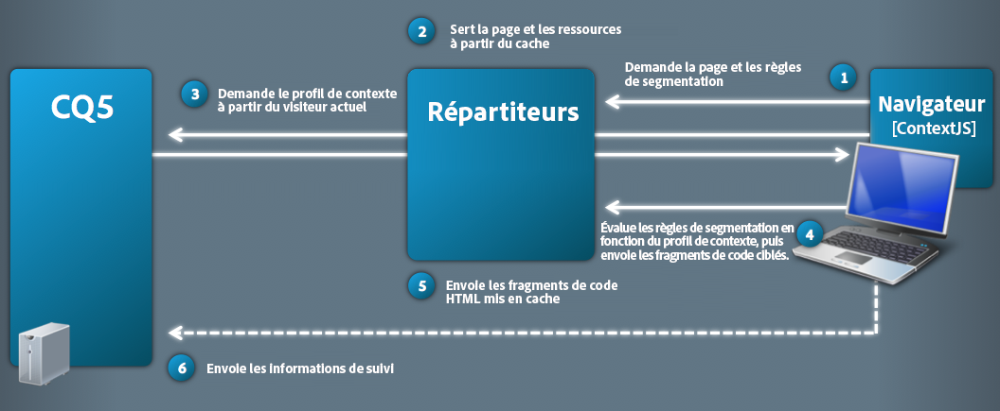
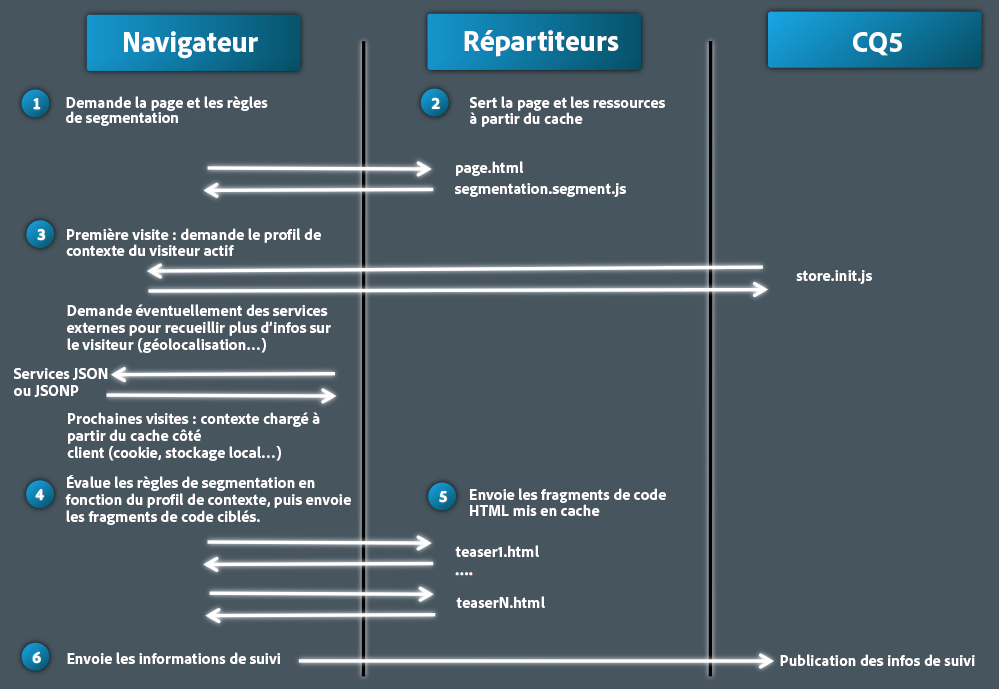
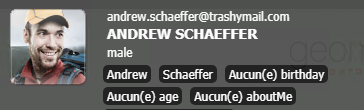
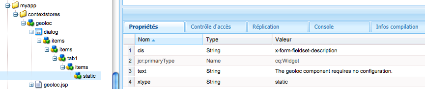
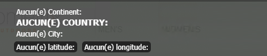

# Présentation détaillée de ClientContext{#client-context-in-detail}

>[!NOTE]
>
>ClientContext a été remplacé par ContextHub. Pour plus d’informations, consultez la [documentation connexe](/help/sites-developing/contexthub.md).

ClientContext représente un ensemble de données utilisateur assemblées de manière dynamique. Vous pouvez utiliser ces données pour déterminer le contenu à afficher sur une page web dans une situation donnée (ciblage de contenu). Les données sont également disponibles pour la mesure d’audience d’un site web, ainsi que pour tout code JavaScript sur la page.

ClientContext se compose essentiellement des éléments suivants :

* La session de magasin, qui contient les données utilisateur.
* L’interface utilisateur, qui affiche les données utilisateur et fournit des outils pour simuler l’expérience utilisateur.
* Une [API JavaScript](/help/sites-developing/ccjsapi.md) pour interagir avec les sessions de magasin.

Pour créer un magasin de sessions autonome et l’ajouter à ClientContext ou pour créer un magasin de sessions lié à un composant Magasin de contexte, AEM installe plusieurs composants Magasin de contexte que vous pouvez utiliser immédiatement. Vous pouvez vous en servir comme base pour vos composants.

Pour plus d’informations sur l’ouverture du contexte client, la configuration des informations affichées et la simulation de l’expérience utilisateur, voir [Contexte client](/help/sites-administering/client-context.md).

## Magasins de sessions {#session-stores}

ClientContext comprend divers magasins de sessions contenant des données utilisateur. Les données de magasin proviennent des sources suivantes :

* Navigateur web du client.
* Serveur (voir [Magasin JSONP](/help/sites-administering/client-context.md#main-pars-variable-8) pour le stockage des informations issues de sources tierces)

La structure ClientContext fournit une [API JavaScript](/help/sites-developing/ccjsapi.md) que vous pouvez utiliser pour interagir avec les magasins de sessions, pour lire et écrire des données utilisateur, ou encore pour écouter les événements de magasin et y réagir. Vous pouvez également créer des magasins de sessions pour les données utilisateur que vous utilisez pour le ciblage de contenu ou à d’autres fins.

Les données de magasin de session restent sur le client. ClientContext ne les réécrit pas sur le serveur. Pour envoyer des données au serveur, utilisez un formulaire ou développez du code JavaScript personnalisé.

Chaque magasin de sessions est un ensemble de paires propriété-valeur. Le magasin de sessions représente un ensemble de données (de n’importe quel type), dont la signification conceptuelle peut être déterminée par le concepteur et/ou le développeur. L’exemple de code javascript suivant définit un objet qui représente les données de profil que le magasin de sessions peut contenir :

```
{
  age: 20,
  authorizableId: "aparker@geometrixx.info",
  birthday: "27 Feb 1992",
  email: "aparker@geometrixx.info",
  formattedName: "Alison Parker",
  gender: "female",
  path: "/home/users/geometrixx/aparker@geometrixx.info/profile"
}
```

Un magasin de sessions peut être conservé entre deux sessions de navigateur ou prendre fin avec la session au cours de laquelle il a été créé.

>[!NOTE]
>
>La persistance de magasin utilise soit l’espace de stockage du navigateur soit des cookies (cookie `SessionPersistence`). L’espace de stockage du navigateur est le plus couramment utilisé.
>
>Lorsque le navigateur est fermé, puis rouvert, un magasin de sessions peut être chargé avec les valeurs issues d’un magasin persistant. Il faut alors vider le cache du navigateur pour supprimer les anciennes valeurs.

### Composants de magasin de contexte {#context-store-components}

Un composant de magasin de contexte est un composant CQ qui peut être ajouté à ClientContext. En règle générale, les composants de magasin de contexte affichent des données provenant d’un magasin de session auquel elles sont associées. Cependant, les informations affichées par les composants de magasin de contexte ne se limitent pas aux données de magasin de sessions.

Ces composants peuvent, en effet, inclure les éléments suivants :

* Des scripts JSP qui définissent l’aspect dans ClientContext.
* Des propriétés pour répertorier le composant dans le sidekick.
* Des boîtes de dialogue de modification pour configurer des instances de composant.
* Du code JavaScript qui initialise le magasin de sessions.

Pour obtenir une description des composants Magasin de contexte (ContextStore) installés que vous pouvez ajouter à ContextStore, reportez-vous à la section [Composants ClientContext disponibles](/help/sites-administering/client-context.md#available-client-context-components).

>[!NOTE]
>
>« Données de page » ne figure plus dans ClientContext sous la forme d’un composant par défaut. Au besoin, vous pouvez l’ajouter en modifiant ClientContext, en ajoutant le composant **Propriétés de la boutique générique**, puis en le configurant de manière à définir **Boutique** en tant que `pagedata`.

### Diffusion de contenu ciblée {#targeted-content-delivery}

Des informations de profil sont également utilisées pour diffuser du [contenu ciblé](/help/sites-authoring/content-targeting-touch.md).

 

## Ajout de ClientContext à une page {#adding-client-context-to-a-page}

Insérez le composant ClientContext dans le corps de vos pages web pour l’activer. Le chemin d’accès du noeud du composant Client Context est `/libs/cq/personalization/components/clientcontext`. Pour inclure le composant, ajoutez le code suivant au fichier JSP de votre composant de page situé juste en dessous de l’élément `body` de la page :

```java
<cq:include path="clientcontext" resourceType="cq/personalization/components/clientcontext"/>
```

Le composant clientcontext fait en sorte que la page charge les bibliothèques clientes qui implémentent ClientContext.

* L’API JavaScript ClientContext.
* La structure ClientContext qui prend en charge les magasins de sessions, la gestion des événements, etc.
* Les segments qui sont définis.
* Les scripts init.js générés pour chaque composant de magasin de contexte qui a été ajouté à ClientContext.
* (Instance de création uniquement) L’IU de ClientContext.

L’IU de ClientContext est disponible uniquement sur l’instance de création.

## Extension de ClientContext {#extending-client-context}

Pour étendre ClientContext, créez un magasin de sessions et affichez éventuellement les données du magasin :

* Créez un magasin de sessions pour les données utilisateur dont vous avez besoin pour le ciblage de contenu et l’analytique web.
* Créez un composant de magasin de contexte pour permettre aux administrateurs de configurer le magasin de sessions associé et pour afficher les données du magasin dans ClientContext à des fins de test.

>[!NOTE]
>
>Si vous possédez (ou si vous créez) un service `JSONP` capable de fournir les données, vous pouvez simplement utiliser le composant de magasin de contexte `JSONP` et le mapper sur ce service. Cela permettra de gérer le magasin de sessions.

### Création d’un magasin de sessions  {#creating-a-session-store}

Créez un magasin de sessions pour les données que vous devez ajouter à ClientContext et récupérer de ce composant. En règle générale, la procédure de création d’un magasin de sessions est la suivante :

1. Créez un dossier de bibliothèque cliente dont la valeur de propriété `categories` est définie sur `personalization.stores.kernel`. ClientContext charge automatiquement les bibliothèques clientes de cette catégorie.

1. Configurez le dossier de bibliothèque cliente pour qu’il dépende du dossier `personalization.core.kernel`. La bibliothèque cliente `personalization.core.kernel` fournit l’API JavaScript ClientContext.

1. Ajoutez le code JavaScript qui crée et initialise le magasin de sessions.

Lorsque vous insérez le code JavaScript dans la bibliothèque cliente personalization.stores.kernel, le magasin est créé lors du chargement de la structure ClientContext.

>[!NOTE]
>
>Si vous créez un magasin de sessions dans le cadre d’un composant de magasin de contexte, vous pouvez placer le code JavaScript dans le fichier init.js.jsp du composant. Dans ce cas, le magasin de sessions n’est créé que si le composant est ajouté à ClientContext.

#### Types de magasins de sessions  {#types-of-session-stores}

Les magasins de sessions sont soit créés et accessibles au cours d’une session du navigateur, soit conservés dans les cookies ou l’espace de stockage du navigateur. L’API JavaScript ClientContext définit plusieurs classes qui représentent les deux types de magasins de données :

* ` [CQ_Analytics.SessionStore](/help/sites-developing/ccjsapi.md#cq-analytics-sessionstore)`: Ces objets résident uniquement dans le DOM de la page. Les données sont créées et conservées pendant la durée de vie de la page.
* ` [CQ_Analytics.PerstistedSessionStore](/help/sites-developing/ccjsapi.md#cq-analytics-persistedsessionstore)` : ces objets résident dans l’élément DOM de la page et sont conservés dans les cookies ou l’espace de stockage du navigateur. Les données sont disponibles sur les différentes pages et entre les sessions utilisateur.

L’API fournit également des extensions de ces classes qui sont spécialisées dans le stockage des données JSON ou JSONP :

* Objets de session uniquement : [CQ_Analytics.JSONStore](/help/sites-developing/ccjsapi.md#cq-analytics-jsonstore) et [CQ_Analytics.JSONPStore](/help/sites-developing/ccjsapi.md#cq-analytics-jsonpstore).

* Objets persistants : [CQ_Analytics.PersistedJSONStore](/help/sites-developing/ccjsapi.md#cq-analytics-persistedjsonstore) et [CQ_Analytics.PersistedJSONPStore](/help/sites-developing/ccjsapi.md#cq-analyics-persistedjsonpstore).

#### Création de l’objet de magasin de sessions  {#creating-the-session-store-object}

Le code JavaScript de votre dossier de bibliothèque cliente crée et initialise le magasin de sessions. Le magasin de sessions doit alors être enregistré à l’aide du gestionnaire du magasin de contexte. L’exemple suivant crée et enregistre un objet [CQ_Analytics.SessionStore](/help/sites-developing/ccjsapi.md#cq-analytics-sessionstore).

```
//Create the session store
if (!CQ_Analytics.MyStore) {
    CQ_Analytics.MyStore = new CQ_Analytics.SessionStore();
    CQ_Analytics.MyStore.STOREKEY = "MYSTORE";
    CQ_Analytics.MyStore.STORENAME = "mystore";
    CQ_Analytics.MyStore.data={};
}
//register the session store
if (CQ_Analytics.ClientContextMgr){
    CQ_Analytics.ClientContextMgr.register(CQ_Analytics.MyStore)
}
```

Pour le stockage des données JSON, l’exemple suivant crée et enregistre un objet [CQ_Analytics.JSONStore](/help/sites-developing/ccjsapi.md#cq-analytics-sessionstore).

```
if (!CQ_Analytics.myJSONStore) {
    CQ_Analytics.myJSONStore = CQ_Analytics.JSONStore.registerNewInstance("myjsonstore",{});
}
```

### Création d’un composant de magasin de contexte {#creating-a-context-store-component}

Créez un composant de magasin de contexte pour effectuer le rendu des données du magasin de sessions dans ClientContext. Une fois ce composant créé, vous pouvez le faire glisser sur ClientContext pour effectuer le rendu des données à partir d’un magasin de sessions. Les composants de magasin de contexte comprennent les éléments suivants :

* Un script JSP pour le rendu des données.
* Une boîte de dialogue de modification.
* Un script JSP pour initialiser le magasin de sessions.
* (Facultatif) Un dossier de bibliothèque cliente qui crée le magasin de sessions. Il n’est pas nécessaire d’inclure le dossier de bibliothèque cliente si le composant utilise un magasin de sessions existant.

#### Extension des composants de magasin de contexte fournis  {#extending-the-provided-context-store-components}

AEM fournit les composants de magasin de contexte genericstore et genericstoreproperties que vous pouvez étendre. La structure de vos données de magasin détermine le composant que vous étendez :

* Paires propriété-valeur : extension du composant `GenericStoreProperties`. Ce composant effectue automatiquement le rendu des magasins de paires propriété-valeur. Plusieurs points d’interaction sont fournis :

   * `prolog.jsp` et `epilog.jsp` : interaction de composant qui vous permet d’ajouter une logique côté serveur avant ou après le rendu du composant.

* Données complexes : extension du composant `GenericStore`. Votre magasin de sessions aura ensuite besoin d’une méthode de rendu qui sera appelée chaque fois que le rendu du composant doit être effectué. La fonction de rendu est appelée avec deux paramètres :

   * `@param {String} store`
Le magasin à rendre

   * `@param {String} divId`
Identifiant du div dans lequel le rendu du magasin doit être effectué.

>[!NOTE]
>
>Tous les composants ClientContext sont des extensions des composants genericstore ou genericstoreproperties. Plusieurs exemples sont installés dans le dossier `/libs/cq/personalization/components/contextstores`.

#### Configuration de l’aspect dans le sidekick {#configuring-the-appearance-in-sidekick}

Lorsque vous modifiez ClientContext, les composants du magasin de contexte s’affichent dans le sidekick. Comme c’est le cas avec tous les composants, les propriétés `componentGroup` et `jcr:title` du composant ClientContext déterminent son groupe et son nom.

Tous les composants dont la valeur de propriété `componentGroup` est `Client Context` apparaissent par défaut dans le Sidekick. Si vous utilisez une autre valeur pour la propriété `componentGroup`, vous devez ajouter manuellement le composant au sidekick à l’aide du mode Création.

#### Instance du composant de magasin de contexte {#context-store-component-instances}

Lorsque vous ajoutez un composant de stockage de contexte au contexte client, un noeud qui représente l’instance du composant est créé sous `/etc/clientcontext/default/content/jcr:content/stores`. Ce nœud contient les valeurs de propriété qui sont configurées à l’aide de la boîte de dialogue de modification du composant.

Lorsque ClientContext est initialisé, ces nœuds sont traités.

#### Initialisation du magasin de sessions associé  {#initializing-the-associated-session-store}

Ajoutez un fichier init.js.jsp à votre composant afin de générer le code JavaScript qui initialise le magasin de sessions utilisé par votre composant de magasin de contexte. Utilisez, par exemple, le script d’initialisation pour récupérer les propriétés de configuration du composant et les utiliser pour remplir le magasin de sessions.

Le code JavaScript généré est ajouté à la page lorsque ClientContext est initialisé au chargement de la page sur les instances de création et de publication. Ce fichier JSP est exécuté avant le chargement et le rendu de l’instance du composant de magasin de contexte.

Le code doit définir le type MIME du fichier sur `text/javascript`, sinon il n&#39;est pas exécuté.

>[!CAUTION]
>
>Le script init.js.jsp est exécuté sur les instances de création et de publication, mais seulement si le composant de magasin de contexte est ajouté à ClientContext.

La procédure suivante crée le fichier de scriptinit.js.jsp et ajoute le code qui définit le type MIME approprié. Le code qui effectue l’initialisation du magasin va suivre.

1. Cliquez avec le bouton droit de la souris sur le nœud du composant de magasin de contexte et sélectionnez ensuite Créer > Créer un fichier.
1. Dans le champ Nom, entrez `init.js.jsp`, puis cliquez sur OK.
1. En haut de la page, ajoutez le code suivant, puis cliquez sur Enregistrer tout.

   ```java
   <%@page contentType="text/javascript" %>
   ```

### Rendu des données de magasin de sessions pour les composants genericstoreproperties  {#rendering-session-store-data-for-genericstoreproperties-components}

Affichez les données de magasin de sessions dans ClientContext en utilisant un format cohérent.

#### Affichage des données de propriété  {#displaying-property-data}

La bibliothèque de balises de personnalisation fournit la balise `personalization:storePropertyTag` qui affiche la valeur d’une propriété à partir d’un magasin de sessions. Pour utiliser la balise, insérez la ligne de code suivante dans votre fichier JSP :

```xml
<%@taglib prefix="personalization" uri="https://www.day.com/taglibs/cq/personalization/1.0" %>
```

La balise présente le format suivant :

```xml
<personalization:storePropertyTag propertyName="property_name" store="session_store_name"/>
```

L’attribut `propertyName` est le nom de la propriété de magasin à afficher. L’attribut `store` est le nom du magasin enregistré. L’exemple de balise suivant affiche la valeur de la propriété `authorizableId` du magasin `profile` :

```xml
<personalization:storePropertyTag propertyName="authorizableId" store="profile"/>
```

#### Structure HTML {#html-structure}

Le dossier de bibliothèque cliente personalization.ui (/etc/clientlibs/foundation/personalization/ui/themes/default) fournit les styles CSS que ClientContext utilise pour mettre en forme le code HTML. Le code suivant illustre la structure qu’il est conseillé d’utiliser pour afficher des données de magasin :

```xml
<div class="cq-cc-store">
   <div class="cq-cc-thumbnail">
      <div class="cq-cc-store-property">
           <!-- personalization:storePropertyTag for the store thumbnail image goes here -->
      </div>
   </div>
   <div class="cq-cc-content">
       <div class="cq-cc-store-property cq-cc-store-property-level0">
           <!-- personalization:storePropertyTag for a store property goes here -->
       </div>
       <div class="cq-cc-store-property cq-cc-store-property-level1">
           <!-- personalization:storePropertyTag for a store property goes here -->
       </div>
       <div class="cq-cc-store-property cq-cc-store-property-level2">
           <!-- personalization:storePropertyTag for a store property goes here -->
       </div>
       <div class="cq-cc-store-property cq-cc-store-property-level3">
           <!-- personalization:storePropertyTag for a store property goes here -->
       </div>
   </div>
   <div class="cq-cc-clear"></div>
</div>
```

Le composant de magasin de contexte `/libs/cq/personalization/components/contextstores/profiledata` utilise cette structure pour afficher les données du magasin de sessions de profil. La classe `cq-cc-thumbnail` place la miniature. Les classes `cq-cc-store-property-level*x*` formatent les données alphanumériques :

* Les niveaux level0, level1 et level2 sont distribués verticalement et utilisent une police blanche.
* level3, et tout niveau supplémentaire, sont distribués horizontalement et utilisent une police blanche avec un arrière-plan plus foncé.



### Rendu des données de magasin de sessions pour les composants genericstore {#rendering-session-store-data-for-genericstore-components}

Pour effectuer le rendu des données de magasin à l’aide d’un composant genericstore, vous devez :

* Ajoutez la balise personalization:storeRendererTag sur le script JSP du composant pour identifier le nom du magasin de sessions.
* Implémenter une méthode de rendu sur la classe du magasin de sessions.

#### Identification du magasin de sessions genericstore  {#identifying-the-genericstore-session-store}

La bibliothèque de balises de personnalisation fournit la balise `personalization:storePropertyTag` qui affiche la valeur d’une propriété à partir d’un magasin de sessions. Pour utiliser la balise, insérez la ligne de code suivante dans votre fichier JSP :

```xml
<%@taglib prefix="personalization" uri="https://www.day.com/taglibs/cq/personalization/1.0" %>
```

La balise présente le format suivant :

```java
<personalization:storeRendererTag store="store_name"/>
```

#### Mise en œuvre de la méthode de rendu du magasin de sessions  {#implementing-the-session-store-renderer-method}

Votre magasin de sessions aura ensuite besoin d’une méthode de rendu qui sera appelée chaque fois que le rendu du composant doit être effectué. La fonction de rendu est appelée avec deux paramètres :

* @param {String} store Magasin dont le rendu doit être effectué.
* @param {String} divId Identifiant du div dans lequel le rendu du magasin doit être effectué.

## Interaction avec les magasins de sessions {#interacting-with-session-stores}

Utilisez JavaScript pour interagir avec les magasins de session.

### Accès aux magasins de sessions  {#accessing-session-stores}

Obtenez un objet de magasin de sessions pour lire ou écrire des données dans le magasin. [CQ_Analytics.ClientContextMgr](/help/sites-developing/ccjsapi.md#cq-analytics-clientcontextmgr) permet d’accéder aux magasins en fonction de leur nom. Une fois ce nom obtenu, utilisez les méthodes de la propriété [CQ_Analytics.SessionStore](/help/sites-developing/ccjsapi.md#cq-analytics-sessionstore) ou [CQ_Analytics.PersistedSessionStore](/help/sites-developing/ccjsapi.md#cq-analytics-persistedsessionstore) pour interagir avec les données de magasin.

L’exemple suivant récupère le magasin `profile` et ensuite la propriété `formattedName` depuis le magasin.

```
function getName(){
   var profilestore = CQ_Analytics.ClientContextMgr.getRegisteredStore("profile");
   if(profilestore){
      return profilestore.getProperty("formattedName", false);
   } else {
      return null;
   }
}
```

### Création d’un écouteur pour répondre à une mise à jour de magasin de sessions {#creating-a-listener-to-react-to-a-session-store-update}

Les magasins de sessions déclenchent des événements. Ainsi, il est possible d’ajouter des écouteurs et de déclencher des événements sur la base de ces derniers.

Les magasins de session sont construits sur le modèle `Observable`. Ils étendent [ `CQ_Analytics.Observable`](/help/sites-developing/ccjsapi.md#cq-analytics-observable) qui fournit la méthode ` [addListener](/help/sites-developing/ccjsapi.md#addlistener-event-fct-scope)`.

L’exemple suivant ajoute un écouteur à l’événement `update` du magasin de sessions `profile`.

```
var profileStore = ClientContextMgr.getRegisteredStore("profile");
if( profileStore ) {
  //callback execution context
  var executionContext = this;

  //add "update" event listener to store
  profileStore.addListener("update",function(store, property) {
    //do something on store update

  },executionContext);
}
```

### Vérification de la définition et de l’initialisation d’un magasin de sessions {#checking-that-a-session-store-is-defined-and-initialized}

Les magasins de sessions ne sont pas disponibles tant qu’ils n’ont pas été chargés et initialisés avec des données. Les facteurs suivants peuvent avoir une incidence sur la disponibilité du magasin de sessions :

* Chargement de page
* Chargement de JavaScript
* Durée d’exécution de JavaScript
* Temps de réponse pour les requêtes XHR
* Modifications dynamiques apportées au magasin de sessions

Utilisez les méthodes [onStoreRegistered](/help/sites-developing/ccjsapi.md#onstoreregistered-storename-callback) et [onStoreInitialized](/help/sites-developing/ccjsapi.md#onstoreinitialized-storename-callback-delay) de l’objet [CQ_Analytics.ClientContextUtils](/help/sites-developing/ccjsapi.md#cq-analytics-clientcontextutils) pour n’accéder aux magasins de sessions que lorsqu’ils sont disponibles. Ces méthodes vous permettent d’enregistrer des écouteurs d’événements qui réagissent aux événements d’enregistrement et d’initialisation de sessions.

>[!CAUTION]
>
>Si vous dépendez d’un autre magasin, vous devez tenir compte du cas où le magasin n’est jamais enregistré.

L’exemple suivant utilise l’événement `onStoreRegistered` du magasin de sessions `profile`. Lorsque le magasin de sessions est enregistré, un écouteur est ajouté à l’événement `update` correspondant. Lorsque le magasin est mis à jour, le contenu de l’élément `<div class="welcome">` de la page est mis à jour avec le nom de la boutique `profile`.

```
//listen for the store registration
CQ_Analytics.ClientContextUtils.onStoreRegistered("profile", listen);

//listen for the store's update event
function listen(){
 var profilestore = CQ_Analytics.ClientContextMgr.getRegisteredStore("profile");
    profilestore.addListener("update",insertName);
}

//insert the welcome message
function insertName(){
 $("div.welcome").text("Welcome "+getName());
}

//obtain the name from the profile store
function getName(){
 var profilestore = CQ_Analytics.ClientContextMgr.getRegisteredStore("profile");
 if(profilestore){
  return profilestore.getProperty("formattedName", false);
    } else {
        return null;
    }
}
```

### Exclusion d’une propriété du cookie sessionpersistence {#excluding-a-property-from-the-sessionpersistence-cookie}

Pour empêcher qu’une propriété d’un `PersistedSessionStore` soit conservée (c’est-à-dire, pour l’exclure du cookie `sessionpersistence`), ajoutez la propriété à la liste des propriétés non persistantes du magasin de sessions persistant.

Voir ` [CQ_Analytics.PersistedSessionStore.setNonPersisted(propertyName)](/help/sites-developing/ccjsapi.md#setnonpersisted-name)`

```
CQ_Analytics.ClientContextUtils.onStoreRegistered("surferinfo", function(store) {
  //this will exclude the browser, OS and resolution properties of the surferinfo session store from the
  store.setNonPersisted("browser");
  store.setNonPersisted("OS");
  store.setNonPersisted("resolution");
});
```

## Configuration du curseur de périphérique {#configuring-the-device-slider}

### Conditions {#conditions}

La page en cours doit être associée à une page pour mobiles correspondante ; cela est déterminé uniquement si la page possède une Live Copy configurée pour un déploiement sur mobiles (`rolloutconfig.path.toLowerCase` contient `mobile`).

#### Configuration {#configuration}

Lors du passage de la page pour ordinateurs de bureau à la page équivalente pour mobiles :

* L’élément DOM de la page pour mobiles est chargé.
* La balise `div` principale (requise) qui inclut le contenu est extraite et insérée dans la page actuelle pour ordinateurs de bureau.

* Les classes CSS et body qui doivent être chargées doivent être configurées manuellement.

Par exemple :

```
window.CQMobileSlider["geometrixx-outdoors"] = {
  //CSS used by desktop that need to be removed when mobile
  DESKTOP_CSS: [
    "/etc/designs/${app}/clientlibs_desktop_v1.css"
  ],

  //CSS used by mobile that need to be removed when desktop
  MOBILE_CSS: [
    "/etc/designs/${app}/clientlibs_mobile_v1.css"
  ],

  //id of the content that needs to be removed when mobile
  DESKTOP_MAIN_ID: "main",

  //id of the content that needs to be removed when desktop
  MOBILE_MAIN_ID: "main",

  //body classes used by desktop that need to be removed when mobile
  DESKTOP_BODY_CLASS: [
    "page"
  ],

  //body classes used by mobile that need to be removed when desktop
  MOBILE_BODY_CLASS: [
    "page-mobile"
  ]
};
```

## Exemple : création d’un composant Magasin de contexte personnalisé {#example-creating-a-custom-context-store-component}

Dans cet exemple, vous créez un composant Magasin de contexte qui récupère des données d’un service externe et les stocke dans le magasin de sessions :

* Extension du composant genericstoreproperties.
* Initialisation d’un magasin à l’aide d’un objet JavaScript CQ_Analytics.JSONPStore.
* Appel d’un service JSONP pour récupérer des données et les ajouter au magasin.
* Rendu des données dans ClientContext.

### Ajout du composant geoloc  {#add-the-geoloc-component}

Créez une application CQ et ajoutez le composant geoloc.

1. Ouvrez le CRXDE Lite dans votre navigateur Web ([https://localhost:4502/crx/de](https://localhost:4502/crx/de)).
1. Cliquez avec le bouton droit sur le dossier `/apps`, puis cliquez sur Créer > Créer un dossier. Indiquez le nom `myapp`, puis cliquez sur OK.
1. De même, sous `myapp`, créez un dossier nommé `contextstores`. &quot;
1. Cliquez avec le bouton droit sur le dossier `/apps/myapp/contextstores`, puis cliquez sur Créer > Créer un composant. Indiquez les valeurs de propriété ci-dessous, puis cliquez sur Suivant :

   * Libellé : geoloc
   * Titre : Location Store
   * Super Type : cq/personalization/components/contextstores/genericstoreproperties
   * Groupe : ClientContext

1. Dans la boîte de dialogue Créer un composant, cliquez sur Suivant sur chaque page jusqu’à ce que le bouton OK soit activé, puis cliquez à nouveau sur OK.
1. Cliquez sur Enregistrer tout.

### Création de la boîte de dialogue de modification geoloc  {#create-the-geoloc-edit-dialog}

Une boîte de dialogue de modification est requise pour le composant Magasin de contexte. La boîte de dialogue de modification contient un message statique qui indique qu’il n’y a aucune propriété à configurer.

1. Cliquez avec le bouton droit sur le noeud `/libs/cq/personalization/components/contextstores/genericstoreproperties/dialog` et cliquez sur Copier.
1. Cliquez avec le bouton droit de la souris sur le noeud `/apps/myapp/contextstores/geoloc` et cliquez sur coller.
1. Supprimez tous les noeuds enfants sous le noeud /apps/myapp/contextstores/geoloc/dialog/items/items/tab1/items :

   * store
   * properties
   * thumbnail

1. Cliquez avec le bouton droit sur le noeud `/apps/myapp/contextstores/geoloc/dialog/items/items/tab1/items`, puis cliquez sur Créer > Créer un noeud. Indiquez les valeurs de propriété ci-dessous, puis cliquez sur OK :

   * Nom : static
   * Type : cq:Widget

1. Ajoutez les propriétés suivantes au nœud  :

   | Nom | Type | Valeur |
   |---|---|---|
   | cls | Chaîne | x-form-fieldset-description |
   | text | Chaîne | Le composant géologique ne nécessite aucune configuration. |
   | xtype | Chaîne | static |

1. Cliquez sur Enregistrer tout.

   

### Création du script d’initialisation {#create-the-initialization-script}

Ajoutez un fichier init.js.jsp au composant geoloc et utilisez-le pour créer le magasin de sessions, récupérer les données d’emplacement et les ajouter au magasin.

Le fichier init.js.jsp est exécuté lorsque ClientContext est chargé par la page. À ce moment-là, l’API JavaScript ClientContext est chargée et disponible pour votre script.

1. Cliquez avec le bouton droit sur le noeud /apps/myapp/contextstores/geoloc, puis cliquez sur Créer > Créer un fichier. Indiquez le nom du fichier init.js.jsp, puis cliquez sur OK.
1. Ajoutez le code suivant en haut de la page, puis cliquez sur Enregistrer tout.

   ```java
   <%@page contentType="text/javascript;charset=utf-8" %><%
   %><%@include file="/libs/foundation/global.jsp"%><%
   log.info("***** initializing geolocstore ****");
   String store = "locstore";
   String jsonpurl = "https://api.wipmania.com/jsonp?callback=${callback}";
   
   %>
   var locstore = CQ_Analytics.StoreRegistry.getStore("<%= store %>");
   if(!locstore){
    locstore = CQ_Analytics.JSONPStore.registerNewInstance("<%= store %>", "<%= jsonpurl %>",{});
   }
   <% log.info(" ***** done initializing geoloc ************"); %>
   ```

### Rendu des données du magasin de session geoloc  {#render-the-geoloc-session-store-data}

Ajoutez le code au fichier JSP du composant geoloc pour effectuer le rendu des données de composant dans ClientContext.



1. Dans le CRXDE Lite, ouvrez le fichier `/apps/myapp/contextstores/geoloc/geoloc.jsp`.
1. Ajoutez le code HTML suivant sous le code stub :

   ```xml
   <%@taglib prefix="personalization" uri="https://www.day.com/taglibs/cq/personalization/1.0" %>
   <div class="cq-cc-store">
      <div class="cq-cc-content">
          <div class="cq-cc-store-property cq-cc-store-property-level0">
              Continent: <personalization:storePropertyTag propertyName="address/continent" store="locstore"/>
          </div>
          <div class="cq-cc-store-property cq-cc-store-property-level1">
              Country: <personalization:storePropertyTag propertyName="address/country" store="locstore"/>
          </div>
          <div class="cq-cc-store-property cq-cc-store-property-level2">
              City: <personalization:storePropertyTag propertyName="address/city" store="locstore"/>
          </div>
          <div class="cq-cc-store-property cq-cc-store-property-level3">
              Latitude: <personalization:storePropertyTag propertyName="latitude" store="locstore"/>
          </div>
          <div class="cq-cc-store-property cq-cc-store-property-level4">
              Longitude: <personalization:storePropertyTag propertyName="longitude" store="locstore"/>
          </div>
      </div>
       <div class="cq-cc-clear"></div>
   </div>
   ```

1. Cliquez sur Enregistrer tout.

### Ajout du composant à ClientContext  {#add-the-component-to-client-context}

Ajoutez le composant Location Store à ClientContext afin qu’il soit initialisé lors du chargement de la page.

1. Ouvrez la page d&#39;accueil Geometrixx Outdoors sur l’instance d’auteur ([https://localhost:4502/content/geometrixx-outdoors/en.html](https://localhost:4502/content/geometrixx-outdoors/en.html)).
1. Cliquez sur Ctrl-Alt-c (windows) ou Ctrl-option-c (Mac) pour ouvrir Client Context.
1. Cliquez sur l’icône de modification dans la partie supérieure de ClientContext pour ouvrir Client Context Designer.

   

1. Faites glisser le composant Location Store vers Client Context.

### Affichage des informations d’emplacement dans ClientContext  {#see-the-location-information-in-client-context}

Ouvrez la page d’accueil de Geometrixx Outdoors en mode d’édition, puis ouvrez ClientContext pour afficher les données du composant Location Store.

1. Ouvrez la page anglaise du site Geometrixx Outdoors. ([https://localhost:4502/content/geometrixx-outdoors/en.html](https://localhost:4502/content/geometrixx-outdoors/en.html))
1. Pour ouvrir Client Context, appuyez sur Ctrl-Alt-c (windows) ou Ctrl-option-c (Mac).

## Création d’un ClientContext personnalisé {#creating-a-customized-client-context}

Pour créer un deuxième ClientContext, vous devez dupliquer la branche :

`/etc/clientcontext/default`

* Sous-dossier :
   `/content`
contiendra le contenu du contexte client personnalisé.

* Le dossier :
   `/contextstores`
vous permet de définir différentes configurations pour les magasins de contexte.

Pour utiliser le contexte client personnalisé, modifiez la propriété
`path`
dans le style de conception du composant contextuel client, tel qu’il est inclus dans le modèle de page. Par exemple, comme emplacement standard de :
`/libs/cq/personalization/components/clientcontext/design_dialog/items/path`
