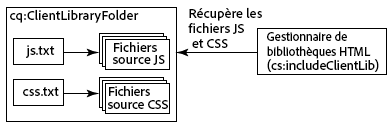

# Utilisation de bibliothèques côté client{#using-client-side-libraries}

Les sites web modernes sont très dépendants du traitement côté client effectué par du code JavaScript et CSS complexe. Organiser et optimiser la diffusion de ce code est une opération qui peut se révéler complexe.

Pour résoudre ce problème, AEM fournit des **dossiers de bibliothèques côté client** qui permettent de stocker le code côté client dans le référentiel, de le classer dans des catégories, et de définir quand et comment chaque catégorie de code doit être diffusée au client. Le système de bibliothèque côté client se charge alors de la génération des liens appropriés dans la page web finale pour charger le code correct.

## Fonctionnement des bibliothèques côté client dans AEM {#how-client-side-libraries-work-in-aem}

The standard way to include a client-side library (that is, a JS or CSS file) in the HTML of a page is simply to include a `<script>` or `<link>` tag in the JSP for that page, containing the path to the file in question. Par exemple :

```xml
...
<head>
   ...
   <script type="text/javascript" src="/etc/clientlibs/granite/jquery/source/1.8.1/jquery-1.8.1.js"></script>
   ...
</head>
...
```

Bien que cette méthode fonctionne dans AEM, elle peut entraîner des problèmes lorsque les pages et leurs composants constitutifs deviennent complexes. Dans ce cas, il y a un risque que plusieurs copies de la même bibliothèque JS soient incluses dans la sortie HTML finale. Pour éviter cela et permettre une organisation logique des bibliothèques côté client, AEM utilise des **dossiers de bibliothèques côté client**.

Un dossier de bibliothèques côté client est un nœud de référentiel de type `cq:ClientLibraryFolder`. Sa définition en [notation CND](https://jackrabbit.apache.org/node-type-notation.html) est

```shell
[cq:ClientLibraryFolder] > sling:Folder
  - dependencies (string) multiple
  - categories (string) multiple
  - embed (string) multiple
  - channels (string) multiple
```

By default, `cq:ClientLibraryFolder` nodes can be placed anywhere within the `/apps`, `/libs` and `/etc` subtrees of the repository (these defaults, and other settings can be controlled through the **Adobe Granite HTML Library Manager** panel of the [System Console](https://localhost:4502/system/console/configMgr)).

Each `cq:ClientLibraryFolder` is populated with a set of JS and/or CSS files, along with a few supporting files (see below). The properties of the `cq:ClientLibraryFolder` are configured as follows:

* `categories`: Identifie les catégories dans lesquelles le jeu de fichiers JS et/ou CSS se trouve au cours de cet `cq:ClientLibraryFolder` automne. La propriété `categories` comportant plusieurs valeurs, elle permet à un dossier de bibliothèques d’appartenir à plusieurs catégories (voir ci-dessous pour savoir en quoi cela peut se révéler utile).

* `dependencies` : il s’agit d’une liste d’autres catégories de bibliothèques clientes dont dépend ce dossier de catégories. For example, given two `cq:ClientLibraryFolder` nodes `F` and `G`, if a file in `F` requires another file in `G` in order to function properly, then at least one of the `categories` of `G` should be among the `dependencies` of `F`.

* `embed`: Utilisé pour incorporer du code provenant d’autres bibliothèques. Si le noeud F incorpore les noeuds G et H, le code HTML résultant sera une concentration de contenu des noeuds G et H.
* `allowProxy`: Si une bibliothèque cliente se trouve sous `/apps`, cette propriété lui permet d’y accéder par le biais de la servlet proxy. See [Locating a Client Library Folder and Using the Proxy Client Libraries Servlet](/help/sites-developing/clientlibs.md#locating-a-client-library-folder-and-using-the-proxy-client-libraries-servlet) below.

## Référencement des bibliothèques côté client {#referencing-client-side-libraries}

Le langage HTL étant la technologie recommandée pour développer des sites AEM, il doit être utilisé pour inclure des bibliothèques côté client dans AEM. Cependant, il est également possible d’utiliser JSP à cette fin.

### Utilisation de HTL {#using-htl}

Dans HTL, les bibliothèques clientes sont chargées à l’aide d’un modèle d’assistance fourni par AEM, accessible via [ `data-sly-use`](https://helpx.adobe.com/experience-manager/htl/using/block-statements.html#use). Trois modèles sont disponibles dans ce fichier, qui peut être appelé via [ `data-sly-call`](https://helpx.adobe.com/experience-manager/htl/using/block-statements.html#template-call) :

* **css** : charge uniquement les fichiers CSS des bibliothèques clientes référencées.
* **js** : charge uniquement les fichiers JavaScript des bibliothèques clientes référencées.
* **all** - Charge tous les fichiers des bibliothèques clientes référencées (CSS et JavaScript).

Chaque modèle d’assistance exige une option `categories` pour référencer les bibliothèques client souhaitées. Cette option peut être un tableau de valeurs de chaîne ou une chaîne contenant une liste de valeurs séparées par des virgules.

For further details and exmple of usage, see the document [Getting Started with the HTML Template Language](https://helpx.adobe.com/experience-manager/htl/using/getting-started.html#loading-client-libraries).

### Utilisation de JSP {#using-jsp}

Add a `ui:includeClientLib` tag to your JSP code to add a link to client libraries in the generated HTML page. To reference the libraries, you use the value of the `categories` property of the `ui:includeClientLib` node.

```
<%@taglib prefix="ui" uri="https://www.adobe.com/taglibs/granite/ui/1.0" %>
<ui:includeClientLib categories="<%= categories %>" />
```

For example, the `/etc/clientlibs/foundation/jquery` node is of type `cq:ClientLibraryFolder` with a categories property of value `cq.jquery`. Le code suivant dans un fichier JSP référence les bibliothèques :

```xml
<ui:includeClientLib categories="cq.jquery"/>
```

La page HTML générée contient le code suivant :

```xml
<script type="text/javascript" src="/etc/clientlibs/foundation/jquery.js"></script>
```

Pour obtenir plus d’informations, y compris des attributs de filtrage des bibliothèques JS, CSS et thématiques, voir [ui:includeClientLib](/help/sites-developing/taglib.md#lt-ui-includeclientlib).

>[!CAUTION]
>
>`<cq:includeClientLib>`, qui par le passé était généralement utilisé pour inclure les bibliothèques clientes, a été abandonné depuis AEM 5.6. [ devrait `<ui:includeClientLib>`](/help/sites-developing/taglib.md#lt-ui-includeclientlib) être utilisé à la place comme indiqué ci-dessus.

## Création de dossiers de bibliothèques clientes {#creating-client-library-folders}

Créez un nœud `cq:ClientLibraryFolder` pour définir des bibliothèques JS (JavaScript) et CSS (Cascading Style Sheet), et les mettre à la disposition des pages HTML. Utilisez la propriété `categories` du nœud pour identifier les catégories de bibliothèque auxquelles il appartient.

Le nœud contient un ou plusieurs fichiers sources qui, à l’exécution, sont fusionnés en un seul fichier JS et/ou CSS. The name of the generated file is the node name with either the `.js` or `.css` file name extension. For example, the library node named `cq.jquery` results in the generated file named `cq.jquery.js` or `cq.jquery.css`.

Les dossiers de bibliothèques clientes contiennent les éléments suivants :

* Les fichiers sources JS et/ou CSS à fusionner.
* Les ressources qui prennent en charge les styles CSS, tels que les fichiers images.

   **Remarque** : Vous pouvez utiliser des sous-dossiers pour organiser les fichiers sources.
* Un fichier `js.txt` et/ou un fichier `css.txt` qui identifie les fichiers sources à fusionner dans les fichiers JS et/ou CSS générés.



Pour plus d’informations sur les exigences spécifiques aux bibliothèques clientes pour les widgets, voir [Utilisation et extension des widgets](/help/sites-developing/widgets.md).

Le client web doit être autorisé à accéder au nœud `cq:ClientLibraryFolder`. Vous pouvez également exposer les bibliothèques à partir de zones sécurisées du référentiel (voir la section « Incorporation de code d’autres bibliothèques »·ci-dessous).

### Remplacement de bibliothèques dans /lib {#overriding-libraries-in-lib}

Client library folders located below `/apps` take precedence over same-named folders that are similarly located in `/libs`. Par exemple, `/apps/cq/ui/widgets` a priorité sur `/libs/cq/ui/widgets`. When these libraries belong to the same category, the library below `/apps` is used.

### Recherche d’un dossier de bibliothèques clientes et utilisation du servlet des bibliothèques clientes du proxy {#locating-a-client-library-folder-and-using-the-proxy-client-libraries-servlet}

In previous versions, client library folders were located below `/etc/clientlibs` in the repository. Cela est toujours pris en charge. Cependant, il est recommandé de placer désormais les bibliothèques clientes sous `/apps`. This is to locate the client libraries near the other scripts, which are generally found below `/apps` and `/libs`.

>[!NOTE]
>
>Les ressources statiques situées sous le dossier de bibliothèque client doivent se trouver dans un dossier appelé *ressources*. Si vous ne disposez pas des ressources statiques, telles que les images, sous les *ressources* de dossier, elles ne peuvent pas être référencées sur une instance de publication. En voici un exemple : https://localhost:4503/etc.clientlibs/geometrixx/components/clientlibs/resources/example.gif

>[!NOTE]
>
>In order to better isolate code from content and configuration, it is recommended to locate client libraries under `/apps` and expose them via `/etc.clientlibs` by leveraging the `allowProxy` property.

In order for the client libraries under `/apps` to be accessible, a proxy servelt is used. The ACLs are still enforced on the client library folder, but the servlet allows for the content to be read via `/etc.clientlibs/` if the `allowProxy` property is set to `true`.

Une ressource statique n’est accessible que par le biais du proxy, si elle réside sous une ressource située dans le dossier des bibliothèques clientes.

Par exemple :

* You have a clientlib in `/apps/myproject/clientlibs/foo`
* You have a static image in `/apps/myprojects/clientlibs/foo/resources/icon.png`

Then you set the `allowProxy` property on `foo` to true.

* You can then request `/etc.clientlibs/myprojects/clientlibs/foo.js`
* You can then reference the image via `/etc.clientlibs/myprojects/clientlibs/foo/resources/icon.png`

>[!CAUTION]
>
>Lors de l’utilisation de bibliothèques clientes par proxy, la configuration du répartiteur AEM peut nécessiter une mise à jour pour s’assurer que les URI avec les clientlibs d’extension sont autorisés.

>[!CAUTION]
>
>Adobe recommends locating client libraries under `/apps` and making them available using the proxy servlet. However keep in mind that best practice still requires that public sites never include anything that is served directly over an `/apps` or `/libs` path.

### Création d’un dossier de bibliothèques clientes {#create-a-client-library-folder}

1. Open CRXDE Lite in a web browser ([https://localhost:4502/crx/de](https://localhost:4502/crx/de)).
1. Sélectionnez le dossier dans lequel vous souhaitez placer le dossier de bibliothèques clientes et cliquez ensuite sur **Créer > Créer un nœud**.
1. Attribuez un nom au fichier de bibliothèque, puis sélectionnez `cq:ClientLibraryFolder` dans la liste Type. Cliquez sur **OK**, puis sur **Enregistrer tout**.
1. Pour spécifier la ou les catégories auxquelles appartient la bibliothèque, sélectionnez le nœud `cq:ClientLibraryFolder`, ajoutez la propriété suivante, puis cliquez sur **Enregistrer tout** :

   * Nom : categories
   * Type : String
   * Valeur : nom de la catégorie
   * Multi : Sélection

1. Ajoutez des fichiers sources au dossier de bibliothèques par n’importe quel moyen. Utilisez, par exemple, un client WebDav pour copier des fichiers ou créez un fichier et publiez le contenu manuellement.

   **Remarque** : Si vous le souhaitez, vous pouvez organiser les fichiers sources dans des sous-dossiers.

1. Sélectionnez le dossier de bibliothèques clientes et cliquez ensuite sur **Créer > Créer un fichier**.
1. Dans la zone du nom de fichier, saisissez l’un des noms suivants et cliquez ensuite sur OK :

   * **`js.txt`:** Utilisez ce nom de fichier pour générer un fichier JavaScript.
   * **`css.txt`:** Utilisez ce nom de fichier pour générer une feuille de style en cascade.

1. Ouvrez le fichier et saisissez le texte suivant pour identifier la racine du chemin d’accès des fichiers sources :

   `#base=*[root]*`

   Replace * `[root]`* with the path to the folder that contains the source files, relative to the TXT file. Utilisez, par exemple, le texte suivant lorsque les fichiers sources se trouvent dans le même dossier que le fichier TXT :

   `#base=.`

   Le code suivant définit la racine en tant que dossier nommé mobile sous le nœud `cq:ClientLibraryFolder` :

   `#base=mobile`

1. On the lines below `#base=[root]`, type the paths of the source files relative to the root. Placez chaque nom de fichier sur une ligne distincte.
1. Cliquez sur **Enregistrer tout**.

### Liaison vers des dépendances {#linking-to-dependencies}

Lorsque le code de votre dossier de bibliothèques clientes fait référence à d’autres bibliothèques, identifiez ces dernières en tant que dépendances. Dans le JSP, la balise `ui:includeClientLib` qui fait référence à votre dossier de bibliothèques clientes fait en sorte que le code HTML contienne un lien vers le fichier de bibliothèque généré, ainsi que les dépendances.

The dependencies must be another `cq:ClientLibraryFolder`. To identify dependencies, add a property to your `cq:ClientLibraryFolder` node with the following attributes:

* **Nom** : dependencies
* **Type :** Chaîne[]
* **Valeurs** : la valeur de la propriété categories du nœud cq:ClientLibraryFolder dont dépend le dossier de bibliothèques en cours.

For example, the / `etc/clientlibs/myclientlibs/publicmain` has a dependency on the `cq.jquery` library. Le JSP qui fait référence à la bibliothèque cliente principale génère un fichier HTML qui comprend le code suivant :

```xml
<script src="/etc/clientlibs/foundation/cq.jquery.js" type="text/javascript">
<script src="/etc/clientlibs/mylibs/publicmain.js" type="text/javascript">
```

### Incorporation de code d’autres bibliothèques {#embedding-code-from-other-libraries}

Vous pouvez incorporer du code d’une bibliothèque cliente dans une autre bibliothèque cliente. Lors de l’exécution, les fichiers JS et CSS générés de la bibliothèque d’intégration contiennent le code de la bibliothèque incorporée.

Incorporer du code s’avère utile pour fournir l’accès aux bibliothèques qui sont stockées dans des zones sécurisées du référentiel.

#### Dossiers de bibliothèques clientes spécifiques à une application {#app-specific-client-library-folders}

Il est conseillé de conserver tous les fichiers associés à une application dans leur dossier d’application sous `/app`. It is also a best practice to deny access for web site visitors to the `/app` folder. To satisfy both best practices, create a client library folder below the `/etc` folder that embeds the client library that is below `/app`.

Utilisez la propriété catégories pour identifier le dossier de bibliothèque client à incorporer. Pour incorporer la bibliothèque, ajoutez une propriété au nœud `cq:ClientLibraryFolder` d’intégration à l’aide des attributs de propriété suivants :

* **Nom :** embed
* **Type :** Chaîne[]
* **Valeur :** Valeur de la propriété catégories du `cq:ClientLibraryFolder` noeud à incorporer.

<!-- #### Using Embedding to Minimize Requests {#using-embedding-to-minimize-requests}

In some cases you may find that the final HTML generated for typical page by your publish instance includes a relatively large number of `<script>` elements, particularly if your site is using client context information for analaytics or targeting. For example, in a non-optimized project you might find the following series of `<script>` elements in the HTML for a page:

```xml
<script type="text/javascript" src="/etc/clientlibs/granite/jquery.js"></script>
<script type="text/javascript" src="/etc/clientlibs/granite/utils.js"></script>
<script type="text/javascript" src="/etc/clientlibs/granite/jquery/granite.js"></script>
<script type="text/javascript" src="/etc/clientlibs/foundation/jquery.js"></script>
<script type="text/javascript" src="/etc/clientlibs/foundation/shared.js"></script>
<script type="text/javascript" src="/etc/clientlibs/granite/underscore.js"></script>
<script type="text/javascript" src="/etc/clientlibs/foundation/personalization/kernel.js"></script>
```

In such cases, it can be useful to combine all the required client library code in to a single file so that the number of back and forth requests on page load is reduced. To do this you can `embed` the required libraries into you app-specific client library using the embed property of the `cq:ClientLibraryFolder` node.

The following client library categories are incuded with AEM. You should embed only those that are required for he functioning of your particular site. However, **you should maintain the order listed here**:

1. `browsermap.standard`
1. `browsermap`
1. `jquery-ui`
1. `cq.jquery.ui`
1. `personalization`
1. `personalization.core`
1. `personalization.core.kernel`
1. `personalization.clientcontext.kernel`
1. `personalization.stores.kernel`
1. `personalization.kernel`
1. `personalization.clientcontext`
1. `personalization.stores`
1. `cq.collab.comments`
1. `cq.collab.feedlink`
1. `cq.collab.ratings`
1. `cq.collab.toggle`
1. `cq.collab.forum`
1. `cq.cleditor`

EDITOR NOTE: removed as requested on CQDOC-16765

-->

#### Chemins d’accès dans les fichiers CSS {#paths-in-css-files}

Lorsque vous incorporez des fichiers CSS, le code CSS généré utilise des chemins d’accès aux ressources qui sont relatifs à la bibliothèque d’intégration. For example, the publicly-accessible library `/etc/client/libraries/myclientlibs/publicmain` embeds the `/apps/myapp/clientlib` client library:


Le fichier `main.css` contient le style suivant :

```xml
body {
  padding: 0;
  margin: 0;
  background: url(images/bg-full.jpg) no-repeat center top;
  width: 100%;
}
```

Le fichier CSS généré par le nœud `publicmain` contient le style suivant, en utilisant l’URL de l’image d’origine :

```xml
body {
  padding: 0;
  margin: 0;
  background: url(../../../apps/myapp/clientlib/styles/images/bg-full.jpg) no-repeat center top;
  width: 100%;
}
```

### Utilisation d’une bibliothèque pour des groupes mobiles spécifiques {#using-a-library-for-specific-mobile-groups}

Utilisez la propriété `channels` d’un dossier de bibliothèques clientes pour identifier le groupe mobile qui utilise la bibliothèque. La propriété `channels` est utile lorsque des bibliothèques de la même catégorie sont conçues pour différentes fonctionnalités de périphérique.

To associate a client library folder with a device group, add a property to your `cq:ClientLibraryFolder` node with the following attributes:

* **Nom :** canaux
* **Type :** Chaîne[]
* **Valeurs :** Nom du groupe mobile. Pour exclure le dossier de bibliothèques d’un groupe, faites précéder son nom de domaine d’un point d’exclamation (« ! »).

Par exemple, le tableau suivant répertorie la valeur de la propriété `channels` pour chaque dossier de bibliothèques clientes de la catégorie `cq.widgets` :

| Dossier de bibliothèques clientes | Valeur de la propriété des canaux |
|---|---|
| `/libs/cq/analytics/widgets` | `!touch` |
| `/libs/cq/analytics/widgets/themes/default` | `!touch` |
| `/libs/cq/cloudserviceconfigs/widgets` | `!touch` |
| `/libs/cq/searchpromote/widgets` | `!touch` |
| `/libs/cq/searchpromote/widgets/themes/default` | *[aucune valeur]* |
| `/libs/cq/touch/widgets` | `touch` |
| `/libs/cq/touch/widgets/themes/default` | `touch` |
| `/libs/cq/ui/widgets` | `!touch` |
| `/libs/cq/ui/widgets/themes/default` | `!touch` |

## Utilisation de préprocesseurs {#using-preprocessors}

AEM allows for pluggable preprocessors and ships with support for [YUI Compressor](https://github.com/yui/yuicompressor#yui-compressor---the-yahoo-javascript-and-css-compressor) for CSS and JavaScript and [Google Closure Compiler (GCC)](https://developers.google.com/closure/compiler/) for JavaScript with YUI set as AEM&#39;s default preprocessor.

Les préprocesseurs enfichables garantissent une certaine souplesse d’utilisation :

* Définition de ScriptProcessors pouvant traiter des sources de script
* Processeurs configurables avec des options
* Processeurs pouvant être utilisés pour la minification, mais aussi pour des cas de figure des non minifiés
* Bibliothèque cliente (clientlib) pouvant définir le processeur à utiliser

>[!NOTE]
>
>Par défaut, AEM utilise YUI Compressor. Pour connaître la liste des problèmes connus, consultez la [documentation GitHub de YUI Compressor](https://github.com/yui/yuicompressor/issues). Basculer vers le compresseur GCC pour des bibliothèques clientes spécifiques permet de résoudre certains problèmes observés lors de l’utilisation de YUI.

>[!CAUTION]
>
>Ne placez pas de bibliothèque ayant fait l’objet d’une minification dans une bibliothèque cliente. Fournissez plutôt la bibliothèque brute et, si une minification est requise, utilisez les options des préprocesseurs.

### Utilisation {#usage}

Vous pouvez choisir de configurer les préprocesseurs par bibliothèque cliente ou à l’échelle du système.

* Add the multivalue properties `cssProcessor` and `jsProcessor` on the clientlibrary node

* Vous pouvez également définir la configuration par défaut du système par le biais de la configuration OSGi du **Gestionnaire de bibliothèques HTML**.

Une configuration de préprocesseur sur le noeud clientlib prévaut sur la configuration OSGI.

### Format et exemples {#format-and-examples}

#### Format {#format}

```xml
config:= mode ":" processorName options*;
mode:= "default" | "min";
processorName := "none" | <name>;
options := ";" option;
option := name "=" value;
```

#### YUI Compressor pour la minification CSS et GCC pour JS {#yui-compressor-for-css-minification-and-gcc-for-js}

```xml
cssProcessor: ["default:none", "min:yui"]
jsProcessor: ["default:none", "min:gcc;compilationLevel=advanced"]
```

#### Typescript pour le prétraitement, puis GCC pour la minification et l’obfuscation {#typescript-to-preprocess-and-then-gcc-to-minify-and-obfuscate}

```xml
jsProcessor: [
   "default:typescript",
   "min:typescript",
   "min:gcc;obfuscate=true"
]
```

#### Options GCC supplémentaires {#additional-gcc-options}

```xml
failOnWarning (defaults to "false")
languageIn (defaults to "ECMASCRIPT5")
languageOut (defaults to "ECMASCRIPT5")
compilationLevel (defaults to "simple") (can be "whitespace", "simple", "advanced")
```

Pour plus d’informations sur les options GCC, consultez la [documentation de GCC](https://developers.google.com/closure/compiler/docs/compilation_levels).

### Définition de l’outil de minification par défaut du système {#set-system-default-minifier}

YUI est défini comme outil de minification par défaut dans AEM. Pour le définir sur GCC, procédez comme suit.

1. Go to Apache Felix Config Manager at [https://localhost:4502/system/console/configMgr](https://localhost:4502/system/console/configMgr)
1. Find and edit the **Adobe Granite HTML Library Manager**.
1. Activez l’option **Minifier** (le cas échéant).
1. Set the value **JS Processor Default Configs** to `min:gcc`.

   Options can be passed if separated with a semicolon e.g. `min:gcc;obfuscate=true`.

1. Cliquez sur **Enregistrer** pour enregistrer les modifications.

## Outils de débogage {#debugging-tools}

AEM s’accompagne de plusieurs outils pour déboguer et tester des dossiers de bibliothèques clientes.

### Affichage des fichiers incorporés {#see-embedded-files}

Pour remonter à l’origine du code incorporé, ou vous assurer que les bibliothèques clientes incorporées produisent les résultats escomptés, vous pouvez afficher les noms des fichiers incorporés au moment de l’exécution. Pour afficher les noms de fichiers, ajoutez le paramètre `debugClientLibs=true` à l’URL de votre page web. The library that is generated contains `@import` statements instead of the embedded code.

In the example in the previous [Embedding Code From Other Libraries](/help/sites-developing/clientlibs.md#embedding-code-from-other-libraries) section, the `/etc/client/libraries/myclientlibs/publicmain` client library folder embeds the `/apps/myapp/clientlib` client library folder. L’ajout du paramètre à la page web génère le lien suivant dans le code source de la page web :

```xml
<link rel="stylesheet" href="/etc/clientlibs/mycientlibs/publicmain.css">
```

L’ouverture du fichier `publicmain.css` fait apparaître le code suivant :

```xml
@import url("/apps/myapp/clientlib/styles/main.css");
```

1. Dans la barre d’adresse de votre navigateur web, ajoutez le texte suivant à l’URL de votre code HTML :

   `?debugClientLibs=true`
1. Au chargement de la page, affichez sa source.
1. Cliquez sur le lien fourni comme href de l’élément link pour ouvrir le fichier et afficher le code source.

### Détection de bibliothèques clientes {#discover-client-libraries}

The `/libs/cq/granite/components/dumplibs/dumplibs` component generates a page of information about all client library folders on the system. The `/libs/granite/ui/content/dumplibs` node has the component as a resource type. Pour ouvrir la page, utilisez l’URL suivante (en modifiant l’hôte et le port selon les besoins) :

`https://<host>:<port>/libs/granite/ui/content/dumplibs.test.html`

Les informations affichées sont le chemin d’accès à la bibliothèque et son type (CSS ou JS), ainsi que les valeurs des attributs de bibliothèque, tels que categories et dependencies. Les tableaux suivants présentent les bibliothèques dans chaque catégorie et canal.

### Affichage de la sortie générée {#see-generated-output}

The `dumplibs` component includes a test selector that displays the source code that is generated for `ui:includeClientLib` tags. La page comprend du code pour différentes combinaisons d’attributs js, css et thématiques.

1. Appliquez l’une des méthodes suivantes pour ouvrir la page de sortie de test :

   * From the `dumplibs.html` page, click the link in the **Click here for output testing** text.

   * Ouvrez l’URL suivante dans votre navigateur Web (utilisez un hôte et un port différents selon les besoins) :

      * `http://<host>:<port>/libs/granite/ui/content/dumplibs.html`

   La page par défaut affiche le résultat pour les balises ne comportant aucune valeur pour l’attribut categories.

1. To see the output for a category, type the value of the client library&#39;s `categories` property and click **Submit Query**.

## Configuration du traitement de la bibliothèque pour le développement et la production {#configuring-library-handling-for-development-and-production}

Le service Gestionnaire de bibliothèques HTML traite les balises `cq:ClientLibraryFolder` et génère les bibliothèques au moment de l’exécution. Le type d’environnement, développement ou production, détermine le mode de configuration du service :

* Augmenter le degré de sécurité : désactiver le débogage
* Améliorer les performances : supprimer les espaces et compresser les bibliothèques
* Améliorer la lisibilité : inclure un espace et ne pas compresser

Pour plus d’informations sur la configuration du service, voir [Gestionnaire de bibliothèques HTML AEM](/help/sites-deploying/osgi-configuration-settings.md#aemhtmllibrarymanager).
