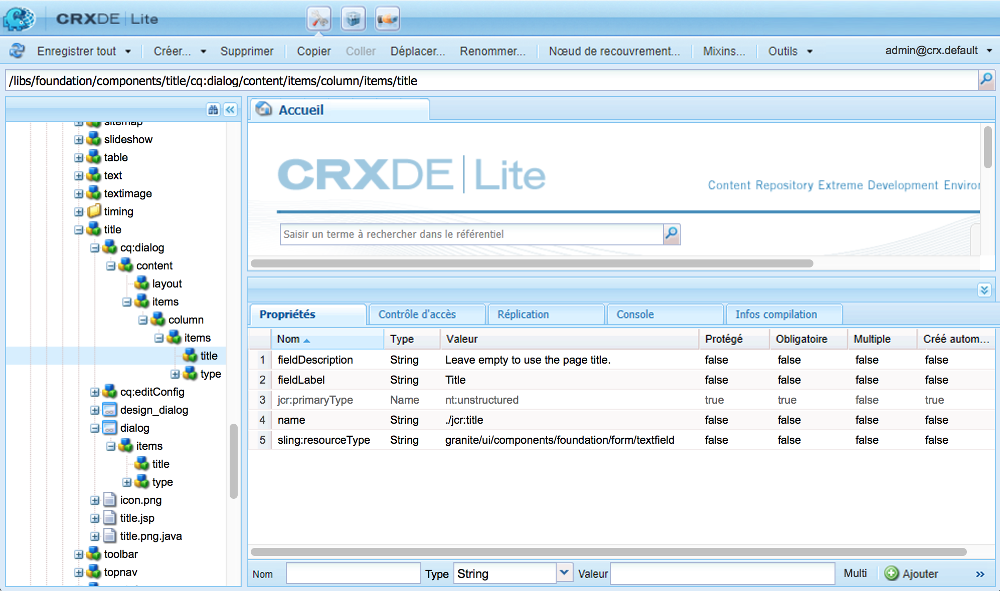

# Composants AEM - Notions de base{#aem-components-the-basics}

Lorsque vous commencez à développer de nouveaux composants, vous devez comprendre les bases de leur structure et de leur configuration.

Ce processus implique de lire la théorie et d’étudier le vaste éventail d’implémentations de composants possibles dans une instance AEM standard. Cette dernière approche est légèrement compliquée dans la mesure où AEM prend toujours en charge l’IU classique même s’il offre désormais une nouvelle IU tactile, moderne et standard.

## Présentation {#overview}

Cette section décrit les concepts et les problèmes majeurs et sert d’introduction aux informations dont vous avez besoin pour développer vos propres composants.

### Planification {#planning}

Avant de commencer à configurer ou coder réellement votre composant, vous devez vous demander :

* de quoi avez-vous besoin exactement pour le nouveau composant ?
   * Un cahier des charges clair facilitera toutes les étapes de développement, de test et de transfert. Vos besoins peuvent évoluer au fil du temps, mais le cahier des charges peut être mis à jour (bien que les modifications doivent également être documentées).
* Devez-vous créer votre composant de toutes pièces ou pouvez-vous hériter des bases d’un composant existant ?
   * Inutile de réinventer la roue.
   * There are several mechanisms provided by AEM to allow you to inherit and extend details from another component definition including override, overlay, and the [Sling Resource Merger](/help/sites-developing/sling-resource-merger.md).
* Votre composant demande-t-il une logique pour sélectionner/manipuler le contenu ?
   * La logique doit rester distincte de la couche de l’interface utilisateur. HTL est conçu pour faciliter cette distinction.
* Votre composant a-t-il besoin d’une mise en forme CSS ?
   * La mise en forme CSS doit rester distincte des définitions de composants. Définissez des conventions pour nommer vos éléments HTML afin de pouvoir les modifier au moyen de fichiers CSS externes.
* Quels aspects de sécurité dois-je prendre en considération ?
   * Voir [Liste de contrôle de sécurité - Bonnes pratiques de développement](/help/sites-administering/security-checklist.md#development-best-practices) pour plus de détails.

### IU tactile vs IU classique {#touch-enabled-vs-classic-ui}

Avant toute considération sérieuse sur le développement de composants, vous devez savoir quelle IU vos auteurs vont utiliser :

* **Interface utilisateur optimisée pour les écrans tactiles**
   [L’interface](/help/sites-developing/touch-ui-concepts.md) utilisateur standard est basée sur l’expérience utilisateur unifiée pour Adobe Marketing Cloud, en utilisant les technologies sous-jacentes de l’interface utilisateur [](/help/sites-developing/touch-ui-concepts.md#coral-ui) Coral et de l’interface utilisateur [](/help/sites-developing/touch-ui-concepts.md#granite-ui)Granite.
* **Interface utilisateur** utilisateur classique basée sur la technologie ExtJS qui a été abandonnée avec AEM 6.4.

Voir [Recommandations d’IU destinées aux clients](/help/sites-deploying/ui-recommendations.md) pour plus de détails.

Les composants peuvent être implémentés de manière à prendre en charge l’IU tactile, l’IU classique ou les deux. Lorsque vous examinez une instance standard, vous verrez également les composants prêts à l’emploi qui ont été conçus à l’origine pour l’interface utilisateur classique, l’interface utilisateur tactile ou les deux.

Pour cette raison, nous allons aborder les notions de base des deux interfaces et expliquer comment les reconnaître, dans cette page.

>[!NOTE]
>
>Adobe recommande de tirer parti de l’interface utilisateur tactile pour bénéficier des dernières technologies. [Les outils](modernization-tools.md) de modernisation AEM peuvent faciliter la migration.

### Logique de contenu et balisage de rendu  {#content-logic-and-rendering-markup}

Il est recommandé de garder le code responsable du balisage et du rendu distinct de celui qui contrôle la logique utilisée pour sélectionner le contenu du composant.

Cette approche est compatible avec [HTL](https://docs.adobe.com/content/help/fr-FR/experience-manager-htl/using/overview.html), un langage de modèle intentionnellement limité pour s’assurer qu’un vrai langage de programmation est utilisé afin de définir la logique métier sous-jacente. Cette logique (facultative) est appelée à partir de HTL avec une commande spécifique. Ce mécanisme met en évidence le code appelé pour une vue donnée et, si nécessaire, autorise une logique spécifique pour différentes vues du même composant.

### HTL vs JSP {#htl-vs-jsp}

HTL est un langage de modèle HTML introduit avec AEM 6.0.

Le choix entre l’utilisation de [HTL](https://docs.adobe.com/content/help/fr-FR/experience-manager-htl/using/overview.html) ou de JSP (Java Server Pages) lors du développement de vos propres composants devrait être simple à faire dans la mesure où HTL est aujourd’hui le langage de script recommandé pour AEM.

HTL et JSP peuvent être utilisés pour développer des composants de l’IU classique et de l’IU tactile. Bien que la tendance laisse à supposer que HTL est réservé à l’IU tactile et JSP à l’IU classique, c’est une idée reçue que l’on attribue à une synchronisation fortuite. L’IU tactile et HTL ont été intégrés à AEM à peu près en même temps. Puisque HTL est aujourd’hui le langage recommandé, il est utilisé pour les nouveaux composants, qui sont plus souvent développés pour l’IU tactile.

>[!NOTE]
>
>Les exceptions sont les champs de formulaire de base de l’IU Granite (utilisés dans les boîtes de dialogue). Ceux-ci nécessitent toujours l’utilisation de JSP.

### Développer ses propres composants {#developing-your-own-components}

Pour créer vos propres composants à utiliser dans une IU donnée, voir (après avoir lu la présente page) :

* [Composants AEM pour l’IU tactile](/help/sites-developing/developing-components.md)
* [Composants AEM pour l’IU classique](/help/sites-developing/developing-components-classic.md)

Pour commencer rapidement, une méthode consiste à copier un élément existant, puis à effectuer les modifications de votre choix. Pour apprendre à créer vos propres composants et les ajouter au système de paragraphes, voir :

* [Développement de composants](/help/sites-developing/developing-components-samples.md) (axé sur l’IU tactile)

### Déplacement de composants vers l’instance de publication {#moving-components-to-the-publish-instance}

Les composants de rendu de contenu doivent être déployés sur la même instance AEM que le contenu. Par conséquent, tous les composants utilisés pour la création et le rendu des pages sur l’instance d’auteur doivent être déployés sur l’instance de publication. Une fois déployés, les composants sont disponibles pour le rendu des pages activées.

Utilisez les outils suivants pour déplacer vos composants vers l’instance de publication :

* [Utilisez Package Manager](/help/sites-administering/package-manager.md) pour ajouter vos composants à un package et les déplacer vers une autre instance AEM.
* [Utilisez l’outil de réplication Activer l’arborescence](/help/sites-authoring/publishing-pages.md#manage-publication) pour répliquer les composants.

>[!NOTE]
>
>Ces mécanismes servent également à transférer votre composant entre d’autres instances, par exemple de l’instance de développement vers celle de test.

### Les composants à identifier dès le départ {#components-to-be-aware-of-from-the-start}

* Page:

   * AEM has the *page* component ( `cq:Page`).
   * C’est un type spécifique de ressource important dans la gestion de contenu.
      * Le composant page correspond à une page Web où est stocké du contenu pour votre site Web.

* Systèmes de paragraphe :

   * Le système de paragraphe est un composeur majeur d’un site Web car il gère une liste de paragraphes. Il sert à contenir et à structurer les composants individuels qui stockent le contenu réel.
   * Vous pouvez créer, déplacer, copier et supprimer des paragraphes dans le système de paragraphe.
   * Vous pouvez également sélectionner les composants pouvant être utilisés dans un système de paragraphe spécifique.
   * There are various paragraph systems available within a standard instance (for example `parsys`, ` [responsivegrid](/help/sites-authoring/responsive-layout.md)`).

## Structure {#structure}

La structure d’un composant AEM est puissante et flexible. Les principales considérations sont les suivantes :

* Type de ressource
* Définition d&#39;un composant
* Propriétés et nœuds enfants d’un composant
* Boîtes de dialogue
* Boîtes de dialogue de conception
* Disponibilité des composants
* Composants et contenu qu’ils créent

### Type de ressource {#resource-type}

Le type de ressource est un élément clé de la structure.

* La structure du contenu déclare les intentions.
* Le type de ressource les implémente.

Ceci est une abstraction qui permet de s’assurer que même lorsque l’aspect change au fil du temps, l’intention reste la durée.

### Définition d&#39;un composant {#component-definition}

#### Notions de base des composants {#component-basics}

La définition d’un composant peut être décomposée comme suit :

* Les composants AEM sont basés sur [Sling](https://sling.apache.org/documentation.html).
* Les composants AEM sont (généralement) stockés sous :

   * HTL: `/libs/wcm/foundation/components`
   * JSP: `/libs/foundation/components`

* Les composants spécifiques au projet/site sont (généralement) situés sous :

   * `/apps/<myApp>/components`

* Les composants standard d’AEM sont définis comme `cq:Component` et possèdent les éléments clés suivants :

   * propriétés jcr :

      A list of jcr properties; these are variable and some may be optional though the basic structure of a component node, its properties and subnodes are defined by the `cq:Component` definition

   * Ressources:

      Elles définissent les éléments statiques utilisés par le composant.

   * Scripts:

   Sont utilisés pour implémenter le comportement de l’instance résultante du composant.

* **Nœud racine** :

   * `<mycomponent> (cq:Component)` - Noeud de hiérarchie du composant.

* **Propriétés vitales** :

   * `jcr:title` - Titre du composant. Est par exemple utilisé comme une étiquette lorsque le composant est répertorié dans le navigateur de composants ou le sidekick.
   * `jcr:description` - Description du composant. Peut être utilisé comme indicateur de survol de la souris dans le navigateur de composants ou le sidekick.
   * IU classique :

      * `icon.png` - Icône pour ce composant.
      * `thumbnail.png` - Vignette affichée si le composant est listé dans le système de paragraphe.
   * IU tactile

      * Voir la section [Icône de composant dans l’IU tactile](/help/sites-developing/components-basics.md#component-icon-in-touch-ui) pour plus de détails.


* **Nœuds enfants essentiels** :

   * `cq:editConfig (cq:EditConfig)` - Définit les propriétés de modification du composant et permet au composant d’apparaître dans le navigateur de composants ou le sidekick.

      Remarque : si le composant possède une boîte de dialogue, elle apparaît automatiquement dans le navigateur de composants ou le sidekick, même si le cq:editConfig n’existe pas.

   * `cq:childEditConfig (cq:EditConfig)` - Contrôle les aspects de l&#39;interface utilisateur de création pour les composants enfants qui ne définissent pas leurs propres `cq:editConfig`.
   * Interface utilisateur optimisée pour les écrans tactiles :

      * `cq:dialog` ( `nt:unstructured`) - Boîte de dialogue pour ce composant. Définit l’interface permettant à l’utilisateur de configurer le composant et/ou de modifier le contenu.
      * `cq:design_dialog` ( `nt:unstructured`) - Modification de la conception pour ce composant
   * IU classique :

      * `dialog` ( `cq:Dialog`) - Boîte de dialogue pour ce composant. Définit l’interface permettant à l’utilisateur de configurer le composant et/ou de modifier le contenu.
      * `design_dialog` ( `cq:Dialog`) - Modification de la conception pour ce composant.


#### Icône de composant dans l’IU tactile {#component-icon-in-touch-ui}

L’icône ou l’abréviation du composant est définie au moyen des propriétés JCR du composant lorsque celui-ci est créé par le développeur. Ces propriétés sont évaluées dans l’ordre suivant, la première propriété valide trouvée étant utilisée.

1. `cq:icon` - Propriété de chaîne pointant vers une icône standard dans la bibliothèque [d&#39;interface utilisateur](https://helpx.adobe.com/experience-manager/6-5/sites/developing/using/reference-materials/coral-ui/coralui3/Coral.Icon.html) Coral pour s&#39;afficher dans le navigateur de composants
   * Utilisez la valeur de l’attribut HTML de l’icône Coral.
1. `abbreviation` - Propriété de chaîne servant à personnaliser l’abréviation du nom du composant dans le navigateur de composants
   * L’abréviation devrait être limitée à deux caractères.
   * Providing an empty string will build the abbreviation from first two characters of the `jcr:title` property.
      * Par exemple « Im » pour Image
      * Le titre localisé sera utilisé pour construire l’abréviation.
   * L’abréviation n’est traduite que si le composant possède une propriété `abbreviation_commentI18n`, qui est ensuite utilisée comme indice de traduction.
1. `cq:icon.png` ou `cq:icon.svg` - Icône pour ce composant, qui s&#39;affiche dans l&#39;explorateur de composants
   * La taille des icônes des composants standard est de 20 x 20 pixels.
      * Les icônes plus grandes sont réduites (côté client).
   * La couleur recommandée est rgb(112, 112, 112) > #707070
   * L’arrière-plan des icônes de composants standard est transparent.
   * Only `.png` and `.svg` files are supported.
   * If importing from the file system via Eclipse plugin, filenames need to be esacaped as `_cq_icon.png` or `_cq_icon.svg` for example.
   * `.png` prend le pas sur `.svg` si les deux sont présents

If none of the above properties ( `cq:icon`, `abbreviation`, `cq:icon.png` or `cq:icon.svg`) are found on the component:

* Le système recherche les mêmes propriétés sur les super-composants selon la propriété `sling:resourceSuperType`.
* If nothing or an empty abbreviation is found at the super component level, the system will build the abbreviation from the first letters of the `jcr:title` property of the current component.

Pour annuler l’héritage des icônes à partir de super-composants, la définition d’une propriété `abbreviation` vide sur le composant rétablit le comportement par défaut.

The [Component Console](/help/sites-authoring/default-components-console.md#component-details) displays how the icon for a particular component is defined.

#### Exemple d’icône SVG {#svg-icon-example}

```xml
<?xml version="1.0" encoding="utf-8"?>
<!DOCTYPE svg PUBLIC "-//W3C//DTD SVG 1.1//EN" "https://www.w3.org/Graphics/SVG/1.1/DTD/svg11.dtd">
<svg version="1.1" id="Layer_1" xmlns="https://www.w3.org/2000/svg" xmlns:xlink="https://www.w3.org/1999/xlink" x="0px" y="0px"
     width="20px" height="20px" viewBox="0 0 20 20" enable-background="new 0 0 20 20" xml:space="preserve">
    <ellipse cx="5" cy="5" rx="3" ry="3" fill="#707070"/>
    <ellipse cx="15" cy="5" rx="4" ry="4" fill="#707070"/>
    <ellipse cx="5" cy="15" rx="5" ry="5" fill="#707070"/>
    <ellipse cx="15" cy="15" rx="4" ry="4" fill="#707070"/>
</svg>
```

### Propriétés et nœuds enfants d’un composant {#properties-and-child-nodes-of-a-component}

La plupart des nœuds/propriétés nécessaires pour définir un composant sont communs aux deux interfaces utilisateur, les différences restant indépendantes pour que votre composant puisse fonctionner dans les deux environnements.

Un composant est un nœud de type `cq:Component` et possède les propriétés et les nœuds enfants suivants :

<table>
 <tbody>
  <tr>
   <td><strong>Nom <br /> </strong></td>
   <td><strong>Type <br /> </strong></td>
   <td><strong>Description <br /> </strong></td>
  </tr>
  <tr>
   <td>.<br /> </td>
   <td><code>cq:Component</code></td>
   <td>Composant en cours. A component is of node type <code>cq:Component</code>.<br /> </td>
  </tr>
  <tr>
   <td><code>componentGroup</code></td>
   <td><code>String</code></td>
   <td>Groupe sous lequel le composant peut être sélectionné dans le navigateur de composants (IU tactile) ou le sidekick (IU classique).<br /> Une valeur de <code>.hidden</code> est utilisée pour les composants qui ne peuvent pas être sélectionnés dans l’interface utilisateur, tels que les systèmes de paragraphe réels.</td>
  </tr>
  <tr>
   <td><code>cq:isContainer</code></td>
   <td><code>Boolean</code></td>
   <td>Indique si le composant est un composant de type « container » qui peut donc contenir d’autres composants, tels qu’un système de paragraphes.</td>
  </tr>
  <tr>
   <td> </td>
   <td> </td>
   <td> </td>
  </tr>
  <tr>
   <td><code>cq:dialog</code></td>
   <td><code>nt:unstructured</code> </td>
   <td>Définition de la boîte de dialogue de modification pour l’IU tactile.</td>
  </tr>
  <tr>
   <td><code>dialog</code></td>
   <td><code>cq:Dialog</code></td>
   <td>Définition de la boîte de dialogue de modification pour l’IU classique.</td>
  </tr>
  <tr>
   <td><code>cq:design_dialog</code></td>
   <td><code>nt:unstructured</code></td>
   <td>Définition de la boîte de dialogue de conception pour l’IU tactile.</td>
  </tr>
  <tr>
   <td><code>design_dialog</code></td>
   <td><code>cq:Dialog </code></td>
   <td>Définition de la boîte de dialogue de conception pour l’IU classique.<br /> </td>
  </tr>
  <tr>
   <td><code>dialogPath</code></td>
   <td><code>String</code></td>
   <td>Chemin d’accès à une boîte de dialogue permettant de prendre en charge un cas où le composant n’aurait pas de nœud de boîte de dialogue.<br /> </td>
  </tr>
  <tr>
   <td> </td>
   <td> </td>
   <td> </td>
  </tr>
  <tr>
   <td><code>cq:cellName</code></td>
   <td><code>String</code></td>
   <td>Si elle est définie, cette propriété sert d’ID de cellule. Pour plus d’informations, reportez-vous à <a href="https://helpx.adobe.com/experience-manager/kb/DesigneCellId.html">l’article de la base de connaissances sur la création d’ID de cellule de conception</a>.<br /> </td>
  </tr>
  <tr>
   <td><code>cq:childEditConfig</code></td>
   <td><code>cq:EditConfig</code></td>
   <td>Lorsque le composant est de type « container », par exemple un système de paragraphes, cela engendre la modification de la configuration des nœuds enfants.<br /> </td>
  </tr>
  <tr>
   <td><code>cq:editConfig</code></td>
   <td><code>cq:EditConfig</code></td>
   <td><a href="#edit-behavior">Modifier la configuration du composant</a>.<br /> </td>
  </tr>
  <tr>
   <td><code>cq:htmlTag</code></td>
   <td><code>nt:unstructured </code></td>
   <td>Renvoie des attributs de balise supplémentaires ajoutés à la balise html environnante. Active l’ajout d’attributs aux divs générés automatiquement.</td>
  </tr>
  <tr>
   <td><code>cq:noDecoration</code></td>
   <td><code>Boolean</code></td>
   <td>Si la valeur est true, le composant n’est pas rendu avec les classes div et css générées automatiquement.<br /> </td>
  </tr>
  <tr>
   <td><code>cq:template</code></td>
   <td><code>nt:unstructured</code></td>
   <td>S’il est détecté, ce nœud est utilisé comme modèle de contenu lorsque le composant est ajouté depuis le navigateur de composants ou le sidekick.</td>
  </tr>
  <tr>
   <td><code>cq:templatePath</code></td>
   <td><code>String</code></td>
   <td>Chemin d’accès à un nœud à utiliser comme modèle de contenu lorsque le composant est ajouté depuis le navigateur de composants ou le sidekick. Doit être un chemin absolu, non relatif au nœud du composant.<br />Sauf si vous souhaitez réutiliser du contenu déjà disponible ailleurs, cela n’est pas obligatoire, et <code>cq:template</code> est suffisant (voir ci-dessous).</td>
  </tr>
  <tr>
   <td><code>jcr:created</code></td>
   <td><code>Date</code></td>
   <td>Date de création du composant.<br /> </td>
  </tr>
  <tr>
   <td><code>jcr:description</code></td>
   <td><code>String</code></td>
   <td>Description du composant.<br /> </td>
  </tr>
  <tr>
   <td><code>jcr:title</code></td>
   <td><code>String</code></td>
   <td>Titre du composant.<br /> </td>
  </tr>
  <tr>
   <td><code>sling:resourceSuperType</code></td>
   <td><code>String</code></td>
   <td>Lorsqu’il est défini, le composant hérite de ce composant.<br /> </td>
  </tr>
  <tr>
   <td><code>virtual</code></td>
   <td><code>sling:Folder</code></td>
   <td>Permet la création de composants virtuels. Pour consulter un exemple, consultez le composant contact à l'adresse suivante :<br /> <code>/libs/foundation/components/profile/form/contact</code></td>
  </tr>
  <tr>
   <td><code>&lt;breadcrumb.jsp&gt;</code></td>
   <td><code>nt:file</code> </td>
   <td>Fichier de script.<br /> </td>
  </tr>
  <tr>
   <td><code>icon.png</code></td>
   <td><code>nt:file</code></td>
   <td>L’icône du composant apparaît à côté du titre dans le sidekick.<br /> </td>
  </tr>
  <tr>
   <td><code>thumbnail.png</code></td>
   <td><code>nt:file</code></td>
   <td>Vignette facultative affichée lorsque le composant est déplacé depuis le sidekick.<br /> </td>
  </tr>
 </tbody>
</table>

Si nous nous intéressons au composant **Text** (l’une ou l’autre des versions), nous pouvons voir ces éléments :

* HTL ( `/libs/wcm/foundation/components/text`)

   

* JSP ( `/libs/foundation/components/text`)

   

Les propriétés d’intérêt particulier sont les suivantes :

* `jcr:title` - titre du composant. Il peut être utilisé pour identifier le composant, par exemple. Il est visible dans la liste du navigateur de composants dans le navigateur ou le sidekick
* `jcr:description` - description du composant. Peut être utilisée comme indice de survol de la souris dans la liste des composants du sidekick
* `sling:resourceSuperType` - indique le chemin de l’héritage lors de l’extension d’un composant (en remplaçant une définition)

Les nœuds d’enfant d’un intérêt particulier sont les suivants :

* `cq:editConfig` ( `cq:EditConfig`) - contrôle les aspects visuels. Par exemple, il peut définir l’apparence d’une barre ou d’un widget, ou peut ajouter des contrôles personnalisés
* `cq:childEditConfig` ( `cq:EditConfig`) - contrôle les aspects visuels pour les composants enfants qui n&#39;ont pas leurs propres définitions
* Interface utilisateur optimisée pour les écrans tactiles :
   * `cq:dialog` ( `nt:unstructured`) - définit la boîte de dialogue de modification du contenu de ce composant
   * `cq:design_dialog` ( `nt:unstructured`) - spécifie les options de modification de la conception pour ce composant
* IU classique :
   * `dialog` ( `cq:Dialog`) - définit la boîte de dialogue de modification du contenu du composant (spécifique à l’IU classique)
   * `design_dialog` ( `cq:Dialog`) - spécifie les options de modification de la conception pour ce composant
   * `icon.png` - fichier graphique à utiliser comme icône pour le composant dans le sidekick
   * `thumbnail.png` - fichier graphique à utiliser comme vignette pour le composant en le faisant glisser depuis le sidekick

### Boîtes de dialogue {#dialogs}

Les boîtes de dialogue constituent un élément majeur de votre composant car elles fournissent une interface permettant aux auteurs de configurer et de commenter ce composant.

En fonction de la complexité du composant, la boîte de dialogue peut nécessiter un ou plusieurs onglets pour s’assurer qu’elle soit de petite taille et pour trier les champs de saisie.

Les définitions de boîte de dialogue sont spécifiques à l’IU :

>[!NOTE]
>
>* Pour des raisons de compatibilité, l’IU tactile peut utiliser la définition d’une boîte de dialogue d’IU classique, si aucune boîte de dialogue n’a été définie pour l’IU tactile.
>* L’[outil de conversion de boîtes de dialogue](/help/sites-developing/dialog-conversion.md) sert à étendre/convertir les composants dont les boîtes de dialogue sont seulement définies pour l’IU classique.

>


* Interface utilisateur optimisée pour les écrans tactiles
   * `cq:dialog` ( `nt:unstructured`) nodes:
      * définissent la boîte de dialogue pour la modification du contenu de ce composant
      * sont spécifiques à l’IU tactile
      * sont définis à l’aide de composants de l’IU Granite
      * have a property `sling:resourceType`, as standard Sling content structure
      * peuvent avoir une propriété `helpPath` pour définir la ressource d’aide contextuelle (chemin absolu ou relatif) accessible lorsque l’icône d’aide (l’icône ? ) est sélectionnée.
         * Pour les composants prêts à l’emploi, il s’agit souvent d’une page dans la documentation.
         * Si aucun `helpPath` n’est spécifié, l’URL par défaut (page de présentation de la documentation) est affichée.

   

   Dans la boîte de dialogue, des champs individuels sont définis :

   

* IU classique
   * `dialog` ( `cq:Dialog`) nodes
      * définissent la boîte de dialogue pour la modification du contenu de ce composant
      * spécifiques à l’IU classique
      * sont définis à l’aide de widgets ExtJS
      * possèdent une propriété `xtype` qui fait référence à ExtJS
      * peuvent avoir une propriété `helpPath` pour définir la ressource d’aide contextuelle (chemin absolu ou relatif) accessible lorsque le bouton **Aide** est sélectionné.
         * Pour les composants prêts à l’emploi, il s’agit souvent d’une page dans la documentation.
         * Si aucun `helpPath` n’est spécifié, l’URL par défaut (page de présentation de la documentation) est affichée.

   

   Dans la boîte de dialogue, des champs individuels sont définis :

   

   Dans une boîte de dialogue classique :

   * vous pouvez créer une boîte de dialogue définie en tant que `cq:Dialog` qui fournira un seul onglet (comme dans le composant text). Si vous avez besoin de plusieurs onglets, comme dans le composant textimage, la boîte de dialogue peut être définie comme `cq:TabPanel`.
   * a `cq:WidgetCollection` ( `items`) is used to provide a base for either input fields ( `cq:Widget`) or further tabs ( `cq:Widget`). Cette hiérarchie peut être étendue.


### Boîtes de dialogue de conception {#design-dialogs}

Les boîtes de dialogue de conception sont très similaires aux boîtes de dialogue utilisées pour modifier et configurer le contenu, mais elles fournissent une interface permettant aux auteurs de configurer et de fournir des détails de conception pour ce composant.

[Les boîtes de dialogue de conception sont disponibles en mode Conception](/help/sites-authoring/default-components-designmode.md), bien qu’elles ne soient pas nécessaires pour tous les composants. Par exemple, les composants **Title** et **Image** ont tous deux des boîtes de dialogue de conception, alors que le composant **Text** n’en a pas.

La boîte de dialogue de conception pour le système de paragraphe (par exemple parsys) est un cas particulier. Elle permet à l’utilisateur de définir d’autres composants spécifiques à rendre sélectionnables (depuis le navigateur de composants ou le sidekick) sur la page.

### Ajout d’un composant au système de paragraphe {#adding-your-component-to-the-paragraph-system}

Une fois qu’un composant a été défini, il doit être disponible pour utilisation. Pour rendre un composant sélectionnable dans un système de paragraphes, vous pouvez :

1. ouvrir le [mode Conception ](/help/sites-authoring/default-components-designmode.md) pour une page et activer le composant requis ;
1. ajouter le(s) composant(s) requis à la propriété `components` de votre définition de modèle sous :

   `/etc/designs/<*yourProject*>/jcr:content/<*yourTemplate*>/par`

   Pour obtenir un exemple, reportez-vous à la section :

   `/etc/designs/geometrixx/jcr:content/contentpage/par`

   

### Composants et contenu qu’ils créent {#components-and-the-content-they-create}

If we create and configure an instance of the **Title** component on the page: `<content-path>/Prototype.html`

* Interface utilisateur optimisée pour les écrans tactiles

   

* IU classique

   

Ensuite, nous pouvons voir la structure du contenu créé dans le référentiel :


En particulier, si vous vous intéressez au texte actuel d’un composant **Title** :

* la définition (pour les deux interfaces utilisateur) possède la propriété `name`= `./jcr:title`

   * `/libs/foundation/components/title/cq:dialog/content/items/column/items/title`
   * `/libs/foundation/components/title/dialog/items/title`

* dans le contenu, ceci génère la propriété `jcr:title` qui stocke le contenu de l’auteur.

Les propriétés définies dépendent des définitions individuelles. Bien qu’elles puissent être plus complexes que dans les exemples ci-dessus, elles suivent toujours les mêmes principes simples.

## Hiérarchie et héritage des composants {#component-hierarchy-and-inheritance}

Les composants d’AEM sont soumis à trois hiérarchies différentes :

* **Hiérarchie du type de ressource**

   Cette méthode est utilisée pour étendre les composants à l’aide de la propriété `sling:resourceSuperType`. Cela permet au composant d’hériter d’attributs. Par exemple, un composant Text hérite de divers attributs du composant standard.

   * scripts (résolus par Sling)
   * boîtes de dialogue
   * descriptions (y compris les images miniatures, les icônes, etc.)

* **Hiérarchie des conteneurs**

   Il est utilisé pour renseigner les paramètres de configuration du composant enfant et est le plus souvent utilisé dans un scénario parsys.

   Par exemple, les paramètres de configuration des boutons de la barre de modification, la disposition de jeux de contrôles (barres de modification, survol), la disposition des boîtes de dialogue (ancrée, flottante) peuvent être définis sur le composant parent.

   Configuration settings (related to edit functionality) in `cq:editConfig` and `cq:childEditConfig` are propagated.

* **Inclure la hiérarchie**

   Ceci est imposé au moment de l’exécution par la séquence d’inclusion.

   Cette hiérarchie est utilisée par le concepteur, qui à son tour sert de base pour divers aspects de conception du rendu, notamment les informations de mise en page, les informations css, les composants disponibles dans un parsys, etc.

## Comportement de modification {#edit-behavior}

Cette section explique comment configurer le comportement de modification d’un composant. Cela inclut les attributs tels que les actions disponibles pour le composant, les caractéristiques de l’éditeur local et les écouteurs liés aux événements sur le composant.

La configuration est commune à l’IU tactile et à l’IU classique, à l’exception de certaines différences.

Le comportement de modification d’un composant est configuré en ajoutant un nœud `cq:editConfig` de type `cq:EditConfig` en dessous du nœud de composant (de type `cq:Component`) et en ajoutant des propriétés spécifiques et des nœuds enfants. Les propriétés et les nœuds enfants suivants sont disponibles :

* [ `cq:editConfig` propriétés](#configuring-with-cq-editconfig-properties)du noeud :

   * `cq:actions` ( `String array`) : définit les actions qui peuvent être exécutées sur le composant.
   * `cq:layout` ( `String`) : : définit comment le composant est modifié dans l’interface utilisateur classique.
   * `cq:dialogMode` ( `String`) : définit comment la boîte de dialogue du composant s’ouvre dans l’interface utilisateur classique

      * Dans l’IU tactile, les boîtes de dialogue flottent toujours en mode bureau et s’ouvrent automatiquement en mode plein écran sur mobile.
   * `cq:emptyText` ( `String`) : définit le texte qui s’affiche lorsqu’aucun contenu visuel n’est présent.
   * `cq:inherit` ( `Boolean`) : définit si les valeurs manquantes sont héritées du composant dont elle hérite.
   * `dialogLayout` (chaîne) : définit le mode d’ouverture de la boîte de dialogue.


* [ `cq:editConfig` noeuds](#configuring-with-cq-editconfig-child-nodes)enfants :

   * `cq:dropTargets` (type de noeud `nt:unstructured`) : définit une liste de cibles de dépôt qui peut accepter une goutte à partir d’une ressource de l’outil de recherche de contenu.

      * Les cibles de dépôt multiples sont uniquement disponibles dans l’IU classique.
      * Dans l’IU tactile, une seule cible est autorisée.
   * `cq:actionConfigs` (type de noeud `nt:unstructured`) : définit une liste de nouvelles actions annexées à la liste cq:actions.
   * `cq:formParameters` (type de noeud `nt:unstructured`) : définit des paramètres supplémentaires qui sont ajoutés au formulaire de boîte de dialogue.
   * `cq:inplaceEditing` (type de noeud `cq:InplaceEditingConfig`) : définit une configuration de modification statique pour le composant.
   * `cq:listeners` (type de noeud `cq:EditListenersConfig`) : définit ce qui se produit avant ou après une action sur le composant.


>[!NOTE]
>
>Dans cette page, un nœud (propriétés et nœuds enfants) est représenté au format XML, comme indiqué dans l’exemple suivant.

```
<jcr:root xmlns:cq="https://www.day.com/jcr/cq/1.0" xmlns:jcr="https://www.jcp.org/jcr/1.0"
    cq:actions="[edit]"
    cq:dialogMode="floating"
    cq:layout="editbar"
    jcr:primaryType="cq:EditConfig">
    <cq:listeners
        jcr:primaryType="cq:EditListenersConfig"
        afteredit="REFRESH_PAGE"/>
</jcr:root>
```

Il existe de nombreuses configurations dans le référentiel. Vous pouvez facilement rechercher des propriétés spécifiques ou des nœuds enfants :

* To look for a property of the `cq:editConfig` node, e.g. `cq:actions`, you can use the Query tool in **CRXDE Lite** and search with the following XPath query string:

   `//element(cq:editConfig, cq:EditConfig)[@cq:actions]`

* To look for a child node of `cq:editConfig`, e.g. you can search for `cq:dropTargets`, which is of type `cq:DropTargetConfig`; you can use the Query tool in** CRXDE Lite** and search with the following XPath query string:

   `//element(cq:dropTargets, cq:DropTargetConfig)`

### Configuration avec les propriétés cq:EditConfig {#configuring-with-cq-editconfig-properties}

### cq:actions {#cq-actions}

The `cq:actions` property ( `String array`) defines one or several actions that can be performed on the component. Les valeurs suivantes sont configurables :

<table>
 <tbody>
  <tr>
   <td><strong>Valeur de la propriété</strong></td>
   <td><strong>Description</strong></td>
  </tr>
  <tr>
   <td><code>text:&lt;some text&gt;</code></td>
   <td>Affiche la valeur de texte statique &lt;du texte&gt;<br /> visible uniquement dans l’interface utilisateur classique. L’IU tactile n’affiche pas les actions dans un menu contextuel, donc ceci n’est pas applicable.</td>
  </tr>
  <tr>
   <td>-</td>
   <td>Ajoute un espaceur.<br /> Uniquement visible dans l’interface utilisateur classique. L’IU tactile n’affiche pas les actions dans un menu contextuel, donc ceci n’est pas applicable.</td>
  </tr>
  <tr>
   <td><code>edit</code></td>
   <td>Ajoute un bouton pour modifier le composant.</td>
  </tr>
      <tr>
    <td><code>editannotate</code></td>
    <td>Ajoute un bouton pour modifier le composant et autoriser les <a href="/help/sites-authoring/annotations.md">annotations</a>.</td>
   </tr>
  <tr>
   <td><code>delete</code></td>
   <td>Ajoute un bouton pour supprimer le composant</td>
  </tr>
  <tr>
   <td><code>insert</code></td>
   <td>Ajoute un bouton pour insérer un nouveau composant avant le composant actif.</td>
  </tr>
  <tr>
   <td><code>copymove</code></td>
   <td>Ajoute un bouton pour copier et couper le composant.</td>
  </tr>
 </tbody>
</table>

La configuration suivante ajoute un bouton de modification, un espacement, ainsi qu’un bouton de suppression et d’insertion à la barre de modification du composant :

```
<jcr:root xmlns:cq="https://www.day.com/jcr/cq/1.0" xmlns:jcr="https://www.jcp.org/jcr/1.0"
    cq:actions="[edit,-,delete,insert]"
    cq:layout="editbar"
    jcr:primaryType="cq:EditConfig"/>
```

La configuration suivante ajoute le texte « Configurations héritées du framework de base » à la barre de modification des composants :

```
<jcr:root xmlns:cq="https://www.day.com/jcr/cq/1.0" xmlns:jcr="https://www.jcp.org/jcr/1.0"
    cq:actions="[text:Inherited Configurations from Base Framework]"
    cq:layout="editbar"
    jcr:primaryType="cq:EditConfig"/>
```

### cq:layout (IU classique uniquement) {#cq-layout-classic-ui-only}

The `cq:layout` property ( `String`) defines how the component can be edited in the classic UI. Les valeurs suivantes sont disponibles :

<table>
 <tbody>
  <tr>
   <td><strong>Valeur de la propriété</strong></td>
   <td><strong>Description</strong></td>
  </tr>
  <tr>
   <td><code>rollover</code></td>
   <td>Valeur par défaut. L'édition du composant est accessible "sur souris" par le biais de clics et/ou d'un menu contextuel.<br /> Pour une utilisation avancée, notez que l’objet client correspondant est : <code>CQ.wcm.EditRollover</code>.</td>
  </tr>
  <tr>
   <td><code>editbar</code></td>
   <td>L'édition des composants est accessible via une barre d'outils.<br /> Pour une utilisation avancée, notez que l’objet client correspondant est : <code>CQ.wcm.EditBar</code>.</td>
  </tr>
  <tr>
   <td><code>auto</code></td>
   <td>Le choix est laissé au code côté client.</td>
  </tr>
 </tbody>
</table>

>[!NOTE]
>
>Les concepts de survol et de modification ne sont pas applicables dans l’IU tactile.

La configuration suivante ajoute un bouton de modification à la barre de modification du composant :

```
<jcr:root xmlns:cq="https://www.day.com/jcr/cq/1.0" xmlns:jcr="https://www.jcp.org/jcr/1.0"
    cq:actions="[edit]"
    cq:layout="editbar"
    jcr:primaryType="cq:EditConfig">
</jcr:root>
```

### cq:dialogMode (IU classique uniquement) {#cq-dialogmode-classic-ui-only}

Le composant peut être lié à une boîte de dialogue de modification. The `cq:dialogMode` property ( `String`) defines how the component dialog will be opened in the classic UI. Les valeurs suivantes sont disponibles :

<table>
 <tbody>
  <tr>
   <td><strong>Valeur de la propriété</strong></td>
   <td><strong>Description</strong></td>
  </tr>
  <tr>
   <td><code>floating</code></td>
   <td>La boîte de dialogue est flottante.<br /> </td>
  </tr>
  <tr>
   <td><code>inline</code></td>
   <td>(valeur par défaut). La boîte de dialogue est ancrée sur le composant.<br /> </td>
  </tr>
  <tr>
   <td><code>auto</code></td>
   <td>Si la largeur du composant est inférieure à la <code>CQ.themes.wcm.EditBase.INLINE_MINIMUM_WIDTH</code> valeur côté client, la boîte de dialogue est flottante, sinon elle est intégrée.</td>
  </tr>
 </tbody>
</table>

>[!NOTE]
>
>Dans l’IU tactile, les boîtes de dialogue flottent toujours en mode bureau et s’ouvrent automatiquement en mode plein écran sur mobile.

La configuration suivante définit une barre de modification avec un bouton de modification et une boîte de dialogue flottante :

```
<jcr:root xmlns:cq="https://www.day.com/jcr/cq/1.0" xmlns:jcr="https://www.jcp.org/jcr/1.0"
    cq:actions="[edit]"
    cq:dialogMode="floating"
    cq:layout="editbar"
    jcr:primaryType="cq:EditConfig">
</jcr:root>
```

### cq:emptyText {#cq-emptytext}

The `cq:emptyText` property ( `String`) defines text that is displayed when no visual content is present. It defaults to: `Drag components or assets here`.

### cq:inherit {#cq-inherit}

The `cq:inherit` property ( `boolean`) defines whether missing values are inherited from the component that it inherits from. It defaults to `false`.

### dialogLayout {#dialoglayout}

La propriété `dialogLayout` définit la façon dont une boîte de dialogue doit s’ouvrir par défaut.

* A value of `fullscreen` opens the dialog in full screen.
* Une valeur vide ou absente ouvre par défaut la boîte de dialogue normalement.
* Notez que l’utilisateur peut toujours basculer en mode plein écran dans la boîte de dialogue.
* Ne s’applique pas à l’IU classique.

### Configuration avec des nœuds enfants cq:EditConfig {#configuring-with-cq-editconfig-child-nodes}

### cq:dropTargets {#cq-droptargets}

The `cq:dropTargets` node (node type `nt:unstructured`) defines a list of drop targets that can accept a drop from an asset dragged from the content finder. Il sert de collection de nœuds de type `cq:DropTargetConfig`.

>[!NOTE]
>
>Les cibles de dépôt multiples sont uniquement disponibles dans l’IU classique.
>
>Dans l’IU tactile, seule la première cible est utilisée.

Each child node of type `cq:DropTargetConfig` defines a drop target in the component. Le nom du nœud est important car il doit être utilisé dans JSP, comme suit, pour générer le nom de classe CSS affecté à l’élément DOM qui est la cible de dépôt réelle :

```
<drop target css class> = <drag and drop prefix> +
 <node name of the drop target in the edit configuration>
```

La propriété `<drag and drop prefix>` Java définit les éléments suivants :

`com.day.cq.wcm.api.components.DropTarget.CSS_CLASS_PREFIX`.

For example, the class name is defined as follows in the JSP of the Download component
( `/libs/foundation/components/download/download.jsp`), where `file` is the node name of the drop target in the edit configuration of the Download component:

`String ddClassName = DropTarget.CSS_CLASS_PREFIX + "file";`

Le nœud de type `cq:DropTargetConfig` doit posséder les propriétés suivantes :

<table>
 <tbody>
  <tr>
   <td><strong>Nom de la propriété</strong></td>
   <td><strong>Valeur de la propriété<br /> </strong></td>
  </tr>
  <tr>
   <td><code>accept</code></td>
   <td>Regex appliqué au type MIME de la ressource pour valider si la suppression est autorisée.</td>
  </tr>
  <tr>
   <td><code>groups</code></td>
   <td>Tableau de Populations cibles de dépôt. Chaque groupe doit correspondre au type de groupe défini dans l’extension du Content Finder et associé aux ressources.</td>
  </tr>
  <tr>
   <td><code>propertyName</code></td>
   <td>Nom de la propriété qui sera mise à jour après une suppression valide.</td>
  </tr>
 </tbody>
</table>

La configuration suivante est tirée du composant Télécharger. Elle active n’importe quelle ressource (le type mime peut être n’importe quelle chaîne) à partir du groupe `media` à déposer à partir du Content Finder dans le composant. Après le dépôt, la propriété de composant `fileReference` est mise à jour :

```
    <cq:dropTargets jcr:primaryType="nt:unstructured">
        <file
            jcr:primaryType="cq:DropTargetConfig"
            accept="[.*]"
            groups="[media]"
            propertyName="./fileReference"/>
    </cq:dropTargets>
```

### cq:actionConfigs (IU classique uniquement) {#cq-actionconfigs-classic-ui-only}

The `cq:actionConfigs` node (node type `nt:unstructured`) defines a list of new actions that are appended to the list defined by the `cq:actions` property. Chaque nœud enfant de `cq:actionConfigs` définit une nouvelle action en définissant un widget.

L’exemple de configuration suivant définit un nouveau bouton (avec un séparateur pour l’IU classique) :

* un séparateur, défini par le xtype `tbseparator`;

   * Applicable uniquement dans l’IU classique.
   * Cette définition est ignorée par l’IU tactile dans la mesure où les xtypes sont ignorés (et les séparateurs sont inutiles car la barre d’outils d’action est construite différemment dans l’IU tactile).

* a button named **Manage comments** that runs the handler function `CQ_collab_forum_openCollabAdmin()`.

```
<jcr:root xmlns:cq="https://www.day.com/jcr/cq/1.0" xmlns:jcr="https://www.jcp.org/jcr/1.0" xmlns:nt="https://www.jcp.org/jcr/nt/1.0"
    cq:actions="[EDIT,COPYMOVE,DELETE,INSERT]"
    jcr:primaryType="cq:EditConfig">
    <cq:actionConfigs jcr:primaryType="nt:unstructured">
        <separator0
            jcr:primaryType="nt:unstructured"
            xtype="tbseparator"/>
        <manage
            jcr:primaryType="nt:unstructured"
            handler="function(){CQ_collab_forum_openCollabAdmin();}"
            text="Manage comments"/>
    </cq:actionConfigs>
</jcr:root>
```

>[!NOTE]
>
>Voir [Ajout d’une nouvelle action à une barre d’outils de composants](/help/sites-developing/customizing-page-authoring-touch.md#add-new-action-to-a-component-toolbar) à titre d’exemple pour l’IU tactile.

### cq:formParameters {#cq-formparameters}

The `cq:formParameters` node (node type `nt:unstructured`) defines additional parameters that are added to the dialog form. Chaque propriété est mappée à un paramètre de formulaire.

La configuration suivante ajoute un paramètre appelé `name`, défini avec la valeur `photos/primary` dans le formulaire de boîte de dialogue :

```
    <cq:formParameters
        jcr:primaryType="nt:unstructured"
        name="photos/primary"/>
```

### cq:inplaceEditing {#cq-inplaceediting}

The `cq:inplaceEditing` node (node type `cq:InplaceEditingConfig`) defines an inplace editing configuration for the component. Il peut posséder les propriétés suivantes :

<table>
 <tbody>
  <tr>
   <td><strong>Nom de la propriété</strong></td>
   <td><strong>Valeur de la propriété<br /> </strong></td>
  </tr>
  <tr>
   <td><code>active</code></td>
   <td>(<code>boolean</code>) True pour activer la modification statique du composant.</td>
  </tr>
  <tr>
   <td><code>configPath</code></td>
   <td>(<code>String</code>) Path of the editor configuration. La configuration peut être spécifiée par un nœud de configuration.</td>
  </tr>
  <tr>
   <td><code>editorType</code></td>
   <td><p>(<code>String</code>) Type d’éditeur. Les types disponibles sont les suivants :</p>
    <ul>
     <li>texte brut : à utiliser pour le contenu non HTML.<br /> </li>
     <li>titre : est un éditeur de texte brut amélioré qui convertit les titres graphiques en texte brut avant que la modification ne commence. Utilisé par le composant title de Geometrixx.<br /> </li>
     <li>text: to be used for HTML content (uses the Rich Text Editor).<br /> </li>
    </ul> </td>
  </tr>
 </tbody>
</table>

La configuration suivante active la modification locale du composant et définit `plaintext` comme type d’éditeur :

```
    <cq:inplaceEditing
        jcr:primaryType="cq:InplaceEditingConfig"
        active="{Boolean}true"
        editorType="plaintext"/>
```

### cq:listeners {#cq-listeners}

The `cq:listeners` node (node type `cq:EditListenersConfig`) defines what happens before or after an action on the component. Le tableau suivant définit ses propriétés possibles.

<table>
 <tbody>
  <tr>
   <td><strong>Nom de la propriété</strong></td>
   <td><strong>Valeur de la propriété<br /> </strong></td>
   <td><p><strong>Valeur par défaut</strong></p> <p>(IU classique uniquement)</p> </td>
  </tr>
  <tr>
   <td><code>beforedelete</code></td>
   <td>Le gestionnaire est déclenché avant que le composant ne soit supprimé.<br /> </td>
   <td> </td>
  </tr>
  <tr>
   <td><code>beforeedit</code></td>
   <td>Le gestionnaire est déclenché avant la modification du composant.</td>
   <td> </td>
  </tr>
  <tr>
   <td><code>beforecopy</code></td>
   <td>Le gestionnaire est déclenché avant la copie du composant.</td>
   <td> </td>
  </tr>
  <tr>
   <td><code>beforemove</code></td>
   <td>Le gestionnaire est déclenché avant le déplacement du composant.</td>
   <td> </td>
  </tr>
  <tr>
   <td><code>beforeinsert</code></td>
   <td>Le gestionnaire est déclenché avant l'insertion du composant.<br /> Valide uniquement pour l’IU tactile.</td>
   <td> </td>
  </tr>
  <tr>
   <td><code>beforechildinsert</code></td>
   <td>Le gestionnaire est déclenché avant que le composant ne soit inséré dans un autre composant (conteneurs uniquement).</td>
   <td> </td>
  </tr>
  <tr>
   <td><code>afterdelete</code></td>
   <td>Le gestionnaire est déclenché après la suppression du composant.</td>
   <td><code>REFRESH_SELF</code></td>
  </tr>
  <tr>
   <td><code>afteredit</code></td>
   <td>Le gestionnaire est déclenché après la modification du composant.</td>
   <td><code>REFRESH_SELF</code></td>
  </tr>
  <tr>
   <td><code>aftercopy</code></td>
   <td>Le gestionnaire est déclenché après la copie du composant.</td>
   <td><code>REFRESH_SELF</code></td>
  </tr>
  <tr>
   <td><code>afterinsert</code></td>
   <td>Le gestionnaire est déclenché après l'insertion du composant.</td>
   <td><code>REFRESH_INSERTED</code></td>
  </tr>
  <tr>
   <td><code>aftermove</code></td>
   <td>Le gestionnaire est déclenché après le déplacement du composant.</td>
   <td><code>REFRESH_SELFMOVED</code></td>
  </tr>
  <tr>
   <td><code>afterchildinsert</code></td>
   <td>Le gestionnaire est déclenché après l’insertion du composant dans un autre composant (conteneurs uniquement).</td>
   <td> </td>
  </tr>
 </tbody>
</table>

>[!NOTE]
>
>The `REFRESH_INSERTED` and `REFRESH_SELFMOVED` handlers are only available in the classic UI.

>[!NOTE]
>
>Les valeurs par défaut des écouteurs ne sont définies que dans l’IU classique.

>[!NOTE]
>
>Dans le cas des composants imbriqués, certaines restrictions existent sur les actions définies en tant que propriétés sur le nœud `cq:listeners` :
>
>* For nested components, the values of the following properties *must* be `REFRESH_PAGE`: >
>  * `aftermove`
>  * `aftercopy`


Le gestionnaire d’événements peut être mis en œuvre avec une implémentation personnalisée. Par exemple (où `project.customerAction` est une méthode statique) :

`afteredit = "project.customerAction"`

The following example is equivalent to the `REFRESH_INSERTED` configuration:

`afterinsert="function(path, definition) { this.refreshCreated(path, definition); }"`

>[!NOTE]
>
>For the classic UI, to see which parameters can be used in the handlers, refer to the `before<action>` and `after<action>` events section of the [ `CQ.wcm.EditBar`](https://helpx.adobe.com/experience-manager/6-5/sites/developing/using/reference-materials/widgets-api/index.html?class=CQ.wcm.EditBar) and [ `CQ.wcm.EditRollover`](https://helpx.adobe.com/experience-manager/6-5/sites/developing/using/reference-materials/widgets-api/index.html?class=CQ.wcm.EditRollover) widget documentation.

Avec la configuration suivante, la page est actualisée après la suppression, la modification, l’insertion ou le déplacement du composant :

```
    <cq:listeners
        jcr:primaryType="cq:EditListenersConfig"
        afterdelete="REFRESH_PAGE"
        afteredit="REFRESH_PAGE"
        afterinsert="REFRESH_PAGE"
        afterMove="REFRESH_PAGE"/>
```
