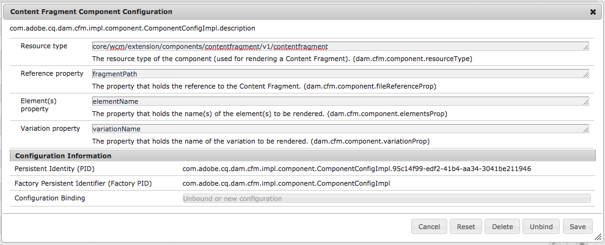

# Fragments de contenu – Configuration des composants pour le rendu{#content-fragments-configuring-components-for-rendering}

Il existe plusieurs [services avancés](/help/sites-developing/content-fragments-config-components-rendering.md#definition-of-advanced-services-that-need-configuration) liés au rendu des fragments de contenu. Pour l’utilisation de ces services, les types de ressources de ces composants doivent être connus de la structure de fragments de contenu.

Pour ce faire, définissez la [Configuration du composant de fragment de contenu du service OSGi](#osgi-service-content-fragment-component-configuration).

>[!CAUTION]
>
>Si vous n’avez pas besoin des [services avancés](/help/sites-developing/content-fragments-config-components-rendering.md#definition-of-advanced-services-that-need-configuration) décrits ci-dessous, vous pouvez ignorer cette configuration.

>[!CAUTION]
>
>Lorsque vous étendez ou utilisez les composants prêts à l’emploi, il n’est pas recommandé de modifier la configuration.

>[!CAUTION]
>
>Vous pouvez créer de A à Z un composant n’utilisant que l’API de fragments de contenu, sans services avancés. Cependant, dans ce cas, vous devrez développer votre composant de sorte qu’il traite le traitement approprié.
>
>Il est donc recommandé d’utiliser les composants principaux.

## Définition des services avancés nécessitant une configuration {#definition-of-advanced-services-that-need-configuration}

Les services qui nécessitent l’enregistrement d’un composant sont les suivants :

* Déterminer correctement les dépendances au cours de la publication (c’est-à-dire s’assurer que les fragments et les modèles peuvent être publiés automatiquement avec une page s’ils ont été modifiés depuis la dernière publication).
* Prise en charge des fragments de contenu dans la recherche de texte intégral.
* Gestion/traitement du *contenu intermédiaire.*
* Gestion/traitement des *ressources multimédias mixtes.*
* Purge par le Dispatcher des fragments référencés (si une page contenant un fragment est republiée).
* Utilisation du rendu basé sur les paragraphes.

Si vous avez besoin d’une ou de plusieurs de ces fonctionnalités, il est alors (généralement) plus facile d’utiliser cette fonctionnalité prête à l’emploi, au lieu de la développer en partant de zéro.

## Service OSGi – Configuration du composant de fragment de contenu {#osgi-service-content-fragment-component-configuration}

La configuration doit être liée à la **Configuration du composant de fragment de contenu** du service OSGi :

`com.adobe.cq.dam.cfm.impl.component.ComponentConfigImpl`

>[!NOTE]
>
>Consultez [Configuration d’OSGi](/help/sites-deploying/configuring-osgi.md) pour des détails complets.

Par exemple :



La configuration OSGi est la suivante :

<table>
 <tbody>
  <tr>
   <td>Libellé</td>
   <td>Configuration OSGi<br /> </td>
   <td>Description</td>
  </tr>
  <tr>
   <td><strong>Type de ressource</strong></td>
   <td><code>dam.cfm.component.resourceType</code></td>
   <td>Le type de ressource à enregistrer ; par exemple, <br />. <p><span class="cmp-examples-demo__property-value"><code>core/wcm/components/contentfragment/v1/contentfragment</code></code></p> </td>
  </tr>
  <tr>
   <td><strong>Propriété de référence</strong></td>
   <td><code>dam.cfm.component.fileReferenceProp</code></td>
   <td>Le nom de la propriété qui contient la référence au fragment ; par exemple, <code>fragmentPath</code> ou <code>fileReference</code></td>
  </tr>
  <tr>
   <td><strong>Propriété d’élément(s)</strong></td>
   <td><code>dam.cfm.component.elementsProp</code></td>
   <td>Le nom de la propriété qui contient le ou les noms des éléments dont le rendu doit être effectué ; par exemple,<code>elementName</code></td>
  </tr>
  <tr>
   <td><strong>Propriété de variation</strong><br /> </td>
   <td><code>dam.cfm.component.variationProp</code></td>
   <td>Le nom de la propriété qui contient le nom de la variation dont le rendu doit être effectué ; par exemple,<code>variationName</code></td>
  </tr>
 </tbody>
</table>

Pour certaines fonctionnalités (par exemple, pour effectuer le rendu d’une seule plage de paragraphes), vous devez respecter certaines conventions :

<table>
 <tbody>
  <tr>
   <td>Nom de la propriété</td>
   <td>Description</td>
  </tr>
  <tr>
   <td><code>paragraphRange</code></td>
   <td><p>Propriété de chaîne qui définit la plage de paragraphes à sortir en <em>mode de rendu d’élément unique</em>.</p> <p>Format :</p>
    <ul>
     <li><code>1</code> ou <code>1-3</code> ou <code>1-3;6;7-8</code> ou <code>*-3;5-*</code></li>
     <li>évalué uniquement si <code>paragraphScope</code> est défini sur <code>range</code></li>
    </ul> </td>
  </tr>
  <tr>
   <td><code>paragraphScope</code></td>
   <td><p>Propriété de chaîne qui définit le mode de sortie des paragraphes en <em>mode de rendu d’élément unique</em>.</p> <p>Valeurs :</p>
    <ul>
     <li><code>all</code> : pour restituer tous les paragraphes</li>
     <li><code>range</code> : pour restituer la plage de paragraphes fournie par <code>paragraphRange</code></li>
    </ul> </td>
  </tr>
  <tr>
   <td><code>paragraphHeadings</code></td>
   <td>Propriété booléenne qui définit si les en-têtes (par exemple, <code>h1</code>, <code>h2</code>, <code>h3</code>) sont comptés comme des paragraphes (<code>true</code>) ou non (<code>false</code>).</td>
  </tr>
 </tbody>
</table>

>[!CAUTION]
>
>Cela peut changer pour les jalons 6.5 suivants.

## Exemple {#example}

À titre d’exemple, reportez-vous aux sections suivantes (sur une instance AEM prête à l’emploi) :

```
/apps/core/wcm/config/com.adobe.cq.dam.cfm.impl.component.ComponentConfigImpl-core-comp-v1.config
```

Contient :

```
dam.cfm.component.resourceType="core/wcm/components/contentfragment/v1/contentfragment"
dam.cfm.component.fileReferenceProp="fragmentPath"
dam.cfm.component.elementsProp="elementName"
dam.cfm.component.variationProp="variationName"
```
