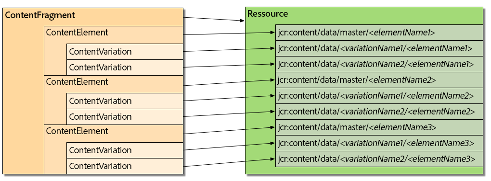
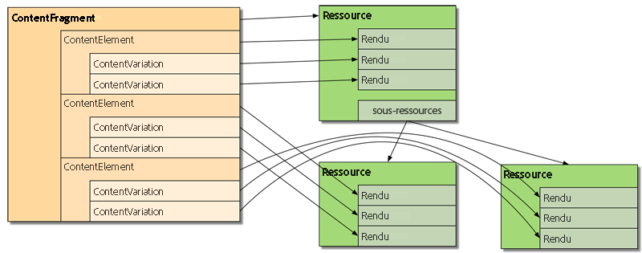

# Personnalisation et extensions de fragments de contenu{#customizing-and-extending-content-fragments}

Un fragment de contenu étend une ressource standard. Voir :

* [Création et gestion des fragments de contenu](/help/assets/content-fragments/content-fragments.md) et [Création de pages avec des fragments de contenu](/help/sites-authoring/content-fragments.md) pour plus d’informations sur les fragments de contenu.

* [Gestions des ressources](/help/assets/managing-assets-touch-ui.md) et [Personnalisation et extension des ressources](/help/assets/extending-assets.md) pour plus d’informations sur les ressources standard.

## Architecture {#architecture}

Les [parties constituantes](/help/assets/content-fragments/content-fragments.md#constituent-parts-of-a-content-fragment) de base d’un fragment de contenu sont les suivantes :

* un *fragment de contenu,*
* consisting of one or more *Content Element* s,
* and which can have one or more *Content Variation* s.

Selon le type de fragment, des modèles sont également utilisés :

>[!CAUTION]
>
>Les [modèles de fragment de contenu](/help/assets/content-fragments/content-fragments-models.md) sont désormais recommandés pour créer tous les fragments.
>
>Les modèles de fragment de contenu sont utilisés pour tous les exemples dans We.Retail.

* Modèles de fragment de contenu :

   * utilisés pour définir des fragments de contenu comportant le contenu structuré.
   * Les modèles de fragment de contenu définissent la structure d’un fragment de contenu lors de sa création.
   * Un fragment référençant le modèle, les modifications du modèle peuvent impacter tous les fragments dépendants.
   * Les modèles sont composés de types de données.
   * Les fonctions pour ajouter des variations, etc., doivent mettre à jour le fragment en conséquence.

   >[!CAUTION]
   >
   >Toutes les modifications apportées à un modèle de fragment de contenu existant peuvent impacter les fragments dépendants, ce qui peut engendrer des propriétés orphelines dans ces fragments.

* Des modèles de fragment de contenu :

   * utilisés pour définir des fragments de contenu simples.
   * Les modèles définissent la structure (de base, texte seul) d’un fragment de contenu lors de sa création.
   * Le modèle étant copié dans le fragment lorsqu’il est créé, les modifications ultérieures du modèle ne seront pas répercutées dans les fragments existants.
   * Les fonctions pour ajouter des variations, etc., doivent mettre à jour le fragment en conséquence.
   * [Les modèles](/help/sites-developing/content-fragment-templates.md) de fragments de contenu fonctionnent différemment de ceux des autres mécanismes de modèle de l’écosystème AEM (modèles de page, etc.). C’est la raison pour laquelle ils doivent être pris en compte séparément.
   * S’il est basé sur un modèle, le type MIME du contenu est géré sur le contenu. Cela signifie que chaque élément et variation peut avoir un type MIME différent.

### Intégration avec Assets {#integration-with-assets}

La gestion des fragments de contenu (CFM) fait partie d’AEM Assets pour les raisons suivantes :

* Les fragments de contenu sont des ressources.
* Ils utilisent la fonctionnalité Assets existante.
* Ils sont entièrement intégrés à Assets (consoles d’administration, etc.).

#### Mappage de fragments de contenu structuré à Assets {#mapping-structured-content-fragments-to-assets}



Les fragments de contenu avec du contenu structuré (c’est-à-dire basé sur un modèle de fragment de contenu) sont mappés à une ressource unique :

* L’ensemble du contenu est stocké sous le nœud `jcr:content/data` de la ressource :

   * Les données d’éléments sont stockées sous le sous-nœud maître :
      `jcr:content/data/master`

   * Les variations sont stockées sous un sous-nœud portant le nom de la variation : par exemple, `jcr:content/data/myvariation`

   * Les données de chaque élément sont stockées dans le sous-nœud respectif comme une propriété avec le nom d’élément :
par exemple, le contenu de l’élément `text` est stocké en tant que propriété `text` sur `jcr:content/data/master`.

* Les métadonnées et le contenu associé sont stockés sous `jcr:content/metadata`
Hormis le titre et la description, qui ne sont pas considérés comme des métadonnées traditionnelles et sont stockés sur `jcr:content`.
Mappage des fragments de contenu simples à Assets {#mapping-simple-content-fragments-to-assets}

#### 


Toutes les informations d’un fragment ne correspondant pas à du contenu (telles que le titre, la description, les métadonnées et la structure) sont gérées sur la ressource principale de manière exclusive.

* Le contenu du premier élément d’un fragment est mappé au rendu d’origine de la ressource principale.
* Les variations du premier élément (si elles existent) sont mappées à d’autres rendus de la ressource principale.

   * Les éléments supplémentaires (s’ils existent) sont mappés aux sous-ressources de la ressource principale.

* Le contenu principal de ces éléments supplémentaires est mappé au rendu d’origine de la sous-ressource respective.

   * Les autres variations (le cas échéant) de tout élément supplémentaire sont mappées aux autres rendus de la sous-ressource respective.
   * Emplacement des ressources  {#asset-location}

#### Comme pour les ressources standard, un fragment de contenu est conservé sous :{#asset-location}

`/content/dam`

#### Autorisations de ressources {#asset-permissions}

Pour plus d’informations, voir [Fragments de contenu – considérations sur la suppression](/help/assets/content-fragments/content-fragments-delete.md).

Intégration de fonction {#feature-integration}](/help/assets/content-fragments/content-fragments-delete.md)

#### La fonction de gestion des fragments de contenu (CFM) repose sur le noyau Assets, mais devrait être aussi indépendante que possible.{#feature-integration}

* CFM possède ses propres mises en œuvre pour les éléments en mode Carte/Colonnes/Liste. Celles-ci se connectent aux mises en œuvre de rendu de contenu existantes d’Assets.
* Plusieurs composants d’Assets ont été étendus pour prendre en charge les fragments de contenu.
* Utilisation des fragments de contenu dans les pages {#using-content-fragments-in-pages}

### [!CAUTION]

>Le [composant de base Fragment de contenu[#$tu68] est désormais recommandé. Voir [Développement de composants de base[#$tu69] pour plus d’informations.
>
>


* Le composant permet de sélectionner la variation à afficher.`fragmentPath``fragmentPath`

* En outre, une plage de paragraphes peut être sélectionnée pour limiter la sortie ; par exemple, pour la sortie en plusieurs colonnes.
* Le composant accepte le [contenu intermédiaire](/help/sites-developing/components-content-fragments.md#in-between-content) :
* Ici, le composant permet de placer d’autres ressources (images, etc.) entre les paragraphes du fragment référencé.[](/help/sites-developing/components-content-fragments.md#in-between-content)

   * Pour le contenu intermédiaire, vous devez :
   * être conscient du risque de références instables ; le contenu intermédiaire (ajouté lors de la création d’une page) n’a pas de rapport fixe avec le paragraphe adjacent, et l’insertion d’un nouveau paragraphe (dans l’éditeur de fragments de contenu) avant la position du contenu intermédiaire peut entraîner la perte de l’emplacement relatif ;

      * tenir compte des paramètres supplémentaires (par exemple, tels que les filtres de variation et de paragraphe) afin d’éviter les faux positifs dans les résultats de recherche.
      * [!NOTE]

>**Modèle de fragment de contenu :**
>
>**Lors de l’utilisation d’un fragment de contenu qui était basé sur un modèle de fragment de contenu sur une page, le modèle est référencé. Cela signifie que si le modèle n’a pas été publié lorsque vous publiez la page, celui-ci est marqué et le modèle ajouté aux ressources à publier avec la page.**
>
>**Modèle de fragment de contenu :**
>
>**Lors de l’utilisation d’un fragment de contenu qui était basé sur un modèle de fragment de contenu sur une page, il n’y a aucune référence, car le modèle a été copié lors de la création du fragment.**
>
>Configuration à l’aide de la console OSGi {#configuration-using-osgi-console}

#### La mise en œuvre principale des fragments de contenu est, par exemple, responsable du rendu des instances d’un fragment utilisé sur une page indexable, ou de la gestion du contenu de médias mixtes. Cette mise en œuvre doit savoir quels composants sont utilisés pour le rendu des fragments, ainsi que la façon dont le rendu est paramétré.{#configuration-using-osgi-console}

The parameters for this can be configured in the [Web Console](/help/sites-deploying/configuring-osgi.md#osgi-configuration-with-the-web-console), for the OSGi bundle **Content Fragment Component Configuration**.

**Types de ressource** Une liste `sling:resourceTypes` peut être fournie de façon à définir les composants qui sont utilisés pour le rendu des fragments de contenu et l’emplacement où le traitement en arrière-plan doit être appliqué.**

* **Propriétés de référence** Une liste de propriétés peut être configurée pour spécifier l’emplacement où la référence au fragment est stockée pour le composant correspondant.
[!NOTE]

* **Il n’y a aucun mappage direct entre la propriété et le type de composant.**

>[!NOTE]AEM prend simplement la première propriété qui se trouve sur un paragraphe. Par conséquent, vous devez sélectionner les propriétés avec soin.
>
>
>
>Il existe d’autres instructions que vous devez respecter pour vous assurer que votre composant est compatible avec le traitement des fragments de contenu en arrière-plan :

The name of the property where the element(s) to be rendered is defined must be either `element` or `elementNames`.

Le nom de la propriété dans laquelle est définie la dont le rendu doit être effectué·doit être `variation`variation ou `variationName`.

* If the output of multiple elements is supported (by using `elementNames` to specify multiple elements), the actual display mode is defined by property `displayMode`:

* If the value is `singleText` (and there is only one element configured) then the element is rendered as a text with in-between content, layout support, etc. Il s’agit de la valeur par défaut pour les fragments dans lesquels un seul élément est rendu.`variationName`

* Dans le cas contraire, une méthode bien plus simple est utilisée (elle pourrait être appelée « mode Formulaire »), où aucun contenu intermédiaire n’est pris en charge et le contenu du fragment est rendu « en l’état ».`elementNames``displayMode`

   * If the fragment is rendered for `displayMode` == `singleText` (implicitly or explicitly) the following additional properties come into play:
   * `paragraphScope` définit si tous les paragraphes, ou seulement une plage de paragraphes, doivent être rendus (valeurs : `all` vs. `range`)

* if `paragraphScope` == `range` then the property `paragraphRange` defines the range of paragraphs to be rendered

   * Intégration à d’autres structures {#integration-with-other-frameworks}`all``range`

   * Les fragments de contenu peuvent être intégrés à :`paragraphScope``range``paragraphRange`

### **des traductions** ;

Content Fragments are fully integrated with the [AEM translation workflow](/help/sites-administering/tc-manage.md). Au niveau architectural, cela présente les implications suivantes :

* **Les traductions d’un fragment de contenu sont en fait des fragments distincts, par exemple :**

   elles sont situées sous des racines linguistiques différentes :[](/help/sites-administering/tc-manage.md)

   * `/content/dam/<path>/en/<to>/<fragment>`

      * ou

         `/content/dam/<path>/de/<to>/<fragment>`

         mais ils partagent exactement le même chemin relatif sous la racine de la langue :

         `/content/dam/<path>/en/<to>/<fragment>`

      * ou

         `/content/dam/<path>/de/<to>/<fragment>`

         Outre les chemins basés sur des règles, il n’existe aucune connexion entre les différentes versions linguistiques d’un fragment de contenu ; elles sont traitées comme deux fragments distincts, bien que l’IU fournisse les moyens de naviguer entre les variantes de langues.

         [!NOTE]
   * Le workflow de traduction AEM fonctionne avec `/content` :
   >Les modèles de fragment de contenu résidant dans `/conf` ; ils ne sont pas inclus dans ces traductions. Vous pouvez [internationaliser les chaînes de l’IU](/help/sites-developing/i18n-dev.md).
   >
   >Les modèles étant copiés pour créer le fragment, cela est donc implicite.`/content`
   >
   >    * **Schémas de métadonnées**](/help/sites-developing/i18n-dev.md)
      >
      >    
   * Les fragments de contenu (ré)utilisent les [schémas de métadonnées](/help/assets/metadata-schemas.md) qui peuvent être définis par de ressources standard.


* **CFM fournit son propre schéma spécifique :**

   * `/libs/dam/content/schemaeditors/forms/contentfragment`](/help/assets/metadata-schemas.md)
   * il peut être étendu si nécessaire.

      `/libs/dam/content/schemaeditors/forms/contentfragment`Le formulaire de schéma respectif est intégré à l’éditeur de fragments.

      L’API de gestion des fragments de contenu – côté serveur  {#the-content-fragment-management-api-server-side}

   * Vous pouvez utiliser l’API côté serveur pour accéder à vos fragments de contenu ; voir :

## [com.adobe.cq.dam.cfm[#$tu130]

>Interfaces principales  {#key-interfaces}
>
>Les trois interfaces suivantes peuvent faire office de points d’entrée :

### **Modèle de fragment** ([FragmentTemplate[#$tu136])

* **Fragment Template** ([FragmentTemplate](https://helpx.adobe.com/experience-manager/6-5/sites/developing/using/reference-materials/javadoc/com/adobe/cq/dam/cfm/FragmentTemplate.html))

   un modèle de fragment de contenu utilisé pour créer un fragment de contenu ;`FragmentTemplate.createFragment()`

   ```
   Resource templateOrModelRsc = resourceResolver.getResource("...");
   FragmentTemplate tpl = templateOrModelRsc.adaptTo(FragmentTemplate.class);
   ContentFragment newFragment = tpl.createFragment(parentRsc, "A fragment name", "A fragment description.");
   ```

   et (après la création) les informations structurelles de ce fragment

    * Ces informations peuvent inclure les éléments suivants :
    * Accès aux données de base (titre et description)

   Accès aux modèles pour les éléments du fragment :

   * Établissement de la liste des modèles d’éléments
   * Obtention des informations structurelles pour un élément donné

      * Accès au modèle d’élément (voir `ElementTemplate`)
      * Accès aux modèles pour les variations du fragment :
      * Établissement de la liste des modèles de variations`ElementTemplate`
      
   * Obtenir des informations structurelles pour une variation donnée

      * Accès au modèle de variation (voir `VariationTemplate`)
      * Obtention du contenu associé initial
      * Interfaces qui représentent des informations importantes :`VariationTemplate`
      
   * `ElementTemplate`

   Obtention des informations de base (nom et titre)

   * `ElementTemplate`

     * Obtention du contenu de l’élément initial

   * `VariationTemplate`
    
     * Obtention des informations de base (nom, titre et description)
      
* **Fragment de contenu** ([ContentFragment[#$tu159])

   Il est fortement recommandé d’accéder à un fragment par l’intermédiaire de cette interface. La modification directe de la structure de contenu doit être évitée.

   >[!CAUTION]L’interface permet les actions suivantes :
   >
   >Gestion des informations de base (par exemple, obtenir le nom ou obtenir/définir le titre/la description)

   Accès aux métadonnées

   * Accès aux éléments :
   * Établissement de la liste des éléments
   * Obtention des éléments par nom

      * Création des éléments (voir [Restrictions](#caveats))
      * Accès aux données des éléments (voir `ContentElement`)
      * Établissement de la liste des variations définies pour le fragment[](#caveats)
      * Création des variations de manière globale`ContentElement`
      
   * Gestion du contenu associé :
   * Établissement de la liste des collections
   * Ajout de collections

      * Suppression de collections
      * Accès au modèle du fragment
      * Les interfaces représentant les éléments clés d’un fragment sont :
      
   * **Élément de contenu** ([ContentElement[#$tu180])

      * Accès aux variations d’un élément :
      * Établissement de la liste des variations
      * Obtention des variations par nom

         * Création de variations (voir [Restrictions](#caveats))
         * Suppression de variations (voir [Restrictions](#caveats))
         * Accès aux données de variation (voir `ContentVariation`)](#caveats)
         * Raccourci pour résoudre les variations (en appliquant une certaine logique supplémentaire spécifique à la mise en œuvre si la variation spécifiée n’est pas disponible pour un élément)[](#caveats)
         * **Variation de contenu** ([ContentVariation[#$tu191])
      * 
   * 

      * Synchronisation unique, en fonction des informations sur les dernières modifications
      * Chacune des trois interfaces (`ContentFragment`, `ContentElement` et `ContentVariation`) étend l’interface `Versionable`, ce qui ajoute des fonctionnalités de contrôle de version, requises pour les fragments de contenu :
      * Création d’une version de l’élément

   Établissement de la liste des versions de l’élément`ContentFragment``ContentElement``ContentVariation``Versionable`

   * Obtention du contenu d’une version spécifique de l’élément dont les versions sont contrôlées
   * Adaptation – utilisation d’adaptTo()  {#adapting-using-adaptto}
   * Ce qui suit peut être adapté :


### `ContentFragment` peut être adapté en :

`Resource` - la ressource Sling sous-jacente ; notez que la mise à jour du sous-jacent `Resource` directement nécessite la reconstruction de l’ `ContentFragment` objet.

* `Asset` - l&#39;abstraction DAM `Asset` qui représente le fragment de contenu ; notez que la mise à jour `Asset` directe nécessite la reconstruction de l’ `ContentFragment` objet.

   * `ContentElement` peut être adapté en :`Resource``ContentFragment`

   * `ElementTemplate` pour accéder aux informations structurelles de l’élément.`Asset``Asset``ContentFragment`

* `FragmentTemplate` peut être adapté en :

   * `Resource` - la `Resource` détermination du modèle référencé ou du modèle original copié ;

* changes made through the `Resource` are not automatically reflected in the `FragmentTemplate`.

   * `Resource` peut être adapté en :`Resource`

      * `ContentFragment``FragmentTemplate`

* `FragmentTemplate`

   * Restrictions {#caveats}
   * `FragmentTemplate`Il convient de noter les éléments suivants :

### Cette API est mise en œuvre afin de fournir les fonctionnalités prises en charge par l’IU.{#caveats}

L’API entière est conçue pour **ne pas** conserver les modifications automatiquement (sauf indication contraire dans l’API JavaDoc). Vous devez donc toujours valider le résolveur de ressources de la requête correspondante (ou le résolveur que vous utilisez).

* Tâches qui peuvent nécessiter des efforts supplémentaires :
* La création/suppression d’éléments ne met pas à jour la structure de données de fragments simples (basés sur un modèle de fragments).****
* La création de variations de `ContentElement` ne met pas à jour la structure de données (tandis que la création globale à partir de `ContentFragment` la met à jour).

   * La suppression des variations existantes ne met pas à jour la structure de données.
   * L’API de gestion des fragments de contenu – côté client  {#the-content-fragment-management-api-client-side}`ContentFragment`

   * [!CAUTION]

## Pour AEM 6.5, l’API côté client est interne.{#the-content-fragment-management-api-client-side}

>Informations supplémentaires {#additional-information}
>
>Reportez-vous aux informations suivantes :

### `filter.xml`

Le fichier `filter.xml` pour la gestion des fragments de contenu est configuré pour ne pas chevaucher le module de contenu de base d’Assets.

* Sessions de modification {#edit-sessions}

   Une session de modification est lancée lorsque l’utilisateur ouvre un fragment de contenu dans l’une des pages de l’éditeur. La session de modification est terminée lorsque l’utilisateur quitte l’éditeur en sélectionnant **Enregistrer** ou **Annuler**.

## Conditions requises {#requirements}

Les conditions pour contrôler une session de modification sont les suivantes :********

### La modification d’un fragment de contenu qui peut être réparti sur plusieurs vues (= pages HTML) doit être atomique.{#requirements}

La modification doit également être *transactionnelle* ; à la fin de la session de modification, les modifications doivent être validées (enregistrées) ou restaurées (annulées).

* Les cas limites doivent être traités correctement. Il peut s’agir de situations telles qu’un utilisateur quittant la page en saisissant une URL manuellement ou en utilisant la navigation globale.
* Un enregistrement automatique récurrent (toutes les x minutes) doit être disponible pour éviter toute perte de données.**
* Si un fragment de contenu est modifié par deux utilisateurs simultanément, l’un ne doit pas écraser les modifications de l’autre.
* Processus {#processes}
* Les processus impliqués sont les suivants :

#### Démarrage d’une session{#processes}

Une nouvelle version du fragment de contenu est créée.

* L’enregistrement automatique est démarré.

   * Les cookies sont configurés afin de définir le fragment actuellement modifié et de signifier qu’une session de modification est ouverte.
   * Fin d’une session
   * L’enregistrement automatique est arrêté.

* Lors de la validation :

   * Les informations sur la dernière modification sont mises à jour.
   * Les cookies sont supprimés.

      * Lors de la restauration :
      * La version du fragment de contenu créée lors du démarrage de la session de modification est restaurée.
   * Les cookies sont supprimés.

      * Modification
      * Toutes les modifications (enregistrement automatique inclus) sont effectuées sur le fragment de contenu actif, et non dans une zone séparée et protégée.


* Par conséquent, ces modifications sont répercutées immédiatement sur les pages AEM faisant référence au fragment de contenu respectif.

   * Actions   {#actions}
   * Les actions possibles sont les suivantes :

#### Entrée sur une page{#actions}

Vérifier si une session de modification est déjà présente en vérifiant le cookie correspondant.

* S’il en existe un, vérifier que la session de modification a été démarrée pour le fragment de contenu qui est en cours de modification.

   * S’il s’agit du fragment en cours, rétablir la session.

      * Si ce n’est pas le cas, essayer d’annuler la modification du fragment de contenu précédemment modifié et supprimer les cookies (aucune session de modification n’est présente après).

         * En l’absence de session de modification, attendre la première modification apportée par l’utilisateur (voir ci-dessous).
         * Vérifier si le fragment de contenu est déjà référencé sur une page et afficher les informations appropriées si tel est le cas.
      * Modification de contenu
   * Whenever the user changes content and there is no edit session present, a new edit session is created (see [Starting a session](#processes)).


* Sortie d’une page

   * Si une session de modification est présente, et si les modifications n’ont pas été conservées, une boîte de dialogue de confirmation modale s’affiche pour avertir l’utilisateur de la perte potentielle de contenu et pour lui permettre de rester sur la page.[](#processes)

* Exemples {#examples}

   * Exemple : accès à un fragment de contenu existant {#example-accessing-an-existing-content-fragment}

## Pour ce faire, vous pouvez adapter la ressource qui représente l’API à :{#examples}

### `com.adobe.cq.dam.cfm.ContentFragment`

Par exemple :

Exemple : création d’un fragment de contenu  {#example-creating-a-new-content-fragment}

Pour créer un fragment de contenu par programmation, vous devez utiliser :

```java
// first, get the resource
Resource fragmentResource = resourceResolver.getResource("/content/dam/fragments/my-fragment");
// then adapt it
if (fragmentResource != null) {
    ContentFragment fragment = fragmentResource.adaptTo(ContentFragment.class);
    // the resource is now accessible through the API
}
```

### `com.adobe.cq.dam.cfm.ContentFragmentManager#create`

Par exemple :

Exemple : spécification de l’intervalle d’enregistrement automatique  {#example-specifying-the-auto-save-interval}

L’intervalle d’enregistrement automatique (exprimé en secondes) peut être défini à l’aide de Configuration Manager (ConfMgr) :

```java
Resource templateOrModelRsc = resourceResolver.getResource("...");
FragmentTemplate tpl = templateOrModelRsc.adaptTo(FragmentTemplate.class);
ContentFragment newFragment = tpl.createFragment(parentRsc, "A fragment name", "A fragment description.");
```

### Nœud : `<*conf-root*>/settings/dam/cfm/jcr:content`

Nom de la propriété : `autoSaveInterval`

* Type : `Long`
* Valeur par défaut : `600` (10 minutes) ; cette valeur est définie sur `/libs/settings/dam/cfm/jcr:content`
* Si vous souhaitez définir un intervalle d’enregistrement automatique de 5 minutes, vous devez définir la propriété sur le nœud, par exemple :`Long`

* Nœud : `/conf/global/settings/dam/cfm/jcr:content``/libs/settings/dam/cfm/jcr:content`

Nom de la propriété : `autoSaveInterval`

* Type : `Long`
* Valeur : `300` (5 minutes correspondent à 300 secondes).

* Modèles de fragment de contenu {#content-fragment-templates}

* Voir [Modèles de fragment de contenu](/help/sites-developing/content-fragment-templates.md) pour plus d’informations.

## Composants pour la création de page {#components-for-page-authoring}

Pour plus d’informations, voir :[](/help/sites-developing/content-fragment-templates.md)

## [Composants de base – composant de fragment de contenu[#$tu291] (recommandé)


* [Core Components - Content Fragment Component-ERR:REF-NOT-FOUND- (recommended)
* [Content Fragment Components - Components for Page Authoring](/help/sites-developing/components-content-fragments.md#components-for-page-authoring)
