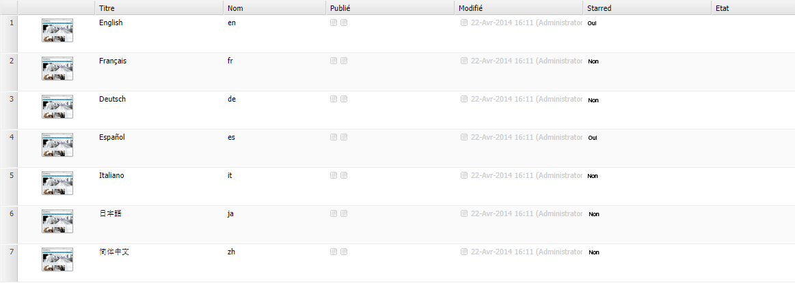

# Personnaliser la console Sites web (IU classique){#customizing-the-websites-console-classic-ui}

## Ajouter une colonne personnalisée à la console Sites web (siteadmin) {#adding-a-custom-column-to-the-websites-siteadmin-console}

La console d’administration Sites web peut être étendue pour afficher des colonnes personnalisées. La console est générée sur la base d’un objet JSON qui peut être étendu en créant un service OSGI qui implémente l’interface `ListInfoProvider`. Un tel service modifie l’objet JSON envoyé au client pour créer la console.

Ce tutoriel détaillé explique comment afficher une nouvelle colonne dans la console Administration de sites Web en implémentant l’interface `ListInfoProvider`. Il se compose des étapes suivantes :

1. [Création du service OSGI](#creating-the-osgi-service) et déploiement du lot qui le contient sur le serveur AEM.
1. (facultatif) [Test du nouveau service](#testing-the-new-service) en effectuant un appel JSON pour demander l’objet JSON utilisé pour créer la console.
1. [Affichage de la nouvelle colonne](#displaying-the-new-column) en étendant la structure des nœuds de la console dans le référentiel.

>[!NOTE]
>
>Ce tutoriel peut également être utilisé pour étendre les consoles d’administration suivantes :
>
>* la console Ressources numériques
>* Console Community
>

### Création du service OSGI {#creating-the-osgi-service}

L’interface `ListInfoProvider` définit deux méthodes :

* `updateListGlobalInfo`, pour mettre à jour les propriétés globales de la liste,
* `updateListItemInfo`, pour mettre à jour un seul élément de liste.

Les arguments pour les deux méthodes sont les suivants :

* `request`, l’objet de requête HTTP Sling associé,
* `info`, l’objet JSON à mettre à jour, à savoir la liste globale ou l’élément de liste en cours,
* `resource`, une ressource Sling.

L’exemple d’implémentation est le suivant :

* ajoute une propriété *starred* pour chaque élément, à savoir `true` si le nom de page commence par un *e* et `false` dans les autres cas ;

* Ajoute une propriété *starredCount*, qui est globale pour la liste et contient le nombre d’éléments starred de la liste.

Pour créer le service OSGi :

1. Dans CRXDE Lite, [créez un lot](/help/sites-developing/developing-with-crxde-lite.md#managing-a-bundle).
1. Ajoutez l’exemple de code ci-dessous.
1. Créez le lot.

Le nouveau service est opérationnel.

```java
package com.test;

import com.day.cq.commons.ListInfoProvider;
import com.day.cq.i18n.I18n;
import com.day.cq.wcm.api.Page;
import org.apache.felix.scr.annotations.Component;
import org.apache.felix.scr.annotations.Service;
import org.apache.sling.api.SlingHttpServletRequest;
import org.apache.sling.api.resource.Resource;
import org.apache.sling.commons.json.JSONException;
import org.apache.sling.commons.json.JSONObject;

@Component(metatype = false)
@Service(value = ListInfoProvider.class)
public class StarredListInfoProvider implements ListInfoProvider {

    private int count = 0;

    public void updateListGlobalInfo(SlingHttpServletRequest request, JSONObject info, Resource resource) throws JSONException {
        info.put("starredCount", count);
        count = 0; // reset for next execution
    }

    public void updateListItemInfo(SlingHttpServletRequest request, JSONObject info, Resource resource) throws JSONException {
        Page page = resource.adaptTo(Page.class);
        if (page != null) {
            // Consider starred if page name starts with 'e'
            boolean starred = page.getName().startsWith("e");
            if (starred) {
                count++;
            }
            I18n i18n = new I18n(request);
            info.put("starred", starred ? i18n.get("Yes") : i18n.get("No"));
        }
    }

}
```

>[!CAUTION]
>
>* Votre implémentation doit déterminer, sur la base de la requête et/ou de la ressource fournies, si elle doit ou non ajouter les informations à l’objet JSON.
>* Si votre implémentation de `ListInfoProvider` définit une propriété qui existe déjà dans l’objet de réponse, sa valeur est remplacée par celle que vous fournissez.
>
>   Vous pouvez utiliser le [classement de service](https://docs.osgi.org/javadoc/r2/org/osgi/framework/Constants.html#SERVICE_RANKING) pour gérer l’ordre d’exécution de plusieurs implémentations de `ListInfoProvider`.

### Tester le nouveau service {#testing-the-new-service}

Lorsque vous ouvrez la console d’administration Sites web et parcourez votre site, le navigateur émet un appel Ajax pour obtenir l’objet JSON utilisé pour créer la console. Par exemple, lorsque vous accédez au dossier `/content/geometrixx`, la requête suivante est envoyée au serveur AEM pour créer la console :

[https://localhost:4502/content/geometrixx.pages.json?start=0&amp;limit=30&amp;predicate=siteadmin](https://localhost:4502/content/geometrixx.pages.json?start=0&amp;limit=30&amp;predicate=siteadmin)

Pour vous assurer que le nouveau service s’exécute après le déploiement du lot où il réside, procédez comme suit :

1. Pointez votre navigateur vers l’URL suivante :
   [https://localhost:4502/content/geometrixx.pages.json?start=0&amp;limit=30&amp;predicate=siteadmin](https://localhost:4502/content/geometrixx.pages.json?start=0&amp;limit=30&amp;predicate=siteadmin)

1. La réponse doit afficher les nouvelles propriétés comme suit :


### Affichage de la nouvelle colonne {#displaying-the-new-column}

La dernière étape consiste à adapter la structure de nœuds de la console Administration des sites Web afin d’afficher la nouvelle propriété pour toutes les pages Geometrixx en superposant `/libs/wcm/core/content/siteadmin`. Procédez comme suit :

1. Dans CRXDE Lite, créez la structure de nœuds `/apps/wcm/core/content` avec les nœuds de type `sling:Folder` afin de représenter la structure `/libs/wcm/core/content`.

1. Copiez le nœud `/libs/wcm/core/content/siteadmin` et collez-le sous `/apps/wcm/core/content`.

1. Copiez le nœud `/apps/wcm/core/content/siteadmin/grid/assets` vers `/apps/wcm/core/content/siteadmin/grid/geometrixx` et modifiez ses propriétés :

   * Supprimez **pageText**.

   * Définissez **pathRegex** sur `/content/geometrixx(/.*)?`.
De cette manière, la configuration de grille sera active pour tous les sites web Geometrixx.

   * Définissez **storeProxySuffix** sur `.pages.json`.

   * Modifiez la propriété à plusieurs valeurs **storeReaderFields** et ajoutez la valeur `starred`.

   * Pour activer la fonctionnalité MSM, ajoutez les paramètres MSM suivants à la propriété **storeReaderFields** à plusieurs chaînes :

      * **msm:isSource**
      * **msm:isInBlueprint**
      * **msm:isLiveCopy**

1. Ajoutez un nœud `starred` (de type **nt:unstructured**) sous `/apps/wcm/core/content/siteadmin/grid/geometrixx/columns` avec les propriétés suivantes :

   * **dataIndex** : `starred` de type Chaîne

   * **header** : `Starred` de type Chaîne

   * **xtype** : `gridcolumn` de type Chaîne

1. (Facultatif) Déposez les colonnes que vous ne souhaitez pas afficher à l’emplacement suivant : `/apps/wcm/core/content/siteadmin/grid/geometrixx/columns`.

1. `/siteadmin` est un chemin vanity qui, par défaut, pointe vers `/libs/wcm/core/content/siteadmin`.
Pour rediriger l’ensemble vers votre version de siteadmin sur `/apps/wcm/core/content/siteadmin`, définissez la propriété `sling:vanityOrder` pour que sa valeur soit supérieure à celle définie sur `/libs/wcm/core/content/siteadmin`. La valeur par défaut est de 300 ; toute valeur plus élevée est donc acceptable.

1. Accédez à la console Administration de sites Web et rendez-vous sur le site de Geometrixx à l’adresse :
   [https://localhost:4502/siteadmin#/content/geometrixx](https://localhost:4502/siteadmin#/content/geometrixx).

1. La nouvelle colonne nommée **Starred** affiche des informations personnalisées comme suit :



>[!CAUTION]
>
>Si plusieurs configurations de grille correspondent au chemin d’accès demandé défini par la propriété **pathRegex**, la configuration utilisée est la première, et non la plus spécifique, ce qui signifie que l’ordre des configurations est important.

### Exemple de package {#sample-package}

Les résultats de ce tutoriel sont disponibles dans le package [Personnalisation de la console Administration de sites Web](https://localhost:4502/crx/packageshare/index.html/content/marketplace/marketplaceProxy.html?packagePath=/content/companies/public/adobe/packages/helper/customizing-siteadmin) dans le partage de packages.
