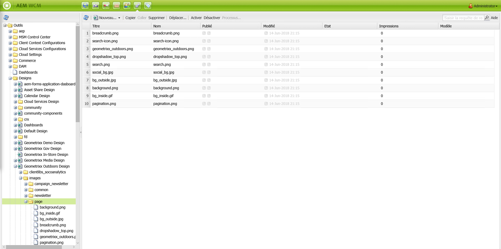
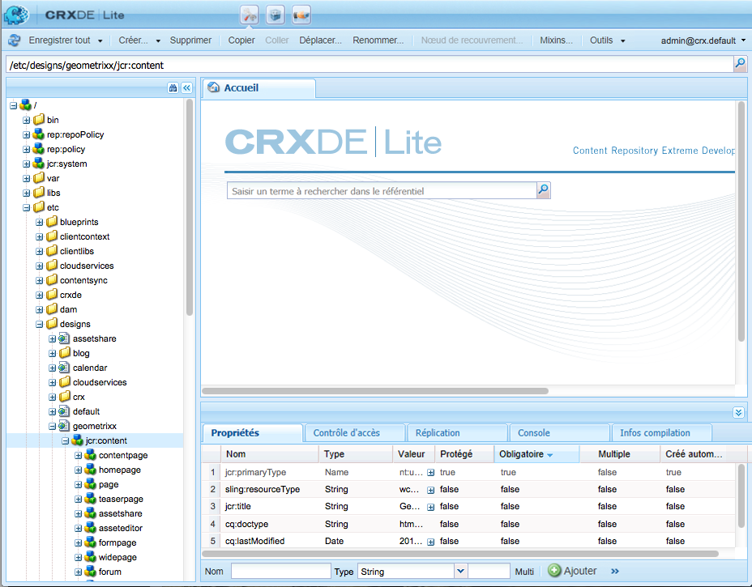

# Conceptions et Designer{#designs-and-the-designer}

>[!CAUTION]
>
>Cet article explique comment créer un site Web basé sur l’interface utilisateur classique. Adobe vous recommande de tirer parti des technologies AEM les plus récentes pour vos sites web. Vous en trouverez une description détaillée dans l’article [Prise en main du développement d’AEM Sites](/help/sites-developing/getting-started.md).

Vous devez créer une conception pour votre site web et dans AEM. Pour ce faire, vous allez utiliser le Designer.

>[!NOTE]
>
>Pour plus d’informations sur l’accessibilité web, voir [AEM et les instructions pour l’accessibilité web](/help/managing/web-accessibility.md).

## Utilisation de Designer {#using-the-designer}

Votre conception peut être définie dans la section **designs** de l&#39;onglet **Outils** :



Ici, vous pouvez créer la structure requise pour stocker la conception, puis stocker les feuilles de style en cascade (CSS) et les images requises.

Les conceptions sont stockées sous `/etc/designs`. Le chemin d’accès à la conception à utiliser pour un site web est spécifié à l’aide de la propriété `cq:designPath` du nœud `jcr:content`.



>[!NOTE]
>
>Toutes les modifications apportées à une page dans le mode Création sont conservées sous le nœud de conception du site et sont automatiquement appliquées à toutes les pages qui présentent la même conception.

## Éléments nécessaires  {#what-you-will-need}

Pour créer votre conception, vous aurez besoin des éléments suivants :

**CSS**  - Les feuilles de style en cascade définissent le format des zones spécifiques de vos pages.
**Images**  - Toutes les images utilisées pour des fonctions telles que les arrière-plans et les boutons.

### Points à prendre en compte lors de la conception de votre site web {#considerations-when-designing-your-website}

Lors du développement d’un site Web, il est vivement recommandé de stocker des images et des fichiers CSS sous `/etc/design/<project>` afin que vous puissiez référencer vos ressources en fonction de la conception actuelle, comme décrit dans le fragment de code suivant.

```xml
<%= currentDesign.getPath() + "/static/img/icon.gif %>
```

L&#39;exemple précédent offre plusieurs avantages :

* Les composants peuvent avoir une apparence différente selon que chaque site utilise un chemin de conception différent.
* Pour reconcevoir le site Web, il suffit de pointer le chemin de conception vers un autre noeud à la racine du site, de `design/v1` à `design/v2.`.

* `/etc/designs` et  `/content` sont les seules URL externes que le navigateur voit vous protéger d&#39;un utilisateur externe qui se demande ce qui se trouve sous votre  `/apps` arborescence. Les avantages des URL ci-dessus aident également l’administrateur système à mieux configurer la sécurité, dans la mesure où vous limitez l’exposition des ressources à une poignée d’emplacements distincts.

