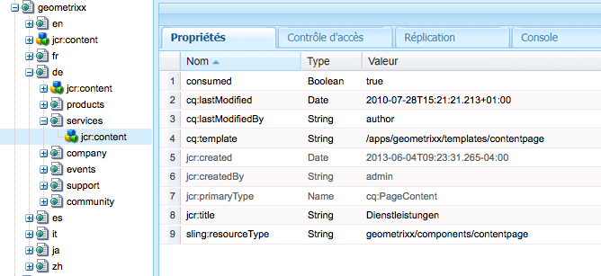

# Création et utilisation de tâches pour le déchargement{#creating-and-consuming-jobs-for-offloading}

La fonctionnalité Apache Sling Discovery fournit une API Java qui vous permet de créer des tâches JobManager et des services JobConsumer qui utilisent ces dernières.

Pour plus d’informations sur la création de topologies de déchargement et la configuration de la consommation de rubrique, voir [Tâches de déchargement](/help/sites-deploying/offloading.md).

## Gestion des charges utiles de la tâche {#handling-job-payloads}

La structure de déchargement définit deux propriétés de tâche que vous utilisez pour identifier la charge utile de la tâche. Les agents de réplication de déchargement utilisent ces propriétés pour identifier les ressources à répliquer sur les instances de la topologie :

* `offloading.job.input.payload`: Liste de chemins de contenu séparés par des virgules. Le contenu est répliqué sur l’instance qui exécute la tâche.
* `offloading.job.output.payload`: Liste de chemins de contenu séparés par des virgules. Une fois l’exécution de la tâche terminée, la charge utile est répliquée sur ces chemins d’accès sur l’instance qui a créé la tâche.

Utilisez l’énumération `OffloadingJobProperties` pour faire référence aux noms de propriété :

* `OffloadingJobProperties.INPUT_PAYLOAD.propertyName()`
* `OffloadingJobProperties.OUTPUT_PAYLOAD.propetyName()`

Une charge utile n’est pas obligatoire pour les tâches. Elle est toutefois nécessaire si la tâche requiert la manipulation d’une ressource et si l’ordinateur sur lequel elle est déchargée n’a pas servi à la créer.

## Création de tâches pour le déchargement {#creating-jobs-for-offloading}

Créez un client qui appelle la méthode JobManager.addJob afin de créer une tâche exécutée par un service JobConsumer sélectionné automatiquement. Indiquez les informations suivantes pour créer la tâche :

* Rubrique : rubrique de tâche.
* Nom : (Facultatif).
* Properties Map: A `Map<String, Object>` object that contains any number of properties, such as the input payload paths and output Payload paths. Cet objet Map est disponible pour l’objet JobConsumer qui exécute la tâche.

L’exemple de service suivant crée une tâche pour un chemin de charge utile en entrée et de rubrique donné.

```java
package com.adobe.example.offloading;

import org.apache.felix.scr.annotations.Component;
import org.apache.felix.scr.annotations.Service;
import org.apache.felix.scr.annotations.Reference;

import java.util.HashMap;

import org.apache.sling.event.jobs.Job;
import org.apache.sling.event.jobs.JobManager;

import org.apache.sling.api.resource.ResourceResolverFactory;
import org.apache.sling.api.resource.ResourceResolver;

import com.adobe.granite.offloading.api.OffloadingJobProperties;

@Component
@Service
public class JobGeneratorImpl implements JobGenerator  {

 @Reference
 private JobManager jobManager;
 @Reference ResourceResolverFactory resolverFactory;

 public String createJob(String topic, String payload) throws Exception {
  Job offloadingJob;

  ResourceResolver resolver = resolverFactory.getResourceResolver(null);
  if(resolver.getResource(payload)!=null){

   HashMap<String, Object> jobprops = new HashMap<String, Object>();
   jobprops.put(OffloadingJobProperties.INPUT_PAYLOAD.propertyName(), payload);

   offloadingJob = jobManager.addJob(topic, null, jobprops);
  } else {
   throw new Exception("Payload for job cannot be found");
  }
  if (offloadingJob == null){
   throw new Exception ("Offloading job could not be created");
  }
  return offloadingJob.getId();
 }
}
```

The log contains the following message when JobGeneratorImpl.createJob is called for the `com/adobe/example/offloading` topic and the `/content/geometrixx/de/services` payload:

```shell
10.06.2013 15:43:33.868 *INFO* [JobHandler: /etc/workflow/instances/2013-06-10/model_1554418768647484:/content/geometrixx/en/company] com.adobe.example.offloading.JobGeneratorImpl Received request to make job for topic com/adobe/example/offloading and payload /content/geometrixx/de/services
```

## Développement d’un consommateur de tâche {#developing-a-job-consumer}

Pour exécuter des tâches, développez un service OSGi qui met en œuvre l’interface `org.apache.sling.event.jobs.consumer.JobConsumer`. Effectuez l’identification avec la rubrique à consommer à l’aide de la propriété `JobConsumer.PROPERTY_TOPICS`.

The following example JobConsumer implementation registers with the `com/adobe/example/offloading` topic. Le consommateur définit simplement la propriété Consumed du nœud de contenu de charge utile sur True.

```java
package com.adobe.example.offloading;

import org.apache.felix.scr.annotations.Component;
import org.apache.felix.scr.annotations.Property;
import org.apache.felix.scr.annotations.Reference;
import org.apache.felix.scr.annotations.Service;
import org.apache.sling.api.resource.ResourceResolver;
import org.apache.sling.api.resource.ResourceResolverFactory;
import org.apache.sling.event.jobs.Job;
import org.apache.sling.event.jobs.JobManager;
import org.apache.sling.event.jobs.consumer.JobConsumer;
import org.slf4j.Logger;
import org.slf4j.LoggerFactory;

import javax.jcr.Session;
import javax.jcr.Node;

import com.adobe.granite.offloading.api.OffloadingJobProperties;

@Component
@Service
public class MyJobConsumer implements JobConsumer {

 public static final String TOPIC = "com/adobe/example/offloading";

 @Property(value = TOPIC)
 static final String myTopic = JobConsumer.PROPERTY_TOPICS;

 @Reference
 private ResourceResolverFactory resolverFactory;

 @Reference
 private JobManager jobManager;

 private final Logger log = LoggerFactory.getLogger(getClass());

 public JobResult process(Job job) {
  JobResult result = JobResult.FAILED;
  String topic = job.getTopic();
  log.info("Consuming job of topic: {}", topic);
  String payloadIn =  (String) job.getProperty(OffloadingJobProperties.INPUT_PAYLOAD.propertyName());
  String payloadOut =  (String) job.getProperty(OffloadingJobProperties.OUTPUT_PAYLOAD.propertyName());

  log.info("Job has Input Payload {} and Output Payload {}",payloadIn, payloadOut);

  ResourceResolver resolver = null;
  try {
   resolver = resolverFactory.getAdministrativeResourceResolver(null);
   Session session = resolver.adaptTo(Session.class);
   Node inNode = session.getNode(payloadIn);
   inNode.getNode(Node.JCR_CONTENT).setProperty("consumed",true);
   result = JobResult.OK;
  }catch (Exception e){
   log.info("ERROR -- JOB RESULT IS FAILURE " + e.getMessage());
   result = JobResult.FAILED;
  }
  log.info("Job OK for payload {}",payloadIn);
  return result;
 }
}
```

La classe MyJobConsumer génère les messages de journal suivants pour une charge utile en entrée de /content/geometrixx/de/services :

```shell
10.06.2013 16:02:40.803 *INFO* [pool-7-thread-17-<main queue>(com/adobe/example/offloading)] com.adobe.example.offloading.MyJobConsumer Consuming job of topic: com/adobe/example/offloading
10.06.2013 16:02:40.803 *INFO* [pool-7-thread-17-<main queue>(com/adobe/example/offloading)] com.adobe.example.offloading.MyJobConsumer Job has Input Payload /content/geometrixx/de/services and Output Payload /content/geometrixx/de/services
10.06.2013 16:02:40.884 *INFO* [pool-7-thread-17-<main queue>(com/adobe/example/offloading)] com.adobe.example.offloading.MyJobConsumer Job OK for payload /content/geometrixx/de/services
```

Vous pouvez observer la propriété consommée à l’aide de CRXDE Lite :



## Dépendances Maven {#maven-dependencies}

Ajoutez les définitions de dépendance suivantes à votre fichier pom.xml, de sorte que Maven puisse résoudre les classes liées au déchargement.

```xml
<dependency>
   <groupId>org.apache.sling</groupId>
   <artifactId>org.apache.sling.event</artifactId>
   <version>3.1.5-R1485539</version>
   <scope>provided</scope>
</dependency>
<dependency>
   <groupId>com.adobe.granite</groupId>
   <artifactId>com.adobe.granite.offloading.core</artifactId>
   <version>1.0.4</version>
   <scope>provided</scope>
</dependency>
```

Les exemples précédents nécessitaient également les définitions de dépendance suivantes :

```xml
<dependency>
   <groupId>org.apache.sling</groupId>
   <artifactId>org.apache.sling.api</artifactId>
   <version>2.4.3-R1488084</version>
   <scope>provided</scope>
</dependency>

<dependency>
   <groupId>org.apache.sling</groupId>
   <artifactId>org.apache.sling.jcr.jcr-wrapper</artifactId>
   <version>2.0.0</version>
   <scope>provided</scope>
</dependency>
```

