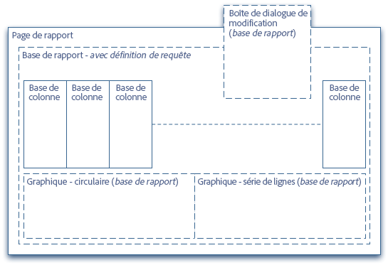
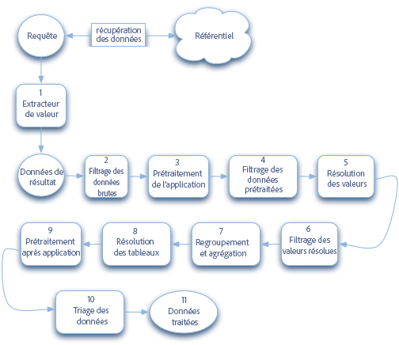

# Élaboration de rapports{#developing-reports}

AEM provides a selection of [standard reports](/help/sites-administering/reporting.md) most of which are based on a reporting framework.

Cette structure vous permet soit d’étendre ces rapports standard, soit de développer vos propres rapports en partant de zéro. La structure de création de rapports s’intègre parfaitement dans les concepts et principes CQ5 existants. Les développeurs peuvent ainsi mettre à profit leurs connaissances actuelles de la plate-forme CQ5 pour développer des rapports.

Pour les rapports standard fournis avec AEM :

* Ces rapports reposent sur la structure de création de rapports :

   * [Rapport de composants](/help/sites-administering/reporting.md#component-report)
   * [Rapport d’activité de la page](/help/sites-administering/reporting.md#page-activity-report)
   * [Rapport de l’utilisateur](/help/sites-administering/reporting.md#user-report)
   * [Rapport d’instance de processus](/help/sites-administering/reporting.md#workflow-instance-report)

* Les rapports suivants sont basés sur des principes individuels et ne peuvent donc pas être étendus :

   * [Utilisation du disque](/help/sites-administering/reporting.md#disk-usage)
   * [Contrôle de l’intégrité](/help/sites-administering/reporting.md#health-check)
   * [Rapports de processus](/help/sites-administering/reporting.md#workflow-report)

>[!NOTE]
>
>Le tutoriel [Création de votre propre rapport – Exemple](#creating-your-own-report-an-example) indique également combien de principes il est possible d’utiliser parmi ceux présentés ci-après.
>
>Vous pouvez également vous reporter aux rapports standard pour consulter d’autres exemples de mise en œuvre.

>[!NOTE]
>
>La notation suivante est utilisée dans les exemples et définitions ci-dessous :
>
>* Chaque ligne définit un nœud ou une propriété où :
   >
   >  
* `N:<name> [<nodeType>]`
   >
   >     
   Décrit un noeud avec le nom `<*name*>` et le type de noeud de `<*nodeType*>`*.*
   >
   >  
* `P:<name> [<propertyType]`
   >
   >     
   Décrit une propriété avec le nom `<*name*>` et un type de propriété de `<*propertyType*>`.
   >
   >  
* `P:<name> = <value>`
   >
   >     
   Décrit une propriété `<name>` qui doit être définie sur la valeur de `<value>`.
   >
   >
* La mise en retrait indique les dépendances hiérarchiques entre les nœuds.
>* Éléments séparés par| indique un  d&#39;éléments possibles; par exemple, types ou noms :
>
>  
Par exemple, `String|String[]` signifie que la propriété peut être Chaîne ou Chaîne[].
>
>* `[]` représente un tableau ; comme Chaîne[] ou tableau de noeuds, comme dans la Définition [de](#query-definition).
>
>
Sauf indication contraire, les types par défaut sont les suivants :
>
>* Nodes - `nt:unstructured`
>* Propriétés - `String`


## Structure de création de rapports {#reporting-framework}

La structure de création de rapports fonctionne sur les principes suivants :

* Elle repose entièrement sur les jeux de résultats renvoyés par une requête exécutée par CQ5 QueryBuilder.
* Le jeu de résultats définit les données affichées dans le rapport. Chaque ligne du jeu de résultats correspond à une ligne dans la vue tabulaire du rapport.
* Les opérations pouvant être exécutées sur le jeu de résultats ressemblent aux concepts SGBDR ; il s’agit principalement du *regroupement* et de l’*agrégation*.

* La plupart des opérations de récupération et de traitement des données s’effectuent du côté serveur.
* Le client est seulement responsable de l’affichage des données prétraitées. Seules des tâches de traitement mineures (créer des liens dans le contenu de la cellule, par exemple) sont exécutées du côté client.

La structure de rapports (illustrée par la structure d’un rapport standard) utilise les blocs de création suivants, alimentés par la file d’attente de traitement :



### Page de rapport {#report-page}

La page de rapport :

* est une page CQ5 standard ;
* est basée sur le [modèle CQ5 standard, configuré pour le rapport](#report-template).

### Base de rapport {#report-base}

Le [composant `reportbase`](#report-base-component) constitue la base de tout rapport, dans la mesure où il :

* contient la définition de la [requête](#the-query-and-data-retrieval) qui fournit le jeu de résultats de données sous-jacent ;

* s’agit d’un système de paragraphes personnalisé contenant toutes les colonnes (`columnbase`) ajoutées au rapport ;
* définit les types de graphique disponibles et actuellement actifs ;
* définit la boîte de dialogue de modification, qui permet à l’utilisateur de configurer certains aspects du rapport.

### Base de colonne {#column-base}

Chaque colonne est une instance du [composant `columnbase`](#column-base-component) qui :

* est un paragraphe, utilisé par le système de paragraphes (parsys) (`reportbase`) du rapport correspondant ;
* définit le lien vers le [jeu de résultats sous-jacent](#the-query-and-data-retrieval) ; en d’autres termes, il définit les données spécifiques référencées dans ce jeu de résultats, ainsi que la façon dont elles sont traitées ;
* contient des définitions supplémentaires ; telles que les agrégats et filtres disponibles, ainsi que toute valeur par défaut.

### Requête et récupération de données {#the-query-and-data-retrieval}

La requête :

* est définie comme faisant partie du composant [`reportbase`](#report-base) ;
* est basée sur [CQ QueryBuilder](https://helpx.adobe.com/experience-manager/6-5/sites/developing/using/reference-materials/javadoc/com/day/cq/search/QueryBuilder.html) ;
* récupère les données utilisées comme base du rapport. Chaque ligne du jeu de résultats (tableau) est associée à un nœud, tel qu’il est renvoyé par la requête. Des informations spécifiques pour les [différentes colonnes](#column-base-component) sont ensuite extraites de ce jeu de données.

* se compose généralement des éléments suivants :

   * Un chemin d’accès racine.

      Ce chemin spécifie la sous-arborescence du référentiel dans lequel la recherche doit être effectuée.

      Pour contribuer à réduire l’impact sur les performances, il est conseillé de limiter (dans la mesure du possible) la requête à une sous-arborescence spécifique du référentiel. Le chemin d’accès racine peut soit être prédéfini dans le [modèle de rapport](#report-template), soit être défini dans la [boîte de dialogue Configuration (Modifier)](#configuration-dialog).

   * [Un ou plusieurs critères](#query-definition).

      Ils sont imposés pour générer le jeu de résultats (initial) ; il s’agit, par exemple, de restrictions concernant le type de nœud ou des contraintes de propriété.

**Ce qu’il faut retenir ici, c’est que chaque nœud unique renvoyé dans le jeu de résultats de la requête est utilisé pour générer une seule ligne sur le rapport (relation 1:1).**

Le développeur doit s’assurer que la requête définie pour un rapport renvoie un ensemble de nœuds approprié pour ce rapport. Cependant, le nœud proprement dit ne doit pas nécessairement contenir toutes les informations requises. Elles peuvent également être déduites des nœuds parents et/ou enfants. Par exemple, la requête utilisée pour le [Rapport utilisateur](/help/sites-administering/reporting.md#user-report) sélectionne des nœuds en fonction de leur type (dans ce cas : `rep:user`). Toutefois, la plupart des colonnes de ce rapport ne prélèvent pas directement leurs données de ces nœuds, mais des nœuds enfants `profile`.

### File d’attente de traitement {#processing-queue}

La [requête](#the-query-and-data-retrieval) renvoie un jeu de résultats de données à afficher sous la forme de lignes dans le rapport. Chaque ligne du jeu de résultats est traitée (côté serveur), en [plusieurs phases](#phases-of-the-processing-queue), avant d’être transférée vers le client en vue d’un affichage dans le rapport.

Cela permet d’effectuer les opérations suivantes :

* Extraire et déduire des valeurs du jeu de résultats sous-jacent.

   Cela vous permet, par exemple, de traiter deux valeurs de propriété comme s’il s’agissait d’une seule en calculant la différence entre les deux.

* Résoudre les valeurs extraites ; cela peut être réalisé de différentes manières.

   Par exemple, des chemins d’accès peuvent être mappés sur un titre (comme dans le contenu plus lisible de la propriété *jcr:title* correspondante).

* Appliquer des filtres à différents points.
* Créer des valeurs composées, si nécessaire.

   Par exemple, dans le cas d’un texte présenté à l’utilisateur, une valeur à utiliser pour le tri et une URL supplémentaire utilisée (du côté client) pour créer un lien.

#### Processus de la file d’attente de traitement {#workflow-of-the-processing-queue}

Le processus suivant représente la file d’attente de traitement :



#### Phases de la file d’attente de traitement {#phases-of-the-processing-queue}

Emplacement des étapes détaillées et des éléments :

1. Transforms the results returned by the [initial query (reportbase)](#query-definition) into the basic result set using value extractors.

   Les extracteurs de valeurs sont sélectionnés automatiquement en fonction du [type de colonne](#column-specific-definitions). Ils sont utilisés pour lire les valeurs extraites de la requête JCR sous-jacente et pour créer un jeu de résultats à partir de celles-ci ; un traitement plus approfondi peut ensuite être appliqué. Pour le type `diff`, par exemple, l’extracteur de valeurs lit deux propriétés et calcule la valeur unique qui est ensuite ajoutée au jeu de résultats. Les extracteurs de valeurs ne peuvent pas être configurés.

1. Un [filtrage initial](#column-specific-definitions) (phase *raw*) est appliqué à ce jeu de résultats initial qui contient des données brutes.

1. Les valeurs font l’objet d’un [prétraitement](#processing-queue) ; tel qu’il est défini pour la phase *apply*.

1. Un [filtrage](#column-specific-definitions) (affecté à la phase *preprocessed*) est exécuté sur les valeurs prétraitées.

1. Les valeurs sont résolues ; selon le [programme de résolution défini](#processing-queue).
1. Un [filtrage](#column-specific-definitions) (affecté à la phase *resolved*) est exécuté sur les valeurs résolues.

1. Les données sont [groupées et agrégées](#column-specific-definitions).
1. Les données de tableau sont résolues par le biais d’une conversion en liste (basée sur des chaînes).

   Il s’agit d’une étape implicite qui convertit un résultat à plusieurs valeurs dans une liste qui peut être affichée ; cela s’avère nécessaire pour les valeurs de cellule (non agrégées) qui sont basées sur des propriétés JCR à plusieurs valeurs.

1. Les valeurs font l’objet d’un nouveau [prétraitement](#processing-queue) ; tel qu’il est défini pour la phase *afterApply*.

1. Les données sont triées.
1. Les données traitées sont transférées au client.

>[!NOTE]
>
>La requête initiale qui renvoie le jeu de résultats de données de base est définie sur le composant `reportbase`.
>
>D’autres éléments de la file d’attente de traitement sont définis sur les composants `columnbase`.

## Création et configuration du rapport {#report-construction-and-configuration}

Voici ce dont vous avez besoin pour créer et configurer un rapport :

* Un [emplacement pour la définition des composants de votre rapport](#location-of-report-components)
* un [ composant `reportbase`](#report-base-component)
* Un ou plusieurs [composants `columnbase`](#column-base-component)
* Un [composant de page](#page-component)
* Une [conception de rapports](#report-design)
* Un [modèle de rapport](#report-template)

### Emplacement des composants de rapport {#location-of-report-components}

The default reporting components are held under `/libs/cq/reporting/components`.

However, it is strongly recommended that you do not update these nodes, but create your own component nodes under `/apps/cq/reporting/components` or if more appropriate `/apps/<yourProject>/reports/components`.

Où (à titre d’exemple) :

```
N:apps
    N:cq [nt:folder]
        N:reporting|reports [sling:Folder]
            N:components [sling:Folder]
```

En dessous, vous créez la racine de votre rapport et, au niveau inférieur, le composant de base de rapport et les composants de base de colonne :

```
N:apps
    N:cq [nt:folder]
        N:reporting|reports [sling:Folder]
            N:components [sling:Folder]
                N:<reportname> [sling:Folder]
                        N:<reportname> [cq:Component]  // report base component
                        N:<columnname> [cq:Component]  // column base component
```

### Composant de page {#page-component}

A report page must use the `sling:resourceType` of `/libs/cq/reporting/components/reportpage`.

Un composant de page personnalisé n’est normalement pas nécessaire (dans la plupart des cas).

## Composant de rapport de base {#report-base-component}

Each report type requires a container component derived from `/libs/cq/reporting/components/reportbase`.

Ce composant fait office de conteneur pour le rapport dans son ensemble et fournit des informations pour les éléments suivants :

* La [définition de la requête](#query-definition).
* Une [boîte de dialogue (facultative)](#configuration-dialog) pour configurer le rapport.
* Tous les [graphiques](#chart-definitions) intégrés dans le rapport.

```
N:<reportname> [cq:Component]
    P:sling:resourceSuperType = "cq/reporting/components/reportbase"
    N:charting
    N:dialog [cq:Dialog]
    N:queryBuilder
```

### Définition de la requête {#query-definition}

```xml
N:queryBuilder
    N:propertyConstraints
    [
        N:<name> // array of nodes (name irrelevant), each with the following properties:
            P:name
            P:value
    ]
    P:nodeTypes [String|String[]]
    P:mandatoryProperties [String|String[]
  ]
```

* `propertyConstraints`

   Peut être utilisé pour limiter le jeu de résultats aux nœuds ayant des propriétés spécifiques avec des valeurs spécifiques. Si plusieurs contraintes sont spécifiées, le nœud doit les respecter toutes (opération AND).

   Par exemple :

   ```
   N:propertyConstraints
    [
    N:0
    P:sling:resourceType
    P:foundation/components/textimage
    N:1
    P:jcr:modifiedBy
    P:admin
    ]
   ```

   Renvoie tous les `textimage` composants qui ont été modifiés pour la dernière fois par l’ `admin` utilisateur.

* `nodeTypes`

   Utilisé pour limiter le jeu de résultats aux types de nœud spécifiés. Plusieurs types de nœud peuvent être spécifiés.

* `mandatoryProperties`

   Peut être utilisé pour limiter le jeu de résultats aux nœuds dont *toutes* les propriétés sont spécifiées. La valeur des propriétés n’est pas prise en compte.

Tous sont facultatifs et peuvent être combinés suivant les besoins, mais vous devez en définir au moins un.

### Définitions de graphique {#chart-definitions}

```xml
N:charting
    N:settings
        N:active [cq:WidgetCollection]
        [
            N:<name> // array of nodes, each with the following property
                P:id   // must match the id of a child node of definitions
        ]
    N:definitions [cq:WidgetCollection]
    [
        N:<name> // array of nodes, each with the following properties
            P:id
            P:type
            // additional, chart type specific configurations
    ]
```

* `settings`

   Contient les définitions des graphiques actifs.

   * `active`

      Comme plusieurs paramètres peuvent être définis, vous pouvez utiliser cette option pour définir ceux qui sont actuellement actifs. Ceux-ci sont définis par un tableau de nœuds (il n’existe pas de convention d’affectation des noms obligatoire pour ces nœuds, mais les rapports standard utilisent généralement `0`, `1`.. `x`), chacun ayant la propriété suivante :

      * `id`

         Identification des graphiques actifs. This must match the id of one of the chart `definitions`.

* `definitions`

   Définit les types de graphique qui peuvent être disponibles pour le rapport. The `definitions` to be used will be specified by the `active` settings.

   Les définitions sont spécifiées à l’aide d’un tableau de nœuds (nommés généralement `0`, `1`.. `x`), chacun ayant les propriétés suivantes :

   * `id`

      Identification du graphique.

   * `type`

      Type de graphique disponible. Faites un choix parmi 

      * `pie`
Graphique circulaire. Généré uniquement à partir des données actuelles.

      * `lineseries`
Série de lignes (points reliés représentant les instantanés). Graphique généré uniquement à partir des données historiques.
   * Des propriétés supplémentaires sont disponibles en fonction du type de graphique :

      * for the chart type `pie`:

         * `maxRadius` ( `Double/Long`)

            Rayon maximum autorisé pour le graphique en secteurs et donc la taille maximale autorisée pour le graphique (sans légende). Ignored if `fixedRadius` is defined.

         * `minRadius` ( `Double/Long`)

            Rayon minimal autorisé pour le graphique circulaire. Ignored if `fixedRadius` is defined.

         * `fixedRadius` ( `Double/Long`)Définit un rayon fixe pour le graphique circulaire.
      * for the chart type [`lineseries`](/help/sites-administering/reporting.md#display-limits):

         * `totals` ( `Boolean`)

            True if an additional line showing the **Total** should be shown.
default: `false`

         * `series` ( `Long`)

            Nombre de lignes/séries à afficher.
Valeur par défaut : `9` (il s’agit également du maximum autorisé)

         * `hoverLimit` ( `Long`)

            Nombre maximum d’instantanés agrégés (points affichés sur chaque ligne horizontale, représentant des valeurs distinctes) pour les fenêtres contextuelles qui doivent être affichées ; c’est-à-dire lorsque l’utilisateur fait passer le pointeur de la souris sur une valeur distincte ou un libellé correspondant dans la légende du graphique.

            Valeur par défaut : `35` (en d’autres termes, aucune fenêtre contextuelle n’est affichée si plus de 35 valeurs distinctes sont applicables pour les paramètres actuels du graphique).

            Il existe une limite supplémentaire de 10 fenêtres contextuelles pouvant être affichées en parallèle (plusieurs fenêtres contextuelles peuvent être affichées lorsque l’utilisateur fait passer le pointeur de la souris sur le texte de la légende).


### Boîte de dialogue de configuration {#configuration-dialog}

Une boîte de dialogue de configuration peut être associée à chaque rapport, ce qui permet à l’utilisateur de spécifier différents paramètres. Cette boîte de dialogue est accessible au moyen du bouton **Modifier** lorsque la page du rapport est ouverte.

Il s’agit d’une [boîte de dialogue](/help/sites-developing/components-basics.md#dialogs) CQ standard qui peut être configurée comme telle (pour plus d’informations, voir [CQ.Dialog](https://helpx.adobe.com/experience-manager/6-5/sites/developing/using/reference-materials/widgets-api/index.html?class=CQ.Dialog)).

Voici un exemple de boîte de dialogue :

```xml
<?xml version="1.0" encoding="UTF-8"?>
<jcr:root xmlns:cq="https://www.day.com/jcr/cq/1.0" xmlns:jcr="https://www.jcp.org/jcr/1.0"
    jcr:primaryType="cq:Dialog"
    height="{Long}424">
    <items jcr:primaryType="cq:WidgetCollection">
        <props jcr:primaryType="cq:Panel">
            <items jcr:primaryType="cq:WidgetCollection">
                <title
                    jcr:primaryType="cq:Widget"
                    path="/libs/cq/reporting/components/commons/title.infinity.json"
                    xtype="cqinclude"/>
                <description
                    jcr:primaryType="cq:Widget"
                    path="/libs/cq/reporting/components/commons/description.infinity.json"
                    xtype="cqinclude"/>
                <rootPath
                    jcr:primaryType="cq:Widget"
                    fieldLabel="Root path"
                    name="./report/rootPath"
                    rootPath=""
                    rootTitle="Repository root"
                    xtype="pathfield"/>
                <processing
                    jcr:primaryType="cq:Widget"
                    path="/libs/cq/reporting/components/commons/processing.infinity.json"
                    xtype="cqinclude"/>
                <scheduling
                    jcr:primaryType="cq:Widget"
                    path="/libs/cq/reporting/components/commons/scheduling.infinity.json"
                    xtype="cqinclude"/>
            </items>
        </props>
    </items>
</jcr:root>
```

Plusieurs composants préconfigurés sont fournis ; ils peuvent être référencés dans la boîte de dialogue, à l’aide de la propriété `xtype` avec une valeur `cqinclude` :

* **`title`**

   `/libs/cq/reporting/components/commons/title`

   Champ de texte pour définir le titre du rapport.

* **`description`**

   `/libs/cq/reporting/components/commons/description`

   Zone de texte pour définir la description du rapport.

* **`processing`**

   `/libs/cq/reporting/components/commons/processing`

   Sélecteur du mode de traitement du rapport (charge manuelle/automatique des données).

* **`scheduling`**

   `/libs/cq/reporting/components/commons/scheduling`

   Sélecteur de planification des instantanés pour le graphique historique.

>[!NOTE]
>
>The referenced components must be included using the `.infinity.json` suffix (see example above).

### Chemin racine {#root-path}

Un chemin d’accès racine peut également être défini pour le rapport :

* **`rootPath`**

   Limite le rapport à une certaine section (arborescence ou sous-arborescence) du référentiel, ce qui est recommandé dans le cadre de l’optimisation des performances. Le chemin d’accès racine est spécifié par la propriété `rootPath` du nœud `report` de chaque page du rapport (extrait du modèle lors de la création de la page).

    Il peut être spécifié par :

   * le [modèle de rapport](#report-template) (soit comme valeur fixe, soit comme valeur par défaut pour la boîte de dialogue de configuration),
   * l’utilisateur (à l’aide de ce paramètre).

## Composant de base de colonne {#column-base-component}

Each column type requires a component derived from `/libs/cq/reporting/components/columnbase`.

Un composant de colonne définit une combinaison des éléments suivants :

* Configuration de la [requête spécifique à la colonne](#column-specific-query).
* [Programmes de résolution et prétraitement](#resolvers-and-preprocessing).
* [Définitions spécifiques à la colonne](#column-specific-definitions) (telles que des filtres et des agrégats ; nœud enfant `definitions`).
* [Valeurs par défaut de colonne](#column-default-values).
* [Filtre client](#client-filter) pour extraire les informations à afficher à partir des données renvoyées par le serveur.
* En outre, un composant de colonne doit fournir une instance appropriée de `cq:editConfig`. pour définir les [événements et actions](#events-and-actions) requis.
* Configuration de [colonnes génériques](#generic-columns).

```
N:<columnname> [cq:Component]
    P:componentGroup
    P:jcr:title
    P:sling:resourceSuperType = "cq/reporting/components/columnbase"
    N:cq:editConfig [cq:EditConfig] // <a href="#events-and-actions">Events and Actions</a>
    N:defaults // <a href="#column-default-values">Column Default Values</a>
    N:definitions
      N:queryBuilder // <a href="#column-specific-query">Column Specific Query</a>
        P:property [String|String[]] // Column Specific Query
        P:subPath // Column Specific Query
        P:secondaryProperty [String|String[]] // Column Specific Query
        P:secondarySubPath // Column Specific Query
      N:data
        P:clientFilter [String] // <a href="#client-filter">Client Filter</a>
        P:resolver // <a href="#resolvers-and-preprocessing">Resolvers and Preprocessing</a>
        N:resolverConfig // Resolvers and Preprocessing
        N:preprocessing // Resolvers and Preprocessing
      P:type // <a href="#column-specific-definitions">Column Specific Definitions</a>
      P:groupable [Boolean] // Column Specific Definitions
      N:filters [cq:WidgetCollection] // Column Specific Definitions
      N:aggregates [cq:WidgetCollection] // Column Specific Definitions
```

Voir aussi [Définition de votre nouveau rapport](#defining-your-new-report).

### Requête spécifique à la colonne {#column-specific-query}

Cette requête définit l’extraction de données spécifiques (à partir du [jeu de résultats de données du rapport](#the-query-and-data-retrieval)) à utiliser dans la colonne individuelle.

```xml
N:definitions
    N:queryBuilder
        P:property [String|String[]]
        P:subPath
        P:secondaryProperty [String|String[]]
        P:secondarySubPath
```

* `property`

   Définit la propriété à utiliser pour calculer la valeur réelle de la cellule.

   If property is defined as String[] multiple properties are scanned (in sequence) to find the actual value.

   Par exemple, dans le cas de :

   `property = [ "jcr:lastModified", "jcr:created" ]`

   L’extracteur de valeur correspondant (qui est ici en charge) :

   * Vérifier si une propriété jcr:lastModified est disponible et, si tel est le cas, l’utiliser.
   * Si aucune propriété jcr:lastModified n’est disponible, le contenu de jcr:created est utilisé à la place.

* `subPath`

   Si le résultat ne se trouve pas sur le nœud renvoyé par la requête, `subPath` définit l’emplacement réel de la propriété.

* `secondaryProperty`

   Définit une deuxième propriété qui doit également être utilisée pour calculer la valeur réelle de la cellule ; cette propriété ne sera utilisée que pour certains types de colonne (diff et sortable).

   Par exemple, dans le cas du rapport Instances de processus, la propriété spécifiée est utilisée pour stocker la valeur actuelle du décalage horaire (en millisecondes) entre les heures de début et de fin.

* `secondarySubPath`

   Similar to subPath, when `secondaryProperty` is used.

Dans la plupart des cas, seul `property` est utilisé.

### Filtre client {#client-filter}

Le filtre client extrait les informations à afficher, à partir des données renvoyées par le serveur.

>[!NOTE]
>
>Ce filtre est exécuté côté client, une fois que le traitement entier côté serveur a été appliqué.

```xml
N:definitions
    N:data
        P:clientFilter [String]
```

`clientFilter` est défini comme une fonction JavaScript qui :

* en tant qu’entrée, reçoit un seul paramètre ; les données renvoyées par le serveur (et donc entièrement prétraitées) ;
* en tant que sortie, renvoie la valeur filtrée (traitée) ; les données extraites ou déduites des informations saisies.

L’exemple suivant extrait le chemin de page correspondant d’un chemin de composant :

```
function(v) {
    var sepPos = v.lastIndexOf('/jcr:content');
    if (sepPos < 0) {
        return v;
    }
    return v.substring(sepPos + '/jcr:content'.length, v.length);
}
```

### Programmes de résolution et prétraitement {#resolvers-and-preprocessing}

La [file d’attente de traitement](#processing-queue) définit les différents programmes de résolution et configure le prétraitement :

```xml
N:definitions
    N:data
        P:resolver
        N:resolverConfig
        N:preprocessing
            N:apply
            N:applyAfter
```

* `resolver`

   Définit le résolveur à utiliser. Les programmes de résolution suivants sont disponibles :

   * `const`

      Fait correspondre des valeurs avec d’autres ; il est utilisé, par exemple, pour résoudre une constante telle que `en` sur sa valeur équivalente `English`.

   * `default`

      Résolveur par défaut. Il s’agit d’un programme de résolution factice qui, en fait, ne résout rien.

   * `page`

       Résout une valeur de chemin sur le chemin d’accès de la page appropriée ; plus précisément, sur le nœud `jcr:content` correspondant. Par exemple, `/content/.../page/jcr:content/par/xyz` est résolu à `/content/.../page/jcr:content`.

   * `path`

      Résout une valeur de chemin en ajoutant éventuellement un sous-chemin et en extrayant la valeur réelle d’une propriété du nœud (tel que défini par `resolverConfig`) au niveau du chemin résolu. For example, a `path` of `/content/.../page/jcr:content` can be resolved to the content of the `jcr:title` property, this would mean that a page path is resolved to the page title.

   * `pathextension`

      Résout une valeur en ajoutant un chemin d’accès en préfixe et en prenant la valeur réelle d’une propriété du nœud au niveau du chemin résolu. For example, a value `de` might be prepended by a path such as `/libs/wcm/core/resources/languages`, taking the value from the property `language`, to resolve the country code `de` to the language description `German`.

* `resolverConfig`

    Fournit des définitions pour le programme de résolution ; les options disponibles dépendent du `resolver` sélectionné :

   * `const`

      Utilisez des propriétés pour spécifier les constantes en vue de la résolution. Le nom de la propriété définit la constante à résoudre ; la valeur de la propriété définit la valeur résolue.

      For example a property with **Name**= `1` and **Value** `=One` will resolve 1 to One.

   * `default`

      Aucune configuration disponible.

   * `page`

      * `propertyName` (facultatif)

         Définit le nom de la propriété à utiliser pour résoudre la valeur. Si elle n’est pas spécifiée, la valeur par défaut de *jcr:title* (titre de la ) est utilisée ; pour le programme de résolution `page`page, cela signifie que le chemin est d’abord résolu sur le chemin d’accès de la page, puis sur le titre de la page.
   * `path`

      * `propertyName` (facultatif)

         Indique le nom de la propriété à utiliser pour résoudre la valeur. Si elle n’est pas spécifiée, la valeur par défaut de `jcr:title` est utilisée.

      * `subPath` (facultatif)

         Cette propriété peut être utilisée pour spécifier un suffixe à ajouter au chemin d’accès avant que la valeur ne soit résolue.
   * `pathextension`

      * `path` (mandatory)

         Définit le chemin à ajouter.

      * `propertyName` (mandatory)

         Définit la propriété sur le chemin résolu où se trouve la valeur réelle.

      * `i18n` (facultatif) type Boolean)

         Determines whether the resolved value should be *internationalized* (i.e. using [CQ5&#39;s internationalization services](/help/sites-administering/tc-manage.md)).


* `preprocessing`

   Preprocessing is optional and can be bound (separately) to the processing phases *apply* or *applyAfter*:

   * `apply`

      Phase de prétraitement initiale ([étape 3 de la représentation de la file d’attente de traitement](#processing-queue)).

   * `applyAfter`

      Application après le prétraitement ([étape 9 de la représentation de la file d’attente de traitement](#processing-queue)).

#### Programmes de résolution {#resolvers}

Les programmes de résolution sont utilisés pour extraire les informations requises. Voici quelques exemples de programmes de résolution :

**Const**

The following will resolve a contant value of `VersionCreated` to the string `New version created`.

Voir `/libs/cq/reporting/components/auditreport/typecol/definitions/data`.

```xml
N:data
    P:resolver=const
    N:resolverConfig
        P:VersionCreated="New version created"
```

**Page**

Résout une valeur de chemin d’accès sur la propriété jcr:description sur le nœud jcr:content (enfant) de la page correspondante.

Voir `/libs/cq/reporting/components/compreport/pagecol/definitions/data`.

```xml
N:data
    P:resolver=page
    N:resolverConfig
        P:propertyName="jcr:description"
```

**Chemin**

The following resolves a path of `/content/.../page` to the content of the `jcr:title` property, this would mean that a page path is resolved to the page title.

Voir `/libs/cq/reporting/components/auditreport/pagecol/definitions/data`.

```xml
N:data
    P:resolver=path
    N:resolverConfig
        P:propertyName="jcr:title"
        P:subPath="/jcr:content"
```

**Extension de chemin**

The following prepends a value `de` with the path extension `/libs/wcm/core/resources/languages`, then takes the value from the property `language`, to resolve the country code `de` to the language description `German`.

Voir `/libs/cq/reporting/components/userreport/languagecol/definitions/data`.

```xml
N:data
    P:resolver=pathextension
    N:resolverConfig
        P:path="/libs/wcm/core/resources/languages"
        P:propertyName="language"
```

#### Prétraitement {#preprocessing}

The `preprocessing` definition can be applied to either the:

* valeur d’origine :

   The preprocessing definition for the original value is specified on `apply` and/or `applyAfter` directly.

* dans son état agrégé :

   Si nécessaire, une définition distincte peut être fournie pour chaque agrégation.

   To specify explicit preprocessing for aggregated values, the preprocessing definitions have to reside on a respective `aggregated` child node ( `apply/aggregated`, `applyAfter/aggregated`). Si un prétraitement explicite est requis pour des agrégats distincts, la définition de prétraitement se trouve sur un nœud enfant ayant le nom de l’agrégat correspondant (par exemple, `apply/aggregated/min/max` ou d’autres agrégats).

Vous pouvez spécifier l’une des options suivantes à utiliser lors du prétraitement :

* [Motifs de recherche et de remplacement](#preprocessing-find-and-replace-patterns) Lorsqu’il est trouvé, le motif spécifié (qui est défini sous la forme d’une expression régulière) est remplacé par un autre ; il peut, par exemple, être utilisé pour extraire une sous-chaîne de l’original.

* [formateur de type de données](#preprocessing-data-type-formatters)

   Converts a numeric value into a relative string; for example, the value ``representing a time difference of 1 hour would be resolved to a string such as `1:24PM (1 hour ago)`.

Par exemple :

```xml
N:definitions
    N:data
        N:preprocessing
            N:apply|applyAfter
                P:pattern         // regex
                P:replace         // replacement for regex
                // and/or
                P:format          // data type formatter
```

#### Prétraitement : motifs de recherche et de remplacement {#preprocessing-find-and-replace-patterns}

For preprocessing you can specify a `pattern` (defined as a [regular expression](https://en.wikipedia.org/wiki/Regular_expression) or regex) that is located and then substituted by the `replace` pattern:

* `pattern`

   Expression régulière utilisée pour localiser une sous-chaîne.

* `replace`

   Chaîne, ou représentation de la chaîne, qui sera utilisée en remplacement de la chaîne d’origine. Cela représente souvent une sous-chaîne de la chaîne localisée par l’expression régulière `pattern`.

Un exemple de remplacement peut être décomposé comme suit :

* For the node `definitions/data/preprocessing/apply` with the following two properties:

   * `pattern`: `(.*)(/jcr:content)(/|$)(.*)`
   * `replace`: `$1`

* Une chaîne qui arrive en tant que :

   * `/content/geometrixx/en/services/jcr:content/par/text`

* Sera divisée en quatre sections :

   * `$1` - `(.*)` - `/content/geometrixx/en/services`
   * `$2` - `(/jcr:content)` - `/jcr:content`
   * `$3` - `(/|$)` - `/`
   * `$4` - `(.*)` - `par/text`

* And replaced with the string represented by `$1`:

   * `/content/geometrixx/en/services`

#### Prétraitement : formateurs de type de données {#preprocessing-data-type-formatters}

Ces formateurs convertissent une valeur numérique en chaîne relative.

For example, this can be used for a time column that allows `min`, `avg` and `max` aggregates. As `min`/ `avg`/ `max` aggregates are displayed as a *time difference* (e.g. `10 days ago`), they require a data formatter. For this, a `datedelta` formatter is applied to the `min`/ `avg`/ `max` aggregated values. Si un agrégat `count` est également disponible, aucun formateur n’est nécessaire, pas plus que la valeur d’origine.

Actuellement, les formateurs de type de données disponibles sont les suivants :

* `format`

   Formateur de type de données :

   * `duration`

      La durée correspond à la période comprise entre deux dates définies. Par exemple, le début et la fin d’une action de processus qui a duré 1 heure, lancée le 13/02/2011 à 11h23, pour se terminer une heure plus tard, le 13/02/2011 à 12h23.

      Il convertit une valeur numérique (interprétée en millisecondes) en chaîne de durée ; par exemple, `30000` est formaté comme * `30s`.*

   * `datedelta`

      Datadelta est une période entre une date passé et « maintenant » (le résultat sera donc différent si le rapport est visualisé ultérieurement).

      Il convertit une valeur numérique (interprétée en tant que différence temporelle en jours) en une chaîne de date relative. Par exemple, 1 est formaté comme étant « il y a 1 jour ».

The following example defines `datedelta` formatting for `min` and `max` aggregates:

```xml
N:definitions
    N:data
        N:preprocessing
            N:apply
                N:aggregated
                    N:min
                        P:format = "datedelta"
                    N:max
                        P:format = "datedelta"
```

### Définitions spécifiques à la colonne {#column-specific-definitions}

Les définitions spécifiques à la colonne définissent les colonnes et agrégats disponibles pour cette colonne.

```xml
N:definitions
    P:type
    P:groupable [Boolean]
    N:filters [cq:WidgetCollection]
    [
        N:<name> // array of nodes (names irrelevant) with the following properties:
            P:filterType
            P:id
            P:phase
    ]
    N:aggregates [cq:WidgetCollection]
    [
        N:<name> // array of nodes (names irrelevant) with the following properties:
            P:text
            P:type
    ]
```

* `type`

    Les options suivantes sont disponibles en standard :

   * `string`
   * `number`
   * `int`
   * `date`
   * `diff`
   * `timeslot`

      Utilisé pour extraire des parties d’une date nécessaires pour l’agrégation (par exemple, un regroupement par année pour obtenir des données agrégées pour chaque année).

   * `sortable`

      Utilisé pour des valeurs qui utilisent différentes valeurs (provenant de différentes propriétés) à des fins de tri et d’affichage.
   En outre, any of the above can be defined as multi value; for example, `string[]` defines an array of strings.

   L’extracteur de valeurs est sélectionné par le type de colonne. Si l’extracteur de valeurs est disponible pour un type de colonne, il est utilisé. Dans le cas contraire, l’extracteur de valeurs par défaut est utilisé.

    Un type peut (éventuellement) prendre un paramètre. Par exemple, `timeslot:year` extrait l’année d’un champ de date. Types avec leurs paramètres :

   * `timeslot` - Les valeurs sont comparables aux constantes correspondantes de `java.utils.Calendar`.

      * `timeslot:year` - `Calendar.YEAR`
      * `timeslot:month-of-year` - `Calendar.MONTH`
      * `timeslot:week-of-year` - `Calendar.WEEK_OF_YEAR`
      * `timeslot:day-of-month` - `Calendar.DAY_OF_MONTH`
      * `timeslot:day-of-week` - `Calendar.DAY_OF_WEEK`
      * `timeslot:day-of-year` - `Calendar.DAY_OF_YEAR`
      * `timeslot:hour-of-day` - `Calendar.HOUR_OF_DAY`
      * `timeslot:minute-of-hour` - `Calendar.MINUTE`


* `groupable`

   Détermine si le rapport peut être regroupé en fonction de cette colonne.

* `filters`

   Définitions de filtre.

   * `filterType`

       disponibles :

      * `string`

         Filtre basé sur une chaîne.
   * `id`

      Identifiant du filtre.

   * `phase`

      Phases disponibles :

      * `raw`

         Le filtre est appliqué aux données brutes.

      * `preprocessed`

         Le filtre est appliqué aux données prétraitées.

      * `resolved`

         Le filtre est appliqué aux données résolues.


* `aggregates`

    définitions .

   * `text`

      Nom textuel du  . Si `text` n’est pas spécifié, la description par défaut de l’agrégat est utilisée ; par exemple, `minimum` est utilisé pour l’agrégat `min`.

   * `type`

       type . Les agrégats disponibles sont les suivants :

      * `count`

         Compte le nombre de lignes.

      * `count-nonempty`

         Compte le nombre de lignes non vides.

      * `min`

         Fournit la valeur minimale.

      * `max`

         Fournit la valeur maximale.

      * `average`

         Fournit la valeur moyenne.

      * `sum`

         Fournit la somme de toutes les valeurs.

      * `median`

         Fournit la valeur médiane.

      * `percentile95`

         Prend le 95e percentile de toutes les valeurs.

### Valeurs par défaut de colonne {#column-default-values}

Ceci est utilisé pour définir les valeurs par défaut de la colonne :

```xml
N:defaults
    P:aggregate
```

* `aggregate`

   Valid `aggregate` values are the same as for `type` under `aggregates` (see [Column Specific Definitions (definitions - filters / aggregates)](#column-specific-definitions) ).

### Événements et actions {#events-and-actions}

La configuration de modification définit les événements nécessaires pour que les écouteurs effectuent une détection, ainsi que les actions à appliquer après que ces événements se sont produits. Pour obtenir des informations générales, voir [Présentation du développement de composants](/help/sites-developing/components.md).

Les valeurs suivantes doivent être définies afin que toutes les actions requises soient traitées :

```xml
N:cq:editConfig [cq:EditConfig]
    P:cq:actions [String[]] = "insert", "delete"
    P:cq:dialogMode = "floating"
    P:cq:layout = "auto"
    N:cq:listeners [cq:EditListenersConfig]
        P:aftercreate = "REFRESH_INSERTED"
        P:afterdelete = "REFRESH_SELF"
        P:afteredit = "REFRESH_SELF"
        P:afterinsert = "REFRESH_INSERTED"
        P:aftermove = "REFRESH_SELF"
        P:afterremove = "REFRESH_SELF"
```

### Colonnes génériques {#generic-columns}

Les colonnes génériques constituent une extension dans laquelle (la plupart) des définitions de colonne sont stockées sur l’instance du nœud de colonne (plutôt que du nœud de composant).

Elles utilisent une boîte de dialogue (standard), que vous personnalisez, pour chaque composant générique. Cette boîte de dialogue permet à l’utilisateur du rapport de définir les propriétés d’une colonne générique sur la page du rapport (à l’aide de l’option de menu **Propriétés de colonne**).

An example is the **Generic** column of the **User Report**; see `/libs/cq/reporting/components/userreport/genericcol`.

Pour rendre une colonne générique, procédez comme suit :

* Set the `type` property of the column&#39;s `definition` node to `generic`.

   Voir `/libs/cq/reporting/components/userreport/genericcol/definitions`

* Spécifiez une définition de boîte de dialogue (standard) sous le nœud `definition` de la colonne.

   Voir `/libs/cq/reporting/components/userreport/genericcol/definitions/dialog`

   * Les champs de la boîte de dialogue doivent faire référence aux mêmes noms que la propriété de composant correspondante (y compris son chemin d’accès).

      Par exemple, si vous souhaitez que le type de la colonne générique puisse être configuré par le biais de la boîte de dialogue, utilisez un champ avec le nom `./definitions/type`.

   * Les propriétés définies à l’aide de l’interface utilisateur/la boîte de dialogue sont prioritaires sur celles définies sur le composant `columnbase`.

* Définissez la configuration de modification.

   Voir `/libs/cq/reporting/components/userreport/genericcol/cq:editConfig`

* Utilisez les méthodologies AEM standard pour définir des propriétés de colonne (supplémentaires).

   Notez que pour les propriétés qui sont définies à la fois sur les instances de composant et de colonne, la valeur définie sur la colonne est prioritaire.

    Les propriétés disponibles pour une colonne générique sont les suivantes :

   * `jcr:title` - nom de colonne
   * `definitions/aggregates` -  
   * `definitions/filters` - filters
   * `definitions/type` - Type de la colonne (doit être défini dans la boîte de dialogue, soit à l’aide d’un sélecteur/d’une zone de liste modifiable, soit d’un champ masqué)
   * `definitions/data/resolver` et `definitions/data/resolverConfig` (mais pas `definitions/data/preprocessing` ou `.../clientFilter`) - le résolveur et la configuration
   * `definitions/queryBuilder` - la configuration du créateur de 
   * `defaults/aggregate` - le  par défaut 
   In the case of a new instance of the generic column on the **User Report** the properties defined with the dialog are persisted under:

   `/etc/reports/userreport/jcr:content/report/columns/genericcol/settings/generic`

## Conception de rapports {#report-design}

La conception définit les types de colonne disponibles pour créer un rapport. Elle définit également le système de paragraphes auquel les colonnes sont ajoutées.

Il est vivement conseillé de créer une conception pour chaque rapport. Cela garantit une parfaite flexibilité. Voir aussi [Définition de votre nouveau rapport](#defining-your-new-report).

The default reporting components are held under `/etc/designs/reports`.

L’emplacement de vos rapports peut varier selon l’endroit où vous avez placé les composants :

* `/etc/designs/reports/<yourReport>` convient si le rapport est situé sous `/apps/cq/reporting`

* `/etc/designs/<yourProject>/reports/<*yourReport*>` pour les rapports utilisant le `/apps/<yourProject>/reports` modèle

Les propriétés de conception requises sont enregistrées sur `jcr:content/reportpage/report/columns` (par exemple, `/etc/designs/reports/<reportName>/jcr:content/reportpage/report/columns`) :

* `components`

   Tous les composants et/ou groupes de composants autorisés sur le rapport.

* `sling:resourceType`

   Propriété avec valeur `cq/reporting/components/repparsys`.

Voici un exemple de fragment de conception (extrait de la conception du rapport de composants) :

```xml
<!-- ... -->
    <jcr:content
        jcr:primaryType="nt:unstructured"
        jcr:title="Component Report"
        sling:resourceType="wcm/core/components/designer">
        <reportpage jcr:primaryType="nt:unstructured">
            <report jcr:primaryType="nt:unstructured">
                <columns
                    jcr:primaryType="nt:unstructured"
                    sling:resourceType="cq/reporting/components/repparsys"
                    components="group:Component Report"/>
            </report>
        </reportpage>
    </jcr:content>
<!-- ... -->
```

Il n’est pas nécessaire de spécifier des conceptions pour chaque colonne. Les colonnes disponibles peuvent être définies en mode de conception.

>[!NOTE]
>
>Il est conseillé de n’apporter aucune modification aux conceptions de rapport standard. De cette manière, vous ne perdrez aucune modification lors de la mise à niveau ou de l’installation de correctifs logiciels.
>
>Veuillez copier le rapport et sa conception si vous souhaitez personnaliser un rapport standard.

>[!NOTE]
>
>Des colonnes par défaut peuvent être créées automatiquement à la création d’un rapport. Elles sont spécifiées dans le modèle.

## Modèle de rapport {#report-template}

Chaque type de rapport doit fournir un modèle. Il s’agit de [Modèles CQ](/help/sites-developing/templates.md) standard qui peuvent être configurés comme tels.

Le modèle doit :

* set the `sling:resourceType` to `cq/reporting/components/reportpage`

* indiquer la conception à utiliser ;
* create a `report` child node that references the container ( `reportbase`) component by means of the `sling:resourceType` property

Voici un exemple de fragment de modèle (extrait du modèle de rapport de composants) :

```xml
<!-- ... -->
    <jcr:content
        cq:designPath="/etc/designs/reports/compreport"
        jcr:primaryType="cq:PageContent"
        sling:resourceType="cq/reporting/components/reportpage">
        <report
            jcr:primaryType="nt:unstructured"
            sling:resourceType="cq/reporting/components/compreport/compreport"/>
    </jcr:content>
<!-- .. -->
```

Voici un exemple de fragment de modèle qui présente la définition du chemin d’accès racine (extrait du modèle de rapport utilisateur) :

```xml
<!-- ... -->
    <jcr:content
        cq:designPath="/etc/designs/reports/userreport"
        jcr:primaryType="cq:PageContent"
        sling:resourceType="cq/reporting/components/reportpage">
        <report
            jcr:primaryType="nt:unstructured"
            rootPath="/home/users"
            sling:resourceType="cq/reporting/components/compreport/compreport"/>
    </jcr:content>
<!-- .. -->
```

The default reporting templates are held under `/libs/cq/reporting/templates`.

However, it is strongly recommended that you do not update these nodes, but create your own component nodes under `/apps/cq/reporting/templates` or if more appropriate `/apps/<yourProject>/reports/templates`.

Où, par exemple (voir aussi [Emplacement des composants de rapport](#location-of-report-components)) :

```xml
N:apps
    N:cq [nt:folder]
        N:reporting|reports [sling:Folder]
            N:templates [sling:Folder]
```

En dessous, créez la racine de votre modèle :

```xml
N:apps
    N:cq [nt:folder]
        N:reporting|reports [sling:Folder]
            N:templates [sling:Folder]
                N:<reportname> [sling:Folder]
```

## Création de votre propre rapport : exemple {#creating-your-own-report-an-example}

### Définition de votre nouveau rapport {#defining-your-new-report}

Pour définir un nouveau rapport, vous devez créer et configurer les éléments suivants :

1. La racine de vos composants de rapport.
1. Le composant de base du rapport.
1. Un ou plusieurs composants de base de colonne.
1. La conception du rapport.
1. La racine de votre modèle de rapport.
1. Le modèle de rapport.

Pour illustrer ces étapes, l’exemple suivant définit un rapport qui répertorie toutes les configurations OSGi dans le référentiel ; c’est-à-dire toutes les instances du nœud `sling:OsgiConfig`.

>[!NOTE]
>
>Une autre méthode consiste à copier un rapport existant, puis à personnaliser la nouvelle version.

1. Créez le nœud racine de votre nouveau rapport.

   Par exemple, sous `/apps/cq/reporting/components/osgireport`.

   ```xml
   N:cq [nt:folder]
       N:reporting [sling:Folder]
           N:components [sling:Folder]
               N:osgireport [sling:Folder]
   ```

1. Définissez votre base de rapport. Par exemple, `osgireport[cq:Component]` sous `/apps/cq/reporting/components/osgireport`.

   ```xml
   N:osgireport [sling:Folder]
       N:osgireport [cq:Component]
           P:sling:resourceSuperType [String] = "cq/reporting/components/reportbase"
           N:charting [nt:unstructured]
               N:settings [nt:unstructured]
                   N:active [cq:WidgetCollection]
                       N:0 [nt:unstructured]
                           P:id [String] = "pie"
                       N:1 [nt:unstructured]
                           P:id [String] = "lineseries"
               N:definitions [cq:WidgetCollections]
                   N:0 [nt:unstructured]
                       P:id [String] = "pie"
                       P:maxRadius [Long] = 180
                       P:type [String] = "pie"
                   N:1 [nt:unstructured]
                       P:id [String] = "lineseries"
                       P:type [String] = "lineseries"
           N:dialog [cq:Dialog]
               P:height [Long] = 424
               N:items [cq:WidgetCollection]
                   N:props [cq:Panel]
                       N:items [cq:WidgetCollection]
                           N:title [cq:Widget]
                               P:path [String] = "/libs/cq/reporting/components/commons/title.infinity.json"
                               P:xtype [String] = "cqinclude"
                           N:description [cq:Widget]
                               P:path [String] = "/libs/cq/reporting/components/commons/description.infinity.json"
                               P:xtype [String] = "cqinclude"
                           N:rootPath [cq:Widget]
                               P:fieldLabel [String] = "Root path"
                               P:name [String] = "./report/rootPath"
                               P:xtype [String] = "pathfield"
                           N:processing [cq:Widget]
                               P:path [String] = "/libs/cq/reporting/components/commons/processing.infinity.json"
                               P:xtype [String] = "cqinclude"
                           N:scheduling [cq:Widget]
                               P:path [String] = "/libs/cq/reporting/components/commons/scheduling.infinity.json"
                               P:xtype [String] = "cqinclude"
           N:queryBuilder [nt:unstructured]
               P:nodeTypes [String[]] = "sling:OsgiConfig"
   ```

   Cet exemple définit un composant de rapport de base qui :

   * searches for all nodes of type `sling:OsgiConfig`
   * displays both `pie` and `lineseries` charts
   * fournit une boîte de dialogue permettant à l’utilisateur de configurer le rapport.

1. Définissez votre premier composant de colonne (columnbase). Par exemple, `bundlecol[cq:Component]` sous `/apps/cq/reporting/components/osgireport`.

   ```xml
   N:osgireport [sling:Folder]
       N:bundlecol [cq:Component]
           P:componentGroup [String] = "OSGi Report"
           P:jcr:title = "Bundle"
           P:sling:resourceSuperType [String] = "cq/reporting/components/columnbase"
           N:cq:editConfig [cq:EditConfig]
               P:cq:actions [String[]] = "insert", "delete"
               P:cq:dialogMode [String] = "floating"
               P:cq:layout [String] = "auto"
               N:cq:listeners [cq:EditListenersConfig]
                   P:aftercreate [String] "REFRESH_INSERTED"
                   P:afterdelete [String] "REFRESH_SELF"
                   P:afteredit [String] "REFRESH_SELF"
                   P:afterinsert [String] "REFRESH_INSERTED"
                   P:aftermove [String] "REFRESH_SELF"
                   P:afterremove [String] "REFRESH_SELF"
           N:defaults [nt:unstructured]
               P:aggregate [String] = "count"
           N:definitions [nt:unstructured]
               P:groupable [Boolean] = false
               P:type [String] = "string"
               N:queryBuilder [nt:unstructured]
                   P:property [String] = "jcr:path"
   ```

   Cet exemple définit un composant de base de colonne qui :

   * recherche et renvoie la valeur qu’il reçoit du serveur ; dans ce cas, la propriété `jcr:path` de chaque nœud `sling:OsgiConfig` ;
   * provides the `count` aggregate
   * ne peut pas être regroupé ;
   * porte le titre `Bundle` (titre de colonne dans le tableau) ;
   * se trouve dans le groupe sidekick `OSGi Report`
   * est actualisé lors d’événements spécifiés.
   >[!NOTE]
   >
   >In this example there are no definitions of `N:data` and `P:clientFilter`. Cela est dû au fait que la valeur reçue du serveur est renvoyée sur une base 1:1 ; ce qui est le comportement par défaut.
   >
   >Il s’agit des mêmes définitions :
   >
   >
   ```
   >N:data [nt:unstructured]
   >   P:clientFilter [String] = "function(v) { return v; }"
   >```
   >
   >Lorsque la fonction renvoie simplement la valeur qu’elle reçoit.

1. Définissez votre conception de rapport. Par exemple, `osgireport[cq:Page]` sous `/etc/designs/reports`.

   ```xml
   N:osgireport [cq:Page]
       N:jcr:content [nt:unstructured]
           P:jcr:title [String] = "OSGi report"
           P:sling:resourceType [String] = "wcm/core/components/designer"
           N:reportpage [nt:unstructured]
               N:report [nt:unstructured]
                   N:columns [nt:unstructured]
                       P:components [String] = "group:OSGi Report"
                       P:sling:resourceType [String] = "cq/reporting/components/repparsys"
   ```

1. Créez le nœud racine de votre nouveau modèle de rapport.

   Par exemple, sous `/apps/cq/reporting/templates/osgireport`.

   ```xml
   N:cq [nt:folder]
       N:reporting [sling:Folder]
           N:templates [sling:Folder]
               N:osgireport [cq:Template]
   ```

1. Définissez votre modèle de rapport. Par exemple, `osgireport[cq:Template]` sous `/apps/cq/reporting/templates`.

   ```xml
   N:osgireport [cq:Template]
       P:allowedPaths [String[]] = "/etc/reports(/.*)?"
       P:jcr:description [String] = "Use this report generator to create a new OSGi report."
       P:jcr:title [String] = "OSGi Report Template"
       P:ranking [Long] = 100
       P:shortTitle [String] = "OSGi Report"
       N:jcr:content [cq:PageContent]
           P:cq:designPath [String] = "/etc/designs/reports/osgireport"
           P:sling:resourceType [String] = "cq/reporting/components/reportpage"
           N:report [nt:unstructured]
               P:rootPath [String] = "/"
               P:sling:resourceType [String] = "cq/reporting/components/osgireport/osgireport"
       N:thumbnail.png [nt:file]
   ```

   Cet exemple définit un modèle qui :

   * defines the `allowedPaths` for the resulting reports - in the above case anywhere under `/etc/reports`
   * fournit des titres et des descriptions pour le modèle ;
   * fournit une vignette pour l’utiliser dans la liste de modèles (la définition complète de ce nœud n’est pas indiquée ci-dessus ; il est plus facile de copier une instance de thumbnail.png à partir d’un rapport existant).

### Création d’une instance de votre nouveau rapport {#creating-an-instance-of-your-new-report}

Il est désormais possible de créer une instance de votre nouveau rapport :

1. Ouvrez la console **Outils**.

1. Sélectionnez **Rapports** dans le volet de gauche.
1. Sélectionnez ensuite **Nouveau** dans la barre d’outils. Définissez un **Titre** et un **Nom**, sélectionnez votre nouveau type de rapport (le **Modèle de rapport OSGi**) dans la liste des modèles, puis cliquez sur **Créer**.
1. Votre nouvelle instance de rapport apparaît dans la liste. Double-cliquez sur cette instance pour l’ouvrir.
1. Faites glisser un composant (pour cet exemple, **Bundle** dans le groupe **Rapport OSGi**) depuis le sidekick pour créer la première colonne et [commencez la définition du rapport](/help/sites-administering/reporting.md#the-basics-of-report-customization).

   >[!NOTE]
   >
   >Puisque cet exemple ne contient pas de colonnes pouvant être groupées, les graphiques ne sont pas disponibles. To see charts, set `groupable` to `true`:
   >
   >
   ```
   >N:osgireport [sling:Folder]
   > N:bundlecol [cq:Component]
   > N:definitions [nt:unstructured]
   > P:groupable [Boolean] = true
   >```

## Configuration des services de structure de rapport {#configuring-the-report-framework-services}

Cette section décrit les options de configuration avancées pour les services OSGi qui implémentent la structure de rapport.

These can be viewed using the Configuration menu of the web console (available for example at `http://localhost:4502/system/console/configMgr`). Lorsque vous utilisez AEM, plusieurs méthodes permettent de gérer les paramètres de configuration pour ces services. Voir [Configuration d’OSGi](/help/sites-deploying/configuring-osgi.md) pour avoir plus de détails et connaître les pratiques recommandées.

### Service de base (Configuration des rapports de Day CQ) {#basic-service-day-cq-reporting-configuration}

* **Fuseau horaire** définit le fuseau horaire pour lequel les données historiques sont créées. Cela permet d’assurer que le graphique historique affiche les mêmes données pour chaque utilisateur dans le monde entier.
* **Paramètres régionaux** définit les paramètres régionaux à utiliser avec l’option **Fuseau horaire** pour les données historiques. Les paramètres régionaux sont utilisés pour déterminer certains paramètres du calendrier spécifiques à la région (par exemple, si le premier jour de la semaine est le dimanche ou le lundi).

* **Chemin d’accès aux instantanés** définit le chemin d’accès racine où sont stockés les instantanés des graphiques historiques.
* **Chemin d’accès aux rapports** définit le chemin d’accès à l’emplacement de stockage des rapports. Cette option est utilisée par le service d’instantané pour déterminer les rapports pour lesquels des instantanés doivent être pris.
* **Instantanés quotidiens** définit l’heure à laquelle sont exécutés les instantanés quotidiens. L’heure est indiquée dans le fuseau horaire local du serveur.
* **Instantanés chaque heure** définit la minute de chaque heure pour la réalisation des instantanés horaires.
* **Lignes (max)** définit le nombre maximum de lignes qui sont stockées pour chaque instantané. Cette valeur doit être définie de manière raisonnable ; si elle est trop élevée, cela affectera la taille du référentiel, si elle est trop basse, les données risquent d’être imprécises en raison du mode de traitement des données historiques.
* **Fausses données**. Si cette option est activée, de fausses données historiques peuvent être créées à l’aide du sélecteur `fakedata`. Si elle est désactivée, l’utilisation du sélecteur `fakedata` générera une exception.

   Les données étant fausses, elles doivent *uniquement* être utilisées à des fins de test et de débogage.

   L’utilisation du sélecteur `fakedata` met fin implicitement au rapport, de sorte que toutes les données existantes sont perdues ; elles peuvent être restaurées manuellement, mais il s’agit d’un processus particulièrement long.

* **Utilisateur d’instantanés** définit un utilisateur facultatif qui peut être utilisé pour prendre des instantanés.

   En fait, les instantanés sont réalisés pour l’utilisateur qui a terminé le rapport. Dans certains cas (par exemple, sur un système de publication, où cet utilisateur n’existe pas, car son compte n’a pas été répliqué), vous pouvez spécifier un utilisateur de secours qui est utilisé à la place.

   Spécifier un utilisateur peut, en outre, poser un risque sur le plan de la sécurité.

* **Imposer l’utilisateur d’instantanés**. Si cette option est activée, tous les instantanés sont effectués avec l’utilisateur spécifié sous *Utilisateur d’instantanés*. En cas de traitement incorrect, cela peut présenter de sérieux risques sur la sécurité.

### Paramètres du cache (Cache de rapports Day CQ) {#cache-settings-day-cq-reporting-cache}

* **Activer** vous permet d’activer ou de désactiver la mise en cache des données du rapport. Si vous activez le cache du rapport, les données du rapport sont conservées en mémoire pendant plusieurs requêtes. Cela peut améliorer les performances, mais aussi se traduire par une consommation de mémoire plus importante voire, dans des situations extrêmes, des problèmes de mémoire insuffisante.
* **TTL** définit la période (en secondes) pendant laquelle les données du rapport sont mises en cache. Une valeur élevée améliore les performances, mais peut également renvoyer des données inexactes si elles subissent des modifications au cours de cette période.
* **Entrées max** définit le nombre maximum de rapports pouvant être mis en cache à un moment donné.

>[!NOTE]
>
>Les données de rapport peuvent être différentes pour chaque utilisateur et chaque langue. Par conséquent, les données de rapport sont mises en cache par rapport, utilisateur et langue. Cela signifie qu’une valeur **Entrées max** de `2` met en cache des données pour :
>
>* un seul rapport pour deux utilisateurs avec des paramètres linguistiques différents ou
>* un seul utilisateur et deux rapports.
>


