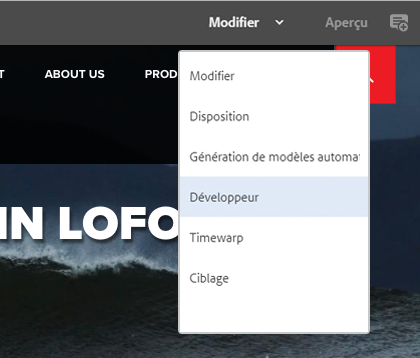
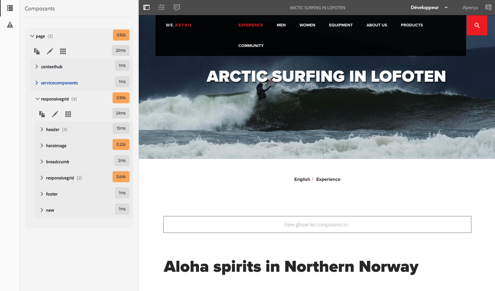
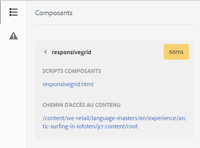
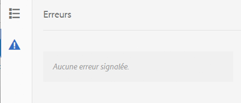

# Mode Développeur{#developer-mode}

Lors de la modification de pages dans AEM, plusieurs [modes](/help/sites-authoring/author-environment-tools.md#modestouchoptimizedui) sont disponibles, notamment le mode Développeur. Celui-ci ouvre un panneau latéral avec plusieurs onglets qui procurent au développeur des informations sur la page en cours. Les trois onglets sont :

* **[Composants](#components)**pour visualiser les informations de structure et de performances.
* **[Tests](#tests)**pour exécuter des tests et analyser les résultats.
* **[Erreurs](#errors)**pour afficher les problèmes rencontrés.

Ils aident les développeurs à :

* découvrir ce qui compose les pages ;
* déboguer en vérifiant la nature des événements, ainsi que leur emplacement et le moment où ils surviennent, afin de résoudre des problèmes ;
* tester si l’application se comporte comme prévu.

>[!CAUTION]
>
>Le mode Développeur :
>
>* est uniquement disponible dans l’IU compatible avec les écrans tactiles (lors de la modification des pages) ;
>* n’est pas disponible sur les périphériques mobiles ou les petites fenêtres sur les ordinateurs de bureau (en raison de l’espace restreint),
   >   * ce qui se produit lorsque la largeur est inférieure à 1 024 px ;
>* N’est disponible que pour les utilisateurs membres du `administrators` groupe.

>[!CAUTION]
>
>Le mode Développeur n’est disponible que sur une instance de création standard qui n’utilise pas le mode d’exécution nosamplecontent.
>
>Si nécessaire, il peut être configuré pour être utilisé :
>
>* sur une instance d’auteur à l’aide du mode d’exécution nosamplecontent
>* sur une instance de publication.
>
>
Il doit être désactivé à nouveau après utilisation.

>[!NOTE]
>
>Voir :
>
>* L’article de la base de connaissances [Résolution des problèmes liés à l’IU tactile d’AEM](https://helpx.adobe.com/experience-manager/kb/troubleshooting-aem-touchui-issues.html) pour d’autres conseils et outils.
>* Session AEM Gems concernant le [mode Développeur d’AEM 6.0](https://docs.adobe.com/content/ddc/en/gems/aem-6-0-developer-mode.html).
>

## Ouverture du mode Développeur {#opening-developer-mode}

Le mode Développeur est mis en œuvre sous la forme d’un panneau latéral dans l’éditeur de page. Pour ouvrir le panneau, sélectionnez **Développeur** dans le sélecteur de mode au niveau de la barre d’outils de l’éditeur de page :

Le panneau est divisé en deux onglets :

* **[Composants](/help/sites-developing/developer-mode.md#components)**: affiche une arborescence de composants, similaire à l&#39;arborescence[de](/help/sites-authoring/author-environment-tools.md#content-tree)contenu pour les auteurs.

* **[Erreurs](/help/sites-developing/developer-mode.md#errors)** : lorsque des problèmes se produisent, les détails sont affichés pour chaque composant.

### Composants {#components}

Il présente une arborescence de composants qui :

* décrit la chaîne de composants et de modèles rendus sur la page (SLY, JSP, etc.) ; L’arborescence peut être développée pour afficher le contexte dans la hiérarchie.
* indique le temps de calcul côté serveur nécessaire pour effectuer le rendu du composant ;
* permet de développer l’arborescence et de sélectionner des composants spécifiques dans l’arborescence. La sélection permet d’accéder aux détails du composant, tels que :

   * Le chemin du référentiel
   * Les liens vers les scripts (accessibles dans CRXDE Lite)

* Les composants sélectionnés (dans le flux de contenu, indiqué par une bordure bleue) sont mis en surbrillance dans l’arborescence de contenu (et inversement).

Cela peut aider à :

* déterminer et comparer le temps de rendu par composant ;
* visualiser et comprendre la hiérarchie ;
* comprendre, puis améliorer, le temps de chargement de la page en recherchant les composants lents.

Chaque entrée de composant peut afficher (par exemple) :

* **Afficher les détails** : lien vers une liste qui affiche :

   * tous les scripts de composants utilisés pour le rendu du composant ;
   * le chemin du contenu de référentiel pour cet élément spécifique.
   

* **Modifier le script** : lien qui :

   * ouvre le script de composant dans CRXDE Lite.

* Le développement d’une entrée de composant (tête de flèche) peut également afficher :

   * la hiérarchie au sein du composant sélectionné ;
   * les temps de rendu pour le composant sélectionné de manière isolée, tous les composants individuels imbriqués qu’il contient, ainsi que le total combiné.
   

>[!CAUTION]
>
>Certains liens pointent sur des scripts sous `/libs`. However, these are for reference only, you **must not** edit anything under `/libs`, as any changes you do make may be lost. Cela est dû au fait que cette branche est exposée aux modifications à chaque mise à niveau ou application d’un correctif/Feature Pack. Any changes you require should be made under `/apps`, see [Overlays and Overrides](/help/sites-developing/overlays.md).

### Erreurs {#errors}

L’onglet **Erreurs** devrait toujours rester vide (comme ci-dessus), mais lorsque des problèmes surviennent, les informations suivantes sont affichées pour chaque composant :

* Un avertissement s’affiche si le composant écrit une entrée dans le journal d’erreurs, avec les détails de l’erreur et des liens directs vers le code correspondant dans CRXDE Lite.
* Un avertissement s’affiche si le composant ouvre une session d’administrateur.

Par exemple, dans l’éventualité où une méthode non définie est appelée, l’erreur obtenue s’affiche sous l’onglet **Erreurs** :

L’entrée du composant dans l’arborescence de l’onglet Composants sera également marquée à l’aide d’un indicateur lorsqu’une erreur se produit.

### Tests {#tests}

>[!CAUTION]
>
>Dans AEM 6.2, les fonctions de test du mode Développeur ont fait l’objet d’une remise en œuvre en tant qu’application Outils autonome.
>
>For full details see [Testing Your UI](/help/sites-developing/hobbes.md).

