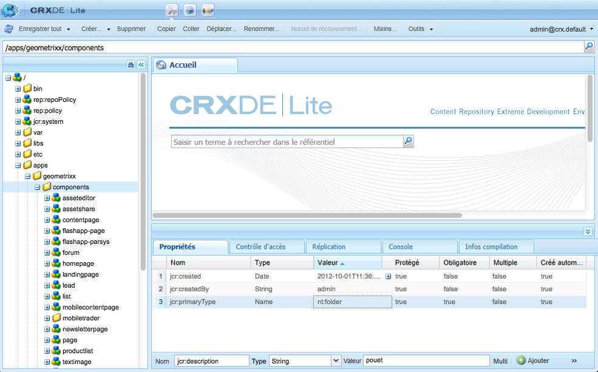
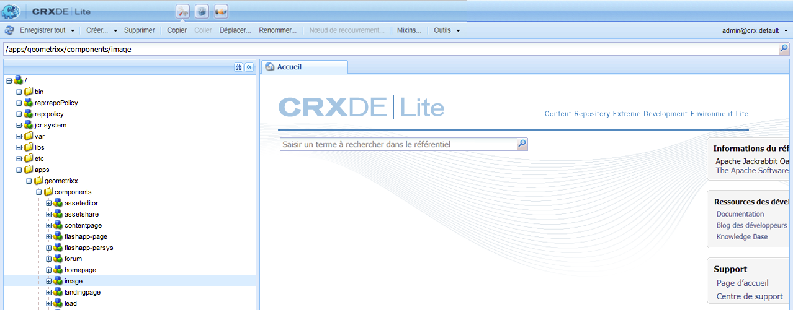
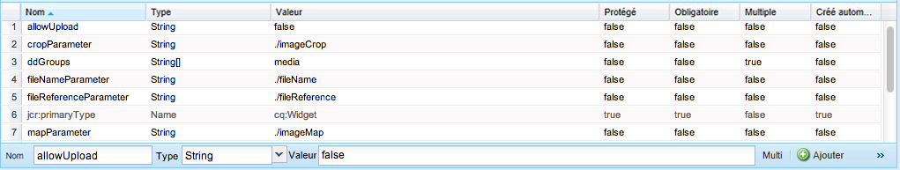
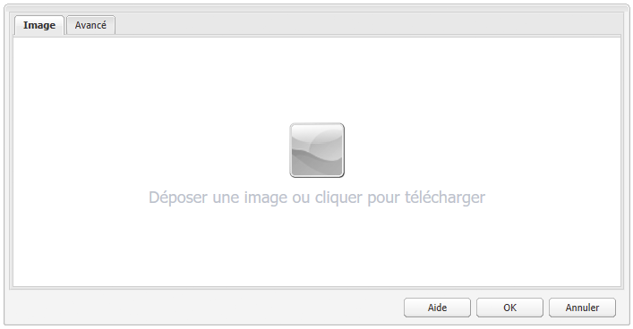
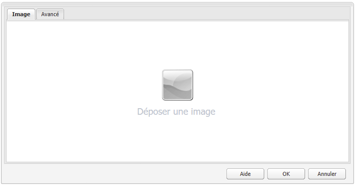

# Développement de composants AEM (IU classique){#developing-aem-components-classic-ui}

L’IU classique utilise ExtJS pour créer des widgets qui donnent leur apparence aux composants. Compte tenu de la nature de ces widgets, il existe des différences entre la façon dont les composants interagissent avec l’interface utilisateur classique et l’[interface utilisateur classique tactile](/help/sites-developing/developing-components.md).

>[!NOTE]
>
>De nombreux aspects du développement de composants sont communs à l’interface utilisateur classique et à l’interface utilisateur tactile. **Vous devez donc lire [AEM Composants - Les concepts de base](/help/sites-developing/components-basics.md) avant** à l’aide de cette page, qui traite des particularités de l’interface utilisateur classique.

>[!NOTE]
>
>Le langage HTL (HTML Template Language) et JSP peuvent tous deux être utilisés pour développer des composants pour l’IU classique. Cependant, cette page illustre le développement avec JSP. Cela est simplement dû au fait que JSP est traditionnellement utilisé dans l’IU classique.
>
>HTL est désormais le langage de script recommandé pour AEM. Voir [HTL](https://docs.adobe.com/content/help/fr-FR/experience-manager-htl/using/overview.html) et [Développement de composants AEM](/help/sites-developing/developing-components.md) pour comparer les méthodes.

## Structure {#structure}

La structure de base d&#39;un composant est traitée sur la page [Composants AEM - Les concepts de base](/help/sites-developing/components-basics.md#structure), qui s&#39;applique à la fois aux interfaces utilisateur tactiles et classiques. Même si vous ne devez pas utiliser les paramètres de l’IU tactile dans votre nouveau composant, il est intéressant de les connaître lorsque vous héritez des composants existants.

## Scripts JSP {#jsp-scripts}

Les servlets ou scripts JSP peuvent être utilisés pour le rendu des composants. Selon les règles de traitement des requêtes de Sling, le nom du script par défaut est :

`<*componentname*>.jsp`

## global.jsp {#global-jsp}

Le fichier de script JSP `global.jsp` est utilisé pour fournir un accès rapide à des objets spécifiques (accéder à du contenu, par exemple) à n’importe quel fichier de script JSP utilisé pour le rendu d’un composant.

Par conséquent, `global.jsp` doit être inclus dans chaque script JSP de rendu de composant dans lequel un ou plusieurs des objets fournis dans `global.jsp` sont utilisés.

L’emplacement du fichier `global.jsp` par défaut est le suivant :

`/libs/foundation/global.jsp`

>[!NOTE]
>
>Le chemin `/libs/wcm/global.jsp`, utilisé par les versions CQ 5.3 et antérieures, est désormais obsolète.

### Fonction de global.jsp, des API utilisées et des bibliothèques de balises {#function-of-global-jsp-used-apis-and-taglibs}

Vous trouverez, ci-dessous, les objets les plus importants fournis à partir du fichier `global.jsp` par défaut :

Résumé :

* `<cq:defineObjects />`

   * `slingRequest` - Objet de requête encapsulé (  `SlingHttpServletRequest`).
   * `slingResponse` - Objet de réponse encapsulé (  `SlingHttpServletResponse`).
   * `resource` - Objet Ressource Sling (  `slingRequest.getResource();`).
   * `resourceResolver` - Objet Sling Resource Resolver (  `slingRequest.getResoucreResolver();`).
   * `currentNode` – Nœud JCR résolu pour la requête.
   * `log` - Journalisation par défaut ().
   * `sling` - Aide de script Sling.
   * `properties` - Les propriétés de la ressource visée (  `resource.adaptTo(ValueMap.class);`).
   * `pageProperties` – Propriétés de la page de la ressource gérée.
   * `pageManager` - Gestionnaire de pages pour l&#39;accès aux pages de contenu AEM (  `resourceResolver.adaptTo(PageManager.class);`).
   * `component` – Objet du composant AEM en cours.
   * `designer` - Objet designer pour la récupération des informations de conception (  `resourceResolver.adaptTo(Designer.class);`).
   * `currentDesign` – Conception de la ressource gérée.
   * `currentStyle` – Style de la ressource gérée.

### Accès au contenu {#accessing-content}

Il existe trois méthodes pour accéder au contenu dans AEM WCM :

* Par le biais de l’objet properties introduit dans `global.jsp` :

   L’objet properties est une instance de ValueMap (voir [API Sling](https://sling.apache.org/apidocs/sling5/org/apache/sling/api/resource/ValueMap.html)) et contient toutes les propriétés de la ressource actuelle.

   Exemple : `String pageTitle = properties.get("jcr:title", "no title");` utilisé dans le script de rendu d’un composant de page.

   Exemple : `String paragraphTitle = properties.get("jcr:title", "no title");` utilisé dans le script de rendu d’un composant de paragraphe standard.

* Par le biais de l&#39;objet `currentPage` introduit dans `global.jsp` :

   L&#39;objet `currentPage` est une instance d&#39;une page (voir [AEM API](https://helpx.adobe.com/experience-manager/6-5/sites/developing/using/reference-materials/javadoc/com/day/cq/wcm/api/Page.mhtml)). La classe de page fournit plusieurs méthodes d’accès au contenu.

   Exemple: `String pageTitle = currentPage.getTitle();`

* Par l&#39;intermédiaire de l&#39;objet `currentNode` introduit dans `global.jsp` :

   L&#39;objet `currentNode` est une instance d&#39;un noeud (voir [API JCR](https://jackrabbit.apache.org/api/2.16/org/apache/jackrabbit/standalone/cli/core/CurrentNode.html)). Les propriétés d&#39;un noeud sont accessibles par la méthode `getProperty()`.

   Exemple: `String pageTitle = currentNode.getProperty("jcr:title");`

## Bibliothèques de balises JSP {#jsp-tag-libraries}

Les bibliothèques de balises CQ et Sling vous donnent accès à des fonctions spécifiques à utiliser dans le script JSP de vos modèles et composants.

Pour plus d’informations, voir le document [Bibliothèques de balises](/help/sites-developing/taglib.md).

## Utilisation de bibliothèques HTML côté client {#using-client-side-html-libraries}

Les sites web modernes sont très dépendants du traitement côté client effectué par du code JavaScript et CSS complexe. Organiser et optimiser la diffusion de ce code est une opération qui peut se révéler complexe.

Pour résoudre ce problème, AEM fournit **Dossiers de bibliothèque côté client**, qui vous permettent de stocker votre code côté client dans le référentiel, de l&#39;organiser en catégories et de définir quand et comment chaque catégorie de code doit être diffusée au client. Le système de bibliothèque côté client se charge alors de la génération des liens appropriés dans la page web finale pour charger le code correct.

Voir le document [Utilisation de bibliothèques HTML côté client](/help/sites-developing/clientlibs.md) pour plus d’informations.

## Boîte de dialogue {#dialog}

Votre composant a besoin d’une boîte de dialogue pour que les auteurs puissent ajouter et configurer le contenu.

Voir [Composants AEM - Les concepts de base](/help/sites-developing/components-basics.md#dialogs) pour plus de détails.

## Configuration du comportement de modification {#configuring-the-edit-behavior}

Vous pouvez configurer le comportement de modification d’un composant. Cela inclut les attributs tels que les actions disponibles pour le composant, les caractéristiques de l’éditeur statique et les écouteurs associés aux événements sur le composant. La configuration est commune aux interfaces utilisateur tactile et classique, avec cependant quelques différences spécifiques.

La [configuration du comportement de modification d’un composant](/help/sites-developing/components-basics.md#edit-behavior) s’effectue en ajoutant un nœud `cq:editConfig` de type `cq:EditConfig` sous le nœud de composant (de type `cq:Component`), ainsi qu’en ajoutant des nœuds enfants et des propriétés spécifiques.

## Utilisation et extension de widgets ExtJS {#using-and-extending-extjs-widgets}

Pour plus d’informations, voir [Utilisation et extension de widgets ExtJS](/help/sites-developing/widgets.md).

## Utilisation de xtypes pour les widgets ExtJS {#using-xtypes-for-extjs-widgets}

Pour plus d’informations, voir [Utilisation de xtypes](/help/sites-developing/xtypes.md).

## Développement de nouveaux composants  {#developing-new-components}

Cette section vous explique comment créer vos propres composants et les ajouter au système de paragraphes.

Pour commencer rapidement, une méthode consiste à copier un élément existant, puis à effectuer les modifications de votre choix.

Le développement d’un composant est décrit en détail dans la section [Extension du composant texte et image – Exemple](#extending-the-text-and-image-component-an-example).

### Développement d’un nouveau composant (adaptation d’un composant existant)  {#develop-a-new-component-adapt-existing-component}

Pour développer un nouveau composant pour AEM sur la base d’un composant existant, vous pouvez copier ce composant, créer un fichier JavaScript pour le nouveau composant et le stocker dans un emplacement accessible à AEM (voir [Personnalisation des composants et d’autres éléments](/help/sites-developing/dev-guidelines-bestpractices.md#customizing-components-and-other-elements)) :

1. À l’aide de CRXDE Lite, créez un dossier de composants dans :

   / `apps/<myProject>/components/<myComponent>`

   Recréez la structure de nœud comme dans libs, puis copiez la définition d’un composant existant, tel que le composant Texte. Par exemple, pour personnaliser le composant Texte, copiez :

   * de `/libs/foundation/components/text`
   * vers `/apps/myProject/components/text`

1. Modifiez `jcr:title` pour refléter son nouveau nom.
1. Ouvrez le nouveau dossier de composants et effectuez les modifications voulues. Supprimez également toute information superflue du dossier.

   Vous pouvez effectuer les modifications suivantes :

   * Ajouter un nouveau champ dans la boîte de dialogue

      * `cq:dialog` - boîte de dialogue pour l&#39;interface utilisateur tactile
      * `dialog` : boîte de dialogue pour l’interface utilisateur classique
   * remplacement du fichier `.jsp` (nommez-le après votre nouveau composant)
   * Retravailler complètement le composant, si vous le souhaitez

   Par exemple, si vous prenez une copie du composant Texte standard, vous pouvez ajouter un champ supplémentaire à la boîte de dialogue, puis mettre à jour `.jsp` pour traiter l&#39;entrée qui y est effectuée.

   >[!NOTE]
   >
   >Un composant pour :
   >
   >* l’interface utilisateur tactile utilise des composants [Granite](https://helpx.adobe.com/fr/experience-manager/6-5/sites/developing/using/reference-materials/granite-ui/api/jcr_root/libs/granite/ui/index.html) ;
   >* l’interface utilisateur classique utilise des [widgets ExtJS](https://helpx.adobe.com/experience-manager/6-5/sites/developing/using/reference-materials/widgets-api/index.html).


   >[!NOTE]
   >
   >Une boîte de dialogue définie pour l’interface utilisateur classique fonctionne dans l’interface utilisateur tactile.
   >
   >En revanche, une boîte de dialogue définie pour l’interface utilisateur tactile ne fonctionne pas dans l’interface utilisateur classique.
   >
   >En fonction de l’instance et de l’environnement de création, vous pouvez définir les deux types de boîte de dialogue pour votre composant.

1. L’un des nœuds suivants doit être présent et correctement initialisé pour que le nouveau composant puisse s’afficher :

   * `cq:dialog` - boîte de dialogue pour l&#39;interface utilisateur tactile
   * `dialog` : boîte de dialogue pour l’interface utilisateur classique
   * `cq:editConfig` : comportement des composants dans l’environnement de modification (glisser-déposer, par exemple)
   * `design_dialog` - boîte de dialogue pour le mode de conception (interface utilisateur classique uniquement)

1. Activez le nouveau composant dans votre système de paragraphes en effectuant l’une des opérations suivantes :

   * en utilisant CRXDE Lite pour ajouter la valeur `<path-to-component>` (par exemple, `/apps/geometrixx/components/myComponent`) aux composants de propriété du noeud `/etc/designs/geometrixx/jcr:content/contentpage/par`
   * Suivez les instructions de la section [Ajout de nouveaux composants aux systèmes de paragraphes](#adding-a-new-component-to-the-paragraph-system-design-mode).

1. Dans AEM WCM, ouvrez une page de votre site web et insérez un nouveau paragraphe du type que vous venez de créer pour vous assurer que le composant fonctionne correctement.

>[!NOTE]
>
>Pour afficher les statistiques de minutage du chargement de page, vous pouvez utiliser Ctrl-Maj-U - avec `?debugClientLibs=true` défini dans l’URL.

### Ajout d’un nouveau composant au système de paragraphes (mode Création) {#adding-a-new-component-to-the-paragraph-system-design-mode}

Une fois que le composant a été développé, vous l’ajoutez au système de paragraphes, ce qui permet aux auteurs de le sélectionner et de l’utiliser lors de la modification d’une page.

1. Accédez à une page de votre environnement de création qui utilise le système de paragraphe, par exemple `<contentPath>/Test.html`.
1. Pour basculer vers le mode Création, effectuez l’une des opérations suivantes :

   * ajouter `?wcmmode=design` à la fin de l’URL et y accéder de nouveau, par exemple :

      `<contextPath>/ Test.html?wcmmode=design`

   * Cliquez sur Conception dans le sidekick.

   Vous êtes maintenant en mode Création et vous pouvez modifier le système de paragraphes.

1. Cliquez sur Modifier.

   La liste des composants appartenant au système de paragraphes est affichée. Votre nouveau composant est également répertorié.

   Les composants peuvent être activés (ou désactivés) pour déterminer lesquels sont proposés à l’auteur lors de la modification d’une page.

1. Activez votre composant, puis revenez au mode d’édition normal pour vérifier qu’il est bien disponible.

### Extension du composant Texte et image – Exemple  {#extending-the-text-and-image-component-an-example}

Cette section vous explique comment étendre le composant Texte et image standard (un composant couramment utilisé) avec une fonctionnalité de placement d’images configurable.

L’extension du composant Texte et image permet aux éditeurs d’utiliser toutes les fonctionnalités existantes du composant et leur offre, en outre, la possibilité de positionner l’image :

* Sur le côté gauche du texte (comportement actuel et nouvelle valeur par défaut)
* Ainsi que sur le côté droit

Après avoir étendu ce composant, vous pouvez configurer le positionnement des images au moyen de la boîte de dialogue correspondante.

Les techniques suivantes sont décrites dans cet exercice :

* Copie du nœud de composant existant et modification de ses métadonnées
* Modification de la boîte de dialogue du composant, y compris l’héritage des widgets des boîtes de dialogue parentes
* Modification du script du composant pour mettre en œuvre la nouvelle fonctionnalité

>[!NOTE]
>
>Cet exemple concerne l’IU classique.

>[!NOTE]
>
>Cet exemple est basé sur l’échantillon de contenu Geometrixx. Celui-ci n’est plus fourni avec AEM et a été remplacé par We.Retail. Voir le document [Implémentation de référence We.Retail](/help/sites-developing/we-retail.md#we-retail-geometrixx) pour savoir comment télécharger et installer le Geometrixx.

#### Extension du composant textimage existant {#extending-the-existing-textimage-component}

Pour créer le nouveau composant, nous utilisons le composant textimage standard comme base et nous le modifions. Nous allons stocker le nouveau composant dans l’exemple d’application Geometrixx AEM WCM.

1. Copiez le composant textimage standard de `/libs/foundation/components/textimage` dans le dossier du composant de Geometrixx, `/apps/geometrixx/components`, en utilisant textimage comme nom de noeud de cible. (Pour copier le composant, accédez à son emplacement, cliquez avec le bouton droit de la souris, sélectionnez Copier, puis accédez au répertoire cible.)

   

1. Pour que cet exemple reste simple, accédez au composant que vous avez copié et supprimez tous les sous-nœuds du nouveau nœud textimage, à l’exception de ceux mentionnés ci-dessous :

   * définition de boîte de dialogue : `textimage/dialog`
   * script de composant : `textimage/textimage.jsp`
   * modifier le noeud de configuration (permettant le glisser-déposer des ressources) : `textimage/cq:editConfig`

   >[!NOTE]
   >
   >La définition de la boîte de dialogue dépend de l’interface utilisateur :
   >
   >* Interface utilisateur tactile : `textimage/cq:dialog`
   >* IU classique :`textimage/dialog`


1. Modifiez les métadonnées du composant :

   * Nom du composant

      * Définissez `jcr:description` sur `Text Image Component (Extended)`
      * Définissez `jcr:title` sur `Text Image (Extended)`
   * Groupe, où le composant est répertorié dans le sidekick (laisser tel quel)

      * Laissez `componentGroup` défini sur `General`
   * Composant parent pour le nouveau composant (le composant textimage standard)

      * Définissez `sling:resourceSuperType` sur `foundation/components/textimage`

   Après cette étape, le nœud de composant ressemble à ceci :

   

1. Modifiez la propriété `sling:resourceType` du noeud modifier la configuration de l&#39;image (propriété : `textimage/cq:editConfig/cq:dropTargets/image/parameters/sling:resourceType`) à `geometrixx/components/textimage.`

   De cette manière, lorsqu’une image est déposée sur le composant de la page, la propriété `sling:resourceType` du composant textimage étendu est définie sur `geometrixx/components/textimage.`.

1. Modifiez la boîte de dialogue du composant afin d’inclure la nouvelle option. Le nouveau composant hérite des sections de la boîte de dialogue qui sont identiques à l’original. Le seul ajout que nous effectuons consiste à étendre l’onglet **Avancé**, en ajoutant une liste déroulante **Position d’image**, avec les options **Gauche** et **Droite** :

   * Laissez les propriétés `textimage/dialog`inchangées.

   Notez que `textimage/dialog/items` comporte quatre sous-nœuds, tab1 à tab4, qui représentent les quatre onglets de la boîte de dialogue textimage.

   * Pour les deux premiers onglets (tab1 et tab2) :

      * Changez xtype en cqinclude (pour hériter du composant standard).
      * Ajoutez une propriété path avec les valeurs `/libs/foundation/components/textimage/dialog/items/tab1.infinity.json`et `/libs/foundation/components/textimage/dialog/items/tab2.infinity.json`, respectivement.
      * Supprimez toutes les autres propriétés ou tous les autres sous-nœuds.
   * Pour tab3 :

      * Ne modifiez pas les autres propriétés et sous-nœuds.
      * Ajouter une nouvelle définition de champ à `tab3/items`, position de noeud de type `cq:Widget`
      * Définissez les propriétés suivantes (de type String) pour le nouveau `tab3/items/position`noeud :

         * `name`: `./imagePosition`
         * `xtype`:  `selection`
         * `fieldLabel`:  `Image Position`
         * `type`:  `select`
      * Ajoutez le sous-noeud `position/options` de type `cq:WidgetCollection` pour représenter les deux choix de placement d’image et créez sous celui-ci deux noeuds, o1 et o2 de type `nt:unstructured`.
      * Pour le noeud `position/options/o1`, définissez les propriétés : `text` à `Left` et `value` à `left.`
      * Pour le noeud `position/options/o2`, définissez les propriétés : `text` à `Right` et `value` à `right`.
   * Supprimez tab4.

   La position de l’image est conservée dans le contenu en tant que propriété `imagePosition` du nœud représentant le paragraphe `textimage`. Après avoir suivi ces étapes, la boîte de dialogue du composant ressemble à ceci :

   

1. Étendez le script du composant, `textimage.jsp`, avec une gestion supplémentaire du nouveau paramètre :

   ```xml
   Image image = new Image(resource, "image");
   
   if (image.hasContent() || WCMMode.fromRequest(request) == WCMMode.EDIT) {
        image.loadStyleData(currentStyle);
   ```

   Nous allons remplacer le fragment de code *%>&lt;div class=&quot;image&quot;>&lt;%* par le nouveau code qui génère un style personnalisé pour cette balise.

   ```xml
   // todo: add new CSS class for the 'right image' instead of using
   // the style attribute
   String style="";
        if (properties.get("imagePosition", "left").equals("right")) {
             style = "style=\"float:right\"";
        }
        %><div <%= style %> class="image"><%
   ```

1. Enregistrez le composant dans le référentiel. Le composant est prêt à être testé.

#### Vérification du nouveau composant {#checking-the-new-component}

Une fois que le composant a été développé, vous pouvez l’ajouter au système de paragraphes, ce qui permet aux auteurs de le sélectionner et de l’utiliser lors de la modification d’une page. Les étapes suivantes vous permettent de tester le composant.

1. Ouvrez une page dans Geometrixx ; English / Company, par exemple.
1. Basculez vers le mode Création en cliquant sur Conception dans le sidekick.
1. Modifiez la conception du système de paragraphes en cliquant sur Modifier dans le système de paragraphes au milieu de la page. La liste des composants qui peuvent être placés dans le système de paragraphes s’affiche alors. Elle doit inclure le composant que vous venez de développer, à savoir Texte Image (Étendu). Activez-le pour le système de paragraphes en le sélectionnant et en cliquant sur OK.
1. Revenez au mode d’édition.
1. Ajoutez le paragraphe Texte Image (Étendu) au système de paragraphes, puis initialisez le texte et l’image avec l’échantillon de contenu. Enregistrez les modifications.
1. Ouvrez la boîte de dialogue du paragraphe de texte et d’image, définissez la position de l’image sur Droite dans l’onglet Avancé, puis cliquez sur OK pour enregistrer les modifications.
1. Le rendu du paragraphe est effectué avec l’image sur la droite.
1. Le composant est maintenant prêt à l’emploi.

Le composant stocke son contenu dans un paragraphe sur la page Company.

### Désactivation de la fonctionnalité Téléchargement du composant image  {#disable-upload-capability-of-the-image-component}

Pour désactiver cette fonctionnalité, nous utilisons le composant d&#39;image standard comme base et nous le modifions. Nous allons stocker le nouveau composant dans l’exemple d’application Geometrixx.

1. Copiez le composant d’image standard de `/libs/foundation/components/image` dans le dossier du composant de Geometrixx, `/apps/geometrixx/components`, en utilisant l’image comme nom de noeud de cible.

   

1. Modifiez les métadonnées du composant :

   * Définissez **jcr:title** sur `Image (Extended)`

1. Accéder à `/apps/geometrixx/components/image/dialog/items/image`.
1. Ajouter une nouvelle propriété :

   * **Nom** : `allowUpload`
   * **Type** : `String`
   * **Valeur**: `false`

   

1. Cliquez sur **Enregistrer tout**. Le composant est prêt à être testé.
1. Ouvrez une page dans Geometrixx ; English / Company, par exemple.
1. Basculez vers le mode Création et activez Image (Étendu).
1. Revenez au mode d’édition et ajoutez-le au système de paragraphes. Sur les images suivantes, vous pouvez voir les différences entre le composant image d’origine et celui que vous venez de créer.

   Composant image d’origine :

   

   Votre nouveau composant image :

   

1. Le composant est maintenant prêt à l’emploi.

