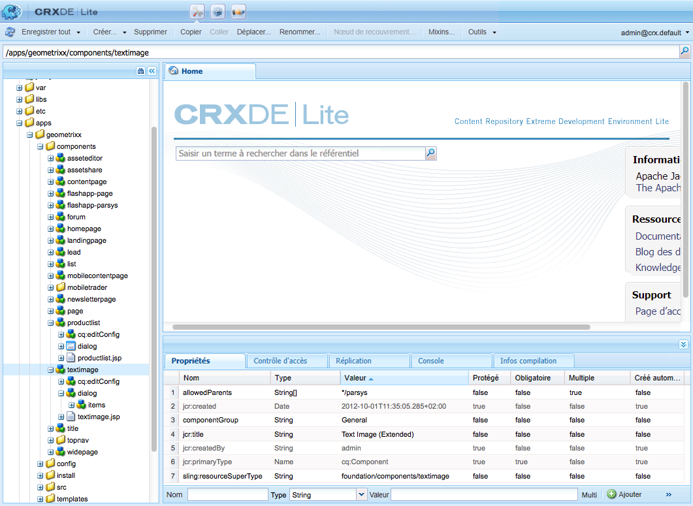

# Développer des composants Adobe Experience Manager (AEM) (IU classique){#developing-aem-components-classic-ui}

L’IU classique utilise ExtJS pour créer des widgets qui donnent l’aspect des composants. En raison de la nature de ces widgets, il existe des différences entre la manière dont les composants interagissent avec l’IU classique et l’[IU tactile](/help/sites-developing/developing-components.md).

>[!NOTE]
>
>De nombreux aspects du développement de composants sont communs aux deux interfaces utilisateur, **vous êtes donc invité à lire la page [Principes de base des composants AEM](/help/sites-developing/components-basics.md) avant** d’utiliser cette page qui traite des particularités de l’IU classique.

>[!NOTE]
>
>Les langages HTL (HTML Template Language) et JSP peuvent tous deux être utilisés pour développer des composants pour l’IU classique. Cependant, cette page illustre le développement avec JSP. Cela est simplement dû au fait que JSP est traditionnellement utilisé dans l’IU classique.
>
>HTL est désormais le langage de script recommandé pour AEM. Pour comparer les deux méthodes, reportez-vous aux sections [HTL](https://experienceleague.adobe.com/docs/experience-manager-htl/using/overview.html?lang=fr) et [Développement de composants AEM](/help/sites-developing/developing-components.md).

## Structure {#structure}

La structure de base d’un composant est traitée à la page [Principes de base des composants AEM](/help/sites-developing/components-basics.md#structure) qui s’applique aux interfaces utilisateur classique et tactile. Même si vous n’avez pas besoin d’utiliser les paramètres de l’IU tactile de votre nouveau composant, il peut être utile d’en prendre connaissance lors de l’héritage de composants existants.

## Scripts JSP {#jsp-scripts}

Les servlets ou scripts JSP peuvent être utilisés pour effectuer le rendu des composants. Selon les règles de traitement des requêtes de Sling, le nom du script par défaut est :

`<*componentname*>.jsp`

## global.jsp {#global-jsp}

Le fichier de script JSP `global.jsp` est utilisé pour fournir un accès rapide à des objets spécifiques (accès au contenu) à n’importe quel fichier de script JSP utilisé pour le rendu d’un composant.

Par conséquent, `global.jsp` doit être inclus dans chaque script JSP de rendu de composant dans lequel un ou plusieurs des objets fournis dans `global.jsp` sont utilisés.

L’emplacement du fichier `global.jsp` par défaut est le suivant :

`/libs/foundation/global.jsp`

>[!NOTE]
>
>Le chemin d’accès `/libs/wcm/global.jsp`, qui était utilisé par les versions CQ 5.3 et antérieures, est désormais obsolète.

### Fonction de global.jsp, des API utilisées et des bibliothèques de balises {#function-of-global-jsp-used-apis-and-taglibs}

Vous trouverez, ci-dessous, les objets les plus importants fournis à partir du fichier `global.jsp` par défaut :

Résumé :

* `<cq:defineObjects />`

   * `slingRequest` – Objet Requête enveloppé (`SlingHttpServletRequest`)
   * `slingResponse` – Objet Réponse enveloppé (`SlingHttpServletResponse`)
   * `resource` – Objet Ressource Sling (`slingRequest.getResource();`)
   * `resourceResolver` – Objet Résolveur de ressources Sling (`slingRequest.getResoucreResolver();`)
   * `currentNode`– Nœud JCR résolu pour la requête
   * `log` – Enregistreur par défaut ().
   * `sling` – Assistant de script Sling
   * `properties` – Propriétés de la ressource gérée (`resource.adaptTo(ValueMap.class);`)
   * `pageProperties` – Propriétés de la page de la ressource gérée
   * `pageManager` – Gestionnaire de pages permettant d’accéder aux pages de contenu AEM (`resourceResolver.adaptTo(PageManager.class);`)
   * `component` : objet du composant AEM en cours
   * `designer` : objet Designer permettant de récupérer des informations de conception (`resourceResolver.adaptTo(Designer.class);`)
   * `currentDesign` – Conception de la ressource gérée
   * `currentStyle` – Style de la ressource gérée

### Accès au contenu {#accessing-content}

Il existe trois méthodes pour accéder au contenu dans AEM WCM :

* Par le biais de l’objet de propriétés introduit dans `global.jsp` :

  L’objet de propriétés est une instance d’une ValueMap (voir [API Sling](https://sling.apache.org/apidocs/sling5/org/apache/sling/api/resource/ValueMap.html)) et contient toutes les propriétés de la ressource active.

  Exemple : `String pageTitle = properties.get("jcr:title", "no title");` utilisé dans le script de rendu d’un composant de page.

  Exemple : `String paragraphTitle = properties.get("jcr:title", "no title");` utilisé dans le script de rendu d’un composant de paragraphe standard.

* Par le biais de l’objet `currentPage` introduit dans `global.jsp` :

  L’objet `currentPage` est une instance d’une page (voir [API AEM](https://helpx.adobe.com/experience-manager/6-5/sites/developing/using/reference-materials/javadoc/com/day/cq/wcm/api/Page.html)). La classe de page fournit plusieurs méthodes d’accès au contenu.

  Exemple : `String pageTitle = currentPage.getTitle();`

* Par le biais de l’objet `currentNode` introduit dans `global.jsp` :

  L’objet `currentNode` est une instance d’un nœud (voir [API JCR](https://jackrabbit.apache.org/api/2.16/org/apache/jackrabbit/standalone/cli/core/CurrentNode.html)). Les propriétés d’un nœud sont accessibles via la méthode `getProperty()`.

  Exemple : `String pageTitle = currentNode.getProperty("jcr:title");`

## Bibliothèques de balises JSP {#jsp-tag-libraries}

Les bibliothèques de balises CQ et Sling vous donnent accès à des fonctions spécifiques à utiliser dans le script JSP de vos modèles et composants.

Pour plus d’informations, consultez le document [Bibliothèques de balises](/help/sites-developing/taglib.md).

## Utiliser les bibliothèques HTML côté client {#using-client-side-html-libraries}

Les sites web modernes reposent largement sur un traitement côté client piloté par un code JavaScript et CSS complexe. Organiser et optimiser la diffusion de ce code est une opération qui peut se révéler complexe.

Pour résoudre ce problème, AEM fournit des **dossiers de bibliothèques côté client** qui permettent de stocker le code côté client dans le référentiel, de le classer par catégorie et de définir quand et comment chaque catégorie de code doit être diffusée au client ou à la cliente. Le système de bibliothèque côté client se charge alors de la génération des liens appropriés dans la page Web finale pour charger le code correct.

Pour plus d’informations, consultez le document [Utilisation de bibliothèques HTML côté client](/help/sites-developing/clientlibs.md).

## Boîte de dialogue {#dialog}

Votre composant a besoin d’une boîte de dialogue pour que les auteurs et les autrices puissent ajouter du contenu et le configurer.

Pour plus d’informations, consultez [Composants AEM – Principes de base](/help/sites-developing/components-basics.md#dialogs).

## Configuration du comportement de modification {#configuring-the-edit-behavior}

Vous pouvez configurer le comportement de modification d’un composant. Cela inclut des attributs tels que les actions disponibles pour le composant, les caractéristiques de l’éditeur statique et les écouteurs associés aux événements sur le composant. La configuration est commune aux interfaces utilisateur tactile et classique, mais avec certaines différences spécifiques.

La [configuration du comportement de modification d’un composant](/help/sites-developing/components-basics.md#edit-behavior) s’effectue en ajoutant un nœud `cq:editConfig` de type `cq:EditConfig` sous le nœud de composant (de type `cq:Component`), ainsi qu’en ajoutant des nœuds enfants et des propriétés spécifiques.

## Utilisation et extension de widgets ExtJS {#using-and-extending-extjs-widgets}

Pour plus d’informations, consultez [Utilisation et extension de widgets ExtJS](/help/sites-developing/widgets.md).

## Utilisation de xtypes pour les widgets ExtJS {#using-xtypes-for-extjs-widgets}

Voir [Utilisation de xtypes](/help/sites-developing/xtypes.md) pour plus d’informations.

## Développement de nouveaux composants {#developing-new-components}

Cette section explique comment créer vos propres composants et les ajouter au système de paragraphes.

Pour commencer rapidement, une méthode consiste à copier un élément existant, puis à effectuer les modifications de votre choix.

Vous trouverez un exemple détaillé de développement d’un composant dans la section [Extension du composant Texte et image – Exemple.](#extending-the-text-and-image-component-an-example)

### Développement d’un nouveau composant (adaptation d’un composant existant) {#develop-a-new-component-adapt-existing-component}

Pour développer de nouveaux composants pour AEM à partir d’un composant existant, vous pouvez copier le composant, créer un fichier JavaScript pour le nouveau composant et le stocker dans un emplacement accessible à AEM (voir également [Personnalisation des composants et autres éléments](/help/sites-developing/dev-guidelines-bestpractices.md#customizing-components-and-other-elements)) :

1. À l’aide de CRXDE Lite, créez un dossier de composants dans :

   / `apps/<myProject>/components/<myComponent>`

   Recréez la structure de nœud comme dans libs, puis copiez la définition d’un composant existant, tel que le composant Texte. Par exemple, pour personnaliser le composant Texte, copiez :

   * de `/libs/foundation/components/text`
   * vers `/apps/myProject/components/text`

1. Modifiez le `jcr:title` en tenant compte de son nouveau nom.
1. Ouvrez le nouveau dossier de composants et apportez les modifications nécessaires. Supprimez également toutes les informations superflues contenues dans le dossier.

   Vous pouvez apporter des modifications telles que :

   * ajout d’un champ dans la boîte de dialogue

      * `cq:dialog` : boîte de dialogue pour l’interface utilisateur tactile
      * `dialog` : boîte de dialogue pour l’interface utilisateur classique

   * Remplacer le fichier `.jsp` (lui donner le nom du nouveau composant) ou
   * Retravailler complètement le composant, si vous le souhaitez

   Par exemple, si vous prenez une copie du composant Texte standard, vous pouvez ajouter un champ supplémentaire à la boîte de dialogue, puis mettre à jour le fichier `.jsp` pour traiter l’entrée qui y est effectuée.

   >[!NOTE]
   >
   >Un composant pour :
   >
   >* l’interface utilisateur tactile utilise des composants [Granite](https://developer.adobe.com/experience-manager/reference-materials/6-5/granite-ui/api/jcr_root/libs/granite/ui/index.html) ;
   >* l’interface utilisateur classique utilise des [Widgets ExtJS](https://developer.adobe.com/experience-manager/reference-materials/6-5/widgets-api/index.html).

   >[!NOTE]
   >
   >Une boîte de dialogue définie pour l’interface utilisateur classique fonctionnera dans l’interface utilisateur optimisée pour les écrans tactiles.
   >
   >Une boîte de dialogue définie pour l’interface utilisateur optimisée pour les écrans tactiles ne fonctionnera pas dans l’interface utilisateur classique.
   >
   >En fonction de l’instance et de l’environnement de création, vous pouvez définir les deux types de boîte de dialogue pour votre composant.

1. L’un des nœuds suivants doit être présent et correctement initialisé pour que le nouveau composant puisse s’afficher :

   * `cq:dialog` : boîte de dialogue pour l’interface utilisateur tactile
   * `dialog` : boîte de dialogue pour l’interface utilisateur classique
   * `cq:editConfig` : comportement des composants dans l’environnement de modification (glisser-déposer, par exemple)
   * `design_dialog` : boîte de dialogue pour le mode Création (interface utilisateur classique uniquement)

1. Activez le nouveau composant dans votre système de paragraphes en effectuant l’une des opérations suivantes :

   * Utilisez CRXDE Lite pour ajouter la valeur `<path-to-component>` (par exemple : `/apps/geometrixx/components/myComponent`) à la propriété Composants du nœud `/etc/designs/geometrixx/jcr:content/contentpage/par`.
   * Suivez les instructions de la section [Ajout de nouveaux composants aux systèmes de paragraphes](#adding-a-new-component-to-the-paragraph-system-design-mode).

1. Dans AEM WCM, ouvrez une page de votre site web et insérez un paragraphe du type que vous avez créé pour vous assurer que le composant fonctionne correctement.

>[!NOTE]
>
>Pour afficher des statistiques de durée pour le chargement d’une page, vous pouvez utiliser la combinaison de touches Ctrl+Maj+U, avec `?debugClientLibs=true` défini dans l’URL.

### Ajout d’un nouveau composant au système de paragraphes (mode de conception) {#adding-a-new-component-to-the-paragraph-system-design-mode}

Une fois le composant développé, vous l’ajoutez au système de paragraphes, ce qui permet aux auteurs et autrices de sélectionner et d’utiliser le composant lors de la modification d’une page.

1. Accédez à une page de votre environnement de création qui utilise le système de paragraphes, par exemple : `<contentPath>/Test.html`.
1. Pour basculer vers le mode Création, effectuez l’une des opérations suivantes :

   * Ajoutez `?wcmmode=design` à la fin de l’URL et accédez-y à nouveau. Par exemple :

     `<contextPath>/ Test.html?wcmmode=design`

   * Cliquez sur Conception dans le sidekick.

   Vous êtes désormais en mode de conception et pouvez modifier le système de paragraphes.

1. Cliquez sur Modifier.

   Une liste des composants appartenant au système de paragraphes s’affiche. Votre nouveau composant est également répertorié.

   Les composants peuvent être activés (ou désactivés) pour déterminer lesquels sont proposés à l’auteur ou à l’autrice lors de la modification d’une page.

1. Activez votre composant, puis revenez au mode de modification normal pour confirmer qu’il est disponible.

### Extension du composant Texte et image – Exemple {#extending-the-text-and-image-component-an-example}

Cette section fournit un exemple d’extension du composant standard Texte et Image, couramment utilisé, avec une fonctionnalité de placement d’image configurable.

L’extension du composant Texte et image permet aux éditeurs et éditrices d’utiliser toutes les fonctionnalités existantes du composant et d’avoir une option supplémentaire permettant de spécifier le placement de l’image :

* Sur le côté gauche du texte (comportement actuel et nouvelle valeur par défaut)
* Et sur le côté droit

Après avoir étendu ce composant, vous pouvez configurer le placement d’image par le biais de la boîte de dialogue du composant.

Les techniques suivantes sont décrites dans cet exercice :

* Copie d’un nœud de composant existant et modification de ses métadonnées
* Modification de la boîte de dialogue du composant, y compris l’héritage des widgets des boîtes de dialogue parentes
* Modification du script du composant pour mettre en œuvre la nouvelle fonctionnalité

>[!NOTE]
>
>Cet exemple concerne l’IU classique.

>[!NOTE]
>
>Cet exemple est basé sur l’échantillon de contenu Geometrixx. Celui-ci n’est plus fourni avec AEM et a été remplacé par We.Retail. Pour savoir comment télécharger et installer Geometrixx, consultez le document [Implémentation de référence We.Retail](/help/sites-developing/we-retail.md#we-retail-geometrixx).

#### Extension du composant textimage existant {#extending-the-existing-textimage-component}

Pour créer le composant, nous utilisons le composant textimage standard que nous allons modifier. Nous allons stocker le nouveau composant dans l’exemple d’application de gestion de contenu web Geometrixx AEM.

1. Copiez le composant textimage standard depuis `/libs/foundation/components/textimage` dans le dossier de composants Geometrixx, `/apps/geometrixx/components`, en utilisant textimage comme nom de nœud cible. (Pour copier le composant, accédez à son emplacement, cliquez avec le bouton droit de la souris, sélectionnez Copier, puis accédez au répertoire cible.)

   

1. Pour que cet exemple reste simple, accédez au composant que vous avez copié et supprimez tous les sous-nœuds du nouveau nœud textimage, à l’exception de ceux mentionnés ci-dessous :

   * définition de boîte de dialogue : `textimage/dialog`
   * script de composant : `textimage/textimage.jsp`
   * nœud de configuration d’édition (autorisant le déplacement de ressources par glisser-déposer) : `textimage/cq:editConfig`

   >[!NOTE]
   >
   >La définition de la boîte de dialogue dépend de l’interface utilisateur :
   >
   >* Interface utilisateur optimisée pour les écrans tactiles : `textimage/cq:dialog`
   >* Interface utilisateur classique : `textimage/dialog`

1. Modifiez les métadonnées du composant :

   * Nom du composant

      * Définissez `jcr:description` sur `Text Image Component (Extended)`.
      * Définissez `jcr:title` sur `Text Image (Extended)`.

   * Groupe où le composant est répertorié dans le sidekick (laisser tel quel)

      * Conservez la définition de `componentGroup` sur `General`.

   * Composant parent pour le nouveau composant (le composant textimage standard)

      * Définissez `sling:resourceSuperType` sur `foundation/components/textimage`.

   Après cette étape, le nœud de composant ressemble à ceci :

   

1. Modifiez la propriété `sling:resourceType` du nœud de configuration d’édition de l’image (propriété : `textimage/cq:editConfig/cq:dropTargets/image/parameters/sling:resourceType`) sur `geometrixx/components/textimage.`.

   De cette manière, lorsqu’une image est déposée sur le composant de la page, la propriété `sling:resourceType` du composant textimage étendu est définie sur `geometrixx/components/textimage.`.

1. Modifiez la boîte de dialogue du composant pour inclure la nouvelle option. Le nouveau composant hérite des parties de la boîte de dialogue qui sont identiques à celles de l’original. Le seul ajout consiste à étendre l’onglet **Avancé**, en ajoutant une liste déroulante **Position de l’image**, avec les options **Gauche** et **Droite** :

   * Laissez les propriétés `textimage/dialog` telles quelles.

   Notez que `textimage/dialog/items` comporte quatre sous-nœuds, tab1 à tab4, qui représentent les quatre onglets de la boîte de dialogue textimage.

   * Pour les deux premiers onglets (tab1 et tab2) :

      * Modifiez xtype en cqinclude (pour hériter du composant standard).
      * Ajoutez une propriété path avec les valeurs `/libs/foundation/components/textimage/dialog/items/tab1.infinity.json` et `/libs/foundation/components/textimage/dialog/items/tab2.infinity.json`, respectivement.
      * Supprimez toutes les autres propriétés ou sous-nœuds.

   * Pour tab3 :

      * Ne modifiez pas les propriétés et les sous-nœuds.
      * Ajoutez une définition de champ à `tab3/items`, la position du nœud de type `cq:Widget`.
      * Définissez les propriétés suivantes (du type String) pour le nouveau nœud `tab3/items/position` :

         * `name`: `./imagePosition`
         * `xtype`: `selection`
         * `fieldLabel`: `Image Position`
         * `type`: `select`

      * Ajoutez un sous-nœud `position/options` de type `cq:WidgetCollection` pour représenter les deux options de positionnement d’images. En dessous, créez deux nœuds, o1 et o2, de type `nt:unstructured`.
      * Pour le nœud `position/options/o1`, définissez les propriétés : `text` sur `Left` et `value` sur `left.`
      * Pour le nœud `position/options/o2`, définissez les propriétés : `text` sur `Right` et `value` sur `right`.

   * Supprimez tab4.

   La position de l’image est conservée dans le contenu en tant que propriété `imagePosition` du nœud représentant le paragraphe `textimage`. Après avoir suivi ces étapes, la boîte de dialogue du composant ressemble à ceci :

   

1. Étendez le script du composant, `textimage.jsp`, avec une gestion supplémentaire du nouveau paramètre :

   ```xml
   Image image = new Image(resource, "image");
   
   if (image.hasContent() || WCMMode.fromRequest(request) == WCMMode.EDIT) {
        image.loadStyleData(currentStyle);
   ```

   Nous allons remplacer le fragment de code mis en valeur, *%>&lt;div class=&quot;image&quot;>&lt;%*, par un nouveau code qui génère un style personnalisé pour cette balise.

   ```xml
   // todo: add new CSS class for the 'right image' instead of using
   // the style attribute
   String style="";
        if (properties.get("imagePosition", "left").equals("right")) {
             style = "style=\"float:right\"";
        }
        %><div <%= style %> class="image"><%
   ```

1. Enregistrez le composant dans le référentiel. Le composant est prêt à être testé.

#### Vérification du nouveau composant {#checking-the-new-component}

Une fois le composant développé, vous pouvez l’ajouter au système de paragraphes, ce qui permet aux auteurs et autrices de sélectionner et d’utiliser le composant lors de la modification d’une page. Ces étapes vous permettent de tester le composant.

1. Ouvrez une page dans Geometrixx, par exemple Anglais/Entreprise.
1. Passez en mode de conception en cliquant sur Conception dans le sidekick.
1. Modifiez la conception du système de paragraphes en cliquant sur Modifier dans le système de paragraphes au milieu de la page. Une liste des composants qui peuvent être placés dans le système de paragraphes s’affiche. Elle devrait inclure votre nouveau composant, Texte Image (étendu). Activez-le pour le système de paragraphes en le sélectionnant et en cliquant sur OK.
1. Revenez au mode de modification.
1. Ajoutez le paragraphe Texte Image (étendu) au système de paragraphes, et initialisez le texte et l’image avec un exemple de contenu. Enregistrez les modifications.
1. Ouvrez la boîte de dialogue du paragraphe Texte et image, définissez la position de l’image dans l’onglet Avancé sur Droite, puis cliquez sur OK pour enregistrer les modifications.
1. Le rendu du paragraphe est effectué avec l’image à droite.
1. Le composant est maintenant prêt à l’emploi.

Le composant stocke son contenu dans un paragraphe sur la page Entreprises.

### Désactivation de la fonctionnalité de chargement du composant Image {#disable-upload-capability-of-the-image-component}

Pour désactiver cette fonctionnalité, vous devez utiliser le composant image standard et le modifier. Vous allez stocker le nouveau composant dans l’exemple d’application Geometrixx.

1. Copiez le composant image standard depuis `/libs/foundation/components/image` dans le dossier de composants Geometrixx, `/apps/geometrixx/components`, en utilisant « image » comme nom de nœud cible.

   

1. Modifiez les métadonnées du composant :

   * Définissez **jcr:title** sur `Image (Extended)`.

1. Accédez à `/apps/geometrixx/components/image/dialog/items/image`.
1. Ajoutez une propriété :

   * **Nom** : `allowUpload`
   * **Type** : `String`
   * **Valeur** : `false`

   

1. Cliquez sur **Enregistrer tout**. Le composant est prêt à être testé.
1. Ouvrez une page dans Geometrixx, par exemple Anglais/Entreprise.
1. Passez en mode de conception et activez Image (étendu).
1. Revenez au mode d’édition et ajoutez-le au système de paragraphes. Sur les images suivantes, vous pouvez voir les différences entre le composant Image d’origine et celui que vous venez de créer.

   Composant Image d’origine :

   

   Votre nouveau composant image :

   

1. Le composant est maintenant prêt à l’emploi.
