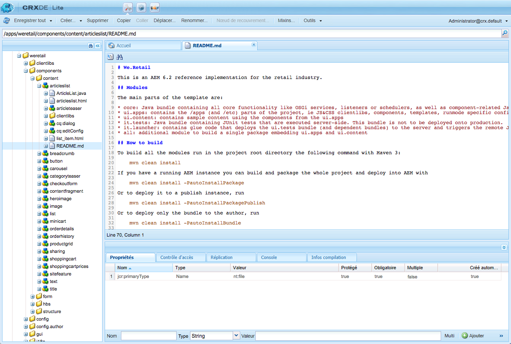

# Développement de composants AEM{#developing-aem-components}

Les composants AEM servent à stocker, mettre en forme et générer le rendu du contenu diffusé dans vos pages web.

* Lors de la [création de pages](/help/sites-authoring/default-components.md), les composants permettent aux auteurs de modifier et de configurer le contenu.

   * Lors de la construction d’un site [marchand](/help/sites-administering/ecommerce.md), les composants peuvent, par exemple, collecter et afficher des informations issues du catalogue.
Pour plus d’informations, voir [Développement du commerce électronique](/help/sites-developing/ecommerce.md).

   * Lors de la construction d’un site de [communauté](/help/communities/author-communities.md), les composants peuvent fournir des informations et en collecter auprès des visiteurs.
Pour plus d’informations, voir [Développement de communautés](/help/communities/communities.md).

* Dans l’instance de publication, les composants réalisent le rendu du contenu en le présentant comme vous le souhaitez aux visiteurs de votre site web.

>[!NOTE]
>
>This page is a continuation of the document [AEM Components - The Basics](/help/sites-developing/components-basics.md).

>[!CAUTION]
>
>Components below `/libs/cq/gui/components/authoring/dialog` are meant to be used only in the Editor (component dialogs in Authoring). S’ils sont utilisés ailleurs (comme dans une boîte de dialogue d’assistant par exemple), ils risquent de ne pas se comporter comme prévu.

## Exemples de code {#code-samples}

Cette page contient la documentation de référence (ou des liens vers la documentation de référence) requise pour développer des composants AEM. Voir [Développement de composants AEM - Exemples de code](/help/sites-developing/developing-components-samples.md) pour des exemples pratiques.

## Structure {#structure}

La structure de base d’un composant est décrite à la page [Composants AEM - Notions de base](/help/sites-developing/components-basics.md#structure). Ce document couvre à la fois les interfaces utilisateur tactiles et classiques. Même si vous n’avez pas besoin d’utiliser les paramètres classiques de votre nouveau composant, il peut être utile d’en prendre connaissance lors de l’héritage de composants existants.

## Extension de composants et de boîtes de dialogue existants {#extending-existing-components-and-dialogs}

En fonction du composant que vous souhaitez implémenter, il est possible d’étendre ou de personnaliser une instance existante plutôt que de définir et de développer de toutes pièces la [structure](#structure) entière.

Lors de l’extension ou de la personnalisation d’un composant ou d’une boîte de dialogue, vous pouvez copier ou répliquer la totalité de la structure ou seulement la structure nécessaire pour la boîte de dialogue avant d’apporter vos modifications.

### Extension d’un composant existant {#extending-an-existing-component}

L’extension d’un composant existant peut être réalisée grâce à la [hiérarchie des types de ressource](/help/sites-developing/components-basics.md#component-hierarchy-and-inheritance) et aux mécanismes d’héritage associés.

>[!NOTE]
>
>Les composants peuvent également être redéfinis avec une superposition basée sur la logique du chemin de recherche. However in such case, the [Sling Resource Merger](/help/sites-developing/sling-resource-merger.md) will not be triggered and `/apps` must define the entire overlay.

>[!NOTE]
>
>Le [composant de fragment de contenu](/help/sites-developing/customizing-content-fragments.md) peut également être personnalisé et étendu, bien que la structure complète et les relations avec les actifs doivent être prises en compte.

### Personnalisation d’une boîte de dialogue de composant existante {#customizing-a-existing-component-dialog}

Il est également possible de remplacer une *boîte de dialogue de composant* en utilisant le [Sling Resource Merger](/help/sites-developing/sling-resource-merger.md) et en définissant la propriété `sling:resourceSuperType`.

This means you only need to redefine the required differences, as opposed to redefining the entire dialog (using `sling:resourceSuperType`). Il s’agit désormais de la méthode recommandée pour étendre une boîte de dialogue de composant

Se reporter au [Sling Resource Merger](/help/sites-developing/sling-resource-merger.md) pour plus de détails.

## Définition du balisage {#defining-the-markup}

Votre composant est rendu dans le langage [HTML](https://www.w3schools.com/htmL/html_intro.asp). Votre composant doit définir les balises HTML nécessaires pour réaliser le rendu du contenu selon les besoins, dans les environnements de création et de publication.

### Utilisation du langage de modèle HTML {#using-the-html-template-language}

Le [langage de modèle HTML (HTL)](https://docs.adobe.com/content/help/en/experience-manager-htl/using/overview.html) a été introduit avec AEM 6.0 et remplace JSP (JavaServer Pages) en tant que système de modèle côté serveur privilégié et recommandé pour HTML. Pour les développeurs web qui souhaitent créer des sites web d’entreprise performants, HTL contribue à améliorer l’efficacité au niveau de la sécurité et du développement.

>[!NOTE]
>
>Bien que HTL et JSP puissent être utilisés pour développer des composants, nous abordons ici le développement en HTL, puisque c’est le langage de script recommandé pour AEM.

## Développement de la logique de contenu {#developing-the-content-logic}

Cette logique facultative sélectionne et/ou calcule le contenu dont il faut réaliser le rendu. Elle est appelée à partir d’expressions HTL avec le modèle Use-API approprié.

Le mécanisme permettant de séparer la logique de l’aspect aide à définir clairement ce qui est appelé pour un affichage donné. Cela permet également de changer de logique pour différentes représentations de la même ressource.

### Utilisation de Java {#using-java}

[L’Use-API Java HTL permet à un fichier HTL d’accéder aux méthodes d’assistance dans une classe Java personnalisée.](https://helpx.adobe.com/experience-manager/htl/using/use-api-java.html) Cela permet d’utiliser le code Java pour implémenter la logique de sélection et de configuration du contenu du composant.

### Utilisation de JavaScript {#using-javascript}

[L’Use-API JavaScript HTL permet à un fichier HTL d’accéder au code d’assistance écrit en JavaScript](https://helpx.adobe.com/experience-manager/htl/using/use-api-javascript.html). Cela permet d’utiliser le code JavaScript pour implémenter la logique de sélection et de configuration du contenu du composant.

### Utilisation de bibliothèques HTML côté client {#using-client-side-html-libraries}

Les sites web modernes sont très dépendants du traitement côté client effectué par du code JavaScript et CSS complexe. Organiser et optimiser la diffusion de ce code est une opération qui peut se révéler complexe.

To help deal with this issue, AEM provides **Client-side Library Folders**, which allow you to store your client-side code in the repository, organize it into categories and define when and how each category of code is to be served to the client. Le système de bibliothèque côté client se charge alors de la génération des liens appropriés dans la page web finale pour charger le code correct.

Voir [Utilisation de bibliothèques HTML côté client](/help/sites-developing/clientlibs.md) pour plus d’informations.

## Configuration du comportement de modification {#configuring-the-edit-behavior}

Vous pouvez configurer le comportement de modification d’un composant, notamment ses attributs tels que les actions disponibles pour le composant, les caractéristiques de l’éditeur local et les écouteurs liés aux événements sur le composant. La configuration est commune à l’IU tactile et à l’IU classique, à l’exception de certaines différences.

La [configuration du comportement de modification d’un composant](/help/sites-developing/components-basics.md#edit-behavior) s’effectue en ajoutant un nœud `cq:editConfig` de type `cq:EditConfig` sous le nœud de composant (de type `cq:Component`), ainsi qu’en ajoutant des nœuds enfants et des propriétés spécifiques.

## Configuration du comportement de prévisualisation {#configuring-the-preview-behavior}

Le cookie [WCM Mode ](https://helpx.adobe.com/experience-manager/6-5/sites/developing/using/reference-materials/javadoc/com/day/cq/wcm/api/WCMMode.html)est défini lors du passage en mode **Aperçu** même lorsque la page n’est pas rafraîchie.

Pour les composants dont le rendu est sensible au mode WCM, ils doivent être définis de manière à s’actualiser eux-mêmes, puis s’appuyer sur la valeur du cookie.

>[!NOTE]
>
>Dans l’IU tactile, seules les valeurs `EDIT` et `PREVIEW` sont utilisées pour le cookie [WCM Mode](https://helpx.adobe.com/experience-manager/6-5/sites/developing/using/reference-materials/javadoc/com/day/cq/wcm/api/WCMMode.html).

## Création et configuration d’une boîte de dialogue {#creating-and-configuring-a-dialog}

Les boîtes de dialogue permettent à l’auteur d’interagir avec le composant. Using a dialog allows authors and/or administrators to edit content, configure the component or define design parameters (using a [Design Dialog](#creating-and-configuring-a-design-dialog))

### IU Coral et IU Granite {#coral-ui-and-granite-ui}

L’[IU Coral](https://helpx.adobe.com/fr/experience-manager/6-5/sites/developing/using/reference-materials/coral-ui/coralui3/index.html) et l’[IU Granite](https://helpx.adobe.com/experience-manager/6-5/sites/developing/using/reference-materials/granite-ui/api/index.html) définissent l’aspect moderne d’AEM.

[L’IU Granite offre un vaste éventail de composants de base (widgets)](https://helpx.adobe.com/experience-manager/6-5/sites/developing/using/reference-materials/granite-ui/api/index.html) nécessaires pour créer une boîte de dialogue dans l’environnement de création. Si nécessaire, vous pouvez étendre cette sélection et [créer votre propre widget](#creatinganewwidget).

Pour plus d’informations sur le développement de composants avec des types de ressources Coral et Granite, voir : [Création de composants Experience Manager avec des types de ressources Coral/Granite](https://helpx.adobe.com/experience-manager/using/aem64_coral_resourcetypes.html).

Pour plus d’informations, voir :

* IU Coral

   * Fournit une interface utilisateur uniforme dans toutes les solutions cloud
   * [Concepts de l’IU tactile AEM - IU Coral](/help/sites-developing/touch-ui-concepts.md#coral-ui)
   * [Guide de l’IU Coral](https://helpx.adobe.com/fr/experience-manager/6-5/sites/developing/using/reference-materials/coral-ui/coralui3/index.html)

* IU Granite

   * Fournit le balisage de l’IU Coral encapsulé dans les composants Sling pour la création de consoles d’interface utilisateur et de boîtes de dialogue
   * [Concepts de l’interface utilisateur AEM Touch-Enabled - IU Granite](/help/sites-developing/touch-ui-concepts.md#coral-ui)
   * [Documentation relative à l’interface utilisateur Granite](https://helpx.adobe.com/experience-manager/6-5/sites/developing/using/reference-materials/granite-ui/api/index.html)

>[!NOTE]
>
>En raison de la nature des composants de l’IU Granite (et des différences par rapport aux widgets ExtJS), il existe certaines différences entre les composants interagissant avec l’IU tactile et l’[IU classique](/help/sites-developing/developing-components-classic.md).

### Création d’une boîte de dialogue {#creating-a-new-dialog}

Les boîtes de dialogue pour l’IU tactile :

* are named `cq:dialog`.
* are defined as an `nt:unstructured` node with the `sling:resourceType` property set.

* sont situées sous leur nœud `cq:Component` et à côté de leur définition de composant.
* sont rendues côté serveur (en tant que composants Sling), en fonction de la structure de leur contenu et de la propriété `sling:resourceType`.
* utilisent le framework de l’IU Granite.
* contiennent une structure de nœud décrivant les champs dans la boîte de dialogue.

   * these nodes are `nt:unstructured` with the required `sling:resourceType` property.

Un exemple de structure de nœud pourrait être :

```xml
newComponent (cq:Component)
  cq:dialog (nt:unstructured)
    content
      layout
      items
        column
          items
            file
            description
```

La personnalisation d’une boîte de dialogue est similaire au développement d’un composant dans la mesure où la boîte de dialogue est elle-même un composant (c’est-à-dire un balisage rendu par un script de composant avec le comportement/style fourni par une bibliothèque cliente).

Pour consulter des exemples, reportez-vous à :

* `/libs/foundation/components/text/cq:dialog`
* `/libs/foundation/components/download/cq:dialog`

>[!NOTE]
>
>Si un composant ne possède pas de boîte de dialogue définie pour l’IU tactile, la boîte de dialogue de l’IU classique est utilisée comme solution de secours à l’intérieur d’une couche de compatibilité. Pour personnaliser ce type de boîte de dialogue, vous devez personnaliser la boîte de dialogue de l’IU classique. Voir [Composants AEM pour l’IU classique](/help/sites-developing/developing-components-classic.md).

### Personnalisation des champs de boîte de dialogue {#customizing-dialog-fields}

>[!NOTE]
>
>Voir :
>
>* la session AEM Gems sur [Personnalisation des champs de boîte de dialogue](https://docs.adobe.com/content/ddc/en/gems/customizing-dialog-fields-in-touch-ui.html).
>* l’exemple de code correspondant traité dans [Exemple de code - Comment personnaliser les champs de boîte de dialogue](/help/sites-developing/developing-components-samples.md#code-sample-how-to-customize-dialog-fields).

>


#### Création d’un champ {#creating-a-new-field}

Les widgets pour l’IU tactile sont implémentés en tant que composants de l’IU Granite.

Pour créer un widget à utiliser dans une boîte de dialogue de composant pour l’IU tactile, vous devez [créer un composant de champ de l’IU Granite](/help/sites-developing/granite-ui-component.md).

>[!NOTE]
>
>Pour plus de détails sur l’IU Granite, veuillez consulter la [documentation relative à l’IU Granite](https://helpx.adobe.com/experience-manager/6-5/sites/developing/using/reference-materials/granite-ui/api/index.html).

Si vous configurez votre boîte de dialogue comme un conteneur simple pour un élément de formulaire, vous pouvez également voir le contenu principal du contenu de la boîte de dialogue sous la forme de champs de formulaire. La création d’un champ de formulaire nécessite la création d’un type de ressource. Cela équivaut à créer un composant. Pour vous aider dans cette tâche, l’IU Granite propose un composant de champ générique duquel hériter (en utilisant `sling:resourceSuperType`) :

`/libs/granite/ui/components/coral/foundation/form/field`

Plus précisément, l’IU Granite offre divers composants de champ qui conviennent pour une utilisation dans des boîtes de dialogue (ou, de manière plus générale, dans des [formulaires](https://helpx.adobe.com/fr/experience-manager/6-5/sites/developing/using/reference-materials/granite-ui/api/jcr_root/libs/granite/ui/components/foundation/form/index.html)).

>[!NOTE]
>
>Cela diffère de l’IU classique où les widgets sont représentés par des nœuds `cq:Widgets`, chacun avec un `xtype` particulier pour établir la relation avec le widget ExtJS correspondant. Du point de vue de la mise en œuvre, ces widgets sont rendus côté client par le framework ExtJS.

Une fois que vous avez créé votre type de ressource, vous pouvez instancier le champ en ajoutant un nouveau nœud dans la boîte de dialogue, avec la propriété `sling:resourceType` faisant référence au type de ressource que vous venez d’introduire.

#### Création d’une bibliothèque cliente pour définir le style et le comportement {#creating-a-client-library-for-style-and-behavior}

Si vous souhaitez définir le style et le comportement de votre composant, vous pouvez créer une bibliothèque cliente [dédiée](/help/sites-developing/clientlibs.md) qui définit vos CSS/LESS et JS personnalisés.

To have your client library loaded solely for your component dialog (i.e. it will not be loaded for another component) you need to set the property `extraClientlibs`** **of your dialog to the category name of the client library you have just created. Ceci est conseillé si votre bibliothèque cliente est assez volumineuse et/ou si votre champ est spécifique à cette boîte de dialogue et n’est pas nécessaire dans les autres boîtes de dialogue.

Afin que la bibliothèque cliente soit chargée pour toutes les boîtes de dialogue, définissez la propriété category de votre bibliothèque cliente sur `cq.authoring.dialog`. Il s’agit du nom de la catégorie de la bibliothèque cliente qui est incluse par défaut lors du rendu de toutes les boîtes de dialogue. Il convient de procéder de cette façon si votre bibliothèque cliente est peu volumineuse et/ou si le champ est générique et a des chances d’être réutilisé dans d’autres boîtes de dialogue.

Pour consulter un exemple, reportez-vous à la section :

* `cqgems/customizingfield/components/colorpicker/clientlibs`

   * fourni par l’[exemple de code](/help/sites-developing/developing-components-samples.md#code-sample-how-to-customize-dialog-fields)

#### Extension (héritée de) d’un champ {#extending-inheriting-from-a-field}

Selon vos besoins, vous pouvez :

* Étendre un champ de l’IU Granite par héritage de composant ( `sling:resourceSuperType`)
* Étendre un widget à partir de la bibliothèque de widgets sous-jacente (dans le cas de l’IU Granite, il s’agit de l’IU Coral), en suivant l’API de la bibliothèque de widgets (héritage JS/CSS)

#### Accès aux champs de boîte de dialogue {#access-to-dialog-fields}

Vous pouvez également utiliser les conditions de rendu (`rendercondition`) pour contrôler qui a accès à des onglets/champs spécifiques dans votre boîte de dialogue. Par exemple :

```xml
+ mybutton
  - sling:resourceType = granite/ui/components/coral/foundation/button
  + rendercondition
    - sling:resourceType = myapp/components/renderconditions/group
    - groups = ["administrators"]
```

### Gestion des événements de champ {#handling-field-events}

La méthode de gestion des événements dans les champs de boîte de dialogue est désormais appliquée avec les [écouteurs d’une bibliothèque cliente personnalisée](#listeners-in-a-custom-client-library). C’est un changement par rapport à l’ancienne méthode reposant sur des [écouteurs dans la structure de contenu](#listenersinthecontentstructureclassicui).

#### Écouteurs dans une bibliothèque cliente personnalisée {#listeners-in-a-custom-client-library}

Pour injecter une logique dans votre champ, vous devez :

1. Faire marquer votre champ avec une classe CSS donnée (le *hook*).
1. Définir, dans votre bibliothèque cliente, un écouteur JS associé à ce nom de classe CSS (pour garantir que la logique personnalisée est limitée à ce champ et n’affecte pas les autres champs du même type).

Pour ce faire, vous devez connaître la bibliothèque de widgets sous-jacente avec laquelle vous souhaitez interagir. Consultez la [documentation relative à l’IU Coral](https://helpx.adobe.com/fr/experience-manager/6-5/sites/developing/using/reference-materials/coral-ui/coralui3/index.html) pour identifier l’événement auquel vous voulez réagir. Ceci est très similaire au processus que vous avez dû suivre avec ExtJS dans le passé : identifier la page de documentation d’un widget donné, puis vérifier les détails de son API d’événement.

Pour consulter un exemple, reportez-vous à la section :

* `cqgems/customizingfield/components/clientlibs/customizingfield`

   * fourni par l’[exemple de code](/help/sites-developing/developing-components-samples.md#code-sample-how-to-customize-dialog-fields)

#### Écouteurs dans la structure de contenu {#listeners-in-the-content-structure}

Dans l’IU classique avec ExtJS, il était habituel de trouver des écouteurs pour un widget donné dans la structure de contenu. C’est différent dans l’IU tactile car le code correspondant aux écouteurs JS (ou n’importe quel type de code d’ailleurs) n’est plus défini dans le contenu.

La structure du contenu décrit la structure sémantique ; elle ne devrait (doit) pas impliquer la nature du widget sous-jacent. En l’absence de code JS dans la structure du contenu, vous pouvez modifier les détails d’implémentation sans avoir à modifier la structure du contenu. En d’autres termes, vous pouvez modifier la bibliothèque de widgets sans avoir à toucher à la structure du contenu.

### Validation de champ {#field-validation}

#### Champ obligatoire {#mandatory-field}

Pour marquer un champ comme étant obligatoire, définissez la propriété suivante sur le nœud de contenu du champ :

* Nom (name) : `required`
* Type : `Boolean`

Pour consulter un exemple, reportez-vous à la section :

```xml
/libs/foundation/components/page/cq:dialog/content/items/tabs/items/basic/items/column/items/title/items/title
```

#### Validation de champ (IU Granite) {#field-validation-granite-ui}

La validation du champ dans l’IU Granite et les composants de l’IU Granite (équivalent aux widgets) est effectuée à l’aide de l’API `foundation-validation`. [Consultez la documentation `foundation-valdiation` Granite pour plus de détails.](https://helpx.adobe.com/experience-manager/6-5/sites/developing/using/reference-materials/granite-ui/api/jcr_root/libs/granite/ui/components/coral/foundation/clientlibs/foundation/js/validation/index.html)

Pour consulter des exemples, reportez-vous à :

* `cqgems/customizingfield/components/clientlibs/customizingfield/js/validations.js`

   * Fourni par l’[exemple de code](/help/sites-developing/developing-components-samples.md#code-sample-how-to-customize-dialog-fields)

* `/libs/cq/gui/components/authoring/dialog/clientlibs/dialog/js/validations.js`

## Création et configuration d’une boîte de dialogue Conception {#creating-and-configuring-a-design-dialog}

La boîte de dialogue Conception est utilisée lorsqu’un composant possède des détails de conception modifiables en [mode Conception](/help/sites-authoring/default-components-designmode.md).

La définition est très similaire à celle d’une boîte de dialogue[ servant à modifier le contenu ](#creating-a-new-dialog), à la différence qu’elle est définie comme un nœud :

* Node name: `cq:design_dialog`
* Type : `nt:unstructured`

## Création et configuration d’un éditeur local {#creating-and-configuring-an-inplace-editor}

Un éditeur local permet à l’utilisateur de modifier le contenu directement dans le flux de paragraphe, sans avoir besoin d’ouvrir une boîte de dialogue. Par exemple, les composants Texte et Titre standard possèdent tous deux un éditeur local.

Un éditeur local n’est pas nécessaire/déterminant pour chaque type de composant.

Voir [Extension de la création de page - Ajouter un éditeur local](/help/sites-developing/customizing-page-authoring-touch.md#add-new-in-place-editor) pour plus d’informations.

## Personnalisation de la barre d’outils d’un composant {#customizing-the-component-toolbar}

La [barre d’outils de composant](/help/sites-developing/touch-ui-structure.md#component-toolbar) permet à l’utilisateur d’accéder à un ensemble d’actions pour le composant, par exemple, modifier, configurer, copier et supprimer.

Voir [Extension de la création de page - Ajouter une action à une barre d’outils de composant](/help/sites-developing/customizing-page-authoring-touch.md#add-new-action-to-a-component-toolbar) pour plus d’informations.

## Configuration d’un composant pour le rail Références (emprunté/prêté) {#configuring-a-component-for-the-references-rail-borrowed-lent}

Si votre nouveau composant fait référence au contenu d’autres pages, vous pouvez indiquer s’il doit se répercuter sur les sections **Contenu emprunté** et **Contenu prêté** du rail [**Références **](/help/sites-authoring/basic-handling.md#references).

AEM prêt à l’emploi ne vérifie que le composant Référence. Pour ajouter votre composant, vous devez configurer le bundle OSGi **WCM Authoring Content Reference Configuration**.

Créez une nouvelle entrée dans la définition, en spécifiant votre composant, avec la propriété à vérifier. Par exemple :

`/apps/<*your-Project*>/components/reference@parentPath`

>[!NOTE]
>
>Lorsque vous utilisez AEM, plusieurs méthodes permettent de gérer les paramètres de configuration pour ces services. Voir [Configuration d’OSGi](/help/sites-deploying/configuring-osgi.md) pour avoir plus de détails et connaître les pratiques recommandées.

## Activation et ajout d’un composant au système de paragraphe {#enabling-and-adding-your-component-to-the-paragraph-system}

Une fois que le composant a été développé, il doit pouvoir être utilisé dans un système de paragraphe approprié, de sorte à être accessible pour les pages demandées.

Cela est possible :

* en utilisant le [mode Conception](/help/sites-authoring/default-components-designmode.md) lors de la modification d’une page spécifique.
* [en définissant la propriété `components` sur le système de paragraphe d’un modèle](/help/sites-developing/components-basics.md#adding-your-component-to-the-paragraph-system).

## Configuration d’un système de paragraphe pour que le déplacement d’un actif crée une instance de composant {#configuring-a-paragraph-system-so-that-dragging-an-asset-creates-a-component-instance}

AEM offre la possibilité de configurer un système de paragraphe sur votre page afin qu’[une instance du nouveau composant soit automatiquement créée lorsqu’un utilisateur fait glisser un actif (correspondant) sur une instance de cette page ](/help/sites-authoring/editing-content.md#insertingacomponenttouchoptimizedui)(au lieu de toujours avoir à déplacer un composant vide sur la page).

Ce comportement et la relation actif à composant requise peuvent être configurés :

1. Sous la définition de paragraphe de votre conception de page. Par exemple :

   * `/etc/designs/<myApp>/page/par`

   Créez un nœud :

   * Nom (name) : `cq:authoring`
   * Type : `nt:unstructured`


1. Sous cela, créez un nouveau nœud qui contiendra tous les mappages actif à composant :

   * Nom (name) : `assetToComponentMapping`
   * Type : `nt:unstructured`

1. Pour chaque mappage actif à composant, créez un nœud :

   * Nom : text ; il est recommandé que le nom indique l’actif et le type de composant associé, par exemple, image
   * Type : `nt:unstructured`

   Chacun possédant les propriétés suivantes :

   * `assetGroup`:

      * Type : `String`
      * Value: the group that the related asset belongs to; for example, `media`
   * `assetMimetype`:

      * Type : `String`
      * Valeur : type mime de l’actif associé, par exemple `image/*`
   * `droptarget`:

      * Type : `String`
      * Valeur : cible de dépôt, par exemple, `image`
   * `resourceType`:

      * Type : `String`
      * Value: the related component resource; for example, `foundation/components/image`
   * `type`:

      * Type : `String`
      * Valeur : type, par exemple, `Images`


Pour voir des exemples, reportez-vous à :

* `/etc/designs/geometrixx/jcr:content/page/par/cq:authoring`
* `/etc/designs/geometrixx-outdoors/jcr:content/page/par/cq:authoring`
* `/etc/designs/geometrixx-media/jcr:content/article/article-content-par/cq:authoring`

CODE SUR GITHUB

Vous pouvez trouver le code de cette page sur GitHub.

* [Ouvrez le projet aem-project-archetype sur GitHub.](https://github.com/Adobe-Marketing-Cloud/aem-project-archetype)
* Téléchargez le projet sous la forme d’[un fichier ZIP](https://github.com/Adobe-Marketing-Cloud/aem-project-archetype/archive/master.zip).

>[!NOTE]
>
>The automatic creation of component instances can now be configured easily within the UI when using [Core Components](https://docs.adobe.com/content/help/fr-FR/experience-manager-core-components/using/introduction.html) and Editable Templates. See [Creating Page Templates](/help/sites-authoring/templates.md#editing-a-template-structure-template-author) for more information about defining which components are automatically associated with given media types.

## Utilisation de l’extension AEM Brackets {#using-the-aem-brackets-extension}

L’[extension AEM Brackets](/help/sites-developing/aem-brackets.md) fournit un workflow fluide pour modifier les composants AEM et les bibliothèques clientes. Elle est basée sur l’éditeur de code [Brackets](https://brackets.io/).

L’extension :

* Facilite la synchronisation (aucun Maven ou File Vault requis) pour améliorer le rendement des développeurs et permet également aux développeurs de front-end ayant des connaissances AEM limitées de participer à des projets.
* Provides some [HTL](https://docs.adobe.com/content/help/en/experience-manager-htl/using/overview.html) support, the template language designed to simplify component development and increase security.

>[!NOTE]
>
>Brackets est le mécanisme recommandé pour créer des composants. Il remplace la fonctionnalité CRXDE Lite - Créer un composant, qui a été conçue pour l’IU classique.

## Migration à partir d’un composant classique {#migrating-from-a-classic-component}

Lors de la migration d’un composant de l’IU classique vers un composant pouvant être utilisé avec l’IU tactile (exclusivement ou conjointement), les problèmes suivants doivent être anticipés : 

* HTL

   * L’utilisation d’[HTL](https://docs.adobe.com/content/help/en/experience-manager-htl/using/overview.html) n’est pas obligatoire, mais si le composant doit être mis à jour, c’est l’occasion idéale pour envisager une [migration de JSP vers HTL](/help/sites-developing/components-basics.md#htl-vs-jsp).

* Composants

   * Migrer le code [`cq:listener`](/help/sites-developing/developing-components.md#migrating-cq-listener-code) qui utilise des fonctions spécifiques à l’IU classique
   * Pour plus d’informations, voir [Configuration de l’éditeur de texte enrichi](/help/sites-administering/rich-text-editor.md).
   * [Migrer le code `cq:listener`](#migrating-cq-listener-code) qui utilise des fonctions spécifiques à l’IU classique

* Boîtes de dialogue

   * Vous devrez créer une boîte de dialogue à utiliser dans l’IU tactile. Pour des raisons de compatibilité, l’IU tactile peut utiliser la définition d’une boîte de dialogue d’IU classique, si aucune boîte de dialogue n’a été définie pour l’IU tactile.
   * L’[outil de conversion de boîte de dialogue](/help/sites-developing/dialog-conversion.md) permet d’étendre les composants existants.
   * Le [mappage d’ExtJS aux composants de l’IU Granite](/help/sites-developing/touch-ui-concepts.md#extjs-and-corresponding-granite-ui-components) fournit une présentation pratique des xtypes ExtJS et des types de nœud avec les types de ressources équivalents dans l’IU Granite.
   * Pour plus d’informations sur la personnalisation des champs, reportez-vous à la session AEM Gems sur la [personnalisation des champs de boîte de dialogue](https://docs.adobe.com/content/ddc/en/gems/customizing-dialog-fields-in-touch-ui.html).
   * Migration de vtypes vers la [validation dans l’IU Granite](https://helpx.adobe.com/experience-manager/6-5/sites/developing/using/reference-materials/granite-ui/api/jcr_root/libs/granite/ui/components/foundation/clientlibs/foundation/js/validation/index.html)
   * À l’aide d’écouteurs JS. Pour plus d’informations, voir [Gestion des événements de champ](#handling-field-events) et la session AEM Gems sur la [personnalisation des champs de boîte de dialogue](https://docs.adobe.com/content/ddc/en/gems/customizing-dialog-fields-in-touch-ui.html).

### Migration du code cq:listener {#migrating-cq-listener-code}

Si vous migrez un projet conçu pour l’IU classique, le code `cq:listener` (et les bibliothèques clientes associées aux composants) peut utiliser des fonctions spécifiques à l’IU classique (telles que `CQ.wcm.*`). Pour la migration, vous devez mettre à jour ce code en utilisant les objets/fonctions équivalents dans l’IU tactile.

Si votre projet est entièrement migré vers l’IU tactile, vous devez remplacer ce code pour utiliser les objets et fonctions relatifs à l’IU tactile.

Toutefois, si votre projet doit prendre en charge à la fois l’IU classique et l’IU tactile pendant la période de migration (scénario habituel), vous devez implémenter un mécanisme de permutation pour différencier le code séparé référençant les objets appropriés.

Ce mécanisme de permutation peut être implémenté comme suit :

```
if (Granite.author) {
    // touch UI
} else {
    // classic UI
}
```

## Documentation de votre composant {#documenting-your-component}

Pour les développeurs, il est préférable d’accéder facilement à la documentation des composants afin de pouvoir comprendre rapidement :

* Description
* leur utilisation prévue ;
* la structure de contenu et les propriétés ;
* les API exposées et les points d’extension.
* etc.

Pour cette raison, il est assez simple de mettre à disposition toute la documentation existante dans le composant lui-même.

Il suffit de placer un fichier `README.md` dans la structure du composant. Ce MarkDown est ensuite affiché dans la [console du composant](/help/sites-authoring/default-components-console.md).



The supported markdown is the same as that for [content fragments](/help/assets/content-fragments/content-fragments-markdown.md).
