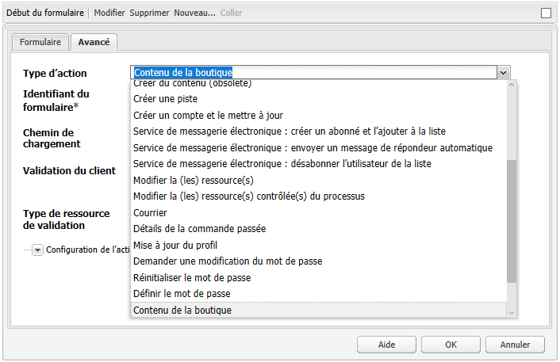
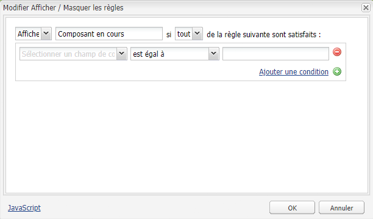
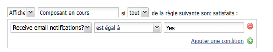
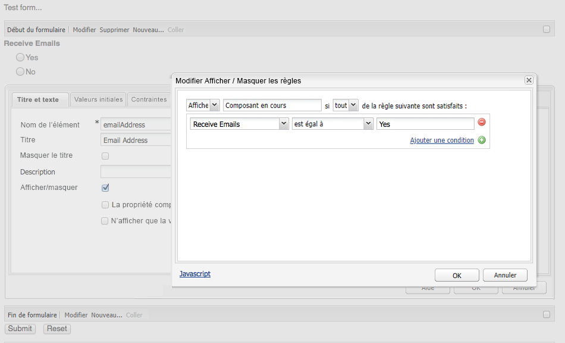
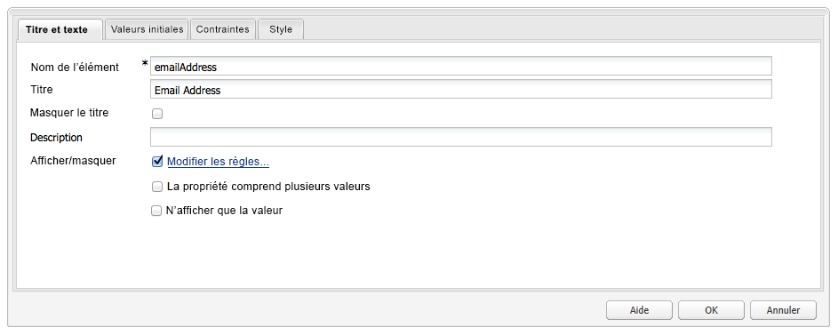

# Développement de formulaires (IU classique){#developing-forms-classic-ui}

La structure de base d’un formulaire est la suivante :

* Début du formulaire
* Éléments du formulaire
* Fin du formulaire

Tout cela est effectué avec une série de [composants de formulaire](/help/sites-authoring/default-components.md#form) par défaut, disponibles dans une installation AEM standard.

Outre le [développement de nouveaux composants](/help/sites-developing/developing-components-samples.md) utilisables sur vos formulaires, vous pouvez :

* [Précharger des valeurs dans votre formulaire](#preloading-form-values)
* [Précharger plusieurs valeurs dans (certains) champs](#preloading-form-fields-with-multiple-values)
* [Développer de nouvelles actions](#developing-your-own-form-actions)
* [Développer de nouvelles contraintes](#developing-your-own-form-constraints)
* [Afficher ou masquer des champs de formulaire spécifiques](#showing-and-hiding-form-components)

[Utilisation de scripts](#developing-scripts-for-use-with-forms) pour étendre les fonctionnalités lorsque cela s’avère nécessaire.

>[!NOTE]
>
>Ce document porte sur le développement de formulaires à l’aide des [composants Foundation](/help/sites-authoring/default-components-foundation.md) dans l’IU classique. Adobe recommande de tirer parti des nouveaux [composants principaux](https://docs.adobe.com/content/help/fr-FR/experience-manager-core-components/using/introduction.html) et des [conditions de masquage](/help/sites-developing/hide-conditions.md) pour le développement de formulaires dans l’interface utilisateur tactile.

## Préchargement de valeurs de formulaire {#preloading-form-values}

Le composant de début de formulaire fournit un champ pour le **Chemin de chargement**, un chemin d’accès facultatif qui pointe vers un nœud du répertoire.

Le chemin de chargement est le chemin d’accès à des propriétés de nœud qui est utilisé pour charger des valeurs prédéfinies dans plusieurs champs du formulaire.

Il s’agit d’un champ facultatif qui permet de spécifier le chemin à un nœud dans le référentiel. Lorsque ce nœud comporte des propriétés qui correspondent aux noms des champs, les champs adéquats du formulaire sont préchargés avec la valeur de ces propriétés. S’il n’existe aucune correspondance, le champ contient la valeur par défaut.

>[!NOTE]
>
>Une [action de formulaire](#developing-your-own-form-actions) peut également définir la ressource à partir de laquelle les valeurs initiales doivent être chargées . Pour ce faire, utilisez `FormsHelper#setFormLoadResource` dans `init.jsp`.
>
>Le formulaire est rempli à partir du chemin d’accès défini dans le composant de début de formulaire par l’auteur, et ce, uniquement si cette action n’est pas définie.

### Préchargement de champs de formulaire avec plusieurs valeurs  {#preloading-form-fields-with-multiple-values}

Le **Chemin de chargement des éléments** peut également être défini pour divers champs de formulaire ; il s’agit, une fois encore, d’un chemin d’accès facultatif pointant vers un nœud du référentiel.

Le **Chemin de chargement des éléments** est le chemin d’accès aux propriétés de nœud qui est utilisé pour charger des valeurs prédéfinies dans ce champ spécifique du formulaire ; par exemple, une [liste déroulante](/help/sites-authoring/default-components-foundation.md#dropdown-list), un [groupe de cases à cocher](/help/sites-authoring/default-components-foundation.md#checkbox-group) ou un [groupe de cases d’option](/help/sites-authoring/default-components-foundation.md#radio-group).

#### Exemple – Préchargement de plusieurs valeurs dans liste déroulante {#example-preloading-a-dropdown-list-with-multiple-values}

Une liste déroulante peut être configurée avec votre plage de valeurs en vue de leur sélection.

Le **Chemin de chargement des éléments** peut être utilisé pour accéder à une liste à partir d’un dossier du référentiel et précharger les valeurs dans le champ :

1. Créer un dossier sling ( `sling:Folder`)
par exemple, `/etc/designs/<myDesign>/formlistvalues`

1. Ajoutez une nouvelle propriété (par exemple, `myList`) de type chaîne à plusieurs valeurs ( `String[]`) pour contenir la liste des éléments déroulants. Le contenu peut être également importé à l’aide d’un script (script JSP ou curl dans un script shell).

1. Utilisez le chemin complet dans le champ **Chemin de chargement des éléments** :
par exemple, `/etc/designs/geometrixx/formlistvalues/myList`

Notez que si les valeurs de `String[]` sont au format suivant :

* `AL=Alabama`
* `AK=Alaska`
* *etc.*

AEM génère la liste sous la forme suivante :

* `<option value="AL">Alabama</option>`
* `<option value="AK">Alaska</option>`

Cette fonction peut, par exemple, être utilisée à bon escient dans un environnement multilingue.

### Développement de vos propres actions de formulaire  {#developing-your-own-form-actions}

Un formulaire requiert une action. Une action définit l’opération qui est effectuée lorsque le formulaire est envoyé avec les données utilisateur.

Un ensemble d’actions est fourni avec une installation AEM standard. Ces actions sont disponibles sous :

`/libs/foundation/components/form/actions`

et dans la liste **Type d’action** du composant **Formulaire** :

Cette section vous explique comment développer votre propre action de formulaire à inclure dans cette liste.

Vous pouvez ajouter votre propre action sous `/apps` comme suit :

1. Créer un nœud de type `sling:Folder`. Renseignez un nom qui indique l’action à implémenter.

   Par exemple :

   `/apps/myProject/components/customFormAction`

1. Sur ce nœud, définissez les propriétés suivantes, puis cliquez sur **Enregistrer tout** pour conserver vos modifications :

   * `sling:resourceType` - défini comme  `foundation/components/form/action`

   * `componentGroup` - définir comme  `.hidden`

   * Si vous le souhaitez :

      * `jcr:title` : indiquez un titre de votre choix ; il sera affiché dans la liste de sélection déroulante. S’il n’est pas défini, c’est le nom du nœud qui est affiché.

      * `jcr:description` - entrez une description de votre choix

1. Dans le dossier, créez un nœud de boîte de dialogue :

   1. Ajoutez des champs afin que l’auteur puisse modifier la boîte de dialogue des formulaires une fois l’action choisie.

1. Dans le dossier, vous pouvez effectuer l’une des opérations suivantes :

   1. Créer un script de publication.
Le nom du script est `post.POST.<extension>`, par ex. `post.POST.jsp`
Le script post est appelé lorsqu’un formulaire est envoyé pour traiter le formulaire. Il contient le code qui traite les données provenant du formulaire. 
`POST`.

   1. Ajouter un script de transfert qui est appelé lors de l’envoi du formulaire.
Le nom du script est &lt;a0/&quot;, par ex. `forward.jsp`
Ce script peut définir un chemin. `forward.<extension` La requête actuelle est ensuite transmise au chemin d’accès spécifié.
   L&#39;appel nécessaire est `FormsHelper#setForwardPath` (2 variantes). Un cas de figure classique consiste à effectuer une validation, ou logique, pour trouver le chemin cible, puis à effectuer un transfert vers ce chemin, laissant au servlet POST Sling par défaut le soin de procéder au stockage proprement dit dans JCR.

   Un autre servlet peut également procéder au traitement. Dans ce cas, l’action de formulaire et le fichier `forward.jsp` font simplement office de code de collage. Par exemple, l&#39;action de courrier à `/libs/foundation/components/form/actions/mail`, qui transfère les détails à `<currentpath>.mail.html`où se trouve une servlet de courrier.

   De ce fait :

   * Un fichier `post.POST.jsp` est utile pour les petites opérations qui sont entièrement effectuées par l’action proprement dite.
   * Le fichier `forward.jsp`, en revanche, est utile lorsque la délégation seule est requise.

   L’ordre d’exécution des scripts est le suivant :

   * Lors du rendu du formulaire ( `GET`) :

      1. `init.jsp`
      1. pour toutes les contraintes du champ : `clientvalidation.jsp`
      1. validationRT du formulaire : `clientvalidation.jsp`
      1. Le formulaire est chargé via la ressource de chargement si elle est définie
      1. `addfields.jsp` pendant le rendu  `<form></form>`
   * lors de la gestion d’un formulaire `POST` :

      1. `init.jsp`
      1. pour toutes les contraintes du champ : `servervalidation.jsp`
      1. validationRT du formulaire : `servervalidation.jsp`
      1. `forward.jsp`
      1. Si un chemin de transfert a été défini, (`FormsHelper.setForwardPath`), transférez la requête, puis appelez `cleanup.jsp`

      1. Si aucun chemin de transfert n’a été défini, appelez `post.POST.jsp` (se termine ici, aucun fichier `cleanup.jsp` n’est appelé)

1. De nouveau dans le dossier, vous pouvez éventuellement ajouter l’un des éléments suivants :

   1. Un script pour ajouter des champs.
Le nom du script est `addfields.<extension>`, par ex. `addfields.jsp`
Un script addfields est appelé immédiatement après l’écriture du code HTML pour le début de formulaire. Cela permet à l’action d’ajouter les champs de saisie personnalisés ou tout autre code HTML à l’intérieur du formulaire.

   1. Un script d’initialisation.
Le nom du script est `init.<extension>`, par ex. `init.jsp`
Ce script est appelé lorsque le formulaire est rendu. Il peut être utilisé pour initialiser des caractéristiques d’action. ``

   1. Un script de nettoyage.
Le nom du script est `cleanup.<extension>`, par ex. `cleanup.jsp`
Ce script peut être utilisé pour effectuer un nettoyage.

1. Utilisez le composant **Forms** dans un système de paragraphes (parsys). Le liste déroulante **Type d’action** contient désormais votre nouvelle action.

   >[!NOTE]
   >
   >Pour afficher les actions par défaut qui font partie du produit :
   >
   >
   >`/libs/foundation/components/form/actions`

### Développement de vos propres contraintes de formulaire {#developing-your-own-form-constraints}

Les contraintes peuvent être imposées à deux niveaux :

* Pour des [champs individuels (appliquez la procédure suivante)](#constraints-for-individual-fields)
* En tant que [validation globale du formulaire](#form-global-constraints)

#### Contraintes pour les différents champs  {#constraints-for-individual-fields}

Vous pouvez ajouter vos propres contraintes pour un champ individuel (sous `/apps`) comme suit :

1. Créer un nœud de type `sling:Folder`. Renseignez un nom qui indique la contrainte à implémenter.

   Par exemple :

   `/apps/myProject/components/customFormConstraint`

1. Sur ce nœud, définissez les propriétés suivantes, puis cliquez sur **Enregistrer tout** pour conserver vos modifications :

   * `sling:resourceType` - défini sur  `foundation/components/form/constraint`

   * `constraintMessage` : message personnalisé qui s’affiche si le champ n’est pas valide, suivant la contrainte, lorsque le formulaire est envoyé

   * Si vous le souhaitez :

      * `jcr:title` : indiquez le titre de votre choix ; il sera affiché dans la liste de sélection. S’il n’est pas défini, c’est le nom du nœud qui est affiché.
      * `hint` : informations supplémentaires à l’intention de l’utilisateur, concernant la façon d’utiliser le champ

1. Les scripts suivants peuvent s’avérer nécessaires à l’intérieur de ce dossier :

   * Un script de validation client :
Le nom du script est `clientvalidation.<extension>`, par ex. `clientvalidation.jsp`
Cette fonction est appelée lorsque le champ de formulaire est généré. Il peut être utilisé pour créer le JavaScript client afin de valider le champ sur le client.

   * Un script de validation du serveur :
Le nom du script est `servervalidation.<extension>`, par ex. `servervalidation.jsp`
Cette fonction est appelée lorsque le formulaire est envoyé. Il peut être utilisé pour valider le champ sur le serveur une fois qu’il a été envoyé.

>[!NOTE]
>
>Des exemples de contraintes sont visibles à l’emplacement suivant :
>
>`/libs/foundation/components/form/constraints`

#### Contraintes globales du formulaire {#form-global-constraints}

La validation globale du formulaire est spécifiée en configurant un type de ressource dans le composant de début de formulaire ( `validationRT`). Par exemple :

`apps/myProject/components/form/validation`

Vous pouvez ensuite définir :

* a `clientvalidation.jsp` : injecté après les scripts de validation client du champ
* et a `servervalidation.jsp` - également appelé après les validations individuelles du serveur de champ sur un `POST`.

### Affichage et masquage de composants de formulaire {#showing-and-hiding-form-components}

Vous pouvez configurer votre formulaire de manière à afficher ou masquer des composants de formulaire en fonction de la valeur d’autres champs du formulaire.

Changer la visibilité d’un champ de formulaire est utile lorsque le champ est requis uniquement dans certaines conditions. Par exemple, sur un formulaire de commentaires une question demande aux clients s’ils souhaitent recevoir les informations sur les produits par courrier électronique. Lorsque « oui » est sélectionné, un champ de texte s’affiche pour permettre au client de saisir son adresse de courrier électronique.

Utilisez la boîte de dialogue **Modifier Afficher / Masquer les règles** pour spécifier dans quelles conditions un composant de formulaire est affiché ou masqué.

Utilisez les champs en haut de la boîte de dialogue pour spécifier les informations suivantes :

* Si vous spécifiez les conditions d’affichage ou de masquage du composant.
* Si une ou toutes les conditions doivent être vraies pour afficher ou masquer le composant.

Une ou plusieurs conditions s’affichent sous ces champs. Une condition compare la valeur d’un autre composant de formulaire (sur le même formulaire) à une valeur. Si la valeur réelle dans le champ remplit la condition, cette dernière est évaluée comme étant vraie. Les conditions incluent les informations suivantes :

* Le titre du champ de formulaire testé.
* Un opérateur.
* Une valeur à laquelle la valeur du champ est comparée.

Par exemple, un composant Groupe de cases d’option avec le titre `Receive email notifications?`* * contient les boutons d’option `Yes` et `No`. Un composant de champ de texte avec le titre `Email Address` utilise la condition suivante afin qu’il soit visible si `Yes` est sélectionné :

Dans JavaScript, les conditions utilisent la valeur de la propriété Nom de l’élément pour faire référence aux champs. Dans l’exemple précédent, la propriété Nom de l’élément du composant Groupe de cases d’option est `contact`. Le code suivant est le code JavaScript équivalent pour cet exemple :

`((contact == "Yes"))`

**Pour afficher ou masquer un composant de formulaire :**

1. Modifiez le composant de formulaire spécifique.

1. Sélectionnez **Afficher/masquer** pour ouvrir la boîte de dialogue **Modifier Afficher / Masquer les règles** :

   * Dans la première liste déroulante, sélectionnez **Afficher** ou **Masquer** pour spécifier si vos conditions déterminent si le composant doit être affiché ou masqué.

   * Dans la liste déroulante située à la fin de la ligne supérieure, sélectionnez :

      * **toutes** si toutes les conditions doivent être vraies pour afficher ou masquer le composant.
      * **n’importe quelle(s)** si uniquement une ou plusieurs conditions doivent être vraies pour afficher ou masquer le composant.
   * Dans la ligne de condition (une est présentée par défaut), sélectionnez un composant et un opérateur, puis spécifiez une valeur.
   * Si nécessaire, ajoutez d’autres conditions en cliquant sur **Ajouter une condition**.

   Par exemple :

   

1. Cliquez sur **OK** pour enregistrer la définition.

1. Une fois votre définition enregistrée, un lien **Modifier les règles** s’affiche en regard de l’option **Afficher/masquer** dans les propriétés du composant de formulaire. Cliquez sur ce lien pour ouvrir la boîte de dialogue **Modifier Afficher / Masquer les règles** afin d’effectuer des modifications.

   Cliquez sur **OK** pour enregistrer toutes les modifications.

   

   >[!CAUTION]
   >
   >Les effets de l’affichage ou du masquage des définitions peuvent être consultés et testés :
   >
   >
   >
   >    * dans le mode **Aperçu** de l’environnement de création (une page doit être rechargée la première fois que vous basculez vers ce mode) ;
      >
      >    
   * dans l’environnement de publication.

#### Gestion de références de composant interrompues  {#handling-broken-component-references}

Les conditions Afficher / Masquer utilisent la valeur de la propriété Nom de l’élément pour faire référence aux autres composants dans le formulaire. La configuration Afficher/Masquer n&#39;est pas valide lorsque l&#39;une des conditions fait référence à un composant supprimé ou si la propriété Nom de l&#39;élément a été modifiée. Dans ce cas, vous devez mettre à jour manuellement les conditions, sans quoi une erreur se produira au chargement du formulaire.

Lorsque la configuration Afficher/Masquer n&#39;est pas valide, la configuration est fournie uniquement en tant que code JavaScript. Modifiez le code pour résoudre les problèmes. Le code utilise la propriété Nom de l’élément utilisée initialement pour faire référence aux composants.

### Développement de scripts à utiliser avec des formulaires {#developing-scripts-for-use-with-forms}

Pour plus d’informations sur les éléments d’API pouvant être utilisés lors de la rédaction de scripts, consultez les [javadocs relatifs aux formulaires](https://helpx.adobe.com/experience-manager/6-5/sites/developing/using/reference-materials/javadoc/com/day/cq/wcm/foundation/forms/package-summary.html).

Vous pouvez utiliser ceci pour des actions telles que l’appel d’un service avant l’envoi du formulaire et l’annulation du service en cas d’échec :

* Définissez le type de ressource de validation.
* Insérez un script pour la validation :

   * Dans le fichier JSP, appelez le service web et créez un objet `com.day.cq.wcm.foundation.forms.ValidationInfo` contenant vos messages d&#39;erreur. S&#39;il existe des erreurs, les données du formulaire ne sont pas publiées.
