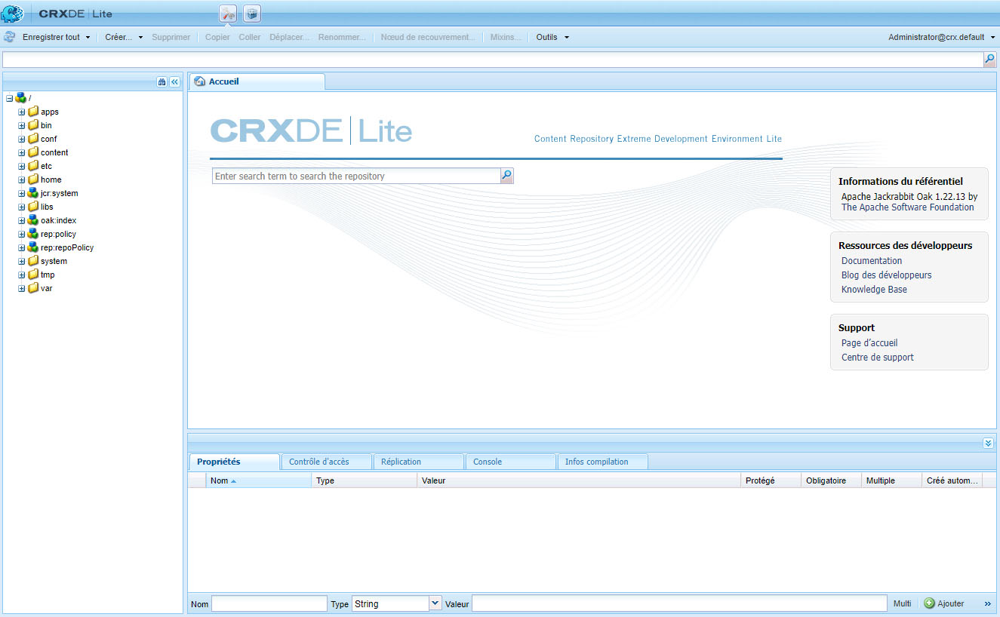

# Développement dans CRXDE Lite{#developing-with-crxde-lite}

Cette section décrit comment développer votre application Adobe Experience Manager (AEM) à l’aide de CRXDE Lite.

Consultez la documentation de présentation pour plus d’informations sur les différents environnements de développement disponibles.

CRXDE Lite est intégré à CRX/CQ et permet d’effectuer des tâches de développement standard dans le navigateur. CRXDE Lite vous permet de créer un projet, de créer et de modifier des fichiers (tels que .jsp et .java), des dossiers, des modèles, des composants, des boîtes de dialogue, des noeuds, des propriétés et des lots lors de la journalisation.
CRXDE Lite est recommandé lorsque vous n’avez pas d’accès direct au serveur AEM. Ou, lorsque vous développez une application en étendant ou modifiant les composants prêts à l’emploi et les lots Java™, ou lorsque vous n’avez pas besoin d’un débogueur dédié, la fin du code et la mise en surbrillance de la syntaxe.

>[!NOTE]
>
>À partir de la version 6.5.5.0 d’AEM, l’accès anonyme de CRXDE Lite n’est plus possible.
>Les utilisateurs sont redirigés vers l’écran de connexion.

>[!NOTE]
>
>Adobe recommande d’utiliser la variable [AEM Outils de développement pour Eclipse](/help/sites-developing/aem-eclipse.md) et la variable [AEM extension HTL Brackets](/help/sites-developing/aem-brackets.md) pendant le développement du projet.

## Prise en main de CRXDE Lite {#getting-started-with-crxde-lite}

Pour commencer à utiliser CRXDE Lite, procédez comme suit :

1. Installez AEM.
1. Dans votre navigateur, entrez `https://<host>:<port>/crx/de`. Par défaut, le paramètre est `https://localhost:4502/crx/de`.
1. Entrez votre **nom d’utilisateur** et votre **mot de passe**. Par défaut, il s’agit de `admin` et `admin`.

1. Cliquez sur **OK**.

L’interface utilisateur de CRXDE Lite est la suivante dans votre navigateur :

Vous pouvez désormais utiliser CRXDE Lite pour développer votre application.

## Présentation de l’interface utilisateur {#overview-of-the-user-interface}

CRXDE Lite offre les fonctionnalités suivantes :

<table>
 <tbody>
  <tr>
   <td>Barre de commutation supérieure</td>
   <td>Basculez rapidement entre CRXDE Lite, Package Manager et Package Share.</td>
  </tr>
  <tr>
   <td>Widget de chemin de noeud</td>
   <td>
Affiche le chemin d’accès au noeud sélectionné.
 
Vous pouvez également l’utiliser pour accéder à un noeud, en entrant le chemin à la main ou en le collant à partir d’un autre emplacement, puis en appuyant sur Entrée.
 
Il permet également de rechercher des noeuds avec un nom de noeud spécifique. Saisissez le nom du noeud que vous souhaitez rechercher et patientez (ou appuyez sur le symbole de recherche sur le côté droit). Vous pouvez essayer de saisir, par exemple, la chaîne <em>oak</em> dans le widget pour voir comment il fonctionne. Si un ou plusieurs noeuds sont chargés dans le volet de l’explorateur, la liste s’affiche et vous pouvez sélectionner le chemin et appuyer sur Entrée pour y accéder. Il ne fonctionne que pour les noeuds chargés dans l’application cliente CRXDE dans le navigateur. Si vous souhaitez effectuer une recherche dans l’ensemble du référentiel, utilisez Outils, puis Requête.
 </td>
  </tr>
  <tr>
   <td>Volet Explorateur</td>
   <td>
Affiche une arborescence de tous les noeuds du référentiel.
 
Cliquez sur un noeud afin d’afficher ses propriétés dans le <strong>Propriétés</strong> . Après avoir cliqué sur un nœud, vous pouvez sélectionner une action dans la barre d’outils. Cliquez de nouveau sur le nœud pour le renommer.
 
Filtre de navigation dans l’arborescence (icône en forme de paire de jumelles) : vous permet de filtrer les nœuds du référentiel pour lesquels le nom contient le texte saisi. S’applique uniquement aux nœuds qui ont été chargés localement.  
 </td>
  </tr>
  <tr>
   <td>Volet Modifier</td>
   <td>
<strong>Accueil</strong> onglet : vous permet de rechercher du contenu et/ou de la documentation et d’accéder aux ressources des développeurs (documentation, blog des développeurs, base de connaissances) et à l’assistance (page d’accueil et centre d’assistance d’Adobe).  
 
Cliquez deux fois sur un fichier dans la variable <strong>Explorateur</strong> pour afficher son contenu. Par exemple, un fichier .jsp ou .java . Vous pouvez ensuite le modifier et enregistrer les modifications.
 
Une fois qu’un fichier est modifié dans la fonction <strong>Modifier</strong> , les outils suivants sont disponibles dans la barre d’outils :  
 - <strong>Afficher dans l’arborescence : </strong>affiche le fichier dans l’arborescence du référentiel.  - <strong>Rechercher/remplacer...</strong>: effectuez une recherche ou un remplacement.    Double-cliquez sur la ligne d’état du <strong>Modifier</strong> ouvre la fenêtre <strong>Aller à la ligne</strong> pour saisir un numéro de ligne spécifique à laquelle vous souhaitez accéder.  </td>
  </tr>
  <tr>
   <td>Onglet Propriétés.  </td>
   <td>Affiche les propriétés du nœud que vous avez sélectionné. Vous pouvez ajouter de nouvelles propriétés ou supprimer celles qui existent déjà.  </td>
  </tr>
  <tr>
   <td>Onglet Contrôle d’accès</td>
   <td>
Afficher les autorisations en fonction du chemin d’accès, du niveau du référentiel ou de l’entité.
 
Les autorisations sont divisées en
 
- <strong>Stratégie de contrôle d’accès applicable</strong>: stratégies qui peuvent être appliquées à la sélection.
 
- <strong>Stratégies de contrôle d’accès locales</strong>: stratégies appliquées localement à la sélection.
 
- <strong>Stratégies de contrôle d’accès efficaces</strong>: les stratégies appliquées à la sélection peuvent être définies localement ou héritées des noeuds parents.
 
Remarque. Pour pouvoir visualiser les informations de contrôle d’accès, l’utilisateur connecté au CRXDE Lite doit disposer de droits d’accès en lecture aux entrées ACL. Par défaut, l’utilisateur anonyme ne peut pas afficher ces informations : connectez-vous en tant qu’administrateur pour voir les informations, par exemple.
 </td>
  </tr>
  <tr>
   <td>Onglet Réplication</td>
   <td>
Affichez l’état de réplication du noeud. Vous pouvez répliquer et répliquer et supprimer le noeud.
 </td>
  </tr>
  <tr>
   <td>Onglet Console  </td>
   <td>
<strong>Journaux du serveur</strong>:
 
Affiche les messages de journaux. Vous pouvez configurer le niveau de journal, effacer la console, épingler à la position de défilement sélectionnée et activer ou désactiver l’affichage des messages.  
 
<strong>Gestion de version</strong> :
 
Affiche les messages de contrôle de version.  
 </td>
  </tr>
  <tr>
   <td>Onglet Infos sur le build  </td>
   <td>Affiche des informations lorsqu’un lot est en cours de création.  </td>
  </tr>
  <tr>
   <td>Actualiser  </td>
   <td>Actualise la sélection. Les modifications des autres utilisateurs sont mises à jour dans votre vue du référentiel. Les modifications que vous avez apportées ne sont pas concernées.  </td>
  </tr>
  <tr>
   <td>Enregistrer tout</td>
   <td>
<strong>Enregistrer tout</strong>:  
 
Enregistre toutes les modifications que vous avez apportées. Tant que vous n’avez pas cliqué sur Enregistrer, les modifications sont temporaires et perdues lorsque vous quittez la console.
 
<strong>Rétablir</strong> :
 
Ignore toutes les modifications que vous avez apportées au noeud sélectionné depuis la dernière action d’enregistrement, puis recharge l’état du référentiel pour le noeud sélectionné.
 
<strong>Tout rétablir</strong>:
 
Ignore toutes les modifications que vous avez apportées dans tout le référentiel depuis la dernière action d’enregistrement, puis recharge l’état du référentiel.
 </td>
  </tr>
  <tr>
   <td>Créer ...  </td>
   <td>
Menu déroulant permettant de créer les éléments suivants sous le noeud sélectionné :  
 
- <strong>Noeud</strong>: un noeud avec un type de noeud arbitraire  
 
- <strong>Fichier</strong> : nœud nt:file et son sous-nœud nt:resource
 
- <strong>Dossier</strong>: noeud nt:folder
 
- <strong>Modèle</strong>: modèle AEM
 
- <strong>Composant</strong>: composant AEM
 
- <strong>Boîte de dialogue</strong>: boîte de dialogue AEM
 </td>
  </tr>
  <tr>
   <td>Supprimer  </td>
   <td>Supprime le noeud sélectionné.  </td>
  </tr>
  <tr>
   <td>Copier</td>
   <td>Copie le noeud sélectionné.  </td>
  </tr>
  <tr>
   <td>Coller  </td>
   <td>Colle le nœud copié sous le nœud sélectionné.  </td>
  </tr>
  <tr>
   <td>Déplacer ...  </td>
   <td>Déplace le noeud sélectionné vers le noeud défini dans la boîte de dialogue.</td>
  </tr>
  <tr>
   <td>Renommer ...  </td>
   <td>Renomme le noeud sélectionné.  </td>
  </tr>
  <tr>
   <td>Mixins ...  </td>
   <td>Permet d’ajouter des types de mixin au type de noeud. Les types de mixin sont principalement utilisés pour ajouter des fonctionnalités avancées telles que le contrôle de version, le contrôle d’accès, le référencement et le verrouillage au noeud.</td>
  </tr>
  <tr>
   <td>Outils  </td>
   <td>
Menu déroulant avec les outils suivants :
 
- <strong>Configuration du serveur ...</strong>: pour accéder à la console Felix.
 
- <strong>Requête ...</strong>: pour interroger le référentiel.
 
- <strong>Privilèges ...</strong>: pour ouvrir la gestion des privilèges, où vous pouvez afficher et ajouter des privilèges.
 
- <strong>Tester le contrôle d’accès ...</strong>: emplacement où vous pouvez tester l’autorisation pour un certain chemin et/ou une entité de sécurité.
 
- <strong>Exporter le type de noeud</strong>: pour exporter les types de noeuds dans le système en tant que notation cnd.
 
- <strong>Importer le type de noeud...</strong>: pour importer des types de noeuds à l’aide de la notation cnd.
 
- <strong>Installer SiteCatalyst Debugger...</strong>: instructions pour l’installation d’Analytics Debugger.
 </td>
  </tr>
  <tr>
   <td>Widget de connexion  </td>
   <td>
Affiche les utilisateurs connectés et l’espace de travail dans lequel ils sont connectés, par exemple, admin@crx.default.
 
Cliquez dessus pour vous connecter ou vous reconnecter comme un utilisateur spécifique. Si vous ne spécifiez pas d’espace de travail auquel vous connecter, vous êtes connecté à l’espace de travail par défaut, crx.default.
 
Si vous souhaitez parcourir le référentiel en tant qu’utilisateur anonyme, utilisez <strong>anonyme</strong> comme nom de connexion et tout mot de passe (par exemple, un espace ou un point).  
 
Si votre autorisation n’est plus valide (par exemple, elle a expiré), le widget de connexion affiche "<strong>Non autorisé - Connexion...</strong>". Cliquez dessus pour vous reconnecter.
 </td>
  </tr>
 </tbody>
</table>

## Création d’un dossier {#creating-a-folder}

Pour créer un fichier avec CRXDE Lite :

1. Ouvrez CRXDE Lite dans un navigateur.
1. Dans le volet de navigation, cliquez avec le bouton droit sur le dossier sous lequel vous souhaitez créer le dossier, puis sélectionnez **Créer ...**, puis **Créer un dossier ...**.

1. Entrez le **nom** du dossier et cliquez sur **OK**.

1. Cliquez sur **Enregistrer tout** pour enregistrer les modifications sur le serveur.

## Création d’un modèle {#creating-a-template}

Pour créer un modèle avec CRXDE Lite :

1. Ouvrez CRXDE Lite dans un navigateur.
1. Dans le volet de navigation, cliquez avec le bouton droit sur le dossier dans lequel vous souhaitez créer le modèle, sélectionnez **Créer ...**, puis **Créer un modèle ...**.

1. Saisissez le **Libellé**, **Titre**, **Description**, **Type de ressource**, et **Classement** du modèle. Cliquez sur **Suivant**.

1. Cette étape est facultative : définissez **Chemins autorisés**. Cliquez sur **Suivant**.

1. Cette étape est facultative : définissez les **Parents autorisés**. Cliquez sur **Suivant**.

1. Cette étape est facultative : définissez les **Enfants autorisés**. Cliquez sur **OK**.

1. Cliquez sur **Enregistrer tout** pour enregistrer les modifications sur le serveur.

Il crée les éléments suivants :

* un nœud de type `cq:Template` avec les propriétés du modèle ;

* un nœud enfant de type `cq:PageContent` avec les propriétés de contenu de page.

Vous pouvez ajouter des propriétés à votre modèle : voir [Création d’une propriété](#creating-a-property) .

## Création d’un composant {#creating-a-component}

La fonctionnalité décrite ici n’est disponible que si CQ5 est installé, c’est-à-dire si le type de nœud `cq:Component` est disponible dans le référentiel.

Pour créer un composant avec CRXDE Lite :

1. Ouvrez CRXDE Lite dans un navigateur.
1. Dans le volet de navigation, cliquez avec le bouton droit sur le dossier dans lequel vous souhaitez créer le composant, sélectionnez **Créer ...**, puis **Créer un composant ...**.

1. Saisissez le **Libellé**, **Titre**, **Description**, **Super Resource Type**, et **Groupe** du composant. Cliquez sur **Suivant**.

1. Cette étape est facultative : définissez les propriétés du composant. **Conteneur ,** **Pas de décoration**, **Nom de la cellule**, et **Chemin de la boîte de dialogue**. Cliquez sur **Suivant**.

1. Cette étape est facultative : définissez la propriété de composant **Parents autorisés**. Cliquez sur **Suivant**.

1. Cette étape est facultative : définissez la propriété de composant **Enfant autorisé**. Cliquez sur **OK**.

1. Cliquez sur **Enregistrer tout** pour enregistrer les modifications sur le serveur.

Il crée les éléments suivants :

* un nœud de type `cq:Component`.
* Propriétés du composant
* Un script .jsp de composant

## Création d’une boîte de dialogue {#creating-a-dialog}

Pour créer une boîte de dialogue avec CRXDE Lite :

1. Ouvrez CRXDE Lite dans un navigateur.
1. Dans le volet de navigation, cliquez avec le bouton droit sur le composant dans lequel vous souhaitez créer la boîte de dialogue, sélectionnez **Créer ...**, puis **Créer une boîte de dialogue ...**.

1. Entrez le **Libellé** et le **Titre**. Cliquez sur **OK**.

1. Cliquez sur **Enregistrer tout** l pour enregistrer les modifications sur le serveur.

Il crée une boîte de dialogue avec la structure suivante :

`dialog[cq:Dialog]/items[cq:Widget]/items[cq:WidgetCollection]/tab1[cq:Panel]`

Vous pouvez maintenant adapter la boîte de dialogue à vos besoins en modifiant les propriétés ou en créant des noeuds.

Vous pouvez également utiliser l’éditeur de boîte dialogue pour modifier une boîte de dialogue. Double-cliquez sur le noeud dialog dans CRXDE Lite pour afficher l’éditeur. Vous trouverez plus d’informations sur l’éditeur de boîte de dialogue [here](/help/sites-developing/dialog-editor.md).

## Création d’un nœud {#creating-a-node}

Pour créer un nœud avec CRXDE Lite :

1. Ouvrez CRXDE Lite dans un navigateur.
1. Dans le volet de navigation, cliquez avec le bouton droit sur le noeud dans lequel vous souhaitez créer le noeud, puis sélectionnez **Créer ...**, puis **Créer un noeud ...**.
1. Entrez le **Nom** et le **Type**. Cliquez sur **OK**.
1. Cliquez sur **Enregistrer tout** pour enregistrer les modifications sur le serveur.

Vous pouvez désormais adapter le noeud à vos besoins en modifiant les propriétés ou en créant des noeuds.

>[!NOTE]
>
>La plupart des opérations de modification, y compris Create Node, conservent toutes les modifications en mémoire et les stockent uniquement dans le référentiel lors de l’enregistrement (au moyen du bouton &quot;Enregistrer tout&quot;). Cependant, certaines opérations telles que le déplacement sont automatiquement conservées.
>
>La validation portant sur l’autorisation du noeud nouvellement créé par le type de noeud du noeud parent est également effectuée en premier par le référentiel JCR lors de l’enregistrement des modifications. Si vous recevez un message d’erreur lors de l’enregistrement d’un noeud, vérifiez si la structure de contenu est valide (vous ne pouvez pas créer un `nt:unstructured` noeud en tant qu’enfant de `nt:folder` ).

## Création d’une propriété {#creating-a-property}

Pour créer une propriété avec CRXDE Lite :

1. Ouvrez CRXDE Lite dans un navigateur.
1. Dans le volet de navigation, sélectionnez le nœud dans lequel vous souhaitez ajouter la nouvelle propriété.
1. Dans le **Propriétés** dans le volet inférieur, saisissez la **Nom**, la variable **Type**, et la variable **Valeur**. Cliquez sur **Ajouter**.

1. Cliquez sur **Enregistrer tout** pour enregistrer les modifications sur le serveur.

## Création d’un script {#creating-a-script}

Pour créer un script :

1. Ouvrez CRXDE Lite dans un navigateur.
1. Dans le volet de navigation, cliquez avec le bouton droit sur le composant dans lequel vous souhaitez créer le script, puis sélectionnez **Créer ...**, puis **Créer un fichier ...**.

1. Entrez le **nom** du fichier, y compris son extension. Cliquez sur **OK**.

1. Le nouveau fichier s’ouvre sous la forme d’un onglet dans le volet Modifier.
1. Modifiez le fichier.
1. Cliquez sur **Enregistrer tout** pour enregistrer les modifications.

## Exportation et importation de types de nœuds {#exporting-and-importing-node-types}

Avec CRXDE Lite, vous pouvez importer et/ou exporter des définitions de type de noeud dans [Notation CND (Compact Namespace et définition de type de noeud)](https://jackrabbit.apache.org/jcr/node-type-notation.html).

Pour exporter une définition de type de noeud :

1. Ouvrez CRXDE Lite dans un navigateur.
1. Sélectionnez le nœud requis.
1. Sélectionnez **Outils**, puis **Exporter le type de nœud**.

1. La définition, en notation cnd, s’affiche dans votre navigateur. Enregistrez les informations, si nécessaire.

Pour importer une définition de type de nœud :

1. Ouvrez CRXDE Lite dans un navigateur.
1. Sélectionnez **Outils**, puis **Importer le type de nœud...**.

1. Saisissez la notation CND pour la définition dans la zone de texte.
1. Cochez **Autoriser la mise à jour** si vous mettez à jour une définition existante.
1. Cliquez sur **Importer**.

## Journalisation {#logging}

Avec CRXDE Lite, vous pouvez afficher le fichier `error.log` qui se trouve sur le système de fichiers à l’adresse `<crx-install-dir>/crx-quickstart/server/logs` et filtrez-le avec le niveau de journalisation approprié. Procédez comme suit :

1. Ouvrez CRXDE Lite dans un navigateur.
1. Dans le **Console** au bas de la fenêtre, dans le menu déroulant à droite, sélectionnez **Journaux du serveur**.

1. Cliquez sur l’icône **Arrêter** pour afficher les messages.

Vous pouvez effectuer les actions suivantes :

* Ajuster les paramètres du journal dans la console Felix en cliquant sur l’icône **Configurations de journalisation**.
* Effacez les messages en cliquant sur le bouton **Pinceau** Icône
* Epinglez le message à la sélection en cliquant sur le bouton **Epinglage** Icône
* Activer ou désactiver l’affichage des messages en cliquant sur l’icône **Stop**.

## Contrôle d’accès {#access-control}

>[!NOTE]
>
>Voir [Administration des utilisateurs, des groupes et des droits d’accès](/help/sites-administering/user-group-ac-admin.md) pour plus d’informations.
