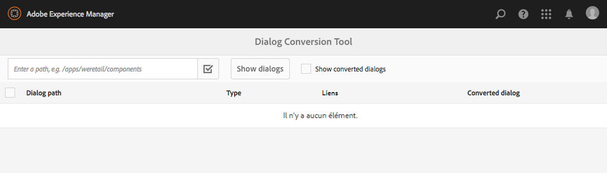
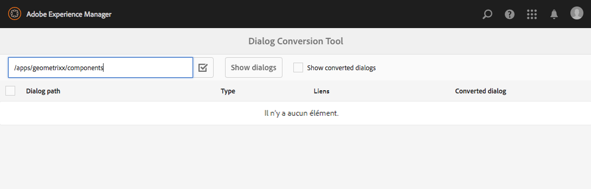
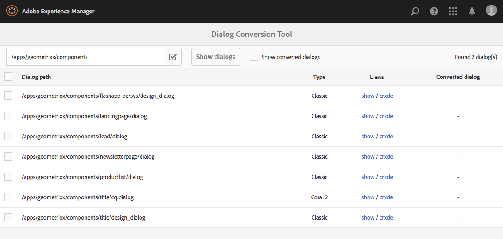
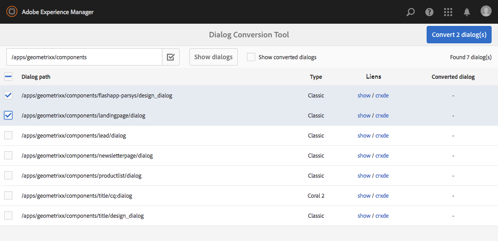
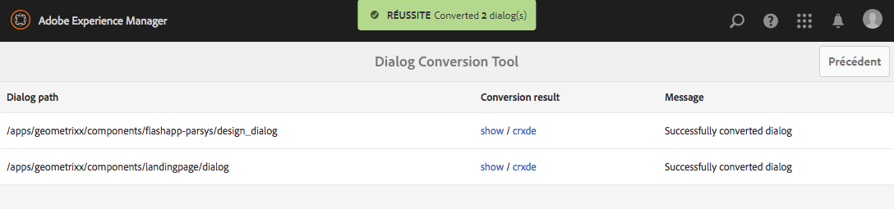
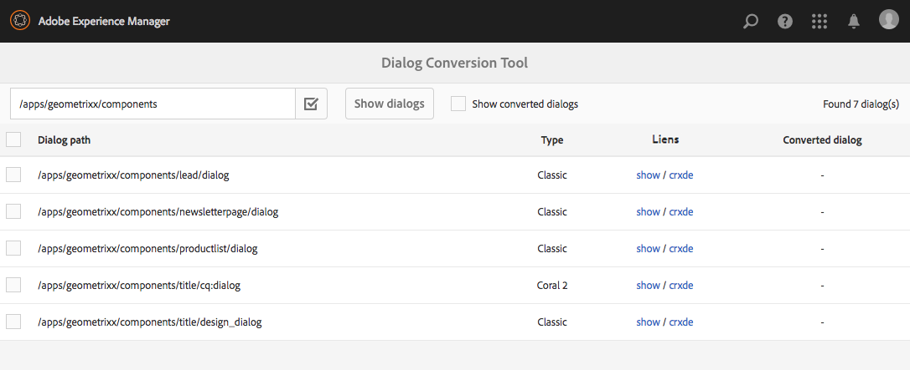
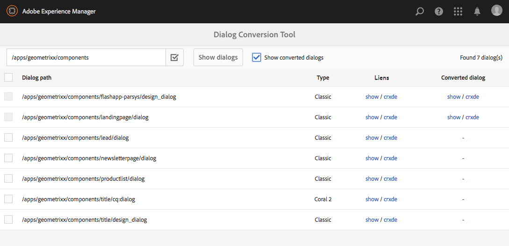

# Outil de conversion de boîte de dialogue{#dialog-conversion-tool}

L’outil de conversion de boîte de dialogue mis à votre disposition permet d’étendre les composants existants dont une boîte de dialogue est définie uniquement pour l’interface utilisateur classique (sur la base d’ExtJS) ou sur la base de l’interface utilisateur (IU) Granite et de Coral 2. Cet outil utilise la boîte de dialogue d’origine pour créer une boîte de dialogue en double conçue pour l’interface utilisateur standard, sur la base de l’IU Granite et de Coral 3.

L’objectif de cet outil est d’automatiser la mise à niveau (dans la mesure du possible), de garantir une efficacité accrue et de réduire les erreurs. L’outil ne peut toutefois pas couvrir tous les cas de figure. Dès lors, le processus ne peut pas être entièrement automatisé, et l’utilisateur doit examiner les boîtes de dialogue converties et peut-être y apporter des modifications supplémentaires. Cet outil est conçu pour vous aider à lancer la procédure de conversion, mais pas pour prendre le contrôle total de la conversion.

L’outil va créer la boîte de dialogue à l’aide de l’IU basée sur Coral 3 et de l’IU Granite standard, mais il ignorera les éléments qu’il ne parvient pas à convertir. Il se peut donc que la boîte de dialogue qui en résulte contienne des nœuds de la boîte de dialogue d’origine, copiés tels quels, si aucune règle ne correspondait à ce composant spécifique. En outre, un composant converti peut comporter quelques propriétés non converties, car il n’existait aucune règle appropriée pour les convertir.

>[!CAUTION]
>
>L’outil n’est pas adapté à tous les scénarios, dans la mesure où ses règles de conversion ne sont pas exhaustives et fonctionnent selon le principe du meilleur effort. Il convertit les propriétés et éléments les plus souvent utilisés, mais la conversion est incomplète lorsqu’il s’agit de personnalisations ou de boîtes de dialogue très spécialisées. **Les boîtes de dialogue converties peuvent nécessiter des réglages supplémentaires et toutes les conversions doivent être analysées.**

>[!NOTE]
>
>L’interface utilisateur n’étant plus développée ni améliorée, Adobe conseille aux clients de passer à l’IU Granite par défaut pour bénéficier des dernières avancées technologiques.
>
>Bien qu’il soit généralement préférable de migrer vers la plate-forme la plus récente, passer de Coral 2 à Coral 3 n’est pas indispensable. Cependant, tout nouveau projet doit être commencé dans Coral 3.

## Téléchargement et installation de l’outil de conversion de boîte de dialogue {#download-and-install-the-dialog-conversion-tool}

L’outil de conversion de boîte de dialogue est désormais disponible en Open Source. Vous pouvez y accéder via GitHub.

CODE SUR GITHUB

Vous pouvez trouver le code de cette page sur GitHub.

* [Ouvrez le projet aem-dialog-conversion sur GitHub](https://github.com/Adobe-Marketing-Cloud/aem-dialog-conversion)
* Téléchargez le projet sous la forme d’[un fichier ZIP](https://github.com/Adobe-Marketing-Cloud/aem-dialog-conversion/archive/master.zip).

>[!NOTE]
>
>AEM n’est pas livré avec l’outil de conversion de boîte de dialogue. Vous devez le télécharger et l’installer pour pouvoir l’utiliser.

Procédez comme suit pour installer l’outil de conversion de boîte de dialogue :

1. Téléchargez le module à partir du [projet GitHub Dialog Conversion Tool](https://github.com/Adobe-Marketing-Cloud/aem-dialog-conversion/releases).
1. Installez le module sur votre instance. Pour plus d’informations sur la gestion des modules, voir [Utilisation des modules](/help/sites-administering/package-manager.md).

## Conversion d’une boîte de dialogue  {#converting-a-dialog}

L&#39;outil convertit les boîtes de dialogue en créant une boîte de dialogue correspondante dans l&#39;interface utilisateur Granite / Coral 3 au même emplacement que la boîte de dialogue d&#39;origine dans l&#39;arborescence de contenu. Dans le cas des boîtes de dialogue Interface utilisateur Granite / Coral 2, celles-ci sont copiées dans un emplacement de sauvegarde (un suffixe `.coral2` est ajouté au nom du noeud de la boîte de dialogue) afin de ne pas être remplacées. L’outil peut convertir aussi bien des boîtes de dialogue de conception que des boîtes de dialogue de modification.

Procédez comme suit pour convertir une ou plusieurs boîtes de dialogue :

1. Ouvrez la console **Conversion de boîte de dialogue**, accessible à partir de **Navigation globale** -> **Outils** -> **Opérations** :

   `https://<hostname>:<port>/libs/cq/dialogconversion/content/console.html`

   

1. Entrez le chemin d&#39;accès requis tel que `/apps/geometrixx/components`. Vous pouvez également saisir un chemin direct vers une seule boîte de dialogue telle que `/apps/geometrixx/components/lead`.

   

1. Sélectionnez **Afficher les boîtes de dialogue** pour afficher toutes les boîtes de dialogue situées sous cet emplacement.

   

   Le tableau liste toutes les boîtes de dialogue héritées existantes sous le chemin saisi. Chaque boîte de dialogue a son type répertorié. Les types sont les suivants :

   * **Classic:** Noeuds de type  `cq:Dialog` qui ont un nom de noeud  `dialog` ou  `design_dialog`
   * **Coral 2:** Noeuds nommés  `cq:dialog` ou  `cq:design_dialog` ayant un type de ressource Interface utilisateur Granite / Coral 2 sur leur noeud de contenu enfant

   Chaque ligne contient un lien pour afficher la boîte de dialogue et un autre lien vers CRXD Lite pour afficher la structure de son nœud.

   >[!NOTE]
   >
   >Les composants qui ne possèdent pas de boîte de dialogue pour l’IU classique ou Coral 2 (en d’autres termes, l’IU Granite/Coral 3 a été utilisée pour la conception) ne sont pas répertoriés.

1. Sélectionnez une ou plusieurs boîtes de dialogue pour la conversion et cliquez ou appuyez sur **Convertir les boîtes de dialogue(s) X** pour début le processus de conversion.

   

1. Les boîtes de dialogue sélectionnées sont répertoriées avec les résultats de leurs conversions. Si la conversion a réussi, la ligne contient des liens pour afficher la boîte de dialogue convertie ou pour l’ouvrir dans CRXDE Lite.

   Cliquez ou appuyez sur **Précédent** pour revenir à l’outil conversion de boîte de dialogue.

   

1. De retour dans l’outil de conversion de boîte de dialogue, les boîtes de dialogue converties ne figurent plus dans la liste. Notez toutefois que le nombre total de boîtes de dialogue trouvées est toujours indiqué, y compris celles qui sont déjà converties ; en d’autres termes, le nombre de lignes du tableau ne correspond pas nécessairement au nombre trouvé.

   

1. Cochez l’option **Afficher les boîtes de dialogue converties** pour afficher les boîtes de dialogue situées à l’emplacement spécifié et qui ont déjà été converties.

   

   Si la boîte de dialogue est déjà convertie, des liens sont également fournis à la boîte de dialogue convertie. Une boîte de dialogue est considérée comme convertie si une boîte de dialogue IU Granite/Coral 3 est déjà disponible.

## Règles de réécriture des boîtes de dialogue  {#dialog-rewrite-rules}

L&#39;outil de conversion des boîtes de dialogue est basé sur le concept de **réécriture de graphique**, consistant à transformer un graphique de sujet en appliquant des règles de réécriture. Une règle de réécriture consiste à coupler un motif à un graphe de remplacement. La règle fait correspondre les occurrences d’un sous-graphe donné dans le graphe de sujet, puis les remplace. Voir aussi [https://en.wikipedia.org/wiki/Graph_rewriting](https://en.wikipedia.org/wiki/Graph_rewriting) pour plus d’informations sur la réécriture de graphiques.

L’outil de conversion de boîte de dialogue applique cette méthode pour réécrire une arborescence héritée donnée (IU classique ou Granite/Coral 2) dans l’arborescence IU Granite/Coral 3 équivalente. Grâce à cette méthode, la conversion se révèle extrêmement souple et peut même tenir compte de composants complexes, étant donné que la correspondance est effectuée sur des sous-arborescences réelles et pas seulement sur des nœuds ou des propriétés uniques.

### Algorithme  {#algorithm}

L’algorithme de réécriture accepte comme paramètre l’arborescence à réécrire et un ensemble de règles de réécriture. Il·effectue·un·parcours préfixe de l’arborescence et, pour chaque nœud, il vérifie si une règle s’applique à la sous-arborescence dont la racine se situe au niveau de ce nœud. La première règle qui correspond est appliquée à cette sous-arborescence afin de la réécrire. La traversée redémarre ensuite depuis la racine. L’algorithme s’arrête dès que toute l’arborescence a été parcourue et que plus aucune règle ne correspond à une sous-arborescence. En tant que mesure d’optimisation, l’algorithme conserve le suivi d’un ensemble de noeuds qui sont finaux et n’ont donc pas besoin d’être revus pour les correspondances lors des traversées suivantes. Il appartient aux règles de réécriture de déterminer quels sont les nœuds définitifs dans l’arborescence réécrite et lesquels devront faire l’objet d’une nouvelle visite lors des prochains passages de l’algorithme.

Le point d&#39;entrée de la conversion est `DialogConversionServlet`, qui est enregistré sur les demandes de POST à `/libs/cq/dialogconversion/content/convert.json`. Il accepte un paramètre de requête de chemin, qui est un tableau contenant les chemins d&#39;accès aux boîtes de dialogue qui doivent être converties. Pour chaque boîte de dialogue, le servlet réécrit ensuite l’arborescence correspondante en appliquant toutes les règles de réécriture des boîtes de dialogue définies.

### Types de règles de réécriture {#rewrite-rule-types}

Les règles de réécriture peuvent être définies de deux manières :

* Structures de nœud JCR : [Règles de réécriture basées sur des nœuds](/help/sites-developing/dialog-conversion.md#node-based-rewrite-rules)

* Classes Java mettant en œuvre une interface spécifique : [Règles de réécriture Java](/help/sites-developing/dialog-conversion.md#java-based-rewrite-rules)

Certains sont [fournis prêts à l&#39;emploi](#provided-rewrite-rules), mais vous pouvez également définir vos propres règles personnalisées. Des [exemples de règles de réécriture](/help/sites-developing/dialog-conversion.md#sample-rewrite-rules) sont également disponibles.

En règle générale, une seule règle de réécriture de boîte de dialogue est chargée de réécrire un seul élément ; le champ de saisie pathbrowser, par exemple.

>[!CAUTION]
>
>Les boucles de réécriture ne sont pas détectées par l’algorithme. Par conséquent, **les règles de réécriture ne doivent pas réécrire les arbres de manière circulaire**.

### Règles de réécriture basées sur des nœuds {#node-based-rewrite-rules}

Une règle de réécriture de boîtes de dialogue peut être définie en termes de nœuds et de propriétés :

```xml
rule
  - jcr:primaryType = nt:unstructured
  - cq:rewriteRanking = 4
  + patterns
    - jcr:primaryType = nt:unstructured
    + foo
      - ...
      + ...
    + foo1
      - ...
      + ...
  + replacement
    + bar
      - ...
      + ...
```

Cet exemple définit une règle contenant deux **modèles** (arborescences dont les racines sont `foo` et `foo1`) et un **remplacement** (arborescence dont la racine est `bar`). Les arborescences modèles et de remplacement sont des arborescences arbitraires contenant des nœuds et des propriétés. La règle correspond à une sous-arborescence si l’un des modèles définis correspond. Pour qu’un modèle corresponde, l’arborescence en question doit contenir les mêmes nœuds (correspondance de noms). De plus, toutes les propriétés définies dans le modèle doivent correspondre à celles de l’arborescence.

Dans le cas d&#39;une correspondance, la sous-arborescence correspondante (appelée arbre d&#39;origine) sera remplacée par le remplacement. L’arborescence de remplacement peut définir des propriétés mappées qui hériteront de la valeur d’une propriété de l’arborescence d’origine. Elles doivent être du type `String` et présenter le format suivant :

`${<path>}`

Si la propriété référencée n’existe pas dans l’arborescence d’origine, la propriété est omise. Une valeur par défaut peut également être spécifiée dans ce cas de figure (cela n’est possible que pour les propriétés String) :

`${<path>:<default>}`

Les propriétés qui contiennent des caractères &quot; `:`&quot; peuvent être placées entre guillemets simples afin d’éviter tout conflit en fournissant une valeur par défaut. Les propriétés booléennes sont annulées si l&#39;expression comporte le préfixe &quot; `!`&quot;. Les propriétés mappées peuvent être à plusieurs valeurs, auquel cas la valeur de la première propriété qui existe dans l’arborescence correspondante leur sera affectée.

Par exemple, la propriété suivante `one` se verra attribuer la valeur de la propriété `./two/three` de l&#39;arborescence d&#39;origine correspondante.

```xml
...
  + replacement
    + bar
      - one = ${./two/three}
      - negated = !${./some/boolean/prop}
      - default = ${./some/prop:default}
      - multi = [${./prop1}, ${./prop2}]
```

Les règles prennent également en charge les propriétés facultatives suivantes.

* `cq:rewriteOptional` (booléen)

   Définissez cette propriété sur un noeud de modèle pour indiquer que le noeud n’a pas besoin d’être présent pour que le modèle corresponde

* `cq:rewriteRanking` (integer)

   Définissez cette propriété sur le noeud de la règle pour modifier l’ordre d’application des règles. Cela peut s’avérer utile pour faire en sorte que les règles génériques n’écrasent pas des règles qui gèrent des structures plus spécifiques. Les règles de classement inférieur sont prioritaires sur celles de classement plus élevé. Par défaut, toutes les règles reçoivent `Integer.MAX_VALUE` comme classement.

L’arborescence de remplacement prend également en charge les propriétés spéciales suivantes (commençant par `cq:rewrite`) :

* `cq:rewriteMapChildren` (string)

   Le noeud contenant cette propriété recevra une copie des enfants du noeud dans l’arborescence d’origine référencée par la valeur de la propriété (par ex. `cq:rewriteMapChildren=./items`).

* `cq:rewriteFinal` (booléen)

   Il s’agit d’une mesure d’optimisation qui indique à l’algorithme que le noeud contenant cette propriété est final et qu’il n’est pas nécessaire de le vérifier à nouveau pour vérifier si des règles de réécriture correspondantes sont disponibles. Lorsqu&#39;elle est placée sur le noeud de remplacement lui-même, l&#39;arborescence de remplacement complète est considérée comme définitive.
* `cq:rewriteCommonAttrs` (booléen)

   Définissez cette propriété sur le noeud de remplacement ( `rule`/ `replacement`) afin de mapper les propriétés appropriées du noeud racine d’origine avec les équivalents d’attributs communs Granite dans la racine de copie. Il gère les attributs de données en copiant/créant le sous-noeud `granite:data` sur la cible et en y écrivant les propriétés `data-*`.
* `cq:rewriteRenderCondition` (booléen)

   Définissez cette propriété sur le noeud de remplacement ( `rule`/ `replacement`) afin de copier tout noeud enfant de condition de rendu Granite ( `rendercondition` ou `granite:rendercondition`) du noeud racine d’origine vers un enfant `granite:rendercondition` de la racine de copie.

En outre, un noeud `cq:rewriteProperties` peut être ajouté à un noeud de remplacement pour définir des réécritures de chaîne pour les propriétés mappées dans le résultat. Le nœud est supprimé du remplacement. Les propriétés du noeud `cq:rewriteProperties` doivent être nommées de la même manière que celles qu&#39;ils réécrivent et accepter un tableau de chaînes avec deux paramètres :

* `pattern`: Regex à comparer, par ex.  `"(?:coral-Icon-)(.+)"`

* `replacement`: Fourni à la  `replaceAll` fonction de correspondance, p. ex.  `"$1"`

Voici un exemple de réécriture des propriétés d’icône Coral 2 sur les propriétés Coral 3 équivalentes :

```xml
...
  + replacement
    + bar
      - icon = ${./icon}
      + cq:rewriteProperties
       - icon = [(?:coral-Icon--)(.+), $1]
```

#### Définition de vos propres règles de réécriture basées sur des nœuds  {#defining-your-own-node-based-rewrite-rules}

Les règles de réécriture fournies sont définies à l’emplacement suivant :

`/libs/cq/dialogconversion/rules`

Les règles y sont subdivisées dans deux dossiers pour les règles de réécriture classiques et les règles de réécriture Coral 2 :

`/libs/cq/dialogconversion/rules/classic`

`/libs/cq/dialogconversion/rules/coral2`

Ces règles peuvent être écrasées en fournissant un ensemble de règles à l’adresse suivante :

`/apps/cq/dialogconversion/rules`

Vous pouvez copier `/libs/cq/dialogconversion/rules` dans `/apps`, puis modifier des règles existantes et/ou ajouter de nouvelles règles à cette nouvelle instance &quot;.

### Règles de réécriture Java {#java-based-rewrite-rules}

Des règles de réécriture plus complexes peuvent être définies sous la forme de classes Java qui exposent un service OSGi de l’interface : `com.adobe.cq.dialogconversion.DialogRewriteRule`.

Une classe de ce type doit mettre en œuvre les méthodes suivantes :

```java
boolean matches(Node root) throws RepositoryException;
Node applyTo(Node root, Set<Node> finalNodes) throws DialogRewriteException, RepositoryException;
int getRanking();
```

La méthode `matches` doit renvoyer `true` si la règle correspond à la sous-arborescence racine au noeud racine fourni. Si la règle correspond, l&#39;algorithme de réécriture de l&#39;arborescence appelle par la suite la méthode `applyTo`, qui doit réécrire la sous-arborescence dont la racine se trouve au noeud racine spécifié. En règle générale, cette méthode renomme temporairement l’arborescence d’origine, crée l’arborescence en tant que nouvel enfant de son nœud parent (à l’aide de ses nœuds et propriétés) et, pour terminer, supprime l’arborescence d’origine. Vous trouverez des informations plus détaillées dans le dossier Javadoc de l&#39;interface `com.adobe.cq.dialogconversion.DialogRewriteRule`.

#### Informations supplémentaires – Javadocs {#further-information-javadocs}

Pour plus d’informations, voir Javadocs pour [`com.adobe.cq.dialogconversion`](https://adobe-marketing-cloud.github.io/aem-touchui-dialogconversion-samples/javadoc/).

#### Définition de vos propres règles de réécriture Java {#defining-your-own-java-based-rewrite-rules}

La classe suivante présente un exemple de règle de réécriture personnalisée implémentant l&#39;interface `com.adobe.cq.dialogconversion.DialogRewriteRule`.

```java
@Component
@Service
public class CustomDialogRewriteRule implements DialogRewriteRule {

    public boolean matches(Node root) throws RepositoryException {
        // ...
    }

    public Node applyTo(Node root, Set<Node> finalNodes) throws DialogRewriteException, RepositoryException {
        // ...
    }

    int getRanking() {
        // ...
    }

}
```

Vous pouvez également étendre `com.adobe.cq.dialogconversion.AbstractDialogRewriteRule` comme ci-dessous. La classe abstraite implémente la méthode `getRanking` et utilise la propriété `service.ranking` OSGi du service pour déterminer le classement de la règle.

```java
@Component
@Service
@Properties({
        @Property(name="service.ranking", intValue = 10)
})
public class CustomDialogRewriteRule extends AbstractDialogRewriteRule {

    public boolean matches(Node root) throws RepositoryException {
        // ...
    }

    public Node applyTo(Node root, Set<Node> finalNodes) throws RewriteException, RepositoryException {
        // ...
    }

}
```

### Règles de réécriture fournies {#provided-rewrite-rules}

Le package `cq-dialog-conversion-content` contient plusieurs règles de réécriture prédéfinies. Pour les widgets d’interface utilisateur classiques, voir [Utilisation de xtypes](/help/sites-developing/xtypes.md) pour plus d’informations).

<table>
 <tbody>
  <tr>
   <td><strong>Règle</strong></td>
   <td><strong>Composant hérité</strong></td>
   <td><strong>Interface utilisateur Granit / Remplacement de Coral 3</strong></td>
  </tr>
  <tr>
   <td><code>com.adobe.cq.dialogconversion.rules.CqDialogRewriteRule</code></td>
   <td>Noeud de type <code>cq:Dialog</code>, gère différentes sous-structures</td>
   <td><p>Une mise en page <code>granite/ui/components/foundation/container</code> utilisant une mise en page <code>fixedcolumns</code> ou <code>tabs</code></p> <p>Les composants réels de la boîte de dialogue sont copiés et réécrits dans les passes suivantes de l’algorithme.</p> </td>
  </tr>
  <tr>
   <td><code>com.adobe.cq.dialogconversion.rules.IncludeRule</code></td>
   <td>xtype = <code>cqinclude</code></td>
   <td>Le noeud référencé est copié dans la boîte de dialogue Granite UI / Coral 3 et (éventuellement) réécrit par la suite par l’algorithme.</td>
  </tr>
  <tr>
   <td><code>com.adobe.cq.dialogconversion.rules.MultifieldRewriteRule</code></td>
   <td>xtype = <code>multifield</code></td>
   <td><p>A <code>granite/ui/components/coral/foundation/form/multifield</code></p> <p>Le noeud enfant <code>fieldConfig</code> (le cas échéant) est réécrit séparément, ce qui ne limite pas les composants pris en charge.</p> </td>
  </tr>
  <tr>
   <td><code>/libs/cq/dialogconversion/rules/classic</code></td>
   <td><code class="code">button
      checkbox
      colorfield
      combobox
      componentselector
      datetime
      fieldset
      fileupload
      hidden
      numberfield
      panel
      password
      pathfield
      radio
      radiogroup
      select
      sizefield
      tabpanel
      tags
      textarea
      textfield</code></td>
   <td> </td>
  </tr>
  <tr>
   <td><code>/libs/cq/dialogconversion/rules/coral2</code></td>
   <td><code class="code">actionfield
      autocomplete
      button
      checkbox
      collapsible
      colorpicker
      container
      datepicker
      fieldset
      fileupload
      fixedcolumns
      heading
      hidden
      hyperlink
      include
      multifield
      nestedcheckboxlist
      nestedcheckboxlist-checkbox
      numberfield
      password
      pathbrowser
      radio
      radiogroup
      reset
      select
      submit
      switch
      tabs
      tags
      text
      textarea
      textfield
      userpicker
      well</code></td>
   <td> </td>
  </tr>
 </tbody>
</table>

### Exemples de règles de réécriture {#sample-rewrite-rules}

CODE SUR GITHUB

Vous pouvez trouver le code de cette page sur GitHub.

* [Ouvrez le projet aem-touchui-dialogconversion-samples sur GitHub.](https://github.com/Adobe-Marketing-Cloud/aem-touchui-dialogconversion-samples)
* Téléchargez le projet sous la forme d’[un fichier ZIP](https://github.com/Adobe-Marketing-Cloud/aem-touchui-dialogconversion-samples/archive/master.zip).

