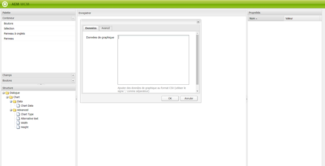

# Éditeur de boîtes de dialogue{#dialog-editor}

L’éditeur de boîtes de dialogue offre une interface graphique pour créer et modifier facilement des boîtes de dialogue et des modèles automatiques.

To see how it works, go to CRXDE Lite, open the explorer tree to `/libs/foundation/components/chart` and double click on the node `dialog`:

Le nœud dialog ouvre l’**éditeur de boîtes de dialogue** :

## Présentation de l’interface utilisateur {#user-interface-overview}

L’interface de l’éditeur de boîtes de dialogue est composée de quatre panneaux :

* **Palette** (dans le coin supérieur gauche) : ce panneau contient les widgets disponibles pour créer une boîte de dialogue, tels que les panneaux d’onglet, les champs de texte, les listes de sélection et les boutons. Vous pouvez développer les différentes catégories de la palette en cliquant sur la barre du séparateur.
* **Structure** (dans le coin inférieur gauche) : ce panneau affiche la structure hiérarchique des nœuds qui composent la définition de boîte de dialogue. Vous pouvez voir la même structure en développant le nœud dialog dans CRXDE Lite ou CRX Content Explorer.
* The **render** pane, in the center of the window. ce panneau affiche le rendu en tant que boîte de dialogue de la définition de boîte de dialogue définie dans le panneau Structure.
* **Propriétés** : ce panneau affiche les propriétés du nœud actuellement sélectionné dans le panneau Structure.

### Utilisation de l’éditeur de boîtes de dialogue {#using-the-dialog-editor}

Pour créer une boîte de dialogue, vous devez effectuer un glisser-déposer des éléments de la palette dans le panneau Structure en les positionnant dans la hiérarchie de la définition de boîte de dialogue.

Lorsque la structure souhaitée est terminée, vous devez cliquer sur **Enregistrer** dans la partie supérieure du panneau Rendu.

>[!CAUTION]
>
>Remarque : L’éditeur de boîtes de dialogue est destiné à la création de boîtes de dialogue relativement simples. Il est donc possible que vous ne puissiez pas modifier des définitions de boîtes de dialogue plus complexes. Si l’éditeur de boîtes de dialogue ne permet pas la modification d’une structure de boîte de dialogue, la définition de boîte de dialogue doit être créée et/ou modifiée manuellement en modifiant directement la structure de nœud dans CRXDE Lite ou CRX Content Explorer, par exemple.

### Création d’une boîte de dialogue {#creating-a-new-dialog}

Pour créer une boîte de dialogue, vous devez sélectionner le composant requis, cliquer sur **Créer…** et sur **Créer la boîte de dialogue…**.

Saisissez les informations requises, puis cliquez sur **Enregistrer tout**. Vous pouvez à présent double-cliquer sur la boîte de dialogue pour l’ouvrir dans l’éditeur.

### Utilisation de l’éditeur de boîtes de dialogue pour les modèles automatiques {#using-the-dialog-editor-for-scaffolds}

Un modèle automatique est une page spéciale qui contient un formulaire qui peut être rempli et envoyé en une seule étape. Vous pouvez ainsi créer rapidement une page à l’aide du contenu saisi.

Le formulaire qui constitue un modèle automatique est défini par une définition de boîte de dialogue, comme une boîte de dialogue normale, bien qu’il apparaisse dans la page de génération de modèles automatiques sous une autre forme. Dans la mesure où des définitions de boîtes de dialogue sont utilisées pour définir des modèles automatiques, ces derniers peuvent être conçus à l’aide de l’éditeur de boîtes de dialogue. Notez que lorsque vous utilisez l’éditeur de dialogue de cette manière, le volet de rendu affiche toujours la définition de la boîte de dialogue sous la forme d’une boîte de dialogue et non sous la forme d’un échafaudage.

Pour plus d’informations sur l’utilisation de l’éditeur de boîtes de dialogue pour créer des modèles automatiques, voir [Génération de modèles automatiques](/help/sites-authoring/scaffolding.md).
