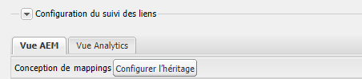
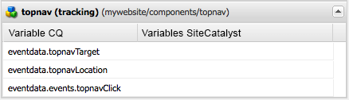

# Ajouter le suivi des Adobe Analytics aux composants{#adding-adobe-analytics-tracking-to-components}

## Including the Adobe Analytics Module in a Page Component {#including-the-adobe-analytics-module-in-a-page-component}

Page template components (e.g. `head.jsp, body.jsp`) need JSP includes in order to load the ContextHub and the Adobe Analytics integration (which is a part of Cloud Services). Tous comprennent le chargement de fichiers JavaScript.

L’entrée ContextHub doit être incluse immédiatement sous la `<head>` balise, tandis que les Cloud Services doivent être inclus dans la `<head>` section et avant la `</body>` section ; par exemple :

```xml
<head>
   <sling:include path="contexthub" resourceType="granite/contexthub/components/contexthub" />
...
   <cq:include script="/libs/cq/cloudserviceconfigs/components/servicelibs/servicelibs.jsp"/>
...
</head>
<body>
...
    <cq:include path="cloudservices" resourceType="cq/cloudserviceconfigs/components/servicecomponents"/>
</body>
```

The `contexthub` script that you insert after the `<head>` element adds the ContextHub features to the page.

Les `cloudservices` scripts que vous ajoutez dans les sections `<head>` et `<body>` les sections s’appliquent aux configurations des services cloud qui sont ajoutées à la page. (Si la page utilise plusieurs configurations Cloud Services, vous devez inclure les fichiers jsp ContextHub et jsp Cloud Services une seule fois.)

Lorsqu’une structure Adobe Analytics est ajoutée à la page, les `cloudservices` scripts génèrent du javascript associé à Adobe Analytics et des références à des bibliothèques côté client, comme dans l’exemple suivant :

```xml
<div class="sitecatalyst cloudservice">
<script type="text/javascript" src="/etc/clientlibs/foundation/sitecatalyst/sitecatalyst.js"></script>
<script type="text/javascript" src="/etc/clientlibs/foundation/sitecatalyst/util.js"></script>
<script type="text/javascript" src="/content/geometrixx-outdoors/_jcr_content/analytics.sitecatalyst.js"></script>
<script type="text/javascript" src="/etc/clientlibs/mac/mac-sc.js"></script>
<script type="text/javascript" src="/etc/clientlibs/foundation/sitecatalyst/plugins.js"></script>
<script type="text/javascript">
<!--
CQ_Analytics.Sitecatalyst.frameworkComponents = ['foundation/components/page'];
/**
 * Sets Adobe Analytics variables accordingly to mapped components. If <code>options</code>
 * object is provided only variables matching the options.componentPath are set.
 *
 * @param {Object} options Parameter object from CQ_Analytics.record() call. Optional.
 */
CQ_Analytics.Sitecatalyst.updateEvars = function(options) {
    this.frameworkMappings = [];
 this.frameworkMappings.push({scVar:"pageName",cqVar:"pagedata.title",resourceType:"foundation/components/page"});
    for (var i=0; i<this.frameworkMappings.length; i++){
  var m = this.frameworkMappings[i];
  if (!options || options.compatibility || (options.componentPath == m.resourceType)) {
   CQ_Analytics.Sitecatalyst.setEvar(m);
  }
    }
}

CQ_Analytics.CCM.addListener("storesinitialize", function(e) {
 var collect = true;
    var lte = s.linkTrackEvents;
    s.pageName="content:geometrixx-outdoors:en";
    CQ_Analytics.Sitecatalyst.collect(collect);
    if (collect) {
  CQ_Analytics.Sitecatalyst.updateEvars();
     /************* DO NOT ALTER ANYTHING BELOW THIS LINE ! **************/
     var s_code=s.t();if(s_code)document.write(s_code);
     s.linkTrackEvents = lte;
     if(s.linkTrackVars.indexOf('events')==-1){delete s.events};
     $CQ(document).trigger("sitecatalystAfterCollect");
    }
});
//-->
</script>
<script type="text/javascript">
<!--
if(navigator.appVersion.indexOf('MSIE')>=0)document.write(unescape('%3C')+'\!-'+'-')
//-->
</script>
<noscript></noscript>
<span data-tracking="{event:'pageView', values:{}, componentPath:'foundation/components/page'}"></span>
<div id="cq-analytics-texthint" style="background:white; padding:0 10px; display:none;">
 <h3 class="cq-texthint-placeholder">Component clientcontext is missing or misplaced.</h3>
</div>
<script type="text/javascript">
$CQ(function(){
 if( CQ_Analytics &&
  CQ_Analytics.ClientContextMgr &&
  !CQ_Analytics.ClientContextMgr.isConfigLoaded )
  {
   $CQ("#cq-analytics-texthint").show();
  }
});
</script>
</div>
```

Tous les exemples de sites, tels qu’AEM Geometrixx Outdoors, incluent ce code.

### L’événement sitecatalystAfterCollect {#the-sitecatalystaftercollect-event}

The `cloudservices` script triggers the `sitecatalystAfterCollect` event:

```
$CQ(document).trigger("sitecatalystAfterCollect");
```

Cet événement est déclenché pour indiquer que le suivi de page est terminé. Si vous effectuez des opérations de suivi supplémentaires sur cette page, vous devez écouter cet événement au lieu de l’événement de chargement de document ou de document prêt. Using the `sitecatalystAfterCollect` event avoids collisions or other unpredictable behavior.

>[!NOTE]
>
>La `/libs/cq/analytics/clientlibs/sitecatalyst/sitecatalyst.js` bibliothèque comprend le code du `s_code.js` fichier Adobe Analytics.

## Mise en oeuvre du suivi Adobe Analytics pour les composants personnalisés {#implementing-adobe-analytics-tracking-for-custom-components}

Permettre à vos composants AEM d’interagir avec la structure Adobe Analytics. Configurez ensuite votre structure de sorte qu’Adobe Analytics suive les données du composant.

Les composants qui interagissent avec la structure Adobe Analytics apparaissent dans SideKick lorsque vous modifiez une structure. Après avoir fait glisser le composant vers la structure, les propriétés du composant s’affichent et vous pouvez ensuite les mapper avec les propriétés Adobe Analytics. (See [Setting Up a Framework For Basic Tracking](/help/sites-administering/adobeanalytics-connect.md#creating-a-adobe-analytics-framework).)

Components can interact with the Adobe Analytics framework when the component has a child node named `analytics`. Le nœud `analytics` possède les propriétés suivantes :

* `cq:trackevents`: Identifie les événements CQ exposés par le composant. (Voir Événements personnalisés.)
* `cq:trackvars`: Nomme les variables CQ mises en correspondance avec les propriétés Adobe Analytics.
* `cq:componentName` : nom du composant qui s’affiche dans le sidekick.
* `cq:componentGroup`: Groupe dans le Sidekick qui inclut le composant.

Le code dans le composant JSP ajoute le code JavaScript à la page pour déclencher le suivi et définir les données qui font l’objet d’un suivi. The event name and data names used in the javascript must match the corresponding values of the `analytics` node properties.

* Utilisez l’attribut data-tracking pour suivre les données d’événement lors du chargement d’une page. (Voir [Suivi d’événements personnalisés lors du chargement d’une page](/help/sites-developing/extending-analytics.md#tracking-custom-events-on-page-load).)
* Utilisez la fonction CQ_Analytics.record pour suivre les données d’événement lorsque les utilisateurs interagissent avec les fonctions de page. (Voir [Suivi d’événements personnalisés après le chargement d’une page](/help/sites-developing/extending-analytics.md#tracking-custom-events-after-page-load).)

Lorsque vous utilisez ces méthodes de suivi de données, le module d&#39;intégration Adobe Analytics effectue automatiquement les appels à Adobe Analytics pour enregistrer les événements et les données.

### Exemple : suivi des clics de topnav {#example-tracking-topnav-clicks}

Etendez le composant de base topnav de sorte que Adobe Analytics effectue le suivi des clics sur les liens de navigation en haut de la page. Lorsqu’un utilisateur clique sur un lien de navigation, Adobe Analytics enregistre le lien sur lequel l’utilisateur a cliqué et la page sur laquelle il a cliqué.

Les procédures suivantes nécessitent que vous ayez déjà effectué les tâches suivantes :

* Création d’une application CQ
* Création d’une configuration Adobe Analytics et d’un cadre Adobe Analytics.

#### Copie du composant topnav {#copy-the-topnav-component}

Copiez le composant topnav sur votre application CQ. La procédure requiert que votre application soit installée dans CRXDE Lite.

1. Right-click the `/libs/foundation/components/topnav` node and click Copy.
1. Cliquez avec le bouton droit sur le dossier Components sous votre dossier d’application et cliquez sur Coller.
1. Cliquez sur Enregistrer tout.

#### Intégration De La Topnav Dans Le Cadre Adobe Analytics {#integrating-topnav-with-the-adobe-analytics-framework}

Configurez le composant topnav et modifiez le fichier JSP pour définir les événements et les données de suivi.

1. Cliquez avec le bouton droit sur le nœud topnav et cliquez sur Créer > Créer un nœud. Spécifiez les valeurs suivantes pour les propriétés, puis cliquez sur OK :

   * Nom : `analytics`
   * Type : `nt:unstructured`

1. Ajoutez la propriété suivante au nœud analytics pour nommer l’événement de suivi :

   * Nom : cq:trackevents
   * Type : Chaîne
   * Valeur : topnavClick

1. Ajoutez la propriété suivante au nœud analytics pour nommer les variables de données :

   * Nom : cq:trackvars
   * Type : Chaîne
   * Valeur : topnavTarget,topnavLocation

1. Ajoutez la propriété suivante au nœud analytics pour nommer le composant pour le sidekick :

   * Nom : cq:componentName
   * Type : Chaîne
   * Valeur : topnav (suivi)

1. Ajoutez la propriété suivante au nœud analytics pour nommer le groupe de composants pour le sidekick :

   * Nom : cq:componentGroup
   * Type : Chaîne
   * Valeur : General

1. Cliquez sur Enregistrer tout.
1. Open the `topnav.jsp` file.
1. Dans l’élément a, ajoutez l’attribut suivant :

   ```xml
   onclick = "tracknav('<%= child.getPath() %>.html')"
   ```

1. Au bas de la page, ajoutez le code JavaScript suivant :

   ```xml
   <script type="text/javascript">
       function tracknav(target) {
               if (CQ_Analytics.Sitecatalyst) {
                   CQ_Analytics.record({
                       event: 'topnavClick',
                       values: {
                           topnavTarget: target,
                           topnavLocation:'<%=currentPage.getPath() %>.html'
                       },
                       componentPath: '<%=resource.getResourceType()%>'
                   });
               }
       }
   </script>
   ```

1. Cliquez sur Enregistrer tout.

The content of the `topnav.jsp` file should appear as follows:

```xml
<%@page session="false"%><%--
  Copyright 1997-2008 Day Management AG
  Barfuesserplatz 6, 4001 Basel, Switzerland
  All Rights Reserved.

  This software is the confidential and proprietary information of
  Day Management AG, ("Confidential Information"). You shall not
  disclose such Confidential Information and shall use it only in
  accordance with the terms of the license agreement you entered into
  with Day.

  ==============================================================================

  Top Navigation component

  Draws the top navigation

--%><%@include file="/libs/foundation/global.jsp"%><%
%><%@ page import="java.util.Iterator,
        com.day.text.Text,
        com.day.cq.wcm.api.PageFilter,
        com.day.cq.wcm.api.Page,
        com.day.cq.commons.Doctype,
        org.apache.commons.lang3.StringEscapeUtils" %><%

    // get starting point of navigation
    long absParent = currentStyle.get("absParent", 2L);
    String navstart = Text.getAbsoluteParent(currentPage.getPath(), (int) absParent);

    //if not deep enough take current node
    if (navstart.equals("")) navstart=currentPage.getPath();

    Resource rootRes = slingRequest.getResourceResolver().getResource(navstart);
    Page rootPage = rootRes == null ? null : rootRes.adaptTo(Page.class);
    String xs = Doctype.isXHTML(request) ? "/" : "";
    if (rootPage != null) {
        Iterator<Page> children = rootPage.listChildren(new PageFilter(request));
        while (children.hasNext()) {
            Page child = children.next();
            %><a onclick = "tracknav('<%= child.getPath() %>.html')"  href="<%= child.getPath() %>.html"><%
            %>" src="<%= child.getPath() %>.navimage.png"<%= xs %>></a><%
        }
    }
%><script type="text/javascript">
    function tracknav(target) {
            if (CQ_Analytics.Sitecatalyst) {
                CQ_Analytics.record({
                    event: 'topnavClick',
                    values: {
                        topnavTarget:target,
                        topnavLocation:'<%=currentPage.getPath() %>.html'
                    },
                    componentPath: '<%=resource.getResourceType()%>'
                });
            }
    }
</script>
```

>[!NOTE]
>
>Il est souvent souhaitable de suivre les données de ContextHub. For information about using javascript to obtain this information, see [Accessing Values in the ContextHub](/help/sites-developing/extending-analytics.md#accessing-values-in-the-contexthub).

#### Ajout du composant de suivi au sidekick {#adding-the-tracking-component-to-sidekick}

Ajoutez les composants qui sont activés pour le suivi avec le panneau latéral Adobe Analytics à afin que vous puissiez les ajouter à votre structure.

1. Ouvrez votre structure Adobe Analytics à partir de votre configuration Adobe Analytics. ([http://localhost:4502/etc/cloudservices/sitecatalyst.html](http://localhost:4502/etc/cloudservices/sitecatalyst.html))
1. Dans le sidekick, cliquez sur le bouton Créer.

   

1. Dans la zone Configuration du suivi des liens, cliquez sur Configurer l’héritage.

   

1. Dans la liste Composants autorisés, sélectionnez topnav (suivi) dans la section Général, puis cliquez sur OK.
1. Développez le sidekick pour passer en mode d’édition. Le composant est désormais disponible dans le groupe Général.

#### Ajout du composant topnav à votre structure {#adding-the-topnav-component-to-your-framework}

Faites glisser le composant topnav vers votre structure Adobe Analytics et mappez les variables et les événements des composants aux variables et événements Adobe Analytics. (See [Setting Up a Framework For Basic Tracking](/help/sites-administering/adobeanalytics-connect.md).)



Le composant topnav est désormais intégré au cadre Adobe Analytics. Lorsque vous ajoutez le composant à une page, un clic sur les éléments dans la barre de navigation supérieure entraîne l’envoi de données de suivi à Adobe Analytics.

### Envoi de données s.products à Adobe Analytics {#sending-s-products-data-to-adobe-analytics}

Les composants peuvent générer des données pour la variable s.products envoyée à Adobe Analytics. Concevez vos composants pour contribuer à la variable s.products :

* Enregistrez une valeur nommée `product` avec une structure spécifique.
* Expose the data members of the `product` value so that they can be mapped with Adobe Analytics variables in the Adobe Analytics framework.

La variable s.products Adobe Analytics utilise la syntaxe suivante :

```
s.products="category;product;quantity;price;eventY={value}|eventZ={value};evarA={value}|evarB={value}"
```

The Adobe Analytics integration module constructs the `s.products` variable using the `product` values that AEM components generate. The `product` value in the javascript that AEM components generate is an array of values that have the following structure:

```
"product": [{
    "category": "",
    "sku"     : "path to product node",
    "quantity": quantity,
    "price"   : price,
    "events   : {
      "eventName1": "eventValue1",
      "eventName_n": "eventValue_n"
    }
    "evars"   : {
      "eVarName1": "eVarValue1",
      "eVarName_n": "eVarValue_n"
    }
}]
```

Lorsqu’un élément de données est omis de la valeur `product`, il est envoyé en tant que chaîne vide dans s.products.

>[!NOTE]
>
>When no event is associated with a product value, Adobe Analytics uses the `prodView` event by default.

The `analytics` node of the component must expose the variable names using the `cq:trackvars` property:

* product.category
* product.sku
* product.quantity
* product.price
* product.events.eventName1
* product.events.eventName_n
* product.evars.eVarName1
* product.evars.eVarName_n

Le module eCommerce fournit plusieurs composants qui génèrent des données de variable s.products. Par exemple, le composant submitorder ([http://localhost:4502/crx/de/index.jsp#/libs/commerce/components/submitorder/submitorder.jsp](http://localhost:4502/crx/de/index.jsp#/libs/commerce/components/submitorder/submitorder.jsp)) génère un code JavaScript qui est similaire à l’exemple suivant :

```
<script type="text/javascript">
    function trackCartPurchase() {
        if (CQ_Analytics.Sitecatalyst) {
            CQ_Analytics.record({
                "event": ["productsCartPurchase"],
                "values": {
                    "product": [
                        {
                            "category": "",
                            "sku"     : "/path/to/prod/1",
                            "quantity": 3,
                            "price"   : 179.7,
                            "evars"   : {
                                "childSku": "/path/to/prod/1/green/xs",
                                "size"    : "XS"
                            }
                        },
                        {
                            "category": "",
                            "sku"     : "/path/to/prod/2",
                            "quantity": 10,
                            "price"   : 150,
                            "evars"   : {
                                "childSku": "/path/to/prod/2",
                                "size"    : ""
                            }
                        },
                        {
                            "category": "",
                            "sku"     : "/path/to/prod/3",
                            "quantity": 2,
                            "price"   : 102,
                            "evars"   : {
                                "childSku": "/path/to/prod/3/m",
                                "size"    : "M"
                            }
                        }
                    ]
                },
                "componentPath": "commerce/components/submitorder"
            });
            CQ_Analytics.record({
                "event": ["discountRedemption"],
                "values": {
                    "discount": "/path/to/discount/1 - /path/to/discount/2",
                    "product" : [{
                        "category": "",
                        "sku"     : "Promotional Discount",
                        "events"  : {"discountRedemption": 20.00}
                    }]
                },
                "componentPath": "commerce/components/submitorder"
            });
            CQ_Analytics.record({
                "event": ["cartPurchase"],
                "values": {
                    "orderId"       : "00e40e2d-13a2-4a00-a8ee-01a9ebb0bf68",
                    "shippingMethod": "overnight",
                    "paymentMethod" : "Amex",
                    "billingState"  : "NY",
                    "billingZip"    : "10458",
                    "product"       : [{"category": "", "sku": "", "quantity": "", "price": ""}]
                },
                "componentPath": "commerce/components/submitorder"
            });
        }
        return true;
    }
</script>
```

#### Limitation de la taille des appels de suivi {#limiting-the-size-of-tracking-calls}

En règle générale, les navigateurs web limitent la taille des requêtes GET. Le produit CQ et les valeurs de SKU étant des chemins de référentiel, les tableaux de produits comportant plusieurs valeurs peuvent dépasser la taille maximale de requête. Therefore, your components should limit the number of items in the `product` array of each `CQ_Analytics.record function`. Créez plusieurs fonctions si le nombre d’éléments que vous devez suivre peut dépasser cette limite.

For example, the eCommerce submitorder component limits the number of `product` items in a call to four. Lorsque le panier contient plus de quatre produits, il génère plusieurs fonctions `CQ_Analytics.record`.
