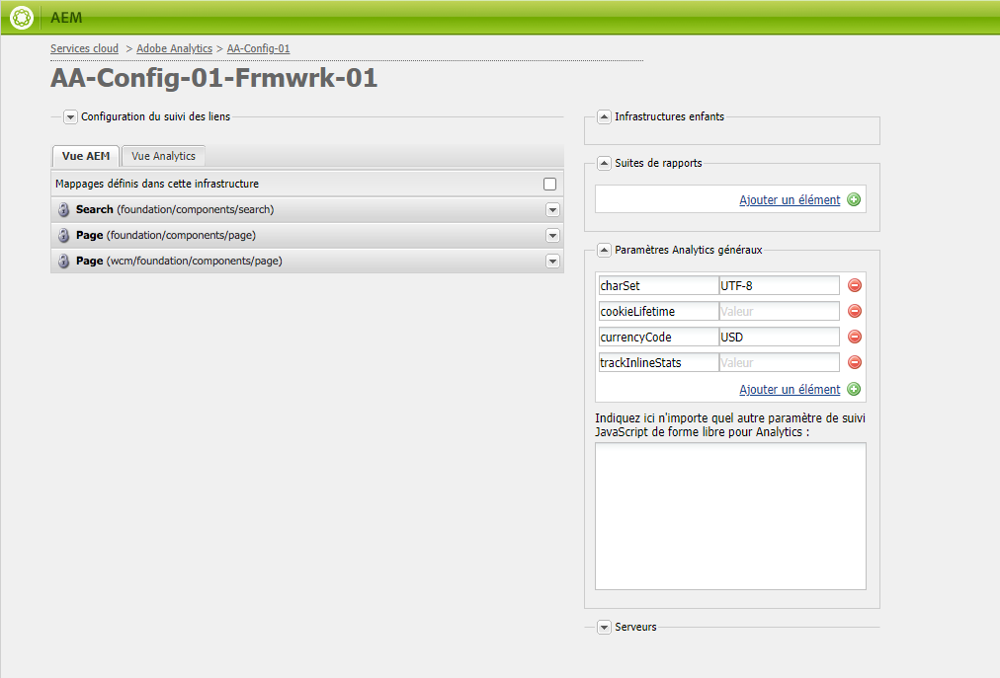
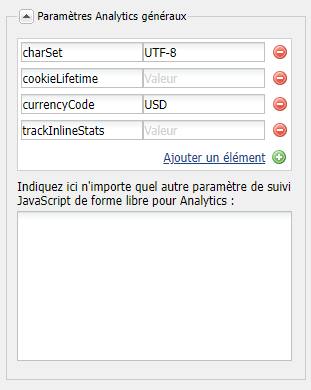

# Personnalisation de Adobe Analytics Framework{#customizing-the-adobe-analytics-framework}

La structure Adobe Analytics détermine les informations suivies avec Adobe Analytics. Pour personnaliser la structure par défaut, vous utilisez javascript pour ajouter un suivi personnalisé, intégrer des modules externes Adobe Analytics et modifier les paramètres généraux de la structure utilisée pour le suivi.

## À propos du javascript généré pour des frameworks {#about-the-generated-javascript-for-frameworks}

Lorsqu’une page est associée à une structure Adobe Analytics et que la page contient [des références au module Analytics](/help/sites-administering/adobeanalytics.md), un fichier analytics.sitecatalyst.js est automatiquement généré pour la page.

Le script javascript dans la page crée un objet `s_gi`(défini par la bibliothèque Adobe Analytics s_code.js) et affecte des valeurs à ses propriétés. Le nom de l’instance d’objet est `s`. Les exemples de code présentés dans cette section font plusieurs références à cette variable `s`.

L’exemple de code suivant est similaire au code d’un fichier analytics.sitecatalyst.js :

```
var s_account = "my_sitecatalyst_account";
var s = s_gi(s_account);
s.fpCookieDomainPeriods = "3";
s.currencyCode= 'USD';
s.trackInlineStats= true;
s.linkTrackVars= 'None';
s.charSet= 'UTF-8';
s.linkLeaveQueryString= false;
s.linkExternalFilters= '';
s.linkTrackEvents= 'None';
s.trackExternalLinks= true;
s.linkDownloadFileTypes= 'exe,zip,wav,mp3,mov,mpg,avi,wmv,doc,pdf,xls';
s.linkInternalFilters= 'javascript:,'+window.location.hostname;
s.trackDownloadLinks= true;

s.visitorNamespace = "mynamespace";
s.trackingServer = "xxxxxxx.net";
s.trackingServerSecure = "xxxxxxx.net";

/* Plugin Config */
/*
s.usePlugins=false;
function s_doPlugins(s) {
    //add your custom plugin code here
}
s.doPlugins=s_doPlugins;
*/
```

Lorsque vous utilisez un code javascript personnalisé pour personnaliser le framework, vous modifiez le contenu de ce fichier.

## Configuration des propriétés Adobe Analytics {#configuring-adobe-analytics-properties}

Il existe un certain nombre de variables prédéfinies en Adobe Analytics qui peuvent être configurées sur une structure. Par défaut, les variables **charset**, **cookieLifetime**, **currencyCode** et **trackInlineStats** sont incluses dans la liste **Paramètres généraux d’analyse**.



Vous pouvez ajouter des noms de variables et des valeurs à la liste. Ces variables prédéfinies et toutes les variables que vous ajoutez sont utilisées pour configurer les propriétés de l’objet `s` dans le fichier analytics.sitecatalyst.js. L’exemple suivant montre comment la propriété `prop10` ajoutée de la valeur `CONSTANT` est représentée dans le code javascript :

```
var s_account = "my_sitecatalyst_account";
var s = s_gi(s_account);
s.fpCookieDomainPeriods = "3";
s.currencyCode= 'USD';
s.trackInlineStats= true;
s.linkTrackVars= 'None';
s.charSet= 'UTF-8';
s.linkLeaveQueryString= false;
s.linkExternalFilters= '';
s.linkTrackEvents= 'None';
s.trackExternalLinks= true;
s.linkDownloadFileTypes= 'exe,zip,wav,mp3,mov,mpg,avi,wmv,doc,pdf,xls';
s.prop10= 'CONSTANT';
s.linkInternalFilters= 'javascript:,'+window.location.hostname;
s.trackDownloadLinks= true;

s.visitorNamespace = "mynamespace";
s.trackingServer = "xxxxxxx.net";
s.trackingServerSecure = "xxxxxxx.net";
```

Utilisez la procédure suivante pour ajouter des variables à la liste :

1. Sur la page de la structure Adobe Analytics, développez la zone **Paramètres généraux d’analyse**.
1. Sous la liste des variables, cliquez sur Ajouter un élément pour ajouter une nouvelle variable à la liste.
1. Dans la cellule de gauche, entrez le nom de la variable, par exemple `prop10`.

1. Dans la colonne de droite, entrez une valeur pour la variable, par exemple `CONSTANT`.

1. Pour supprimer une variable, cliquez sur le bouton (-) à côté de la variable.

>[!NOTE]
>
>Lorsque vous entrez des variables et des valeurs, assurez-vous qu’elles sont correctement mises en forme et orthographiées, sinon les **appels ne seront pas envoyés** avec la paire valeur/variable correcte. Les variables et les valeurs mal orthographiées peuvent même empêcher les appels de se produire.
>
>Consultez votre représentant Adobe Analytics pour vous assurer que ces variables sont correctement définies.

>[!CAUTION]
>
>Certaines des variables de cette liste sont **mandatory** pour que les appels Adobe Analytics fonctionnent correctement (ex. **currencyCode**, **charSet**)
>
>Ainsi, même s’ils sont supprimés du cadre lui-même, ils seront toujours attachés avec une valeur par défaut lorsque l’appel Adobe Analytics est effectué.

### Ajouter javascript personnalisé à un Adobe Analytics Framework {#adding-custom-javascript-to-an-adobe-analytics-framework}

La zone de code JavaScript gratuit dans la zone **Paramètres généraux d’analyse** vous permet d’ajouter du code personnalisé à une structure Adobe Analytics.



Le code que vous ajoutez est ajouté au fichier analytics.sitecatalyst.js. Par conséquent, vous pouvez accéder à la variable `s`, qui est une instance de l’objet javascript `s_gi` défini dans `s_code.js`. Par exemple, l’ajout du code suivant équivaut à ajouter une variable nommée `prop10` de valeur `CONSTANT` qui est l’exemple de la section précédente :

`s.prop10= 'CONSTANT';`

Le code du fichier [analytics.sitecatalyst.js](/help/sites-developing/extending-analytics-components.md) (qui inclut le contenu du fichier Adobe Analytics `s-code.js`) contient le code suivant :

`if (s.usePlugins) s.doPlugins(s)`

La procédure suivante montre comment utiliser la zone javascript pour personnaliser le suivi Adobe Analytics. Si votre JavaScript doit utiliser des modules externes Adobe Analytics, [intégrez-les](/help/sites-administering/adobeanalytics.md) dans AEM.

1. Ajoutez le code javascript suivant à la zone afin que `s.doPlugins` soit exécuté :

   ```
   s.usePlugins=true;
   function s_doPlugins(s) {
       //add your custom code here
   }
   s.doPlugins=s_doPlugins;
   ```

   >[!CAUTION]
   >
   >Ce code est nécessaire si vous souhaitez envoyer des variables dans un appel Adobe Analytics qui ont été personnalisées d’une manière qui ne peut pas être effectuée via l’interface de glisser-déposer de base OU via le javascript intégré dans la Vue Adobe Analytics.
   >
   >Si les variables personnalisées sont en dehors de la fonction s_doPlugins, elles seront envoyées sous la forme *undefined *dans l’appel Adobe Analytics

1. Ajoutez votre code javascript dans la fonction **s_doPlugins**.

L’exemple suivant concatène les données capturées sur une page dans l’ordre hiérarchique, en utilisant un séparateur commun de &quot;|&quot;.

Une structure Adobe Analytics comporte les configurations suivantes :

* La variable `prop2` Adobe Analytics est mappée à la propriété de site `pagedata.sitesection`.

* La variable `prop3` Adobe Analytics est mappée à la propriété de site `pagedata.subsection`.

* Le code suivant est ajouté à la zone javascript au format libre :

   ```
   s.usePlugins=true;
    function s_doPlugins(s) {
    s.prop1 = s.prop2+'|'+s.prop3;
    }
    s.doPlugins=s_doPlugins;
   ```

* Lorsque la page Web qui utilise le cadre est visitée (ou, en mode d’édition, la page est rechargée ou prévisualisée), les appels à Adobe Analytics sont effectués.

Par exemple, les valeurs suivantes sont générées en Adobe Analytics :


### Ajouter un code personnalisé global pour tous les cadres Adobe Analytics {#adding-global-custom-code-for-all-adobe-analytics-frameworks}

Fournissez du code JavaScript personnalisé qui est intégré à toutes les infrastructures Adobe Analytics. Lorsqu’une structure Adobe Analytics d’une page ne contient pas de code JavaScript personnalisé [de forme libre ](/help/sites-administering/adobeanalytics.md), le script javascript généré par le script /libs/cq/analytics/components/sitecatalyst/config.js.jsp est ajouté au fichier [analytics.sitecatalyst.js](/help/sites-administering/adobeanalytics.md). Par défaut, le script n’a aucun effet car il est commenté. Le code définit également `s.usePlugins` sur `false` :

```
/* Plugin Config */
/*
s.usePlugins=false;
function s_doPlugins(s) {
    //add your custom plugin code here
}
s.doPlugins=s_doPlugins;
*/
```

Le code du fichier analytics.sitecatalyst.js (qui comprend le contenu du fichier s_code.js Adobe Analytics) contient le code suivant :

if (s.usePlugins) s.doPlugins(s)

Par conséquent, votre script javascript doit définir `s.usePlugins` sur `true` pour que tout code de la fonction `s_doPlugins` soit exécuté. Pour personnaliser le code, superposez le fichier config.js.jsp avec celui qui utilise votre propre javascript. Si votre JavaScript doit utiliser des modules externes Adobe Analytics, [intégrez-les](/help/sites-administering/adobeanalytics.md) dans AEM.

>[!NOTE]
>
>Ne modifiez pas le fichier /libs/cq/analytics/components/sitecatalyst/config.js.jsp. Certaines tâches de mise à niveau ou de maintenance d’AEM peuvent réinstaller le fichier d’origine, en supprimant vos modifications.

1. Dans CRXDE Lite, créez la structure de dossier /apps/cq/analytics/components :

   1. Sélectionnez le dossier /apps et cliquez sur Créer > Créer un dossier.
   1. Indiquez `cq` comme nom de dossier, puis cliquez sur OK.
   1. De même, créez les dossiers `analytics` et `components`.

1. Cliquez avec le bouton droit sur le dossier `components` que vous venez de créer et cliquez sur Créer > Créer un composant. Spécifiez les valeurs de propriété suivantes :

   * Libellé: `sitecatalyst`
   * Titre: `sitecatalyst`
   * Super Type : `/libs/cq/analytics/components/sitecatalyst`
   * Groupe: `hidden`

1. Cliquez plusieurs fois sur Suivant jusqu’à ce que le bouton OK soit activé, puis cliquez sur OK.

   Le composant sitecatalyst contient le fichier sitecatalyst.jsp automatiquement créé.

1. Cliquez avec le bouton droit sur le fichier sitecatalyst.jsp et cliquez sur Supprimer.

1. Cliquez avec le bouton droit sur le composant sitecatalyst et cliquez sur Créer > Créer un fichier. Indiquez le nom `config.js.jsp`, puis cliquez sur OK.

   Le fichier config.js.jsp s’ouvre automatiquement pour se faire modifier.

1. Ajoutez le texte suivant au fichier, puis cliquez sur Enregistrer tout :

   ```java
   <%@page session="true"%>
   /* Plugin Config */
   s.usePlugins=true;
   function s_doPlugins(s) {
       //add your custom plugin code here
   }
   s.doPlugins=s_doPlugins;
   ```

   Le code javascript généré par le script /apps/cq/analytics/components/sitecatalyst/config.js.jsp est maintenant inséré dans le fichier analytics.sitecatalyst.js pour toutes les pages qui utilisent une structure Adobe Analytics.

1. Ajoutez le code javascript que vous voulez exécuter dans la fonction `s_doPlugins`, puis cliquez sur Enregistrer tout.

>[!CAUTION]
>
>Si du texte est présent dans le javascript au format libre de l’infrastructure d’une page (même uniquement les espaces), config.js.jsp est ignoré.

### Utilisation des modules externes Adobe Analytics dans AEM {#using-adobe-analytics-plugins-in-aem}

Procurez-vous le code javascript pour les modules externes Adobe Analytics et intégrez-les dans votre structure Adobe Analytics en AEM. Ajoutez le code dans un dossier de bibliothèque cliente de la catégorie `sitecatalyst.plugins` afin qu’il soit disponible pour votre code javascript personnalisé.

Par exemple, si vous intégrez le module externe `getQueryParams`, vous pouvez appeler le module externe depuis la fonction `s_doPlugins` de votre javascript personnalisé. L’exemple de code suivant envoie la chaîne de requête **&quot;pid&quot;** de l’URL du parrain sous la forme **eVar1**, lorsqu’un appel Adobe Analytics est déclenché.

```
s.usePlugins=true;
function s_doPlugins(s) {
   // take the query string from the referrer
   s.eVar1=s.getQueryParam('pid','',document.referrer);
}
s.doPlugins=s_doPlugins;
```

AEM installe les modules externes Adobe Analytics suivants, de sorte qu’ils soient disponibles par défaut :

* getQueryParam()
* getPreviousValue()
* split()

Le dossier de bibliothèque client /libs/cq/analytics/clientlibs/sitecatalyst/plugins comprend ces modules externes dans la catégorie sitecatalyst.plugins.

>[!NOTE]
>
>Créez un dossier de bibliothèque cliente pour vos modules externes. N’ajoutez pas de modules externes au dossier `/libs/cq/analytics/clientlibs/sitecatalyst/plugins`. Cette pratique garantit que votre contribution à la catégorie `sitecatalyst.plugins` ne se retrouve pas remplacée lors de réinstallations d’AEM ou d’activités de mise à niveau.

Suivez la procédure ci-après pour créer le dossier de bibliothèque cliente de vos modules externes. Vous n’avez à réaliser cette opération qu’une seule fois. Pour ajouter un module externe au dossier de bibliothèque cliente, procédez comme suit.

1. Dans un navigateur Web, ouvrez CRXDE Lite. ([http://localhost:4502/crx/de](http://localhost:4502/crx/de))

1. Cliquez avec le bouton droit sur le dossier /apps/my-app/clientlibs, puis cliquez sur Créer > Créer un noeud. Entrez les valeurs de propriété suivantes, puis cliquez sur OK :

   * Nom : nom de votre dossier de bibliothèque cliente, par exemple, mes-modules-externes

   * Type : cq:ClientLibraryFolder

1. Sélectionnez le dossier de bibliothèque cliente que vous venez de créer et utilisez la barre de propriétés en bas à droite pour ajouter la propriété suivante :

   * Nom : categories
   * Type : chaîne
   * Valeur : sitecatalyst.plugins
   * Multi : sélectionné

   Cliquez sur OK dans la fenêtre Modifier pour confirmer la valeur de la propriété.

1. Cliquez avec le bouton droit sur le dossier de la bibliothèque cliente que vous venez de créer et cliquez sur Créer > Créer un fichier. Pour le nom de fichier, tapez js.txt, puis cliquez sur OK.

1. Cliquez sur Enregistrer tout.

Procédez comme suit pour obtenir le code du module externe, stocker le code dans le référentiel AEM et l’ajouter dans votre dossier de bibliothèque cliente.

1. Connectez-vous à [sc.omniture.com](https://sc.omniture.com) à l’aide de votre compte Adobe Analytics.
1. Sur la page d’accueil, accédez à Help (Aide) > Help Home (Aide Accueil).
1. Dans la table des matières sur le côté gauche, cliquez sur Implementation Plug-ins (Modules externes d’implémentation).
1. Cliquez sur le lien vers le module externe que vous souhaitez ajouter. Quand la page s’ouvre, recherchez le code source javascript pour le module externe, puis sélectionnez-le et copiez-le. 

1. Cliquez avec le bouton droit sur le dossier de votre bibliothèque cliente, puis cliquez sur Créer > Créer un fichier. Pour le nom de fichier, tapez le nom du module externe que vous intégrez, suivi du suffixe .js, puis cliquez sur OK. Par exemple, si vous intégrez le module externe getQueryParam, nommez le fichier getQueryParam.js.

   Lorsque vous créez le fichier, il s’ouvre pour se faire modifier.

1. Collez le code javascript du module externe dans le fichier, cliquez sur Enregistrer tout, puis fermez le fichier.

1. Ouvrez le fichier js.txt à partir du dossier de votre bibliothèque cliente.

1. Dans une nouvelle ligne, ajoutez le nom du fichier qui contient le module externe, par exemple getQueryParam.js. Ensuite, cliquez sur Enregistrer tout et fermez le fichier.

>[!NOTE]
>
>Lors de l’utilisation de modules externes, assurez-vous d’intégrer des modules externes de support. À défaut, le module externe javascript ne reconnaîtra pas les appels qu’il passe aux fonctions du module externe de support. Par exemple, le module externe getPreviousValue () requiert le module externe split() pour fonctionner correctement.
>
>Le nom du module externe de support doit également être ajouté à **js.txt**.
