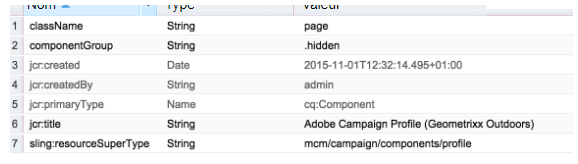
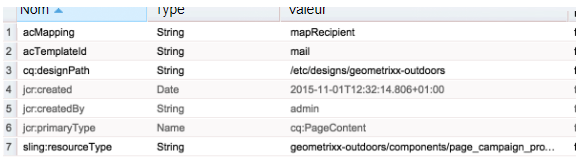

# Création du modèle de page AEM personnalisé avec des composants de formulaire Adobe Campaign{#creating-custom-aem-page-template-with-adobe-campaign-form-components}

This page explains how to build a custom page template that uses [Adobe Campaign Form](/help/sites-authoring/adobe-campaign-components.md) components by examining how the Geometrixx-outdoors template ( `/apps/geometrixx-outdoors/components/page_campaign_profile`) is implemented, and points you to important information you may need when creating your own custom template.

>[!NOTE]
>
>[Les exemples de courrier électronique et de formulaire sont disponibles uniquement dans Geometrixx](/help/sites-developing/we-retail.md). Téléchargez un exemple de contenu Geometrixx à partir de Package Share.

Pour créer un modèle de page AEM personnalisé à l’aide de composants de formulaire Adobe Campaign, vérifiez que vous disposez des éléments suivants :

1. **resourceSuperType correct**

   Make sure the page-component inherits from `mcm/campaign/components/profile`.

   Ceci est nécessaire pour que les servlets obtiennent et enregistrent des informations.

   * `com.day.cq.mcm.campaign.servlets.TemplateListServlet`
   * `com.day.cq.mcm.campaign.servlets.SaveProfileServlet`

   

1. **Paramètres de ClientContext**

   When you look at the clientcontext settings ( `/etc/designs/geometrixx-outdoors/jcr:content/page_campaign_profile`) you see the following settings:

   * ClientContext points to `/etc/clientcontext/campaign`
   * Il existe également un nœud *config* supplémentaire.

   

1. **head.jsp (/apps/geometrixx-outdoors/components/page_campaign_profile/head.jsp)**

   Dans le fichier **head.jsp**, vous voyez les lignes suivantes qui utilisent **clientcontext-config** et **cloudservice-hook** :

   ```
   <cq:include path="config" resourceType="cq/personalization/components/clientcontext_optimized/config"/>
   <sling:include path="contexthub" resourceType="granite/contexthub/components/contexthub"/>
   <cq:include script="/libs/cq/cloudserviceconfigs/components/servicelibs/servicelibs.jsp"/>
   ```

1. **body.jsp (/apps/geometrixx-outdoors/components/page_campaign_profile/body.jsp)**

   In **body.jsp**, the cloud services are loaded at the bottom of the page:

   ```
   <cq:include path="cloudservices" resourceType="cq/cloudserviceconfigs/components/servicecomponents"/>
   ```

1. **Propriétés de la page de campagne**

   Pour pouvoir sélectionner un modèle Adobe Campaign, les propriétés de page sont étendues avec l’onglet **Campagne** :

   `/apps/geometrixx-outdoors/components/page_campaign_profile/dialog/items/tabs/items/campaign`

   

1. **Paramètres de modèle**.

   In the template ( `/apps/geometrixx-outdoors/templates/campaign_profile/jcr:content`) you see the following default values:

   | **acMapping** | mapRecipient (pour Adobe Campaign 6.1), profil (pour Adobe Campaign Standard) |
   |---|---|
   | **acTemplateId** | courrier |

   

