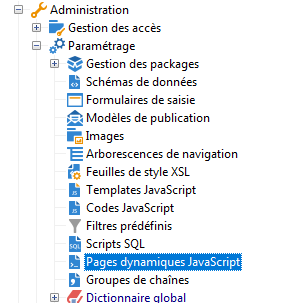
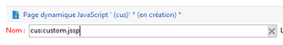
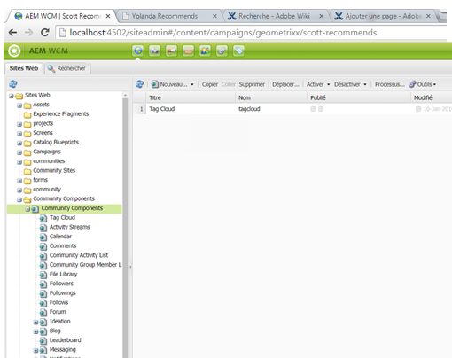

# Création d’extensions personnalisées{#creating-custom-extensions}

Généralement, lorsque vous implémentez un projet, vous disposez d’un code personnalisé dans AEM et Adobe Campaign. Grâce à l’API existante, vous pouvez appeler le code personnalisé dans Adobe Campaign à partir d’AEM ou depuis AEM vers Adobe Campaign. Ce document explique comment procéder.

## Conditions préalables {#prerequisites}

Les éléments suivants doivent être installés :

* Adobe Experience Manager 
* Adobe Campaign 6.1

Pour plus d’informations, voir [Intégration d’AEM à Adobe Campaign 6.1](/help/sites-administering/campaignonpremise.md).

## Exemple 1 : AEM vers Adobe Campaign {#example-aem-to-adobe-campaign}

L’intégration standard entre AEM et Campaign est basée sur JSON et JSSP (JavaScript Server Page). Ces fichiers JSSP, disponibles dans la console Campaign, commencent tous par **amc** (Adobe Marketing Cloud).



>[!NOTE]
>
>[Pour cet exemple, reportez-vous à la section Geometrixx](/help/sites-developing/we-retail.md), disponible dans Package Share.

Dans cet exemple, nous créons un fichier JSSP personnalisé et l’appelons du côté AEM pour récupérer le résultat. Il peut être utilisé, par exemple, pour extraire des données d’Adobe Campaign ou pour enregistrer des données dans Adobe Campaign.

1. En Adobe Campaign, pour créer un fichier JSSP, cliquez sur l’icône **New**.

   

1. Entrez le nom de ce fichier JSSP. Dans cet exemple, nous utilisons **cus:custom.jssp** (ce qui signifie qu’il sera dans l’espace de nommage **cus**).

   

1. Placez le code suivant dans le fichier jssp :

   ```
   <%
   var origin = request.getParameter("origin");
   document.write("Hello from Adobe Campaign, origin : " + origin);
   %>
   ```

1. Enregistrez votre travail. Le travail restant se fait dans AEM.
1. Créez un servlet simple du côté AEM pour appeler ce JSSP. Dans cet exemple, nous supposons ce qui suit :

   * Vous avez établi une connexion entre AEM et Campaign
   * Le service cloud de Campaign est configuré sur **/content/geometrixx-outdoors**

   L’objet le plus important de cet exemple est le **GenericCampaignConnector**, qui vous permet d’appeler (d’obtenir et de publier) des fichiers jssp du côté Adobe Campaign.

   Voici un petit extrait de code :

   ```
   @Reference
   private GenericCampaignConnector campaignConnector;
   ...
   Map<String, String> params = new HashMap<String, String>();
   params.put("origin", "AEM");
   CallResults results = campaignConnector.callGeneric("/jssp/cus/custom.jssp", params, credentials);
   return results.bodyAsString();
   ```

1. Comme vous le voyez dans cet exemple, vous devez transmettre les informations d’identification dans l’appel. Vous pouvez le faire avec la méthode getCredentials() grâce à laquelle les informations d’identification sont transmises dans une page dont le service cloud Campaign est configuré.

   ```xml
   // page containing the cloudservice for Adobe Campaign
   Configuration config = campaignConnector.getWebserviceConfig(page.getContentResource().getParent());
   CampaignCredentials credentials = campaignConnector.retrieveCredentials(config);
   ```

Le code complet se présente comme suit :

```java
import java.io.IOException;
import java.io.PrintWriter;
import java.util.HashMap;
import java.util.Map;

import javax.servlet.ServletException;

import org.apache.felix.scr.annotations.Reference;
import org.apache.felix.scr.annotations.sling.SlingServlet;
import org.apache.sling.api.SlingHttpServletRequest;
import org.apache.sling.api.SlingHttpServletResponse;
import org.apache.sling.api.servlets.SlingSafeMethodsServlet;
import org.slf4j.Logger;
import org.slf4j.LoggerFactory;

import com.day.cq.mcm.campaign.CallResults;
import com.day.cq.mcm.campaign.CampaignCredentials;
import com.day.cq.mcm.campaign.GenericCampaignConnector;
import com.day.cq.wcm.api.Page;
import com.day.cq.wcm.api.PageManager;
import com.day.cq.wcm.api.PageManagerFactory;
import com.day.cq.wcm.webservicesupport.Configuration;

@SlingServlet(paths="/bin/campaign", methods="GET")
public class CustomServlet extends SlingSafeMethodsServlet {

 private final Logger log = LoggerFactory.getLogger(this.getClass());

 @Reference
 private GenericCampaignConnector campaignConnector;

 @Reference
 private PageManagerFactory pageManagerFactory;

 @Override
 protected void doGet(SlingHttpServletRequest request,
   SlingHttpServletResponse response) throws ServletException,
   IOException {

  PageManager pm = pageManagerFactory.getPageManager(request.getResourceResolver());

  Page page = pm.getPage("/content/geometrixx-outdoors");

  String result = null;
  if ( page != null) {
   result = callCustomFunction(page);
  }
  if ( result != null ) {
   PrintWriter pw = response.getWriter();
   pw.print(result);
  }
 }

 private String callCustomFunction(Page page ) {
  try {
   Configuration config = campaignConnector.getWebserviceConfig(page.getContentResource().getParent());
   CampaignCredentials credentials = campaignConnector.retrieveCredentials(config);

   Map<String, String> params = new HashMap<String, String>();
   params.put("origin", "AEM");
   CallResults results = campaignConnector.callGeneric("/jssp/cus/custom.jssp", params, credentials);
   return results.bodyAsString();
  } catch (Exception e ) {
   log.error("Something went wrong during the connection", e);
  }
  return null;

 }

}
```

## Exemple 2 : Adobe Campaign vers AEM {#example-adobe-campaign-to-aem}

AEM propose des API prêtes à l’emploi pour récupérer les objets disponibles n’importe où dans la vue de l’explorateur siteadmin.



>[!NOTE]
>
>[Pour cet exemple, reportez-vous à la section Geometrixx](/help/sites-developing/we-retail.md), disponible dans Package Share.

Pour chaque noeud de l&#39;explorateur, il existe une API qui lui est liée. Par exemple, pour le noeud :

* [http://localhost:4502/siteadmin#/content/campaigns/geometrixx/scott-recommends](http://localhost:4502/siteadmin#/content/campaigns/geometrixx/scott-recommends)

l’API est :

* [http://localhost:4502/content/campaigns/geometrixx/scott-recommends.1.json](http://localhost:4502/content/campaigns/geometrixx/scott-recommends.2.json)

La fin de l’URL **1.json** peut être remplacée par **.2.json**, **.3.json**, selon le nombre de sous-niveaux que vous souhaitez obtenir. Pour tous les récupérer, utilisez le mot-clé **infinity** :

* [http://localhost:4502/content/campaigns/geometrixx/scott-recommends.infinity.json](http://localhost:4502/content/campaigns/geometrixx/scott-recommends.2.json)

Pour utiliser l’API, nous devons savoir qu’AEM utilise l’authentification de base par défaut.

Une bibliothèque JS nommée **amcIntegration.js** est disponible dans 6.1.1 (build 8624 et supérieur) qui implémente cette logique parmi plusieurs autres.

### Appel API AEM  {#aem-api-call}

```java
loadLibrary("nms:amcIntegration.js");

var cmsAccountId = sqlGetInt("select iExtAccountId from NmsExtAccount where sName=$(sz)","aemInstance")
var cmsAccount = nms.extAccount.load(String(cmsAccountId));
var cmsServer = cmsAccount.server;

var request = new HttpClientRequest(cmsServer+"/content/campaigns/geometrixx.infinity.json")
aemAddBasicAuthentication(cmsAccount, request);
request.method = "GET"
request.header["Content-Type"] = "application/json; charset=UTF-8";
request.execute();
var response = request.response;
```

