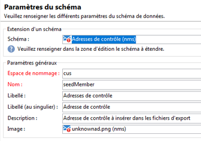
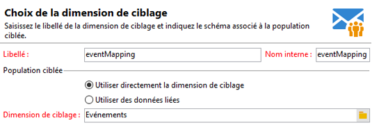
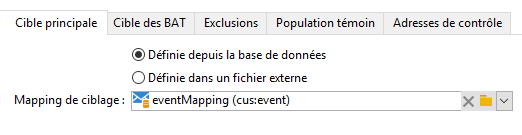
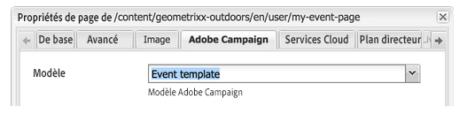
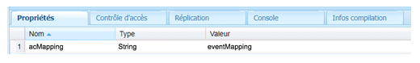
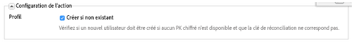
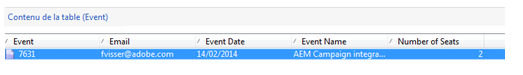

# Création de mappages de formulaires personnalisés{#creating-custom-form-mappings}

Lorsque vous créez un tableau personnalisé dans Adobe Campaign, vous pouvez créer un formulaire dans AEM qui renvoie vers ce tableau.

Ce document vous explique comment créer des mappages de formulaire personnalisés. Dès que vous aurez accompli les étapes de ce document, vous proposerez à vos utilisateurs une page sur laquelle ils pourront s’inscrire pour un événement à venir. Vous suivrez ensuite ces utilisateurs via Adobe Campaign.

## Conditions préalables {#prerequisites}

Les éléments suivants doivent être installés :

* Adobe Experience Manager 
* Adobe Campaign Classic

See [Integrating AEM with Adobe Campaign Classic](/help/sites-administering/campaignonpremise.md) for more information.

## Création de mappages de formulaires personnalisés {#creating-custom-form-mappings-2}

Pour créer des mappages de formulaire personnalisés, vous devez suivre ces étapes générales, qui sont décrites en détail dans les sections suivantes :

1. Créez un tableau personnalisé.
1. Étendez le tableau **seed**.
1. Créez un mappage personnalisé.
1. Créez une distribution sur la base du mappage personnalisé.
1. Générez, dans AEM, le formulaire qui utilisera la distribution créée.
1. Envoyez le formulaire pour le tester.

### Création du tableau personnalisé dans Adobe Campaign {#creating-the-custom-table-in-adobe-campaign}

Commencez par créer un tableau personnalisé dans Adobe Campaign. Dans cet exemple, nous utilisons la définition suivante pour créer un tableau de événement :

```xml
<element autopk="true" label="Event" labelSingular="Event" name="event">
 <attribute label="Event Date" name="eventdate" type="date"/>
 <attribute label="Event Name" name="eventname" type="string"/>
 <attribute label="Email" name="email" type="string"/>
 <attribute label="Number of Seats" name="seats" type="long"/>
</element>
```

Après avoir créé le tableau d’événements, exécutez l’**Assistant Mise à jour de la structure de base de données** pour créer le tableau.

### Extension du tableau Seed {#extending-the-seed-table}

Dans Adobe Campaign, appuyez/cliquez sur **Ajouter** pour créer une extension du tableau **Seed addresses (nms)**.



Now, use the fields from the **event** table to extend the **seed** table:

```xml
<element label="Event" name="custom_cus_event">
 <attribute name="eventname" template="cus:event:event/@eventname"/>
 <attribute name="eventdate" template="cus:event:event/@eventdate"/>
 <attribute name="email" template="cus:event:event/@email"/>
 <attribute name="seats" template="cus:event:event/@seats"/>
 </element>
```

Ensuite, exécutez l’**Assistant Mise à jour de la base de données** pour appliquer les modifications.

### Création d’un mappage cible personnalisé {#creating-custom-target-mapping}

Dans **Administration/Gestion de campagnes**, accédez à **Mappings de ciblage** et ajoutez un nouveau **Mapping de ciblage**.

>[!NOTE]
>
>Veillez à utiliser un nom explicite pour **Nom interne**.



### Création d’un modèle de diffusion personnalisé {#creating-a-custom-delivery-template}

Au cours de cette étape, vous allez ajouter un modèle de diffusion qui utilise le **mappage cible** créé.

Dans **Ressources/Modèles**, accédez au modèle de diffusion et dupliquez la diffusion AEM existante. Lorsque vous cliquez sur **À**, sélectionnez l’événement de création **Mappage cible**.



### Création du formulaire dans AEM {#building-the-form-in-aem}

Dans AEM, veillez à configurer un service cloud dans **Propriétés de page**.

Ensuite, dans l’onglet **Adobe Campaign**, sélectionnez la diffusion qui a été créée dans [Création d’un modèle de diffusion personnalisé](#creating-a-custom-delivery-template).



Lors de la configuration des champs, veillez à spécifier des noms d’élément uniques pour les champs de formulaire.

Une fois les champs configurés, vous devez modifier manuellement le mappage.

Dans CRXDE Lite, accédez au nœud **jcr:content** (de la page) et définissez la valeur **acMapping** sur le nom interne du **Mappage cible**.



Dans la configuration du formulaire, veillez à cocher la case Create if not existing (Créer s’il n’existe pas).



### Envoi du formulaire {#submitting-the-form}

Vous pouvez à présent envoyer le formulaire et vérifier si les valeurs sont enregistrées au niveau d’Adobe Campaign.



## Résolution des incidents {#troubleshooting}

**&quot;Invalid type for value &#39;02/02/2015&#39; from element &#39;@eventdate&#39; (document of type &#39;Event ([adb:event])&#39;)&quot;**

Lorsque vous envoyez le formulaire, cette erreur est consignée dans le fichier **error.log** d’AEM.

Cela est dû à un format non valide pour le champ de date. La solution consiste à indiquer la valeur au format **aaaa-mm-jj**.

