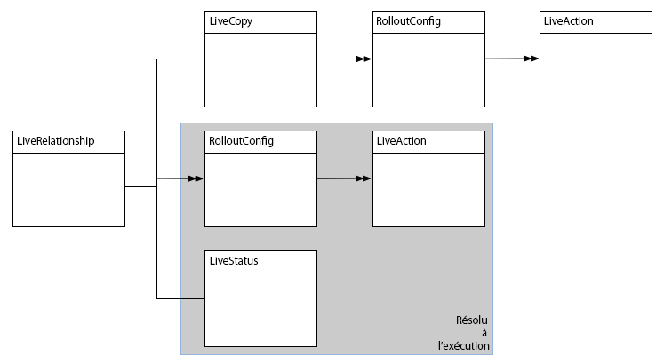
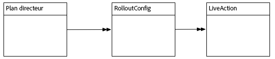
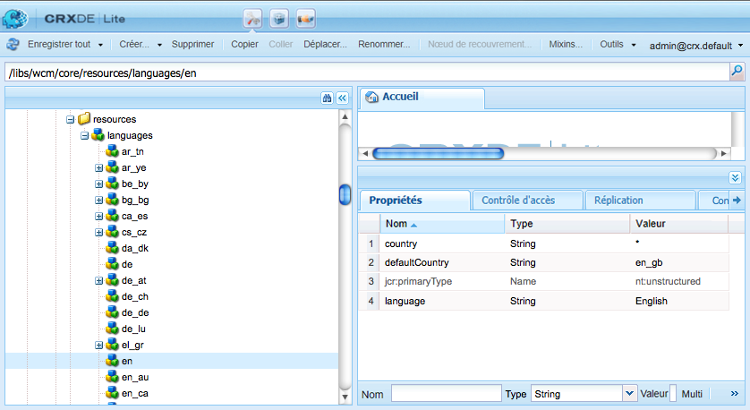

# Extension du Multi Site Manager{#extending-the-multi-site-manager}

Cette page vous explique comment étendre les fonctionnalités de Multi Site Manager :

* Découvrez les principaux membres de l’API Java de MSM.
* Créez une nouvelle action de synchronisation pouvant être utilisée dans une configuration de déploiement.
* Supprimez l’étape « Chapitres » dans l’assistant Créer un site.
* Modifiez la langue par défaut et les codes pays.

>[!NOTE]
>
>Lire cette page en lien avec [Réutilisation du contenu : Multi Site Manager](/help/sites-administering/msm.md).
>
>Les sections suivantes de la section Restructuration du référentiel de sites dans AEM 6.4 peuvent également présenter un intérêt :
>* [Configurations Blueprint de Multi-site Manager](https://docs.adobe.com/content/help/en/experience-manager-64/deploying/restructuring/sites-repository-restructuring-in-aem-6-4.html#multi-site-manager-blueprint-configurations)
>* [Configurations du déploiement de Multi-site Manager](https://docs.adobe.com/content/help/en/experience-manager-64/deploying/restructuring/sites-repository-restructuring-in-aem-6-4.html#multi-site-manager-rollout-configurations)


>[!CAUTION]
>
>Le Multi Site Manager et son API sont utilisés lors de la création d’un site Web. Ils sont donc destinés exclusivement à l’environnement de création.

## Vue d’ensemble de l’API Java {#overview-of-the-java-api}

La gestion de sites multiples comprend les modules suivants :

* [com.day.cq.wcm.msm.api](https://helpx.adobe.com/experience-manager/6-5/sites/developing/using/reference-materials/javadoc/com/day/cq/wcm/msm/api/package-frame.html)
* [com.day.cq.wcm.msm.commons](https://helpx.adobe.com/experience-manager/6-5/sites/developing/using/reference-materials/javadoc/com/day/cq/wcm/msm/commons/package-frame.html)

Les principaux objets de l’API MSM interagissent comme suit (voir aussi [Termes utilisés](/help/sites-administering/msm.md#terms-used)) :



* **`Blueprint`**

   A `Blueprint` (as in [blueprint configuration](/help/sites-administering/msm.md#source-blueprints-and-blueprint-configurations)) specifies the pages from which a live copy can inherit content.

   

   * The use of a blueprint configuration ( `Blueprint`) is optional, but:

      * Allows the author to use the **Rollout** option on the source (to (explicitly) push modifications to live copies that inherit from this source).
      * Permet à l’auteur d’utiliser **Créer un site**. L’utilisateur peut ainsi sélectionner facilement les langues et configurer la structure de la Live Copy.
      * Définit la configuration de déploiement par défaut pour toutes les Live Copy résultantes.

* **`LiveRelationship`** Le `LiveRelationship` spécifie la connexion (relation) entre une ressource de la branche de la copie dynamique et sa ressource source/prototype équivalente.

   * Les relations sont utilisées lors de la réalisation de l’héritage et du déploiement.
   * `LiveRelationship` les objets fournissent un accès (références) aux configurations de déploiement ( `RolloutConfig`), `LiveCopy`et `LiveStatus` aux objets liés à la relation.

   * For example, a live copy is created in `/content/copy/us` from the source/blueprint at `/content/we-retail/language-masters`. Les ressources `/content/we.retail/language-masters/en/jcr:content` et `/content/copy/us/en/jcr:content` forment une relation.

* **`LiveCopy`** `LiveCopy` contient les détails de configuration des relations ( `LiveRelationship`) entre les ressources de copie dynamique et leurs ressources source/plan directeur.

   * Use the `LiveCopy` class to access to the path of the page, the path of the source/blueprint page, the rollout configurations and whether child pages are also included in the `LiveCopy`.

   * A `LiveCopy` node is created each time **Create Site** or **Create Live Copy** is used.

* **`LiveStatus`**

   Les objets `LiveStatus` donnent accès à l’état d’exécution d’une `LiveRelationship`. Permet d’interroger l’état de synchronisation d’une Live Copy.

* **`LiveAction`**

   Une `LiveAction` est une action qui est exécutée sur chaque ressource impliquée dans le déploiement.

   * Les LiveAction sont générées uniquement par RolloutConfigs.

* **`LiveActionFactory`**

   Creates `LiveAction` objects given a `LiveAction` configuration. Les configurations sont stockées en tant que ressources dans le référentiel.

* **`RolloutConfig`** Le `RolloutConfig` contient une liste de `LiveActions`, à utiliser lors du déclenchement. The `LiveCopy` inherits the `RolloutConfig` and the result is present in the `LiveRelationship`.

   * La première configuration d&#39;une Live Copy utilise également un RolloutConfig (qui déclenche les LiveActions).

## Création d’une action de synchronisation {#creating-a-new-synchronization-action}

Créez des actions de synchronisation personnalisées à utiliser avec vos configurations de déploiement. Créez une action de synchronisation lorsque les actions [installées](/help/sites-administering/msm-sync.md#installed-synchronization-actions) ne répondent pas aux exigences spécifiques de votre application. Pour ce faire, créez deux classes :

* An implementation of the [ `com.day.cq.wcm.msm.api.LiveAction`](https://helpx.adobe.com/experience-manager/6-5/sites/developing/using/reference-materials/javadoc/com/day/cq/wcm/msm/api/LiveAction.html) interface that performs the action.
* Un composant OSGI qui implémente l’interface [`com.day.cq.wcm.msm.api.LiveActionFactory`](https://helpx.adobe.com/experience-manager/6-5/sites/developing/using/reference-materials/javadoc/com/day/cq/wcm/msm/api/LiveActionFactory.html) et crée des instances de votre classe `LiveAction`.

The `LiveActionFactory` creates instances of the `LiveAction` class for a given configuration:

* Les classes `LiveAction` incluent les méthodes suivantes :

   * `getName` : renvoie le nom de l’action qui sert à la désigner, par exemple, dans les configurations de déploiement.
   * `execute` : réalise les tâches de l’action.

* Les classes `LiveActionFactory` incluent les méthodes suivantes :

   * `LIVE_ACTION_NAME`: Champ contenant le nom du champ associé `LiveAction`. Ce nom doit coïncider avec la valeur renvoyée par la méthode `getName` de la classe `LiveAction`.

   * `createAction`: Crée une instance du `LiveAction`. Le paramètre facultatif `Resource` peut être utilisé pour fournir des informations de configuration.

   * `createsAction`: Renvoie le nom de l’élément associé `LiveAction`.

### Accès au nœud de configuration LiveAction {#accessing-the-liveaction-configuration-node}

Utilisez le nœud de configuration `LiveAction` dans le référentiel pour stocker les informations qui affectent le comportement d’exécution de l’instance `LiveAction`. Le nœud du référentiel qui stocke la configuration `LiveAction` est disponible pour l’objet `LiveActionFactory` lors de l’exécution. Par conséquent, vous pouvez ajouter des propriétés au nœud de configuration et les utiliser dans votre implémentation `LiveActionFactory` si nécessaire.

Par exemple, une `LiveAction` doit stocker le nom de l’auteur du plan directeur. Une propriété du nœud de configuration inclut le nom de la propriété de la page plan directeur qui stocke les informations. Lorsqu’elle est exécutée, la `LiveAction` récupère le nom de la propriété à partir de la configuration, puis obtient la valeur de la propriété.

The parameter of the ` [LiveActionFactory](https://helpx.adobe.com/experience-manager/6-5/sites/developing/using/reference-materials/javadoc/com/day/cq/wcm/msm/api/LiveActionFactory.html).createAction` method is a `Resource` object. Cet objet `Resource`  représente le nœud `cq:LiveSyncAction`   pour cette LiveAction dans la configuration du déploiement. Voir [Création d’une configuration de déploiement](/help/sites-administering/msm-sync.md#creating-a-rollout-configuration). Comme d’habitude, lorsque vous utilisez un nœud de configuration, vous devez l’adapter à un objet `ValueMap` :

```java
public LiveAction createAction(Resource resource) throws WCMException {
        ValueMap config;
        if (resource == null || resource.adaptTo(ValueMap.class) == null) {
            config = new ValueMapDecorator(Collections.<String, Object>emptyMap());
        } else {
            config = resource.adaptTo(ValueMap.class);
        }
        return new MyLiveAction(config, this);
}
```

### Accès aux nœuds cibles, aux nœuds sources et à la relation LiveRelationship {#accessing-target-nodes-source-nodes-and-the-liverelationship}

Les objets suivants sont fournis en tant que paramètres de la méthode `execute` de l’objet `LiveAction` :

* Un objet [`Resource` représentant la source de la Live Copy.](https://helpx.adobe.com/fr/experience-manager/6-5/sites/developing/using/reference-materials/javadoc/org/apache/sling/api/resource/Resource.html)
* Un objet `Resource` représentant la cible de la Live Copy.
* Objet [`LiveRelationship` pour la Live Copy.](https://helpx.adobe.com/experience-manager/6-5/sites/developing/using/reference-materials/javadoc/com/day/cq/wcm/msm/api/LiveRelationship.html)
* La valeur `autoSave` indique si votre `LiveAction` doit enregistrer les modifications apportées au référentiel.

* La valeur reset indique le mode de réinitialisation du déploiement.

À partir de ces objets, vous pouvez obtenir toutes les informations sur la `LiveCopy`. You can also use the `Resource` objects to obtain `ResourceResolver`, `Session`, and `Node` objects. Ces objets sont utiles pour manipuler le contenu du référentiel :

Dans la première ligne du code suivant, source est l’objet `Resource` de la page source :

```java
ResourceResolver resolver = source.getResourceResolver();
Session session = resolver.adaptTo(javax.jcr.Session.class);
Node sourcenode = source.adaptTo(javax.jcr.Node.class);
```

>[!NOTE]
>
>The `Resource` arguments may be `null` or `Resources` objects that do not adapt to `Node` objects, such as [ `NonExistingResource`](https://helpx.adobe.com/experience-manager/6-5/sites/developing/using/reference-materials/javadoc/org/apache/sling/api/resource/NonExistingResource.html) objects.

## Création d’une configuration de déploiement {#creating-a-new-rollout-configuration}

Créez une configuration de déploiement lorsque celles installées ne répondent pas aux exigences de votre application :

* [Créez la configuration de déploiement](#create-the-rollout-configuration).
* [Ajoutez des actions de synchronisation à la configuration de déploiement](#add-synchronization-actions-to-the-rollout-configuration).

La nouvelle configuration de déploiement est disponible quand vous définissez des configurations de déploiement sur une page Plan directeur ou Live Copy.

>[!NOTE]
>
>Voir aussi les [bonnes pratiques de personnalisation des déploiements](/help/sites-administering/msm-best-practices.md#customizing-rollouts).

### Créer la configuration du déploiement {#create-the-rollout-configuration}

Pour créer une configuration de déploiement :

1. Ouvrez CRXDE Lite ; par exemple :
   [http://localhost:4502/crx/de](http://localhost:4502/crx/de)

1. Accédez à :
   `/apps/msm/<your-project>/rolloutconfigs`

   >[!NOTE]
   >Il s&#39;agit de la version personnalisée de votre projet de :
   >`/libs/msm/wcm/rolloutconfigs`
   >Doit être créé s’il s’agit de votre première configuration.

   >[!NOTE]
   >
   >Vous ne devez rien modifier dans le chemin /libs.
   >En effet, le contenu de /libs est remplacé dès que vous mettez à niveau votre instance (et risque de l’être si vous appliquez un correctif ou un Feature Pack).
   >La méthode recommandée pour la configuration et d’autres modifications est la suivante :
   >* Recréez l’élément requis (c’est-à-dire tel qu’il existe dans /libs) sous /apps
   >* Le cas échéant, effectuez des modifications dans /apps.


1. Sous cette **section Créez** un noeud avec les propriétés suivantes :

   * **Nom**: Nom du noeud de la configuration de déploiement. md#installed-synchronization-actions), par exemple `contentCopy` ou `workflow`.
   * **Type** : `cq:RolloutConfig`

1. Ajoutez les propriétés suivantes à ce nœud :
   * **Nom** : `jcr:title`

      **Type** : `String`
      **Valeur**: Titre identifiant qui apparaîtra dans l’interface utilisateur.
   * **Nom** : `jcr:description`

      **Type** : `String`
      **Valeur**: Description facultative.
   * **Nom** : `cq:trigger`

      **Type** : `String`
      **Valeur**: Déclencheur [de](/help/sites-administering/msm-sync.md#rollout-triggers) déploiement à utiliser. Faites un choix parmi 
      * `rollout`
      * `modification`
      * `publish`
      * `deactivate`

1. Cliquez sur **Enregistrer tout**.

### Ajouter des actions de synchronisation à la configuration de déploiement {#add-synchronization-actions-to-the-rollout-configuration}

Les configurations de déploiement sont stockées sous le noeud [de configuration de](#create-the-rollout-configuration) déploiement que vous avez créé sous `/apps/msm/<your-project>/rolloutconfigs` le noeud.

Add child nodes of type `cq:LiveSyncAction` to add synchronization actions to the rollout configuration. L’ordre des nœuds d’action de synchronisation détermine l’ordre dans lequel les actions se produisent.

1. Toujours dans CRXDE Lite, sélectionnez votre noeud Configuration [](#create-the-rollout-configuration) de déploiement.

   Par exemple :
   `/apps/msm/myproject/rolloutconfigs/myrolloutconfig`

1. **Créez** un noeud avec les propriétés de noeud suivantes :

   * **Name** : nom de nœud de l’action de synchronisation.
The name must be the same as the **Action Name** in the table under [Synchronization Actions](/help/sites-administering/msm-sync.md#installed-synchronization-actions), for example `contentCopy` or `workflow`.
   * **Type** : `cq:LiveSyncAction`

1. Ajoutez et configurez autant de nœuds d’action de synchronisation que vous le souhaitez. Réorganisez les nœuds d’action afin que leur ordre corresponde à celui dans lequel vous souhaitez qu’ils se produisent. Le nœud d’action le plus haut se produit en premier.

## Création et utilisation d’une classe LiveActionFactory simple {#creating-and-using-a-simple-liveactionfactory-class}

Suivez les procédures de cette section pour développer une `LiveActionFactory` et l’utiliser dans une configuration de déploiement. Les procédures utilisent Maven et Eclipse pour développer et déployer la `LiveActionFactory` :

1. [Créez le projet maven](#create-the-maven-project) et importez-le dans Eclipse.
1. [Ajouter des dépendances](#add-dependencies-to-the-pom-file) au fichier POM.
1. [Implémentez l’interface `LiveActionFactory` ](#implement-liveactionfactory) et déployez le bundle OSGi.
1. [Créez la configuration de déploiement](#create-the-example-rollout-configuration).
1. [Créez la Live Copy](#create-the-live-copy).

Le projet Maven et le code source de la classe Java sont disponibles dans le référentiel Git public.

CODE SUR GITHUB

Vous pouvez trouver le code de cette page sur GitHub.

* [Open experience emanager-java-msmrollout project sur GitHub](https://github.com/Adobe-Marketing-Cloud/experiencemanager-java-msmrollout)
* Téléchargez le projet sous la forme d’[un fichier ZIP](https://github.com/Adobe-Marketing-Cloud/experiencemanager-java-msmrollout/archive/master.zip).

### Créer le projet Maven {#create-the-maven-project}

La procédure suivante requiert l’ajout préalable du profil adobe-public à votre fichier de paramètres Maven.

* Pour plus d’informations sur le profil adobe-public, voir [Obtention du module externe Maven de Content Package](/help/sites-developing/vlt-mavenplugin.md#obtaining-the-content-package-maven-plugin)
* Pour plus d’informations sur le fichier de paramètres Maven, reportez-vous à [Référence de paramètres](https://maven.apache.org/settings.html) Maven.

1. Ouvrez une session de terminal ou de ligne de commande et modifiez le répertoire de manière à ce qu’il pointe vers l’emplacement de création du projet.
1. Saisissez la commande suivante :

   ```xml
   mvn archetype:generate -DarchetypeGroupId=com.day.jcr.vault -DarchetypeArtifactId=multimodule-content-package-archetype -DarchetypeVersion=1.0.0 -DarchetypeRepository=adobe-public-releases
   ```

1. Spécifiez les valeurs suivantes à l’invite interactive :

   * `groupId`: `com.adobe.example.msm`
   * `artifactId`: `MyLiveActionFactory`
   * `version`: `1.0-SNAPSHOT`
   * `package`: `MyPackage`
   * `appsFolderName`: `myapp`
   * `artifactName`: `MyLiveActionFactory package`
   * `packageGroup`: `myPackages`

1. Lancez Eclipse et [importez le projet Maven](/help/sites-developing/howto-projects-eclipse.md#import-the-maven-project-into-eclipse).

### Ajouter des dépendances au fichier POM {#add-dependencies-to-the-pom-file}

Ajoutez des dépendances pour que le compilateur Eclipse puisse référencer les classes utilisées dans le code `LiveActionFactory`.

1. Depuis l’explorateur de projet Eclipse, ouvrez le fichier :

   `MyLiveActionFactory/pom.xml`

1. In the editor, click the `pom.xml` tab and locate the `project/dependencyManagement/dependencies` section.
1. Ajoutez le code XML suivant dans l’élément `dependencyManagement`, puis enregistrez le fichier.

   ```xml
    <dependency>
     <groupId>com.day.cq.wcm</groupId>
     <artifactId>cq-msm-api</artifactId>
     <version>5.6.2</version>
     <scope>provided</scope>
    </dependency>
    <dependency>
     <groupId>org.apache.sling</groupId>
     <artifactId>org.apache.sling.api</artifactId>
     <version>2.4.3-R1488084</version>
     <scope>provided</scope>
    </dependency>
    <dependency>
     <groupId>com.day.cq.wcm</groupId>
     <artifactId>cq-wcm-api</artifactId>
     <version>5.6.6</version>
     <scope>provided</scope>
    </dependency>
    <dependency>
     <groupId>org.apache.sling</groupId>
     <artifactId>org.apache.sling.commons.json</artifactId>
     <version>2.0.6</version>
     <scope>provided</scope>
    </dependency>
    <dependency>
     <groupId>com.day.cq</groupId>
     <artifactId>cq-commons</artifactId>
     <version>5.6.4</version>
     <scope>provided</scope>
    </dependency>
    <dependency>
     <groupId>org.apache.sling</groupId>
     <artifactId>org.apache.sling.jcr.jcr-wrapper</artifactId>
     <version>2.0.0</version>
     <scope>provided</scope>
    </dependency>
    <dependency>
     <groupId>com.day.cq</groupId>
     <artifactId>cq-commons</artifactId>
     <version>5.6.4</version>
     <scope>provided</scope>
    </dependency>
   ```

1. Ouvrez le fichier POM pour le bundle depuis **Project Explorer** à l’adresse `MyLiveActionFactory-bundle/pom.xml`.
1. Dans l’éditeur, cliquez sur l’onglet `pom.xml` et localisez la section project/dependencies. Ajoutez le code XML suivant dans l’élément dependencies, puis enregistrez le fichier :

   ```xml
    <dependency>
     <groupId>com.day.cq.wcm</groupId>
     <artifactId>cq-msm-api</artifactId>
    </dependency>
    <dependency>
     <groupId>org.apache.sling</groupId>
     <artifactId>org.apache.sling.api</artifactId>
    </dependency>
    <dependency>
     <groupId>com.day.cq.wcm</groupId>
     <artifactId>cq-wcm-api</artifactId>
    </dependency>
    <dependency>
     <groupId>org.apache.sling</groupId>
     <artifactId>org.apache.sling.commons.json</artifactId>
    </dependency>
    <dependency>
     <groupId>com.day.cq</groupId>
     <artifactId>cq-commons</artifactId>
    </dependency>
    <dependency>
     <groupId>org.apache.sling</groupId>
     <artifactId>org.apache.sling.jcr.jcr-wrapper</artifactId>
    </dependency>
    <dependency>
     <groupId>com.day.cq</groupId>
     <artifactId>cq-commons</artifactId>
    </dependency>
   ```

### Implémenter LiveActionFactory {#implement-liveactionfactory}

La classe `LiveActionFactory` suivante implémente une `LiveAction` qui enregistre les messages sur les pages source et cible et copie la propriété `cq:lastModifiedBy` du nœud source vers le nœud cible. The name of the live action is `exampleLiveAction`.

1. In the Eclipse Project Explorer, right-click the `MyLiveActionFactory-bundle/src/main/java/com.adobe.example.msm` package and click **New** > **Class**. Comme **nom**, entrez `ExampleLiveActionFactory`, puis cliquez sur **Terminer**.
1. Ouvrez le fichier `ExampleLiveActionFactory.java`, remplacez le contenu par le code suivant et enregistrez le fichier.

   ```java
   package com.adobe.example.msm;
   
   import java.util.Collections;
   
   import org.apache.felix.scr.annotations.Component;
   import org.apache.felix.scr.annotations.Property;
   import org.apache.felix.scr.annotations.Service;
   import org.apache.sling.api.resource.Resource;
   import org.apache.sling.api.resource.ResourceResolver;
   import org.apache.sling.api.resource.ValueMap;
   import org.apache.sling.api.wrappers.ValueMapDecorator;
   import org.apache.sling.commons.json.io.JSONWriter;
   import org.apache.sling.commons.json.JSONException;
   
   import org.slf4j.Logger;
   import org.slf4j.LoggerFactory;
   
   import javax.jcr.Node;
   import javax.jcr.RepositoryException;
   import javax.jcr.Session;
   
   import com.day.cq.wcm.msm.api.ActionConfig;
   import com.day.cq.wcm.msm.api.LiveAction;
   import com.day.cq.wcm.msm.api.LiveActionFactory;
   import com.day.cq.wcm.msm.api.LiveRelationship;
   import com.day.cq.wcm.api.WCMException;
   
   @Component(metatype = false)
   @Service
   public class ExampleLiveActionFactory implements LiveActionFactory<LiveAction> {
    @Property(value="exampleLiveAction")
    static final String actionname = LiveActionFactory.LIVE_ACTION_NAME;
   
    public LiveAction createAction(Resource config) {
     ValueMap configs;
     /* Adapt the config resource to a ValueMap */
           if (config == null || config.adaptTo(ValueMap.class) == null) {
               configs = new ValueMapDecorator(Collections.<String, Object>emptyMap());
           } else {
               configs = config.adaptTo(ValueMap.class);
           }
   
     return new ExampleLiveAction(actionname, configs);
    }
    public String createsAction() {
     return actionname;
    }
    /************* LiveAction ****************/
    private static class ExampleLiveAction implements LiveAction {
     private String name;
     private ValueMap configs;
     private static final Logger log = LoggerFactory.getLogger(ExampleLiveAction.class);
   
     public ExampleLiveAction(String nm, ValueMap config){
      name = nm;
      configs = config;
     }
   
     public void execute(Resource source, Resource target,
       LiveRelationship liverel, boolean autoSave, boolean isResetRollout)
         throws WCMException {
   
      String lastMod = null;
   
      log.info(" *** Executing ExampleLiveAction *** ");
   
      /* Determine if the LiveAction is configured to copy the cq:lastModifiedBy property */
      if ((Boolean) configs.get("repLastModBy")){
   
       /* get the source's cq:lastModifiedBy property */
       if (source != null && source.adaptTo(Node.class) !=  null){
        ValueMap sourcevm = source.adaptTo(ValueMap.class);
        lastMod = sourcevm.get(com.day.cq.wcm.msm.api.MSMNameConstants.PN_PAGE_LAST_MOD_BY, String.class);
       }
   
       /* set the target node's la-lastModifiedBy property */
       Session session = null;
       if (target != null && target.adaptTo(Node.class) !=  null){
        ResourceResolver resolver = target.getResourceResolver();
        session = resolver.adaptTo(javax.jcr.Session.class);
        Node targetNode;
        try{
         targetNode=target.adaptTo(javax.jcr.Node.class);
         targetNode.setProperty("la-lastModifiedBy", lastMod);
         log.info(" *** Target node lastModifiedBy property updated: {} ***",lastMod);
        }catch(Exception e){
         log.error(e.getMessage());
        }
       }
       if(autoSave){
        try {
         session.save();
        } catch (Exception e) {
         try {
          session.refresh(true);
         } catch (RepositoryException e1) {
          e1.printStackTrace();
         }
         e.printStackTrace();
        }
       }
      }
     }
     public String getName() {
      return name;
     }
   
     /************* Deprecated *************/
     @Deprecated
     public void execute(ResourceResolver arg0, LiveRelationship arg1,
       ActionConfig arg2, boolean arg3) throws WCMException {
     }
     @Deprecated
     public void execute(ResourceResolver arg0, LiveRelationship arg1,
       ActionConfig arg2, boolean arg3, boolean arg4)
         throws WCMException {
     }
     @Deprecated
     public String getParameterName() {
      return null;
     }
     @Deprecated
     public String[] getPropertiesNames() {
      return null;
     }
     @Deprecated
     public int getRank() {
      return 0;
     }
     @Deprecated
     public String getTitle() {
      return null;
     }
     @Deprecated
     public void write(JSONWriter arg0) throws JSONException {
     }
    }
   }
   ```

1. A l’aide du terminal ou de la session de commande, remplacez le répertoire par le répertoire `MyLiveActionFactory` (répertoire du projet Maven). Ensuite, entrez la commande suivante :

   ```shell
   mvn -PautoInstallPackage clean install
   ```

   Le fichier AEM `error.log` doit indiquer que le bundle est démarré.

   For example, [https://localhost:4502/system/console/status-slinglogs](https://localhost:4502/system/console/status-slinglogs).

   ```xml
   13.08.2013 14:34:55.450 *INFO* [OsgiInstallerImpl] com.adobe.example.msm.MyLiveActionFactory-bundle BundleEvent RESOLVED
   13.08.2013 14:34:55.451 *INFO* [OsgiInstallerImpl] com.adobe.example.msm.MyLiveActionFactory-bundle BundleEvent STARTING
   13.08.2013 14:34:55.451 *INFO* [OsgiInstallerImpl] com.adobe.example.msm.MyLiveActionFactory-bundle BundleEvent STARTED
   13.08.2013 14:34:55.453 *INFO* [OsgiInstallerImpl] com.adobe.example.msm.MyLiveActionFactory-bundle Service [com.adobe.example.msm.ExampleLiveActionFactory,2188] ServiceEvent REGISTERED
   13.08.2013 14:34:55.454 *INFO* [OsgiInstallerImpl] org.apache.sling.audit.osgi.installer Started bundle com.adobe.example.msm.MyLiveActionFactory-bundle [316]
   ```

### Créer la configuration du déploiement exemple {#create-the-example-rollout-configuration}

Créez la configuration de déploiement MSM qui utilise la `LiveActionFactory` que vous avez créée :

1. Créez une [configuration de déploiement selon la procédure standard](/help/sites-administering/msm-sync.md#creating-a-rollout-configuration) et à l’aide des propriétés :

   * **Titre** : Exemple de configuration de déploiement
   * **Nom** : examplerolloutconfig
   * **cq:trigger**: `publish`

### Ajouter la LiveAction à l’exemple de configuration de déploiement {#add-the-live-action-to-the-example-rollout-configuration}

Configure the rollout configuration that you created in the previous procedure so that it uses the `ExampleLiveActionFactory` class.

1. Open CRXDE Lite; for example, [https://localhost:4502/crx/de](https://localhost:4502/crx/de).
1. Create the following node under `/apps/msm/rolloutconfigs/examplerolloutconfig/jcr:content`:

   * **Nom** : `exampleLiveAction`
   * **Type** : `cq:LiveSyncAction`

1. Cliquez sur **Enregistrer tout**.
1. Sélectionnez le nœud `exampleLiveAction` et ajoutez la propriété suivante :

   * **Nom** : `repLastModBy`
   * **Type** : `Boolean`
   * **Valeur**: `true`

   Cette propriété indique à la classe `ExampleLiveAction` que la propriété `cq:LastModifiedBy` doit être répliquée de la source vers le nœud cible.

1. Cliquez sur **Enregistrer tout**.

### Créer la Live Copy {#create-the-live-copy}

[Créez une Live Copy](/help/sites-administering/msm-livecopy.md#creating-a-live-copy-of-a-page) de la branche English/Products du site de référence We.Retail en utilisant votre configuration de déploiement :

* **Source**: `/content/we-retail/language-masters/en/products`

* **Configuration du déploiement** : Exemple de configuration de déploiement

Activez la page **Products** (anglais) de la branche source et observez les messages de journalisation générés par la classe `LiveAction` :

```xml
16.08.2013 10:53:33.055 *INFO* [Thread-444535] com.adobe.example.msm.ExampleLiveActionFactory$ExampleLiveAction  ***ExampleLiveAction has been executed.***
16.08.2013 10:53:33.055 *INFO* [Thread-444535] com.adobe.example.msm.ExampleLiveActionFactory$ExampleLiveAction  ***Target node lastModifiedBy property updated: admin ***
```

<!--
## Removing the Chapters Step in the Create Site Wizard {#removing-the-chapters-step-in-the-create-site-wizard}

In some cases, the **Chapters** selection is not required in the create site wizard (only the **Languages** selection is required). To remove this step in the default We.Retail English blueprint:

1. In CRX Explorer, remove the node:
   `/etc/blueprints/weretail-english/jcr:content/dialog/items/tabs/items/tab_chap`.

1. Navigate to `/libs/wcm/msm/templates/blueprint/defaults/livecopy_tab/items` and create a new node:

    1. **Name** = `chapters`; **Type** = `cq:Widget`.

1. Add following properties to the new node:

    1. **Name** = `name`; **Type** = `String`; **Value** = `msm:chapterPages`

    1. **Name** = `value`; **Type** = `String`; **Value** = `all`

    1. **Name** = `xtype`; **Type** = `String`; **Value** = `hidden`
-->

## Modification des noms de langue et des pays par défaut {#changing-language-names-and-default-countries}

AEM utilise un ensemble de codes de langue et de pays par défaut.

* Le code de langue par défaut est le code à deux lettres en minuscules tel que défini par ISO-639-1.
* Le code de pays par défaut est le code à deux lettres, en minuscules ou en majuscules, tel que défini par ISO 3166.

MSM utilise une liste stockée de codes de langue et de pays pour déterminer le nom du pays associé au nom de la version linguistique de votre page. Vous pouvez modifier les aspects suivants de la liste si nécessaire :

* Titres des langues
* Noms des pays
* Default countries for languges (for codes such as `en`, `de`, amongst others)

The language list is stored below the `/libs/wcm/core/resources/languages` node. Chaque nœud enfant représente une langue ou un code langue-pays :

* The name of the node is the languge code (such as `en` or `de`), or the language_country code (such as `en_us` or `de_ch`).

* La propriété `language` du nœud stocke le nom complet de la langue pour le code.
* La propriété `country` du nœud stocke le nom complet du pays pour le code.
* When the node name consists only of a language code (such as `en`), the country property is `*`, and an additional `defaultCountry` property stores the code of the language-country to indicate the country to use.



Pour modifier les langues :

1. Open CRXDE Lite in your web browser; for example, [https://localhost:4502/crx/de](https://localhost:4502/crx/de)
1. Select the `/apps` folder and click **Create**, then **Create Folder.**

   Name the new folder `wcm`.

1. Repeat the previous step to create the `/apps/wcm/core` folder tree. Create a node of type `sling:Folder` in `core` called `resources`. <!--  -->

1. Right-click the `/libs/wcm/core/resources/languages` node and click **Copy**.
1. Right-click the `/apps/wcm/core/resources` folder and click **Paste**. Modifiez les nœuds enfants selon les besoins.
1. Cliquez sur **Enregistrer tout**.
1. Cliquez sur **Outils**, **Opérations** puis **Console Web**. Depuis cette console, cliquez sur **OSGi**, puis sur **Configuration**.
1. Locate and click **Day CQ WCM Language Manager**, and change the value of **Language List** to `/apps/wcm/core/resources/languages`, then click **Save**.

   

## Configuration des verrous MSM sur les propriétés de la page (IU tactile) {#configuring-msm-locks-on-page-properties-touch-enabled-ui}

Lors de la création d’une propriété de page personnalisée, il faut parfois déterminer si la nouvelle propriété doit pouvoir être déployée sur des Live Copy.

Par exemple, si deux nouvelles propriétés de page sont ajoutées :

* Contact Email :

   * Cette propriété n’a pas besoin d’être déployée, car elle sera différente dans chaque pays (ou marque, etc.).

* Key Visual Style :

   * Le projet exige que cette propriété soit déployée car elle est (généralement) commune à tous les pays (ou marques, etc.).

Ensuite, vous devez vous assurer que :

* Contact Email :

   * Est exclu des propriétés déployées. Voir [Exclusion de propriétés et de types de nœuds de la synchronisation](/help/sites-administering/msm-sync.md#excluding-properties-and-node-types-from-synchronization).

* Key Visual Style :

   * Assurez-vous que vous n’êtes pas autorisé à modifier cette propriété dans l’IU tactile sauf si l’héritage est annulé et que vous pouvez rétablir l’héritage ; ceci est contrôlé en cliquant sur les liens chain/broken-chain qui s’activent/se désactivent pour indiquer l’état de la connexion.

Le fait qu’une propriété de page puisse être déployée et, par conséquent, soumise à l’annulation/au rétablissement de l’héritage lors de sa modification, est contrôlé par la propriété de la boîte de dialogue :

* `cq-msm-lockable`

   * s’applique aux éléments d’une boîte de dialogue de l’IU tactile
   * crée le symbole de chaînage dans la boîte de dialogue 
   * n’autorise la modification que si l’héritage est annulé (le chaînage est rompu)
   * s&#39;applique uniquement au premier niveau enfant de la ressource
   * **Type** : `String`

   * **Valeur**: détient le nom du bien à l&#39;étude (et est comparable à la valeur du bien `name`; par exemple, voir
      `/libs/foundation/components/page/cq:dialog/content/items/tabs/items/basic/items/column/items/title/items/title`

Lorsque `cq-msm-lockable` a été défini, la rupture/le verrouillage de la chaîne interagit avec MSM de la façon suivante :

* if the value of `cq-msm-lockable` is:

   * **Relatif** (par ex. `myProperty` ou `./myProperty`)

      * it will add and remove the property from `cq:propertyInheritanceCancelled`.
   * **Absolu** (p. ex. `/image`)

      * breaking the chain will cancel inheritance by adding the `cq:LiveSyncCancelled` mixin to `./image` and setting `cq:isCancelledForChildren` to `true`.

      * la fermeture de la chaîne rétablit l’héritage.


>[!NOTE]
>
>`cq-msm-lockable` s’applique au premier niveau enfant de la ressource à modifier et ne fonctionne pas sur un ancêtre plus profond, que la valeur soit définie comme absolue ou relative.

>[!NOTE]
>
>Lorsque vous réactivez l’héritage, la propriété de page de la Live Copy n’est pas automatiquement synchronisée avec la propriété source. Vous pouvez demander manuellement une synchronisation si cela est nécessaire.
