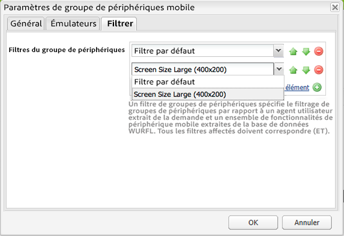
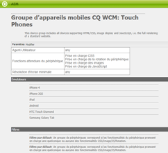

# Création de filtres de groupe d’appareils{#creating-device-group-filters}

>[!NOTE]
>
>Adobe recommande d’utiliser l’éditeur d’application d’une seule page (SPA) pour les projets nécessitant un rendu côté client basé sur la structure SPA (par exemple, React). [En savoir plus](/help/sites-developing/spa-overview.md).

Créez un filtre de groupe d’appareils pour définir un ensemble d’exigences en termes de caractéristiques d’appareil. Créez autant de filtres que nécessaire pour cibler les groupes de caractéristiques d’appareils nécessaires.

Concevez vos filtres de sorte à pouvoir utiliser des combinaisons pour définir des groupes de caractéristiques. Généralement, certaines caractéristiques sont communes à différents groupes d’appareils. Par conséquent, vous pouvez utiliser certains filtres avec plusieurs définitions de groupe d’appareils.

Après avoir créé un filtre, vous pouvez l’utiliser dans la [configuration du groupe](/help/sites-developing/mobile.md#creating-a-device-group).

## La classe Java de filtre {#the-filter-java-class}

Un filtre de groupe d’appareils est un composant OSGi qui implémente l’interface [com.day.cq.wcm.mobile.api.device.DeviceGroupFilter](https://helpx.adobe.com/experience-manager/6-5/sites/developing/using/reference-materials/javadoc/index.html?com/day/cq/wcm/mobile/api/device/DeviceGroupFilter.html). Une fois déployée, la classe d’implémentation fournit un service de filtrage disponible pour les configurations de groupes d’appareils.

La solution décrite dans cet article utilise le module externe Apache Felix Maven SCR pour faciliter le développement du composant et du service. Par conséquent, l’exemple de classe Java utilise les annotations `@Component`et `@Service`. La classe comporte la structure suivante :

```java
package com.adobe.example.myapp;

import java.util.Map;

import com.day.cq.wcm.mobile.api.device.DeviceGroup;
import com.day.cq.wcm.mobile.api.device.DeviceGroupFilter;

import org.apache.felix.scr.annotations.Component;
import org.apache.felix.scr.annotations.Service;

@Component(metatype = false)
@Service
public class myDeviceGroupFilter implements DeviceGroupFilter {

       public String getDescription() {
  return null;
 }

 public String getTitle() {
  return null;
 }

 public boolean matches(DeviceGroup arg0, String arg1, Map arg2) {
  return false;
 }

}
```

Vous devez fournir le code pour les méthodes suivantes :

* `getDescription`: Renvoie la description du filtre. La description apparaît dans la boîte de dialogue de configuration du groupe d’appareils.
* `getTitle` : renvoie le nom du filtre. Le nom apparaît lors de la sélection des filtres pour le groupe d’appareils.
* `matches` : détermine si l’appareil possède les caractéristiques demandées.

### Saisie du nom et de la description du filtre {#providing-the-filter-name-and-description}

Les méthodes `getTitle` et `getDescription`renvoient le nom et la description du filtre, respectivement. Le code suivant illustre la mise en œuvre la plus simple :

```java
public String getDescription() {
    return "An example device group filter";
}

public String getTitle() {
 return "myFilter";
}
```

Le codage en dur du nom et du texte descriptif est suffisant pour les environnements de création unilingues. Pensez à externaliser les chaînes dans le cas d’une utilisation multilingue ou à activer le changement de chaîne sans recompiler le code source.

### Évaluation par rapport aux critères de filtrage  {#evaluating-against-filter-criteria}

La fonction `matches` renvoie la valeur `true` si les caractéristiques de l’appareil satisfont à tous les critères de filtre. Évaluez les informations fournies dans les arguments de méthode pour déterminer si l’appareil appartient au groupe. Les valeurs suivantes sont fournies en tant qu’arguments : 

* Un objet DeviceGroup
* Le nom de l’agent utilisateur
* Un objet Map qui contient les caractéristiques de l’appareil. Les clés Map sont les noms des caractéristiques WURFL™ et les valeurs sont les valeurs correspondantes issues de la base de données WURFL™.

L’interface [com.day.cq.wcm.mobile.api.devicespecs.DeviceSpecsConstants](https://helpx.adobe.com/experience-manager/6-5/sites/developing/using/reference-materials/javadoc/index.html?com/day/cq/wcm/mobile/api/device/DeviceGroupFilter.html) contient un sous-ensemble des noms des caractéristiques WURFL dans les champs statiques. Utilisez ces constantes de champ en tant que clés lors de la récupération de valeurs à partir du mappage des caractéristiques de l’appareil.

Par exemple, l’exemple de code suivant détermine si l’appareil prend en charge CSS :

```xml
boolean cssSupport = true;
cssSupport = NumberUtils.toInt(capabilities.get(DeviceSpecsConstants.DSPEC_XHTML_SUPPORT_LEVEL)) > 1;
```

Le package `org.apache.commons.lang.math` fournit la classe `NumberUtils`.

>[!NOTE]
>
>Assurez-vous que la base de données WURFL™ déployée sur AEM inclut les caractéristiques que vous utilisez comme critères de filtre. (Voir [Détection d’appareils](/help/sites-developing/mobile.md#server-side-device-detection).)

### Exemple de filtre pour la taille de l’écran {#example-filter-for-screen-size}

L’exemple d’implémentation de DeviceGroupFilter suivant détermine si la taille physique de l’appareil répond aux exigences minimales. Ce filtre est destiné à ajouter un niveau de granularité au groupe d’appareils tactiles. La taille des boutons dans l’interface utilisateur de l’application doit être identique quelle que soit la taille de l’écran physique. La taille des autres éléments, tels que le texte, peut varier. Le filtre permet la sélection dynamique d’un CSS particulier qui contrôle la taille des éléments de l’interface utilisateur.

Ce filtre applique des critères de taille aux noms de propriété `physical_screen_height` et `physical_screen_width` WURFL™.

```java
package com.adobe.example.myapp;

import java.util.Map;

import com.day.cq.wcm.mobile.api.device.DeviceGroup;
import com.day.cq.wcm.mobile.api.device.DeviceGroupFilter;

import org.apache.commons.lang.math.NumberUtils;
import org.apache.felix.scr.annotations.Component;
import org.apache.felix.scr.annotations.Service;

@Component(metatype = false)
@Service
@SuppressWarnings("unused")
public class ScreenSizeLarge implements DeviceGroupFilter {
    private int len=400;
    private int wid=200;
    public String getDescription() {

        return "Requires the physical size of the screen to have minimum dimensions " + len + "x" + wid+".";
    }

    public String getTitle() {
        return "Screen Size Large ("+len + "x" + wid+")";
    }

    public boolean matches(DeviceGroup deviceGroup, String userAgent,
            Map<String, String> deviceCapabilities) {

        boolean longEnough=true;
        boolean wideEnough=false;
        int dimension1=NumberUtils.toInt(deviceCapabilities.get("physical_screen_height"));
        int dimension2=NumberUtils.toInt(deviceCapabilities.get("physical_screen_width"));
        if(dimension1>dimension2){
            longEnough=dimension1>=len;
            wideEnough=dimension2>=wid;
        }else{
            longEnough=dimension2>=len;
            wideEnough=dimension1>=wid;
        }

        return longEnough && wideEnough;
    }
}
```

La valeur de chaîne renvoyée par la méthode getTitle dans la liste déroulante des propriétés du groupe d’appareils.



Les valeurs de chaîne renvoyées par les méthodes getTitle et getDescription sont incluses au bas de la page récapitulative du groupe d’appareils.



### Le fichier Maven POM {#the-maven-pom-file}

Le code POM suivant est utile si vous utilisez Maven pour créer vos applications. Le POM fait référence à plusieurs dépendances et modules externes requis.

**Modules externes :**

* Module externe Apache Maven Compiler : compile les classes Java à partir du code source.
* Module externe Apache Felix Maven Bundle : crée le bundle et le manifeste
* Module externe Apache Felix Maven SCR : crée le fichier descripteur de composant et configure l’en-tête du manifeste du composant de service.

**Dépendances:**

* `cq-wcm-mobile-api-5.5.2.jar`: Fournit les interfaces DeviceGroup et DeviceGroupFilter.

* `org.apache.felix.scr.annotations.jar` :   : fournit les annotations de composants et de services.

Les interfaces DeviceGroup et DeviceGroupFilter sont incluses dans le bundle de l’API Day Communique 5 WCM Mobile. Les annotations Felix sont incluses dans le lot Apache Felix Declarative Services. Vous pouvez obtenir ce fichier JAR à partir du référentiel Adobe public.

Au moment de la création, la version 5.5.2 est la version du bundle WCM Mobile API qui figure dans la dernière version d’AEM. Utilisez Adobe Web Console ([https://localhost:4502/system/console/bundles](https://localhost:4502/system/console/bundles)) pour vous assurer qu’il s’agit de la version du lot déployée dans votre environnement.

**POM :**(votre code POM utilisera un autre groupId et une autre version.) 

```xml
<project xmlns="https://maven.apache.org/POM/4.0.0"
        xmlns:xsi="https://www.w3.org/2001/XMLSchema-instance"
        xsi:schemaLocation="https://maven.apache.org/POM/4.0.0 https://maven.apache.org/xsd/maven-4.0.0.xsd">
      <modelVersion>4.0.0</modelVersion>
      <groupId>com.adobe.example.myapp</groupId>
      <artifactId>devicefilter</artifactId>
      <version>0.0.1-SNAPSHOT</version>
      <name>my app device filter</name>
      <url>https://dev.day.com/docs/en/cq/current.html</url>
  <packaging>bundle</packaging>
<build>
    <plugins>
        <plugin>
            <groupId>org.apache.maven.plugins</groupId>
            <artifactId>maven-compiler-plugin</artifactId>
            <configuration>
                <source>1.5</source>
                <target>1.5</target>
            </configuration>
        </plugin>
        <plugin>
            <groupId>org.apache.felix</groupId>
            <artifactId>maven-scr-plugin</artifactId>
            <executions>
                  <execution>
                    <id>generate-scr-scrdescriptor</id>
                    <goals>
                          <goal>scr</goal>
                    </goals>
                  </execution>
            </executions>
          </plugin>
        <plugin>
            <groupId>org.apache.felix</groupId>
            <artifactId>maven-bundle-plugin</artifactId>
            <version>1.4.3</version>
            <extensions>true</extensions>
            <configuration>
                <instructions>
                    <Export-Package>com.adobe.example.myapp.*;version=${project.version}</Export-Package>
                </instructions>
            </configuration>
        </plugin>
    </plugins>
</build>
<dependencies>
     <dependency>
         <groupId>com.day.cq.wcm</groupId>
         <artifactId>cq-wcm-mobile-api</artifactId>
         <version>5.5.2</version>
         <scope>provided</scope>
     </dependency>
     <dependency>
        <groupId>org.apache.felix</groupId>
        <artifactId>org.apache.felix.scr.annotations</artifactId>
        <version>1.6.0</version>
        <scope>compile</scope>
    </dependency>
</dependencies>
</project>
```

Ajoutez le profil que la section [Obtention du plugin Maven pour les modules de contenu](/help/sites-developing/vlt-mavenplugin.md) fournit à votre fichier de paramètres maven pour utiliser le référentiel Adobe public.
