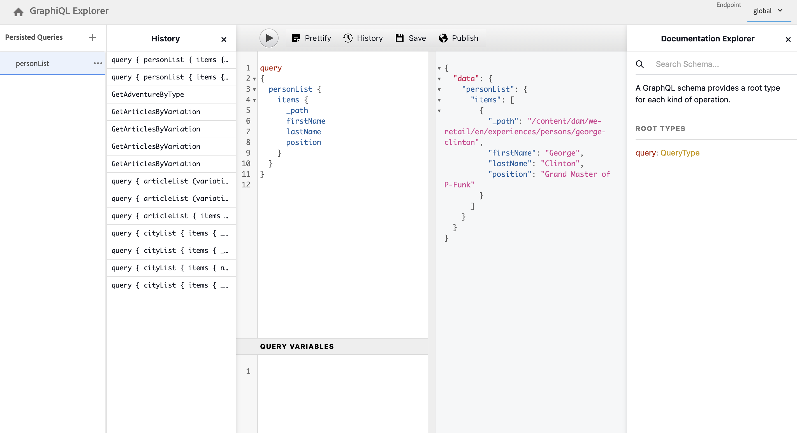

# Guide de démarrage rapide pour l’accès et la diffusion de fragments de contenu découplés {#accessing-delivering-content-fragments}

Découvrez comment utiliser l’API AEM Assets REST pour gérer les fragments de contenu et l’API GraphQL pour la diffusion de contenu de fragments de contenu en mode découplé.

## En quoi consistent les API REST GraphQL et Assets ? {#what-are-the-apis}

[Maintenant que vous avez créé des fragments de contenu](create-content-fragment.md), vous pouvez utiliser les API d’AEM pour une diffusion découplée.

* [L’API GraphQL](/help/sites-developing/headless/graphql-api/graphql-api-content-fragments.md) permet de créer des requêtes d’accès et de diffusion de fragments de contenu.
   * Pour l’utiliser, les [points d’entrée doivent être définis et activés dans AEM](/help/sites-developing/headless/graphql-api/graphql-endpoint.md#enabling-graphql-endpoint), et si nécessaire, l’[interface GraphQL doit être installée](/help/sites-developing/headless/graphql-api/graphql-api-content-fragments.md#installing-graphiql-interface).
* [L’API REST Assets](/help/assets/assets-api-content-fragments.md) permet de créer et de modifier des fragments de contenu (et d’autres ressources).

Le reste de ce guide porte sur l’accès à GraphQL et la diffusion de fragments de contenu.

## Comment diffuser un fragment de contenu avec GraphQL {#how-to-deliver-a-content-fragment}

Les architectes d’informations doivent concevoir des requêtes pour leurs points d’entrée de canal afin de diffuser du contenu. Considérez ces requêtes une seule fois par point d’entrée et par modèle. Pour ce guide de démarrage, créez-en un seul.

1. Connectez-vous à AEM et accédez à l’[interface GraphiQL](/help/sites-developing/headless/graphql-api/graphiql-ide.md) :
   * Par exemple : `http://<host>:<port>/aem/graphiql.html`.

1. GraphiQL est un requêteur intégré au navigateur pour GraphQL. Vous pouvez l’utiliser pour créer des requêtes permettant de récupérer des fragments de contenu afin de les diffuser de manière découplée en mode JSON.
   * Le volet de gauche permet de construire votre requête.
   * Le volet de droite affiche les résultats.
   * Le requêteur comprend la saisie du code et des touches d’accès rapide pour exécuter facilement la requête.
     

1. En supposant que le modèle que vous avez créé s’appelle `person`, avec les champs `firstName`, `lastName` et `position`, vous pouvez créer une requête simple pour récupérer le contenu du fragment de contenu.

   ```text
   query 
   {
     personList {
       items {
         _path
         firstName
         lastName
         position
       }
     }
   }
   ```

1. Entrez la requête dans le volet de gauche.
<!--
   
-->

1. Cliquez sur le bouton **Exécuter la requête** (flèche de droite) ou utilisez le raccourci `Ctrl-Enter` pour faire apparaître les résultats sous la forme JSON dans le volet de droite.
   

1. Cliquez sur :
   * **Docs** en haut à droite de la page pour afficher la documentation contextuelle afin de vous aider à créer vos requêtes adaptées à vos propres modèles.
   * **Histoire** dans la barre d’outils supérieure pour afficher les requêtes précédentes.
   * Cliquez sur **Enregistrer sous** et **Enregistrer** pour enregistrer vos requêtes, après quoi vous pouvez les répertorier et les récupérer à partir du panneau **Requêtes persistantes** et de l’**instance de publication**.
     

GraphQL permet d’utiliser des requêtes structurées qui peuvent cibler non seulement des ensembles de données spécifiques ou des objets de données individuels, mais également fournir des éléments spécifiques des objets, des résultats imbriqués, une prise en charge des variables de requête, et bien plus encore.

GraphQL peut éviter les demandes d’API itératives et la sur-diffusion. En revanche, il permet de diffuser en bloc simplement ce qui est nécessaire pour le rendu en réponse à une seule requête d’API. Le fichier JSON produit peut être utilisé pour diffuser des données vers d’autres sites ou applications.

## Étapes suivantes {#next-steps}

C’est terminé ! Vous possédez maintenant une compréhension de base de la gestion de contenu découplée dans AEM. Bien entendu, il existe beaucoup d’autres ressources que vous pouvez approfondir pour mieux comprendre les fonctionnalités disponibles.

* **[Explorateur de configurations](create-configuration.md)** – Pour plus d’informations sur l’Explorateur de configurations AEM
* **[Fragments de contenu](/help/assets/content-fragments/content-fragments.md)** – Pour plus d’informations sur la création et la gestion de fragments de contenu
* **[IDE GraphiQL](/help/sites-developing/headless/graphql-api/graphiql-ide.md)** pour plus d’informations sur l’utilisation de l’IDE GraphiQL
* **[Requêtes persistantes](/help/sites-developing/headless/graphql-api/persisted-queries.md)** pour plus d’informations sur les requêtes persistantes
* **[Prise en charge des fragments de contenu dans l’API HTTP AEM Assets](/help/assets/assets-api-content-fragments.md)** – Pour plus d’informations sur l’accès direct au contenu AEM via l’API HTTP, via des opérations CRUD (création, lecture, mise à jour, suppression)
* **[API GraphQL](/help/sites-developing/headless/graphql-api/graphql-api-content-fragments.md)** – Pour plus d’informations sur la diffusion découplée de fragments de contenu
