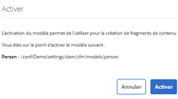

# Guide de démarrage rapide sur la création de modèles de fragments de contenu découplés {#creating-content-fragment-models}

Définissez la structure du contenu que vous allez créer et diffuser en utilisant les fonctionnalités découplées d’Adobe Experience Manager (AEM) à l’aide des modèles de fragment de contenu.

## Que sont les modèles de fragments de contenu ? {#what-are-content-fragment-models}

[Maintenant que vous avez créé une configuration,](create-configuration.md) vous pouvez l’utiliser pour créer des modèles de fragments de contenu.

Les modèles de fragment de contenu définissent la structure des données et du contenu que vous créez et gérez dans AEM. Il s’agit en quelque sorte du squelette de votre contenu. Lorsque vous choisissez de créer du contenu, vos auteurs choisissent parmi les modèles de fragment de contenu que vous définissez, ce qui les guide dans la création de contenu.

## Création d’un modèle de fragment de contenu {#how-to-create-a-content-fragment-model}

Un ou une architecte de l’information ne réaliserait ces tâches qu’occasionnellement, lorsque de nouveaux modèles sont nécessaires. Pour les besoins de ce guide de prise en main, vous ne créez qu’un seul modèle.

1. Connectez-vous à AEM et, dans le menu principal, sélectionnez **Outils > Ressources > Modèles de fragments de contenu**.
1. Cliquez sur le dossier créé lors de la configuration.

   
1. Cliquez sur **Créer**.
1. Définissez le **Titre du modèle**, les **Balises** et la **Description**. Vous pouvez également sélectionner/désélectionner l’option **Activer le modèle** pour contrôler si le modèle est immédiatement activé lors de sa création.

   
1. Dans la fenêtre de confirmation, cliquez sur **Ouvrir** pour configurer votre modèle.

   
1. Utilisez l’**Éditeur de modèles de fragment de contenu** pour créer votre modèle de fragment de contenu en faisant glisser des champs depuis la colonne **Types de données**.

   

1. Une fois que vous avez placé un champ, vous devez configurer ses propriétés. L’éditeur bascule automatiquement sur l’onglet **Propriétés** pour le champ ajouté où vous pouvez fournir les champs obligatoires.

   
1. Lorsque vous avez fini de créer votre modèle, cliquez sur **Enregistrer**.

1. Le mode du modèle que vous venez de créer varie selon votre sélection ou non de l’option **Activer le modèle** lors de la création du modèle :
   * sélectionné - le nouveau modèle est déjà **Activé**.
   * non sélectionné - le nouveau modèle sera créé en mode **Brouillon**

1. S’il n’est pas déjà activé, le modèle doit être **Activé** pour pouvoir l’utiliser.
   1. Sélectionnez le modèle que vous avez créé, puis cliquez sur **Activer**.

      
   1. Confirmez l’activation du modèle en appuyant ou en cliquant sur **Activer** dans la boîte de dialogue de confirmation.

      
1. Le modèle est désormais activé et prêt à l’emploi.

   

L’**Éditeur de modèles de fragment de contenu** prend en charge de nombreux types de données différents, tels que des champs de texte simples, des références à des ressources, des références à d’autres modèles, ainsi que des données JSON.

Vous pouvez créer plusieurs modèles. Les modèles peuvent faire référence à d’autres fragments de contenu. Utilisez [configurations](create-configuration.md) pour organiser vos modèles.

## Étapes suivantes {#next-steps}

Maintenant que vous avez défini les structures de vos fragments de contenu en créant des modèles, vous pouvez passer à la troisième partie du guide de prise en main et [créer des dossiers dans lesquels vous stockerez les fragments](create-assets-folder.md).

>[!TIP]
>
>Pour plus d’informations sur les modèles de fragments de contenu, consultez la [documentation sur les modèles de fragment de contenu](/help/assets/content-fragments/content-fragments-models.md).
