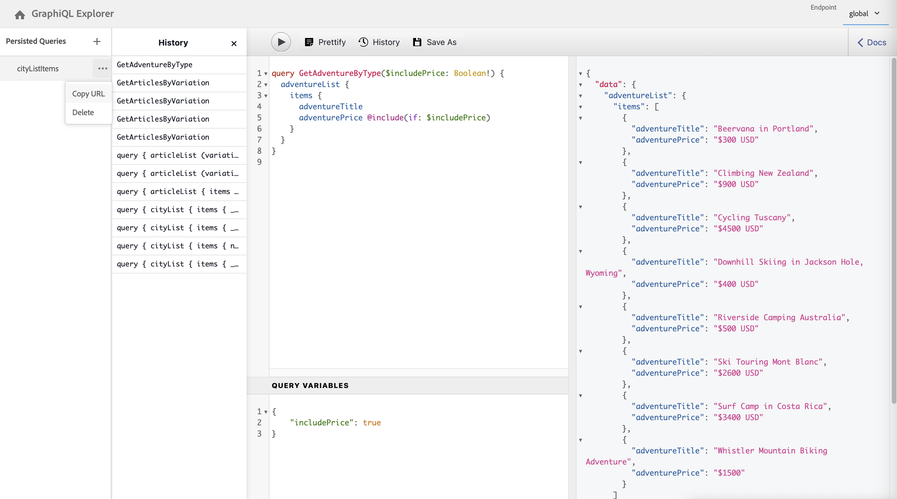

# Utilisation de l’IDE GraphiQL {#graphiql-ide}

Une mise en œuvre de l’IDE [GraphiQL](https://graphql.org/learn/serving-over-http/#graphiql) standard est disponible pour une utilisation avec l’API GraphQL d’Adobe Experience Manager (AEM).

>[!NOTE]
>
>GraphiQL est inclus dans tous les environnements d’AEM (mais est accessible/visible uniquement lorsque vous configurez vos points d’entrée).
>
>Dans les versions précédentes, un package était nécessaire pour installer l’IDE GraphiQL. Si vous l’avez installé, il peut désormais être supprimé.

>[!NOTE]
>Vous devez avoir [configuré vos points d’entrée](/help/sites-developing/headless/graphql-api/graphql-endpoint.md) dans le [navigateur de configuration](/help/assets/content-fragments/content-fragments-configuration-browser.md) avant d’utiliser l’IDE GraphiQL.

La variable **GraphiQL** vous permet de tester et de déboguer vos requêtes GraphQL en vous permettant :

* sélectionner le **Point d’entrée** approprié pour la configuration Sites que vous souhaitez utiliser pour vos requêtes ;
* saisir directement de nouvelles requêtes ;
* créer et accéder aux **[Requêtes persistantes](/help/sites-developing/headless/graphql-api/persisted-queries.md)** ;
* Exécutez vos requêtes pour afficher immédiatement les résultats.
* gérer les **Variables de requête** ;
* enregistrer et gérer les **Requêtes persistantes** ;
* publier ou dépublier des **Requêtes persistantes** (par exemple : vers et à partir de `dev-publish`) ;
* afficher l’**Historique** de vos requêtes précédentes ;
* utiliser l’**Explorateur de documentation** pour accéder à la documentation pour vous aider à apprendre et à comprendre les méthodes disponibles.

Vous pouvez accéder à l’éditeur de requêtes à partir de :

* **Outils** -> **Général** -> **Éditeur de requêtes GraphQL**
* directement ; par exemple, `http://localhost:4502/aem/graphiql.html`

Vous pouvez utiliser GraphiQL sur votre système afin que les requêtes puissent être appelées par votre application cliente à l’aide de requêtes GET et pour des requêtes de publication. À des fins de production, vous pouvez ensuite [déplacer vos requêtes vers votre environnement de production](/help/sites-developing/headless/graphql-api/persisted-queries.md#transfer-persisted-query-production). Commencez par créer l’auteur de production pour valider le contenu nouvellement créé avec les requêtes, puis publiez la production pour la consommation en direct.

## Sélection de votre point d’entrée {#selecting-endpoint}

Pour commencer, vous devez sélectionner le **[Point d’entrée](/help/sites-developing/headless/graphql-api/graphql-endpoint.md)** que vous souhaitez utiliser pour les requêtes. Ce point d’entrée est adapté pour la configuration Sites que vous souhaitez utiliser pour vos requêtes.

Il est disponible dans la liste déroulante en haut à droite.

## Création et persistance d’une nouvelle requête {#creating-new-query}

Vous pouvez saisir votre nouvelle requête dans l’éditeur qui se trouve dans le panneau du milieu à gauche, directement sous le logo GraphiQL.

>[!NOTE]
>
>Si une requête persistante est déjà sélectionnée et s’affiche dans le panneau de l’éditeur, sélectionnez `+` (en face de **Requêtes persistantes**) pour vider l’éditeur prêt pour votre nouvelle requête.

Commencez simplement à taper, et l’éditeur :

* offre une fonctionnalité de survol de la souris pour afficher des informations supplémentaires sur les éléments ;
* offre des fonctionnalités telles que la mise en surbrillance de la syntaxe, la saisie automatique et la suggestion automatique.

>[!NOTE]
>
>Les requêtes GraphQL commencent généralement par un caractère `{`.
>
>Les lignes qui commencent par un `#` sont ignorées.

Utilisez **Enregistrer sous** pour conserver votre nouvelle requête.

## Mise à jour de la requête persistante {#updating-persisted-query}

Sélectionnez la requête à mettre à jour dans la liste du panneau des **[Requêtes persistantes](/help/sites-developing/headless/graphql-api/persisted-queries.md)** (à l’extrême gauche).

La requête s’affiche dans le panneau de l’éditeur. Apportez les modifications nécessaires, puis utilisez **Enregistrer** pour valider vos mises à jour dans la requête persistante.

## Exécution de requêtes {#running-queries}

Vous pouvez exécuter une nouvelle requête immédiatement ou charger et exécuter une requête persistante. Pour charger une requête persistante, sélectionnez-la dans la liste ; la requête s’affichera dans le panneau de l’éditeur.

Dans les deux cas, la requête affichée dans le panneau de l’éditeur est la requête qui sera exécutée lorsque vous :

* cliquez ou appuyez sur l’icône **Exécuter la requête** ;
* utilisez la combinaison de clavier `Control-Enter`.

## Variables de requête {#query-variables}

<!-- more details needed here? -->

L’IDE GraphiQL vous permet également de gérer votre [Variables de requête](/help/sites-developing/headless/graphql-api/graphql-api-content-fragments.md#graphql-variables).

Par exemple :

<!--
## Managing cache for your persisted queries {#managing-cache}

[Persisted queries](/help/headless/graphql-api/persisted-queries.md) are recommended as they can be cached at the dispatcher and CDN layers, ultimately improving the performance of the requesting client application. By default AEM will invalidate the Content Delivery Network (CDN) cache based on a default Time To Live (TTL).

>[!NOTE]
>
>Custom rewrite rules on the Dispatcher might override defaults from AEM publish. 
>
>In the case that you are sending TTL-based cache-control headers from the dispatcher, based on a location match pattern, then, if necessary, you might want to exclude `/graphql/execute.json/*` from the matches.

Using GraphQL you can configure the HTTP Cache Headers  to control these parameters for your individual persisted query.

1. The **Headers** option is accessible via the three vertical dots to the right of the persisted query name (far left panel):

   

1. Selecting this will open the **Cache Configuration** dialog:

   

1. Select the appropriate parameter, then adjust the value as required:

   * **cache-control** - **max-age**
     Caches can store this content for specified number of seconds. Typically this is the browser TTL (Time To Live).
   * **surrogate-control** - **s-maxage**
     Same as max-age but applies specifically to proxy caches.
   * **surrogate-control** - **stale-while-revalidate**
     Caches may continue to serve a cached response after it becomes stale, for up to the specified number of seconds.
   * **surrogate-control** - **stale-if-error**
     Caches may continue to serve a cached response in case of or origin error, for up to the specified number of seconds.

1. Select **Save** to persist the changes.
-->

## Publier des requêtes persistantes {#publishing-persisted-queries}

Une fois que vous avez sélectionné votre [requête persistante](/help/sites-developing/headless/graphql-api/persisted-queries.md) dans la liste (panneau de gauche), vous pouvez utiliser les actions **Publier** et **Dépublier**. Cette opération les active dans votre environnement de publication (par exemple `dev-publish`) pour faciliter l’accès selon vos applications lors des tests.

>[!NOTE]
>
>La définition du paramètre `Time To Live` {&quot;cache-control&quot;:&quot;parameter&quot;:value} du cache de la requête persistante a une valeur par défaut de 2 heures (7 200 secondes).

## Copie de l’URL pour accéder directement à la requête {#copy-url}

La variable **Copier l’URL** permet de simuler une requête, en copiant l&#39;URL utilisée pour accéder directement à la requête conservée et visualiser les résultats. Elle peut ensuite être utilisée à des fins de test ; par exemple, en y accédant par le biais d’un navigateur :

<!--
  >[!NOTE]
  >
  >The URL will need [encoding before using programmatically](/help/headless/graphql-api/persisted-queries.md#encoding-query-url).
  >
  >The target environment might need adjusting, depending on your requirements.
-->

Par exemple :

`http://localhost:4502/graphql/execute.json/global/article-list-01`

En utilisant cette URL dans un navigateur, vous pouvez confirmer les résultats :

L’option **Copier l’URL** est accessible à partir des trois points verticaux situés à droite du nom de la requête persistante (panneau tout à gauche) :

## Suppression de requêtes persistantes {#deleting-persisted-queries}

L’option **Supprimer** est également accessible à partir des trois points verticaux situés à droite du nom de la requête persistante (panneau tout à gauche).

<!-- what happens if you try to delete something that is still published? -->

## Installation de la requête persistante en production {#installing-persisted-query-production}

Après avoir développé et testé votre requête persistante avec GraphiQL, l’objectif final est de [la transférer vers votre environnement de production](/help/sites-developing/headless/graphql-api/persisted-queries.md#transfer-persisted-query-production) pour qu’elle soit utilisée par vos applications.

## Raccourcis clavier {#keyboard-shortcuts}

Plusieurs raccourcis clavier permettent d’accéder directement aux icônes d’action dans l’IDE :

* Embellir la requête : `Shift-Control-P`
* Fusionner la requête : `Shift-Control-M`
* Exécuter la requête : `Control-Enter`
* Remplissage automatique : `Control-Space`

>[!NOTE]
>
>Sur certains claviers, la clé `Control` est étiquetée comme `Ctrl`.
