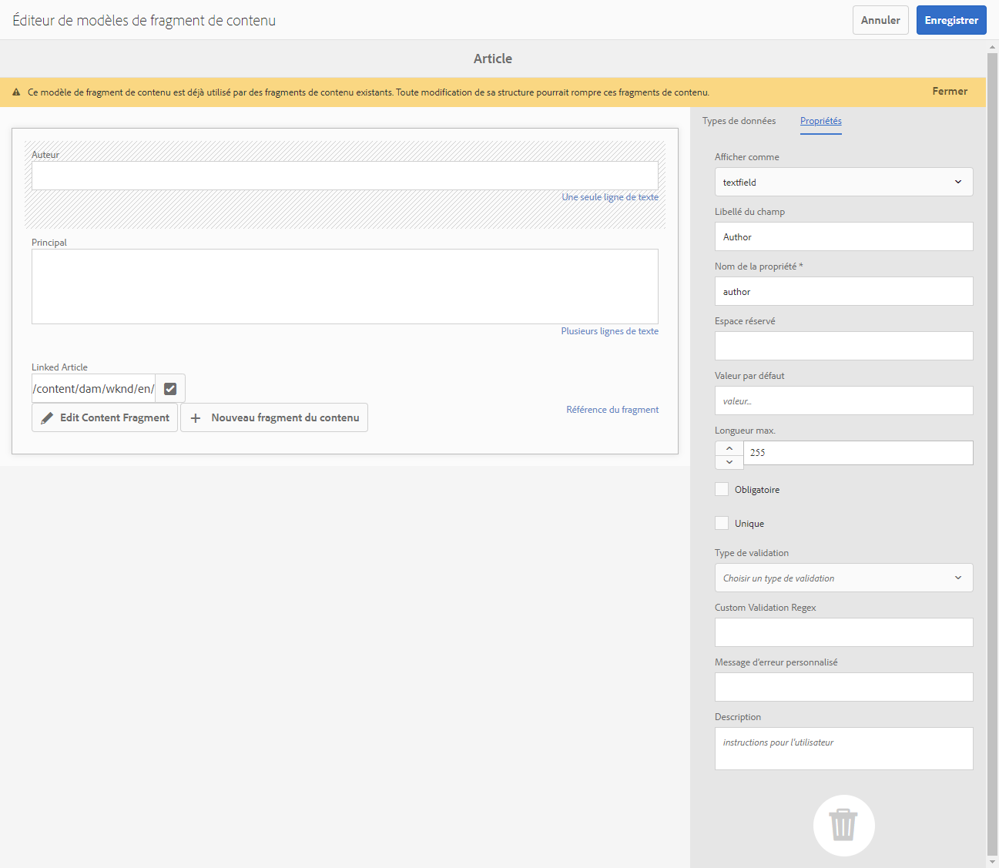

# API AEM GraphQL pour l’utilisation des fragments de contenu {#graphql-api-for-use-with-content-fragments}

Découvrez comment utiliser les fragments de contenu dans Adobe Experience Manager (AEM) avec l’API AEM GraphQL pour la diffusion de contenu en mode découplé.

L’API GraphQL AEM utilisée avec des fragments de contenu repose principalement sur l’API open source standard GraphQL.

L’utilisation de l’API GraphQL dans AEM permet la diffusion efficace de fragments de contenu aux clients JavaScript dans les implémentations CMS découplées :

* en évitant les demandes d’API itératives comme avec REST ;
* en veillant à ce que la diffusion soit limitée aux exigences spécifiques ;
* en permettant de diffuser en bloc exactement ce qui est nécessaire pour le rendu en réponse à une seule requête d’API.

>[!NOTE]
>
>GraphQL est utilisé dans deux scénarios (distincts) dans Adobe Experience Manager (AEM) :
>
>* [AEM Commerce utilise les données d’une plateforme commerciale par le biais de GraphQL](/help/commerce/cif/integrating/magento.md).
>* Les fragments de contenu d’AEM fonctionnent conjointement avec l’API AEM GraphQL (une implémentation personnalisée, basée sur GraphQL standard), pour fournir du contenu structuré à utiliser dans vos applications.

## Conditions préalables {#prerequisites}

Les et clientes et clients qui utilisent GraphQL doivent installer le fragment de contenu AEM avec le package d’index GraphQL 1.0.5. Voir les [notes de mise à jour](/help/release-notes/release-notes.md#install-aem-graphql-index-add-on-package) pour plus de détails.

## L’API GraphQL {#graphql-api}

GraphQL est :

* « *...un langage de requête pour les API et un environnement d’exécution pour répondre à ces requêtes avec vos données existantes. GraphQL fournit une description complète et compréhensible des données de votre API. Il permet aux clients et clientes de demander exactement ce dont ils ont besoin et rien de plus, facilite l’évolution des API au fil du temps et offre des outils de développement puissants.* »

  Voir [GraphQL.org](https://graphql.org)

* « *...une spécification ouverte pour une couche d’API flexible. Placez GraphQL sur vos back-ends existants pour créer des produits plus rapidement que jamais...* »

  Voir [Explore GraphQL](https://graphql.com/).

* *« ... un langage et une spécification de requête de données développés en interne par Facebook en 2012 avant d’être rendus en open source en 2015. C’est une alternative aux architectures basées sur REST destinée à accroître la productivité des développeurs et à réduire les quantités de données transférées. GraphQL est utilisé en production par des centaines d’entreprises de toutes tailles... »*

  Voir [GraphQL Foundation](https://graphql.org/foundation).

<!--
"*Explore GraphQL is maintained by the Apollo team. Our goal is to give developers and technical leaders around the world all the tools they need to understand and adopt GraphQL.*". 
-->

Pour plus d’informations sur l’API GraphQL, voir les sections suivantes (parmi de nombreuses autres ressources) :

* Sur [graphql.org](https://graphql.org) :

   * [Présentation de GraphQL](https://graphql.org/learn)

   * [La spécification GraphQL](https://spec.graphql.org/)

* Sur [graphql.com](https://graphql.com) :

   * [Tutoriels](https://graphql.com/tutorials/)


La mise en œuvre GraphQL pour AEM repose sur la bibliothèque Java™ GraphQL standard. Voir :

* [graphQL.org – Java](https://graphql.org/code/#java)

* [GraphQL Java™ sur GitHub](https://github.com/graphql-java)

### Terminologie GraphQL {#graphql-terminology}

GraphQL utilise les éléments suivants :

* **[Requêtes](https://graphql.org/learn/queries/)**

* **[Schémas et types](https://graphql.org/learn/schema/)** :

   * Les schémas sont générés par AEM en fonction des modèles de fragment de contenu.
   * Grâce à vos schémas, GraphQL présente les types et les opérations autorisés pour l’implémentation de GraphQL pour AEM.

* **[Champs](https://graphql.org/learn/queries/#fields)**

* **[Point d’entrée GraphQL](/help/sites-developing/headless/graphql-api/graphql-endpoint.md#graphql-aem-endpoint)**
   * Le chemin d’accès dans AEM qui répond aux requêtes GraphQL et permet d’accéder aux schémas GraphQL.

   * Voir [Activation de votre point d’entrée GraphQL](/help/sites-developing/headless/graphql-api/graphql-endpoint.md#enabling-graphql-endpoint) pour plus de détails.

Voir la [Présentation de GraphQL (GraphQL.org)](https://graphql.org/learn/) pour des détails complets, y compris les [Bonnes pratiques](https://graphql.org/learn/best-practices/).

### Types de requêtes GraphQL {#graphql-query-types}

GraphQL permet de réaliser des requêtes pour renvoyer, au choix :

* Une **entrée unique**

* Une **[liste d’entrées](https://graphql.org/learn/schema/#lists-and-non-null)**

AEM fournit des fonctionnalités de conversion des requêtes (des deux types) en [Requêtes persistantes](/help/sites-developing/headless/graphql-api/persisted-queries.md), qui sont mises en cache par Dispatcher et le réseau CDN.

### Bonnes pratiques en matière de requêtes GraphQL (Dispatcher et réseau CDN) {#graphql-query-best-practices}

Il est recommandé d’utiliser les [Requêtes persistantes](/help/sites-developing/headless/graphql-api/persisted-queries.md) sur les instances de publication en raison des avantages suivants :

* Elles sont mises en cache.
* Elles sont gérées de manière centralisée par AEM

<!-- is this fully accurate? -->
>[!NOTE]
>
>En règle générale, les instances de création ne possèdent pas de Dispatcher/réseau CDN. L’utilisation des requêtes persistantes n’offre donc aucun avantage, sauf à des fins de test.

Les requêtes GraphQL utilisant des requêtes POST ne sont pas recommandées, car elles ne sont pas mises en cache. Par conséquent, dans une instance par défaut, Dispatcher est configuré pour bloquer ces requêtes.

Bien que GraphQL prenne également en charge les requêtes de GET, ces requêtes peuvent atteindre des limites (par exemple, la longueur de l’URL) qui peuvent être évitées à l’aide de requêtes persistantes.

Voir [Activer le cache des requêtes persistantes](#enable-caching-persisted-queries) pour plus de détails.

>[!NOTE]
>
>Il se peut que la possibilité d’effectuer des requêtes directes devienne obsolète à un moment donné.

## Interface GraphiQL {#graphiql-interface}

Une implémentation de l’interface standard [GraphiQL](https://graphql.org/learn/serving-over-http/#graphiql) est disponible pour être utilisée avec AEM GraphQL.

>[!NOTE]
>
>GraphiQL est inclus dans tous les environnements d’AEM (mais est accessible/visible uniquement lorsque vous configurez vos points d’entrée).
>
>Dans les versions précédentes, vous aviez besoin d’un package pour installer l’IDE GraphiQL. Si vous l’avez installé, il peut désormais être supprimé.

Cette interface vous permet de saisir et tester directement les requêtes.

Par exemple :

* `http://localhost:4502/content/graphiql.html`

Elle vous offre des fonctionnalités telles que la mise en surbrillance de la syntaxe, la saisie semi-automatique et la suggestion automatique, ainsi qu’un historique et une documentation en ligne:


>[!NOTE]
>
>Voir [Utilisation de l’IDE GraphiQL](/help/sites-developing/headless/graphql-api/graphiql-ide.md).

## Cas d’utilisation pour les environnements de création et de publication {#use-cases-author-publish-environments}

Les cas d’utilisation peuvent dépendre du type d’environnement AEM :

* Environnement de publication, utilisé pour :
   * Réaliser des requête de données pour l’application JS (cas d’utilisation standard)

* Environnement de création, utilisé pour :
   * Réaliser des requêtes de données à des fins de gestion de contenu :
      * GraphQL dans AEM est une API en lecture seule.
      * L’API REST peut être utilisée pour les opérations CR(u)D.

## Autorisations {#permission}

Les autorisations sont requises pour accéder aux ressources.

Les requêtes GraphQL sont exécutées avec l’autorisation de l’utilisateur ou utilisatrice AEM de la requête sous-jacente. Si l’utilisateur ou l’utilisatrice ne dispose pas d’un accès en lecture à certains fragments (stockés en tant que ressources), ils ne feront pas partie du jeu de résultats.

En outre, l’utilisateur ou l’utilisatrice doit avoir accès à un point d’entrée GraphQL pour pouvoir exécuter des requêtes GraphQL.

## Génération de schémas {#schema-generation}

GraphQL est une API dans laquelle les données doivent être clairement structurées et organisées par type.

La spécification GraphQL fournit une série de directives sur la création d’une API robuste pour interroger les données sur une certaine instance. Pour compléter ces directives, un client doit récupérer le [Schéma](#schema-generation), qui contient tous les types nécessaires pour une requête.

Pour les fragments de contenu, les schémas GraphQL (structure et types) reposent sur des [Modèles de fragments de contenu](/help/assets/content-fragments/content-fragments-models.md) **activés** et leurs types de données

>[!CAUTION]
>
>Tous les schémas GraphQL (dérivés de modèles de fragments de contenu qui ont été **activés**) sont lisibles par le point d’entrée GraphQL.
>
>Cette fonctionnalité implique que vous devez vous assurer qu’aucune donnée sensible n’est disponible, car elle pourrait être divulguée. Par exemple, elle inclut des informations qui peuvent être présentes en tant que noms de champ dans la définition de modèle.

Par exemple, si un utilisateur ou une utilisatrice crée un modèle de fragment de contenu appelé `Article`, alors AEM génère un `ArticleModel` de type GraphQL. Les champs de ce type correspondent aux champs et aux types de données définis dans le modèle. AEM crée également des points d’entrée pour les requêtes qui opèrent sur ce type, comme `articleByPath` ou `articleList`.

1. Un modèle de fragment de contenu :

   

1. Le schéma GraphQL correspondant (sortie de la documentation automatique GraphiQL) :
   

   Cette image montre que le type généré `ArticleModel` contient plusieurs [champs](#fields).

   * Trois d’entre eux ont été contrôlés par l’utilisateur ou utilisatrice : `author`, `main` et `referencearticle`.

   * Les autres champs ont été ajoutés automatiquement par AEM et représentent des méthodes utiles pour fournir des informations sur un certain fragment de contenu. Dans cet exemple, (la variable [champ d’assistance](#helper-fields)) `_path`, `_metadata`, `_variations`.

1. Après qu’un utilisateur a créé un fragment de contenu reposant sur le modèle d’article, il peut être interrogé via GraphQL. Vous trouverez des exemples à la section [Exemples de Requêtes](/help/sites-developing/headless/graphql-api/content-fragments-graphql-samples.md#graphql-sample-queries) (basée sur un [modèle de structure de fragment de contenu à utiliser avec GraphQL](/help/sites-developing/headless/graphql-api/content-fragments-graphql-samples.md#content-fragment-structure-graphql)).

Dans GraphQL pour AEM, le schéma est flexible. Cela signifie qu’il est généré automatiquement à chaque fois qu’un modèle de fragment de contenu est créé, mis à jour ou supprimé. Les caches de schémas de données sont également actualisés lorsque vous mettez à jour un modèle de fragment de contenu.

Le service Sites GraphQL écoute (en arrière-plan) toutes les modifications apportées à un modèle de fragment de contenu. Lorsque des mises à jour sont détectées, seule cette partie du schéma est régénérée. Cette optimisation permet de gagner du temps et d’apporter de la stabilité.

Par exemple, si vous :

1. Installez un package contenant `Content-Fragment-Model-1` et `Content-Fragment-Model-2` :

   1. Les types GraphQL pour `Model-1` et `Model-2` sont générés.

1. Puis modifiez `Content-Fragment-Model-2` :

   1. Seul le type GraphQL `Model-2` est mis à jour.

   1. `Model-1` reste identique.

>[!NOTE]
>
>Il est important de noter ce détail si vous souhaitez effectuer des mises à jour en bloc sur les modèles de fragments de contenu via l’API REST, ou autrement.

Le schéma est desservi par le même point d’entrée que les requêtes GraphQL, le client gérant le fait que le schéma est appelé avec l’extension `GQLschema`. Par exemple, l’exécution d’une requête `GET` simple sur `/content/cq:graphql/global/endpoint.GQLschema` entraîne la sortie du schéma avec le type de contenu : `text/x-graphql-schema;charset=iso-8859-1`.

### Génération de schémas – Modèles dépubliés {#schema-generation-unpublished-models}

Lorsque des fragments de contenu sont imbriqués, il se peut qu’un modèle de fragment de contenu parent soit publié, mais pas un modèle référencé.

>[!NOTE]
>
>L’interface utilisateur d’AEM empêche cela, mais si la publication est effectuée par programmation ou avec des packages de contenu, elle peut être effectuée.

Dans ce cas, AEM génère un schéma *incomplet* pour le modèle de fragment de contenu parent. Cela signifie que la référence au fragment, qui dépend du modèle dépublié, est supprimée du schéma.

## Champs {#fields}

Le schéma comporte des champs individuels de deux catégories de base :

* Champs que vous générez.

  Une sélection de [types de données](#data-types) est utilisée pour créer des champs en fonction de la configuration du modèle de fragment de contenu. Les noms des champs proviennent du champ **Nom de la propriété** du **Type de données**.

   * Prenez également en compte le paramètre **Rendre en tant que**, car les utilisateurs et utilisatrices peuvent configurer certains types de données. Par exemple, pour configurer un champ de texte monoligne afin de contenir plusieurs textes monolignes, choisissez `multifield` dans la liste déroulante.

* GraphQL pour AEM génère également plusieurs [champs d’assistance](#helper-fields).

  Ils servent à identifier un fragment de contenu ou à obtenir plus d’informations sur un fragment.

### Types de données {#data-types}

GraphQL pour AEM prend en charge une liste de types. Tous les types de données de modèles de fragments de contenu pris en charge et les types GraphQL correspondants sont représentés :

| Modèle de fragment de contenu – Type de données | Type GraphQL | Description |
|--- |--- |--- |
| Texte d’une seule ligne | `String`, `[String]` |  Utilisé pour les chaînes simples telles que les noms d’auteur ou d’auteure et les noms d’emplacement. |
| Texte multiligne | `String` |  Utilisé pour la sortie de texte, tel que le corps d’un article |
| Nombre |  `Float`, `[Float]` | Utilisé pour afficher le nombre à virgule flottante et les nombres réguliers |
| Booléen |  `Boolean` |  Utilisé pour afficher les cases à cocher → simples instructions vrai/faux |
| Date et heure | `Calendar` |  Utilisé pour afficher la date et l’heure au format ISO 8086. Selon le type sélectionné, trois versions sont disponibles dans AEM GraphQL : `onlyDate`, `onlyTime`, `dateTime` |
| Énumération |  `String` |  Utilisé pour afficher une option à partir d’une liste d’options définies lors de la création du modèle |
|  Balises |  `[String]` |  Utilisé pour afficher une liste de chaînes représentant les balises utilisées dans AEM |
| Référence de contenu |  `String` |  Utilisé pour afficher le chemin vers une autre ressource dans AEM |
| Référence du fragment |  *Un type de modèle* <br><br>Champ simple : `Model` - Type de modèle, référencé directement <br><br>Multichamp, avec un type référencé : `[Model]` - Tableau de type `Model`, référencé directement à partir du tableau <br><br>Multichamp, avec plusieurs types référencés : `[AllFragmentModels]` - Tableau de tous les types de modèle, référencé à partir d’un tableau avec type d’union | Utilisé pour référencer un ou plusieurs fragments de contenu de certains types de modèles, définis lors de la création du modèle |

{style="table-layout:auto"}

### Champs d’assistant {#helper-fields}

Outre les types de données des champs générés par l’utilisateur ou l’utilisatrice, GraphQL pour AEM génère également plusieurs champs d’*assistant* afin de faciliter l’identification d’un fragment de contenu ou de fournir des informations supplémentaires sur un fragment de contenu.

Ces [champs d’assistance](#helper-fields) sont précédés d’un `_` pour distinguer ce qui a été défini par l’utilisateur ou l’utilisatrice de ce qui a été généré automatiquement.

#### Chemin d’accès {#path}

Le champ de chemin est utilisé comme identificateur dans AEM GraphQL. Il représente le chemin d’accès de la ressource de fragment de contenu dans le référentiel AEM. Ce chemin d’accès est choisi comme identifiant d’un fragment de contenu, car il :

* est unique dans AEM ;
* peut facilement être récupéré.

Le code suivant affiche les chemins d’accés de tous les fragments de contenu créés à partir du modèle de fragment de contenu `Person`.

```graphql
{
  personList {
    items {
      _path
    }
  }
}
```

Pour récupérer un fragment de contenu unique d’un type spécifique, vous devez commencer par déterminer son chemin d’accès. Par exemple :

```graphql
{
  authorByPath(_path: "/content/dam/path/to/fragment/john-doe") {
    item {
      _path
      firstName
      name
    }
  }
}
```

Voir [Exemple de requête – Un fragment de ville unique et spécifique](/help/sites-developing/headless/graphql-api/content-fragments-graphql-samples.md#sample-single-specific-city-fragment).

#### Métadonnées {#metadata}

Par le biais de GraphQL, AEM expose également les métadonnées d’un fragment de contenu. Les métadonnées sont les informations qui décrivent un fragment de contenu, telles que :

* le titre d’un fragment de contenu ;
* le chemin d&#39;accès à la vignette ;
* la description d’un fragment de contenu ;
* et la date de création, entre autres.

Les métadonnées étant générées par l’éditeur de schémas et n’ayant donc pas de structure spécifique, le type `TypedMetaData` GraphQL a été implémenté pour exposer les métadonnées d’un fragment de contenu. Le `TypedMetaData` expose les informations regroupées selon les types scalaires suivants :

| Champ |
|--- |
| `stringMetadata:[StringMetadata]!` |
| `stringArrayMetadata:[StringArrayMetadata]!` |
| `intMetadata:[IntMetadata]!` |
| `intArrayMetadata:[IntArrayMetadata]!` |
| `floatMetadata:[FloatMetadata]!` |
| `floatArrayMetadata:[FloatArrayMetadata]!` |
| `booleanMetadata:[BooleanMetadata]!` |
| `booleanArrayMetadata:[booleanArrayMetadata]!`  |
| `calendarMetadata:[CalendarMetadata]!` |
| `calendarArrayMetadata:[CalendarArrayMetadata]!` |

Chaque type scalaire représente soit une paire nom-valeur unique, soit un tableau de paires nom-valeur, où la valeur d’une paire est du type dans lequel elle a été regroupée.

Par exemple, si vous souhaitez récupérer le titre d’un fragment de contenu, cette propriété est une propriété Chaîne et vous devez donc rechercher toutes les métadonnées Chaîne :

Pour rechercher des métadonnées :

```graphql
{
  personByPath(_path: "/content/dam/path/to/fragment/john-doe") {
    item {
      _path
      _metadata {
        stringMetadata {
          name
          value
        }
      }
    }
  }
}
```

Vous pouvez afficher tous les types GraphQL de métadonnées si vous affichez le schéma GraphQL généré. Tous les types de modèle ont le même `TypedMetaData`.

>[!NOTE]
>
>**Différence entre les métadonnées normales et les métadonnées de tableau**
>Gardez à l’esprit que `StringMetadata` et `StringArrayMetadata` se rapportent tous deux à ce qui est stocké dans le référentiel et non à la façon dont vous les récupérez.
>
>Par exemple, en appelant le champ `stringMetadata` , vous recevez un tableau de toutes les métadonnées stockées dans le référentiel sous la frome d’un `String`. Et si vous appelez `stringArrayMetadata`, vous recevez un tableau de toutes les métadonnées stockées dans le référentiel sous la forme d’un `String[]`.

Voir [Exemple de requête pour les métadonnées – Répertorier les métadonnées des prix intitulés GB](/help/sites-developing/headless/graphql-api/content-fragments-graphql-samples.md#sample-metadata-awards-gb).

#### Variations {#variations}

Le champ `_variations` a été implémenté pour simplifier la recherche de variations d’un fragment de contenu. Par exemple :

```graphql
{
  personByPath(_path: "/content/dam/path/to/fragment/john-doe") {
    item {
      _variations
    }
  }
}
```

>[!NOTE]
>
>Le champ `_variations` ne contient pas de variation `master`, car techniquement les données d’origine (référencées comme *Principal* dans l’interface utilisateur) ne sont pas considérées comme une variation explicite.

Voir [Exemple de requête – Toutes les villes avec une variation nommée](/help/sites-developing/headless/graphql-api/content-fragments-graphql-samples.md#sample-cities-named-variation).

>[!NOTE]
>
>Si la variation donnée n’existe pas pour un fragment de contenu, les données d’origine (également appelées variation principale) sont renvoyées comme valeur (de secours) par défaut.

<!--
## Security Considerations {#security-considerations}
-->

## Variables GraphQL {#graphql-variables}

GraphQL permet de placer des variables dans la requête. Pour plus d’informations, voir [Documentation GraphQL pour les variables](https://graphql.org/learn/queries/#variables).

Par exemple, pour obtenir tous les fragments de contenu de type `Article` qui présentent une variation spécifique, vous pouvez spécifier la variable `variation` dans GraphiQL.


```graphql
### query
query GetArticlesByVariation($variation: String!) {
    articleList(variation: $variation) {
        items {
            _path
            author
            _variations
        }
    }
}
 
### in query variables
{
    "variation": "uk"
}
```

## Directives GraphQL {#graphql-directives}

Dans GraphQL, il est possible de modifier la requête en fonction de variables, nommées directives GraphQL.

Par exemple, vous pouvez inclure ici le champ `adventurePrice` dans une requête pour tous les `AdventureModels`, en fonction d’une variable `includePrice`.


```graphql
### query
query GetAdventureByType($includePrice: Boolean!) {
  adventureList {
    items {
      adventureTitle
      adventurePrice @include(if: $includePrice)
    }
  }
}
 
### in query variables
{
    "includePrice": true
}
```

## Filtrage {#filtering}

Vous pouvez également utiliser le filtrage dans vos requêtes GraphQL pour renvoyer des données spécifiques.

Le filtrage utilise une syntaxe basée sur des expressions et des opérateurs logiques.

La partie la plus atomique est une expression unique qui peut être appliquée au contenu d’un certain champ. Il compare le contenu du champ avec une valeur constante donnée.

Par exemple, l’expression suivante compare le contenu du champ à la valeur `some text` et réussit si le contenu est égal à la valeur. Dans le cas contraire, l’expression échoue :

```graphql
{
  value: "some text"
  _op: EQUALS
}
```

Les opérateurs suivants peuvent être utilisés pour comparer les champs à une certaine valeur :

| Opérateur | Types | L’expression réussit si… |
|--- |--- |--- |
| `EQUALS` | `String`, `ID`, `Boolean` | ...la valeur est la même que le contenu du champ. |
| `EQUALS_NOT` | `String`, `ID` | …la valeur n’est *pas* identique au contenu du champ. |
| `CONTAINS` | `String` | …le contenu du champ contient la valeur (`{ value: "mas", _op: CONTAINS }` correspond à `Christmas`, `Xmas`, `master`…). |
| `CONTAINS_NOT` | `String` | …le contenu du champ *ne contient pas* la valeur |
| `STARTS_WITH` | `ID` | …l’identifiant commence par une certaine valeur (`{ value: "/content/dam/", _op: STARTS_WITH` correspond à `/content/dam/path/to/fragment`, mais pas à `/namespace/content/dam/something` |
| `EQUAL` | `Int`, `Float` | ...la valeur est la même que le contenu du champ. |
| `UNEQUAL` | `Int`, `Float` | …la valeur n’est *pas* identique au contenu du champ. |
| `GREATER` | `Int`, `Float` | …le contenu du champ est supérieur à la valeur. |
| `GREATER_EQUAL` | `Int`, `Float` | …le contenu du champ est supérieur ou égal à la valeur. |
| `LOWER` | `Int`, `Float` | …le contenu du champ est inférieur à la valeur. |
| `LOWER_EQUAL` | `Int`, `Float` | …le contenu du champ est inférieur ou égal à la valeur. |
| `AT` | `Calendar`, `Date`, `Time` | …le contenu du champ est le même que la valeur (y compris le réglage du fuseau horaire) |
| `NOT_AT` | `Calendar`, `Date`, `Time` | …le contenu du champ n’est *pas* identique à la valeur. |
| `BEFORE` | `Calendar`, `Date`, `Time` | …le moment indiqué par la valeur est antérieur au moment indiqué par le contenu du champ. |
| `AT_OR_BEFORE` | `Calendar`, `Date`, `Time` | …le moment indiqué par la valeur est antérieur ou égal au moment indiqué par le contenu du champ. |
| `AFTER` | `Calendar`, `Date`, `Time` | …le moment indiqué par la valeur est postérieur au moment indiqué par le contenu du champ. |
| `AT_OR_AFTER` | `Calendar`, `Date`, `Time` | …le moment indiqué par la valeur est postérieur ou égal au moment indiqué par le contenu du champ. |

Certains types vous permettent également de spécifier des options supplémentaires qui modifient la manière dont une expression est évaluée :

| Option | Types | Description |
|--- |--- |--- |
| `_ignoreCase` | `String` | Ignore la casse d’une chaîne ; par exemple, une valeur de `time` correspond à `TIME`, `time`, `tImE`, ... |
| `_sensitiveness` | `Float` | Permet une certaine marge pour que les valeurs `float` soient considérées comme identiques (pour contourner les limitations techniques en raison de la représentation interne des valeurs `float`). Cette option n’est pas recommandée en raison de son impact négatif sur les performances. |

Les expressions peuvent être combinées à un jeu à l’aide d’un opérateur logique (`_logOp`) :

* `OR` : le jeu d’expressions réussit si au moins une expression réussit.
* `AND` : le jeu d’expressions réussit si toutes les expressions réussissent (par défaut).

Chaque champ peut être filtré par son propre jeu d’expressions. Les jeux d’expressions de tous les champs mentionnés dans l’argument de filtre seront finalement combinés par leur propre opérateur logique.

Une définition de filtre (transmise comme l’argument `filter` dans une requête) contient les éléments suivants :

* Une sous-définition pour chaque champ (le champ est accessible via son nom, par exemple il y a un champ `lastName` dans le filtre pour le champ `lastName` dans le type de données (champ)).
* Chaque sous-définition contient le tableau `_expressions`, qui fournit le jeu d’expressions, ainsi que le champ `_logOp`, qui définit l’opérateur logique avec lequel les expressions doivent être combinées.
* Chaque expression est définie par la valeur (champ `value`) et l’opérateur (champ `_operator`) auxquels le contenu d’un champ doit être comparé.

Vous pouvez omettre `_logOp` si vous souhaitez combiner des éléments avec `AND` et `_operator` si vous souhaitez vérifier l’égalité, car il s’agit de valeurs par défaut.

L’exemple suivant illustre une requête complète qui filtre toutes les personnes dont le `lastName` est `Provo` ou contenant `sjö`, quel que soit le cas :

```graphql
{
  authorList(filter: {
    lastname: {
      _logOp: OR
      _expressions: [
        {
          value: "sjö",
          _operator: CONTAINS,
          _ignoreCase: true
        },
        {
          value: "Provo"
        }
      ]
    }
  }) {
    items {
      lastName
      firstName
    }
  }
}
```

Il n’est pas recommandé de filtrer les champs imbriqués (bien que cela soit possible), car cela peut entraîner des problèmes de performances.

Pour accéder à d’autres exemples, voir :

* détails des [extensions GraphQL pour AEM](#graphql-extensions)

* [Modèles de requêtes utilisant ce modèle de contenu et de structure](/help/sites-developing/headless/graphql-api/content-fragments-graphql-samples.md#graphql-sample-queries-sample-content-fragment-structure)

   * et [Modèle de contenu et de structure](/help/sites-developing/headless/graphql-api/content-fragments-graphql-samples.md#content-fragment-structure-graphql) préparé pour une utilisation dans des modèles de requêtes

* [Modèles de requêtes basées sur le projet WKND](/help/sites-developing/headless/graphql-api/content-fragments-graphql-samples.md#sample-queries-using-wknd-project)

## Tri {#sorting}

>[!NOTE]
>
>Pour optimiser les performances, envisagez d’effectuer la [mise à jour de vos fragments de contenu pour la pagination et le tri dans le filtrage GraphQL](/help/sites-developing/headless/graphql-api/graphql-optimized-filtering-content-update.md).

Cette fonctionnalité vous permet de trier les résultats de la requête en fonction d’un champ spécifié.

Les critères de tri sont les suivants :

* il s’agit d’une liste de valeurs séparées par des virgules représentant le chemin du champ
   * le premier champ de la liste définit l’ordre de tri principal
      * le deuxième champ est utilisé si deux valeurs du critère de tri principal sont égales
      * le troisième champ est utilisé si les deux premiers critères sont égaux, etc.
   * notation pointillée, à savoir : `field1.subfield.subfield`, etc.
* avec un sens d’ordre optionnel,
   * ASC (croissant) ou DESC (décroissant) ; la valeur par défaut est ASC,
   * le sens peut être spécifié par champ : vous pouvez trier un champ par ordre croissant et un autre par ordre décroissant (name, firstName DESC).

Par exemple :

```graphql
query {
  authorList(sort: "lastName, firstName") {
    items {
      firstName
      lastName
    }
  }
}
```

Un autre exemple :

```graphql
{
  authorList(sort: "lastName DESC, firstName DESC") {
    items {
        lastName
        firstName
    }
  }
}
```

Vous pouvez également trier un champ dans un fragment imbriqué au format `nestedFragmentname.fieldname`.

>[!NOTE]
>
>Ce format peut avoir un impact négatif sur les performances.

Par exemple :

```graphql
query {
  articleList(sort: "authorFragment.lastName")  {
    items {
      title
      authorFragment {
        firstName
        lastName
        birthDay
      }
      slug
    }
  }
}
```

## Pagination {#paging}

>[!NOTE]
>
>Pour optimiser les performances, envisager d’effectuer la [mise à jour de vos fragments de contenu pour la pagination et le tri dans le filtrage GraphQL](/help/sites-developing/headless/graphql-api/graphql-optimized-filtering-content-update.md).

Cette fonctionnalité vous permet d’effectuer une pagination sur les types de requête qui renvoient une liste. Deux méthodes sont proposées :

* `offset` et `limit` dans une requête `List`
* `first` et `after` dans une requête `Paginated`

### Requête de liste : « offset » et « limit » {#list-offset-limit}

Dans une requête `...List`, vous pouvez utiliser `offset` et `limit` pour renvoyer un sous-ensemble spécifique de résultats :

* `offset` : spécifie le premier jeu de données à renvoyer.
* `limit` : spécifie le nombre maximal de jeux de données à renvoyer.

Par exemple, pour obtenir la page de résultats contenant jusqu’à cinq articles, en commençant par le cinquième article de la liste *complète* des résultats, effectuez l’opération suivante :

```graphql
query {
   articleList(offset: 5, limit: 5) {
    items {
      authorFragment {
        lastName
        firstName
      }
    }
  }
}
```

<!-- When available link to BP and replace "JCR query level" with a more neutral term. -->

<!-- When available link to BP and replace "JCR query result set" with a more neutral term. -->

>[!NOTE]
>
>* La pagination nécessite un ordre de tri stable pour fonctionner correctement sur plusieurs requêtes demandant différentes pages du même jeu de résultats. Par défaut, il utilise le chemin d’accès au référentiel de chaque élément du jeu de résultats pour s’assurer que l’ordre est toujours le même. Si un ordre de tri différent est utilisé et si ce tri ne peut pas être effectué au niveau de la requête JCR, il y a un impact négatif sur les performances. Cela est dû au fait que le jeu de résultats entier doit être chargé en mémoire avant que les pages ne soient déterminées.
>
>* Plus le décalage est élevé, plus il faudra de temps pour ignorer les éléments du jeu complet de résultats de la requête JCR. Une autre solution pour les jeux de résultats volumineux consiste à utiliser la requête paginée avec la méthode `first` et `after`.

### Requête paginée : « first » et « after » {#paginated-first-after}

Le type de requête `...Paginated` utilise la plupart des fonctionnalités du type de requête `...List` (filtrage et tri), mais au lieu d’utiliser les arguments `offset`/`limit`, il utilise les arguments `first`/`after` tels que définis dans la [Spécification des connexions basées sur le curseur GraphQL](https://relay.dev/graphql/connections.htm). Consultez une introduction moins formelle dans la [Présentation de GraphQL](https://graphql.org/learn/pagination/#pagination-and-edges).

* `first` : les `n` premiers éléments à renvoyer.
La valeur par défaut est `50`.
La valeur maximale est `100`.
* `after` : curseur qui détermine le début de la page demandée. L’élément représenté par le curseur n’est pas inclus dans le jeu de résultats. Le curseur d’un élément est déterminé par le champ `cursor` de la structure `edges`.

Par exemple, vous pouvez afficher la page des résultats contenant jusqu’à cinq aventures, à partir de l’élément donné du curseur dans la liste *complète* des résultats :

```graphql
query {
    adventurePaginated(first: 5, after: "ODg1MmMyMmEtZTAzMy00MTNjLThiMzMtZGQyMzY5ZTNjN2M1") {
        edges {
          cursor
          node {
            title
          }
        }
        pageInfo {
          endCursor
          hasNextPage
        }
    }
}
```

<!-- When available link to BP -->
<!-- Due to internal technical constraints, performance will degrade if sorting and filtering is applied on nested fields. Therefore it is recommended to use filter/sort fields stored at root level. For more information, see the [Best Practices document](link). -->

>[!NOTE]
>
>* Par défaut, la pagination utilise l’UUID du nœud du référentiel représentant le fragment afin de s’assurer que l’ordre des résultats est toujours le même. Lorsque `sort` est utilisé, l’UUID est implicitement utilisé pour assurer un tri unique, même pour deux éléments disposant de clés de tri identiques.
>
>* En raison de contraintes techniques internes, les performances se dégradent si le tri et le filtrage sont appliqués aux champs imbriqués. Par conséquent, utilisez les champs de filtrage/tri stockés au niveau racine. Cette technique est également la méthode recommandée si vous souhaitez interroger des jeux de résultats paginés volumineux.

## Requêtes persistantes GraphQL - Activation de la mise en cache dans Dispatcher {#graphql-persisted-queries-enabling-caching-dispatcher}

>[!CAUTION]
>
>Si la mise en cache dans Dispatcher est activée, le [Filtre CORS](#cors-filter) n’est pas nécessaire. Cette section peut donc être ignorée.

La mise en cache des requêtes persistantes n’est pas activée par défaut dans Dispatcher. L’activation par défaut n’est pas possible, car les clients ou clientes qui utilisent le partage de ressources entre origines multiples (CORS) doivent examiner et éventuellement mettre à jour la configuration de Dispatcher.

>[!NOTE]
>
>Dispatcher ne met pas en cache l’en-tête `Vary`.
>
>La mise en cache d’autres en-têtes liés à CORS peut être activée dans Dispatcher, mais peut s’avérer insuffisante en cas d’origines CORS multiples.

### Activer la mise en cache des requêtes persistantes {#enable-caching-persisted-queries}

Pour activer la mise en cache des requêtes persistantes, les mises à jour suivantes des fichiers de configuration de Dispatcher sont requises :

* `<conf.d/rewrites/base_rewrite.rules>`

  ```xml
  # Allow the dispatcher to be able to cache persisted queries - they need an extension for the cache file
  RewriteCond %{REQUEST_URI} ^/graphql/execute.json
  RewriteRule ^/(.*)$ /$1;.json [PT] 
  ```

  >[!NOTE]
  >
  >Dispatcher ajoute le suffixe `.json` à toutes les URL de requête conservées, de sorte que le résultat puisse être mis en cache.
  >
  >Cela permet de s’assurer que la requête est conforme aux exigences de Dispatcher pour les documents qui peuvent être mis en cache. Pour plus d’informations, voir [Comment Dispatcher renvoie-t-il des documents ?](https://experienceleague.adobe.com/docs/experience-manager-dispatcher/using/troubleshooting/dispatcher-faq.html?lang=fr#how-does-the-dispatcher-return-documents%3F)

* `<conf.dispatcher.d/filters/ams_publish_filters.any>`

  ```xml
  # Allow GraphQL Persisted Queries & preflight requests
  /0110 { /type "allow" /method '(GET|POST|OPTIONS)' /url "/graphql/execute.json*" }
  ```

### Configuration CORS dans Dispatcher {#cors-configuration-in-dispatcher}

Les clients et les clientes qui utilisent des requêtes CORS doivent peut-être passer en revue et mettre à jour leur configuration CORS dans Dispatcher.

* L’en-tête `Origin` ne doit pas être transmis à l’instance de publication AEM via Dispatcher :
   * Vérifiez le fichier `clientheaders.any`.
* Au lieu de cela, les requêtes CORS doivent être évaluées pour les origines autorisées au niveau de Dispatcher. Cette approche garantit également que les en-têtes liés à CORS sont correctement définis, à un seul endroit, dans tous les cas.
   * Une telle configuration doit être ajoutée au fichier `vhost`. Vous trouverez ci-dessous un exemple de configuration. Pour plus de simplicité, seule la partie relative à CORS a été fournie. Vous pouvez l’adapter à vos cas d’utilisation spécifiques.

  ```xml
  <VirtualHost *:80>
     ServerName "publish"
  
     # ...
  
     <IfModule mod_headers.c>
         Header add X-Vhost "publish"
  
          ################## Start of the CORS specific configuration ##################
  
          SetEnvIfExpr "req_novary('Origin') == ''"  CORSType=none CORSProcessing=false
          SetEnvIfExpr "req_novary('Origin') != ''"  CORSType=cors CORSProcessing=true CORSTrusted=false
  
          SetEnvIfExpr "req_novary('Access-Control-Request-Method') == '' && %{REQUEST_METHOD} == 'OPTIONS' && req_novary('Origin') != ''  " CORSType=invalidpreflight CORSProcessing=false
          SetEnvIfExpr "req_novary('Access-Control-Request-Method') != '' && %{REQUEST_METHOD} == 'OPTIONS' && req_novary('Origin') != ''  " CORSType=preflight CORSProcessing=true CORSTrusted=false
          SetEnvIfExpr "req_novary('Origin') -strcmatch 'https://%{HTTP_HOST}*'"  CORSType=samedomain CORSProcessing=false
  
          # For requests that require CORS processing, check if the Origin can be trusted
          SetEnvIfExpr "%{HTTP_HOST} =~ /(.*)/ " ParsedHost=$1
  
          ################## Adapt the regex to match CORS origin for your environment
          SetEnvIfExpr "env('CORSProcessing') == 'true' && req_novary('Origin') =~ m#(https://.*.your-domain.tld(:\d+)?$)#" CORSTrusted=true
  
          # Extract the Origin header 
          SetEnvIfNoCase ^Origin$ ^https://(.*)$ CORSTrustedOrigin=https://$1
  
          # Flush If already set
          Header unset Access-Control-Allow-Origin
          Header unset Access-Control-Allow-Credentials
  
          # Trusted
          Header always set Access-Control-Allow-Credentials "true" "expr=reqenv('CORSTrusted') == 'true'"
          Header always set Access-Control-Allow-Origin "%{CORSTrustedOrigin}e" "expr=reqenv('CORSTrusted') == 'true'"
          Header always set Access-Control-Allow-Methods "GET" "expr=reqenv('CORSTrusted') == 'true'"
          Header always set Access-Control-Max-Age 1800 "expr=reqenv('CORSTrusted') == 'true'"
          Header always set Access-Control-Allow-Headers "Origin, Accept, X-Requested-With, Content-Type, Access-Control-Request-Method, Access-Control-Request-Headers" "expr=reqenv('CORSTrusted') == 'true'"
  
          # Non-CORS or Not Trusted
          Header unset Access-Control-Allow-Credentials "expr=reqenv('CORSProcessing') == 'false' || reqenv('CORSTrusted') == 'false'"
          Header unset Access-Control-Allow-Origin "expr=reqenv('CORSProcessing') == 'false' || reqenv('CORSTrusted') == 'false'"
          Header unset Access-Control-Allow-Methods "expr=reqenv('CORSProcessing') == 'false' || reqenv('CORSTrusted') == 'false'"
          Header unset Access-Control-Max-Age "expr=reqenv('CORSProcessing') == 'false' || reqenv('CORSTrusted') == 'false'"
  
          # Always vary on origin, even if its not there.
          Header merge Vary Origin
  
          # CORS - send 204 for CORS requests which are not trusted
          RewriteCond expr "reqenv('CORSProcessing') == 'true' && reqenv('CORSTrusted') == 'false'"
          RewriteRule "^(.*)" - [R=204,L]
  
          ################## End of the CORS specific configuration ##################
  
     </IfModule>
  
     <Directory />
  
         # ...
  
     </Directory>
  
     # ...
  
  </VirtualHost>
  ```

## GraphQL pour AEM – Résumé des extensions {#graphql-extensions}

Le fonctionnement de base des requêtes avec GraphQL pour AEM est conforme à la spécification GraphQL standard. Pour les requêtes GraphQL avec AEM, il existe quelques extensions :

* Si vous avez besoin d’un seul résultat :
   * utiliser le nom du modèle ; par exemple, city

* Si vous prévoyez une liste de résultats :
   * Ajoutez `List` au nom du modèle ; par exemple, `cityList`
   * Voir [Exemple de requête – Toutes les informations sur toutes les villes](/help/sites-developing/headless/graphql-api/content-fragments-graphql-samples.md#sample-all-information-all-cities)

  Vous pouvez ensuite :

   * [Trier les résultats](#sorting)

      * `ASC` : croissant
      * `DESC` : décroissant

   * Renvoyer une page de résultats à l’aide de l’une des méthodes suivantes :

      * [Une requête de liste utilisant offset et limit](/help/sites-developing/headless/graphql-api/content-fragments-graphql-samples.md#list-offset-limit)
      * [Une requête paginée utilisant first and after.](/help/sites-developing/headless/graphql-api/content-fragments-graphql-samples.md#paginated-first-after)
   * Voir [Exemple de requête – Toutes les informations sur toutes les villes](/help/sites-developing/headless/graphql-api/content-fragments-graphql-samples.md#sample-all-information-all-cities).

* Le filtre `includeVariations` est inclus dans le type de requête `List`. Pour récupérer les variations du fragment de contenu dans les résultats de la requête, vous devez définir le filtre `includeVariations` sur `true`.

  >[!CAUTION]
  >Vous ne pouvez pas utiliser le filtre `includeVariations` avec le champ généré par le système `_variation`.

* Si vous souhaitez utiliser un OU logique :
   * Utilisez ` _logOp: OR`
   * Voir [Exemple de requête – Toutes les personnes qui portent le nom « Jobs » ou « Smith »](/help/sites-developing/headless/graphql-api/content-fragments-graphql-samples.md#sample-all-persons-jobs-smith)

* L’opérateur logique ET existe également, mais est (souvent) implicite

* Vous pouvez appliquer des requêtes aux noms de champ qui correspondent aux champs du modèle de fragment de contenu.
   * Voir [Exemple de requête – Détails complets relatifs au PDG et aux employés d’une entreprise](/help/sites-developing/headless/graphql-api/content-fragments-graphql-samples.md#sample-full-details-company-ceos-employees)

* Outre les champs de votre modèle, il existe certains champs générés par le système (précédés d’un trait de soulignement) :

   * Pour le contenu :

      * `_locale` : pour afficher la langue ; basé sur Language Manager
         * Voir [Exemple de requête pour plusieurs fragments de contenu d’un paramètre régional donné](/help/sites-developing/headless/graphql-api/content-fragments-graphql-samples.md#sample-wknd-multiple-fragments-given-locale)

      * `_metadata` : pour afficher les métadonnées de votre fragment
         * Voir [Modèle de recherche de métadonnées – Répertorier les métadonnées des prix intitulés GB](/help/sites-developing/headless/graphql-api/content-fragments-graphql-samples.md#sample-metadata-awards-gb)

      * `_model` : autoriser l’interrogation d’un modèle de fragment de contenu (chemin et titre)
         * Voir [Exemple de requête pour un modèle de fragment de contenu à partir d’un modèle](/help/sites-developing/headless/graphql-api/content-fragments-graphql-samples.md#sample-wknd-content-fragment-model-from-model)

      * `_path` : chemin d’accès au fragment de contenu dans le référentiel.
         * Voir [Exemple de requête – Un fragment de ville unique et spécifique](/help/sites-developing/headless/graphql-api/content-fragments-graphql-samples.md#sample-single-specific-city-fragment)

      * `_reference` : pour afficher les références ; y compris les références intégrées dans l’éditeur de texte enrichi
         * Voir [Exemple de requête pour plusieurs fragments de contenu avec des références préalablement récupérées](/help/sites-developing/headless/graphql-api/content-fragments-graphql-samples.md#sample-wknd-multiple-fragments-prefetched-references)

      * `_variation` : pour afficher des variantes spécifiques dans votre fragment de contenu

        >[!NOTE]
        >
        >Si la variation donnée n’existe pas pour un fragment de contenu, la variation principale est renvoyée comme valeur (de secours) par défaut.

        >[!CAUTION]
        >Vous ne pouvez pas utiliser le champ généré par le système `_variation` avec le filtre `includeVariations`.

         * Voir [Exemple de requête – Toutes les villes avec une variante nommée](/help/sites-developing/headless/graphql-api/content-fragments-graphql-samples.md#sample-cities-named-variation)

      * `_tags` : pour afficher les identifiants des fragments de contenu ou des variations contenant des balises ; cette liste est un tableau d’identifiants `cq:tags`.

         * Reportez-vous à [Exemple de requête : noms de toutes les villes balisées en tant qu’Escapades en ville](/help/sites-developing/headless/graphql-api/content-fragments-graphql-samples.md#sample-names-all-cities-tagged-city-breaks).
         * Reportez-vous à [Exemple de requête pour les variations de fragments de contenu d’un modèle donné auxquelles est associée une balise spécifique](/help/sites-developing/headless/graphql-api/content-fragments-graphql-samples.md#sample-wknd-fragment-variations-given-model-specific-tag).

        >[!NOTE]
        >
        >Vous pouvez également interroger les balises en répertoriant les métadonnées d’un fragment de contenu.

   * Et les opérations :

      * `_operator` : appliquer des opérateurs spécifiques ; `EQUALS`, `EQUALS_NOT`, `GREATER_EQUAL`, `LOWER`, `CONTAINS`, `STARTS_WITH`
         * Voir [Exemple de requête – Toutes les personnes qui ne portent pas le nom « Jobs »](/help/sites-developing/headless/graphql-api/content-fragments-graphql-samples.md#sample-all-persons-not-jobs)
         * Voir [Exemple de requête – Toutes les aventures où `_path` commence par un préfixe spécifique](/help/sites-developing/headless/graphql-api/content-fragments-graphql-samples.md#sample-wknd-all-adventures-cycling-path-filter)

      * `_apply` : pour appliquer des conditions spécifiques ; par exemple `AT_LEAST_ONCE`
         * Voir [Exemple de requête : effectuer un filtrage sur un tableau avec un élément qui doit se produire au moins une fois](/help/sites-developing/headless/graphql-api/content-fragments-graphql-samples.md#sample-array-item-occur-at-least-once)

      * `_ignoreCase` : pour ignorer la casse lors de l’application de la requête
         * Voir [Exemple de requête : toutes les villes dont le nom contient SAN, indépendamment de la casse](/help/sites-developing/headless/graphql-api/content-fragments-graphql-samples.md#sample-all-cities-san-ignore-case)

* Les types d’union GraphQL sont pris en charge :

   * Utilisez `... on`
      * Voir [Exemple de requête pour un fragment de contenu d’un modèle spécifique avec une référence de contenu](/help/sites-developing/headless/graphql-api/content-fragments-graphql-samples.md#sample-wknd-fragment-specific-model-content-reference)

* Secours lors de l’interrogation de fragments imbriqués :

   * Si la variation demandée n’existe pas dans un fragment imbriqué, la variation **principale** est renvoyée.

### Filtre CORS {#cors-filter}

>[!CAUTION]
>
>Si [la mise en cache dans Dispatcher a été activée](#graphql-persisted-queries-enabling-caching-dispatcher), le filtre CORS n’est pas nécessaire. Cette section peut donc être ignorée.

>[!NOTE]
>
>Pour un aperçu détaillé de la politique de partage des ressources CORS dans AEM, voir [Description du partage des ressources Cross-Origin (CORS)](https://experienceleague.adobe.com/docs/experience-manager-learn/foundation/security/understand-cross-origin-resource-sharing.html?lang=fr#understand-cross-origin-resource-sharing-(cors)).

Pour accéder au point d’entrée GraphQL, configurez une politique CORS dans le référentiel Git du client. Cette configuration est effectuée en ajoutant un fichier de configuration OSGi CORS approprié pour un ou plusieurs points de d’entrée souhaités.

Cette configuration doit spécifier une origine de site web approuvée `alloworigin` ou `alloworiginregexp` pour laquelle l’accès doit être accordé.

Par exemple, pour accorder l’accès au point d’entrée GraphQL et aux requêtes persistantes pour `https://my.domain`, vous pouvez utiliser :

```xml
{
  "supportscredentials":true,
  "supportedmethods":[
    "GET",
    "HEAD",
    "POST"
  ],
  "exposedheaders":[
    ""
  ],
  "alloworigin":[
    "https://my.domain"
  ],
  "maxage:Integer":1800,
  "alloworiginregexp":[
    ""
  ],
  "supportedheaders":[
    "Origin",
    "Accept",
    "X-Requested-With",
    "Content-Type",
    "Access-Control-Request-Method",
    "Access-Control-Request-Headers"
  ],
  "allowedpaths":[
    "/content/_cq_graphql/global/endpoint.json",
    "/graphql/execute.json/.*"
  ]
}
```

Si vous avez configuré un chemin d’accès Vanity pour le point d’entrée, vous pouvez également l’utiliser dans `allowedpaths`.

### Filtre Référent {#referrer-filter}

Outre la configuration CORS, un filtre Référent doit être configuré pour autoriser l’accès à partir d’hôtes tiers.

Pour ce faire, ajoutez un fichier de configuration de filtre Référent OSGi approprié qui :

* spécifie un nom d’hôte de site web approuvé ; soit `allow.hosts`, soit `allow.hosts.regexp`,
* accorde l’accès pour ce nom d’hôte.

Par exemple, pour accorder l’accès aux requêtes avec le référent `my.domain`, vous pouvez :

```xml
{
    "allow.empty":false,
    "allow.hosts":[
      "my.domain"
    ],
    "allow.hosts.regexp":[
      ""
    ],
    "filter.methods":[
      "POST",
      "PUT",
      "DELETE",
      "COPY",
      "MOVE"
    ],
    "exclude.agents.regexp":[
      ""
    ]
}
```

>[!CAUTION]
>
>Il incombe au client de :
>
>* n’accorder l’accès qu’aux domaines approuvés ;
>* s’assurer qu’aucune information sensible n’est exposée
>* ne pas utiliser la syntaxe de caractère générique [*] ; cette fonctionnalité désactive l’accès authentifié au point d’entrée GraphQL et l’expose par ailleurs vis-à-vis du monde entier.

>[!CAUTION]
>
>Tous les [schémas](#schema-generation) GraphQL (dérivés de modèles de fragments de contenu qui ont été **activés**) sont lisibles par le point d’entrée GraphQL.
>
>Cette fonctionnalité signifie que vous devez vous assurer qu’aucune donnée sensible n’est disponible, car elle pourrait être divulguée de cette manière. Par exemple, elle inclut des informations qui peuvent être présentes en tant que noms de champ dans la définition de modèle.

## Authentification {#authentication}

Voir [Authentification pour les requêtes distantes AEM GraphQL sur les fragments de contenu](/help/sites-developing/headless/graphql-api/graphql-authentication-content-fragments.md).

## FAQ {#faqs}

Questions soulevées :

1. **Q** : « *En quoi l’API GraphQL pour AEM est-elle différente de l’API Query Builder ?* »

   * **R** : « *L’API AEM GraphQL offre un contrôle total sur la sortie JSON et est une norme du secteur pour les requêtes de contenu.
À l’avenir, AEM prévoit d’investir dans l’API AEM GraphQL.* »

## Tutoriel – Prise en main d’AEM découplé et de GraphQL {#tutorial}

Vous cherchez un tutoriel pratique ? Consultez le tutoriel complet [Prise en main d’AEM Headless et de GraphQL](https://experienceleague.adobe.com/docs/experience-manager-learn/getting-started-with-aem-headless/graphql/overview.html?lang=fr) illustrant comment créer et exposer du contenu à l’aide des API GraphQL d’AEM et consommé par une application externe, dans un scénario CMS découplé.
