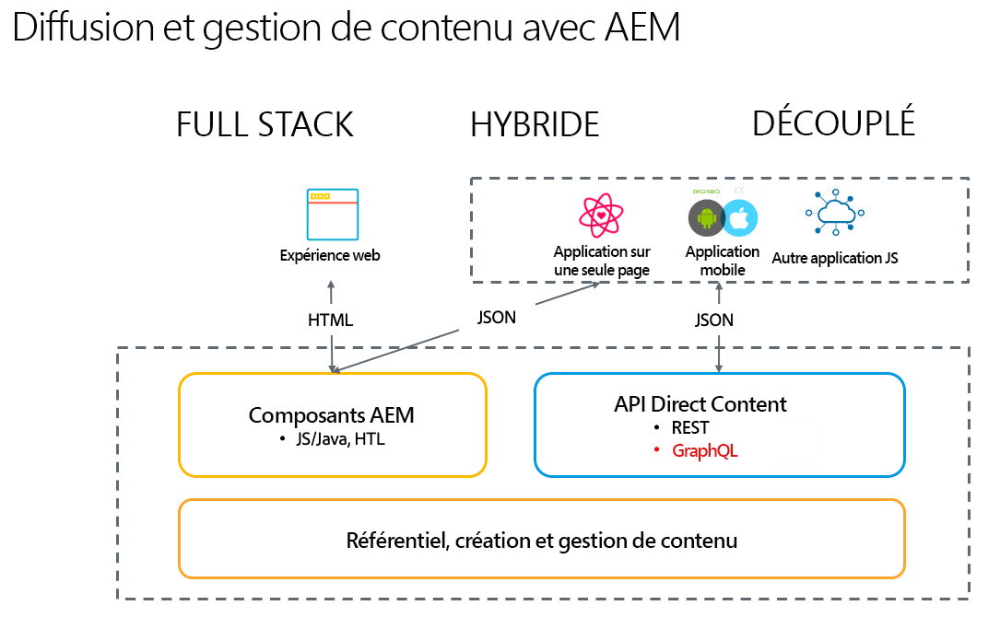

# Développement sans affichage pour AEM 6.5 Sites {#headless-development}

Découvrez comment les puissantes fonctionnalités sans interface d’AEM 6.5 telles que les modèles de contenu, les fragments de contenu et l’API GraphQL fonctionnent ensemble pour vous permettre de gérer vos expériences de manière centralisée et de les diffuser sur plusieurs canaux.

## Présentation {#overview}

L’implémentation découplée devient de plus en plus importante pour offrir des expériences à votre public, où qu’il se trouve et quel que soit son canal.

L’implémentation découplée renonce à la gestion des pages et des composants, comme c’est généralement le cas avec les solutions hybrides et complètes, et se concentre sur la création de fragments de contenu réutilisables et neutres du point de vue du canal, ainsi que sur leur diffusion entre canaux. Il s’agit d’un modèle de développement moderne et dynamique pour l’implémentation d’expériences Web.

## Comparaison entre couplage et découplage {#headful-headless}

Ce document se concentre sur le modèle de mise en œuvre entièrement découplée d’AEM. Pour autant, le choix entre couplage et découplage n’est pas nécessairement binaire dans AEM. Vous pouvez utiliser des fonctions découplées afin de gérer et diffuser votre contenu pour différents points d’entrée tout en permettant aux auteurs de contenu de modifier des applications sur une seule page. Le tout dans AEM.

<!--
>[!TIP]
>
>See the document [Headful and Headless in AEM](/help/implementing/developing/headful-headless.md) for more information.
-->

## AEM 6.5 et sans affichage {#aem-headless}

AEM as a Cloud Service est un outil couple pour le modèle d’implémentation découplée avec trois services puissants :

1. Modèles de contenu
   * Les modèles de contenu sont une représentation structurée du contenu.
   * Ils sont définis par des architectes des informations dans l’éditeur de modèles de fragments de contenu AEM.
   * Les modèles de contenu servent de base aux fragments de contenu.
1. Fragments de contenu
   * Les fragments de contenu sont des instanciations de modèles de contenu.
   * Ils sont créés par les auteurs de contenu à l’aide de l’éditeur de fragments de contenu d’AEM.
   * Ils sont stockés dans AEM Assets et gérés dans l’interface utilisateur d’administration d’Assets.
1. API de contenu pour la diffusion
   * L’API AEM GraphQL prend en charge la diffusion de fragments de contenu.
   * L’API REST AEM Assets prend en charge les opérations CRUD sur les fragments de contenu.
   * La diffusion directe de contenu est également possible avec l’[exportation JSON du composant principal de fragment de contenu.](https://experienceleague.adobe.com/docs/experience-manager-core-components/using/components/content-fragment-component.html?lang=fr)

## Vos premiers pas avec AEM découplé {#first-steps}

Un certain nombre de ressources sont disponibles pour que vous puissiez commencer à utiliser les fonctionnalités d’AEM découplé. Elles sont conçues pour différents cas d’utilisation, mais donnent toutes une vue d’ensemble complète des fonctionnalités d’AEM découplé.

| Ressource | Description | Type | Public | Temps estimé |
|---|---|---|---|---|
| [Prise en main avec le tutoriel pratique d’AEM découplé](https://experienceleague.adobe.com/docs/experience-manager-learn/getting-started-with-aem-headless/graphql/multi-step/overview.html?lang=fr) | **Si vous préférez une approche pratique et que vous connaissez les AEM**, ce tutoriel aborde directement la création d’un projet simple sans tête. | Tutoriel | Développeurs | 2 heures |

<!--
|Resource|Description|Type|Audience|Est. Time|
|---|---|---|---|---|
|[Headless Developer Journey](/help/journey-headless/developer/overview.md)|**For users new to AEM and headless** technologies, start here for a comprehensive introduction to AEM and its headless features from the theory of headless through going live with your first headless project.|Guide|Developers **new to AEM and headless**|1 hour|
|[Headless Getting Started Guide](/help/implementing/developing/headless/getting-started/introduction.md)|**For experienced AEM users** who need a short summary of the key AEM headless features, check out this quick start overview.|Quick Start|Developers, Administrators **with AEM experience**|20 minutes|
|[Getting Started with AEM Headless hands-on tutorial](https://experienceleague.adobe.com/docs/experience-manager-learn/getting-started-with-aem-headless/graphql/multi-step/overview.html)|**If you prefer a hands-on approach and are familiar with AEM**, this tutorial dives directly into creating a simple headless project.|Tutorial|Developers|2 hours|
-->
