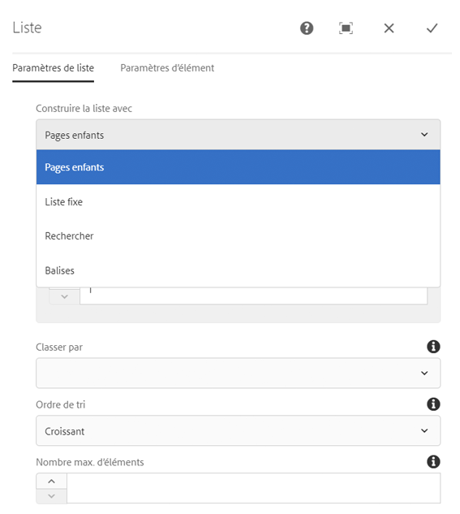
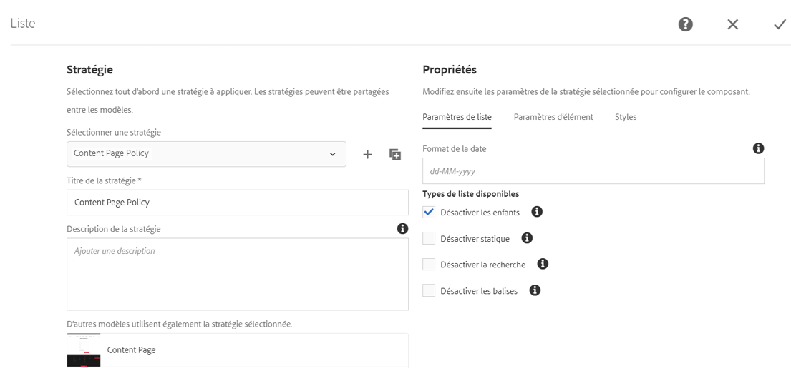
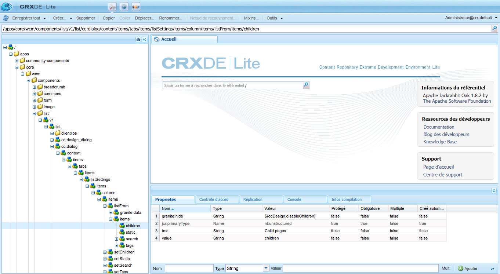
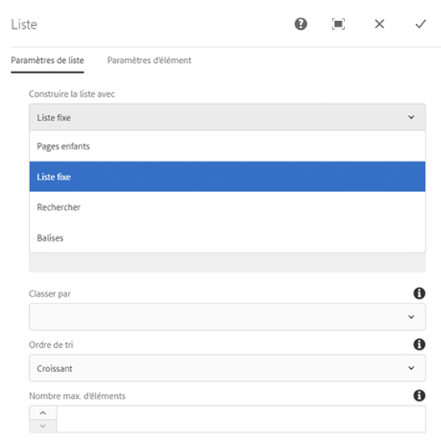

# Utilisation de conditions de masquage {#using-hide-conditions}

Des conditions de masquage peuvent être utilisées pour déterminer si une ressource de composant est rendue ou non. Cela peut être le cas, par exemple, lorsqu’un créateur de modèles configure le composant principal [Composant de liste](https://helpx.adobe.com/experience-manager/core-components/using/list.html) dans l’[éditeur de modèles](/help/sites-authoring/templates.md) et décide de désactiver les options afin de créer la liste sur la base des pages enfants. Si vous désactivez cette option dans la boîte de dialogue de création, une propriété est définie, de sorte que, lorsque le composant de liste est rendu, la condition de masquage soit évaluée et l’option d’affichage des pages enfants ne soit pas présentée.

## Présentation {#overview}

Les boîtes de dialogue peuvent devenir très complexes et contenir de nombreuses options. Cependant, l’utilisateur ne pourra peut-être exploiter qu’une petite partie de celles mises à sa disposition. Cela peut avoir une incidence considérable sur l’expérience utilisateur.

Grâce aux conditions de masquage, les administrateurs, développeurs et super-utilisateurs ont la possibilité de masquer des ressources sur la base d’un ensemble de règles. Cette fonctionnalité permet de déterminer les ressources qui doivent être affichées lorsqu’un auteur modifie le contenu.

>[!NOTE]
>
>Le masquage d’une ressource sur la base d’une expression ne remplace pas les autorisations ACL. Le contenu peut toujours être modifié, mais il n’est pas simplement affiché.

## Détails relatifs à la mise en œuvre et à l’utilisation  {#implementation-and-usage-details}

`com.adobe.granite.ui.components.FilteringResourceWrapper` est chargé de filtrer les ressources en fonction de l’existence et de la valeur de la propriété `granite:hide`, située sur le champ à filtrer. L’implémentation de `/libs/cq/gui/components/authoring/dialog/dialog.jsp` comprend une instance de `FilteringResourceWrapper.`

L’implémentation utilise l’[API ELResolver](https://helpx.adobe.com/fr/experience-manager/6-5/sites/developing/using/reference-materials/granite-ui/api/jcr_root/libs/granite/ui/docs/server/el.html) de Granite et ajoute une variable personnalisée `cqDesign` via ExpressionCustomizer.

Voici quelques exemples de conditions de masquage sur un nœud de conception situé sous `etc/design` ou sous la forme d’une stratégie de contenu.

```
${cqDesign.myProperty}
${!cqDesign.myProperty}
${cqDesign.myProperty == 'someText'}
${cqDesign.myProperty != 'someText'}
${cqDesign.myProperty == true}
${cqDesign.myProperty == true}
${cqDesign.property1 == 'someText' && cqDesign.property2 || cqDesign.property3 != 1 || header.myHeader}
```

Lors de la définition de votre expression de masquage, veuillez tenir compte des points suivants :

* Pour être valide, le domaine dans lequel se trouve la propriété doit être exprimé (`cqDesign.myProperty`, par exemple).
* Les valeurs sont en lecture seule.
* Les fonctions (si nécessaire) doivent être limitées à un ensemble donné fourni par le service.

## Exemple {#example}

Vous trouverez des exemples de conditions de masquage dans AEM et dans les [composants principaux](https://docs.adobe.com/content/help/fr-FR/experience-manager-core-components/using/introduction.html) en particulier. Prenons notamment l’exemple du [composant principal Liste](https://helpx.adobe.com/experience-manager/core-components/using/list.html).

[En utilisant l’éditeur de modèles](/help/sites-authoring/templates.md), l’auteur de modèles peut définir, dans la boîte de dialogue de conception, les options du composant de liste mises à la disposition de l’auteur de pages. Il est ainsi possible d’activer ou de désactiver des options permettant de définir une liste comme étant statique, une liste de pages enfants, une liste de pages balisées, etc.

Si un auteur de modèles choisit de désactiver l’option des pages enfants, une propriété de conception est définie et une condition de masquage est évaluée par rapport à celle-ci, ce qui empêche le rendu de cette option pour l’auteur de pages.

1. Par défaut, l’auteur de la page peut utiliser le composant principal Liste pour créer une liste à l’aide des pages enfants en choisissant l’option **Pages enfants**.

   

1. Dans la boîte de dialogue de création du composant principal Liste, l’auteur de modèles peut sélectionner l’option **Désactiver les enfants** pour éviter que l’option de génération d’une liste sur la base de pages enfants ne soit présentée à l’auteur de pages.

   

1. Un nœud de stratégie est créé sous `/conf/we-retail/settings/wcm/policies/weretail/components/content/list` avec une propriété `disableChildren` définie sur `true`.
1. La condition de masquage est définie comme la valeur d’une propriété `granite:hide` sur le nœud de propriété de boîte de dialogue `/conf/we-retail/settings/wcm/policies/weretail/components/content/list`.

   

1. La valeur de `disableChildren` est extraite de la configuration de conception et l’expression `${cqDesign.disableChildren}` est évaluée sur `false`, ce qui signifie que le rendu de l’option ne sera pas effectué dans le cadre du composant.

   Pour afficher l’expression de masquage en tant que valeur de la propriété `granite:hide` dans GitHub, cliquez [ici](https://github.com/Adobe-Marketing-Cloud/aem-core-wcm-components/blob/master/content/src/content/jcr_root/apps/core/wcm/components/list/v1/list/_cq_dialog/.content.xml#L40).

1. L’option **Pages enfants** n’est plus rendue pour l’auteur de pages lors de l’utilisation du composant de liste.

   
