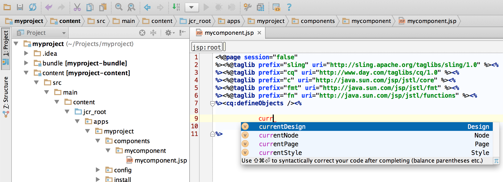

# Développement de projets AEM à l’aide de IntelliJ IDEA{#how-to-develop-aem-projects-using-intellij-idea}

## Présentation {#overview}

Pour commencer le développement d’AEM avec IntelliJ, procédez comme suit :

Chacune des étapes suivantes est expliquée plus en détail dans le reste de cette rubrique d’aide.

* Installation de IntelliJ
* Configuration du projet AEM basé sur Maven
* Préparation de la prise en charge des JSP pour IntelliJ dans le POM Maven
* Importation du projet Maven dans IntelliJ

>[!NOTE]
>
>Ce guide est basé sur IntelliJ IDEA Ultimate Edition 12.1.4 et AEM 5.6.1.

### Installation de IntelliJ IDEA  {#install-intellij-idea}

Téléchargez IntelliJ IDEA depuis la page [des téléchargements de JetBrains](https://www.jetbrains.com/idea/download/index.html).

Puis, suivez les instructions d’installation de cette page.

### Configuration du projet AEM basé sur Maven  {#set-up-your-aem-project-based-on-maven}

Ensuite, configurez votre projet à l’aide de Maven, comme décrit dans la section [Comment créer des projets AEM à l’aide d’Apache Maven](/help/sites-developing/ht-projects-maven.md).

Pour début de travailler avec des projets AEM dans IntelliJ IDEA, la configuration de base de [Prise en main dans 5 minutes](https://maven.apache.org/guides/getting-started/maven-in-five-minutes.html) est suffisante.

### Préparation de la prise en charge des JSP pour IntelliJ IDEA {#prepare-jsp-support-for-intellij-idea}

IntelliJ IDEA peut également fournir une aide pour l’utilisation des JSP, par exemple

* le renseignement automatique des bibliothèques de balises
* connaissance des objets définis par `<cq:defineObjects />` et `<sling:defineObjects />`

Pour que cela fonctionne, suivez les instructions [Comment travailler avec les JSP](/help/sites-developing/ht-projects-maven.md#how-to-work-with-jsps) dans [Comment créer des projets AEM à l&#39;aide d&#39;Apache Maven](/help/sites-developing/ht-projects-maven.md).

### Importation du projet Maven {#import-the-maven-project}

1. Ouvrez la boîte de dialogue **Importer** dans IntelliJ IDEA par

   * sélection de **Importer un projet** dans l&#39;écran de bienvenue si vous n&#39;avez pas encore ouvert de projet
   * sélection de **Fichier -> Importer un projet** dans le menu principal

1. Dans la boîte d’importation, sélectionnez le fichier POM du projet.

   

1. Continuez avec les paramètres par défaut comme indiqué dans la boîte de dialogue ci-dessous.

   

1. Passez à la boîte de dialogue suivante en cliquant sur **Suivant** et **Terminer**.
1. Vous êtes désormais prêt pour le développement d’AEM à l’aide de IntelliJ IDEA

   

### Débogage des JSP avec IntelliJ IDEA {#debugging-jsps-with-intellij-idea}

Les étapes suivantes sont requises pour le débogage des JSPs avec IntelliJ IDEA

* Configuration d’une facette Web dans le projet
* Installation du plugin de prise en charge de JSR45
* Configuration d’un profil de débogage
* Configuration d’AEM pour le mode débogage

#### Configuration d’une facette Web dans le projet  {#set-up-a-web-facet-in-the-project}

IntelliJ IDEA doit comprendre où trouver les JSP pour débogage. Comme IDEA ne peut pas interpréter les paramètres `content-package-maven-plugin`, ils doivent être configurés manuellement.

1. Accédez à **Fichier -> Structure du projet**
1. Sélectionnez le module **Contenu**.
1. Cliquez sur **+** au-dessus de la liste des modules et sélectionnez **Web**.
1. En tant que répertoire de ressources Web, sélectionnez `content/src/main/content/jcr_root subdirectory` de votre projet comme le montre la capture d&#39;écran ci-dessous.


#### Installation du plugin de prise en charge de JSR45 {#install-the-jsr-support-plugin}

1. Accédez au volet **Plugins** des paramètres IntelliJ IDEA
1. Accédez au **module externe d’intégration JSR45** et cochez la case en regard de celui-ci.
1. Cliquez sur **Appliquer**
1. Redémarrez IntelliJ IDEA lorsque vous y êtes invité


#### Configuration d’un profil de débogage {#configure-a-debug-profile}

1. Accédez à **Exécuter -> Modifier les configurations**
1. Appuyez sur **+** et sélectionnez **JSR45 Remote**.
1. Dans la boîte de dialogue de configuration, sélectionnez **Configurer** en regard de **Application Server** et configurez un serveur générique.
1. Définissez la page de démarrage sur une URL appropriée si vous souhaitez ouvrir un navigateur lorsque vous commencez le débogage.
1. Supprimez toutes les **tâches** avant de lancer si vous utilisez la synchronisation automatique vlt ou configurez les tâches Maven appropriées si vous ne le faites pas.
1. Dans le volet **Démarrage/Connexion**, ajustez le port si nécessaire.
1. Copiez les arguments de ligne de commande que IntelliJ IDEA propose

 

#### Configuration d’AEM pour le mode débogage {#configure-aem-for-debug-mode}

La dernière étape requise consiste à démarrer AEM avec les options JVM proposées par IntelliJ IDEA.

Vous pouvez réaliser cette opération en lançant le fichier jar AEM directement et en ajoutant ces options, par exemple avec la ligne de commande suivante :

`java -Xdebug -Xrunjdwp:transport=dt_socket,address=58242,suspend=n,server=y -Xmx1024m -XX:MaxPermSize=256M -jar cq-quickstart-5.6.1.jar`

Vous pouvez également ajouter ces options au script de démarrage dans `crx-quickstart/bin/start` comme indiqué ci-dessous.

```shell
# ...

# default JVM options
if [ -z "$CQ_JVM_OPTS" ]; then
 CQ_JVM_OPTS='-server -Xmx1024m -XX:MaxPermSize=256M -Djava.awt.headless=true'
fi

CQ_JVM_OPTS="$CQ_JVM_OPTS -Xdebug -Xrunjdwp:transport=dt_socket,address=58242,suspend=n,server=y"

# ...
```

#### Lancement du débogage {#start-debugging}

Vous êtes désormais prêt à déboguer les JSP dans AEM.

1. Sélectionnez **Exécuter -> Débogage -> Votre Profil de débogage**
1. Définissez des points d’arrêt dans le code du composant
1. Accédez à une page du navigateur


### Débogage des lots avec IntelliJ IDEA {#debugging-bundles-with-intellij-idea}

Le code des lots peut être débogué à l’aide d’une connexion de débogage à distance générique standard. Vous pouvez consulter la [documentation Jetbrain sur le débogage à distance](https://www.jetbrains.com/idea/webhelp/run-debug-configuration-remote.html).
