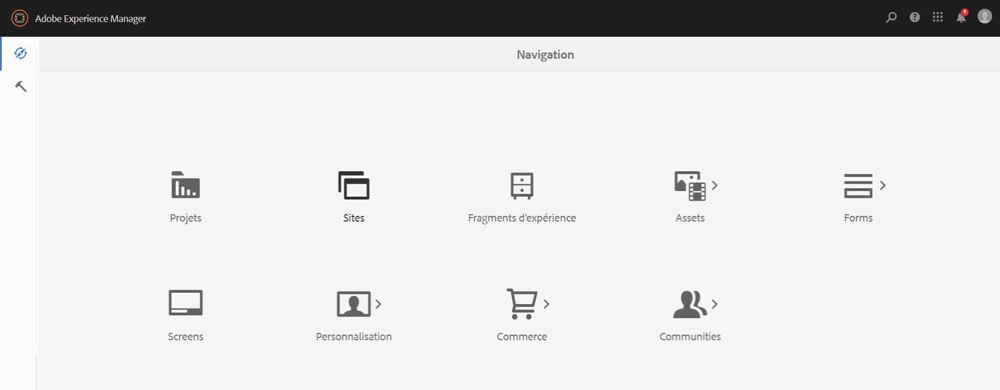
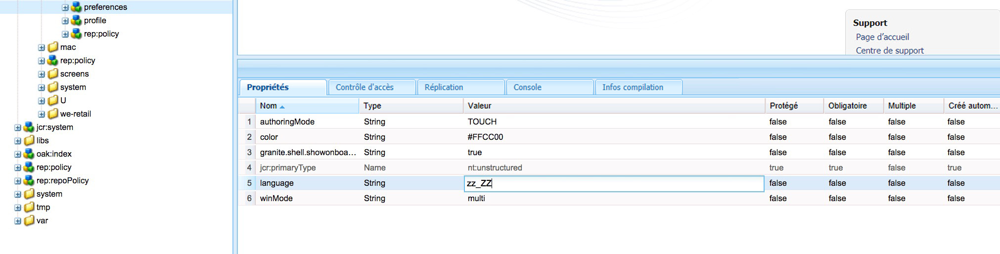

# Internationalisation des chaînes d’interface utilisateur {#internationalizing-ui-strings}

Les API Java et JavaScript vous permettent d’internationaliser des chaînes dans les types de ressources suivants :

* Fichiers sources Java.
* Scripts JSP.
* JavaScript dans les bibliothèques côté client ou dans la source de la page.
* Valeurs de propriété de nœud JCR utilisées dans les propriétés de configuration de composants et de boîtes de dialogue.

Pour obtenir un aperçu du processus d’internationalisation et de localisation, reportez-vous à la section [Internationalisation de composants](/help/sites-developing/i18n.md).

## Internationalisation de chaînes dans le code Java et JSP  {#internationalizing-strings-in-java-and-jsp-code}

Le package Java `com.day.cq.i18n` vous permet d&#39;afficher des chaînes localisées dans votre interface utilisateur. La classe `I18n` fournit la méthode `get` qui récupère les chaînes localisées du dictionnaire d&#39;AEM. Le seul paramètre requis de la méthode `get` est le littéral de chaîne en langue anglaise. L’anglais est la langue par défaut de l’interface utilisateur. L’exemple suivant localise le mot `Search` :

`i18n.get("Search");`

L’identification de la chaîne en anglais diffère des structures d’internationalisation standard où un ID identifie une chaîne et est utilisé pour référencer la chaîne lors de l’exécution. L’utilisation du littéral de chaîne anglais présente les avantages suivants :

* Le code est facile à comprendre.
* La chaîne dans la langue par défaut est toujours disponible.

### Définition de la langue de l’utilisateur  {#determining-the-user-s-language}

Pour déterminer la langue de préférence de l’utilisateur, deux méthodes peuvent être utilisées :

* Pour les utilisateurs authentifiés, déterminez la langue dans les préférences du compte utilisateur.
* Paramètre régional de la page demandée.

La propriété language du compte utilisateur est la méthode privilégiée, car elle est plus fiable. Cependant, pour pouvoir l’employer, l’utilisateur doit être connecté.

#### Création de l’objet Java I18n  {#creating-the-i-n-java-object}

La classe I18n fournit deux constructeurs. Le constructeur à utiliser dépend du mode de définition de la langue par défaut de l’utilisateur.

Pour afficher la chaîne dans la langue spécifiée dans le compte utilisateur, utilisez le constructeur suivant (après avoir importé `com.day.cq.i18n.I18n)` :

```java
I18n i18n = new I18n(slingRequest);
```

Le constructeur utilise l’objet `SlingHTTPRequest` pour récupérer le paramètre de langue de l’utilisateur.

Pour utiliser le paramètre régional de la page afin de déterminer la langue, vous devez d’abord obtenir le ResourceBundle relatif à la langue de la page demandée :

```java
Locale pageLang = currentPage.getLanguage(false);
ResourceBundle resourceBundle = slingRequest.getResourceBundle(pageLang);
I18n i18n = new I18n(resourceBundle);
```

#### Internationalisation d’une chaîne  {#internationalizing-a-string}

Utilisez la méthode `get` de l&#39;objet `I18n` pour internationaliser une chaîne. Le seul paramètre requis de la méthode `get` est la chaîne à internationaliser. La chaîne correspond à une chaîne d’un dictionnaire de traduction. La méthode get recherche la chaîne dans le dictionnaire et renvoie la traduction pour la langue en cours.

Le premier argument de la méthode `get` doit respecter les règles suivantes :

* La valeur doit être un littéral de chaîne. Une variable de type `String` n’est pas acceptable.
* Le littéral de chaîne doit être exprimé sur une seule ligne.
* La chaîne est sensible à la casse.

```xml
i18n.get("Enter a search keyword");
```

#### Utilisation d’indices de traduction  {#using-translation-hints}

Spécifiez l’[indice de traduction](/help/sites-developing/i18n-translator.md#adding-changing-and-removing-strings) de la chaîne internationalisée afin de faire la distinction entre les chaînes en double dans le dictionnaire. Utilisez le second paramètre facultatif de la méthode `get` pour fournir l&#39;indicateur de traduction. L’indice de traduction doit correspondre exactement à la propriété Comment de l’élément dans le dictionnaire.

Par exemple, le dictionnaire contient deux occurrences de la chaîne `Request` : l’une sous la forme d’un verbe et l’autre sous la forme d’un substantif. Le code suivant inclut l’indice de traduction en tant qu’argument dans la méthode `get` :

```java
i18n.get("Request","A noun, as in a request for a web page");
```

#### Insertion de variables dans des phrases localisées {#including-variables-in-localized-sentences}

Insérez des variables dans la chaîne localisée pour renforcer la signification contextuelle dans une phrase. Par exemple, après vous être connecté à une application web, la page d’accueil affiche le message « Bienvenue à l’administrateur. Vous avez 2 messages dans votre boîte de réception. » Le contexte de page détermine le nom d’utilisateur et le nombre de messages.

[Dans le dictionnaire](/help/sites-developing/i18n-translator.md#adding-changing-and-removing-strings), les variables sont représentées dans des chaînes sous la forme d’index entre crochets. Spécifiez les valeurs des variables en tant qu&#39;arguments de la méthode `get`. Les arguments sont placés après l’indice de traduction et les index correspondent à l’ordre des arguments :

```xml
i18n.get("Welcome back {0}. You have {1} messages.", "user name, number of messages", user.getDisplayName(), numItems);
```

La chaîne internationalisée et l’indice de traduction doivent correspondre exactement à la chaîne et au commentaire dans le dictionnaire. Vous pouvez omettre l’indice de traduction en fournissant une valeur `null` comme deuxième argument.

#### Utilisation de méthode get statique {#using-the-static-get-method}

La classe `I18N`définit une méthode `get` statique qui s’avère utile lorsque vous devez localiser un petit nombre de chaînes. Outre les paramètres de la méthode `get` d’un objet, la méthode statique nécessite l’objet `SlingHttpRequest` ou le `ResourceBundle` que vous utilisez, suivant la manière dont vous déterminez la langue par défaut de l’utilisateur :

* Utilisation de la préférence de langue de l’utilisateur : indiquez l’objet SlingHttpRequest comme premier paramètre.

   `I18n.get(slingHttpRequest, "Welcome back {}. You have {} messages.", "user name, number of messages", user.getDisplayName(), numItems);`
* Utilisation de la langue de la page : indiquez ResourceBundle comme premier paramètre.

   `I18n.get(resourceBundle,"Welcome back {}. You have {} messages.", "user name, number of messages", user.getDisplayName(), numItems);`

### Internationalisation des chaînes dans le code JavaScript {#internationalizing-strings-in-javascript-code}

L’API JavaScript vous permet de localiser des chaînes sur le client. Comme pour le code [Java et JSP](#internationalizing-strings-in-java-and-jsp-code), l’API JavaScript vous permet d’identifier les chaînes à localiser, de fournir des conseils de localisation et d’inclure des variables dans les chaînes localisées.

Le dossier de bibliothèques clientes`granite.utils` [](/help/sites-developing/clientlibs.md) fournit l’API JavaScript. Pour utiliser l’API, vous devez inclure ce dossier sur votre page. Les fonctions de localisation utilisent l&#39;espace de nommage `Granite.I18n`.

Avant de présenter des chaînes localisées, vous devez définir le paramètre régional à l’aide de la fonction `Granite.I18n.setLocale`. Pour cette fonction, le code de langue du paramètre régional doit être défini comme argument :

```
Granite.I18n.setLocale("fr");
```

Pour présenter une chaîne localisée, utilisez la fonction `Granite.I18n.get` :

```
Granite.I18n.get("string to localize");
```

L’exemple suivant internationalise la chaîne « Welcome back » :

```
Granite.I18n.setLocale("fr");
Granite.I18n.get("string to localize", [variables], "localization hint");
```

Les paramètres de la fonction sont différents de la méthode Java I18n.get :

* Le premier paramètre est le littéral de chaîne à localiser.
* Le deuxième paramètre est un tableau de valeurs à injecter dans le littéral de chaîne.
* Le troisième paramètre est l’indice de localisation.

L’exemple suivant utilise JavaScript pour localiser la phrase « Welcome back Administrator. You have 2 messages in your inbox. »  :

```
Granite.I18n.setLocale("fr");
Granite.I18n.get("Welcome back {0}. You have {1} new messages in your inbox.", [username, numMsg], "user name, number of messages");
```

### Internationalisation de chaînes à partir de nœuds JCR  {#internationalizing-strings-from-jcr-nodes}

Les chaînes d’interface utilisateur sont souvent basées sur les propriétés du nœud JCR. Par exemple, la propriété `jcr:title` d’une page est généralement utilisée comme contenu de l’élément `h1` dans le code de la page. La classe `I18n` fournit la méthode `getVar` pour localiser ces chaînes.

L’exemple de script JSP suivant récupère la propriété `jcr:title` du référentiel et affiche la chaîne localisée sur la page :

```java
<% title = properties.get("jcr:title", String.class);%>
<h1><%=i18n.getVar(title) %></h1>
```

#### Définition d’indices de traduction pour les nœuds JCR {#specifying-translation-hints-for-jcr-nodes}

À l’instar des [indices de traduction dans l’API Java](#using-translation-hints), vous pouvez fournir des indices pour faire la distinction entre des chaînes en double dans le dictionnaire. Fournissez l’indice de traduction en tant que propriété du nœud qui contient la propriété internationalisée. Le nom de la propriété hint est composé du nom de la propriété internationalisée avec le suffixe `_commentI18n` :

`${prop}_commentI18n`

Par exemple, un nœud `cq:page` comprend la propriété jcr:title en cours de localisation. L’indice est fourni comme valeur de la propriété nommée jcr:title_commentI18n.

### Test de la couverture d’internationalisation  {#testing-internationalization-coverage}

Testez si vous avez internationalisé l’ensemble des chaînes de votre interface utilisateur. Pour afficher les chaînes qui sont couvertes, définissez la langue de l’utilisateur sur zz_ZZ et ouvrez l’IU dans le navigateur web. Les chaînes internationalisées apparaissent avec une traduction souche au format suivant :

`USR_*Default-String*_尠`

La capture d’écran ci-dessous illustre la traduction souche pour la page d’accueil d’AEM :



Pour définir la langue de l’utilisateur, configurez la propriété language du nœud preferences du compte utilisateur.

Le chemin d’accès du nœud preferences d’un utilisateur se présente comme suit :

`/home/users/<letter>/<hash>/preferences`



