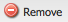

# Utilisation du traducteur pour gérer les dictionnaires{#using-translator-to-manage-dictionaries}

AEM fournit une console pour gérer les traductions des textes utilisés dans l’interface utilisateur du composant. Cette console est disponible à l’adresse

`https://<hostname>:<port-number>/libs/cq/i18n/translator.html`

Utilisez l’outil Traducteur pour gérer les chaînes de caractères anglaises, ainsi que leurs traductions. Les dictionnaires sont créés dans le référentiel, par exemple /apps/myproject/i18n.

Notez que l’outil Traducteur et les dictionnaires que vous gérez servent à présenter l’interface utilisateur du composant dans différentes langues. Si vous souhaitez traduire une page ou du contenu généré par l’utilisateur, reportez-vous aux sections [Traduction de contenu pour des sites multilingues](/help/sites-administering/translation.md) et [Traduction de contenu généré par l’utilisateur](/help/communities/translate-ugc.md).

>[!CAUTION]
>
>Only edit dictionaries that are created for your project and reside under `/apps`.
>
>Les dictionnaires système AEM sont également disponibles dans cet outil. Ne modifiez pas les dictionnaires système AEM, car cela risque de poser des problèmes avec l’interface utilisateur AEM. De plus, vous risquez de perdre les modifications au cours d’une mise à niveau. AEM system dictionaries are located under `/libs`.

>[!NOTE]
>
>Bien que l’outil Translator dispose d’une interface utilisateur classique, elle est utilisée pour la traduction d’expressions, quelle que soit l’interface dans laquelle elles se trouvent.

Le traducteur répertorie les textes utilisés dans AEM avec les diverses traductions correspondantes :


Vous pouvez rechercher, filtrer et modifier des textes anglais et traduits. Vous pouvez également exporter des dictionnaires au format XLIFF en vue de la traduction, puis réimporter les traductions dans les dictionnaires.

Il est également possible d’ajouter les dictionnaires i18n à un projet de traduction à partir de cette console. Vous pouvez soit en créer un nouveau ou l’ajouter à un projet existant.

1. Cliquez sur **Traduire le dictionnaire**.

   

1. Sélectionnez l’option Créer ou Ajouter suivant vos besoins. Une boîte de dialogue s’ouvre.

   

1. Renseignez les champs suivant les besoins et cliquez ensuite sur OK. 

1. Vous pouvez à présent cliquer sur **OK** ou consulter le dictionnaire cible.

   >[!NOTE]
   >
   >Pour plus d’informations sur les projets de traduction, voir [Gestion des projets de traduction](/help/sites-administering/tc-manage.md).

## Création d’un dictionnaire {#creating-a-dictionary}

Créez un dictionnaire pour gérer vos chaînes d’IU localisées. Après avoir créé un dictionnaire, vous pouvez utiliser l’outil de traduction pour le gérer.

1. À l’aide de CRXDE Lite, ajoutez le nœud racine (`sling:Folder`) de votre nouveau dictionnaire comme structure de stockage des définitions de langue :

   ` /apps/<projectName>/i18n`

   Par exemple, `/apps/myProject/i18n`

1. Ajoutez la structure de langues requise sous ce nœud : Par exemple :

   ```shell
   /apps/myProject/i18n [sling:Folder]
       - de.json [nt:file] [mix:language]
           + jcr:language = de
       - fr.json [nt:file] [mix:language]
           + jcr:language = fr
   ```

   >[!NOTE]
   >
   >Il s’agit de la structure du [module Sling i18n](https://sling.apache.org/site/internationalization-support.html).

1. Reload the translator and the dictionary path (e.g. `/apps/myProject/i18n`) will be available in the drop-down selector in the toolbar. Sélectionnez-le pour commencer à ajouter des chaînes et leurs traductions.

   >[!NOTE]
   >
   >The translator will only save translations for languages that are actually present underneath the path (e.g. `/apps/myProject/i18n`).
   >
   >Vérifiez que ces langues correspondent à celles affichées dans la grille.

## Gestion des chaînes de dictionnaire {#managing-dictionary-strings}

Utilisez l’outil de traduction pour gérer les chaînes de caractères de vos dictionnaires. Vous pouvez ajouter, modifier et supprimer des chaînes en anglais et fournir également des chaînes traduites.

>[!CAUTION]
>
>Only edit dictionaries that are created for your project and reside under `/apps`.
>
>Ne modifiez pas les dictionnaires système AEM, car cela risque de poser des problèmes avec l’interface utilisateur AEM. De plus, vous risquez de perdre les modifications au cours d’une mise à niveau. AEM system dictionaries are located under `/libs`.

### Ajout, modification et suppression de chaînes {#adding-changing-and-removing-strings}

Ajoutez des chaînes anglaises à un dictionnaire que votre composant a internationalisées. Ajoutez uniquement des chaînes qui sont internationalisées afin de ne pas gaspiller des ressources en traduisant des chaînes qui ne sont pas utilisées.

Les chaînes que vous ajoutez à un dictionnaire doivent correspondre exactement à celle qui est spécifiée dans le code. Si la chaîne anglaise par défaut qui est utilisée dans le code ne correspond pas à la chaîne anglaise figurant dans un dictionnaire, la chaîne traduite n’apparaît pas dans l’interface utilisateur lorsque cela s’avère nécessaire. Les chaînes sont sensibles à la casse.

**Fournir des indications pour la traduction**

Utilisez la propriété Comment de la chaîne du dictionnaire pour fournir au traducteur des informations sur la signification de la chaîne. En règle générale, l’IU aide les utilisateurs à déterminer la signification des mots ambigus. Cependant, le traducteur ne voit pas la chaîne dans le contexte de l’interface utilisateur. L’indice de traduction permet de lever toute ambiguïté. Par exemple, un commentaire aide le traducteur à comprendre que le mot anglais Request est utilisé comme nom plutôt que comme verbe.

Les indices de traduction permettent également de différencier les chaînes qui sont identiques, mais qui ont des significations différentes. Par exemple, le terme « Search » peut être un substantif ou un verbe ; deux entrées « Search » sont donc requises dans le dictionnaire avec deux indices de traduction différents. Le code qui demande la chaîne contient également l’indice de traduction, de sorte que la chaîne correcte soit utilisée dans l’interface utilisateur.

**Insertion de variables indexées**

Insérez des variables dans la chaîne localisée pour renforcer la signification contextuelle dans une phrase. Par exemple, après vous être connecté à une application web, la page d’accueil affiche le message « Bienvenue à l’administrateur. Vous avez 2 messages dans votre boîte de réception. » Le contexte de page détermine le nom d’utilisateur et le nombre de messages.

Pour inclure des variables dans la chaîne localisée, placez les index entre crochets à l’emplacement des variables dans le premier argument de la méthode get. Utilisez l’indice de localisation pour décrire les valeurs. Le traducteur doit comprendre la signification des variables, car les structures de phrase varient en fonction de la langue.

Notez que le [code qui demande la chaîne traduite](/help/sites-developing/i18n-dev.md#including-variables-in-localized-sentences) fournit des valeurs pour les variables indexées en fonction du contexte.

Par exemple, la chaîne suivante s’affiche lorsqu’un utilisateur se connecte à un site Web et est inclus dans le dictionnaire :

`Welcome back {0}. You have {1} messages.`

Le commentaire suivant décrit les variables :

`{0} = the user name, {1} = the number of items in the user's inbox`

**Modification de chaînes**

Vous pouvez modifier ou supprimer des chaînes anglaises à mesure qu’elles sont modifiées ou supprimées dans le code. Lorsque vous modifiez une chaîne, la chaîne d’origine est conservée et une nouvelle chaîne est créée pour tenir compte de la modification. Avant de supprimer une chaîne, assurez-vous qu’aucun code ne l’utilise.

Procédez comme suit pour ajouter une chaîne.

1. Dans le menu déroulant Dictionnaires, sélectionnez le dictionnaire auquel vous ajoutez une chaîne. Dans le menu déroulant, les dictionnaires sont représentés par leur chemin d’accès dans le référentiel.
1. Au-dessus du tableau Chaînes et traductions, cliquez sur Ajouter.

   

1. Dans la zone Chaîne de la boîte de dialogue Ajouter une chaîne, saisissez la chaîne anglaise. Dans la zone Commentaire, saisissez un indice de traduction à l’intention du traducteur, si nécessaire.
1. Cliquez sur OK.
1. Cliquez sur Enregistrer.

   

Procédez comme suit pour modifier une chaîne dans un dictionnaire.

1. Dans le menu déroulant Dictionnaires, sélectionnez le dictionnaire qui contient la chaîne à modifier.
1. Double-cliquez sur la chaîne à modifier.
1. Dans la boîte de dialogue Modifier la chaîne, sélectionnez Modifier la chaîne ou le commentaire (Crée une copie).

   

1. Modifiez la chaîne ou le commentaire, puis cliquez sur OK.
1. Cliquez sur Enregistrer.

   

Procédez comme suit pour supprimer une chaîne d’un dictionnaire.

1. Dans le menu déroulant Dictionnaires, sélectionnez le dictionnaire duquel vous souhaitez supprimer une chaîne.
1. Cliquez sur Supprimer.

   

1. Cliquez sur Enregistrer.

   

### Recherche de chaînes {#searching-for-strings}

La barre de recherche située au bas de l’outil Traducteur fournit des options de sélection de chaînes :

* **Filtrer par texte :** Un modèle à associer à la chaîne, au commentaire ou aux traductions en anglais. Seuls les éléments qui correspondent à l’ensemble ou à une partie du schéma s’affichent dans le tableau.
* **Modifications : Tout, Modifié, Nouveau, Supprimé :** Afficher les éléments qui ont été modifiés et non enregistrés.

   * N’importe lequel : affiche les éléments qui ont été modifiés, ajoutés ou supprimés.
   * Modifié : affiche les éléments qui ont été modifiés.
   * Nouveau : affiche les éléments qui ont été ajoutés.
   * Supprimé : affiche les éléments qui doivent être supprimés.
   * Sélections multiples : affiche les éléments qui possèdent toutes les propriétés sélectionnées.

* **Avec commentaire** : affiche les éléments qui comportent des commentaires à l’intention des traducteurs.
* **Traductions manquantes** : affiche les éléments pour lesquels il n’existe pas de traduction pour au moins une langue.


1. Sélectionnez les options de filtrage dans la barre de recherche.
1. Pour effectuer un filtrage à l’aide des options, cliquez sur Filtrer.
1. Pour supprimer les filtres et afficher tous les éléments du dictionnaire, cliquez sur Effacer.

### Modification des chaînes traduites {#editing-translated-strings}

Une fois que vous avez ajouté la chaîne anglaise à un dictionnaire, vous pouvez ajouter les traductions de cette chaîne. Vous pouvez également [exporter le dictionnaire](/help/sites-developing/i18n-translator.md#exporting-a-dictionary) pour qu’il soit traduit par un tiers.

1. Sélectionnez [le dictionnaire propre à votre projet](#creating-a-dictionary), car il spécifie le chemin d’accès dans le référentiel qui contient les traductions. Sélectionnez, par exemple, **Dictionaries** (Dictionnaires) en tant que :

   `/apps/myProject/i18n`

   >[!CAUTION]
   >
   >Only edit dictionaries that are created for your project and reside under `/apps`.
   >
   >Les dictionnaires système AEM sont également disponibles dans cet outil. Ne modifiez pas les dictionnaires système AEM, car cela risque de poser des problèmes avec l’interface utilisateur AEM. De plus, vous risquez de perdre les modifications au cours d’une mise à niveau. AEM system dictionaries are located under `/libs`.

1. Pour modifier les textes traduits pour l’une des chaînes, vous pouvez effectuer l’une des opérations suivantes :

   * Double-cliquez sur la langue adéquate de la chaîne requise pour modifier ce texte :

   

   * Double-cliquez sur le champ **String** (Chaîne) ou **Comment** (Commentaire) de la chaîne requise pour ouvrir la boîte de dialogue **Edit string** (Modifier la chaîne). Modifiez les traductions, puis cliquez sur **OK** pour fermer la boîte de dialogue :

   

1. Cliquez sur **Save** (Enregistrer) pour valider vos modifications.

   >[!NOTE]
   >
   >Si vous cliquez sur **Reset &amp; Refresh** (Réinitialiser et actualiser) (au lieu de **Save**), les textes précédents sont rétablis.

## Utilisation de service de traduction tiers {#using-third-party-translators}

Pour prendre en charge l’utilisation de services de traduction tiers, l’outil de traduction vous permet d’exporter et d’importer des dictionnaires.

### Exportation d’un dictionnaire {#exporting-a-dictionary}

Exportez un dictionnaire sous la forme d’un fichier XLIFF afin qu’un service tiers puisse traduire les chaînes qu’il contient.

* Exportez un dictionnaire anglais, et insérez les termes anglais et les traductions correspondantes.
* Exportez une partie ou l’ensemble des chaînes anglaises.

Lorsque vous exportez un fichier XLIFF et insérez une langue, la structure des nœuds du dictionnaire dans le référentiel doit inclure cette langue. Si la langue n’est pas incluse, des erreurs se produisent. Par exemple, pour exporter le fichier XLIFF français, le dossier de dictionnaire doit inclure le nœud enfant `mix:language` nommé `fr` (See [Creating a Dictionary](/help/sites-developing/i18n-translator.md#creating-a-dictionary).)

Procédez comme suit pour exporter un fichier XLIFF pour une langue donnée.

1. Ouvrez l’outil de traduction `http://<host>:<port>/libs/cq/i18n/translator.html`
1. Dans le menu déroulant Dictionnaires, sélectionnez le dictionnaire à exporter.
1. Cliquez sur Exporter > Exporter les options Xliff *XX* complètes, où *XX* correspond au code de langue en deux lettres, tel que DE ou FR.

   Le fichier XLIFF s’ouvre dans un nouvel onglet ou une nouvelle fenêtre.

1. Utilisez les commandes du navigateur web pour enregistrer la page en tant que fichier sur votre système de fichiers ; Fichier > Enregistrer sous, par exemple.

Procédez comme suit pour exporter une partie ou l’ensemble des chaînes anglaises.

1. Ouvrez l’outil de traduction. `http://<host>:<port>/libs/cq/i18n/translator.html`
1. Dans le menu déroulant Dictionnaires, sélectionnez le dictionnaire à exporter.
1. Si vous exportez un sous-ensemble des chaînes, sélectionnez les éléments du dictionnaire à exporter. Si vous ne sélectionnez aucun élément, tous sont exportés.
1. Cliquez sur Exporter > Exporter la sélection au format Xliff (chaînes uniquement).
1. Dans la boîte de dialogue qui s’affiche, copiez le texte et collez-le dans un fichier texte.

### Importation d’un dictionnaire {#importing-a-dictionary}

Importez un fichier XLIFF dans un dictionnaire pour remplir ce dernier. Si le dictionnaire contient une traduction pour une chaîne anglaise et que le fichier XLIFF contient une traduction différente pour la même chaîne, la traduction du dictionnaire est remplacée.

1. Ouvrez l’outil de traduction `http://<host>:<port>/libs/cq/i18n/translator.html`
1. Cliquez sur Importer > Traductions XLIFF.
1. Sélectionnez le fichier à importer, puis cliquez sur OK.

## Gestion des langues prises en charge {#managing-supported-lanuages}

Ajoutez ou supprimez des langues prises en charge par l’outil de traduction et fournies aux utilisateurs de vos pages web.

### Modification des langues répertoriées dans le tableau de dictionnaire {#changing-languages-listed-in-the-dictionary-table}

L’outil Translator inclut les langues suivantes dans le tableau du dictionnaire :

* de - Allemand
* fr - Français
* it - Italien
* es - Espagnol
* ja - Japonais
* pt-br - Portugais (Brésil)
* zh-cn - Chinois simplifié
* zh-tw - Chinois traditionnel (prise en charge limitée)
* ko-kr - Coréen

Procédez comme suit pour ajouter ou supprimer des langues.

1. À l’aide de CRXDE Lite, créez un nœud :

   `/etc/languages`

1. Sur ce nœud, créez une propriété :

   * **Nom** : `languages`
   * **Type** : `Multi-String`
   * **Value** : liste des langues à afficher. Par exemple :

      * fr
      * es

   >[!NOTE]
   >
   >Les codes de langue doivent être en minuscules.

1. Cliquez sur **Save All** (Enregistrer tout) dans CRXDE Lite, puis rechargez le traducteur. La grille est mise à jour pour afficher les langues définies.

   >[!NOTE]
   >
   >The translator will only save translations for languages that are actually [present in the dictionary](#creating-a-dictionary) (i.e. underneath the dictionary path such as `/apps/myProject/i18n`).
   >
   >Vérifiez que ces langues correspondent à celles affichées dans la grille.

### Mise à disposition des langues pour les auteurs {#making-languages-available-to-authors}

After defing a dictionary for a language new to your AEM instance you need to make this available for selection by the authors (for example, for use in **Preferences**):

1. Pour modifier la liste des langues disponibles dans l’option **Preferences** (Préférences) de la console **Security** (Sécurité) :

   1. Créez une superposition dans le code de votre application pour :

      ```
              /libs/cq/security/widgets/source/widgets/security/Preferences.js
       and update as required.
      ```

1. Pour que la langue soit disponible dans **Preferences** (Préférences) de la console **Websites** (Sites web), vous devez apporter les modifications suivantes à votre application :

   1. Créez une superposition pour la structure sous :

      `/libs/cq/security/content/tools/userProperties`

   1. Dans la superposition, mettez à jour la liste des langues sous :

      `items/common/items /lang/options`

1. Enregistrez toutes les modifications et rechargez la console adéquate.

### Modification des noms de langue et des pays par défaut {#changing-language-names-and-default-countries}

Plusieurs pays peuvent utiliser une même langue. Par exemple, les États-Unis, le Royaume-Uni et l’Australie utilisent l’anglais. This is indicated by a code indicating both language and country such as `en_US`, `en_GB` and `en_AU`.

Les pays par défaut sont utilisés lors de l’affichage de drapeaux (dans la boîte de dialogue de copie des langues, par exemple). Ils sont utilisés pour résoudre le pays pour un code de langue.

>[!NOTE]
>
>Pour les localisations, telles qu’elles sont gérées par le traducteur ci-dessus, seule la langue exacte fonctionne. If the language preference drop down uses `en_uk`, there must be a `en_uk` dictionary in the repository.

Pour modifier les définitions par défaut, procédez comme suit :

1. Une liste des langues est stockée sous :

   `/libs/wcm/core/resources/languages`

   Superposez-la en la copiant dans :

   `/apps/wcm/core/resources/languages`

   Modifiez ou étendez ensuite la liste. The property `defaultCountry` on a language node (e.g. `ja`) must contain the full code, such as `ja_jp`, which would define `jp` as the default country for the language `ja`.

1. Mettez à jour **CQ WCM Language Manager**.

   * **Language list** (Liste des langues) :

      chemin d’accès à la liste des langues dans le référentiel. Définissez cette variable sur l’emplacement utilisé pour le recouvrement :

      ```
             /apps/wcm/core/resources/languages
      ```
   Vous pouvez effectuer cette opération à l’aide de la console web OSGi :

   ```shell
   https://<hostname>:<port-number>/system/console/configMgr/com.day.cq.wcm.core.impl.LanguageManagerImpl
   ```

## Publication de dictionnaires {#publishing-dictionaries}

Incorporez vos dictionnaires dans le processus de gestion des versions de vos applications AEM. Vous pouvez, par exemple, inclure le dictionnaire dans le module de contenu de votre application en vue d’un déploiement sur l’instance de publication. Cette stratégie offre les avantages suivants :

* Les dictionnaires sont disponibles pour les composants dans leur environnement de publication.
* Les modifications apportées aux chaînes d’IU du composant sont déployées avec les traductions mises à jour.

De même, le test des chaînes du dictionnaire doit être effectué dans le cadre du cycle de développement habituel du logiciel.

>[!NOTE]
>
>La fonctionnalité de publication régulière, ou la réplication, ne doit pas être utilisée pour les dictionnaires. Au lieu de cela, les dictionnaires doivent être traités de la même manière que le code et la configuration. Cela inclut l’utilisation du contrôle de code source pour effectuer le suivi des modifications et l’utilisation de packages de contenu pour appliquer les modifications à l’auteur et à la publication.

>[!NOTE]
>
>Lors de l’utilisation de Dispatcher, vous devez [invalider les pages mises en cache](https://helpx.adobe.com/experience-manager/dispatcher/using/page-invalidate.html) afin d’inclure les nouvelles chaînes de dictionnaire dans les chaînes de composant rendues.

