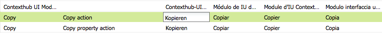

# Utiliser le traducteur pour gérer les dictionnaires{#using-translator-to-manage-dictionaries}

AEM fournit une console pour gérer les différentes traductions de textes utilisés dans l’interface utilisateur des composants. Cette console est disponible à l’adresse

`https://<hostname>:<port-number>/libs/cq/i18n/translator.html`

Utilisez l’outil Traducteur pour gérer les chaînes de caractères anglaises, ainsi que leurs traductions. Les dictionnaires sont créés dans le référentiel, par exemple, /apps/myproject/i18n.

L’outil de traduction et les dictionnaires que vous gérez servent à présenter l’interface utilisateur des composants dans différentes langues. Si vous souhaitez traduire une page ou du contenu généré par l’utilisateur, reportez-vous à la section [Traduction de contenu pour les sites multilingues](/help/sites-administering/translation.md) et [Traduction de contenu généré par l’utilisateur](/help/communities/translate-ugc.md).

>[!CAUTION]
>
>Ne modifiez que les dictionnaires qui sont créés pour votre projet et qui résident sous `/apps`.
>
>AEM dictionnaires système sont également disponibles dans cet outil. Ne modifiez pas les dictionnaires système AEM, car cela peut entraîner des problèmes avec l’interface utilisateur d’AEM. En outre, les modifications peuvent être perdues lors de la mise à niveau. Les dictionnaires système AEM sont situés sous `/libs`.

>[!NOTE]
>
>Bien que l’outil Traducteur possède une interface utilisateur classique, il est utilisé pour traduire des expressions, quelle que soit l’interface où se trouvent celles-ci.

Le traducteur répertorie les textes utilisés dans AEM avec les diverses traductions correspondantes :


Vous pouvez rechercher, filtrer et modifier les textes en anglais et les textes traduits. Vous pouvez également exporter des dictionnaires au format XLIFF pour les traduire, puis réimporter les traductions dans les dictionnaires.

Il est également possible d’ajouter les dictionnaires i18n à un projet de traduction à partir de cette console. Vous pouvez en créer un ou l’ajouter à un projet existant.

1. Cliquez sur **Traduire le dictionnaire**.

   

1. Sélectionnez l’option Créer ou Ajouter selon vos besoins. Une boîte de dialogue s’ouvre.

   

1. Renseignez les champs suivant les besoins et cliquez ensuite sur OK. 

1. Vous pouvez à présent cliquer sur **OK** ou consulter le dictionnaire cible.

   >[!NOTE]
   >
   >Pour plus d’informations sur les projets de traduction, consultez [Gestion des projets de traduction](/help/sites-administering/tc-manage.md).

## Création d’un dictionnaire {#creating-a-dictionary}

Créez un dictionnaire pour gérer vos chaînes d’IU localisées. Après avoir créé un dictionnaire, vous pouvez utiliser l’outil de traduction pour le gérer.

1. À l’aide de CRXDE Lite, ajoutez le nœud racine (`sling:Folder`) de votre nouveau dictionnaire comme structure de stockage des définitions de langue :

   ` /apps/<projectName>/i18n`

   Par exemple, `/apps/myProject/i18n`

1. Ajoutez la structure de langues requise sous ce nœud : Par exemple :

   ```shell
   /apps/myProject/i18n [sling:Folder]
       - de.json [nt:file] [mix:language]
           + jcr:language = de
       - fr.json [nt:file] [mix:language]
           + jcr:language = fr
   ```

   >[!NOTE]
   >
   >Il s’agit de la structure du [module Sling i18n](https://sling.apache.org/site/internationalization-support.html).

1. Rechargez le traducteur et le chemin du dictionnaire (par exemple, `/apps/myProject/i18n`) sera disponible dans le sélecteur déroulant de la barre d’outils. Sélectionnez-le pour commencer à ajouter des chaînes et leurs traductions.

   >[!NOTE]
   >
   >Le traducteur enregistre uniquement les traductions pour les langues présentes dans le chemin (par exemple, `/apps/myProject/i18n`).
   >
   >Vérifiez que ces langues correspondent à celles affichées dans la grille.

## Gestion des chaînes de dictionnaire {#managing-dictionary-strings}

Utilisez l’outil de traduction pour gérer les chaînes de vos dictionnaires. Vous pouvez ajouter, modifier et supprimer des chaînes de caractères anglaises et également fournir des chaînes traduites.

>[!CAUTION]
>
>Ne modifiez que les dictionnaires qui sont créés pour votre projet et qui résident sous `/apps`.
>
>Ne modifiez pas les dictionnaires système AEM, car cela peut entraîner des problèmes avec l’interface utilisateur d’AEM. En outre, les modifications peuvent être perdues lors de la mise à niveau. Les dictionnaires système AEM sont situés sous `/libs`.

### Ajout, modification et suppression de chaînes {#adding-changing-and-removing-strings}

Ajoutez des chaînes en anglais à un dictionnaire que votre composant a internationalisé. Ajoutez uniquement des chaînes internationalisées afin de ne pas gaspiller de ressources en traduisant des chaînes qui ne sont pas utilisées.

Les chaînes que vous ajoutez à un dictionnaire doivent correspondre exactement à la chaîne spécifiée dans le code. Si la chaîne anglaise par défaut utilisée dans le code ne correspond pas à la chaîne anglaise dans un dictionnaire, la chaîne traduite n’apparaît pas dans l’interface utilisateur si nécessaire. Les chaînes sont sensibles à la casse.

**Fournir des conseils de traduction**

Utilisez la propriété Commenet de la chaîne du dictionnaire pour fournir des informations au traducteur afin de clarifier la signification de la chaîne. En règle générale, l’interface utilisateur aide les utilisateurs à déterminer la signification de mots ambigus. Cependant, le traducteur ne voit pas la chaîne dans le contexte de l’interface utilisateur. L&#39;indice de traduction supprime l&#39;ambiguïté. Par exemple, un commentaire aide le traducteur à comprendre que le terme anglais « Request » est utilisé comme substantif et non comme verbe.

Les indices de traduction distinguent également les chaînes qui sont identiques et ont des significations différentes. Par exemple, le mot Rechercher peut être un nom ou un verbe, nécessitant deux entrées &quot;Recherche&quot; dans le dictionnaire avec deux indices de traduction différents. Le code qui demande la chaîne inclut également l’indice de traduction afin que la chaîne correcte soit utilisée dans l’interface utilisateur.

**Inclusion de variables indexées**

Incluez des variables dans la chaîne localisée pour créer une signification contextuelle dans une phrase. Par exemple, après vous être connecté à une application web, la page d’accueil affiche le message &quot;Bienvenue à l’administrateur. Vous avez 2 messages dans votre boîte de réception.&quot; Le contexte de la page détermine le nom d’utilisateur et le nombre de messages.

Pour inclure des variables dans la chaîne localisée, placez des index entre accolades à l’emplacement des variables dans le premier argument de la méthode get. Utilisez l’indice de localisation pour décrire les valeurs. Le traducteur doit comprendre la signification des variables car les structures de phrase varient en fonction de la langue.

Notez que le [code qui demande la chaîne traduite](/help/sites-developing/i18n-dev.md#including-variables-in-localized-sentences) fournit des valeurs pour les variables indexées en fonction du contexte.

Par exemple, la chaîne suivante s’affiche lorsqu’un utilisateur se connecte à un site web, et est incluse dans le dictionnaire :

`Welcome back {0}. You have {1} messages.`

Le commentaire suivant décrit les variables :

`{0} = the user name, {1} = the number of items in the user's inbox`

**Modification de chaînes**

Modifiez ou supprimez des chaînes en anglais à mesure qu’elles sont modifiées ou supprimées dans le code. Lorsque vous modifiez une chaîne, la chaîne d’origine est conservée et une nouvelle chaîne est créée qui reflète la modification. Avant de supprimer une chaîne, assurez-vous qu’aucun code ne l’utilise.

Procédez comme suit pour ajouter une chaîne.

1. Dans le menu déroulant Dictionnaires, sélectionnez le dictionnaire auquel vous ajoutez une chaîne. Dans le menu déroulant, les dictionnaires sont représentés par leur chemin d’accès dans le référentiel.
1. Au-dessus du tableau Chaînes et traductions, cliquez sur Ajouter.

   

1. Dans la zone Chaîne de la boîte de dialogue Ajouter une chaîne, saisissez la chaîne anglaise. Dans la zone Commentaire, saisissez un indice de traduction pour le traducteur, le cas échéant.
1. Cliquez sur OK.
1. Cliquez sur Enregistrer.

   

Procédez comme suit pour modifier une chaîne dans un dictionnaire.

1. Dans le menu déroulant Dictionnaires, sélectionnez le dictionnaire contenant la chaîne à modifier.
1. Double-cliquez sur la chaîne à modifier.
1. Dans la boîte de dialogue Modifier la chaîne, sélectionnez Modifier la chaîne ou le commentaire (Crée une copie).

   

1. Modifiez la chaîne ou le commentaire, puis cliquez sur OK.
1. Cliquez sur Enregistrer.

   

Suivez la procédure ci-dessous pour supprimer une chaîne d’un dictionnaire.

1. Dans le menu déroulant Dictionnaires, sélectionnez le dictionnaire duquel vous supprimez une chaîne.
1. Cliquez sur Supprimer.

   

1. Cliquez sur Enregistrer.

   

### Recherche de chaînes {#searching-for-strings}

La barre de recherche située au bas de l’outil Traducteur propose des options de sélection de chaîne :

* **Filtre par texte** : motif à faire correspondre à la chaîne, au commentaire ou aux traductions de langue anglaise. Seuls les éléments qui correspondent à l’ensemble ou à une partie du schéma s’affichent dans le tableau.
* **Modifications : Tous, Modifié, Nouveau, Supprimé** : affiche les éléments qui ont été modifiés, mais pas enregistrés.

   * N’importe lequel : affiche les éléments qui ont été modifiés, ajoutés ou supprimés.
   * Modifié : affiche les éléments qui ont été modifiés.
   * Nouveau : affiche les éléments ajoutés.
   * Supprimé : affiche les éléments à supprimer.
   * Sélections multiples : affiche les éléments qui possèdent toutes les propriétés sélectionnées.

* **Comportement**: affiche les éléments qui comportent des commentaires pour les traducteurs.
* **Traductions manquantes** : affiche les éléments pour lesquels il n’existe pas de traduction pour au moins une langue.


1. Dans la barre de recherche, sélectionnez les options de filtrage.
1. Pour filtrer à l’aide des options, cliquez sur Filtrer.
1. Pour supprimer les filtres et afficher tous les éléments du dictionnaire, cliquez sur Effacer.

### Modification de chaînes traduites {#editing-translated-strings}

Après avoir ajouté la chaîne anglaise à un dictionnaire, vous pouvez ajouter les traductions de la chaîne. Vous pouvez également [export du dictionnaire](/help/sites-developing/i18n-translator.md#exporting-a-dictionary) pour le faire traduire par un tiers.

1. Sélectionner [dictionnaire spécifique à votre projet](#creating-a-dictionary) car il spécifie le chemin d’accès dans le référentiel contenant les traductions. Par exemple, sélectionnez **Dictionnaires** en tant que :

   `/apps/myProject/i18n`

   >[!CAUTION]
   >
   >Ne modifiez que les dictionnaires qui sont créés pour votre projet et qui résident sous `/apps`.
   >
   >AEM dictionnaires système sont également disponibles dans cet outil. Ne modifiez pas les dictionnaires système AEM, car cela peut entraîner des problèmes avec l’interface utilisateur d’AEM. En outre, les modifications peuvent être perdues lors de la mise à niveau. Les dictionnaires système AEM sont situés sous `/libs`.

1. Pour modifier les textes traduits pour l’une des chaînes, vous pouvez effectuer l’une des opérations suivantes :

   * Double-cliquez sur la langue appropriée pour la chaîne requise pour modifier ce texte unique :

   

   * Double-cliquez sur le **Chaîne** ou **Commentaire** pour la chaîne requise afin d’ouvrir la variable **Modifier la chaîne** , modifiez la ou les traductions selon les besoins, puis cliquez sur **OK** pour fermer la boîte de dialogue :

   

1. Cliquez sur **Enregistrer** pour valider vos modifications.

   >[!NOTE]
   >
   >Si vous cliquez sur **Réinitialiser et Actualiser** (au lieu d’**Enregistrer**), les textes précédents sont rétablis.

## Utilisation de traducteurs tiers {#using-third-party-translators}

Pour prendre en charge l’utilisation de services de traduction tiers, l’outil de traduction vous permet d’exporter et d’importer des dictionnaires.

### Exportation d’un dictionnaire {#exporting-a-dictionary}

Exportez un dictionnaire vers un fichier XLIFF afin qu’un service tiers puisse traduire les chaînes du dictionnaire.

* Exportez un dictionnaire et incluez l’anglais et les termes traduits pour une langue.
* Exportez uniquement une partie ou la totalité des chaînes anglaises.

Lorsque vous exportez un fichier XLIFF et que vous incluez une langue, la structure de noeud du dictionnaire dans le référentiel doit inclure cette langue. Si la langue n’est pas incluse, des erreurs se produisent. Par exemple, pour exporter le fichier XLIFF français, le dossier de dictionnaire doit inclure le nœud enfant `mix:language` nommé `fr` (Voir [Création d’un dictionnaire](/help/sites-developing/i18n-translator.md#creating-a-dictionary)).

Procédez comme suit pour exporter un fichier XLIFF pour une langue donnée.

1. Ouvrez l’outil de traduction `http://<host>:<port>/libs/cq/i18n/translator.html`.
1. Utilisez le menu déroulant Dictionnaires pour sélectionner le dictionnaire à exporter.
1. Cliquez sur Exporter > Exporter complètement . *XX* Options Xliff, où *XX* est le code de langue à deux lettres, tel que DE ou FR.

   Le fichier XLIFF s’ouvre dans un nouvel onglet ou une nouvelle fenêtre.

1. Utilisez les commandes du navigateur web pour enregistrer la page en tant que fichier sur votre système de fichiers, par exemple Fichier > Enregistrer la page sous.

Suivez la procédure ci-dessous pour exporter une partie ou l’ensemble des chaînes anglaises.

1. Ouvrez l’outil de traduction `http://<host>:<port>/libs/cq/i18n/translator.html`. 
1. Utilisez le menu déroulant Dictionnaires pour sélectionner le dictionnaire à exporter.
1. Si vous exportez un sous-ensemble des chaînes, sélectionnez les éléments du dictionnaire à exporter. La sélection d’aucun élément exporte tous les éléments.
1. Cliquez sur Exporter > Exporter la sélection au format Xliff (chaînes uniquement).
1. Dans la boîte de dialogue qui s’affiche, copiez le texte et collez-le dans un fichier texte.

### Importation d’un dictionnaire {#importing-a-dictionary}

Importez un fichier XLIFF dans un dictionnaire pour le remplir. Lorsque le dictionnaire contient une traduction pour une chaîne anglaise et que le fichier XLIFF contient une traduction différente pour la même chaîne, la traduction du dictionnaire est remplacée.

1. Ouvrez l’outil de traduction `http://<host>:<port>/libs/cq/i18n/translator.html`.
1. Cliquez sur Importer > Traductions XLIFF.
1. Sélectionnez le fichier à importer, puis cliquez sur OK.

## Gestion des langues prises en charge {#managing-supported-lanuages}

Ajoutez ou supprimez les langues prises en charge par l’outil de traduction et fournies aux utilisateurs de vos pages web.

### Modification des langues répertoriées dans le tableau du dictionnaire {#changing-languages-listed-in-the-dictionary-table}

Les langues suivantes sont reprises dans le tableau de dictionnaire de l’outil Traducteur :

* de - Allemand
* fr - Français
* it - Italien
* es - Espagnol
* ja - Japonais
* pt-br - Portugais brésilien
* zh-cn - Chinois simplifié
* zh-tw - Chinois traditionnel (prise en charge limitée)
* ko-kr - Coréen

Procédez comme suit pour ajouter ou supprimer des langues.

1. A l’aide de CRXDE Lite, créez un noeud :

   `/etc/languages`

1. Sur ce nœud, créez une propriété :

   * **Nom** : `languages`
   * **Type** : `Multi-String`
   * **Valeur**: liste des langues à afficher. Par exemple :

      * fr
      * es

   >[!NOTE]
   >
   >Les codes de langue doivent être en minuscules.

1. Cliquez sur **Enregistrer tout** dans CRXDE Lite, puis rechargez le traducteur. La grille est mise à jour pour afficher les langues définies.

   >[!NOTE]
   >
   >Le traducteur enregistre uniquement les traductions pour les langues qui sont [présentes dans le dictionnaire](#creating-a-dictionary) (c’est-à-dire, dans le chemin d’accès au dictionnaire, comme `/apps/myProject/i18n`).
   >
   >Vérifiez que ces langues correspondent à celles affichées dans la grille.

### Mise à disposition des langues pour les auteurs {#making-languages-available-to-authors}

Une fois que vous avez défini un dictionnaire pour une nouvelle langue de l’instance AEM, vous devez la rendre disponible pour les auteurs (par exemple, dans les **Préférences**) :

1. Pour modifier la liste des langues disponibles dans l’option **Préférences** de la console **Sécurité** :

   1. Créez un recouvrement dans le code de votre application pour :

      ```
              /libs/cq/security/widgets/source/widgets/security/Preferences.js
       and update as required.
      ```

1. Pour que la langue soit disponible dans les **Préférences** de la console **Sites web**, vous devez apporter les modifications suivantes à votre application :

   1. Créez un recouvrement pour la structure sous :

      `/libs/cq/security/content/tools/userProperties`

   1. Dans le recouvrement, mettez à jour la liste des langues sous :

      `items/common/items /lang/options`

1. Enregistrez tout et rechargez la console appropriée.

### Modification des noms de langue et des pays par défaut {#changing-language-names-and-default-countries}

Plusieurs pays utilisent la même langue, par exemple les Etats-Unis, le Royaume-Uni et l&#39;Australie, tous utilisent l&#39;anglais. Cette indication est portée par un code qui est composé de la langue et du pays, par exemple `en_GB`, `en_US` et `en_AU`.

Les pays par défaut sont utilisés lors de l’affichage des indicateurs (par exemple, dans la boîte de dialogue de copie de langue), pour résoudre le pays pour un code de langue.

>[!NOTE]
>
>Pour les localisations gérées par le traducteur ci-dessus, seule la langue exacte fonctionne. Si la liste déroulante des préférences linguistiques utilise `en_uk`, il doit y avoir une `en_uk` dictionnaire dans le référentiel.

Pour modifier les définitions par défaut, procédez comme suit :

1. Une liste des langues est stockée sous :

   `/libs/wcm/core/resources/languages`

   Recouvrez-la en la copiant dans :

   `/apps/wcm/core/resources/languages`

   Modifiez ou étendez ensuite la liste. La propriété `defaultCountry` sur un noeud de langue (par exemple, `ja`) doit contenir le code complet, tel que `ja_jp`, qui définirait `jp` comme pays par défaut de la langue `ja`.

1. Mettez à jour le **gestionnaire de langues WCM CQ**.

   * **Liste des langues** :

     chemin d’accès à la liste des langues dans le référentiel. Définissez-la sur l’emplacement utilisé pour le recouvrement :

     ```
            /apps/wcm/core/resources/languages
     ```

   Pour ce faire, utilisez la console web OSGi :

   ```shell
   https://<hostname>:<port-number>/system/console/configMgr/com.day.cq.wcm.core.impl.LanguageManagerImpl
   ```

## Publication de dictionnaires {#publishing-dictionaries}

Insérez vos dictionnaires dans le processus de gestion des versions de vos applications AEM. Par exemple, incluez le dictionnaire dans le module de contenu de votre application pour le déploiement sur l’instance de publication. Cette stratégie présente les avantages suivants :

* Les dictionnaires sont disponibles pour les composants de leur environnement de publication.
* Les modifications apportées aux chaînes de l’interface utilisateur des composants sont déployées avec les traductions mises à jour.

De même, le test des chaînes du dictionnaire doit être effectué dans le cadre du cycle de développement habituel du logiciel.

>[!NOTE]
>
>N’utilisez pas de fonctionnalité de publication standard, ni de réplication, pour les dictionnaires. Au lieu de cela, les dictionnaires doivent être traités de la même manière que le code et la configuration. Cela inclut l’utilisation du contrôle de code source pour suivre les modifications et l’utilisation de packages de contenu pour appliquer les modifications à l’auteur et à la publication.

>[!NOTE]
>
>Lors de l’utilisation du Dispatcher, vous devez [invalider les pages mises en cache](https://helpx.adobe.com/fr/experience-manager/dispatcher/using/page-invalidate.html) afin d’inclure les nouvelles chaînes de dictionnaire dans les chaînes de composant rendues.
