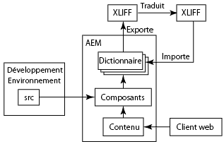
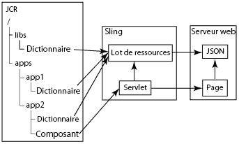

# Internationalisation de composants{#internationalizing-components}

Internationalisez vos composants et boîtes de dialogue de sorte que leurs chaînes d’IU puissent être présentées dans différentes langues. Les composants qui sont conçus pour l’internationalisation permettent d’externaliser et de traduire les chaînes d’IU, puis de les importer dans le référentiel. À l’exécution, les préférences linguistiques de l’utilisateur ou les paramètres régionaux de la page déterminent quelle langue s’affiche dans l’IU.

Utilisez le processus suivant pour internationaliser vos composants et fournir l’IU dans différentes langues :

1. [Mettez en œuvre vos composants à l’aide d’un code qui internationalise les chaînes.](/help/sites-developing/i18n-dev.md) Votre code reconnaît les chaînes à traduire et sélectionne la langue à présenter à l’exécution.
1. [Créez des dictionnaires](/help/sites-developing/i18n-translator.md#creating-a-dictionary) et [ajoutez](/help/sites-developing/i18n-translator.md#adding-changing-and-removing-strings) les chaînes en anglais à traduire.

1. [Exportez](/help/sites-developing/i18n-translator.md#exporting-a-dictionary) le dictionnaire au format XLIFF, traduisez les chaînes, puis [réimportez](/help/sites-developing/i18n-translator.md#importing-a-dictionary) les fichiers XLIFF dans AEM. Vous pouvez également [ajouter des traductions manuellement](/help/sites-developing/i18n-translator.md#editing-translated-strings) au dictionnaire.

1. [Incluez le dictionnaire au processus de gestion de version de votre application](/help/sites-developing/i18n-translator.md#publishing-dictionaries).

>[!NOTE]
>
>Les méthodes décrites ci-après pour l’internationalisation des composants sont destinées à traduire les chaînes statiques. Si les chaînes d’un composant sont susceptibles de changer, vous devriez utiliser les workflows de traduction traditionnels. Par exemple, lorsque les auteurs peuvent modifier une chaîne de l’IU à l’aide de propriétés dans la boîte de dialogue de modification d’un composant, vous ne devriez pas utiliser de dictionnaire de langue pour internationaliser cette chaîne.

## Dictionnaires de langues {#language-dictionaries}

La structure d’internationalisation d’AEM utilise les dictionnaires dans le référentiel pour stocker les chaînes en anglais et leurs traductions dans d’autres langues. La structure utilise l’anglais comme langue par défaut. Les chaînes sont identifiées par leur version anglaise. En règle générale, les structures d’internationalisation utilisent des ID alphanumériques pour les chaînes de l’IU. L’utilisation de la version anglaise de la chaîne comme ID présente plusieurs avantages :

* Le code est facile à lire.
* La langue par défaut est toujours disponible.

Les chaînes localisées peuvent être stockées dans plusieurs dictionnaires au sein du référentiel. AEM system dictionaries are located below the `/libs` node. You can create dictionaries for your components below the `/apps` node. La structure d’internationalisation d’AEM combine les dictionnaires et les rend disponibles dans Sling sous la forme d’un seul objet `ResourceBundle`. Lorsque les composants sont rendus, ils récupèrent les chaînes traduites à partir du lot de ressources. Les dictionnaires combinés sont également déployés sur le serveur Web au format JSON pour fournir des chaînes traduites en code JavaScript dans des pages Web.

De plus, l’[outil de traduction](/help/sites-developing/i18n-translator.md) vous permet de gérer tous les dictionnaires à partir d’un emplacement central.

>[!NOTE]
>
>Do not modify the AEM system dictionaries that are located below the `/libs` node.

### Remplacement de chaînes dans les dictionnaires système {#overlaying-strings-in-system-dictionaries}

Strings in dictionaries below the `/apps` node override duplicate strings in dictionaries that are below the `/libs` node. Si vos composants utilisent des chaînes qui sont incluses dans les dictionnaires système d’AEM, dupliquez la chaîne dans votre propre dictionnaire. Tous les composants utiliseront les chaînes de votre dictionnaire.

Note that you cannot predict which translation is used when strings are duplicated in dictionaries that are all located below the `/apps` node.
