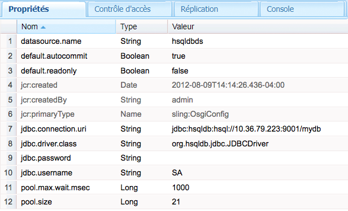

# Connexion à des bases de données SQL{#connecting-to-sql-databases}

Accédez à une base de données SQL externe, de sorte que vos applications CQ puissent interagir avec les données :

1. [Créez ou procurez-vous un lot OSGi qui exporte le package de pilotes JDBC](#bundling-the-jdbc-database-driver).
1. [Configurez un fournisseur de pool de sources de données JDBC](#configuring-the-jdbc-connection-pool-service).
1. [Procurez-vous un objet de source de données et créez la connexion dans votre code](#connecting-to-the-database).

## Regroupement du pilote de base de données JDBC {#bundling-the-jdbc-database-driver}

Certains fournisseurs de base de données proposent des pilotes JDBC dans un lot OSGi ; [MySQL](https://www.mysql.com/downloads/connector/j/), par exemple. Si le pilote JDBC correspondant à votre base de données n’est pas disponible sous la forme d’un lot OSGi, procurez-vous le fichier JAR du pilote et enveloppez-le dans un lot OSGi. Le lot doit exporter les packages nécessaires pour interagir avec le serveur de base de données. Le lot doit également importer les packages auxquels il fait référence.

L’exemple suivant utilise le [module externe Bundle pour Maven](https://felix.apache.org/site/apache-felix-maven-bundle-plugin-bnd.html) pour envelopper le pilote HSQLDB dans un lot OSGi. Le POM indique au module externe d’incorporer le fichier hsqldb.jar qui est identifié en tant que dépendance. Tous les packages org.hsqldb sont exportés.

Le module externe détermine automatiquement les packages à importer et les répertorie dans le fichier MANIFEST.MF du lot. Si l’un des packages n’est pas disponible sur le serveur CQ, le lot ne démarre pas lors de l’installation. Deux solutions sont possibles :

* Indiquer dans le POM que les packages sont facultatifs. Utilisez cette solution lorsque la connexion JDBC n’a pas véritablement besoin des membres du package. Utilisez l’élément Import-Package pour indiquer les packages facultatifs, comme dans l’exemple suivant :

   `<Import-Package>org.jboss.*;resolution:=optional,*</Import-Package>`
* Envelopper les fichiers JAR contenant les packages dans un lot OSGi qui exporte les packages, puis déployer le lot. Utilisez cette solution lorsque les membres du package sont nécessaires pendant l’exécution du code.

Une connaissance du code source vous permet de déterminer la solution à utiliser. Vous pouvez également essayer l’une des solutions et réaliser des tests pour la valider.

### POM qui compile le fichier hsqldb.jar  {#pom-that-bundles-hsqldb-jar}

```xml
<project xmlns="https://maven.apache.org/POM/4.0.0"
  xmlns:xsi="https://www.w3.org/2001/XMLSchema-instance"
  xsi:schemaLocation="https://maven.apache.org/POM/4.0.0 https://maven.apache.org/xsd/maven-4.0.0.xsd">
  <modelVersion>4.0.0</modelVersion>

  <groupId>com.adobe.example.myapp</groupId>
  <artifactId>hsqldb-jdbc-driver-bundle</artifactId>
  <version>0.0.1-SNAPSHOT</version>
  <name>wrapper-bundle-hsqldb-driver</name>
  <url>www.adobe.com</url>
  <description>Exports the HSQL JDBC driver</description>
  <packaging>bundle</packaging>
  <properties>
    <project.build.sourceEncoding>UTF-8</project.build.sourceEncoding>
  </properties>
  <build>
    <plugins>
      <plugin>
        <groupId>org.apache.felix</groupId>
        <artifactId>maven-bundle-plugin</artifactId>
        <version>1.4.3</version>
        <extensions>true</extensions>
        <configuration>
         <instructions>
            <Embed-Dependency>*</Embed-Dependency>
            <_exportcontents>org.hsqldb.*</_exportcontents>
          </instructions>
        </configuration>
      </plugin>
    </plugins>
  </build>
  <dependencies>
    <dependency>
      <groupId>hsqldb</groupId>
      <artifactId>hsqldb</artifactId>
      <version>2.2.9</version>
    </dependency>
  </dependencies>
</project>
```

Les liens suivants ouvrent les pages de téléchargement pour certaines solutions de base de données courantes :

* [Microsoft SQL Server](https://www.microsoft.com/en-us/download/details.aspx?displaylang=en&amp;id=11774)
* [Oracle](https://www.oracle.com/technetwork/database/features/jdbc/index-091264.html)
* [IBM DB2](https://www-01.ibm.com/support/docview.wss?uid=swg27007053)

### Configuration du service Pool de connexions JDBC  {#configuring-the-jdbc-connection-pool-service}

Ajoutez une configuration pour le service JDBC Connections Pool qui utilise le pilote JDBC pour créer des objets de source de données. Votre code d’application utilise ce service pour obtenir l’objet et se connecter à la base de données.

Pool de connexions JDBC (`com.day.commons.datasource.jdbcpool.JdbcPoolService`) est un service de fabrique. Si vous avez besoin de connexions qui utilisent d’autres propriétés (un accès en lecture seule ou en lecture/écriture, par exemple), créez plusieurs configurations.

Lorsque vous utilisez CQ, plusieurs méthodes de gestion des paramètres de configuration sont disponibles pour ces services ; pour en savoir plus, voir [Configuration d’OSGi](/help/sites-deploying/configuring-osgi.md).

Les propriétés suivantes sont disponibles pour configurer un service de connexion mis en pool. Les noms de propriété sont répertoriés à mesure qu’ils sont affichés dans la console web. Le nom correspondant à un nœud`sling:OsgiConfig` apparaît entre parenthèses. Des exemples de valeurs sont affichés pour un serveur HSQLDB et une base de données dont le pseudonyme est`mydb` :

* Classe de pilotes JDBC (`jdbc.driver.class`) : classe Java à utiliser pour implémenter l’interface java.sql.Driver ; `org.hsqldb.jdbc.JDBCDriver`, par exemple. Le type de données est `String`.

* URI de connexion JDBC ( `jdbc.connection.uri`) : URL de la base de données à utiliser pour créer la connexion, par exemple `jdbc:hsqldb:hsql//10.36.79.223:9001/mydb`. Le format de l’URL doit être valide pour être utilisé avec la méthode getConnection de la classe java.sql.DriverManager. Le type de données est `String`.

* Nom d’utilisateur (`jdbc.username`) : nom d’utilisateur à employer pour s’authentifier auprès du serveur de base de données. Le type de données est `String`.

* Mot de passe (`jdbc.password`) : mot de passe à utiliser pour l’authentification de l’utilisateur. Le type de données est `String`.

* Requête de validation ( `jdbc.validation.query`) : Instruction SQL à utiliser pour vérifier la réussite de la connexion, par exemple `select 1 from INFORMATION_SCHEMA.SYSTEM_USERS`. Le type de données est `String`.

* Lecture seule par défaut (default.readonly) : sélectionnez cette option si vous voulez que la connexion fournisse un accès en lecture seule. Le type de données est `Boolean`.
* Validation automatique par défaut (`default.autocommit`) : sélectionnez cette option pour créer des transactions distinctes pour chaque commande SQL envoyée à la base de données ; chaque transaction est alors automatiquement validée. Ne sélectionnez pas cette option lorsque vous validez explicitement des transactions dans votre code. Le type de données est `Boolean`.

* Taille du pool (`pool.size`) : nombre de connexions simultanées qui doivent être disponibles pour la base de données. Le type de données est `Long`.

* Attente de pool (`pool.max.wait.msec`) : délai avant l’expiration de la requête de connexion. Le type de données est `Long`.

* Nom de la source de données (`datasource.name`) : nom de cette source de données. Le type de données est `String`.

* Propriétés de service supplémentaires (`datasource.svc.properties`) : ensemble de paires nom/valeur que vous souhaitez ajouter à l’URL de connexion. Le type de données est `String[]`.

Pool de connexions JDBC est un service de fabrique. Par conséquent, si vous utilisez un noeud `sling:OsgiConfig` pour configurer le service de connexion, le nom du noeud doit inclure le PID du service en usine suivi de *`-alias`*. Le pseudonyme que vous utilisez doit être unique pour tous les nœuds de configuration de ce PID. Un exemple de nom de noeud est `com.day.commons.datasource.jdbcpool.JdbcPoolService-myhsqldbpool`.



### Connexion à la base de données {#connecting-to-the-database}

Dans votre code Java, utilisez le service DataSourcePool pour obtenir un objet `javax.sql.DataSource` pour la configuration que vous avez créée. Le service DataSourcePool fournit la méthode `getDataSource` qui renvoie un objet `DataSource` pour un nom de source de données spécifique. Comme argument de méthode, utilisez la valeur de la propriété Nom de la source de données (ou `datasource.name`) que vous avez spécifiée pour la configuration du service Pool de connexions JDBC.

L’exemple de code JSP suivant obtient une instance de la source de données hsqldbds, exécute une requête SQL simple et affiche le nombre de résultats renvoyés.

#### JSP qui effectue une recherche de base de données  {#jsp-that-performs-a-database-lookup}

```java
<%@include file="/libs/foundation/global.jsp"%><%
%><%@page session="false"%><%
%><%@ page import="com.day.commons.datasource.poolservice.DataSourcePool" %><%
%><%@ page import="javax.sql.DataSource" %><%
%><%@ page import="java.sql.Connection" %><%
%><%@ page import="java.sql.SQLException" %><%
%><%@ page import="java.sql.Statement" %><%
%><%@ page import="java.sql.ResultSet"%><%
%><html>
<cq:include script="head.jsp"/>
<body>
<%DataSourcePool dspService = sling.getService(DataSourcePool.class);
  try {
     DataSource ds = (DataSource) dspService.getDataSource("hsqldbds");
     if(ds != null) {
         %><p>Obtained the datasource!</p><%
         %><%final Connection connection = ds.getConnection();
          final Statement statement = connection.createStatement();
          final ResultSet resultSet = statement.executeQuery("SELECT * from INFORMATION_SCHEMA.SYSTEM_USERS");
          int r=0;
          while(resultSet.next()){
             r=r+1;
          }
          resultSet.close();
          %><p>Number of results: <%=r%></p><%
      }
   }catch (Exception e) {
        %><p>error! <%=e.getMessage()%></p><%
    }
%></body>
</html>
```

>[!NOTE]
>
>Si la méthode getDataSource renvoie une exception en raison d’une source de données introuvable, assurez-vous que la configuration du service Pool de connexions est correcte. Vérifiez les noms des propriétés, les valeurs et les types de données.


>[!NOTE]
>
>Pour savoir comment injecter un service DataSourcePool dans un lot OSGi, voir [Injection d’un service DataSourcePool dans un lot OSGi Adobe Experience Manager](https://helpx.adobe.com/experience-manager/using/datasourcepool.html).

