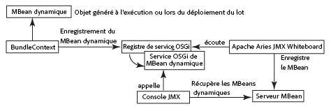

# Intégration de services à la console JMX{#integrating-services-with-the-jmx-console}

Créez et déployez des MBeans pour gérer les services à l’aide de la console JMX. Exposez les attributs et les opérations de service pour permettre l’exécution de tâches d’administration.

Pour plus d’informations sur l’utilisation de la console JMX, voir [Surveillance des ressources du serveur à l’aide de la console JMX ](/help/sites-administering/jmx-console.md).

## Le framework JMX dans Felix et CQ5 {#the-jmx-framework-in-felix-and-cq}

Sur la plate-forme Apache Felix, vous déployez MBeans en tant que services OSGi. Lorsqu&#39;un service MBean est enregistré dans le registre de services OSGi, le module Carte blanche Aries JMX enregistre automatiquement le MBean avec le serveur MBean. Le MBean est alors disponible pour la console JMX qui expose les attributs et opérations publics.



## Création de MBeans pour CQ5 et CRX {#creating-mbeans-for-cq-and-crx}

Les MBeans que vous créez pour gérer les ressources CQ5 ou CRX sont basés sur l’interface javax.management.DynamicMBean. Pour les créer, il convient de suivre les modèles de conception habituels définis dans la spécification JMX :

* Créez l’interface de gestion, y compris les méthodes get, set et is pour définir les attributs et les autres méthodes servant à paramétrer les opérations.
* Créez la classe d’implémentation. La classe doit implémenter DynamicMBean ou étendre une classe d’implémentation de DynamicMBean.
* Suivez la convention de dénomination standard pour que le nom de la classe d’implémentation soit celui de l’interface avec le suffixe MBean.

En plus de configurer l’interface de gestion, l’interface paramètre également l’interface de service OSGi. La classe d’implémentation implémente le service OSGi.

### Utilisation d’annotations pour fournir des informations MBean  {#using-annotations-to-provide-mbean-information}

Le package module [com.adobe.granite.jmx.annotation](https://helpx.adobe.com/experience-manager/6-5/sites/developing/using/reference-materials/javadoc/com/adobe/granite/jmx/annotation/package-summary.html) offre plusieurs annotations et classes pour fournir facilement des métadonnées MBean à la console JMX. Utilisez ces annotations et classes au lieu d’ajouter directement des informations à l’objet MBeanInfo du MBean.

**Annotations**

Ajoutez des annotations à l’interface de gestion pour spécifier les métadonnées MBean. Les informations apparaissent dans la console JMX pour chaque classe d’implémentation déployée. Les annotations suivantes sont disponibles (pour plus d’informations, consultez la page [com.adobe.granite.jmx.annotation JavaDocs](https://helpx.adobe.com/experience-manager/6-5/sites/developing/using/reference-materials/javadoc/com/adobe/granite/jmx/annotation/package-summary.html)) :

* **Description :** fournit une description de la classe ou de la méthode MBean. Lorsqu’elle est utilisée dans la déclaration de classe, la description est visible dans la page de la console JMX pour le MBean. Si elle est utilisée pour une méthode, elle apparaît sous forme de texte flottant pour l’attribut ou l’opération correspondant.
* **Impact :** répercussions d’une méthode. Les valeurs de paramètre valides sont les champs définis par [javax.management.MBeanOperationInfo](https://docs.oracle.com/javase/1.5.0/docs/api/javax/management/MBeanOperationInfo.html).

* **Nom :** spécifie le nom à afficher pour un paramètre d’opération. Utilisez cette annotation pour remplacer le nom réel du paramètre de méthode utilisé dans l’interface.
* **OpenTypeInfo** : spécifie la classe à utiliser pour représenter les données composites ou les données tabulaires dans la console JMX. À utiliser avec Open MBeans
* **TabularTypeInfo** : sert à annoter la classe utilisée pour représenter les données tabulaires.

**Classes**

Les classes sont fournies pour la création de MBeans dynamiques qui consomment les annotations que vous ajoutez à leurs interfaces :

* **AnnotatedStandardMBean :** sous-classe de la classe javax.management.StandardMBean qui fournit automatiquement à la console JMX les métadonnées d’annotation.
* **OpenAnnotatedStandardMBean:** Sous-classe de la classe AnnotatedStandardMBean pour la création de Mbeans ouverts qui consomment l&#39;annotation OpenTypeInfo.

### Développement de MBeans {#developing-mbeans}

En règle générale, le MBean reflète le service OSGi que vous souhaitez gérer. Sur la plate-forme Felix, vous créez le MBean comme vous le feriez pour le déploiement sur d’autres plates-formes de serveur Java. La principale différence réside dans le fait que vous pouvez utiliser des annotations pour spécifier les informations MBean :

* Interface de gestion : définit les attributs à l’aide des méthodes getter, setter et is. Définit les opérations à l’aide de toute autre méthode publique. Utilise des annotations afin de fournir des métadonnées pour l’objet BeanInfo.
* Classe MBean : Implémente l’interface de gestion. Étend la classe AnnotatedStandardMBean afin qu’elle traite les annotations sur l’interface.

L’exemple suivant MBean fournit des informations sur le référentiel CRX. L’interface utilise l’annotation Description pour fournir des informations à la console JMX.

#### Interface de gestion {#management-interface}

```java
package com.adobe.example.myapp;

import com.adobe.granite.jmx.annotation.Description;

@Description("Example MBean that exposes repository properties.")
public interface ExampleMBean {

    @Description("The name of the repository.")
    String getRepositoryName();

    @Description("The vendor of the repository.")
    String   getRepositoryVendor();

    @Description("The URL of repository vendor.")
    String getVendorUrl();
}
```

La classe d’implémentation utilise le service SlingRepository pour récupérer des informations sur le référentiel CRX.

#### Classe d’implémentation MBean {#mbean-implementation-class}

```java
package com.adobe.example.myapp;

import org.apache.felix.scr.annotations.*;
import org.apache.sling.jcr.api.SlingRepository;

import com.adobe.granite.jmx.annotation.AnnotatedStandardMBean;

import javax.management.*;

public class ExampleMBeanImpl extends AnnotatedStandardMBean implements ExampleMBean {

    @Reference(cardinality = ReferenceCardinality.OPTIONAL_UNARY)
    private SlingRepository repository;

    public ExampleMBeanImpl() throws NotCompliantMBeanException {
        super(ExampleMBean.class);
    }

    public String getRepositoryName() {
        return repository.getDescriptor("jcr.repository.name");
    }

    public String getRepositoryVendor() {
        return repository.getDescriptor("jcr.repository.vendor");
    }

    public String getVendorUrl() {
        return repository.getDescriptor("jcr.repository.vendor.url");
    }
}
```

L’image suivante présente la page de ce MBean dans la console JMX.


### Enregistrement de MBeans {#registering-mbeans}

Lorsque vous enregistrez des MBeans en tant que service OSGi, ils sont automatiquement enregistrés avec le serveur MBean. Pour installer un MBean sur CQ5, ajoutez-le à un bundle et exportez le service MBean comme vous le feriez avec n’importe quel autre service OSGi.

En plus des métadonnées liées à OSGi, vous devez également fournir les métadonnées dont le module Aries JMX Whiteboard a besoin pour enregistrer le MBean avec le serveur MBean :

* **Nom de l’interface DynamicMBean :** Déclarez que le service MBean implémente l’interface  `javax.management.DynamicMBea`n. Cette déclaration indique au module Aries JMX Whiteboard que le service est un service MBean.

* **Le domaine MBean et les propriétés clés :** Sous Felix, vous fournissez ces informations en tant que propriété du service OSGi de MBean. Il s’agit des mêmes informations que celles que vous fournissez habituellement au serveur MBean dans un objet `javax.management.ObjectName`.

Lorsque votre MBean reflète un service unique, une seule instance du service MBean est requise. Dans ce cas, si vous utilisez le module externe Felix SCR Maven, vous pouvez utiliser les annotations SCR (Apache Felix Service Component Runtime) sur la classe d’implémentation MBean pour spécifier les métadonnées associées à JMX. Pour instancier plusieurs instances MBean, vous pouvez créer une autre classe qui effectue cet enregistrement du service OSGi du MBean. Dans ce cas, les métadonnées associées à JMX sont générées lors de l’exécution.

**MBean simple**

Les MBeans pour lesquels vous pouvez définir tous les attributs et toutes les opérations au moment de la conception peuvent être déployés à l’aide d’annotations SCR dans la classe d’implémentation MBean. Dans l’exemple suivant, l’attribut `value` de l’annotation `Service` déclare que le service implémente l’interface `DynamicMBean`. L&#39;attribut `name` de l&#39;annotation `Property` spécifie le domaine JMX et les propriétés clés.

#### Classe d’implémentation MBean avec annotations SCR {#mbean-implementation-class-with-scr-annotations}

```java
package com.adobe.example.myapp;

import org.apache.felix.scr.annotations.*;
import org.apache.sling.jcr.api.SlingRepository;

import com.adobe.granite.jmx.annotation.AnnotatedStandardMBean;

import javax.management.*;

@Component(immediate = true)
@Property(name = "jmx.objectname", value="com.adobe.example:type=CRX")
@Service(value = DynamicMBean.class)
public class ExampleMBeanImpl extends AnnotatedStandardMBean implements ExampleMBean {

    @Reference(cardinality = ReferenceCardinality.OPTIONAL_UNARY)
    private SlingRepository repository;

    public ExampleMBeanImpl() throws NotCompliantMBeanException {
        super(ExampleMBean.class);
    }

    public String getRepositoryName() {
        return repository.getDescriptor("jcr.repository.name");
    }

    public String getRepositoryVendor() {
        return repository.getDescriptor("jcr.repository.vendor");
    }

    public String getVendorUrl() {
        return repository.getDescriptor("jcr.repository.vendor.url");
    }
}
```

**Plusieurs instances de service MBean**

Pour gérer plusieurs instances d’un service géré, il convient de créer plusieurs instances du service MBean correspondant. En outre, les instances de service MBean doivent être créées ou supprimées lorsque des instances gérées sont démarrées ou arrêtées. Vous pouvez créer une classe de gestionnaire MBean pour instancier les services MBean à l’exécution et gérer le cycle de vie du service.

Utilisez BundleContext pour enregistrer le MBean en tant que service OSGi. Ajoutez les informations relatives à JMX à l’objet Dictionary que vous utilisez comme argument de la méthode BundleContext.registerService.

Dans l’exemple de code suivant, le service ExampleMBean est enregistré par programmation. L’objet componentContext est ComponentContext, qui fournit l’accès à BundleContext.

#### Extrait de code : enregistrement du service MBean programmatique  {#code-snippet-programmatic-mbean-service-registration}

```java
Dictionary mbeanProps = new Hashtable();
mbeanProps.put("jmx.objectname", "com.adobe.example:type=CRX");
ExampleMBeanImpl mbean = new ExampleMBeanImpl();
ServiceRegistration serviceregistration =
            componentContext.getBundleContext().registerService(DynamicMBean.class.getName(), mbean, mbeanProps);
```

L’exemple MBean de la section suivante fournit plus de détails.

Un gestionnaire de service MBean est utile si les configurations de service sont stockées dans le référentiel. Le gestionnaire peut récupérer les informations de service et les utiliser pour configurer et créer le MBean correspondant. La classe de gestionnaire peut également écouter les événements de modification du référentiel et mettre à jour les services MBean en conséquence.

## Exemple : surveillance des modèles de processus à l’aide de JMX  {#example-monitoring-workflow-models-using-jmx}

Le MBean de cet exemple fournit des informations sur les modèles de processus CQ5 stockés dans le référentiel. Une classe de gestionnaire MBean crée des MBeans basés sur des modèles de processus stockés dans le référentiel et qui enregistrent leur service OSGi au moment de l’exécution. Cet exemple consiste en un seul bundle contenant les membres suivants :

* WorkflowMBean : interface de gestion.
* WorkflowMBeanImpl : classe d’implémentation MBean.
* WorkflowMBeanManager : interface de la classe de gestionnaire MBean.
* WorkflowMBeanManagerImpl : classe d’implémentation du gestionnaire MBean.

**Remarque :** Pour simplifier, le code de cet exemple n’effectue pas de journalisation ou ne réagit pas aux exceptions générées.

WorkflowMBeanManagerImpl inclut une méthode d’activation de composant. Lorsque le composant est activé, la méthode exécute les tâches suivantes :

* Obtient un BundleContext pour le bundle.
* Interroge le référentiel pour obtenir les chemins des modèles de processus existants.
* Crée des MBeans pour chaque modèle de processus.
* Enregistre les MBeans avec le registre de service OSGi.

Les métadonnées MBean sont visibles dans la console JMX avec le domaine com.adobe.example, le type workflow_model et Properties est le chemin du nœud de configuration du workflow.


### Exemple de MBean {#the-example-mbean}

Cet exemple nécessite une interface MBean et une implémentation qui se reflète sur l’interface `com.day.cq.workflow.model.WorkflowModel`. Le MBean est très simple. Ainsi, l’exemple peut se concentrer sur les aspects de configuration et de déploiement de la conception. Le MBean expose un seul attribut, le nom du modèle.

#### Interface WorkflowMBean  {#workflowmbean-interface}

```java
package com.adobe.example.myapp.api;

import com.adobe.granite.jmx.annotation.Description;

@Description("Example MBean that exposes Workflow model properties.")
public interface WorkflowMBean {

 @Description("The name of the Workflow model.")
 String getModelName();
}
```

#### WorkflowMBeanImpl {#workflowmbeanimpl}

```java
package com.adobe.example.myapp.impl;

import javax.management.NotCompliantMBeanException;

import com.day.cq.workflow.model.WorkflowModel;
import com.adobe.example.myapp.api.WorkflowMBean;
import com.adobe.granite.jmx.annotation.AnnotatedStandardMBean;

public class WorkflowMBeanImpl extends AnnotatedStandardMBean implements WorkflowMBean {

 WorkflowModel model;

 protected WorkflowMBeanImpl(WorkflowModel inmodel)
   throws NotCompliantMBeanException {
  super(WorkflowMBean.class);
  model=inmodel;
 }

 public String getModelName() {
  return model.getTitle();
 }
}
```

### Exemple de gestionnaire de MBean {#the-example-mbean-manager}

Le service WorkflowMBeanManager inclut la méthode d’activation du composant qui crée les services WorkflowMBean. L’implémentation du service prévoit les méthodes suivantes :

* activate : activateur de composant. Crée la session JCR pour lire les nœuds de configuration WorkflowModel. Le nœud racine où sont stockées les configurations du modèle est défini dans un champ statique. Le nom du nœud de configuration est également défini dans un champ statique. Cette méthode appelle d’autres méthodes qui obtiennent les chemins de modèle de nœud et créent le modèle WorkflowMBeans.
* getModelIds : traverse le référentiel sous le nœud racine et récupère le chemin de chaque nœud de modèle.
* makeMBean : utilise le chemin du modèle pour créer un objet WorkflowModel, crée un WorkflowMBean pour celui-ci et enregistre son service OSGi.

>[!NOTE]
>
>L’implémentation WorkflowMBeanManager crée uniquement des services MBean pour les configurations de modèle qui existent une fois le composant activé. Une implémentation plus robuste écoute les événements du référentiel concernant les nouvelles configurations de modèle et les modifications ou suppressions de la configuration de modèle existante. Si un changement a lieu, le gestionnaire peut créer, modifier ou supprimer le service WorkflowMBean correspondant.


#### Interface WorkflowMBeanManager  {#workflowmbeanmanager-interface}

```java
package com.adobe.example.myapp.api;

public interface WorkflowMBeanManager {

}
```

#### WorkflowMBeanManagerImpl {#workflowmbeanmanagerimpl}

```java
package com.adobe.example.myapp.impl;

import java.util.*;

import org.apache.felix.scr.annotations.*;

import javax.jcr.Session;
import javax.jcr.Node;
import javax.jcr.NodeIterator;
import javax.jcr.RepositoryException;
import javax.management.ObjectName;

import org.apache.sling.jcr.api.SlingRepository;
import org.osgi.framework.ServiceRegistration;
import org.osgi.service.component.ComponentContext;

import org.slf4j.Logger;
import org.slf4j.LoggerFactory;

import com.day.cq.workflow.WorkflowService;
import com.day.cq.workflow.WorkflowSession;
import com.adobe.example.myapp.api.WorkflowMBean;
import com.adobe.example.myapp.api.WorkflowMBeanManager;

/**Instantiates and registers WorkflowMBean services */
@Component(immediate=true)
@Service(value=WorkflowMBeanManager.class)
public class WorkflowMBeanManagerImpl implements WorkflowMBeanManager {
 //The ComponentContext provides access to the BundleContext
 private ComponentContext componentContext;

 //Use the SlingRepository service to read model nodes
 @Reference
        private SlingRepository repository = null;

 //Use the WorkflowService service to create WorkflowModel objects
 @Reference
 private WorkflowService workflowservice = null;

  private Session session;

         //Details about model nodes
  private static final String MODEL_ROOT ="/etc/workflow/models";
  private static final String MODEL_NODE = "model";

  private Set<String> modelIds = new HashSet<String>();

        //Storage for ServiceRegistrations for MBean services
  private Collection<ServiceRegistration> mbeanRegistrations= new Vector<ServiceRegistration>(0,1);

 @Activate
        protected void activate(ComponentContext ctx) {
             //Traverse the repository and load the model nodes
             try {
                   session = repository.loginAdministrative(null);
                   // load and store model node paths
                   if (session.nodeExists(MODEL_ROOT)) {
                          getModelIds(session.getNode(MODEL_ROOT));
                   }
                   //Create MBeans for each model
                   for(String modid: modelIds){
                    makeMBean(modid);
                    }
             }catch(Exception e){ }
          }

        /**
         * Add JMX domain and key properties to a collection
         * Instantiate a WorkflowModel and its WorkflowMBeanImpl object
         * Register the MBean OSGi service
         */
 private void makeMBean(String modelId) {
             // create MBean for the model
             try {
                 Dictionary<String, String> mbeanProps = new Hashtable<String, String>();
                 //These properties appear on the JMX Console home page
                 mbeanProps.put("jmx.objectname", "com.adobe.example:type=workflow_model,id=" + ObjectName.quote(modelId));
                 WorkflowSession wfsession = workflowservice.getWorkflowSession(session);
                 WorkflowMBeanImpl mbean = new WorkflowMBeanImpl(wfsession.getModel(modelId));

                ServiceRegistration serviceregistration = componentContext.getBundleContext().registerService(WorkflowMBean.class.getName(), mbean, mbeanProps);
                //Store the ServiceRegistration objects for deactivation
                mbeanRegistrations.add(serviceregistration);
             } catch (Throwable t) {}
         }

        /**
         * Traverses the repository branch below a given Node. Stores the path of each model node.
         */
 private void getModelIds(Node node) throws RepositoryException {
  try{
                     NodeIterator iter = node.getNodes();
                     while (iter.hasNext()) {
                           Node n = iter.nextNode();
                           //Look for "jcr:content" nodes
                           if (n.getName().equals("jcr:content")) {
                                //get the path of the model node and save it
                                if(n.hasNode(MODEL_NODE)){
                                      modelIds.add(n.getNode(MODEL_NODE).getPath());
                                 }
                           } else{
                                   //Scan child nodes
                                   getModelIds(n);
                           }
                       }
  }catch(Exception e){ }
       }

        /**
         * Log out of the JCR session and unregister WorkflowMBean services
         */
        @Deactivate
        protected void deactivate() {
          session.logout();
          session=null;
          for(ServiceRegistration sr:mbeanRegistrations){
         sr.unregister();
          }
        }
}
```

### Fichier POM pour l’exemple de MBean {#the-pom-file-for-the-example-mbean}

Par souci de commodité, nous proposons de copier et de coller le code XML suivant dans le fichier pom.xml de votre projet pour créer le bundle de composants. Le POM fait référence à plusieurs dépendances et modules externes requis.

**Modules externes :**

* Module externe Apache Maven Compiler : compile les classes Java à partir du code source.
* Module externe Apache Felix Maven Bundle : crée le bundle et le manifeste
* Module externe Apache Felix Maven SCR : crée le fichier descripteur de composant et configure l’en-tête du manifeste du composant de service.

**Remarque :** au moment de la rédaction de ce document, le module externe maven scr n’est pas compatible avec le module externe m2e pour Eclipse. (Voir [Bogue Felix 3170](https://issues.apache.org/jira/browse/FELIX-3170).) Pour utiliser l’IDE Eclipse, installez Maven et utilisez l’interface de ligne de commande pour créer les builds.

#### Exemple de fichier POM  {#example-pom-file}

```xml
<project xmlns="https://maven.apache.org/POM/4.0.0"
  xmlns:xsi="https://www.w3.org/2001/XMLSchema-instance"
  xsi:schemaLocation="https://maven.apache.org/POM/4.0.0 https://maven.apache.org/xsd/maven-4.0.0.xsd">
  <modelVersion>4.0.0</modelVersion>
  <groupId>com.adobe.example.myapp</groupId>
  <artifactId>workflow-mbean</artifactId>
  <version>0.0.2-SNAPSHOT</version>
  <name>mbean-simple</name>
  <url>www.adobe.com</url>
  <description>A simple MBean</description>
  <packaging>bundle</packaging>
    <properties>
        <project.build.sourceEncoding>UTF-8</project.build.sourceEncoding>
    </properties>
    <build>
        <plugins>
        <plugin>
            <groupId>org.apache.maven.plugins</groupId>
            <artifactId>maven-compiler-plugin</artifactId>
            <configuration>
                <source>1.5</source>
                <target>1.5</target>
            </configuration>
        </plugin>
            <plugin>
                <groupId>org.apache.felix</groupId>
                <artifactId>maven-scr-plugin</artifactId>
                <version>1.7.2</version>
                <executions>
                    <execution>
                        <id>generate-scr-scrdescriptor</id>
              <goals>
                 <goal>scr</goal>
              </goals>
            </execution>
         </executions>
            </plugin>
             <plugin>
            <groupId>org.apache.felix</groupId>
            <artifactId>maven-bundle-plugin</artifactId>
            <version>1.4.3</version>
            <extensions>true</extensions>
            <configuration>
                <instructions>
                    <Export-Package>com.adobe.example.myapp.*;version=${project.version}</Export-Package>
                </instructions>
            </configuration>
        </plugin>
        </plugins>
    </build>
    <dependencies>
        <dependency>
            <groupId>org.apache.felix</groupId>
            <artifactId>org.apache.felix.scr.annotations</artifactId>
            <version>1.6.0</version>
            <scope>provided</scope>
        </dependency>
         <dependency>
            <groupId>org.apache.sling</groupId>
            <artifactId>org.apache.sling.api</artifactId>
            <version>2.0.8</version>
            <scope>provided</scope>
        </dependency>
         <dependency>
            <groupId>org.apache.felix</groupId>
            <artifactId>org.apache.felix.scr</artifactId>
            <version>1.6.1-R1236132</version>
            <scope>provided</scope>
        </dependency>
        <dependency>
            <groupId>org.apache.sling</groupId>
            <artifactId>org.apache.sling.jcr.api</artifactId>
            <version>2.0.4</version>
        </dependency>
        <dependency>
            <groupId>com.adobe.granite</groupId>
            <artifactId>com.adobe.granite.jmx</artifactId>
            <version>0.1.6</version>
            <scope>provided</scope>
        </dependency>
        <dependency>
       <groupId>com.day.cq.wcm</groupId>
       <artifactId>cq-wcm-mobile-api</artifactId>
       <version>5.5.2</version>
       <scope>provided</scope>
      </dependency>
      <dependency>
       <groupId>com.day.cq.workflow</groupId>
       <artifactId>cq-workflow-api</artifactId>
       <version>5.5.0</version>
       <scope>provided</scope>
      </dependency>
      <dependency>
       <groupId>javax.jcr</groupId>
       <artifactId>jcr</artifactId>
       <version>2.0</version>
       <scope>provided</scope>
      </dependency>
      <dependency>
                <groupId>org.slf4j</groupId>
  <artifactId>slf4j-api</artifactId>
  <version>1.6.4</version>
  <scope>provided</scope>
 </dependency>
    </dependencies>
</project>
```

Ajoutez le profil suivant à votre fichier de paramètres maven pour utiliser le référentiel Adobe public.

#### Profil Maven {#maven-profile}

```xml
<profile>
    <id>adobe-public</id>
    <activation>
         <activeByDefault>false</activeByDefault>
    </activation>
    <properties>
         <releaseRepository-Id>adobe-public-releases</releaseRepository-Id>
         <releaseRepository-Name>Adobe Public Releases</releaseRepository-Name>
         <releaseRepository-URL>https://repo.adobe.com/nexus/content/groups/public</releaseRepository-URL>
    </properties>
    <repositories>
         <repository>
             <id>adobe-public-releases</id>
             <name>Adobe Basel Public Repository</name>
             <url>https://repo.adobe.com/nexus/content/groups/public</url>
             <releases>
                 <enabled>true</enabled>
                 <updatePolicy>never</updatePolicy>
             </releases>
             <snapshots>
                 <enabled>false</enabled>
             </snapshots>
         </repository>
     </repositories>
     <pluginRepositories>
         <pluginRepository>
             <id>adobe-public-releases</id>
             <name>Adobe Basel Public Repository</name>
             <url>https://repo.adobe.com/nexus/content/groups/public</url>
             <releases>
                 <enabled>true</enabled>
                 <updatePolicy>never</updatePolicy>
             </releases>
             <snapshots>
                 <enabled>false</enabled>
             </snapshots>
         </pluginRepository>
     </pluginRepositories>
</profile>
```
