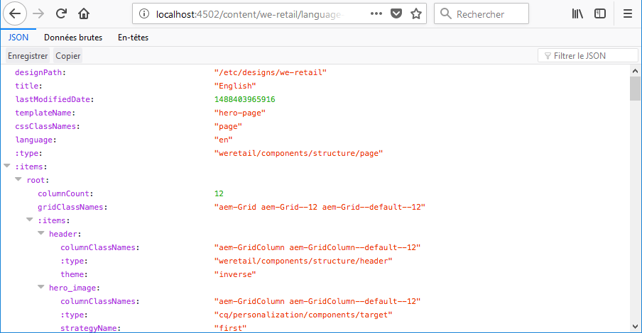
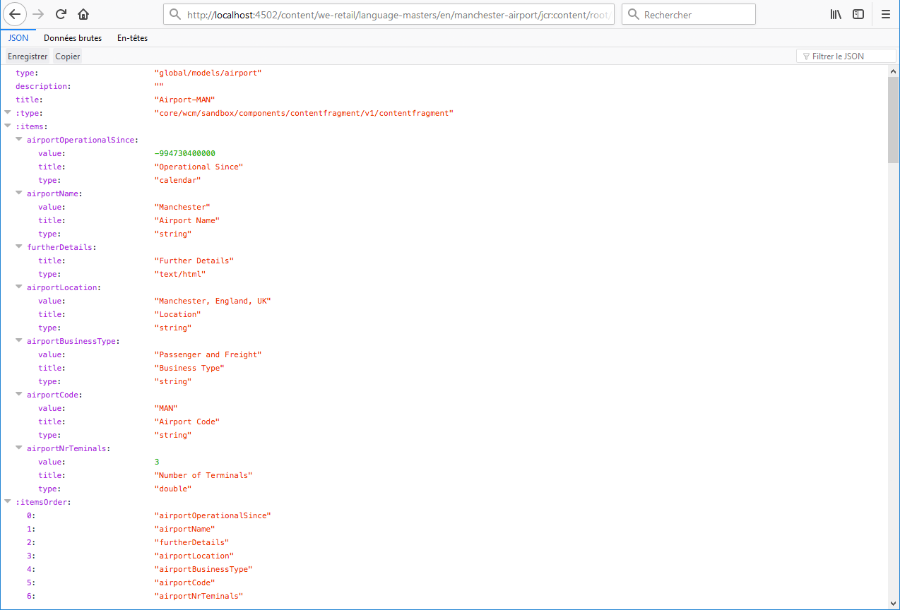

# Exportateur JSON pour les services de contenu{#json-exporter-for-content-services}

Les services de contenu AEM sont conçus pour généraliser la description et la diffusion du contenu dans/depuis AEM, au-delà des pages web.

Ils assurent la diffusion du contenu aux canaux autres que les pages web AEM classiques, à l’aide de méthodes normalisées qui peuvent être utilisées par tous les clients. Ces canaux peuvent inclure :

* [des applications sur une seule page ;](spa-walkthrough.md)
* des applications mobiles natives ;
* d’autres canaux et points de contact externes à AEM.

Avec les fragments de contenu qui utilisent du contenu structuré, vous pouvez fournir des services de contenu en utilisant l’exportateur JSON pour fournir le contenu d’une page AEM (y) au format de modèle de données JSON. Ce contenu peut ensuite être utilisé dans vos propres applications.

>[!NOTE]
>
>The functionality described here is available for all Core Components since [release 1.1.0 of the Core Components](https://docs.adobe.com/content/docs/fr/core-components/v1.html).

## Exportateur JSON avec les composants principaux des fragments de contenu {#json-exporter-with-content-fragment-core-components}

Grâce à l’exportateur JSON AEM, vous pouvez diffuser le contenu des pages AEM au format du modèle de données JSON. Ce contenu peut ensuite être utilisé dans vos propres applications.

Dans AEM, la diffusion est réalisée à l’aide du sélecteur `model` et de l’ `.json` extension.

`.model.json`

1. Par exemple, une adresse URL comme :

   ```shell
   http://localhost:4502/content/we-retail/language-masters/en.model.json
   ```

1. diffusera du contenu comme :

   

Vous pouvez également diffuser le contenu d’un fragment de contenus structuré en le ciblant spécifiquement.

Pour ce faire, utilisez le chemin du fragment dans son intégralité (via `jcr:content`), par exemple avec un suffixe comme :

`.../jcr:content/root/responsivegrid/contentfragment.model.json`

Votre page peut contenir un fragment de contenu unique ou plusieurs composants de différents types. Vous pouvez également utiliser des mécanismes tels que des composants de liste pour rechercher automatiquement du contenu pertinent.

* Par exemple, une adresse URL comme :

   ```shell
   http://localhost:4502/content/we-retail/language-masters/en/manchester-airport/jcr:content/root/responsivegrid/contentfragment.model.json
   ```

* diffusera du contenu comme :

   

   >[!NOTE]
   >
   >Vous pouvez[ adapter vos propres composants](/help/sites-developing/json-exporter-components.md) pour accéder à ces données et les utiliser.

   >[!NOTE]
   >
   >Bien qu’il ne s’agisse pas d’une mise en oeuvre standard, [plusieurs sélecteurs sont pris en charge,](json-exporter-components.md#multiple-selectors) mais `model` doivent être les premiers.

### Informations supplémentaires {#further-information}

Voir également :

* API HTTP Assets

   * [API HTTP Assets](/help/assets/mac-api-assets.md)

* Modèles Sling:

   * [Modèles Sling - Association d’une classe de modèles à un type de ressource depuis la version 1.3.0](https://sling.apache.org/documentation/bundles/application d’une seule pages.html#associating-a-application d’une seule page-class-with-a-resource-type-since-130)

* AEM avec JSON :

   * [Obtention d’informations sur la page au format JSON](/help/sites-developing/pageinfo.md)

## Documentation connexe {#related-documentation}

Pour plus d’informations, voir :

* [Rubrique Fragments de contenu du guide de l’utilisateur Assets](https://helpx.adobe.com/experience-manager/6-4/assets/user-guide.html?topic=/experience-manager/6-4/assets/morehelp/content-fragments.ug.js)

* [Modèles de fragment de contenu](/help/assets/content-fragments-models.md)
* [Création à l’aide de fragments de contenu](/help/sites-authoring/content-fragments.md)
* [Activation de l’exportateur JSON pour un composant](/help/sites-developing/json-exporter-components.md) 

* [Composants principaux](https://docs.adobe.com/content/help/fr-FR/experience-manager-core-components/using/introduction.html) et [composant Fragment de contenu](https://helpx.adobe.com/experience-manager/core-components/using/content-fragment-component.html)

