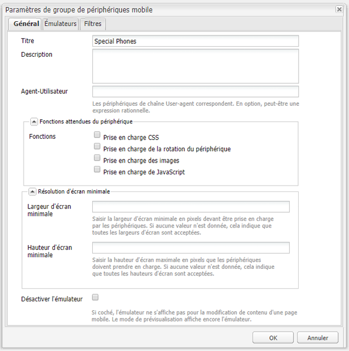

# Créer des sites adaptés aux appareils mobiles{#creating-sites-for-mobile-devices}

>[!NOTE]
>
>Adobe recommande d’utiliser l’éditeur SPA pour les projets nécessitant un rendu côté client, basé sur un framework, pour une application à une seule page (comme React). [En savoir plus](/help/sites-developing/spa-overview.md).

La création d’un site mobile est similaire à celle d’un site classique en ce sens qu’il faut également créer des modèles et des composants. Pour plus de détails sur la création de modèles et de composants, veuillez vous reporter aux pages suivantes : [Modèles](/help/sites-developing/templates.md), [Composants](/help/sites-developing/components.md) et [Prise en main du développement d’AEM Sites](/help/sites-developing/getting-started.md). La principale différence entre les deux consiste à activer les fonctionnalités mobiles intégrées d’Adobe Experience Manager (AEM) sur le site. Pour ce faire, créez un modèle qui repose sur le composant de page mobile.

Envisagez d’utiliser [Responsive Design](/help/sites-developing/responsive.md) pour créer un site unique prenant en charge plusieurs tailles d’écran.

Pour commencer, vous pouvez consulter le **Site de démonstration mobile We.Retail** disponible dans AEM.

Pour créer un site mobile, procédez comme suit :

1. Créez le composant de page :

   * Définissez la propriété `sling:resourceSuperType` sur `wcm/mobile/components/page`.
De cette façon, le composant repose sur le composant de page mobile.

   * Créez le `body.jsp` avec la logique spécifique au projet.

1. Créez le modèle de page :

   * Définissez la propriété `sling:resourceType` sur le composant de page nouvellement créé.
   * Définissez la propriété `allowedPaths`.

1. Créez la page de conception pour le site.
1. Créez la page racine du site sous le nœud `/content` :

   * Définissez la propriété `cq:allowedTemplates`.
   * Définissez la propriété `cq:designPath`.

1. Dans les propriétés de page de la page racine du site, définissez les groupes d’appareils dans l’onglet **Mobile**.
1. Créez les pages du site en vous servant du nouveau modèle.

Le composant de page mobile (`/libs/wcm/mobile/components/page`) :

* Ajoute l’onglet **Mobile** à la boîte de dialogue des propriétés de la page.
* Grâce à son `head.jsp`, il extrait le groupe d’appareils mobiles actuel de la requête et, si un groupe d’appareils est identifié, il utilise la méthode `drawHead()` du groupe pour ajouter le composant d’initialisation de l’émulateur associé du groupe d’appareils (uniquement en mode de création) et le rendu CSS du groupe d’appareils.

>[!NOTE]
>
>La page racine du site mobile doit être au niveau 1 de la hiérarchie des nœuds et il est recommandé de se placer sous le nœud /content.

## Création d’un site mobile avec Multi Site Manager {#creating-a-mobile-site-with-the-multi-site-manager}

Utilisez Multi Site Manager (MSM) pour créer une Live Copy mobile à partir d’un site classique. Celui-ci est automatiquement transformé en site mobile qui possède toutes les fonctionnalités des sites mobiles (par exemple, modification dans un émulateur) et peut être géré en synchronisation avec le site classique. Reportez-vous à la section [Création d’une Live Copy pour différents canaux](/help/sites-administering/msm.md) de la page Multi-Site Manager.

## API mobile côté serveur {#server-side-mobile-api}

Les packages Java™ contenant les classes mobiles sont les suivants :

* [com.day.cq.wcm.mobile.api](https://developer.adobe.com/experience-manager/reference-materials/6-5/javadoc/com/day/cq/wcm/mobile/api/device/capability/package-summary.html) - Définit MobileConstants.
* [com.day.cq.wcm.mobile.api.device](https://developer.adobe.com/experience-manager/reference-materials/6-5/javadoc/com/day/cq/wcm/mobile/api/device/package-summary.html) - Définit Device, DeviceGroup et DeviceGroupList.
* [com.day.cq.wcm.mobile.api.device.capability](https://developer.adobe.com/experience-manager/reference-materials/6-5/javadoc/com/day/cq/wcm/mobile/api/device/capability/package-summary.html) - Définit DeviceCapability.
* [com.day.cq.wcm.mobile.api.wurfl](https://developer.adobe.com/experience-manager/reference-materials/6-5/javadoc/com/day/cq/wcm/workflow/api/package-summary.html) - Définit WurflQueryEngine.
* [com.day.cq.wcm.mobile.core](https://developer.adobe.com/experience-manager/reference-materials/6-5/javadoc/com/day/cq/wcm/mobile/core/package-summary.html) - Définit MobileUtil, qui fournit diverses méthodes utilitaires relatives à WCM Mobile.

### Composants mobiles {#mobile-components}

Le **site mobile de démonstration We.Retail** utilise les composants mobiles suivants, situés sous `/libs/foundation/components` :

<table>
 <tbody>
  <tr>
   <td>Nom</td>
   <td>Groupe</td>
   <td>Caractéristiques</td>
  </tr>
  <tr>
   <td>mobilefooter</td>
   <td>caché</td>
   <td>- Pied de page</td>
  </tr>
  <tr>
   <td>mobileimage</td>
   <td>Mobile</td>
   <td>- Basé sur le composant de base d’image<br /> - Effectue le rendu d’une image si l’appareil en est capable<br /> </td>
  </tr>
  <tr>
   <td>mobilelist</td>
   <td>Mobile</td>
   <td>- Basé sur le composant list foundation<br /> - listitem_teaser.jsp effectue le rendu d’une image si l’appareil en est capable<br /> </td>
  </tr>
  <tr>
   <td>mobilelogo</td>
   <td>caché</td>
   <td>- Basé sur le composant de base du logo<br /> - effectue le rendu d’une image si l’appareil en est capable<br /> </td>
  </tr>
  <tr>
   <td>mobilereference</td>
   <td>Mobile</td>
   <td><p>- Similaire au composant de base de référence</p> <p>- Mappe un composant textimage à un composant mobiletextimage et un composant image à un élément mobileimage</p> </td>
  </tr>
  <tr>
   <td>mobiletextimage</td>
   <td>Mobile</td>
   <td>- Basé sur le composant textimage foundation<br /> - Effectue le rendu d’une image si l’appareil en est capable</td>
  </tr>
  <tr>
   <td>mobiletopnav</td>
   <td>caché</td>
   <td><p>- Basé sur le composant topnav foundation</p> <p>- Effectue uniquement le rendu du texte</p> </td>
  </tr>
 </tbody>
</table>

#### Créer un composant mobile {#creating-a-mobile-component}

Le framework AEM Mobile permet de développer des composants sensibles au type d’appareil émettant la requête. Les exemples de code suivants montrent comment utiliser l’API mobile AEM dans un composant jsp et en particulier comment exécuter les actions suivantes : 

* Récupérer la classe d’appareil à partir de la requête :
  `Device device = slingRequest.adaptTo(Device.class);`

* Récupérer le groupe d’appareils :
  `DeviceGroup deviceGroup = device.getDeviceGroup();`

* Récupérer les fonctions du groupe d’appareils :
  `Collection<DeviceCapability> capabilities = deviceGroup.getCapabilities();`

* Récupérer les attributs de l’appareil (paire clé/valeur de fonction brute issue de la base de données WURFL) :
  `Map<String,String> deviceAttributes = device.getAttributes();`

* Récupérer le User-Agent de l’appareil :
  `String userAgent = device.getUserAgent();`

* Récupérer la liste des groupes d’appareils (groupes d’appareils affectés au site par l’auteur) à partir de la page active :
  `DeviceGroupList deviceGroupList = currentPage.adaptTo(DeviceGroupList.class);`

* Vérifier si le groupe d’appareils prend en charge les images :
  `if (deviceGroup.hasCapability(DeviceCapability.CAPABILITY_IMAGES)) {`
...
OU
  `if MobileUtil.hasCapability(request, DeviceCapability.CAPABILITY_IMAGES) {`
...

>[!NOTE]
>
>Dans un fichier jsp, `slingRequest` est disponible avec la balise `<sling:defineObjects>` et `currentPage` avec la balise `<cq:defineObjects>`.

### Émulateurs {#emulators}

La création basée sur émulateur permet aux auteurs de créer des pages de contenu compatibles avec des clients mobiles. La création de contenu mobile suit le même principe que l’édition WYSIWYG locale. Pour que les auteurs puissent faire l’expérience du rendu de la page sur un appareil mobile, une page de contenu mobile est modifiée à l’aide d’un émulateur d’appareil.

Les émulateurs d’appareils mobiles sont basés sur un framework d’émulation générique. Pour plus d’informations, consultez [Émulateurs](/help/sites-developing/emulators.md).

L’émulateur affiche l’appareil mobile sur la page pendant que les modifications normales (parsys, composants) sont apportées sur l’écran de l’appareil. Le type d’émulateur dépend des groupes d’appareils configurés pour le site. Plusieurs émulateurs peuvent être affectés à un seul groupe d’appareils. Tous les émulateurs sont alors disponibles sur la page de contenu. Par défaut, le premier émulateur affecté au premier groupe d’appareils attribué au site est affiché. Les émulateurs peuvent être activés au moyen du carrousel d’émulateurs en haut de la page ou avec le bouton de modification du sidekick.

**Création d’un émulateur**

Pour créer un émulateur, consultez la section [Créer un émulateur mobile personnalisé](/help/sites-developing/emulators.md) de la page Émulateurs générique.

**Principales caractéristiques des émulateurs mobiles**

* Un groupe d’appareils est composé d’un ou de plusieurs émulateurs : la page de configuration du groupe d’appareils, par exemple /etc/mobile/groups/touch, contient la propriété `emulators` sous le nœud `jcr:content`.
Remarque : bien que le même émulateur puisse être affecté à plusieurs groupes d’appareils, ce n’est pas très logique.

* Dans la boîte de dialogue de configuration du groupe d’appareils, la propriété `emulators` est définie avec le chemin du ou des émulateurs souhaités. Par exemple : `/libs/wcm/mobile/components/emulators/iPhone4`.

* Les composants de l’émulateur (par exemple, `/libs/wcm/mobile/components/emulators/iPhone4`) étendent le composant de l’émulateur mobile de base (`/libs/wcm/mobile/components/emulators/base`).

* Chaque composant qui étend l’émulateur mobile de base peut être sélectionné lors de la configuration d’un groupe d’appareils. Les émulateurs personnalisés peuvent ainsi être facilement créés ou étendus.
* Au moment de la requête en mode d’édition, l’implémentation de l’émulateur est utilisée pour effectuer le rendu de la page.
* Lorsque le modèle de la page repose sur le composant de page mobile, les fonctionnalités de l’émulateur sont automatiquement intégrées dans la page (via le `head.jsp` du composant de page mobile).

### Groupes d’appareils {#device-groups}

Les groupes d’appareils mobiles fournissent une segmentation des appareils mobiles selon les caractéristiques fonctionnelles de chaque appareil. Un groupe d’appareils fournit les informations nécessaires à la création par émulateur sur l’instance de création et au rendu correct sur l’instance de publication : une fois que les auteurs ont ajouté du contenu à la page mobile et l’ont publié, la page peut être demandée sur l’instance de publication. Sur cette instance, au lieu de la vue en mode de modification de l’émulateur, la page de contenu est rendue selon l’un des groupes d’appareils configurés. La sélection du groupe d’appareils se fait en fonction de la [détection des appareils mobiles](#devicedetection). Le groupe d’appareils correspondant fournit les informations de style nécessaires.

Les groupes d’appareils sont définis comme des pages de contenu `/etc/mobile/devices` et utilisent le modèle **Groupe de périphériques mobiles**. Celui-ci sert de modèle de configuration pour les définitions de groupe d’appareils sous la forme de pages de contenu. Ses caractéristiques principales sont les suivantes :

* Emplacement : `/libs/wcm/mobile/templates/devicegroup`
* Chemin d’accès autorisé : `/etc/mobile/groups/*`
* Composant de page : `wcm/mobile/components/devicegroup`

#### Affecter des groupes d’appareils à votre site {#assigning-device-groups-to-your-site}

Lorsque vous créez un site mobile, vous devez affecter des groupes d’appareils au site. AEM fournit trois groupes d’appareils en fonction des capacités de HTML et de rendu JavaScript de l’appareil :

* **Téléphones mobiles basiques**, pour les appareils comme le Sony Ericsson W800 avec prise en charge du HTML de base, mais pas des images et de JavaScript.
* **Smartphones**, pour les appareils comme le BlackBerry® avec prise en charge du HTML basique et des images, mais pas de JavaScript.

* **Téléphones tactiles**, pour les appareils comme l’iPad avec prise en charge complète du HTML, des images, de JavaScript et de la rotation des appareils.

Dans la mesure où les émulateurs peuvent être associés à un groupe d’appareils (voir la section [Création d’un groupe d’appareils](#creating-a-device-group)), l’affectation d’un groupe d’appareils à un site permet aux auteurs de sélectionner les émulateurs associés au groupe d’appareils pour modifier la page.

Pour affecter un groupe d’appareils à votre site :

1. Dans votre navigateur, accédez à la console **Siteadmin**.
1. Ouvrez la page racine de votre site mobile sous **Sites web**.
1. Ouvrez les propriétés de page.
1. Sélectionnez l’onglet **Mobile**.

   * Définissez les groupes d’appareils.
   * Cliquez sur **OK**.

>[!NOTE]
>
>Lorsque les groupes d’appareils ont été définis pour un site, ils sont hérités par toutes les pages du site.

#### Filtres du groupe d’appareils {#device-group-filters}

Les filtres de groupe d’appareils définissent des critères fonctionnels pour déterminer si un appareil appartient ou non à un groupe. Lorsque vous créez un groupe d’appareils, vous pouvez sélectionner les filtres à utiliser pour évaluer les appareils.

Au moment de l’exécution, quand AEM reçoit une requête HTTP d’un appareil, chaque filtre associé à un groupe compare les caractéristiques de l’appareil avec des critères spécifiques. L’appareil est considéré comme appartenant au groupe lorsqu’il possède toutes les caractéristiques que le filtre impose. Les caractéristiques sont extraites de la base de données WURFL™.

Les groupes d’appareils peuvent utiliser aucun ou plusieurs filtres pour la détection des caractéristiques. De plus, un filtre peut être utilisé avec plusieurs groupes d’appareils. AEM fournit un filtre par défaut qui détermine si l’appareil dispose des fonctionnalités sélectionnées pour un groupe :

* CSS
* Images JPG et PNG
* JavaScript
* Rotation de l’appareil

Si le groupe d’appareils n’utilise pas de filtre, les caractéristiques sélectionnées configurées pour le groupe sont les seules que l’appareil doit posséder.

Pour plus d’informations, consultez la section [Création de filtres de groupes d’appareils](/help/sites-developing/groupfilters.md).

#### Créer un groupe d’appareils {#creating-a-device-group}

Créez un groupe d’appareils lorsque les groupes AEM installés ne répondent pas à vos besoins.

1. Dans votre navigateur, accédez à la console **Outils**.
1. Créez une page sous **Outils** > **Mobile** >**Groupes d’appareils**. Dans la boîte de dialogue **Créer une page** :

   * Comme **Titre**, saisissez `Special Phones`.

   * Dans **Nom**, saisissez `special`.

   * Sélectionnez le **Modèle de groupe d’appareils mobiles**.
   * Cliquez sur **Créer**.

1. Dans CRXDE, ajoutez un fichier **static.css** contenant les styles du groupe d’appareils sous le nœud `/etc/mobile/groups/special`.

1. Ouvrez la page **Special Phones**.
1. Pour configurer le groupe d’appareils, cliquez sur le bouton **Modifier** à côté de **Paramètres**.
Dans l’onglet **Général** :

   * **Titre** : nom du groupe d’appareils mobiles
   * **Description** : description du groupe.
   * **User-Agent** : chaîne user-agent avec laquelle les appareils sont mappés. Paramètre facultatif qui peut être une expression régulière. Exemple : `BlackBerryZ10`
   * **Fonctionnalités** : définit si le groupe peut gérer les images, la feuille de style CSS, le code JavaScript ou la rotation de l’appareil.
   * **Largeur d’écran minimale** et **Hauteur**
   * **Désactiver l’émulateur** : pour activer/désactiver l’émulateur pendant la modification du contenu.

   Dans l’onglet **Émulateurs** :

   * **Émulateurs** : sélectionnez les émulateurs affectés à ce groupe d’appareils.

   Dans l’onglet **Filtres** :

   * Pour ajouter un filtre, cliquez sur Ajouter un élément et sélectionnez un filtre dans la liste déroulante.
   * Les filtres sont évalués dans l’ordre dans lequel ils apparaissent. Lorsqu’un appareil ne répond pas aux critères d’un filtre, les filtres suivants sur la liste ne sont pas évalués.

1. Cliquez sur OK.

La boîte de dialogue de configuration du groupe d’appareils mobiles se présente comme suit :



#### Feuille de style CSS personnalisée par groupe d’appareils {#custom-css-per-device-group}

Comme décrit précédemment, il est possible d’associer une feuille de style CSS personnalisée à une page de groupe d’appareils, tout comme la feuille de style CSS d’une page de conception. Cette feuille de style CSS est utilisée pour influencer le rendu spécifique au groupe d’appareils du contenu de la page sur les instances de création et de publication. Cette feuilles de style CSS est alors automatiquement incluse :

* Dans la page de l’instance de création, pour chaque émulateur utilisé par ce groupe d’appareils.
* Dans la page sur l’instance de publication, si la chaîne de l’agent-utilisateur de la requête correspond à un appareil mobile appartenant à ce groupe d’appareils particulier.

## Détection des appareils côté serveur {#server-side-device-detection}

Utilisez des filtres et une bibliothèque de spécifications d’appareil pour déterminer les fonctionnalités de l’appareil qui exécute la requête HTTP.

### Développement de filtres de groupe d’appareils {#develop-device-group-filters}

Créez un filtre de groupe d’appareils pour définir un ensemble d’exigences en termes de caractéristiques d’appareil. Créez autant de filtres que nécessaire pour cibler les groupes de fonctionnalités d’appareil nécessaires.

Concevez vos filtres de sorte à pouvoir utiliser des combinaisons pour définir des groupes de caractéristiques. Généralement, certaines caractéristiques sont communes à différents groupes d’appareils. Par conséquent, vous pouvez utiliser certains filtres avec plusieurs définitions de groupe d’appareils.

Après avoir créé un filtre, vous pouvez l’utiliser dans la configuration du groupe.

Pour plus d’informations, consultez la section [Création de filtres de groupe d’appareils](/help/sites-developing/groupfilters.md).

### Utilisation de la base de données WURFL™ {#using-the-wurfl-database}

AEM utilise une version tronquée de la base de données [WURFL](https://wurfl.sourceforge.net/)™ pour interroger les caractéristiques des appareils, telles que la résolution d’écran ou la prise en charge de JavaScript, selon l’agent-utilisateur de l’appareil.

Le code XML de la base de données WURFL™ est représenté sous la forme de nœuds sous `/var/mobile/devicespecs` en analysant le fichier `wurfl.xml` sous `/libs/wcm/mobile/devicespecs/wurfl.xml.`. L’extension aux nœuds se produit la première fois que le lot `cq-mobile-core` est démarré.

Les caractéristiques des appareils sont stockées en tant que propriétés de nœud. Les nœuds représentent les modèles d’appareil. Vous pouvez utiliser des requêtes pour récupérer les caractéristqiues d’un appareil ou d’un agent utilisateur.

Puisque la base de données WURFL™ évolue, il faudra peut-être la personnaliser ou la remplacer. Pour mettre à jour la base de données des appareils mobiles, vous disposez des options suivantes :

* Remplacer le fichier par la dernière version, à condition de posséder une licence qui autorise cette utilisation. Voir Installation d’une autre base de données WURF.
* Utiliser la version disponible dans AEM et configurer une expression régulière qui correspond à vos chaînes User-Agent et pointe vers un appareil WURFL™ existant. Consultez la section [Ajout d’un mappage Utilisateur-Agent basé sur une expression régulière](#adding-a-regexp-based-user-agent-matching).

#### Test du mappage entre un agent-utilisateur et les fonctionnalités WURFL™ {#testing-the-mapping-of-a-user-agent-to-wurfl-capabilities}

Lorsqu’un appareil accède à votre site pour appareils mobiles, AEM le détecte, le mappe à un groupe d’appareils d’après ses fonctions et diffuse un rendu de la page qui est adapté au groupe d’appareils. Le groupe d’appareils correspondant fournit les informations de style nécessaires. Les mappages peuvent être testés sur la page de test du User-Agent mobile :

`https://localhost:4502/etc/mobile/useragent-test.html`

#### Installation d’une autre base de données WURFL™ {#installing-a-different-wurfl-database}

La base de données WURFL™ tronquée installée avec AEM est une version antérieure au
30 août 2011. Si votre version de WURFL a été publiée après le 30 août 2011, assurez-vous que l’utilisation que vous en faites est conforme à votre licence.

Pour installer une base de données WURFL™, procédez comme suit : 

1. Dans CRXDE Lite, créez le dossier suivant : `/apps/wcm/mobile/devicespecs`.
1. Copiez le fichier WURFL™ dans le dossier.
1. Renommez ce fichier `wurfl.xml`.

AEM analyse automatiquement le fichier `wurfl.xml` et met à jour les nœuds `/var/mobile/devicespecs`.

>[!NOTE]
>
>Lorsque la base de données WURFL™ complète est activée, l’analyse et l’activation peuvent prendre quelques minutes. Vous pouvez consulter les journaux pour obtenir des informations de progression.

#### Ajout d’un mappage d’agent-utilisateur basé sur une expression régulière {#adding-a-regexp-based-user-agent-matching}

Ajoutez une chaîne user-agent en tant qu’expression régulière sous /apps/wcm/mobile/devicespecs/wurfl/regexp pour désigner un type d’appareil WURFL™ existant.

1. Dans **CRXDE Lite**, créez un noeud dans /apps/wcm/mobile/devicespecs/regexp, par exemple : `apple_ipad_ver1`.
1. Ajoutez les propriétés suivantes au nœud :

   * **regexp** : expression régulière définissant les agents-utilisateurs, par exemple :&#42;Mozilla.&#42;iPad.&#42;AppleWebKit.&#42;Safari.&#42;
   * **deviceId** : ID d’appareil tel que défini dans le fichier wurfl.xml, par exemple : `apple_ipad_ver1`

La configuration ci-dessus provoque le mappage des appareils pour lesquels le user-agent correspond à l’expression régulière fournie avec l’ID d’appareil WURFL™ apple_ipad_ver1, s’il existe.

## Détection des appareils côté client {#client-side-device-detection}

Cette section décrit comment utiliser la détection des appareils côté client d’AEM pour optimiser le rendu des pages ou fournir des versions de site web différentes aux clientes et clients.

AEM prend en charge la détection côté client d’appareils avec `BrowserMap`. Dans AEM, `BrowserMap` se présente comme une bibliothèque cliente sous `/etc/clientlibs/browsermap`.

`BrowserMap` offre trois alternatives pour fournir un site web secondaire à un client ou une cliente. Elles sont appliquées dans l’ordre suivant :

1. [Des liens secondaires](#providing-alternate-links)
1. [Une URL spécifique au groupe d’appareils](#definingdevicegroupspecificurl)
1. [Une URL basée sur un sélecteur](#defining-selector-based-urls)

>[!NOTE]
>
>Pour plus d’informations sur l’intégration de la bibliothèque cliente, consultez [Utilisation de bibliothèques HTML côté client](/help/sites-developing/clientlibs.md).

### Liens secondaires {#providing-alternate-links}

Le service `PageVariantsProvider` OSGi est capable de générer des liens secondaires pour les sites appartenant à la même famille. Pour configurer les sites concernés par le service, un nœud `cq:siteVariant` doit être ajouté au nœud `jcr:content` à la racine du site.

Le nœud `cq:siteVariant` doit posséder les propriétés suivantes :

* `cq:childNodesMapTo` - Détermine avec quel attribut de l’élément de lien les nœuds enfants seront mappés. Il est recommandé d’organiser le contenu de votre site de manière à ce que les enfants du nœud racine représentent la racine d’une variante de langue de votre site web international (par exemple `/content/mysite/en`, `/content/mysite/de`), auquel cas la valeur de `cq:childNodesMapTo` doit être `hreflang`.
* `cq:variantDomain` - Indique le domaine `Externalizer` qui sera utilisé pour générer les URL absolues de variantes de page. Si cette valeur n’est pas définie, les variantes de page sont générées avec des liens relatifs.
* `cq:variantFamily` - Indique à quelle famille de sites appartient ce site. Plusieurs rendus spécifiques à chaque appareil d’un même site web doivent appartenir à la même famille.
* `media` - Stocke les valeurs de l’attribut media de l’élément link. Il est recommandé d’utiliser le nom du `BrowserMap` enregistré avec `DeviceGroups`, de sorte que la bibliothèque `BrowserMap` puisse automatiquement rediriger les clients vers la bonne variante du site web.

#### PageVariantsProvider et Externalizer {#pagevariantsprovider-and-externalizer}

Lorsque la valeur de la propriété `cq:variantDomain` d’un nœud `cq:siteVariant` n’est pas vide, le service `PageVariantsProvider` génère des liens absolus en utilisant cette valeur en tant que domaine configuré pour le service `Externalizer`. Assurez-vous de configurer le service `Externalizer` de manière à tenir compte de votre configuration.

>[!NOTE]
>
>Lorsque vous utilisez AEM, plusieurs méthodes permettent de gérer les paramètres de configuration pour ces services. Consultez la section [Configuration d’OSGi](/help/sites-deploying/configuring-osgi.md) pour plus de détails et connaître les pratiques recommandées.

### Définition d’une URL spécifique à un groupe d’appareils {#defining-a-device-group-specific-url}

Si vous ne souhaitez pas utiliser des liens secondaires, vous pouvez configurer une URL globale pour chaque `DeviceGroup`. Adobe vous recommande de créer votre propre bibliothèque cliente qui intègre la bibliothèque cliente `browsermap.standard` mais qui redéfinit les groupes d’appareils.

BrowserMap est conçu de telle sorte que les définitions de groupes d’appareils peuvent être remplacées en créant et en ajoutant un groupe d’appareils du même nom à l’objet `BrowserMap` de votre bibliothèque cliente personnalisée.

>[!NOTE]
>
>Pour plus d’informations, voir [BrowserMap personnalisé](#creatingacustomisedbrowsermap).

### Définition d’une URL basée sur un sélecteur {#defining-selector-based-urls}

Si aucun des mécanismes précédents n’a été utilisé pour indiquer un site secondaire de redirection à `BrowserMap`, les sélecteurs qui utilisent les noms des `DeviceGroups` sont ajoutés aux `URL`, auquel cas vous devez fournir vos propres servlets. Ce sont eux qui géreront les requêtes.

Par exemple, un appareil qui accède à `www.example.com/index.html` identifié comme un `smartphone` par BrowserMap est redirigé vers `www.example.com/index.smartphone.html.`.

### Utilisation de BrowserMap dans les pages {#using-browsermap-on-your-pages}

Pour utiliser la bibliothèque cliente BrowserMap standard dans une page, vous devez inclure le fichier `/libs/wcm/core/browsermap/browsermap.jsp` au moyen de la balise `cq:include` dans la section `head` de votre page.

```xml
<cq:include script="/libs/wcm/core/browsermap/browsermap.jsp" />
```

Outre l’ajout de la bibliothèque cliente `BrowserMap` à vos fichiers `JSP`, vous devez également ajouter une propriété de chaîne `cq:deviceIdentificationMode` définie sur `client-side` au nœud `jcr:content` sous la racine de votre site web.

### Contournement du comportement par défaut de BrowserMap {#overriding-browsermap-s-default-behaviour}

Si vous souhaitez personnaliser `BrowserMap` en remplaçant les `DeviceGroups` ou en ajoutant d’autres sondes, vous devez créer votre propre bibliothèque côté client à laquelle vous incorporez la bibliothèque côté client `browsermap.standard`.

De plus, vous devez appeler manuellement la méthode `BrowserMap.forwardRequest()` dans votre code `JavaScript`.

>[!NOTE]
>
>Pour plus d’informations sur l’intégration de la bibliothèque cliente, consultez [Utilisation de bibliothèques HTML côté client](/help/sites-developing/clientlibs.md).

Une fois la bibliothèque cliente `BrowserMap` personnalisée créée, nous proposons l’approche suivante :

1. Créez un fichier `browsermap.jsp` dans votre application.

   ```xml
   <%@include file="/libs/foundation/global.jsp" %>
   <%@ taglib prefix="c" uri="https://java.sun.com/jsp/jstl/core" %>
   <%@ page import="
       com.day.cq.wcm.api.variants.PageVariant,
       com.day.cq.wcm.api.variants.PageVariantsProvider,
       com.day.cq.wcm.api.devicedetection.DeviceIdentificationMode,
       com.day.cq.wcm.api.WCMMode"
   %>
   <%
       final PageVariantsProvider p = sling.getService(PageVariantsProvider.class);
       if(p == null) {
           throw new IllegalStateException("Missing PageVariantsProvider service");
       }
       for(PageVariant v : p.getVariants(currentPage, slingRequest)) {
           final String curVar = v.getAttributes().get("data-current-variant");
           String media = v.getAttributes().get("media");
           if (media != null) {
               media = media.replaceAll(" ", "");
           }
   %>
       <link
           rel="alternate"
           data-cq-role="site.variant"
           title="<%= xssAPI.encodeForHTMLAttr(v.getTitle()) %>"
           hreflang="<%= xssAPI.encodeForHTMLAttr(v.getAttributes().get("hreflang")) %>"
           media="<%= xssAPI.encodeForHTMLAttr(media) %>"
           href="<%= xssAPI.getValidHref(v.getURL()) %>"
           <% if(curVar != null) { %> data-current-variant="<%= curVar %>"<% } %>
       />
   <%
       }
       Boolean browserMapEnabled = true;
       final DeviceIdentificationMode dim = sling.getService(DeviceIdentificationMode.class);
       String[] selectors  = slingRequest.getRequestPathInfo().getSelectors();
       boolean isPortletRequest = false;
       for (int i = 0; i < selectors.length; i++) {
           if ("portlet".equals(selectors[i])) {
               isPortletRequest = true;
               break;
           }
       }
       if (isPortletRequest) {
           log.debug("Request was made by a portlet container - BrowserMap will not be embedded");
       } else {
           final WCMMode wcmMode = WCMMode.fromRequest(slingRequest);
           boolean shouldIncludeClientLib = false;
           if (WCMMode.EDIT != wcmMode && WCMMode.PREVIEW != wcmMode && WCMMode.DESIGN != wcmMode) {
               if (dim != null) {
                   final String mode = dim.getDeviceIdentificationModeForPage(currentPage);
                   shouldIncludeClientLib = DeviceIdentificationMode.CLIENT_SIDE.equals(mode);
                   if (shouldIncludeClientLib) {
                       browserMapEnabled = (Boolean) request.getAttribute("browsermap.enabled");
                       if (browserMapEnabled == null) {
                           browserMapEnabled = true;
                       }
                   }
               }
           }
   %>
           <c:if test="<%= !browserMapEnabled %>">
               <meta name="browsermap.enabled" content="false">
           </c:if>
           <c:if test="<%= shouldIncludeClientLib %>">
               <meta name="viewport" content="width=device-width, initial-scale=1.0">
               <cq:includeClientLib categories="browsermap.custom"/>
           </c:if>
   <%
       }
   %>
   ```

1. Ajoutez le fichier `broswermap.jsp` à la section head.

   ```xml
   <cq:include script="browsermap.jsp" />
   ```

### Exclusion de BrowserMap de certaines pages {#excluding-browsermap-from-certain-pages}

Si vous souhaitez exclure la bibliothèque BrowserMap de certaines de vos pages où vous n’avez pas besoin de détection client, vous pouvez ajouter un attribut de requête :

```xml
<%
request.setAttribute("browsermap.enabled", false);
%>
```

Le script `/libs/wcm/core/browsermap/browsermap.jsp` ajoutera ainsi une balise meta à la page pour empêcher `BrowserMap` d’effectuer une détection :

```xml
<meta name="browsermap.enabled" content="false">
```

### Test d’une version spécifique d’un site web {#testing-a-specific-version-of-a-web-site}

En règle générale, le script BrowserMap redirige toujours les visiteurs et visiteuses vers la version la mieux adaptée du site web, en les redirigeant généralement vers le site pour poste de travail ou mobile lorsque cela est nécessaire.

Vous pouvez forcer un type d’appareil, peu importe sa requête, à tester une version particulière d’un site web en ajoutant le paramètre `device` à l’URL. L’URL ci-dessous effectue le rendu de la version mobile du site web Geometrixx Outdoors.

`https://localhost:4502/content/geometrixx-outdoors/en.html?wcmmode=disabled&device=smartphone`

>[!NOTE]
>
>Le paramètre par défaut `wcmmode` est défini sur `disabled` afin de simuler le comportement d’une instance de publication.

La valeur remplacée est stockée dans un cookie afin que la navigation sur votre site web soit possible sans ajouter le paramètre `device` à chaque `URL`.

Par conséquent, vous devez appeler la même `URL` avec la valeur `device` définie sur `browser` pour revenir à la version pour poste de travail du site web.

>[!NOTE]
>
>BrowserMap stocke la valeur device remplacée dans un cookie appelé `BMAP_device`. La suppression de ce cookie garantit que CQ diffuse la version appropriée du site web en fonction de votre appareil actuel (par exemple, poste de travail ou mobile).

## Traitement de requête mobile {#mobile-request-processing}

AEM traite les requêtes émises par des appareils mobiles appartenant au groupe d’appareils tactiles comme suit : 

1. Un iPad envoie une requête à l’instance de publication AEM, par ex. `https://localhost:4503/content/geometrixx_mobile/en/products.html`.
1. AEM détermine si le site de la page demandée est un site pour appareils mobiles (en vérifiant si la page de premier niveau `/content/geometrixx_mobile` étend le composant de page mobile). Si oui :
1. AEM vérifie les caractéristiques de l’appareil selon la valeur User-Agent définie dans l’en-tête de la requête.
1. AEM mappe les caractéristiques de l’appareil avec le groupe d’appareils et définit `touch` comme sélecteur de groupe d’appareils.
1. AEM redirige la requête vers `https://localhost:4503/content/geometrixx_mobile/en/products.touch.html.`.
1. AEM envoie la réponse à l’iPad :

   * La page `products.touch.html` est diffusée de manière habituelle et peut être mise en cache.
   * Les composants de rendu utilisent des sélecteurs pour adapter la présentation.
   * AEM ajoute automatiquement le sélecteur mobile à tous les liens internes de la page.

### Statistiques {#statistics}

Vous pouvez obtenir des statistiques sur le nombre de requêtes effectuées sur le serveur AEM par des appareils mobiles. Le nombre de requêtes peut être réparti :

* par groupe d’appareils et par appareil
* par an, mois et jour

Pour afficher les statistiques :

1. Accédez à la console **Outils**.
1. Ouvrez la page **Statistiques des appareils** dans **Outils** > **Mobile**.
1. Cliquez sur le lien pour afficher les statistiques pour une année, un mois ou un jour spécifique.

La page **Statistiques** se présente comme suit :


>[!NOTE]
>
>La page **Statistiques** est créée la première fois qu’un appareil mobile accède à AEM et est détecté. Avant cela, elle n’est pas disponible.

Si vous devez générer une entrée dans les statistiques, vous pouvez procéder comme suit :

1. Utilisez un appareil mobile ou un émulateur (par exemple, https://chrispederick.com/work/user-agent-switcher/ sur Firefox).
1. Envoyez une requête pour la page mobile sur l’instance de création en désactivant le mode de création, par exemple :
   `https://localhost:4502/content/geometrixx_mobile/en/products.html?wcmmode=disabled`

La page **Statistiques** est désormais disponible.

### Prise en charge de la mise en cache de page pour les liens « envoyer un lien à un ami » {#supporting-page-caching-for-send-link-to-a-friend-links}

Les pages mobiles peuvent être mises en cache sur Dispatcher, car les pages rendues pour un groupe d’appareils sont distinguées dans l’URL de la page par le sélecteur de groupe d’appareils, par exemple `/content/mobilepage.touch.html`. Une requête vers une page mobile sans sélecteur n’est jamais mise en cache puisque, dans ce cas, la détection d’appareil fonctionne et redirige au final la page vers le groupe d’appareils correspondant (ou « nomatch » plus précisément). Une page mobile générée avec un sélecteur de groupe d’appareils est traitée par le module de réécriture de liens, qui réécrit tous les liens de la page pour qu’ils contiennent également le sélecteur de groupe d’appareils, évitant ainsi d&#39;effectuer une nouvelle détection d’appareil à chaque clic sur une page déjà qualifiée.

Par conséquent, vous pouvez rencontrer le scénario suivant :

L’utilisateur « Alice » est redirigé vers `coolpage.feature.html` et envoie cette URL à un ami « Robert » qui y accède avec un autre client appartenant au groupe d’appareils `touch`.

Si `coolpage.feature.html` est diffusée à partir d’un cache front-end, AEM ne peut pas analyser la requête pour détecter que le sélecteur mobile ne correspond pas au nouveau User-Agent, et Robert accède à un rendu inadéquat de la page.

Pour résoudre ce problème, vous pouvez inclure une interface de sélection simple sur les pages où les utilisateurs finaux peuvent remplacer le groupe d’appareils sélectionné par AEM. Dans l’exemple ci-dessus, un lien (ou une icône) sur la page permet à la personne utilisatrice finale d’accéder à `coolpage.touch.html` si elle pense que cette version de la page est mieux adaptée à son appareil.
