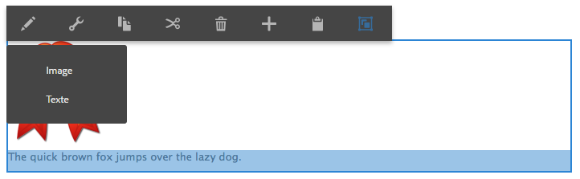

# Configuration de plusieurs éditeurs statiques {#configure-multiple-in-place-editors}

Vous pouvez configurer l’éditeur de texte enrichi dans Adobe Experience Manager afin qu’il dispose de plusieurs éditeurs statiques. Une fois le composant configuré, vous pouvez sélectionner le contenu approprié et ouvrir l’éditeur adéquat.



## Configuration de plusieurs éditeurs {#configure-multiple-editors}

Pour qu’il soit possible d’activer plusieurs éditeurs statiques, la structure d’un type de nœud `cq:InplaceEditingConfig` a été optimisée avec la définition du type de nœud `cq:ChildEditorConfig`.

Par exemple :

```js
   /**
       * Configures in-place editing of a component.
       *
       * @prop active true to activate in-place editing for the component.
       * @prop editorType ID of in-place editor to use.
       * @prop cq:childEditors collection of {@link cq:ChildEditorConfig} nodes.
       * @prop configPath path to editor's config (optional).
       * @node config editor's config (used if no configPath is specified; optional).
     */
    [cq:InplaceEditingConfig] > nt:unstructured
      - active (boolean)
      - editorType (string)
      + cq:childEditors (nt:base) = nt:unstructured
      - configPath (string)
      + config (nt:unstructured) = nt:unstructured

    /**
      * Configures one child editor for a sub-component. The name of the this node is
      * used as DD ID.
      *
      * @prop type type of the inline editor. For example, ["image"].
      * @prop title Title of the inline editor.
      * @prop icon Icon to represent the inline editor.
    */
    [cq:ChildEditorConfig] > nt:unstructured
      orderable
      - type (string)
      - title (string)
```

Pour configurer plusieurs éditeurs, procédez comme suit :

1. Sur le noeud `cq:inplaceEditing` (de type `cq:InplaceEditingConfig`), définissez les propriétés suivantes :

   * Nom:`editorType`
   * Type : `String`
   * Valeur : `hybrid`

1. Sous ce noeud, créez un noeud :

   * Nom : `cq:ChildEditors`
   * Type : `nt:unstructured`

1. Sous le noeud `cq:childEditors` , créez un noeud pour chaque éditeur statique :

   * Nom : Le nom de chaque noeud est le nom de la propriété qu’il représente, comme c’est le cas avec les cibles de dépôt. Par exemple, `image` et `text`.
   * Type : `cq:ChildEditorConfig`

   >[!NOTE]
   >
   >Il existe une corrélation entre les cibles de dépôt définies et les éditeurs enfants. Le nom du noeud `cq:ChildEditorConfig` est considéré comme l’identifiant de la cible de dépôt à utiliser comme paramètre pour l’éditeur enfant sélectionné. Si la sous-zone modifiable ne comporte pas de cible de dépôt, par exemple, dans un composant de texte, le nom de l’éditeur enfant est toujours considéré comme un identifiant pour identifier la zone modifiable correspondante.

1. Sur chacun de ces noeuds (`cq:ChildEditorConfig`), définissez les propriétés :

   * Nom: `type`.
   * Valeur : le nom de l’éditeur statique enregistré ; par exemple, `image` et `text`.

   * Nom: `title`.
   * Valeur : Titre affiché dans la liste de sélection des composants des éditeurs disponibles. Par exemple, `Image` et `Text`.

### Configuration supplémentaire pour les éditeurs de texte enrichi {#additional-configuration-for-rich-text-editors}

La configuration des éditeurs de texte enrichi est légèrement différente, dans la mesure où vous pouvez configurer chaque instance RTE séparément. Pour plus d’informations, voir [Configuration de l’éditeur de texte enrichi](/help/sites-administering/rich-text-editor.md). Pour que plusieurs éditeurs de texte enrichi créent une configuration pour chaque éditeur de texte enrichi statique. Adobe recommande de créer le noeud de configuration sous `cq:InplaceEditingConfig`, car chaque éditeur de texte enrichi peut avoir une configuration différente. Sous le nouveau noeud, créez chaque configuration d’éditeur de texte enrichi.

```xml
    texttext
        cq:dialog
        cq:editConfig
            cq:inplaceEditing
                cq:childEditors
                    someconfig
                        text1
                            rtePlugins
                        text2
                            rtePlugins
```

>[!NOTE]
>
>Cependant, dans le cas de l’éditeur de texte enrichi, la propriété `configPath` est prise en charge lorsque le composant ne contient qu’une seule instance de l’éditeur (sous-zone modifiable). Cette utilisation de `configPath` est fournie pour prendre en charge la compatibilité descendante avec les anciennes boîtes de dialogue de l’interface utilisateur du composant.

>[!CAUTION]
>
>Ne donnez pas le nom `config` au nœud de configuration de l’éditeur de texte enrichi (RTE). Dans le cas contraire, les configurations de l’éditeur de texte enrichi sont disponibles uniquement pour les administrateurs et non pour les utilisateurs du groupe `content-author`.

## Exemples de code {#code-samples}

Vous trouverez le code de cette page sur [projet aem-authoring-hybrideditors sur GitHub](https://github.com/Adobe-Marketing-Cloud/aem-authoring-hybrideditors). Vous pouvez télécharger le projet complet sous la forme [d’une archive ZIP](https://github.com/Adobe-Marketing-Cloud/aem-authoring-hybrideditors/archive/master.zip).

## Ajout d’un éditeur statique {#add-an-in-place-editor}

Pour obtenir des informations générales sur l’ajout d’un éditeur statique, reportez-vous au document [Personnalisation de la création de pages](/help/sites-developing/customizing-page-authoring-touch.md#add-new-in-place-editor).

>[!MORELIKETHIS]
>
>* [Configuration de l’éditeur de texte enrichi dans Experience Manager](/help/sites-administering/rich-text-editor.md).

