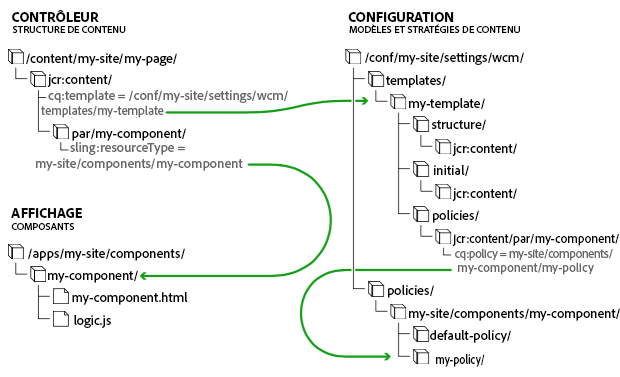

# Modèles de pages – Modifiables {#page-templates-editable}

Les modèles modifiables ont été élaborés pour :

* Permettre aux auteurs spécialisés de [créer et de modifier des modèles](/help/sites-authoring/templates.md).

   * Ces auteurs spécialisés sont connus sous le nom de **créateurs (ou auteurs) de modèles**.
   * Les créateurs de modèles doivent être membres du groupe `template-authors`.

* Fournir des modèles qui conservent un lien dynamique avec les pages qu’ils ont servi à créer. De cette manière, toute modification apportée au modèle est répercutée dans les pages proprement dites.
* Rendre le composant de page plus générique, de sorte que le composant de page principal puisse être utilisé sans personnalisation.

Avec les modèles modifiables, les éléments qui constituent une page sont isolés au sein des composants. Vous pouvez configurer les combinaisons de composants nécessaires dans une interface utilisateur, rendant ainsi inutile le développement d’un nouveau composant de page pour chaque variante de page.

>[!NOTE]
>
>Des [modèles statiques](/help/sites-developing/page-templates-static.md) sont également disponibles.

Ce document :

* vous donne un aperçu du processus de création des modèles modifiables ;

   * For details see [Creating Page Templates](/help/sites-authoring/templates.md)

* décrit les tâches d’administration/de développement requises pour créer des modèles modifiables ;
* décrit les bases techniques des modèles modifiables.

Dans ce document, nous partons du principe que vous êtes déjà rompu à la création et la modification de modèles. Consultez le document [Création de modèles de page](/help/sites-authoring/templates.md) qui détaille les fonctionnalités des modèles modifiables telles qu’elles sont présentées au créateur d’un modèle.

>[!NOTE]
>
>Le didacticiel suivant peut également être intéressant pour la configuration d’un modèle de page modifiable dans un nouveau projet :
>[Prise en main de AEM Sites Partie 2 - Création d&#39;une page et d&#39;un modèle de base](https://helpx.adobe.com/experience-manager/kt/sites/using/getting-started-wknd-tutorial-develop/part2.html)

## Création d’un modèle {#creating-a-new-template}

La création de modèles modifiables s’effectue essentiellement à l’aide de la [console de modèles et de l’éditeur de modèles](/help/sites-authoring/templates.md). Cette tâche est de la responsabilité du créateur de modèles. Cette section vous donne un aperçu de ce processus. Elle décrit ensuite ce qui se passe au niveau technique.

Pour plus d’informations sur l’utilisation de modèles modifiables dans un projet AEM, voir [Création d’un projet AEM à l’aide de Lazybones](https://helpx.adobe.com/experience-manager/using/aem_lazybones.html).

Lors de la création d’un modèle modifiable :

1. Créez un [dossier pour les modèles](#template-folders). Il ne s’agit pas d’une pratique obligatoire, mais vivement recommandée.
1. Sélectionnez un [type de modèle](#template-type). Il est copié afin de créer la [définition du modèle](#template-definitions).

   >[!NOTE]
   >
   >Une sélection de types de modèle prêts à l’emploi est fournie. Au besoin, vous pouvez également [créer vos propres types de modèles spécifiques à un site](/help/sites-developing/page-templates-editable.md#creating-template-types).

1. Configurez la structure, les stratégies de contenu, le contenu initial et la disposition du nouveau modèle.

   **Structure**

   * La structure vous permet de définir les composants et le contenu de votre modèle.
   * Les composants définis dans la structure du modèle ne peuvent être ni déplacés ni supprimés dans les pages créées.

      * Si vous créez un modèle dans un dossier personnalisé en dehors de l’exemple de contenu We.Retail, vous pouvez sélectionner des composants Foundation ou utiliser des [composants principaux](https://helpx.adobe.com/experience-manager/core-components/using/developing.html).
   * Si vous souhaitez que les créateurs de pages puissent ajouter et supprimer des composants, ajoutez un système de paragraphes au modèle.
   * Les composants peuvent être déverrouillés (et reverrouillés) pour que vous puissiez définir le contenu initial.

   Pour plus d’informations sur la façon dont un créateur de modèles définit la structure, voir [Création de modèles de page](/help/sites-authoring/templates.md#editing-a-template-structure-template-author).

   Pour connaître les détails techniques de la structure, consultez la section [Structure](/help/sites-developing/page-templates-editable.md#structure) de ce document.

   **Stratégies**

   * Les stratégies de contenu définissent les propriétés de conception d’un composant.

      * Par exemple, les composants disponibles ou les dimensions minimales/maximales.
   * Elles s’appliquent au modèle (et aux pages créées avec le modèle).

   Pour plus d’informations sur la façon dont un créateur de modèles définit des stratégies, voir [Création de modèles de page](/help/sites-authoring/templates.md#editing-a-template-structure-template-author).

   Pour connaître les détails techniques des stratégies, consultez la section [Stratégies de contenu](/help/sites-developing/page-templates-editable.md#content-policies) de ce document.

   **Contenu initial**

   * Le contenu initial définit le contenu qui s’affiche lors de la création d’une page basée sur le modèle.
   * Le contenu initial peut ensuite être modifié par les créateurs de la page.

   Pour plus d’informations sur la façon dont un créateur de modèles définit la structure, voir [Création de modèles de page](/help/sites-authoring/templates.md#editing-a-template-initial-content-author).

   Pour connaître les détails techniques du contenu initial, consultez la section [Contenu initial](/help/sites-developing/page-templates-editable.md#initial-content) de ce document.

   **Mise en page**

   * Vous pouvez définir la mise en page du modèle pour différents appareils.
   * La mise en page réactive pour les modèles fonctionne de la même manière que pour la création de pages.

   Pour plus d’informations sur la façon dont le créateur d’un modèle définit la mise en page de ce dernier, voir [Création de modèles de page](/help/sites-authoring/templates.md#editing-a-template-layout-template-author).

   Pour connaître les détails techniques de la mise en page du modèle, consultez la section [Mise en page](/help/sites-developing/page-templates-editable.md#layout) de ce document.

1. Activez le modèle, puis autorisez-le pour des arborescences de contenu spécifiques.

   * Un modèle peut être activé ou désactivé pour être mis à la disposition (ou non) des créateurs de pages.
   * Un modèle peut être rendu disponible ou indisponible pour certaines branches de la page.

   Pour plus d’informations sur la façon dont un créateur de modèles active un modèle, voir [Création de modèles de page](/help/sites-authoring/templates.md#enabling-and-allowing-a-template-template-author).

   Pour obtenir des informations techniques sur l’activation d’un modèle, consultez la section [Activation et autorisation d’un modèle à utiliser](/help/sites-developing/page-templates-editable.md#enabling-and-allowing-a-template-for-use) dans ce document

1. Utilisez-le pour créer des pages de contenu.

   * Lorsque vous utilisez un modèle pour créer une page, il n’existe aucune différence visible ni indication permettant de distinguer les modèles statiques des modèles modifiables.
   * Pour le créateur de pages, le processus est transparent.

   For details on how a page author uses templates to create a page, see [Creating and Organizing Pages](/help/sites-authoring/managing-pages.md#templates).

   Pour obtenir des informations techniques sur la création de pages à l’aide de modèles modifiables, consultez la section [Pages de contenu créées](/help/sites-developing/page-templates-editable.md#resultant-content-pages) de ce document.

>[!NOTE]
>
>The editor client library assumes the presence of the `cq.shared` namespace in content pages, and if it is absent the JavaScript error `Uncaught TypeError: Cannot read property 'shared' of undefined` will result.
>
>`cq.shared` est inclus dans tous les exemples de pages de contenu. Par conséquent, tout contenu basé sur ces pages inclut automatiquement `cq.shared`. Toutefois, si vous décidez de créer vos propres pages de contenu à partir de zéro, sans vous servir de l’exemple de contenu, vous devez veiller à inclure l’espace de noms `cq.shared`.
>
>Pour plus d’informations, voir [Utilisation des bibliothèques côté client](/help/sites-developing/clientlibs.md).

>[!CAUTION]
>
>Ne saisissez jamais d’informations qui doivent[ être internationalisées](/help/sites-developing/i18n.md) dans un modèle.

## Dossiers de modèles {#template-folders}

Pour organiser vos modèles, vous pouvez utiliser les dossiers suivants :

* **Global**
* Spécifique au site Les dossiers spécifiques au site que vous créez pour organiser vos modèles sont créés avec des privilèges administrateur de gestion de comptes.

>[!NOTE]
>
>Bien que vous puissiez imbriquer vos dossiers, lorsque l’utilisateur les visualise dans la console **Modèles**, ils sont présentés sous la forme d’une structure plate.

Dans une instance AEM standard, le dossier **Global** existe déjà dans la console de modèles. Il contient les modèles par défaut et fait office de dossier de rechange si le dossier actif ne contient pas de stratégies et/ou de types de modèles. Vous pouvez soit ajouter vos modèles par défaut à ce dossier, soit créer un dossier (recommandé).

>[!NOTE]
>
>Il est conseillé de créer un dossier pour stocker vos modèles personnalisés et de ne pas utiliser le dossier Global.

>[!CAUTION]
>
>Les dossiers doivent être créés par un utilisateur disposant des droits `admin`.

Les types de modèles et les politiques sont hérités dans tous les dossiers selon l’ordre de priorité suivant :

1. Dossier actif
1. Parent(s) du dossier actif
1. `/conf/global`
1. `/apps`
1. `/libs`

Une liste de toutes les entrées autorisées est créée. If any configurations overlap ( `path`/ `label`), only the instance closest to the current folder is presented to the user.

Pour créer un dossier, vous pouvez procéder de l’une des façons suivantes :

* Soit par programmation, soit en utilisant CRXDE Lite
* En utilisant l’explorateur de configurations

## Utilisation de CRXDE Lite {#using-crxde-lite}

1. Un nouveau dossier (sous /conf) peut être créé pour votre instance par programmation ou avec un CRXDE Lite.

   La structure ci-dessous doit être utilisée :

   ```xml
   /conf
       <your-folder-name> [sling:Folder]
           settings [sling:Folder]
               wcm [cq:Page]
                   templates [cq:Page]
                   policies [cq:Page]
   ```

1. Vous pouvez ensuite définir les propriétés ci-dessous sur le nœud racine du dossier :

   `<your-folder-name> [sling:Folder]`

   Nom : `jcr:title`

   * Type : `String`

   * Valeur : titre (du dossier) que vous souhaitez afficher dans la console **Modèles**.

1. *Outre* les autorisations et les droits de création standard (par exemple, `content-authors`), vous devez maintenant affecter les groupes et définir les droits d’accès nécessaires (listes de contrôle d’accès) pour que les créateurs puissent créer des modèles dans le nouveau dossier.

   Le groupe `template-authors` est le groupe par défaut qui doit être affecté. Pour plus d’informations, consultez la section suivante [ACL et groupes](/help/sites-developing/page-templates-editable.md#acls-and-groups).

   See [Access Right Management](/help/sites-administering/user-group-ac-admin.md#access-right-management) for full details on managing and assigning access rights.

### Utilisation de l’explorateur de configurations {#using-the-configuration-browser}

1. Accédez à **Navigation globale** -> **Outils** > **Explorateur de configurations**.

   Les dossiers existants sont répertoriés à gauche, y compris **Global**.

1. Cliquez sur **Créer**.
1. In the **Create Configuration** dialog the following fields need to be configured:

   * **Titre** : indiquez un titre pour le dossier de configuration.
   * **Modèles modifiables** : cochez la case pour autoriser les modèles modifiables dans ce dossier.

1. Cliquez sur **Créer**

>[!NOTE]
>
>Dans l’explorateur de configurations, vous pouvez modifier le dossier global et activer l’option **Modèles modifiables** si vous souhaitez créer des modèles dans ce dossier. Il ne s’agit toutefois pas de la méthode recommandée.
>
>See the [Configuration Browser](/help/sites-administering/configurations.md) documentation for more information.

### ACL et groupes {#acls-and-groups}

Une fois vos dossiers de modèles créés (soit via CRXDE, soit à l’aide de l’explorateur de configurations), des listes de contrôle d’accès (ACL) doivent être définies pour les groupes appropriés afin que les dossiers de modèles garantissent une protection adéquate.

Les dossiers de modèles destinés à l’[implémentation de référence We.Retail](/help/sites-developing/we-retail.md) peuvent être utilisés à titre d’exemple.

#### Groupe template-authors {#the-template-authors-group}

Le groupe `template-authors` est utilisé pour gérer l’accès aux modèles. Il est fourni en standard avec AEM, mais il est vide. Les utilisateurs doivent donc être ajoutés au groupe pour le projet/site.

>[!CAUTION]
>
>Le groupe `template-authors` est destiné *uniquement* aux utilisateurs qui doivent pouvoir créer des modèles.
>
>La modification de modèles est très puissante et si elle n&#39;est pas effectuée correctement, les modèles existants peuvent être endommagés. Par conséquent, ce rôle doit être ciblé et ne contenir que des utilisateurs qualifiés.

Le tableau suivant récapitule les autorisations nécessaires pour la modification de modèles.

<table>
 <tbody>
  <tr>
   <th>Chemin   </th>
   <th>Rôle/Groupe</th>
   <th>Autorisations<br /> </th>
   <th>Description</th>
  </tr>
  <tr>
   <td rowspan="3"><code>/conf/&lt;<i>your-folder</i>&gt;/settings/wcm/templates</code></td>
   <td>Template Authors<br /> </td>
   <td>lecture, écriture, réplication</td>
   <td>Les auteurs de modèles qui créent, lisent, mettent à jour, suppriment et répliquent des modèles dans un <code>/conf</code> espace spécifique au site</td>
  </tr>
  <tr>
   <td>Utilisateur Web anonyme</td>
   <td>lire</td>
   <td>L'utilisateur Web anonyme doit lire les modèles lors du rendu d'une page.</td>
  </tr>
  <tr>
   <td>Auteurs de contenu</td>
   <td>répliquer</td>
   <td>Les auteurs replicateContent doivent activer les modèles d’une page lors de l’activation d’une page.</td>
  </tr>
  <tr>
   <td rowspan="3"><code>/conf/&lt;<i>your-folder</i>&gt;/settings/wcm/policies</code></td>
   <td><code>Template Author</code></td>
   <td>lecture, écriture, réplication</td>
   <td>Les auteurs de modèles qui créent, lisent, mettent à jour, suppriment et répliquent des modèles dans un <code>/conf</code> espace spécifique au site</td>
  </tr>
  <tr>
   <td>Utilisateur Web anonyme</td>
   <td>lire</td>
   <td>L’utilisateur Web anonyme doit lire les stratégies lors du rendu d’une page.</td>
  </tr>
  <tr>
   <td>Auteurs de contenu</td>
   <td>répliquer</td>
   <td>Les auteurs de contenu doivent activer les stratégies d’un modèle de page lors de l’activation d’une page.</td>
  </tr>
  <tr>
   <td rowspan="2"><code>/conf/&lt;site&gt;/settings/template-types</code></td>
   <td>Auteur de modèle</td>
   <td>lire</td>
   <td>L’auteur de modèles crée un modèle basé sur l’un des types de modèles prédéfinis.</td>
  </tr>
  <tr>
   <td>Utilisateur Web anonyme</td>
   <td>none</td>
   <td>L'utilisateur Web anonyme ne doit pas accéder aux types de modèles</td>
  </tr>
 </tbody>
</table>

This default `template-authors` group only covers the project setups, where all `template-authors` members are allowed to access and author all templates. S’agissant des configurations plus complexes, dans lesquelles plusieurs groupes d’auteurs de modèles sont nécessaires pour séparer l’accès aux modèles, il convient de créer davantage de groupes de ce type. Cependant, les autorisations relatives aux groupes d’auteurs de modèles restent les mêmes.

#### Modèles hérités sous /conf/global {#legacy-templates-under-conf-global}

Templates should no longer be stored in `/conf/global`, however for some legacy installations there may still be templates in this location. ONLY in such legacy situations should the following `/conf/global` paths be explicitly configured.

<table>
 <tbody>
  <tr>
   <th>Chemin   </th>
   <th>Rôle/Groupe</th>
   <th>Autorisations<br /> </th>
   <th>Description</th>
  </tr>
  <tr>
   <td rowspan="3"><code>/conf/global/settings/wcm/templates</code></td>
   <td>Auteurs de modèles</td>
   <td>lecture, écriture, réplication</td>
   <td>Les auteurs de modèles qui créent, lisent, mettent à jour, suppriment et répliquent des modèles dans <code>/conf/global</code></td>
  </tr>
  <tr>
   <td>Utilisateur Web anonyme</td>
   <td>lire</td>
   <td>L'utilisateur Web anonyme doit lire les modèles lors du rendu d'une page.</td>
  </tr>
  <tr>
   <td>Auteurs de contenu</td>
   <td>répliquer</td>
   <td>Les auteurs de contenu doivent activer les modèles d’une page lors de l’activation d’une page.</td>
  </tr>
  <tr>
   <td rowspan="3"><code>/conf/global/settings/wcm/policies</code></td>
   <td><code>Template Author</code></td>
   <td>lecture, écriture, réplication</td>
   <td>Les auteurs de modèles qui créent, lisent, mettent à jour, suppriment et répliquent des modèles dans <code>/conf/global</code></td>
  </tr>
  <tr>
   <td>Utilisateur Web anonyme</td>
   <td>lire</td>
   <td>L’utilisateur Web anonyme doit lire les stratégies lors du rendu d’une page.</td>
  </tr>
  <tr>
   <td>Auteurs de contenu</td>
   <td>répliquer</td>
   <td>Les auteurs de contenu doivent activer les stratégies d’un modèle de page lors de l’activation d’une page.</td>
  </tr>
  <tr>
   <td rowspan="2"><code>/conf/global/settings/wcm/template-types</code></td>
   <td>Auteur de modèle</td>
   <td>lire</td>
   <td>L’auteur de modèles crée un modèle basé sur l’un des types de modèles prédéfinis.</td>
  </tr>
  <tr>
   <td>Utilisateur Web anonyme</td>
   <td>none</td>
   <td>L'utilisateur Web anonyme ne doit pas accéder aux types de modèles</td>
  </tr>
 </tbody>
</table>

## Type de modèle {#template-type}

Lors de la création d’un modèle, vous devez spécifier un type :

* Ces types de modèle fournissent effectivement des modèles pour un modèle. Lors de la création d’un modèle, la structure et le contenu initial du type sélectionné sont utilisés.

   * Le type est copié afin de créer le modèle.
   * Une fois la copie effectuée, la seule connexion entre le modèle et son type est une référence statique à des fins d’information.

* Les types de modèle vous permettent de définir les éléments suivants :

   * Le type de ressource du composant de page.
   * La stratégie du nœud racine, laquelle définit les composants autorisés dans l’éditeur de modèles.
   * Il est recommandé de définir les points d’arrêt pour la grille réactive et la configuration de l’émulateur mobile au niveau du type d’émulateur. Cette opération est facultative, car la configuration peut également être définie sur le modèle individuel (voir [Types de modèle et groupes de terminaux mobiles](/help/sites-developing/page-templates-editable.md#p-template-type-and-mobile-device-groups-br-p)).

* AEM fournit une petite sélection de types de modèle prêts à l’emploi tels que Page HTML5 et Page de formulaire adaptatif.

   * D’autres exemples sont fournis dans le cadre de l’exemple de contenu [We.Retail](/help/sites-developing/we-retail.md).

* En règle générale, les types de modèle sont définis par des développeurs.

Les types de modèle prêts à l’emploi sont stockés sous :

* `/libs/settings/wcm/template-types`

>[!CAUTION]
>
>Vous ne devez rien modifier dans le chemin `/libs`. This is because the content of `/libs` is overwritten the next time you upgrade your instance (and may be overwritten when you apply either a hotfix or feature pack).

Les types de modèle spécifiques à un site doivent être stockés dans l’emplacement comparable :

* `/apps/settings/wcm/template-types`

Definitions for your customized templates types should be stored in user-defined folders (recommended) or alternatively in `global`. Par exemple :

* `/conf/<my-folder-01>/<my-folder-02>/settings/wcm/template-types`
* `/conf/<my-folder>/settings/wcm/template-types`
* `/conf/global/settings/wcm/template-types`

>[!CAUTION]
>
>The template types have to respect the correct folder structure (i.e. `/settings/wcm/...`), otherwise the template types will not be found.

### Types de modèle et groupes de terminaux mobiles {#template-type-and-mobile-device-groups-br}

Les [groupes de périphériques](/help/sites-developing/mobile.md#device-groups) utilisés pour un modèle modifiable (défini en tant que chemin d’accès relatif de la propriété `cq:deviceGroups`) définissent les terminaux mobiles disponibles comme émulateurs dans le [mode de mise en page](/help/sites-authoring/responsive-layout.md) de la création de pages. Vous pouvez définir cette valeur à deux emplacements :

* Sur le type de modèle modifiable
* Sur le modèle modifiable

Lors de la création d’un modèle modifiable, la valeur est copiée du type de modèle vers le modèle individuel. Si la valeur n’est pas définie sur le type, elle peut être définie sur le modèle. Une fois le modèle créé, il n’hérite d’aucun élément du type.

>[!CAUTION]
>
>The value of `cq:deviceGroups` must be set as a relative path such as `mobile/groups/responsive` and not as an absolute path such as `/etc/mobile/groups/responsive`.

>[!NOTE]
>
>Avec les [modèles statiques](/help/sites-developing/page-templates-static.md), la valeur de `cq:deviceGroups` peut être définie à la racine du site.
>
>Avec les modèles modifiables, cette valeur est désormais stockée au niveau du modèle et n’est pas prise en charge au niveau racine de la page.

### Création de types de modèle {#creating-template-types}

Si vous avez créé un modèle qui peut servir de base pour d’autres modèles, vous pouvez le copier en tant que type de modèle.

1. Create a template as you would any editable template [as documented here](/help/sites-authoring/templates.md#creating-a-new-template-template-author), which will serve as the basis of your template type.
1. À l’aide de CRXDE Lite, copiez le nouveau modèle depuis le nœud `templates` dans le nœud `template-types` sous le [dossier de modèles](/help/sites-developing/page-templates-editable.md#template-folders).
1. Delete the template from the `templates` node under the [template folder](/help/sites-developing/page-templates-editable.md#template-folders).
1. In the copy of the template that is under the `template-types` node, delete all `cq:template` and `cq:templateType` `jcr:content` properties.

Vous pouvez également développer votre propre type de modèle en utilisant un exemple de modèle modifiable comme base (disponible sur GitHub).

CODE SUR GITHUB

Vous pouvez trouver le code de cette page sur GitHub.

* [Ouvrez un projet aem-sites-example-custom-template-type sur GitHub](https://github.com/Adobe-Marketing-Cloud/aem-sites-example-custom-template-type)
* Téléchargez le projet sous la forme d’[un fichier ZIP](https://github.com/Adobe-Marketing-Cloud/aem-sites-example-custom-template-type/archive/master.zip).

## Définitions de modèle {#template-definitions}

Les définitions des modèles modifiables sont stockées dans des [dossiers définis par l’utilisateur](/help/sites-developing/page-templates-editable.md#template-folders) (ce qui est recommandé) ou bien dans `global`. Par exemple :

* `/conf/<my-folder>/settings/wcm/templates`
* `/conf/<my-folder-01>/<my-folder-02>/settings/wcm/templates`
* `/conf/global/settings/wcm/templates`

Le nœud racine du modèle est de type `cq:Template` avec l’ossature suivante :

```xml
<template-name>
  initial
    jcr:content
      root
        <component>
        ...
        <component>
  jcr:content
    @property status
  policies
    jcr:content
      root
        @property cq:policy
        <component>
          @property cq:policy
        ...
        <component>
          @property cq:policy
  structure
    jcr:content
      root
        <component>
        ...
        <component>
      cq:responsive
        breakpoints
  thumbnail.png
```

Les éléments principaux sont les suivants :

* `<template-name>`

   * ` [initial](#initial-content)`
   * `jcr:content`
   * ` [structure](#structure)`
   * ` [policies](#policies)`
   * `thumbnail.png`

### jcr:content {#jcr-content}

Ce nœud contient des propriétés pour le modèle :

* **Nom** : `jcr:title`

* **Nom** : `status`

   * ``**Type**: `String`

   * **Valeur**: `draft`, `enabled` ou `disabled`

### Structure {#structure}

Définit la structure de la page créée :

* Is merged with the initial content ( `/initial`) when creating a new page.
* Les modifications apportées à la structure sont répercutées dans toute page créée avec le modèle.
* The `root` ( `structure/jcr:content/root`) node defines the list of components that will be available in the resulting page.

   * Les composants définis dans la structure du modèle ne peuvent être ni déplacés ni supprimés dans les pages créées.
   * Une fois qu’un composant est déverrouillé, la propriété `editable` est définie sur `true`.

   * Dès qu’un composant non vide est déverrouillé, son contenu est déplacé vers la branche `initial`.

* The `cq:responsive` node holds definitions for the responsive layout.

### Contenu initial {#initial-content}

Définit le contenu initial dont une nouvelle page disposera au moment de sa création :

* Contient un nœud `jcr:content` copié dans toute nouvelle page.
* Is merged with the structure ( `/structure`) when creating a new page.
* Aucune page existante n’est mise à jour si le contenu initial est modifié après la création.
* Le nœud `root` contient une liste de composants permettant de définir les éléments qui seront disponibles dans la page créée.
* Si du contenu est ajouté à un composant en mode de structure et que ce composant est ensuite déverrouillé (ou inversement), ce contenu est utilisé comme contenu initial.

### Mise en page {#layout}

When [editing a template you can define the layout](/help/sites-authoring/templates.md), this uses [standard responsive layout](/help/sites-authoring/responsive-layout.md) that can also be [configured](/help/sites-administering/configuring-responsive-layout.md).

### Stratégies de contenu {#content-policies}

Les stratégies de contenu (ou de conception) définissent les propriétés de conception d’un composant. Par exemple, les composants disponibles ou les dimensions minimales/maximales. Elles s’appliquent au modèle (et aux pages créées avec le modèle). Les stratégies de contenu peuvent être créées et sélectionnées dans l’éditeur de modèles.

* The property `cq:policy`, on the `root` node
   `/conf/<your-folder>/settings/wcm/templates/<your-template>/policies/jcr:content/root`
Fournit une référence relative à la stratégie de contenu pour le système de paragraphes de la page.

* The property `cq:policy`, on the component-explicit nodes under `root`, provide links to the policies for the individual components.

* Les définitions de stratégie réelles sont stockées sous :
   `/conf/<your-folder>/settings/wcm/policies/wcm/foundation/components`

>[!NOTE]
>
>Les chemins d’accès des définitions de stratégie dépendent du chemin du composant. `cq:policy` contient une référence relative à la configuration elle-même.

>[!NOTE]
>
>L’éditeur de page ne propose pas de mode de conception pour les pages créées à partir de modèles modifiables.
>
>The `policies` tree of an editable template has the same hierarchy as the design mode configuration of a static template under:
>
>`/etc/designs/<my-site>/jcr:content/<component-name>`
>
>La configuration du mode de conception d’un modèle statique a été définie par composant de page.

### Stratégies de page {#page-policies}

Les stratégies de page vous permettent de définir la [stratégie de contenu](#content-policies) de la page (système de paragraphes principal), soit dans le modèle soit dans les pages créées.

### Activation et autorisation d’un modèle à utiliser {#enabling-and-allowing-a-template-for-use}

1. **Activation du modèle**

   Avant de pouvoir être utilisé, un modèle doit être activé en effectuant l’une des opérations suivantes :

   * [Activer le modèle](/help/sites-authoring/templates.md#enablingatemplateauthor) à partir de la console **Modèles**.

   * Setting the status property on the `jcr:content` node.

      * Par exemple, on :
         `/conf/<your-folder>/settings/wcm/templates/<your-template>/jcr:content`

      * Définissez la propriété :

         * Nom : status
         * Type : Chaîne
         * Valeur : `enabled`

1. **Modèles autorisés**

   * [Définissez le(s) chemin(s) d’accès des modèles autorisés dans les **Propriétés de page**](/help/sites-authoring/templates.md#allowing-a-template-author) de la page appropriée ou de la page racine d’une sous-branche.
   * Définissez la propriété :
      `cq:allowedTemplates`
Sur la 
`jcr:content` du noeud de la branche requise.
   Par exemple, avec la valeur suivante :

   `/conf/<your-folder>/settings/wcm/templates/.*`

## Pages de contenu créées {#resultant-content-pages}

Les pages créées à partir de modèles modifiables :

* sont créées avec une sous-arborescence qui est fusionnée à partir de `structure` et `initial` dans le modèle ;

* contiennent des références aux informations contenues dans le modèle et le type de modèle. Pour cela, on utilise un nœud `jcr:content` avec les propriétés suivantes :

   * `cq:template`
Fournit la référence dynamique au modèle proprement dit ; fait en sorte que les modifications apportées au modèle soient répercutées sur les pages proprement dites.

   * `cq:templateType`
Fournit une référence au type de modèle.



Le schéma ci-dessus montre la corrélation entre les modèles, le contenu et les composants :

* Contrôleur - `/content/<my-site>/<my-page>`Page résultante référençant le modèle. Le contenu contrôle l’ensemble du processus. En fonction des définitions, il accède au modèle et aux composants appropriés.

* Configuration : `/conf/<my-folder>/settings/wcm/templates/<my-template>`le [modèle et les stratégies](#template-definitions) de contenu associées définissent la configuration de la page.

* Modèle – Lots OSGi Les [lots OSGi](/help/sites-deploying/osgi-configuration-settings.md) mettent en œuvre la fonctionnalité.

* View - `/apps/<my-site>/components`
On both the author and publish environments the content is rendered by [components](/help/sites-developing/components.md).

Lors du rendu d’une page :

* **Modèles**:

   * The `cq:template` property of its `jcr:content` node will be referenced to access the template that corresponds to that page.

* **Composants**:

   * The page component will merge the `structure/jcr:content` tree of the template with the `jcr:content` tree of the page.

   * Le composant de page autorisera uniquement l’auteur à modifier les nœuds de la structure du modèle qui ont été marqués comme étant modifiables (ainsi que ses éventuels enfants).
   * Lors du rendu d’un composant sur une page, le chemin d’accès relatif de ce composant est prélevé dans le nœud `jcr:content` ; une recherche est ensuite effectuée dans le même emplacement sous le nœud `policies/jcr:content` du modèle.

      * The `cq:policy` property of this node points to the actual content policy (i.e. it holds the design configuration for that component).

      * De cette manière, vous pouvez disposer de plusieurs modèles qui réutilisent les mêmes configurations de stratégie de contenu.
