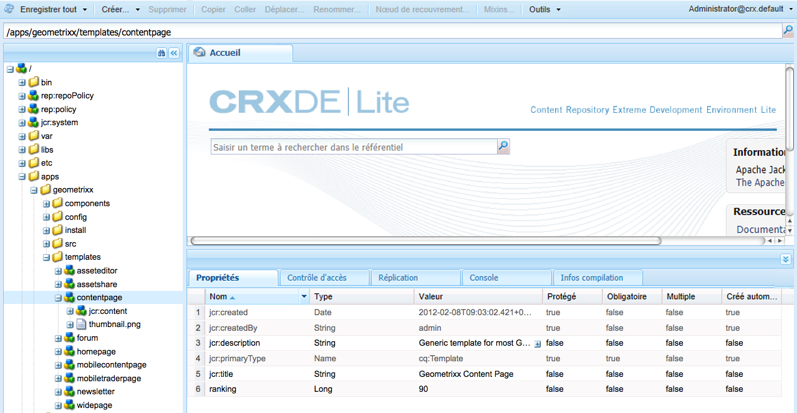
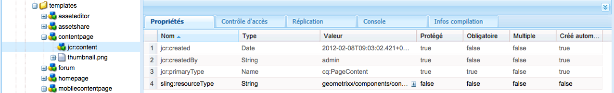
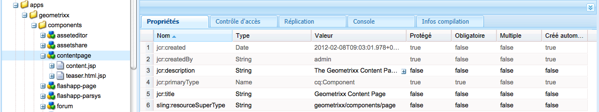
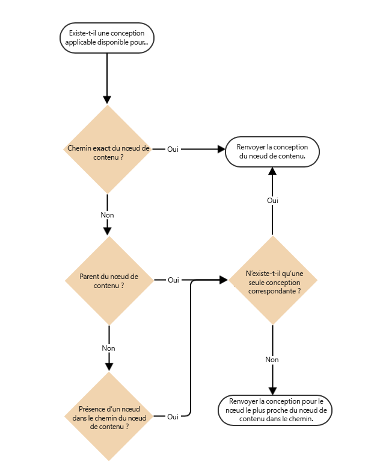
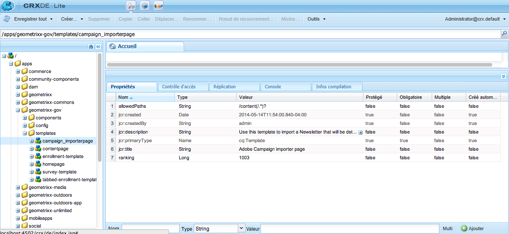
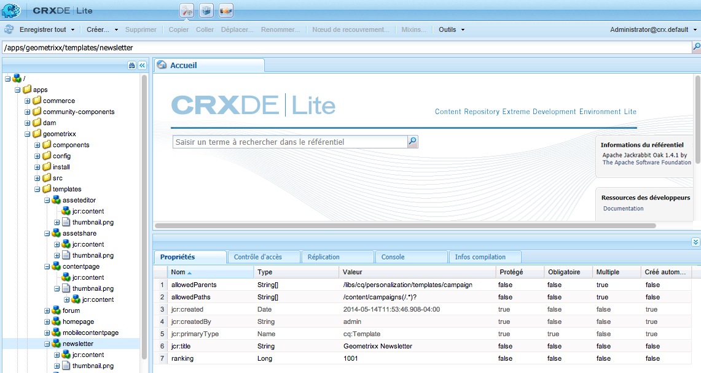

# Modèles de page - Statiques{#page-templates-static}

Un modèle sert à créer une page. Il définit les composants pouvant être utilisés dans l’étendue sélectionnée. Un modèle est une hiérarchie de nœuds ayant la même structure que la page à créer, mais sans contenu réel.

Chaque modèle vous présente une sélection de composants disponibles.

* Les modèles sont constitués de [Composants](/help/sites-developing/components.md);
* Les composants utilisent et permettent d’accéder aux widgets, qui sont utilisés pour le rendu du contenu.

>[!NOTE]
>
>Les [Modèles modifiables](/help/sites-developing/page-templates-editable.md) sont également disponibles. Il s’agit du type de modèle recommandé pour une flexibilité maximale et les fonctionnalités les plus récentes.

## Propriétés et noeuds enfants d’un modèle {#properties-and-child-nodes-of-a-template}

Un modèle est un noeud de type cq:Template qui contient les propriétés et les noeuds enfants suivants :

<table>
 <tbody>
  <tr>
   <td><strong>Nom   </strong></td>
   <td><strong>Type   </strong></td>
   <td><strong>Description   </strong></td>
  </tr>
  <tr>
   <td>.   </td>
   <td> cq:Template</td>
   <td>Modèle actuel. Un modèle possède le type de nœud cq:Template.  </td>
  </tr>
  <tr>
   <td> allowedChildren </td>
   <td> Chaîne[]</td>
   <td>Chemin d’accès du modèle autorisé comme enfant de ce modèle.  </td>
  </tr>
  <tr>
   <td> allowedParents</td>
   <td> Chaîne[]</td>
   <td>Chemin d’accès du modèle autorisé comme parent de ce modèle.  </td>
  </tr>
  <tr>
   <td> allowedPaths</td>
   <td> Chaîne[]</td>
   <td>Chemin d’accès d’une page qui peut être basée sur ce modèle.  </td>
  </tr>
  <tr>
   <td> jcr:created</td>
   <td> Date</td>
   <td>Date de création du modèle.  </td>
  </tr>
  <tr>
   <td> jcr:description</td>
   <td> Chaîne</td>
   <td>Description du modèle.  </td>
  </tr>
  <tr>
   <td> jcr:title</td>
   <td> Chaîne</td>
   <td>Titre du modèle.  </td>
  </tr>
  <tr>
   <td> classement</td>
   <td> Long</td>
   <td>Classement du modèle. Utilisé pour afficher le modèle dans l’interface utilisateur.  </td>
  </tr>
  <tr>
   <td> jcr:content</td>
   <td> cq:PageContent</td>
   <td>Nœud contenant le contenu du modèle.  </td>
  </tr>
  <tr>
   <td> thumbnail.png</td>
   <td> nt:file</td>
   <td>Miniature du modèle.  </td>
  </tr>
  <tr>
   <td> icon.png</td>
   <td> nt:file</td>
   <td>Icône du modèle.  </td>
  </tr>
 </tbody>
</table>

Un modèle sert de fondement pour une page.

Pour créer une page, le modèle doit être copié (node-tree `/apps/<myapp>/template/<mytemplate>`) vers la position correspondante dans l’arborescence : c’est ce qui se passe si une page est créée en utilisant l’onglet **Sites web**.

Cette action de copie confère également à la page son contenu initial (généralement le contenu de niveau supérieur uniquement) et la propriété sling:resourceType, le chemin d’accès au composant de page utilisé pour rendre la page (tout ce qui est présent dans le nœud enfant jcr:content).

## Structuration des modèles {#how-templates-are-structured}

Deux aspects doivent être pris en compte :

* la structure du modèle lui-même ;
* la structure du contenu produit lors de l&#39;utilisation d&#39;un modèle ;

### Structure d’un modèle {#the-structure-of-a-template}

Un modèle est créé sous un noeud de type **cq:Template**.

Différentes propriétés peuvent être définies, notamment :

* **jcr:title** - titre du modèle ; s’affiche dans la boîte de dialogue lors de la création d’une page.
* **jcr:description** - description du modèle ; s’affiche dans la boîte de dialogue lors de la création d’une page.

Ce noeud contient un noeud jcr:content (cq:PageContent) qui est utilisé comme base du noeud de contenu des pages résultantes ; cette référence, à l’aide de sling:resourceType, le composant à utiliser pour le rendu du contenu réel d’une nouvelle page.

Ce composant est utilisé pour définir la structure et la conception du contenu lors de la création d’une page.

### Contenu produit par un modèle {#the-content-produced-by-a-template}

Les modèles servent à créer des pages de type `cq:Page` (comme mentionné précédemment, une page est un type spécial de composant). Chaque page AEM possède un nœud structuré `jcr:content`. Celui-ci :

* est de type cq:PageContent
* est un type de noeud structuré contenant une définition de contenu définie
* possède une propriété `sling:resourceType` pour référencer le composant contenant les scripts sling utilisés pour le rendu du contenu.

### Modèles par défaut {#default-templates}

AEM est fourni avec divers modèles par défaut prêts à l’emploi. Il peut arriver que vous souhaitiez utiliser les modèles en l’état. Dans ce cas, vous devez vous assurer que le modèle est disponible pour votre site web.

Par exemple, AEM est fourni avec plusieurs modèles, y compris une page de contenu et une page d’accueil.

| **Titre** | **Composant** | **Emplacement** | **Objectif** |
|---|---|---|---|
| Page d’accueil | homepage | geometrixx | Modèle de page d’accueil de Geometrixx. |
| Page du contenu | contentpage | geometrixx | Modèle de page de contenu Geometrixx. |

#### Affichage des modèles par défaut {#displaying-default-templates}

Pour afficher la liste de tous les modèles du référentiel, procédez comme suit :

1. Dans CRXDE Lite, ouvrez le **Outils** et cliquez sur **Requête**.

1. Dans l’onglet Requête
1. As **Type**, sélectionnez **XPath**.

1. Dans le champ de saisie **Requête**, entrez la chaîne suivante :
//element(&#42;, cq:Template)

1. Cliquez sur **Exécuter**. La liste s&#39;affiche dans la zone des résultats.

En règle générale, vous prenez un modèle existant et en développez un nouveau pour votre propre utilisation. Voir [Développement de modèles de page](#developing-page-templates) pour plus d’informations.

Afin d’activer un modèle existant pour votre site web et de l’afficher dans la boîte de dialogue **Créer une page** lors de la création d’une page directement sous **Sites web** à partir de la console **Sites web**, définissez la propriété allowedPaths du nœud de modèle sur : **/content(/.&#42;)?**

## Application de conceptions de modèle {#how-template-designs-are-applied}

Lorsque des styles sont définis dans l’interface utilisateur à l’aide du [mode Conception](/help/sites-authoring/default-components-designmode.md), la conception est conservée à l’emplacement exact du nœud de contenu pour lequel le style est défini.

>[!CAUTION]
>
>Adobe recommande de n’appliquer des conceptions que via le [mode de Conception](/help/sites-authoring/default-components-designmode.md).
>
>La modification de conceptions dans CRXDE Lite, par exemple, n’est pas une bonne pratique et l’application de ces conceptions peut différer du comportement attendu.

Si les conceptions ne sont appliquées qu’en mode de conception, les sections suivantes, la [Résolution du chemin de conception](/help/sites-developing/page-templates-static.md#design-path-resolution), l’[Arborescence de décision](/help/sites-developing/page-templates-static.md#decision-tree) et l’[Exemple](/help/sites-developing/page-templates-static.md#example) ne sont pas applicables.

### Résolution du chemin de conception {#design-path-resolution}

Lors du rendu du contenu à partir d’un modèle statique, AEM tente d’appliquer la conception et les styles les plus pertinents au contenu en fonction d’une traversée de la hiérarchie du contenu.

AEM détermine le style le plus pertinent pour un nœud de contenu dans l’ordre suivant :

* S’il existe une conception pour le chemin d’accès complet et exact du nœud de contenu (comme lorsque la conception est définie en mode de conception), utilisez cette conception.
* S’il existe une conception pour le nœud de contenu du parent, utilisez-la.
* S’il existe une conception pour n’importe quel nœud sur le chemin du nœud de contenu, utilisez-la.

Dans les deux derniers cas, s’il existe plusieurs conceptions applicables, utilisez celle la plus proche du nœud de contenu.

### Arborescence de décision {#decision-tree}

Il s’agit d’une représentation graphique de la logique de [Résolution du chemin de conception](/help/sites-developing/page-templates-static.md#design-path-resolution).

### Exemple {#example}

Penchez-vous sur une simple structure de contenu comme celle qui suit, où une conception peut s’appliquer à l’un des nœuds :

`/root/branch/leaf`

Le tableau suivant décrit comment AEM choisit une conception.

<table>
 <tbody>
  <tr>
   <td><strong>Recherche de conception pour  </strong></td>
   <td><strong>Conceptions existent pour  </strong></td>
   <td><strong>Conception choisie  </strong></td>
   <td><strong>Commentaire</strong></td>
  </tr>
  <tr>
   <td><code class="code">leaf
      </code></td>
   <td>
<code>root</code>
 
<code>branch</code>
 
<code>leaf</code>
 </td>
   <td><code>leaf</code></td>
   <td>La correspondance la plus exacte est toujours choisie.  </td>
  </tr>
  <tr>
   <td><code>leaf</code></td>
   <td>
<code>root</code>
 
<code>branch</code>
 </td>
   <td><code>branch</code></td>
   <td>Revenez à la correspondance la plus proche dans l’arborescence.</td>
  </tr>
  <tr>
   <td><code>leaf</code></td>
   <td><code>root</code></td>
   <td><code>root</code></td>
   <td>Si tout le reste échoue, prenez ce qui reste.  </td>
  </tr>
  <tr>
   <td><code>branch</code></td>
   <td><code>branch</code></td>
   <td><code>branch</code></td>
   <td> </td>
  </tr>
  <tr>
   <td><code>branch</code></td>
   <td>
<code>branch</code>
 
<code class="code">leaf
       </code>
 </td>
   <td><code>branch</code></td>
   <td> </td>
  </tr>
  <tr>
   <td><code>branch</code></td>
   <td>
<code>root</code>
 
<code class="code">branch
       </code>
 </td>
   <td><code>branch</code></td>
   <td> </td>
  </tr>
  <tr>
   <td><code>branch</code></td>
   <td>
<code>root</code>
 
<code class="code">leaf
       </code>
 </td>
   <td><code>root</code></td>
   <td>
S’il n’y a pas de correspondance exacte, prenez celle située plus bas dans l’arborescence.
 
Partez du principe que cette logique est toujours applicable mais remonter trop haut dans l’arborescence peut être trop spécifique.  
 </td>
  </tr>
 </tbody>
</table>

## Développement de modèles de page {#developing-page-templates}

AEM modèles de page sont simplement des modèles utilisés pour créer des pages. Ils peuvent contenir le moins ou autant de contenu initial que nécessaire, leur rôle étant de créer les structures de noeud initiales correctes, avec les propriétés requises (principalement sling:resourceType) définies pour permettre l’édition et le rendu.

### Création d’un modèle (à partir d’un modèle existant) {#creating-a-new-template-based-on-an-existing-template}

Un nouveau modèle peut être entièrement créé à partir de zéro, mais il arrive souvent qu’un modèle existant soit copié à la place et mis à jour pour vous faire gagner du temps et vous faire gagner du temps. Par exemple, les modèles de Geometrixx peuvent être utilisés pour vous aider à démarrer.

Pour créer un modèle basé sur un modèle existant :

1. Copiez un modèle existant (de préférence avec une définition aussi proche que possible de ce que vous souhaitez obtenir) dans un nouveau noeud.

   Les modèles sont stockés dans **/apps/&lt;website-name>/templates/&lt;template-name>**.

   >[!NOTE]
   >
   >La liste des modèles disponibles dépend de l’emplacement de la nouvelle page et des restrictions de positionnement spécifiées dans chaque modèle. Voir [Disponibilité des modèles](#templateavailibility).

1. Changez le **jcr:title** du nouveau nœud de modèle de manière à refléter son nouveau rôle. Vous pouvez également mettre à jour **jcr:description** si nécessaire. Veillez à modifier la disponibilité du modèle de la page, le cas échéant.

   >[!NOTE]
   >
   >Pour afficher le modèle dans la boîte de dialogue **Créer une page** lors de la création d’une page directement sous **Sites web** à partir de la console **Sites web**, définissez la propriété `allowedPaths` du nœud de modèle sur : `/content(/.*)?`.

   

1. Copiez le composant sur lequel le modèle est basé (ceci est indiqué par la fonction **sling:resourceType** de la propriété **jcr:content** dans le modèle) pour créer une instance.

   Les composants sont stockés dans **/apps/&lt;website-name>/components/&lt;component-name>**.

1. Mettez à jour le **jcr:title** et **jcr:description** du nouveau composant.
1. Remplacez thumbnail.png si vous souhaitez qu’une nouvelle image miniature s’affiche dans la liste de sélection de modèles (taille 128 x 98 pixels).
1. Mettez à jour le **sling:resourceType** du modèle **jcr:content** pour référencer le nouveau composant.
1. Apportez des modifications supplémentaires à la fonctionnalité ou à la conception du modèle, ou de son composant sous-jacent, ou des deux.

   >[!NOTE]
   >
   >Modifications apportées au **/apps/&lt;website>/templates/&lt;template-name>** affecte l’instance du modèle (comme dans la liste de sélection).
   >
   >
   Modifications apportées au **/apps/&lt;website>/components/&lt;component-name>** affecte la page de contenu créée lors de l’utilisation du modèle.

   Vous pouvez maintenant créer une page de votre site web à l’aide du nouveau modèle.

>[!NOTE]
>
La bibliothèque cliente de l’éditeur suppose la présence de la variable `cq.shared` espace de noms dans les pages de contenu et, s’il est absent, l’erreur JavaScript `Uncaught TypeError: Cannot read property 'shared' of undefined` résultats.
>
`cq.shared` est inclus dans tous les exemples de pages de contenu. Par conséquent, tout contenu basé sur ces pages inclut automatiquement `cq.shared`. Toutefois, si vous décidez de créer vos propres pages de contenu à partir de zéro, sans vous servir de l’exemple de contenu, vous devez veiller à inclure l’espace de noms `cq.shared`.
>
Pour plus d’informations, voir [Utilisation des bibliothèques côté client](/help/sites-developing/clientlibs.md).

## Mise à disposition d’un modèle existant {#making-an-existing-template-available}

Cet exemple illustre comment autoriser l’utilisation d’un modèle pour certains chemins de contenu. Les modèles disponibles pour l’auteur de pages lors de la création de pages sont déterminés par la logique définie dans [Disponibilité des modèles](/help/sites-developing/templates.md#template-availability).

1. Dans CRXDE Lite, accédez au modèle que vous souhaitez utiliser pour votre page, par exemple, le modèle Newsletter.
1. Modifiez la variable `allowedPaths` d’autres propriétés utilisées pour [disponibilité des modèles](/help/sites-developing/templates.md#template-availability). Par exemple, `allowedPaths` : `/content/geometrixx-outdoors/[^/]+(/.*)?` signifie que ce modèle est autorisé dans tous les chemins sous `/content/geometrixx-outdoors`.

   
