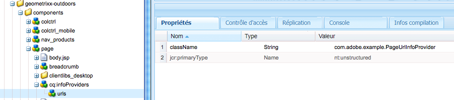

# Obtention d’informations sur la page au format JSON{#obtaining-page-information-in-json-format}

Pour obtenir des informations sur la page, envoyez une requête au servlet PageInfo afin d’obtenir les métadonnées de page au format JSON.

La servlet PageInfo renvoie des informations sur les ressources du référentiel. The servlet is bound to the URL `https://<server>:<port>/libs/wcm/core/content/pageinfo.json` and uses the `path` parameter to identify the resource. The following example URL returns information about the `/content/we-retail/us/en` node:

```shell
http://localhost:4502/libs/wcm/core/content/pageinfo.json?path=/content/we-retail/us/en
```

>[!NOTE]
>
>Si vous avez besoin d’informations sur la page au format JSON pour assurer la diffusion de contenu vers des canaux qui ne sont pas des pages web AEM classiques, telles que :
>
>* des applications sur une seule page ;
>* des applications mobiles natives ;
>* Autres canaux et points de contact externes aux AEM

>
>
Consultez le document [Exportateur JSON pour les services de contenu](/help/sites-developing/json-exporter.md).

## Fournisseurs d’informations sur la page {#page-information-providers}

Les composants de page peuvent être associés à un ou plusieurs services `com.day.cq.wcm.api.PageInfoProvider` qui génèrent des métadonnées de page. Le servlet PageInfo appelle chaque service PageInfoProvider et regroupe les métadonnées :

1. Le client HTTP envoie une requête au servlet PageInfo, laquelle inclut l’URL de la page.
1. Le servlet PageInfo identifie le composant qui effectue le rendu de la page.
1. Le servlet PageInfo appelle chaque service PageInfoProvider associé au composant.
1. Le servlet regroupe les métadonnées renvoyées par chaque service PageInfoProvider et les ajoute à la réponse HTTP dans un objet JSON.


>[!NOTE]
>
>À l’instar des PageInfoProviders, utilisez des ListInfoProviders pour mettre à jour des listes d’informations au format JSON (voir [Personnalisation de la console d’administration des sites web](/help/sites-developing/customizing-siteadmin.md)).

## Fournisseurs d’informations de page par défaut {#default-page-information-providers}

The `/libs/foundation/components/page` component is associated with the following PageInfoProvider services:

* **Fournisseur d’état de page par défaut** : informations sur l’état de la page, par exemple si elle est verrouillée, s’il s’agit de la charge utile d’un processus actif ou encore quels sont les processus disponibles pour la page.
* **Fournisseur d’informations sur la relation en direct** : informations concernant la gestion multisite (MSM, Multi-Site Management) ; par exemple, la page fait-elle partie d’un plan directeur ou s’agit-il d’une Live Copy ?
* **Servlet de langue du contenu** : langue de la page en cours et informations sur chacune des langues dans lesquelles la page est disponible.
* **Fournisseur d’état du processus** : informations d’état sur le processus en cours dont la page est une charge utile.
* **Fournisseur d’informations sur le module de processus** : fournit des informations sur chaque module de processus stocké dans le référentiel et indique si chaque module contient la ressource actuelle.
* **Fournisseur d’informations sur l’émulateur** : informations sur les émulateurs de terminaux mobiles disponibles pour cette ressource. Si le composant de page n’effectue pas le rendu des terminaux mobiles, aucun émulateur n’est disponible.
* **Fournisseur d’informations sur les annotations** : informations sur les annotations figurant sur la page.

For example, the PageInfo servlet returns the following JSON response for the `/content/we-retail/us/en` node:

```
{
   "status":{
      "path":"/content/we-retail/us/en",
      "isLocked":false,
      "lockOwner":"",
      "canUnlock":false,
      "lastModified":1467202845038,
      "lastModifiedBy":"admin",
      "timeUntilValid":0,
      "onTime":0,
      "offTime":0,
      "replication":{
         "numQueued":0
      },
      "isDesignable":true,
      "isDeveloper":true
   },
   "isPage":true,
   "pageResourceType":"weretail/components/structure/page",
   "enableFragmentIdentifier":false,
   "workflow":{
      "isRunning":false
   },
   "workflows":{
      "wcm":{
         "models":[
            {
               "wid":"/etc/workflow/models/dam/adddamsize/jcr:content/model",
               "label":"Add Asset Size",
               "label_xss":"Add Asset Size"
            },
            {
               "wid":"/etc/workflow/models/ac-newsletter-workflow-simple/jcr:content/model",
               "label":"Approve for Adobe Campaign",
               "label_xss":"Approve for Adobe Campaign"
            },
            {
               "wid":"/etc/workflow/models/dam/dam-autotag-assets/jcr:content/model",
               "label":"DAM Smart Tag Assets",
               "label_xss":"DAM Smart Tag Assets"
            },
            {
               "wid":"/etc/workflow/models/dam/update_asset/jcr:content/model",
               "label":"DAM Update Asset",
               "label_xss":"DAM Update Asset"
            },
            {
               "wid":"/etc/workflow/models/cloudservices/DTM_bundle_download/jcr:content/model",
               "label":"Default DTM Bundle Download",
               "label_xss":"Default DTM Bundle Download"
            },
            {
               "wid":"/etc/workflow/models/dam/dam_download_asset/jcr:content/model",
               "label":"Download Asset",
               "label_xss":"Download Asset"
            },
            {
               "wid":"/etc/workflow/models/dam/dynamic-media-video-thumbnail-replacement/jcr:content/model",
               "label":"Dynamic Media Video Thumbnail Replacement",
               "label_xss":"Dynamic Media Video Thumbnail Replacement"
            },
            {
               "wid":"/etc/workflow/models/dam/dynamic-media-video-user-uploaded-thumbnail/jcr:content/model",
               "label":"Dynamic Media Video User Uploaded Thumbnail Process",
               "label_xss":"Dynamic Media Video User Uploaded Thumbnail Process"
            },
            {
               "wid":"/etc/workflow/models/projects/approval_workflow/jcr:content/model",
               "label":"Project Approval Workflow",
               "label_xss":"Project Approval Workflow"
            },
            {
               "wid":"/etc/workflow/models/publish_example/jcr:content/model",
               "label":"Publish Example",
               "label_xss":"Publish Example"
            },
            {
               "wid":"/etc/workflow/models/publish_to_campaign/jcr:content/model",
               "label":"Publish to Adobe Campaign",
               "label_xss":"Publish to Adobe Campaign"
            },
            {
               "wid":"/etc/workflow/models/s7dam/request_to_publish_to_youtube/jcr:content/model",
               "label":"Publish to YouTube",
               "label_xss":"Publish to YouTube"
            },
            {
               "wid":"/etc/workflow/models/projects/request_copy/jcr:content/model",
               "label":"Request Copy",
               "label_xss":"Request Copy"
            },
            {
               "wid":"/etc/workflow/models/request_for_activation/jcr:content/model",
               "label":"Request for Activation",
               "label_xss":"Request for Activation"
            },
            {
               "wid":"/etc/workflow/models/request_for_deactivation/jcr:content/model",
               "label":"Request for Deactivation",
               "label_xss":"Request for Deactivation"
            },
            {
               "wid":"/etc/workflow/models/request_for_deletion/jcr:content/model",
               "label":"Request for Deletion",
               "label_xss":"Request for Deletion"
            },
            {
               "wid":"/etc/workflow/models/request_to_complete_move_operation/jcr:content/model",
               "label":"Request to complete Move operation",
               "label_xss":"Request to complete Move operation"
            },
            {
               "wid":"/etc/workflow/models/screens-update-asset/jcr:content/model",
               "label":"Screens Update Asset",
               "label_xss":"Screens Update Asset"
            },
            {
               "wid":"/etc/workflow/models/s7dam/request_to_remove_from_youtube/jcr:content/model",
               "label":"Unpublish from YouTube",
               "label_xss":"Unpublish from YouTube"
            },
            {
               "wid":"/etc/workflow/models/wcm-translation/create_language_copy/jcr:content/model",
               "label":"WCM: Create Language Copy",
               "label_xss":"WCM: Create Language Copy"
            },
            {
               "wid":"/etc/workflow/models/wcm-translation/prepare_translation_project/jcr:content/model",
               "label":"WCM: Prepare Translation Project",
               "label_xss":"WCM: Prepare Translation Project"
            },
            {
               "wid":"/etc/workflow/models/wcm-translation/translate-i18n-dictionary/jcr:content/model",
               "label":"WCM: Prepare and Translate I18n-Dictionary",
               "label_xss":"WCM: Prepare and Translate I18n-Dictionary"
            },
            {
               "wid":"/etc/workflow/models/wcm-translation/sync_translation_job/jcr:content/model",
               "label":"WCM: Sync Translation Job",
               "label_xss":"WCM: Sync Translation Job"
            },
            {
               "wid":"/etc/workflow/models/wcm-translation/update_language_copy/jcr:content/model",
               "label":"WCM: Update Language Copy",
               "label_xss":"WCM: Update Language Copy"
            }
         ]
      },
      "translation":{
         "models":[
            {
               "wid":"/etc/workflow/models/dam/adddamsize/jcr:content/model",
               "label":"Add Asset Size",
               "label_xss":"Add Asset Size"
            },
            {
               "wid":"/etc/workflow/models/ac-newsletter-workflow-simple/jcr:content/model",
               "label":"Approve for Adobe Campaign",
               "label_xss":"Approve for Adobe Campaign"
            },
            {
               "wid":"/etc/workflow/models/dam/dam-autotag-assets/jcr:content/model",
               "label":"DAM Smart Tag Assets",
               "label_xss":"DAM Smart Tag Assets"
            },
            {
               "wid":"/etc/workflow/models/cloudservices/DTM_bundle_download/jcr:content/model",
               "label":"Default DTM Bundle Download",
               "label_xss":"Default DTM Bundle Download"
            },
            {
               "wid":"/etc/workflow/models/dam/dam_download_asset/jcr:content/model",
               "label":"Download Asset",
               "label_xss":"Download Asset"
            },
            {
               "wid":"/etc/workflow/models/dam/dynamic-media-video-thumbnail-replacement/jcr:content/model",
               "label":"Dynamic Media Video Thumbnail Replacement",
               "label_xss":"Dynamic Media Video Thumbnail Replacement"
            },
            {
               "wid":"/etc/workflow/models/dam/dynamic-media-video-user-uploaded-thumbnail/jcr:content/model",
               "label":"Dynamic Media Video User Uploaded Thumbnail Process",
               "label_xss":"Dynamic Media Video User Uploaded Thumbnail Process"
            },
            {
               "wid":"/etc/workflow/models/projects/approval_workflow/jcr:content/model",
               "label":"Project Approval Workflow",
               "label_xss":"Project Approval Workflow"
            },
            {
               "wid":"/etc/workflow/models/publish_to_campaign/jcr:content/model",
               "label":"Publish to Adobe Campaign",
               "label_xss":"Publish to Adobe Campaign"
            },
            {
               "wid":"/etc/workflow/models/s7dam/request_to_publish_to_youtube/jcr:content/model",
               "label":"Publish to YouTube",
               "label_xss":"Publish to YouTube"
            },
            {
               "wid":"/etc/workflow/models/projects/request_copy/jcr:content/model",
               "label":"Request Copy",
               "label_xss":"Request Copy"
            },
            {
               "wid":"/etc/workflow/models/request_for_deletion/jcr:content/model",
               "label":"Request for Deletion",
               "label_xss":"Request for Deletion"
            },
            {
               "wid":"/etc/workflow/models/request_to_complete_move_operation/jcr:content/model",
               "label":"Request to complete Move operation",
               "label_xss":"Request to complete Move operation"
            },
            {
               "wid":"/etc/workflow/models/screens-update-asset/jcr:content/model",
               "label":"Screens Update Asset",
               "label_xss":"Screens Update Asset"
            },
            {
               "wid":"/etc/workflow/models/translation/jcr:content/model",
               "label":"Translation Prepare",
               "label_xss":"Translation Prepare"
            },
            {
               "wid":"/etc/workflow/models/s7dam/request_to_remove_from_youtube/jcr:content/model",
               "label":"Unpublish from YouTube",
               "label_xss":"Unpublish from YouTube"
            }
         ]
      }
   },
   "translation":{

   },
   "design":{
      "path":"/conf/we-retail/settings/wcm/templates/hero-page/policies",
      "lastModified":0
   },
   "componentsRef":"/libs/wcm/core/content/components.1497341312569.json",
   "editableTemplate":"/conf/we-retail/settings/wcm/templates/hero-page",
   "msm":{
      "msm:isLiveCopy":true,
      "msm:isInBlueprint":false,
      "msm:isSource":false
   },
   "launches":{
      "isLaunch":false,
      "isInLaunch":false
   },
   "language":"en",
   "languages":{
      "rows":[
         {
            "path":"/content/we-retail/us/en",
            "exists":true,
            "hasContent":true,
            "lastModified":0,
            "iso":"en",
            "country":"gb",
            "language":"English"
         },
         {
            "path":"/content/we-retail/us/es",
            "exists":true,
            "hasContent":true,
            "lastModified":0,
            "iso":"es",
            "country":"es",
            "language":"Spanish"
         }
      ]
   },
   "workflowInfo":{
      "isRunning":false
   },
   "workflowPackageInfo":{
      "workflowPackages":[

      ],
      "selectedWorkflowPackages":[

      ],
      "runningSelectedWorkflowPackages":[

      ]
   },
   "emulators":{
      "groups":{
         "responsive":{
            "title":"Responsive Devices",
            "description":"The devices in this group are able to display a website built using responsive design patterns.",
            "path":"/etc/mobile/groups/responsive",
            "galaxy5":{
               "text":"Galaxy S5",
               "action":"start",
               "path":"/libs/wcm/mobile/components/emulators/galaxy5",
               "canRotate":true,
               "hasTouchScrolling":true,
               "contentCssPath":"/etc/mobile/groups/responsive/static.css",
               "width":1080,
               "height":1920,
               "device-pixel-ratio":3
            },
            "ipad":{
               "text":"iPad",
               "action":"start",
               "path":"/libs/wcm/mobile/components/emulators/ios/ipad",
               "canRotate":true,
               "hasTouchScrolling":true,
               "contentCssPath":"/etc/mobile/groups/responsive/static.css",
               "width":768,
               "height":1024,
               "device-pixel-ratio":1
            },
            "iphone5":{
               "text":"iPhone 5",
               "action":"start",
               "path":"/libs/wcm/mobile/components/emulators/ios/iphone5",
               "canRotate":true,
               "hasTouchScrolling":true,
               "contentCssPath":"/etc/mobile/groups/responsive/static.css",
               "width":640,
               "height":1136,
               "device-pixel-ratio":2
            },
            "iphone6":{
               "text":"iPhone 6",
               "action":"start",
               "path":"/libs/wcm/mobile/components/emulators/ios/iphone6",
               "canRotate":true,
               "hasTouchScrolling":true,
               "contentCssPath":"/etc/mobile/groups/responsive/static.css",
               "width":750,
               "height":1334,
               "device-pixel-ratio":2
            },
            "iphone4":{
               "text":"iPhone 4",
               "action":"start",
               "path":"/libs/wcm/mobile/components/emulators/ios/iphone4",
               "canRotate":true,
               "hasTouchScrolling":true,
               "contentCssPath":"/etc/mobile/groups/responsive/static.css",
               "width":640,
               "height":960,
               "device-pixel-ratio":2
            },
            "iphone6plus":{
               "text":"iPhone 6 Plus",
               "action":"start",
               "path":"/libs/wcm/mobile/components/emulators/ios/iphone6plus",
               "canRotate":true,
               "hasTouchScrolling":true,
               "contentCssPath":"/etc/mobile/groups/responsive/static.css",
               "width":1080,
               "height":1920,
               "device-pixel-ratio":2.6
            },
            "nexuss":{
               "text":"Nexus S",
               "action":"start",
               "path":"/libs/wcm/mobile/components/emulators/nexuss",
               "canRotate":true,
               "hasTouchScrolling":true,
               "contentCssPath":"/etc/mobile/groups/responsive/static.css",
               "width":320,
               "height":533,
               "device-pixel-ratio":1
            }
         }
      }
   },
   "annotations":[

   ],
   "permissions":{
      "modify":true,
      "replicate":true,
      "read":true,
      "create":true,
      "delete":true,
      "acl_read":true,
      "acl_edit":true
   },
   "isTargetable":"true",
   "responsive":{
      "breakpoints":{
         "phone":{
            "width":650,
            "title":"Smaller Screen"
         },
         "tablet":{
            "width":1200,
            "title":"Tablet"
         }
      }
   }
}
```

## Filtrage des informations sur le module de processus {#filtering-workflow-package-information}

Configurez le service Day CQ WCM Workflow Package Info Provider de sorte qu’il renvoie des informations uniquement sur les packages de processus qui vous intéressent. Par défaut, le service Fournisseur d’informations de package de flux de travaux renvoie des informations sur chaque package de processus dans le référentiel. Itérer sur un sous-ensemble de modules de processus utilise moins de ressources du serveur.

>[!NOTE]
>
>L’onglet Processus de sidekick utilise le servlet PageInfo pour obtenir la liste des modules de processus. Vous pouvez y sélectionner le module auquel la page en cours doit être ajoutée. Les filtres que vous créez affectent cette liste.


L’ID du service est `com.day.cq.wcm.workflow.impl.WorkflowPackageInfoProvider`. Pour créer un filtre, indiquez une valeur pour une propriété `workflowpackageinfoprovider.filter`.

Les valeurs des propriétés utilisent la structure suivante : caractère + ou - en préfixe, suivi du chemin d’accès au module :

* Il s’agit du chemin d’accès du nœud racine du module de processus. Le chemin d’accès utilise la syntaxe FileVault.
* Pour inclure un module, utilisez le préfixe +.
* Pour exclure un module, utilisez le préfixe -.

Le service applique le résultat cumulé de tous les filtres. Par exemple, les valeurs de filtre suivantes excluent tous les modules de processus, sauf ceux du dossier Éditions :

```
-/etc/workflow/packages(/.*)?
+/etc/workflow/packages/Editions(/.&ast;)?
```

>[!NOTE]
>
>Lorsque vous utilisez AEM, plusieurs méthodes permettent de gérer les paramètres de configuration pour ces services. Voir [Configuration d’OSGi](/help/sites-deploying/configuring-osgi.md) pour des détails complets.

Par exemple, pour configurer le service à l’aide de CRXDE Lite :

1. Ouvrez CRXDE Lite ([http://localhost:4502/crx/de](http://localhost:4502/crx/de)).
1. Créez un nœud dans le dossier de configuration de votre application :

   * Nom : `com.day.cq.wcm.workflow.impl.WorkflowPackageInfoProvider`
   * Type : `sling:OsgiConfig`

1. Sélectionnez le nœud et ajoutez une propriété :

   * Nom : `workflowpackageinfoprovider.filter`
   * Type : `String[]`
   * Valeur : chemin d’accès au module de processus en utilisant le format correct.

1. Cliquez sur Enregistrer tout.

Pour configurer le service dans la source de votre projet, procédez comme suit :

1. Recherchez ou créez le dossier de configuration de votre application AEM dans la source du projet.

   Par exemple, si vous avez utilisé l’archétype multimodule du module externe Content Package Maven pour créer votre projet, le chemin d’accès au dossier est `<projectroot>/content/src/ for example content/src/main/content/jcr_root/apps/<appname>/config`.
1. Dans le dossier de configuration, créez un fichier texte nommé com.day.cq.wcm.workflow.impl.WorkflowPackageInfoProvider.xml.
1. Copiez le texte suivant dans le fichier :

   ```
   <?xml version="1.0" encoding="UTF-8"?>
    <jcr:root xmlns:sling="https://sling.apache.org/jcr/sling/1.0"
    xmlns:jcr="https://www.jcp.org/jcr/1.0"
    jcr:primaryType="sling:OsgiConfig"
    workflowpackageinfoprovider.filter="[]"/>
   ```

1. Inside the brackets (`[]`) that surround the `workflowpackageinfoprovider.filter` property, type a comma-separated list of filter values similar to the following example:

   `workflowpackageinfoprovider.filter="[-/etc/workflow/packages(/.*)?,+/etc/workflow/packages/Editions(/.*)?]"/>`

1. Enregistrez le fichier.

## Création d’un fournisseur d’informations sur la page {#creating-a-page-information-provider}

Créez un service Fournisseur d’informations sur la page personnalisée pour ajouter des métadonnées de page que votre application peut facilement obtenir.

1. Mettez en œuvre l’interface `com.day.cq.wcm.api.PageInfoProvider`.
1. Regroupez et déployez la classe sous la forme d’un service OSGi.
1. Créez un composant de page dans votre application. Use `foundation/components/page` as the value of the `sling:resourceSuperType` property.

1. Add a node below the component node named `cq:infoProviders`.
1. Sous le nœud `cq:infoProviders`, ajoutez un nœud pour votre service PageInfoProvider. Vous pouvez attribuer au nœud le nom de votre choix.
1. Ajoutez la propriété suivante à votre nœud PageInfoProvider :

   * Nom : className
   * Type : Chaîne
   * Valeur : PID de votre service PageInfoProvider.

Dans le cas des ressources qui utilisent votre composant de page d’application comme `sling:resourceType`, le servlet PageInfo renvoie les métadonnées PageInfoProvider personnalisées en plus des métadonnées PageInfoProvider par défaut.

### Exemple d’implémentation de PageInfoProvider {#example-pageinfoprovider-implementation}

La classe Java suivante met en œuvre [PageInfoProvider](https://helpx.adobe.com/experience-manager/6-5/sites/developing/using/reference-materials/javadoc/index.html) et renvoie l’URL publiée de la ressource de page en cours.

```java
package com.adobe.example;

import org.apache.felix.scr.annotations.Component;
import org.apache.felix.scr.annotations.Properties;
import org.apache.felix.scr.annotations.Property;
import org.apache.felix.scr.annotations.ReferenceCardinality;
import org.apache.felix.scr.annotations.Service;
import org.apache.felix.scr.annotations.Reference;

import org.apache.sling.api.SlingHttpServletRequest;
import org.apache.sling.api.resource.Resource;
import org.apache.sling.api.resource.ResourceResolver;

import org.apache.sling.commons.json.JSONException;
import org.apache.sling.commons.json.JSONObject;

import com.day.cq.wcm.api.Page;
import com.day.cq.wcm.api.PageInfoProvider;

@Component(metatype = false)
@Properties({
 @Property(name="service.description", value="Returns the public URL of a resource.")
})
@Service
public class PageUrlInfoProvider implements PageInfoProvider {

 @Reference(cardinality = ReferenceCardinality.OPTIONAL_UNARY)
 private com.day.cq.commons.Externalizer externalizer;

 private String fetchExternalUrl(ResourceResolver rr, String path) {
  return externalizer.publishLink(rr, path);
 }

 public void updatePageInfo(SlingHttpServletRequest request, JSONObject info, Resource resource)
   throws JSONException {

  Page page = resource.adaptTo(Page.class);
  JSONObject urlinfo = new JSONObject();
  urlinfo.put("publishURL", fetchExternalUrl(null,page.getPath()));
  info.put("URLs",urlinfo);
 }
}
```

L’exemple suivant, dans CRXDE Lite, affiche le composant de page qui est configuré pour utiliser le service PageUrlInfoProvider :



The PageUrlInfoProvider service returns the following data for the `/content/we-retail/us/en` node:

```xml
"URLs": {
    "publishURL": "http://localhost:4503/content/we-retail/us/en"
}
```

