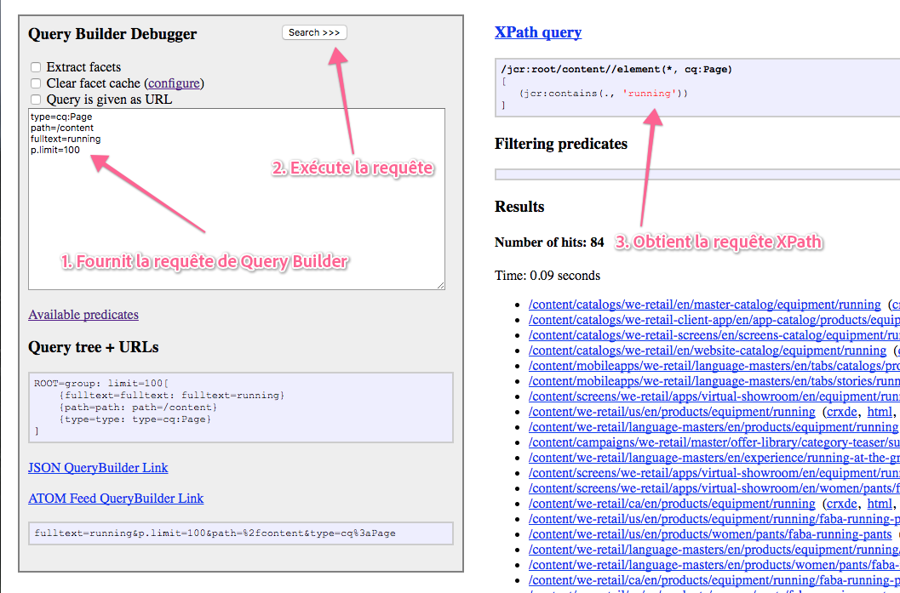

# API Query Builder{#query-builder-api}

La fonctionnalité du [Query Builder Asset Share](/help/assets/assets-finder-editor.md) est exposée via une API Java et une API REST. Cette section décrit ces API.

Le générateur de requêtes côté serveur ([`QueryBuilder`](https://helpx.adobe.com/fr/experience-manager/6-5/sites/developing/using/reference-materials/javadoc/com/day/cq/search/QueryBuilder.html)) accepte une description de requête, crée et exécute une requête XPath, filtre éventuellement le jeu de résultats et, si vous le souhaitez, extrait également des facettes.

La description de requête correspond simplement à un ensemble de prédicats ([`Predicate`](https://helpx.adobe.com/experience-manager/6-5/sites/developing/using/reference-materials/javadoc/com/day/cq/search/Predicate.html)). Par exemple, un prédicat de texte intégral correspond à la `jcr:contains()` fonction de XPath.

Pour chaque type de prédicat, il existe un composant Évaluateur ([`PredicateEvaluator`](https://helpx.adobe.com/experience-manager/6-5/sites/developing/using/reference-materials/javadoc/com/day/cq/search/eval/PredicateEvaluator.html)) qui sait comment en effectuer la gestion pour XPath, pour le filtrage et pour l’extraction de facettes. Il est très facile de créer des évaluateurs personnalisés, qui sont activés via l’exécutable du composant OSGi.

L’API REST permet d’accéder exactement aux mêmes fonctionnalités via HTTP, les réponses étant envoyées au format JSON.

>[!NOTE]
>
>L’API QueryBuilder est créée à l’aide de l’API JCR. Vous pouvez également interroger le JCR Adobe Experience Manager en utilisant l’API JCR depuis un lot OSGi. Pour plus d’informations, voir [Interrogation des données Adobe Experience Manager à l’aide de l’API JCR](https://helpx.adobe.com/experience-manager/using/querying-experience-manager-data-using1.html).

## Session Gem {#gem-session}

[AEM Gems](https://helpx.adobe.com/fr/experience-manager/kt/eseminars/gems/aem-index.html) est une série de sessions techniques approfondies sur Adobe Experience Manager dispensées par des experts Adobe. Cette session consacrée à Query Builder s’avère très utile pour se familiariser avec l’outil.

>[!NOTE]
>
>See the AEM Gem session [Search forms made easy with the AEM querybuilder](https://helpx.adobe.com/experience-manager/kt/eseminars/gems/aem-search-forms-using-querybuilder.html) for a detailed overview of the query builder.

## Exemples de requêtes {#sample-queries}

Ces exemples sont fournis dans la notation de style des propriétés Java. Pour les utiliser avec l’API Java, utilisez un `HashMap` Java comme dans l’exemple d’API suivant.

Pour le servlet JSON `QueryBuilder`, chaque exemple comprend un lien vers votre installation CQ locale (à l’emplacement par défaut, `http://localhost:4502`). Notez que vous devez vous connecter à votre instance CQ avant d’utiliser ces liens.

>[!CAUTION]
>
>Par défaut, le servlet JSON Query Builder affiche un maximum de 10 accès.
>
>L’ajout du paramètre suivant permet au servlet d’afficher tous les résultats de la requête :
>
>**`p.limit=-1`**

>[!NOTE]
>
>Pour afficher les données JSON renvoyées dans votre navigateur, vous pouvez utiliser un module externe tel que JSONView for Firefox.

### Renvoi de tous les résultats {#returning-all-results}

La requête suivante **renvoie dix résultats** (ou, pour être précis, un maximum de dix), mais vous informe du **Nombre d’accès** réellement disponibles :

`http://localhost:4502/bin/querybuilder.json?path=/content&1_property=sling:resourceType&1_property.value=foundation/components/text&1_property.operation=like&orderby=path`

```xml
path=/content
1_property=sling:resourceType
1_property.value=foundation/components/text
1_property.operation=like
orderby=path
```

La même requête (avec le paramètre `p.limit=-1`) **renvoie tous les résultats** (il peut s’agir d’un nombre élevé en fonction de votre instance) :

`http://localhost:4502/bin/querybuilder.json?path=/content&1_property=sling:resourceType&1_property.value=foundation/components/text&1_property.operation=like&p.limit=-1&orderby=path`

```xml
path=/content
1_property=sling:resourceType
1_property.value=foundation/components/text
1_property.operation=like
p.limit=-1
orderby=path
```

### Utilisation de p.guessTotal pour renvoyer les résultats {#using-p-guesstotal-to-return-the-results}

L’objectif du paramètre `p.guessTotal` est de renvoyer le nombre approprié de résultats pouvant être affichés en combinant les plus petites valeurs p.offset et p.limit possibles. Utilisé avec des jeux de résultats de grande taille, ce paramètre offre des performances accrues. Cela vous évite de calculer le total (en appelant result.getSize(), par exemple) et de lire tout le jeu de résultats, optimisé jusqu’à l’index et au moteur OAK. Cela peut constituer une différence importante lorsqu’il y a des centaines de milliers de résultats, tant sur le plan de la durée d’exécution que de l’utilisation de la mémoire.

L’inconvénient de ce paramètre est que les utilisateurs ne voient pas le total exact. Vous pouvez toutefois définir une valeur minimale, telle que p.guessTotal=1000, de sorte que la lecture soit toujours effectuée jusqu’à 1 000. Vous obtiendrez ainsi des totaux exacts pour des jeux de résultats plus petits. En revanche, pour des résultats supérieurs, vous pouvez simplement afficher « et plus ».

Ajoutez `p.guessTotal=true` à la requête ci-dessous pour voir comment cela fonctionne :

`http://localhost:4502/bin/querybuilder.json?path=/content&1_property=sling:resourceType&1_property.value=foundation/components/text&1_property.operation=like&p.guessTotal=true&orderby=path`

```xml
path=/content
1_property=sling:resourceType
1_property.value=foundation/components/text
1_property.operation=like
p.guessTotal=true
orderby=path
```

La requête renvoie la valeur `p.limit` par défaut de `10` résultats avec un décalage `0` :

```xml
"success": true,
"results": 10,
"total": 10,
"more": true,
"offset": 0,
```

Depuis AEM 6.0 SP2, vous pouvez également utiliser une valeur numérique pour compter jusqu’à un nombre personnalisé de résultats maximums. Utilisez la même requête que ci-dessus, mais définissez la valeur de `p.guessTotal` sur `50` :

`http://localhost:4502/bin/querybuilder.json?path=/content&1_property=sling:resourceType&1_property.value=foundation/components/text&1_property.operation=like&p.guessTotal=50&orderby=path`

Elle renvoie un nombre dont la limite par défaut est de 10 résultats avec un décalage de 0, mais n’affiche qu’un maximum de 50 résultats :

```xml
"success": true,
"results": 10,
"total": 50,
"more": true,
"offset": 0,
```

### Mise en œuvre de la pagination {#implementing-pagination}

Par défaut, Query Builder fournit également le nombre d’accès. Suivant la taille du résultat, cette opération peut prendre un certain temps, étant donné qu’il est nécessaire de vérifier le contrôle d’accès pour chaque résultat afin de déterminer le nombre exact. Le total est essentiellement utilisé pour implémenter la pagination pour l’IU de l’utilisateur final. Déterminer le nombre exact peut s’avérer particulièrement lent. Aussi, est-il conseillé d’utiliser la fonctionnalité guessTotal pour implémenter la pagination.

L’interface utilisateur peut, par exemple, adapter la méthode suivante :

* Get and display the accurate count of the number of total hits ([SearchResult.getTotalMatches()](https://helpx.adobe.com/experience-manager/6-5/sites/developing/using/reference-materials/javadoc/com/day/cq/search/result/SearchResult.html#gettotalmatches) or total in the querybuilder.json response) are less than or equal to 100;
* Définissez `guessTotal` sur 100 tout en effectuant l’appel vers Query Builder.

* La réponse peut générer le résultat suivant :

   * `total=43`, `more=false` - Indique que le nombre total d’accès est de 43. L’interface utilisateur peut afficher jusqu’à dix résultats dans le cadre de la première page et fournir la pagination pour les trois pages suivantes. Vous pouvez également utiliser cette implémentation pour afficher un texte descriptif tel que **« 43 résultats trouvés »**.
   * `total=100`, `more=true` - Indique que le nombre total d’accès est supérieur à 100 et que le nombre exact n’est pas connu. L’interface utilisateur peut afficher jusqu’à dix résultats dans le cadre de la première page et fournir la pagination pour les dix pages suivantes. Vous pouvez également utiliser cette implémentation pour afficher un texte tel que **« plus de 100 résultats trouvés »**. Lorsque l’utilisateur accède aux pages suivantes, les appels effectués vers Query Builder augmentent la limite de `guessTotal`, ainsi que celle des paramètres `offset` et `limit`.

Il est également conseillé d’utiliser `guessTotal` lorsque l’IU doit appliquer un défilement infini, afin d’empêcher Query Builder de déterminer le nombre exact d’accès.

### Recherche et classement des fichiers JAR, en commençant par le plus récent {#find-jar-files-and-order-them-newest-first}

`http://localhost:4502/bin/querybuilder.json?type=nt:file&nodename=*.jar&orderby=@jcr:content/jcr:lastModified&orderby.sort=desc`

```xml
type=nt:file
nodename=*.jar
orderby=@jcr:content/jcr:lastModified
orderby.sort=desc
```

### Recherche de toutes les pages et classement par date de la dernière modification {#find-all-pages-and-order-them-by-last-modified}

`http://localhost:4502/bin/querybuilder.json?type=cq:Page&orderby=@jcr:content/cq:lastModified`

```xml
type=cq:Page
orderby=@jcr:content/cq:lastModified
```

### Recherche de toutes les pages et classement par date de la dernière modification, mais par ordre décroissant {#find-all-pages-and-order-them-by-last-modified-but-descending}

`http://localhost:4502/bin/querybuilder.json?type=cq:Page&orderby=@jcr:content/cq:lastModified&orderby.sort=desc]`

```xml
type=cq:Page
orderby=@jcr:content/cq:lastModified
orderby.sort=desc
```

### Recherche en texte intégral, avec classement par score {#fulltext-search-ordered-by-score}

`http://localhost:4502/bin/querybuilder.json?fulltext=Management&orderby=@jcr:score&orderby.sort=desc`

```xml
fulltext=Management
orderby=@jcr:score
orderby.sort=desc
```

### Recherche des pages présentant une balise donnée {#search-for-pages-tagged-with-a-certain-tag}

`http://localhost:4502/bin/querybuilder.json?type=cq:Page&amp;tagid=marketing:interest/product&amp;tagid.property=jcr:content/cq:tags``

```xml
type=cq:Page
tagid=marketing:interest/product
tagid.property=jcr:content/cq:tags
```

Use the `tagid` predicate as in the example if you know the explicit tag ID.

Utilisez le prédicat `tag` pour le chemin d’accès au titre de la balise (sans espaces).

Because, in the previous example, you are searching for pages ( `cq:Page` nodes), you need to use the relative path from that node for the `tagid.property` predicate, which is `jcr:content/cq:tags`. By default, the `tagid.property` would simply be `cq:tags`.

### Recherche dans plusieurs chemins d’accès (à l’aide de groupes) {#search-under-multiple-paths-using-groups}

`http://localhost:4502/bin/querybuilder.json?fulltext=Management&group.1_path=/content/geometrixx/en/company/management&group.2_path=/content/geometrixx/en/company/bod&group.p.or=true`

```xml
fulltext=Management
group.p.or=true
group.1_path=/content/geometrixx/en/company/management
group.2_path=/content/geometrixx/en/company/bod
```

Cette requête utilise un *groupe* (appelé « `group` »), qui sert à délimiter les sous-expressions dans une requête, à l’instar des parenthèses dans des notations plus standard. Par exemple, la requête précédente peut être exprimée dans un style plus familier comme suit :

`"Management" and ("/content/geometrixx/en/company/management" or "/content/geometrixx/en/company/bod")`

Le prédicat `path` est utilisé à plusieurs reprises dans le groupe de l’exemple précédent. To differentiate and order the two instances of the predicate (ordering is required for some predicates), you must prefix the predicates with *N* `_ where`*N* is the ordering index. In the previous example, the resulting predicates are `1_path` and `2_path`.

The `p` in `p.or` is a special delimiter indicating that what follows (in this case an `or`) is a *parameter* of the group, as opposed to a subpredicate of the group, such as `1_path`.

If no `p.or` is given then all predicates are ANDed together, that is, each result must satisfy all predicates.

>[!NOTE]
>
>Vous ne pouvez pas utiliser le même préfixe numérique dans une seule requête, même pour des prédicats différents.

### Recherche de propriétés {#search-for-properties}

Dans ce cas, vous recherchez toutes les pages d’un modèle donné, à l’aide de la propriété `cq:template` :

`http://localhost:4502/bin/querybuilder.json?property=cq%3atemplate&property.value=%2fapps%2fgeometrixx%2ftemplates%2fhomepage&type=cq%3aPageContent`

```xml
type=cq:PageContent
property=cq:template
property.value=/apps/geometrixx/templates/homepage
```

L’inconvénient est que les nœuds `jcr:content` des pages sont renvoyés, et non les pages proprement dites. Pour remédier à ce problème, vous pouvez effectuer une recherche par chemin d’accès relatif :

`http://localhost:4502/bin/querybuilder.json?property=jcr%3acontent%2fcq%3atemplate&property.value=%2fapps%2fgeometrixx%2ftemplates%2fhomepage&type=cq%3aPage`

```xml
type=cq:Page
property=jcr:content/cq:template
property.value=/apps/geometrixx/templates/homepage
```

### Recherche de plusieurs propriétés {#search-for-multiple-properties}

Lorsque vous utilisez plusieurs fois le prédicat property, vous devez ajouter à nouveau les préfixes numériques :

`http://localhost:4502/bin/querybuilder.json?1_property=jcr%3acontent%2fcq%3atemplate&1_property.value=%2fapps%2fgeometrixx%2ftemplates%2fhomepage&2_property=jcr%3acontent%2fjcr%3atitle&2_property.value=English&type=cq%3aPage`

```xml
type=cq:Page
1_property=jcr:content/cq:template
1_property.value=/apps/geometrixx/templates/homepage
2_property=jcr:content/jcr:title
2_property.value=English
```

### Recherche de plusieurs valeurs de propriété {#search-for-multiple-property-values}

To avoid big groups when you want to search for multiple values of a property ( `"A" or "B" or "C"`), you can provide multiple values to the `property` predicate:

`http://localhost:4502/bin/querybuilder.json?property=jcr%3atitle&property.1_value=Products&property.2_value=Square&property.3_value=Events`

```xml
property=jcr:title
property.1_value=Products
property.2_value=Square
property.3_value=Events
```

Pour les propriétés à plusieurs valeurs, vous pouvez également exiger que plusieurs valeurs correspondent à ( `"A" and "B" and "C"`) :

`http://localhost:4502/bin/querybuilder.json?property=jcr%3atitle&property.and=true&property.1_value=test&property.2_value=foo&property.3_value=bar`

```xml
property=jcr:title
property.and=true
property.1_value=test
property.2_value=foo
property.3_value=bar
```

## Amélioration des propriétés renvoyées {#refining-what-is-returned}

Par défaut, le servlet JSON QueryBuilder renvoie un jeu de propriétés par défaut pour chaque nœud dans les résultats de recherche (par exemple : chemin d’accès, nom, titre, etc.). Pour contrôler les propriétés renvoyées, vous pouvez effectuer l’une des opérations suivantes :

Spécifier

```
p.hits=full
```

dans quel cas toutes les propriétés seront incluses pour chaque noeud :

`http://localhost:4502/bin/querybuilder.json?p.hits=full&property=jcr%3atitle&property.value=Triangle`

```xml
property=jcr:title
property.value=Triangle
p.hits=full
```

Utilisation

```
p.hits=selective
```

et spécifiez les propriétés à intégrer

```
p.properties
```

séparé par un espace :

`http://localhost:4502/bin/querybuilder.json?p.hits=selective&property=jcr%3atitle&property.value=Triangle`

[ `http://localhost:4502/bin/querybuilder.json?`](http://localhost:4502/bin/querybuilder.json?p.hits=selective&amp;p.properties=sling%3aresourceType%20jcr%3aprimaryType&amp;property=jcr%3atitle&amp;property.value=Triangle) [p.hits=selective&amp;](http://localhost:4502/bin/querybuilder.json?p.hits=selective&amp;p.nodedepth=5&amp;p.properties=sling%3aresourceType%20jcr%3apath&amp;property=jcr%3atitle&amp;property.value=Triangle)p.properties=sling%3aresourceType%20jcr%3aprimaryType&amp;property=jcr%3atitle&amp;property.value=Triangle

```xml
property=jcr:title
property.value=Triangle
p.hits=selective
p.properties=sling:resourceType jcr:primaryType
```

Vous pouvez également inclure des nœuds enfants dans la réponse de QueryBuilder. Pour ce faire, vous devez spécifier

```
p.nodedepth=n
```

où `n` est le nombre de niveaux que la requête doit renvoyer. Pour qu’un nœud enfant soit renvoyé, notez qu’il doit être spécifié par le sélecteur de propriétés

```
p.hits=full
```

Exemple :

`http://localhost:4502/bin/querybuilder.json?p.hits=full&p.nodedepth=5&property=jcr%3atitle&property.value=Triangle`

```xml
property=jcr:title
property.value=Triangle
p.hits=full
p.nodedepth=5
```

## Plus de prédicats {#morepredicates}

Pour plus de prédicats, consultez la [page de référence des prédicats de Query Builder](/help/sites-developing/querybuilder-predicate-reference.md).

You can also check the [Javadoc for the `PredicateEvaluator` classes](https://helpx.adobe.com/experience-manager/6-5/sites/developing/using/reference-materials/javadoc/com/day/cq/search/eval/PredicateEvaluator.html). Ce JavaDoc contient la liste des propriétés que vous pouvez utiliser.

The prefix of the class name (for example, &quot; `similar`&quot; in [`SimilarityPredicateEvaluator`](https://helpx.adobe.com/experience-manager/6-5/sites/developing/using/reference-materials/javadoc/com/day/cq/search/eval/SimilarityPredicateEvaluator.html)) is the *principal property* of the class. Cette propriété est également le nom du prédicat à utiliser dans la requête (en minuscules).

For such principal properties, you can shorten the query and use &quot; `similar=/content/en`&quot; instead of the fully qualified variant &quot; `similar.similar=/content/en`&quot;. La forme complète doit être utilisée pour toutes les propriétés non principales d’une classe.

## Exemple d’utilisation de l’API Query Builder {#example-query-builder-api-usage}

```java
   String fulltextSearchTerm = "Geometrixx";

    // create query description as hash map (simplest way, same as form post)
    Map<String, String> map = new HashMap<String, String>();

// create query description as hash map (simplest way, same as form post)
    map.put("path", "/content");
    map.put("type", "cq:Page");
    map.put("group.p.or", "true"); // combine this group with OR
    map.put("group.1_fulltext", fulltextSearchTerm);
    map.put("group.1_fulltext.relPath", "jcr:content");
    map.put("group.2_fulltext", fulltextSearchTerm);
    map.put("group.2_fulltext.relPath", "jcr:content/@cq:tags");

    // can be done in map or with Query methods
    map.put("p.offset", "0"); // same as query.setStart(0) below
    map.put("p.limit", "20"); // same as query.setHitsPerPage(20) below

    Query query = builder.createQuery(PredicateGroup.create(map), session);
    query.setStart(0);
    query.setHitsPerPage(20);

    SearchResult result = query.getResult();

    // paging metadata
    int hitsPerPage = result.getHits().size(); // 20 (set above) or lower
    long totalMatches = result.getTotalMatches();
    long offset = result.getStartIndex();
    long numberOfPages = totalMatches / 20;

    //Place the results in XML to return to client
    DocumentBuilderFactory factory =     DocumentBuilderFactory.newInstance();
    DocumentBuilder builder = factory.newDocumentBuilder();
    Document doc = builder.newDocument();

    //Start building the XML to pass back to the AEM client
    Element root = doc.createElement( "results" );
    doc.appendChild( root );

    // iterating over the results
    for (Hit hit : result.getHits()) {
       String path = hit.getPath();

      //Create a result element
      Element resultel = doc.createElement( "result" );
      root.appendChild( resultel );

      Element pathel = doc.createElement( "path" );
      pathel.appendChild( doc.createTextNode(path ) );
      resultel.appendChild( pathel );
    }
```

>[!NOTE]
>
>Pour savoir comment créer un lot OSGi qui utilise l’API Query Builder et utiliser ce lot dans une application Adobe Experience Manager, reportez-vous à la section [Création de lots OSGi Adobe CQ qui utilisent l’API Query Builder](https://helpx.adobe.com/experience-manager/using/using-query-builder-api.html).

La même requête exécutée sur HTTP à l’aide du servlet Query Builder (JSON) :

`http://localhost:4502/bin/querybuilder.json?path=/content&type=cq:Page&group.p.or=true&group.1_fulltext=Geometrixx&group.1_fulltext.relPath=jcr:content&group.2_fulltext=Geometrixx&group.2_fulltext.relPath=jcr:content/@cq:tags&p.offset=0&p.limit=20`

## Stockage et chargement de requêtes {#storing-and-loading-queries}

Les requêtes peuvent être stockées dans le référentiel de manière à pouvoir les utiliser ultérieurement. The `QueryBuilder` provides the `` `storeQuery` method with the following signature:

```java
void storeQuery(Query query, String path, boolean createFile, Session session) throws RepositoryException, IOException;
```

When using the [ `QueryBuilder#storeQuery`](https://helpx.adobe.com/experience-manager/6-5/sites/developing/using/reference-materials/javadoc/com/day/cq/search/QueryBuilder.html#storequerycomdaycqsearchqueryjavalangstringbooleanjavaxjcrsession) method, the given `Query` is stored into the repository as a file or as a property according to the `createFile` argument value. The following example shows how to save a `Query` to the path `/mypath/getfiles` as a file:

```java
builder.storeQuery(query, "/mypath/getfiles", true, session);
```

Toutes les requêtes stockées précédemment peuvent être chargées à partir du référentiel en utilisant la méthode [`QueryBuilder#loadQuery`](https://helpx.adobe.com/experience-manager/6-5/sites/developing/using/reference-materials/javadoc/com/day/cq/search/QueryBuilder.html#loadqueryjavalangstringjavaxjcrsession) :

```java
Query loadQuery(String path, Session session) throws RepositoryException, IOException
```

For example, a `Query` stored to the path `/mypath/getfiles` can be loaded by the following snippet:

```java
Query loadedQuery = builder.loadQuery("/mypath/getfiles", session);
```

## Tests et débogage {#testing-and-debugging}

Pour exécuter et déboguer des requêtes Query Builder, vous pouvez utiliser la console de débogage Query Builder à l’adresse suivante :

`http://localhost:4502/libs/cq/search/content/querydebug.html`

Une autre solution consiste à utiliser le servlet JSON Query Builder à l’adresse suivante :

`http://localhost:4502/bin/querybuilder.json?path=/tmp`

( `path=/tmp` is only an example).

### Recommandations générales en matière de débogage {#general-debugging-recommendations}

### Obtention d’une requête XPath explicable par le biais de la journalisation {#obtain-explain-able-xpath-via-logging}

Expliquez **toutes** les requêtes pendant le cycle de développement par rapport au jeu d’index cible.

* Autorisation des journaux DEBUG pour Query Builder afin d’obtenir la requête XPath explicable sous-jacente

   * Accédez à https://&lt;serveraddress>:&lt;serverport>/system/console/slinglog. Create a new logger for `com.day.cq.search.impl.builder.QueryImpl` at **DEBUG**.

* Une fois que DEBUG a été activé pour la classe ci-dessus, les journaux affichent la requête XPath générée par Query Builder.
* Copiez la requête XPath à partir de l’entrée de journal pour la requête Query Builder associée. Par exemple :

   * `com.day.cq.search.impl.builder.QueryImpl XPath query: /jcr:root/content//element(*, cq:Page)[(jcr:contains(jcr:content, "Geometrixx") or jcr:contains(jcr:content/@cq:tags, "Geometrixx"))]`

* Paste the XPath query into [Explain Query](/help/sites-administering/operations-dashboard.md#explain-query) as XPath to obtrain the query plan

### Obtention de la requête XPath explicable via le débogueur Query Builder {#obtain-explain-able-xpath-via-the-query-builder-debugger}

* Utilisez le débogueur AEM Query Builder pour générer une requête XPath explicable :

Expliquez **toutes** les requêtes pendant le cycle de développement par rapport au jeu d’index cible.

**Obtention d’une requête XPath explicable par le biais de la journalisation**

* Autorisation des journaux DEBUG pour Query Builder afin d’obtenir la requête XPath explicable sous-jacente

   * Accédez à https://&lt;serveraddress>:&lt;serverport>/system/console/slinglog. Create a new logger for `com.day.cq.search.impl.builder.QueryImpl` at **DEBUG**.

* Une fois que DEBUG a été activé pour la classe ci-dessus, les journaux affichent la requête XPath générée par Query Builder.
* Copiez la requête XPath à partir de l’entrée de journal pour la requête Query Builder associée. Par exemple :

   * `com.day.cq.search.impl.builder.QueryImpl XPath query: /jcr:root/content//element(*, cq:Page)[(jcr:contains(jcr:content, "Geometrixx") or jcr:contains(jcr:content/@cq:tags, "Geometrixx"))]`

* Paste the XPath query into [Explain Query](/help/sites-administering/operations-dashboard.md#explain-query) as XPath to obtain the query plan

**Obtention de la requête XPath explicable via le débogueur Query Builder**

* Utilisez le débogueur AEM Query Builder pour générer une requête XPath explicable :



1. Indiquez la requête Query Buidler dans le débogueur Query Buidler.
1. Exécutez la recherche.
1. Récupérez la requête XPath générée.
1. Collez la requête XPath dans la Requête d&#39;explication comme XPath pour obtenir le plan de requête

>[!NOTE]
>
>Les requêtes non Query Builder (XPath, JCR-SQL2) peuvent être fournies directement à Explain Query.

Pour un aperçu du débogage des requêtes avec Query Builder, visionnez la vidéo ci-dessous.

>[!NOTE]
>
>[https://www.youtube.com/watch?v=BnyXjhRKYKc](https://www.youtube.com/watch?v=BnyXjhRKYKc)

## Débogage de requêtes à l’aide de la journalisation {#debugging-queries-with-logging}

>[!NOTE]
>
>The configuration of the loggers is described in the section [Creating Your Own Loggers and Writers](/help/sites-deploying/configure-logging.md#creating-your-own-loggers-and-writers).

Sortie de journal (niveau INFO) de l’implémentation Query Builder lors de l’exécution de la requête décrite à la section Tests et débogage :

```xml
com.day.cq.search.impl.builder.QueryImpl executing query (predicate tree):
null=group: limit=20, offset=0[
    {group=group: or=true[
        {1_fulltext=fulltext: fulltext=Geometrixx, relPath=jcr:content}
        {2_fulltext=fulltext: fulltext=Geometrixx, relPath=jcr:content/@cq:tags}
    ]}
    {path=path: path=/content}
    {type=type: type=cq:Page}
]
com.day.cq.search.impl.builder.QueryImpl XPath query: /jcr:root/content//element(*, cq:Page)[(jcr:contains(jcr:content, "Geometrixx") or jcr:contains(jcr:content/@cq:tags, "Geometrixx"))]
com.day.cq.search.impl.builder.QueryImpl no filtering predicates
com.day.cq.search.impl.builder.QueryImpl query execution took 69 ms
```

Dans le cas d’une requête qui utilise des évaluateurs de prédicats qui filtrent ou appliquent un ordre personnalisé par comparateur, cela est également indiqué dans la requête :

```xml
com.day.cq.search.impl.builder.QueryImpl executing query (predicate tree):
null=group: [
    {nodename=nodename: nodename=*.jar}
    {orderby=orderby: orderby=@jcr:content/jcr:lastModified}
    {type=type: type=nt:file}
]
com.day.cq.search.impl.builder.QueryImpl custom order by comparator: jcr:content/jcr:lastModified
com.day.cq.search.impl.builder.QueryImpl XPath query: //element(*, nt:file)
com.day.cq.search.impl.builder.QueryImpl filtering predicates: {nodename=nodename: nodename=*.jar}
com.day.cq.search.impl.builder.QueryImpl query execution took 272 ms
```

## Liens JavaDoc {#javadoc-links}

| **Javadoc** | **Description** |
|---|---|
| [com.day.cq.search](https://helpx.adobe.com/experience-manager/6-5/sites/developing/using/reference-materials/javadoc/com/day/cq/search/package-summary.html) | API de base de QueryBuilder et de Requête |
| [com.day.cq.search.result](https://helpx.adobe.com/experience-manager/6-5/sites/developing/using/reference-materials/javadoc/com/day/cq/search/result/package-summary.html) | API de résultat |
| [com.day.cq.search.facets](https://helpx.adobe.com/experience-manager/6-5/sites/developing/using/reference-materials/javadoc/com/day/cq/search/facets/package-summary.html) | Facettes |
| [com.day.cq.search.facets.buckets](https://helpx.adobe.com/experience-manager/6-5/sites/developing/using/reference-materials/javadoc/com/day/cq/search/facets/buckets/package-summary.html) | Intervalles (contenus dans les facettes) |
| [com.day.cq.search.eval](https://helpx.adobe.com/experience-manager/6-5/sites/developing/using/reference-materials/javadoc/com/day/cq/search/eval/package-summary.html) | Évaluateurs d’attributs |
| [com.day.cq.search.facets.extracteurs](https://helpx.adobe.com/experience-manager/6-5/sites/developing/using/reference-materials/javadoc/com/day/cq/search/facets/extractors/package-summary.html) | Extracteurs de facettes (pour les évaluateurs) |
| [com.day.cq.search.writer](https://helpx.adobe.com/experience-manager/6-5/sites/developing/using/reference-materials/javadoc/com/day/cq/search/writer/package-summary.html) | Auteur d’accès aux résultats JSON pour la servlet Querybuilder (/bin/querybuilder.json) |

