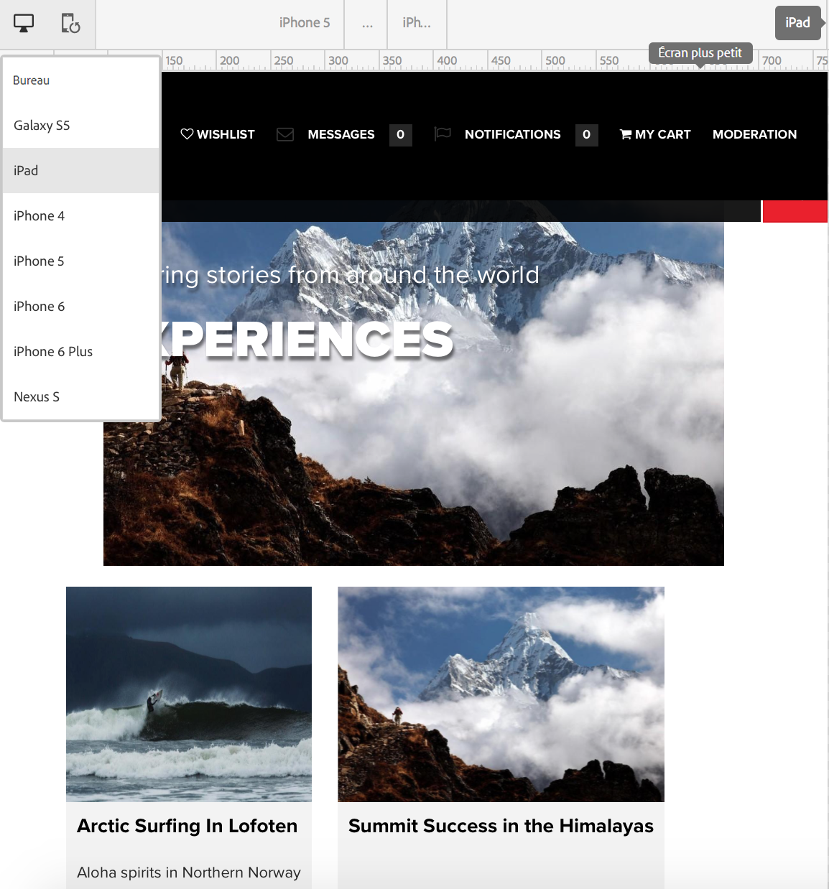
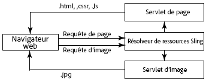

# Responsive Design pour les pages web{#responsive-design-for-web-pages}

>[!NOTE]
>
>Adobe recommande d’utiliser l’éditeur d’application monopage pour les projets nécessitant un rendu côté client basé sur la structure d’application monopage (par exemple, _React_). [En savoir plus](/help/sites-developing/spa-overview.md)
>

>[!NOTE]
>
>Plusieurs exemples sont basés sur l’exemple de contenu Geometrixx. Celui-ci n’est plus fourni avec AEM (Adobe Experience Manager), car il a été remplacé par We.Retail. Pour savoir comment télécharger et installer Geometrixx, consultez le document [Implémentation de référence We.Retail](/help/sites-developing/we-retail.md#we-retail-geometrixx).

Concevez vos pages web afin qu’elles s’adaptent à la fenêtre dans laquelle elles sont affichées. Le Responsive Design permet d’afficher efficacement les mêmes pages sur plusieurs appareils dans les deux orientations. L’image suivante montre certaines façons dont une page peut répondre aux modifications de la taille de la fenêtre d’affichage :

* Mise en page : utilisez des mises en page à une seule colonne pour les fenêtres d’affichage plus petites et des mises en page à plusieurs colonnes pour les fenêtres d’affichage plus grandes.
* Taille du texte : utilisez une taille de texte plus grande (le cas échéant, comme des en-têtes) dans les fenêtres d’affichage plus grandes.
* Contenu : incluez uniquement le contenu le plus important lors de l’affichage sur des appareils plus petits.
* Navigation : des outils spécifiques à l’appareil sont fournis pour accéder à d’autres pages.
* Images : diffusion de rendus d’image adaptés à la fenêtre d’affichage client en fonction des dimensions de la fenêtre.


Développez des applications Adobe Experience Manager (AEM) qui génèrent des pages HTML5 s’adaptant à plusieurs tailles de fenêtre et orientations. Par exemple, les plages de largeurs de fenêtre d’affichage suivantes correspondent à divers types d’appareils et orientations :

* Largeur maximale de 480 pixels (téléphone, portrait)
* Largeur maximale de 767 pixels (téléphone, paysage)
* Largeur entre 768 pixels et 979 pixels (tablette, portrait)
* Largeur entre 980 pixels et 1 199 pixels (tablette, paysage)
* Largeur de 1 200 pixels ou plus (ordinateur de bureau)

Consultez les rubriques suivantes pour en savoir plus sur l’implémentation du comportement Responsive Design :

* [Requêtes de média](/help/sites-developing/responsive.md#using-media-queries)
* [Grilles fluides](/help/sites-developing/responsive.md#developing-a-fluid-grid)
* [Images adaptatives](/help/sites-developing/responsive.md#using-adaptive-images)

Lors de la phase de conception, utilisez le **[!UICONTROL sidekick]** pour afficher un aperçu de vos pages pour différents formats d’écran.

## Avant le développement {#before-you-develop}

Avant de développer l’application AEM qui prend en charge vos pages web, plusieurs décisions de conception doivent être prises. Par exemple, vous devez disposer des informations suivantes :

* Les appareils ciblés
* Les tailles de fenêtre d’affichage ciblées
* Les dispositions de chacune des tailles de fenêtre d’affichage ciblées

### Structure d’application {#application-structure}

La structure d’application AEM type prend en charge toutes les implémentations de Responsive Design :

* Les composants de page résident sous /apps/*application_name*/components.
* Les modèles résident sous /apps/*application_name*/templates.
* Les conceptions résident sous /etc/designs.

## Utilisation des requêtes de média {#using-media-queries}

Les requêtes de média permettent l’utilisation sélective de styles CSS pour le rendu des pages. Les outils et fonctionnalités de développement AEM vous permettent d’implémenter de manière efficace et efficiente des requêtes de média dans vos applications.

Le groupe W3C fournit la recommandation [Media Queries](https://www.w3.org/TR/mediaqueries-3/) (Requêtes de média) qui décrit cette fonctionnalité CSS3, ainsi que la syntaxe.

### Création du fichier CSS {#creating-the-css-file}

Dans votre fichier CSS, définissez des requêtes de média en fonction des propriétés des appareils que vous ciblez. La stratégie d’implémentation suivante est efficace pour gérer les styles pour chaque requête de média :

* Utilisez un dossier de bibliothèques clientes ClientLibraryFolder pour définir le CSS qui est assemblé lors du rendu de la page.
* Définissez chaque requête de média et les styles associés dans des fichiers CSS distincts. Il est conseillé d’utiliser des noms de fichier qui représentent les fonctionnalités de périphérique de la requête de média.
* Définissez des styles communs à tous les appareils dans un fichier CSS distinct.
* Dans le fichier css.txt du dossier de bibliothèque cliente ClientLibraryFolder, classez les fichiers CSS comme l’exige le fichier CSS assemblé.

L’exemple de média `We.Retail` utilise cette stratégie pour définir des styles dans la conception du site. Le fichier CSS utilisé par `We.Retail` se trouve dans `*/apps/weretail/clientlibs/clientlib-site/less/grid.less`.

Le tableau suivant répertorie les fichiers situés dans le dossier enfant CSS.

<table>
 <tbody>
  <tr>
   <th>Nom du fichier</th>
   <th>Description</th>
   <th>Requête de média</th>
  </tr>
  <tr>
   <td>style.css</td>
   <td>Styles communs.</td>
   <td>S/O</td>
  </tr>
  <tr>
   <td>bootstrap.css</td>
   <td>Styles communs, définis par le Bootstrap Twitter.</td>
   <td>S/O</td>
  </tr>
  <tr>
   <td>responsive-1200px.css</td>
   <td>Styles pour tous les médias d’une largeur ou d’une largeur de 1 200 pixels.</td>
   <td><p>@media (largeur min. : 1200 px) {<br /> ...<br /> }</p> </td>
  </tr>
  <tr>
   <td>responsive-980px-1199px.css</td>
   <td>Styles pour les médias dont la largeur est comprise entre 980 et 1 199 pixels.</td>
   <td><p>@media (largeur min. : 980 px) et (largeur max. : 1199 px) {<br /> ...<br /> }</p> </td>
  </tr>
  <tr>
   <td>responsive-768px-979px.css</td>
   <td>Styles pour les médias dont la largeur est comprise entre 768 et 979 pixels. </td>
   <td><p>@media (largeur min. : 768 px) et (largeur max. : 979 px) {<br /> ...<br /> }</p> </td>
  </tr>
  <tr>
   <td>responsive-767px-max.css</td>
   <td>Styles pour tous les médias dont la largeur est inférieure à 768 pixels.</td>
   <td><p>@media (largeur max. : 767 px) {<br /> ...<br /> }</p> </td>
  </tr>
  <tr>
   <td>responsive-480px.css</td>
   <td>Styles pour tous les médias dont la largeur est inférieure à 481 pixels.</td>
   <td>@media (largeur max. : 480 px) {<br /> ...<br /> }</td>
  </tr>
 </tbody>
</table>

Le fichier css.txt situé dans le dossier `/etc/designs/weretail/clientlibs` répertorie les fichiers CSS inclus dans le dossier de bibliothèque cliente. L’ordre des fichiers implémente la priorité de style. Les styles sont plus spécifiques à mesure que la taille de l’appareil diminue.

`#base=css`

```
style.css
 bootstrap.css
```

```
responsive-1200px.css
 responsive-980px-1199px.css
 responsive-768px-979px.css
 responsive-767px-max.css
 responsive-480px.css
```

**Conseil** : les noms de fichier descriptifs vous permettent d’identifier facilement la taille de la fenêtre d’affichage ciblée.

### Utiliser des requêtes de média avec des pages AEM {#using-media-queries-with-aem-pages}

Incluez le dossier de bibliothèque cliente dans le script JSP de votre composant de page. Cela permet de générer le fichier CSS qui inclut les requêtes de média et référence le fichier.

```xml
<ui:includeClientLib categories="apps.weretail.all"/>
```

>[!NOTE]
>
>Le dossier de bibliothèque cliente `apps.weretail.all` intègre la bibliothèque clientlibs.

Le script JSP génère le code HTML suivant qui référence les feuilles de style :

```xml
<link rel="stylesheet" href="/etc/designs/weretail/clientlibs-all.css" type="text/css">
<link href="/etc/designs/weretail.css" rel="stylesheet" type="text/css">
```

## Affichage d’un aperçu pour des appareils spécifiques {#previewing-for-specific-devices}

Affichez des aperçus de vos pages dans différents formats de fenêtre d’affichage afin de tester le comportement de votre conception Responsive Design. En mode **[!UICONTROL Aperçu]**, le **[!UICONTROL sidekick]** comprend un menu déroulant **[!UICONTROL Appareils]** que vous pouvez utiliser pour sélectionner un appareil. Lorsque vous sélectionnez un appareil, la page change afin de s’adapter à la taille de la fenêtre d’affichage.



Pour activer l’aperçu d’appareil dans le **[!UICONTROL sidekick]**, vous devez configurer la page et le service **[!UICONTROL MobileEmulatorProvider]**. Une autre option de configuration de page permet de déterminer les appareils affichés dans la liste **[!UICONTROL Appareils]**.

### Ajout de la liste des appareils {#adding-the-devices-list}

La liste **[!UICONTROL Appareils]** s’affiche dans le **[!UICONTROL sidekick]** lorsque votre page contient le script JSP qui effectue le rendu de la liste **[!UICONTROL Appareils]**. Pour ajouter la liste **[!UICONTROL Appareils]** au **[!UICONTROL sidekick]**, insérez le script `/libs/wcm/mobile/components/simulator/simulator.jsp` dans la section `head` de votre page.

Insérez le code suivant dans le JSP qui définit la section `head` :

`<cq:include script="/libs/wcm/mobile/components/simulator/simulator.jsp"/>`

Pour voir un exemple, ouvrez le fichier `/apps/weretail/components/page/head.jsp` dans CRXDE Lite.

### Enregistrement de composants de page en vue de la simulation {#registering-page-components-for-simulation}

Pour permettre au simulateur d’appareils de prendre en charge vos pages, enregistrez vos composants de page auprès du service de fabrique MobileEmulatorProvider et définissez la propriété `mobile.resourceTypes`.

Dans AEM, il existe plusieurs méthodes pour gérer les paramètres de configuration pour ces services. Pour plus d’informations, voir [Configuration d’OSGi](/help/sites-deploying/configuring-osgi.md).

Par exemple, pour créer un nœud ` [sling:OsgiConfig](/help/sites-deploying/configuring-osgi.md#adding-a-new-configuration-to-the-repository)` dans votre application, procédez comme suit :

* Dossier parent : `/apps/application_name/config`
* Nom : `com.day.cq.wcm.mobile.core.impl.MobileEmulatorProvider-*alias*`

  Le suffixe - `*alias*` est requis, car MobileEmulatorProvider est un service de fabrique. Utilisez un alias unique pour cette fabrique.

* `jcr:primaryType`: `sling:OsgiConfig`

Ajoutez la propriété de nœud suivante :

* Nom : `mobile.resourceTypes`
* Type : `String[]`
* Valeur : chemins d’accès aux composants de page qui effectuent le rendu de vos pages web. Par exemple, l’application geometrixx-media utilise les valeurs suivantes :

  ```
  geometrixx-media/components/page
   geometrixx-unlimited/components/pages/page
   geometrixx-unlimited/components/pages/coverpage
   geometrixx-unlimited/components/pages/issue
  ```

### Définition des groupes d’appareils {#specifying-the-device-groups}

Pour spécifier les groupes d’appareils qui figurent dans la liste appareils, ajoutez une propriété `cq:deviceGroups` au nœud `jcr:content` de la page racine de votre site. La valeur de la propriété est un tableau de chemins d’accès pointant vers les nœuds du groupe d’appareils.

Les nœuds du groupe d’appareils sont situés dans le dossier `/etc/mobile/groups`.

Par exemple, la page racine du site Geometrixx Media est `/content/geometrixx-media`. Le nœud `/content/geometrixx-media/jcr:content` contient la propriété suivante :

* Nom : `cq:deviceGroups`
* Type : `String[]`
* Valeur : `/etc/mobile/groups/responsive`

Utilisez la console Outils pour [créer et modifier des groupes d’appareils](/help/sites-developing/groupfilters.md).

>[!NOTE]
>
>Pour les groupes d’appareils que vous utilisez pour le Responsive design, modifiez le groupe d’appareils puis, dans l’onglet Général, sélectionnez Désactiver l’émulateur. Cette option empêche l’affichage du carrousel de l’émulateur, qui n’est pas pertinent pour la conception en Responsive Design.
>

## Utilisation d’images adaptatives {#using-adaptive-images}

Vous pouvez utiliser des requêtes de média pour sélectionner une ressource d’image à afficher dans la page. Cependant, chaque ressource qui utilise une requête de média pour conditionner son utilisation est téléchargée sur le client. La requête de média détermine simplement si la ressource téléchargée est affichée.

Pour les ressources volumineuses telles que les images, le téléchargement de toutes les ressources n’est pas une utilisation efficace du pipeline de données du client. Pour télécharger des ressources de manière sélective, utilisez JavaScript pour lancer la requête de ressource une fois que les requêtes de média ont effectué la sélection.

La stratégie suivante charge une ressource unique qui est sélectionnée à l’aide de requêtes de média :

1. Ajoutez un élément DIV pour chaque version de la ressource. Incluez l’URI de la ressource comme valeur d’une valeur d’attribut. Le navigateur n’interprète pas l’attribut comme une ressource.
1. Ajoutez une requête de média à chaque élément DIV approprié à la ressource.
1. Lorsque le document se charge ou que la fenêtre est redimensionnée, le code JavaScript teste la requête de média de chaque élément DIV.
1. En fonction des résultats des requêtes, déterminez la ressource à inclure.
1. Insérez dans le DOM un élément HTML qui référence la ressource.

### Évaluer des requêtes de média à l’aide de JavaScript {#evaluating-media-queries-using-javascript}

Les implémentations de l’[interface MediaQueryList](https://drafts.csswg.org/cssom-view/#the-mediaquerylist-interface) définie par le W3C vous permettent d’évaluer des requêtes de média à l’aide de JavaScript. Vous pouvez appliquer la logique à des résultats de requête de média et exécuter les scripts qui sont destinés à la fenêtre active :

* Les navigateurs qui mettent en œuvre l’interface MediaQueryList prennent en charge la fonction `window.matchMedia()`. Cette fonction teste les requêtes de média par rapport à une chaîne donnée. La fonction renvoie un objet `MediaQueryList` qui permet d’accéder aux résultats de la requête.

* Dans le cas des navigateurs qui n’implémentent pas cette interface, vous pouvez utiliser un polyfill `matchMedia()`, tel que [matchMedia.js](https://github.com/paulirish/matchMedia.js), qui est une bibliothèque JavaScript en libre accès.

#### Sélectionner des ressources propres au média {#selecting-media-specific-resources}

L’[élément picture](https://html.spec.whatwg.org/multipage/embedded-content.html#the-picture-element) proposé par le W3C utilise des requêtes de média afin de déterminer la source à utiliser pour les éléments d’image. L’élément picture utilise des attributs d’élément pour associer des requêtes de média à des chemins d’accès aux images.

La [bibliothèque picturefill.js](https://github.com/scottjehl/picturefill) disponible en libre accès fournit les mêmes fonctionnalités que l’élément `picture` proposé. Elle applique également une stratégie semblable. La bibliothèque picturefill.js appelle `window.matchMedia` pour évaluer les requêtes de média définies pour un ensemble d’éléments `div`. Chaque élément `div` spécifie également une source d’images. Cette source est utilisée lorsque la requête de média de l’élément `div` renvoie la valeur `true`.

La bibliothèque `picturefill.js` nécessite du code HTML semblable à l’exemple suivant :

```xml
<div data-picture>
    <div data-src='path to default image'></div>
    <div data-src='path to small image'    data-media="(media query for phone)"></div>
    <div data-src='path to medium image'   data-media="(media query for tablet)"></div>
    <div data-src='path to large image'     data-media="(media query for monitor)"></div>
</div>
```

Lorsque la page est rendue, picturefull.js insère un élément `img` en tant que dernier enfant de l’`<div data-picture>` :

```xml
<div data-picture>
    <div data-src='path to default image'></div>
    <div data-src='path to small image'    data-media="(media query for phone)"></div>
    <div data-src='path to medium image'   data-media="(media query for tablet)"></div>
    <div data-src='path to large image'     data-media="(media query for monitor)"></div>
    
</div>
```

Dans une page AEM, la valeur de l’attribut `data-src` est le chemin d’accès à une ressource dans le référentiel.

### Mise en œuvre des images adaptatives dans AEM {#implementing-adaptive-images-in-aem}

Pour implémenter des images adaptatives dans votre application AEM, vous devez ajouter les bibliothèques JavaScript requises et inclure les balises de HTML requises dans vos pages.

**Bibliothèques**

Procurez-vous les bibliothèques JavaScript suivantes et incluez-les dans un dossier de bibliothèque cliente :

* [matchMedia.js](https://github.com/paulirish/matchMedia.js) (pour les navigateurs qui n’implémentent pas l’interface MediaQueryList)
* [picturefill.js](https://github.com/scottjehl/picturefill)
* jquery.js (disponible par le biais du dossier de bibliothèque cliente `/etc/clientlibs/granite/jquery`) (catégorie = jquery)
* [jquery.debouncedresize.js](https://github.com/louisremi/jquery-smartresize) (événement jquery qui se produit une seule fois après le redimensionnement de la fenêtre)

**Conseil** : vous pouvez concaténer automatiquement plusieurs dossiers de bibliothèques clientes en ayant recours à l’[incorporation](/help/sites-developing/clientlibs.md#embedding-code-from-other-libraries).

**HTML**

Créez un composant qui génère les éléments div requis attendus par le code picturefill.js. Dans une page AEM, la valeur de l’attribut data-src est le chemin d’accès à une ressource dans le référentiel. Par exemple, un composant de page peut coder en dur les requêtes de média et les chemins d’accès associés pour les rendus d’images dans la gestion des ressources numériques (DAM). Vous pouvez également créer un composant Image personnalisé permettant aux auteurs de sélectionner des rendus d’image ou de définir des options de rendu lors de l’exécution.

L’exemple de HTML suivant sélectionne deux rendus DAM d’une même image.

```xml
<div data-picture>
    <div data-src='/content/dam/geometrixx-media/articles/meridien.png'></div>
    <div data-src='/content/dam/geometrixx-media/articles/meridien.png/jcr:content/renditions/cq5dam.thumbnail.319.319.png'    data-media="(min-width: 769px)"></div>
    <div data-src='/content/dam/geometrixx-media/articles/meridien.png/jcr:content/renditions/cq5dam.thumbnail.140.100.png'   data-media="(min-width: 481px)"></div>
</div>
```

>[!NOTE]
>
>Le composant de base Image adaptative implémente des images adaptatives :
>
>* Dossier de la bibliothèque cliente : `/libs/foundation/components/adaptiveimage/clientlibs`
>* Script qui génère le HTML : `/libs/foundation/components/adaptiveimage/adaptiveimage.jsp`
>
>Vous trouverez plus d’informations sur ce composant à la section suivante.
>

### Présentation du rendu d’images dans AEM {#understanding-image-rendering-in-aem}

Pour personnaliser le rendu des images, vous devez comprendre l’implémentation par défaut du rendu d’image statique d’AEM. AEM fournit le composant d’image et un servlet de rendu d’image qui fonctionnent ensemble pour le rendu des images sur une page web. Les séquences d’événements suivantes se produisent lorsque le composant d’image est inclus dans le système de paragraphes de la page :

1. Création : les auteurs et autrices modifient le composant d’image pour spécifier le fichier image à inclure dans une page HTML. Le chemin d’accès au fichier est stocké en tant que valeur de propriété du nœud du composant d’image.
1. Requête de page : le JSP du composant de page génère le code HTML. Le JSP du composant d’image génère et ajoute un élément img à la page.
1. Demande d’image : le navigateur web charge la page et demande l’image en fonction de l’attribut src de l’élément img.
1. Rendu de l’image : le servlet de rendu d’image renvoie l’image au navigateur web.



Par exemple, le JSP du composant Image génère l’élément HTML suivant :

``

Lorsque le navigateur charge la page, il demande l’image en utilisant la valeur de l’attribut src comme URL. Sling décompose l’URL :

* Ressource : `/content/mywebsite/en/_jcr_content/par/image_0`
* Extension de nom de fichier : `.jpg`
* Sélecteur : `img`
* Suffixe : `1358372073597.jpg`

Le nœud `image_0` possède une valeur `jcr:resourceType` de `foundation/components/image`, qui a une valeur `sling:resourceSuperType` de `foundation/components/parbase`. Le composant parbase comprend le script img.GET.java qui correspond au sélecteur et l’extension de nom de fichier de l’URL de requête. CQ utilise ce script (servlet) pour effectuer le rendu de l’image.

Pour voir le code source du script, utilisez CRXDE Lite afin d’ouvrir le fichier `/libs/foundation/components/parbase/img.GET.java`.


## Dimensionnement des images pour la taille actuelle de la fenêtre d’affichage {#scaling-images-for-the-current-viewport-size}

Mettez à l’échelle les images au moment de l’exécution en fonction des caractéristiques de la fenêtre d’affichage cliente afin de fournir des images conformes aux principes du Responsive Design. Utilisez le même modèle de conception que le rendu d’image statique à l’aide d’un servlet et d’un composant de création.

Le composant doit effectuer les tâches suivantes :

* Stocker le chemin d’accès et les dimensions souhaitées de la ressource image en tant que valeurs de propriété.
* Générer des éléments `div` contenant des sélecteurs de médias et des appels de service pour le rendu de l’image.

>[!NOTE]
>
>Le client web utilise les bibliothèques JavaScript matchMedia et Picturefill (ou des bibliothèques du même type) pour évaluer les sélecteurs de médias.
>

Le servlet qui traite la demande d’image doit effectuer les tâches suivantes :

* Récupérer le chemin et les dimensions de l’image à partir des propriétés du composant.
* Mettre l’image à l’échelle en fonction des propriétés et la renvoyer.

**Solutions disponibles**

AEM installe les implémentations suivantes que vous pouvez utiliser ou étendre.

* Composant de base d’image adaptative qui génère des requêtes de média et des requêtes HTTP vers le servlet de composant d’image adaptive qui met à l’échelle les images.
* Le package Geometrixx Commons installe les exemples de servlets Image Reference Modification Servlet qui modifient la résolution de l’image.

### Présentation du servlet de composant d’image adaptative {#understanding-the-adaptive-image-component}

Le composant de base Image adaptative génère des appels vers le servlet de composant d’image adaptative afin d’effectuer le rendu d’une image qui est redimensionnée en fonction de l’écran de l’appareil. Le composant comprend les ressources suivantes :

* JSP : ajoute des éléments div qui associent des requêtes de média aux appels au servlet Adaptive Image Component Servlet.
* Bibliothèques clientes : le dossier clientlibs est un `cq:ClientLibraryFolder` qui assemble la bibliothèque JavaScript polyfill matchMedia à une bibliothèque JavaScript Picturefill modifiée.
* Boîte de dialogue de modification box : le nœud `cq:editConfig` remplace le composant Image de base CQ, de sorte que la cible de dépôt crée un composant Image adaptative plutôt qu’un composant Image de base.

#### Ajout d’éléments DIV {#adding-the-div-elements}

Le script adaptive-image.jsp contient le code suivant qui génère des éléments div et des requêtes de média :

```
<div data-picture data-alt='<%= alt %>'>
    <div data-src='<%= path + ".img.320.low." + extension + suffix %>'       data-media="(min-width: 1px)"></div>                                        <%-- Small mobile --%>
    <div data-src='<%= path + ".img.320.medium." + extension + suffix %>'    data-media="(min-width: 320px)"></div>  <%-- Portrait mobile --%>
    <div data-src='<%= path + ".img.480.medium." + extension + suffix %>'    data-media="(min-width: 321px)"></div>  <%-- Landscape mobile --%>
    <div data-src='<%= path + ".img.476.high." + extension + suffix %>'      data-media="(min-width: 481px)"></div>   <%-- Portrait iPad --%>
    <div data-src='<%= path + ".img.620.high." + extension + suffix %>'      data-media="(min-width: 769px)"></div>  <%-- Landscape iPad --%>
    <div data-src='<%= path + ".img.full.high." + extension + suffix %>'     data-media="(min-width: 1025px)"></div> <%-- Desktop --%>

    <%-- Fallback content for non-JS browsers. Same img src as the initial, unqualified source element. --%>
    <noscript>
        ' alt='<%= alt %>'>
    </noscript>
</div>
```

La variable `path` contient le chemin d’accès de la ressource actuelle (le nœud du composant Image adaptative). Le code génère une série d’éléments `div` avec la structure suivante :

`<div data-scr = "*path-to-parent-node*.adaptive-image.adapt.*width*.*quality*.jpg" data-media="*media query*"></div>`

La valeur de l’attribut `data-scr` est une URL que Sling résout sur le servlet de composant d’image adaptative qui effectue le rendu de l’image. L’attribut data-media contient la requête de média qui est évaluée par rapport aux propriétés du client.

Le code HTML suivant est un exemple des éléments `div` générés par le JSP :

```xml
<div data-src='/content/geometrixx-media/en/events/the-lineup-you-ve-been-waiting-for/jcr:content/article-content-par/adaptive_image.adapt.320.low.jpg'></div>
    <div data-src='/content/geometrixx-media/en/events/the-lineup-you-ve-been-waiting-for/jcr:content/article-content-par/adaptive_image.adapt.320.medium.jpg'    data-media="(min-width: 320px)"></div>
    <div data-src='/content/geometrixx-media/en/events/the-lineup-you-ve-been-waiting-for/jcr:content/article-content-par/adaptive_image.adapt.480.medium.jpg'    data-media="(min-width: 321px)"></div>
    <div data-src='/content/geometrixx-media/en/events/the-lineup-you-ve-been-waiting-for/jcr:content/article-content-par/adaptive_image.adapt.476.high.jpg'     data-media="(min-width: 481px)"></div>
    <div data-src='/content/geometrixx-media/en/events/the-lineup-you-ve-been-waiting-for/jcr:content/article-content-par/adaptive_image.adapt.620.high.jpg'     data-media="(min-width: 769px)"></div>
    <div data-src='/content/geometrixx-media/en/events/the-lineup-you-ve-been-waiting-for/jcr:content/article-content-par/adaptive_image.adapt.full.high.jpg'     data-media="(min-width: 1025px)"></div>
```

#### Modification des sélecteurs de taille d’image {#changing-the-image-size-selectors}

Si vous personnalisez le composant d’image adaptative et modifiez les sélecteurs de largeur, vous devez également configurer le servlet Adaptive Image Component Servlet pour prendre en charge les largeurs.

### Comprendre le servlet Adaptive Image Component Servlet {#understanding-the-adaptive-image-component-servlet}

Le servlet de composant d’image adaptative redimensionne une image JPEG selon une largeur spécifiée et définit la qualité JPEG.

#### Interface du servlet de composant d’image adaptative {#the-interface-of-the-adaptive-image-component-servlet}

Le servlet Adaptive Image Component Servlet est lié au servlet Sling par défaut et prend en charge les extensions de fichier .jpg, .jpeg, .gif et .png. Le sélecteur de servlet est img.

>[!CAUTION]
>
>Les fichiers .gif animés ne sont pas pris en charge dans AEM pour les rendus adaptatifs.

Par conséquent, Sling résout les URL de requête HTTP au format suivant sur ce servlet :

`*path-to-node*.img.*extension*`

Par exemple, Sling transmet les requêtes HTTP avec l’URL `http://localhost:4502/content/geometrixx/adaptiveImage.img.jpg` au servlet de composant d’image adaptative.

Deux sélecteurs supplémentaires spécifient la largeur d’image demandée et la qualité de JPEG. L’exemple suivant demande une image de largeur de 480 pixels et de qualité moyenne :

`http://localhost:4502/content/geometrixx/adaptiveImage.adapt.480.MEDIUM.jpg`

**Propriétés d’image prises en charge**

Le servlet accepte un nombre fini de largeurs et de qualités d’image. Les largeurs suivantes sont prises en charge par défaut (en pixels) :

* intégrale
* 320
* 480
* 476
* 620

La valeur intégrale indique qu’aucune mise à l’échelle n’est effectuée.

Les valeurs suivantes pour la qualité du JPEG sont prises en charge :

* FAIBLE
* MOYENNE
* ÉLEVÉE

Les valeurs numériques sont respectivement 0,4, 0,82 et 1,0.

**Modification des largeurs prises en charge par défaut**

Utilisez la console web ([http://localhost:4502/system/console/configMgr](http://localhost:4502/system/console/configMgr)) ou un nœud sling:OsgiConfig pour configurer les largeurs prises en charge du servlet Adaptive Image Component Servlet d’Adobe CQ.

Pour plus d’informations sur la configuration des services AEM, reportez-vous à la rubrique [Configuration d’OSGi](/help/sites-deploying/configuring-osgi.md).

<table>
 <tbody>
  <tr>
   <th> </th>
   <th>Console web</th>
   <th>sling:OsgiConfig</th>
  </tr>
  <tr>
   <th>Nom du service ou du nœud</th>
   <td>Le nom du service sur l’onglet Configuration est Servlet de composant d’image adaptative Adobe CQ.</td>
   <td>com.day.cq.wcm.foundation.impl. AdaptiveImageComponentServlet</td>
  </tr>
  <tr>
   <th>Propriété</th>
   <td><p>Largeurs prises en charge</p>
    <ul>
     <li>Pour ajouter une largeur prise en charge, cliquez sur un bouton + et saisissez un entier positif.</li>
     <li>Pour supprimer une largeur prise en charge, cliquez sur le bouton - associé.</li>
     <li>Pour modifier une largeur prise en charge, modifiez la valeur du champ.</li>
    </ul> </td>
   <td><p>adapt.supported.widths</p>
    <ul>
     <li>La propriété est une valeur String à plusieurs valeurs.</li>
    </ul> </td>
  </tr>
 </tbody>
</table>

#### Détails de mise en œuvre {#implementation-details}

La classe `com.day.cq.wcm.foundation.impl.AdaptiveImageComponentServlet` étend la classe [AbstractImageServlet](https://developer.adobe.com/experience-manager/reference-materials/6-5/javadoc/com/day/cq/wcm/commons/AbstractImageServlet.html). Le code source AdaptiveImageComponentServlet se trouve dans le dossier `/libs/foundation/src/impl/src/com/day/cq/wcm/foundation/impl`.

La classe utilise les annotations Felix SCR pour configurer le type de ressource et l’extension de fichier auxquels le servlet est associé, ainsi que le nom du premier sélecteur.

```java
@Component(metatype = true, label = "Adobe CQ Adaptive Image Component Servlet",
        description = "Render adaptive images in a variety of qualities")
@Service
@Properties(value = {
    @Property(name = "sling.servlet.resourceTypes", value = "foundation/components/adaptiveimage", propertyPrivate = true),
    @Property(name = "sling.servlet.selectors", value = "img", propertyPrivate = true),
    @Property(name = "sling.servlet.extensions", value ={
            "jpg",
            "jpeg",
            "png",
            "gif"
    }, propertyPrivate = true)
})
```

Le servlet utilise l’annotation Property SCR pour définir la qualité et les dimensions d’image par défaut prises en charge.

```java
@Property(value = {
            "320", // iPhone portrait
            "480", // iPhone landscape
            "476", // iPad portrait
            "620" // iPad landscape
    },
            label = "Supported Widths",
            description = "List of widths this component is permitted to generate.")
```

La classe `AbstractImageServlet` fournit la méthode `doGet` qui traite la requête HTTP. Cette méthode détermine la ressource associée à la requête, récupère les propriétés de la ressource à partir du référentiel et les renvoie dans un objet [ImageContext](https://developer.adobe.com/experience-manager/reference-materials/6-5/javadoc/com/day/cq/wcm/commons/AbstractImageServlet.ImageContext.html).

>[!NOTE]
>
>Remarque : la classe [com.day.cq.commons.DownloadResource](https://developer.adobe.com/experience-manager/reference-materials/6-5/javadoc/com/day/cq/commons/DownloadResource.html) fournit la `getFileReference method`. Celle-ci récupère la valeur de la propriété `fileReference` de la ressource.

La classe `AdaptiveImageComponentServlet` remplace la méthode `createLayer`. La méthode récupère le chemin d’accès de la ressource d’image et la largeur d’image demandée auprès de l’objet `ImageContext`. Elle appelle ensuite les méthodes de la classe `info.geometrixx.commons.impl.AdaptiveImageHelper`, qui effectue la mise à l’échelle proprement dite de l’image.

La classe AdaptiveImageComponentServlet remplace également la méthode writeLayer. Cette méthode applique la qualité du JPEG à l’image.

### Servlet Reference Modification Servlet (Geometrixx Common) {#image-reference-modification-servlet-geometrixx-common}

L’exemple de servlet Image Reference Modification Servlet génère des attributs de taille pour l’élément img afin de dimensionner une image sur la page web.

#### Appeler le servlet {#calling-the-servlet}

Le servlet est lié aux ressources `cq:page` et prend en charge l’extension de fichier .jpg. Le sélecteur de servlet est `image`. Par conséquent, Sling résout les URL de requête HTTP au format suivant sur ce servlet :

`path-to-page-node.image.jpg`

Par exemple, Sling transmet les requêtes HTTP avec l’URL `http://localhost:4502/content/geometrixx/en.image.jpg` au servlet de modification de référence d’image.

Trois sélecteurs supplémentaires spécifient la largeur, la hauteur et (éventuellement) la qualité de l’image demandée. L’exemple suivant demande une image d’une largeur de 770 pixels, d’une hauteur de 360 pixels et de qualité moyenne.

`http://localhost:4502/content/geometrixx/en.image.770.360.MEDIUM.jpg`

**Propriétés d’image prises en charge**

Le servlet accepte un nombre fini de dimensions d’image et de valeurs de qualité.

Les valeurs suivantes sont prises en charge par défaut (largeurxhauteur) :

* 256x192
* 370x150
* 480x200
* 127x127
* 770x360
* 620x290
* 480x225
* 320x150
* 375x175
* 303x142
* 1170x400
* 940x340
* 770x300
* 480x190

Les valeurs suivantes pour la qualité d’image sont prises en charge :

* faible
* moyenne
* élevée

Lorsque vous utilisez AEM, il existe plusieurs méthodes de gestion des paramètres de configuration pour de tels services ; voir [Configuration d’OSGi](/help/sites-deploying/configuring-osgi.md) pour plus de détails.

#### Spécifier la ressource image {#specifying-the-image-resource}

Le chemin d’accès, les dimensions et les valeurs de qualité de l’image doivent être stockés en tant que propriétés d’un nœud dans le référentiel :

* Le nom du nœud est `image`.
* Le nœud parent est le nœud `jcr:content` d’une ressource `cq:page`.

* Le chemin d’accès de l’image est stocké en tant que valeur d’une propriété nommée `fileReference`.

Lorsque vous créez une page, utilisez le **sidekick** pour spécifier l’image et ajouter le nœud `image` aux propriétés de la page :

1. Dans le **sidekick**, cliquez sur l’onglet **Page**, puis sélectionnez **Propriétés de la page**.
1. Cliquez sur l’onglet **Image** et spécifiez l’image.
1. Cliquez sur **OK**.

#### Détails de mise en œuvre {#implementation-details-1}

La classe info.geometrixx.commons.impl.servlets.ImageReferenceModificationServlet étend la classe [AbstractImageServlet](https://developer.adobe.com/experience-manager/reference-materials/6-5/javadoc/com/day/cq/wcm/commons/AbstractImageServlet.html). Si le package cq-geometrixx-commons-pkg est installé, le code source ImageReferenceModificationServlet est situé dans le dossier `/apps/geometrixx-commons/src/core/src/main/java/info/geometrixx/commons/impl/servlets`.

La classe utilise les annotations Felix SCR pour configurer le type de ressource et l’extension de fichier auxquels le servlet est associé, ainsi que le nom du premier sélecteur.

```java
@Component(metatype = true, label = "Adobe CQ Image Reference Modification Servlet",
        description = "Render the image associated with a page in a variety of dimensions and qualities")
@Service
@Properties(value = {
    @Property(name = "sling.servlet.resourceTypes", value = NameConstants.NT_PAGE, propertyPrivate = true),
    @Property(name = "sling.servlet.selectors", value = "image", propertyPrivate = true),
    @Property(name = "sling.servlet.extensions", value = "jpg", propertyPrivate = true)
})
```

Le servlet utilise l’annotation Property SCR pour définir la qualité et les dimensions d’image par défaut prises en charge.

```java
@Property(label = "Image Quality",
            description = "Quality must be a double between 0.0 and 1.0", value = "0.82")
@Property(value = {
                "256x192", // Category page article list images
                "370x150", // "Most popular" desktop & iPad & carousel min-width: 1px
                "480x200", // "Most popular" phone
                "127x127", // article summary phone square images
                "770x360", // article summary, desktop
                "620x290", // article summary, tablet
                "480x225", // article summary, phone (landscape)
                "320x150", // article summary, phone (portrait) and fallback
                "375x175", // 2-column article summary, desktop
                "303x142", // 2-column article summary, tablet
                "1170x400", // carousel, full
                "940x340",  // carousel min-width: 980px
                "770x300",  // carousel min-width: 768px
                "480x190"   // carousel min-width: 480px
            },
            label = "Supported Resolutions",
            description = "List of resolutions this component is permitted to generate.")
```

La classe `AbstractImageServlet` fournit la méthode `doGet` qui traite la requête HTTP. Cette méthode détermine la ressource associée à l’appel, récupère les propriétés de la ressource à partir du référentiel et les enregistre dans un objet [ImageContext](https://developer.adobe.com/experience-manager/reference-materials/6-5/javadoc/com/day/cq/wcm/commons/AbstractImageServlet.ImageContext.html).

La classe `ImageReferenceModificationServlet` remplace la méthode `createLayer` et implémente la logique qui détermine la ressource d’images dont le rendu doit être effectué. La méthode récupère un nœud enfant du nœud `jcr:content` de la page, nommé `image`. Un objet [Image](https://developer.adobe.com/experience-manager/reference-materials/6-5/javadoc/com/day/cq/wcm/foundation/Image.html) est créé à partir de ce nœud `image` et la méthode `getFileReference` renvoie le chemin d’accès au fichier image à partir de la propriété `fileReference` du nœud image.

>[!NOTE]
>Remarque : la classe [com.day.cq.commons.DownloadResource](https://developer.adobe.com/experience-manager/reference-materials/6-5/javadoc/com/day/cq/commons/DownloadResource.html) fournit la méthode getFileReference.
>

## Développement d’une grille fluide {#developing-a-fluid-grid}

AEM permet une implémentation efficace de grilles fluides. Cette page vous explique comment intégrer votre grille fluide ou une implémentation de grille existante (telle que [Bootstrap](https://github.com/topics/twitter-bootstrap?l=css)) dans votre application AEM.

Si vous ne connaissez pas les grilles fluides, reportez-vous à la section [Présentation des grilles fluides](/help/sites-developing/responsive.md#developing-a-fluid-grid) au bas de cette page. Cette introduction présente un aperçu des grilles fluides et des conseils pour les concevoir.

### Définition de la grille à l’aide d’un composant de page {#defining-the-grid-using-a-page-component}

Utilisez les composants de page pour générer les éléments HTML qui définissent les blocs de contenu de la page. Le fichier ClientLibraryFolder auquel la page fait référence fournit le fichier CSS qui contrôle la mise en page des blocs de contenu :

* Composant page : il ajoute des éléments div qui représentent des lignes de blocs de contenu. Les éléments div qui représentent des blocs de contenu incluent un composant parsys dans lequel les auteurs et autrices ajoutent du contenu.
* Dossier de bibliothèque cliente : fournit le fichier CSS contenant les requêtes de média et les styles pour les éléments div.

Par exemple, l’exemple d’application geometrixx-media contient le composant media-home. Ce composant insère deux scripts, lesquels génèrent deux éléments `div` de la classe `row-fluid` :

* La première ligne contient un élément `div` de la classe `span12` (le contenu s’étend sur 12 colonnes). L’élément `div` contient le composant parsys.

* La deuxième ligne contient deux éléments `div`, l’un de la classe `span8` et l’autre de la classe `span4`. Chaque élément `div` inclut le composant parsys.

```xml
<div class="page-content">
    <div class="row-fluid">
        <div class="span12">
            <cq:include path="grid-12-par" resourceType="foundation/components/parsys" />
        </div>
    </div>
    <div class="row-fluid">
        <div class="span8">
            <cq:include path="grid-8-par" resourceType="foundation/components/parsys" />
        </div>
        <div class="span4">
            <cq:include path="grid-4-par" resourceType="foundation/components/parsys" />
        </div>
    </div>
</div>
```

>[!NOTE]
>
>Remarque : lorsqu’un composant comprend plusieurs éléments `cq:include` qui font référence au composant parsys, chaque attribut `path` doit avoir une valeur différente.
>

#### Mise à l’échelle de la grille du composant de page {#scaling-the-page-component-grid}

La conception qui est associée au composant de page geometrixx-media (`/etc/designs/geometrixx-media`) contient le dossier de bibliothèque cliente (ClientLibraryFolder) `clientlibs`. Ce dossier définit les styles CSS des classes `row-fluid`, des classes `span*`, ainsi que des classes `span*` qui sont les enfants des classes `row-fluid`. Les requêtes de média permettent de redéfinir les styles pour différentes tailles de fenêtre d’affichage.

L’exemple de CSS suivant est un sous-ensemble de ces styles. Ce sous-ensemble porte sur les classes `span12`, `span8` et `span4`, et sur les requêtes de média relatives à deux tailles de fenêtre d’affichage. Notez les caractéristiques suivantes du CSS :

* Les styles `.span` définissent les largeurs d’élément à l’aide de valeurs absolues.
* Les styles `.row-fluid .span*` définissent les largeurs d’élément sous la forme de pourcentages du parent. Les pourcentages sont calculés à partir des largeurs absolues.
* Les requêtes de média pour les fenêtres d’affichage plus grandes attribuent des largeurs absolues plus grandes.

>[!NOTE]
>
>L’exemple d’application Geometrixx Media intègre le framework JavaScript [Bootstrap](https://getbootstrap.com/2.0.2/) dans son implémentation de grille fluide. La structure Bootstrap fournit le fichier bootstrap.css.

```xml
/* default styles (no media queries) */
 .span12 { width: 940px }
 .span8 { width: 620px }
 .span4 { width: 300px }
 .row-fluid .span12 { width: 100% }
 .row-fluid .span8 { width: 65.95744680851064% }
 .row-fluid .span4 { width: 31.914893617021278% }

@media (min-width: 768px) and (max-width: 979px) {
 .span12 { width: 724px; }
 .span8 {     width: 476px; }
 .span4 {     width: 228px; }
 .row-fluid .span12 {     width: 100%;}
 .row-fluid .span8 {     width: 65.74585635359117%; }
 .row-fluid .span4 {     width: 31.491712707182323%; }
}

@media (min-width: 1200px) {
 .span12 { width: 1170px }
 .span8 { width: 770px }
 .span4 { width: 370px }
 .row-fluid .span12 { width: 100% }
 .row-fluid .span8 { width: 65.81196581196582% }
 .row-fluid .span4 { width: 31.623931623931625% }
}
```

#### Repositionnement du contenu dans la grille du composant de page {#repositioning-content-in-the-page-component-grid}

Les pages de l’exemple d’application Geometrixx Media répartissent horizontalement des lignes de blocs de contenu dans des fenêtres d’affichage larges. Dans les fenêtres plus petites, les mêmes blocs sont répartis verticalement. L’exemple CSS suivant montre les styles qui implémentent ce comportement pour le code HTML généré par le composant de page media-home :

* Le CSS par défaut de la page media-welcome affecte le style `float:left` pour les classes `span*` imbriquées dans des classes `row-fluid`.

* Les requêtes de média relatives aux fenêtres d’affichage plus petites affectent le style `float:none` pour ces mêmes classes.

```xml
/* default styles (no media queries) */
    .row-fluid [class*="span"] {
        width: 100%;
        float: left;
}

@media (max-width: 767px) {
    [class*="span"], .row-fluid [class*="span"] {
        float: none;
        width: 100%;
    }
}
```

#### Modulariser vos composants de page {#tip-modularize-your-page-components}

Modularisez vos composants afin d’utiliser efficacement le code. Votre site contient certainement plusieurs types de pages, tels qu’une page d’accueil, une page d’article ou une page de produit. Chaque type de page offre un type de contenu spécifique, dans une mise en page propre. Cependant, lorsque certains éléments de la mise en page sont présents sur plusieurs pages, vous pouvez réutiliser le code d’implémentation de cette partie de la mise en page.

**Utiliser les recouvrements de composants de page**

Créez un composant de page principal qui fournit des scripts pour générer les différentes parties d’une page, telles que les sections `head` et `body`, ainsi que les sections `header`, `content` et `footer` du corps du texte.

Créez d’autres composants de page qui utilisent le composant de page principal en tant que `cq:resourceSuperType`. Ces composants comprennent des scripts qui remplacent les scripts de la page principale suivant les besoins.

Par exemple, l’application geometrixx-media comprend le composant de page (`sling:resourceSuperType` est le composant de page de base). Plusieurs composants enfants (tels que article, category et media-home) utilisent ce composant de page en tant que `sling:resourceSuperType`. Chaque composant enfant contient un fichier content.jsp qui remplace le fichier content.jsp du composant de page.

**Réutiliser les scripts**

Créez plusieurs scripts JSP qui génèrent des combinaisons de lignes et de colonnes communes à plusieurs composants de page. Par exemple, les scripts `content.jsp` des composants article et media-home font tous deux référence au script `8x4col.jsp`.

**Organiser les styles CSS par taille de fenêtre d’affichage ciblée**

Incluez des styles CSS et des requêtes de média pour différentes tailles de fenêtre d’affichage dans des fichiers distincts. Utilisez des dossiers de bibliothèque cliente pour les concaténer.

### Insertion de composants dans la grille de page {#inserting-components-into-the-page-grid}

Lorsque les composants génèrent un seul bloc de contenu, la grille que le composant de page établit contrôle généralement le positionnement du contenu.

En tant qu’auteur ou autrice, vous pouvez rendre le bloc de contenu dans différentes tailles et positions relatives. Le texte du contenu ne doit pas utiliser de directions relatives pour faire référence à d’autres blocs de contenu.

Si nécessaire, le composant doit fournir toutes les bibliothèques CSS ou JavaScript requises pour le code HTML qu’il génère. Utilisez un dossier de bibliothèque cliente à l’intérieur du composant pour générer les fichiers CSS et JS. Pour exposer les fichiers, [créez une dépendance ou incorporez la bibliothèque](/help/sites-developing/clientlibs.md#creating-client-library-folders) dans un autre dossier de bibliothèque cliente sous le dossier /etc.

**Sous-grilles**

Si le composant contient plusieurs blocs de contenu, ajoutez les blocs de contenu à l’intérieur d’une ligne pour établir une sous-grille sur la page :

* Utilisez les mêmes noms de classe que le composant de page conteneur afin de pouvoir exprimer les éléments div sous forme de lignes et des blocs de contenu.
* Pour remplacer le comportement implémenté par le code CSS de la conception de page, utilisez un deuxième nom de classe pour l’élément de ligne div et fournissez le CSS associé dans un dossier de la bibliothèque cliente.

Le composant `/apps/geometrixx-media/components/2-col-article-summary`, par exemple, génère deux colonnes de contenu. Le code HTML généré présente la structure suivante :

```xml
<div class="row-fluid mutli-col-article-summary">
    <div class="span6">
        <article>
            <div class="article-summary-image">...</div>
            <div class="social-header">...</div>
            <div class="article-summary-description">...</div>
            <div class="social">...</div>
        </article>
    </div>
</div>
```

Les sélecteurs `.row-fluid .span6` du CSS de la page s’appliquent aux éléments `div` de la même classe et de la même structure dans ce code HTML. Cependant, le composant comprend également le dossier de bibliothèque cliente /apps/geometrixx-media/components/2-col-article-summary/clientlibs :

* Le CSS utilise les mêmes requêtes de média que le composant de page pour procéder à des changements de mise en page au niveau des mêmes largeurs discrètes.
* Les sélecteurs utilisent la classe `multi-col-article-summary` de l’élément `div` de la ligne pour remplacer le comportement de la classe `row-fluid` de la page.

Par exemple, les styles suivants sont inclus dans le fichier `/apps/geometrixx-media/components/2-col-article-summary/clientlibs/css/responsive-480px.css` :

```xml
@media (max-width: 480px) {
    .mutli-col-article-summary .article-summary-image {
        float: left;
        width: 127px;
    }
    .mutli-col-article-summary .article-summary-description {
        width: auto;
        margin-left: 127px;
    }
    .mutli-col-article-summary .article-summary-description h4 {
        padding-left: 10px;
    }
    .mutli-col-article-summary .article-summary-text {
        margin-left: 127px;
        min-height: 122px;
        top: 0;
    }
}
```

## Présentation des grilles fluides {#introduction-to-fluid-grids}

Les grilles fluides permettent aux mises en page de s’adapter aux dimensions de la fenêtre d’affichage cliente. Les grilles se composent de colonnes et de lignes logiques, qui positionnent les blocs de contenu sur la page.

* Les colonnes déterminent la position horizontale et la largeur des blocs de contenu.
* Les lignes déterminent la position verticale relative des blocs de contenu.

La technologie HTML5 vous permet d’implémenter la grille et de la manipuler pour adapter les mises en page de la page à différentes tailles de fenêtre d’affichage :

* Les éléments HTML `div` contiennent des blocs de contenu qui s’étendent sur plusieurs colonnes.
* Un ou plusieurs de ces éléments div comportent une ligne lorsqu’ils partagent un élément div commun.

### Utilisation de largeurs discrètes {#using-discrete-widths}

Pour chaque plage de largeurs de fenêtre d’affichage que vous ciblez, utilisez une largeur de page statique et des blocs de contenu de largeur constante. Lors du redimensionnement manuel d’une fenêtre du navigateur, les modifications apportées à la taille du contenu se produisent à des largeurs de fenêtre discrètes (également appelées points d’arrêt). Les conceptions de page sont alors plus fidèles et l’expérience client est renforcée.

#### Redimensionnement de la grille {#scaling-the-grid}

Utilisez des grilles pour redimensionner les blocs de contenu et les adapter à différentes tailles de fenêtre d’affichage. Les blocs de contenu s’étendent sur un nombre spécifique de colonnes. À mesure que les largeurs de colonne augmentent ou diminuent pour s’adapter à différentes tailles de fenêtre d’affichage, les largeurs des blocs de contenu augmentent ou diminuent en conséquence. La mise à l’échelle peut prendre en charge des fenêtres d’affichage de grande et moyenne taille suffisamment larges pour accueillir le positionnement côte à côte des blocs de contenu.


#### Repositionnement du contenu dans la grille {#repositioning-content-in-the-grid}

La taille des blocs de contenu peut être limitée par une largeur minimale, au-delà de laquelle la mise à l’échelle ne se fait plus. Pour les fenêtres d’affichage plus petites, la grille peut être utilisée pour répartir les blocs de contenu verticalement plutôt qu’horizontalement.


### Conception de la grille {#designing-the-grid}

Déterminez les colonnes et les lignes dont vous avez besoin pour positionner les blocs de contenu sur vos pages. Vos mises en page déterminent le nombre de colonnes et de lignes qui couvrent votre grille.

**Nombre de colonnes**

Insérez suffisamment de colonnes pour positionner horizontalement les blocs de contenu dans toutes vos mises en page, pour toutes les tailles de fenêtre d’affichage. Utilisez plus de colonnes que ce qui est actuellement nécessaire pour vous adapter aux futures conceptions de page.

**Contenu des lignes**

Utilisez les lignes pour contrôler le positionnement vertical des blocs de contenu. Déterminez les blocs de contenu qui partagent la même ligne :

* Les blocs de contenu situés l’un à côté de l’autre horizontalement dans l’une des mises en page se trouvent sur la même ligne.
* Les blocs de contenu situés les uns à côté des autres horizontalement (fenêtres plus larges) et verticalement (fenêtres plus petites) se trouvent dans la même ligne.

### Implémentations de grille {#grid-implementations}

Créez des classes et des styles CSS pour contrôler la mise en page des blocs de contenu sur une page. Les conceptions de page sont souvent basées sur la taille et la position relatives des blocs de contenu dans la fenêtre d’affichage. La fenêtre d’affichage détermine la taille réelle des blocs de contenu. Votre CSS doit tenir compte des tailles relatives et absolues. Vous pouvez implémenter une grille fluide à l’aide de trois types de classes CSS :

* Une classe pour un élément `div` qui est un conteneur pour toutes les lignes. Cette classe définit la largeur absolue de la grille.
* Une classe pour des éléments `div` qui représentent une ligne. Cette classe contrôle le positionnement horizontal ou vertical des blocs de contenu qui y sont inclus.
* Classes pour des éléments `div` qui représentent des blocs de contenu de largeurs différentes. Les largeurs sont exprimées en pourcentage du parent (la ligne).

Les largeurs de fenêtre d’affichage ciblées (et les requêtes de média associées) délimitent les largeurs discrètes utilisées pour une mise en page.

#### Largeurs des blocs de contenu {#widths-of-content-blocks}

En règle générale, les styles `width` des classes de blocs de contenu reposent sur les caractéristiques suivantes de votre page et de votre grille :

* La largeur absolue de page que vous utilisez pour chaque taille de fenêtre d’affichage ciblée. Les valeurs connues.
* La largeur absolue des colonnes de la grille pour chaque largeur de page. Vous déterminez ces valeurs.
* La largeur relative de chaque colonne en tant que pourcentage de la largeur totale de la page. Vous calculez ces valeurs.

Le CSS comprend une série de requêtes de média qui utilisent la structure suivante :

```xml
@media(query_for_targeted_viewport){

  .class_for_container{ width:absolute_page_width }
  .class_for_row { width:100%}

  /* several selectors for content blocks   */
  .class_for_content_block1 { width:absolute_block_width1 }
  .class_for_content_block2 { width:absolute_block_width2 }
  ...

  /* several selectors for content blocks inside rows */
  .class_for_row .class_for_content_block1 { width:relative_block_width1 }
  .class_for_row .class_for_content_block2 { width:relative_block_width2 }
  ...
}
```

Utilisez l’algorithme suivant comme point de départ pour développer les classes d’éléments et les styles CSS de vos pages.

1. Définissez un nom de classe pour l’élément div qui contient toutes les lignes, par exemple : `content.`
1. Définissez une classe CSS pour les éléments div qui représentent des lignes, comme `row-fluid`.
1. Définissez des noms de classe pour les éléments de bloc de contenu. Une classe est requise pour toutes les largeurs possibles, en termes d’étendue de colonne. Utilisez, par exemple, la classe `span3` pour les éléments `div` qui s’étendent sur trois colonnes et les classes `span4` pour les étendues de quatre colonnes. Définissez autant de classes que de colonnes dans votre grille.

1. Pour chaque taille de fenêtre d’affichage que vous ciblez, ajoutez la requête de média qui correspond à votre fichier CSS. Ajoutez les éléments suivants dans chaque requête de média :

   * Un sélecteur pour la `content` par exemple, `.content{}`.
   * Sélecteurs pour chaque classe d’étendue, par exemple : `.span3{ }`.
   * Un sélecteur pour la `row-fluid` par exemple, `.row-fluid{ }`
   * Sélecteurs pour les classes span qui se trouvent à l’intérieur des classes row-fluid, par exemple : `.row-fluid span3 { }`.

1. Ajout des styles width pour chaque sélecteur :

   1. Définissez la largeur de `content` les sélecteurs à la taille absolue de la page, par exemple : `width:480px`.
   1. Définissez la largeur de tous les sélecteurs fluides dans la ligne sur 100 %.
   1. Définissez la largeur de tous les sélecteurs d’étendue sur la largeur absolue du bloc de contenu. Une grille triviale utilise des colonnes uniformément réparties de la même largeur : `(absolute width of page)/(number of columns)`.
   1. Définissez la largeur des sélecteurs `.row-fluid .span` en pourcentage de la largeur totale. Calculez cette largeur à l’aide de la formule `(absolute span width)/(absolute page width)*100`.

#### Positionnement des blocs de contenu dans des lignes {#positioning-content-blocks-in-rows}

Utilisez le style flottant de la classe `.row-fluid` pour déterminer si les blocs de contenu d’une ligne sont disposés horizontalement ou verticalement.

* Le style `float:left` ou `float:right` entraîne la répartition horizontale des éléments enfants (blocs de contenu).

* Le style `float:none` entraîne la répartition verticale des éléments enfants.

Ajoutez le style au sélecteur `.row-fluid` à l’intérieur de chaque requête de média. Définissez la valeur en fonction de la mise en page que vous utilisez pour cette requête de média. Par exemple, le diagramme suivant illustre une ligne qui répartit le contenu horizontalement pour les fenêtres d’affichage larges et verticalement pour les fenêtres d’affichage étroites.


Le CSS suivant peut implémenter ce comportement :

```xml
@media (min-width: 768px) and (max-width: 979px) {
   .row-fluid {
       width:100%;
       float:left
   }
}

@media (max-width:480px){
    .row-fluid {
       width:100%;
       float:none
   }
}
```

#### Attribution de classes à des blocs de contenu {#assigning-classes-to-content-blocks}

Pour la mise en page de chaque taille de fenêtre d’affichage ciblée, déterminez le nombre de colonnes couvrant chaque bloc de contenu. Ensuite, déterminez la classe à utiliser pour les éléments div de ces blocs de contenu.

Lorsque vous avez défini les classes div, vous pouvez implémenter la grille à l’aide de votre application AEM.
