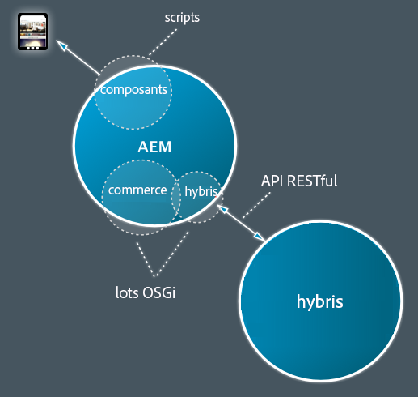
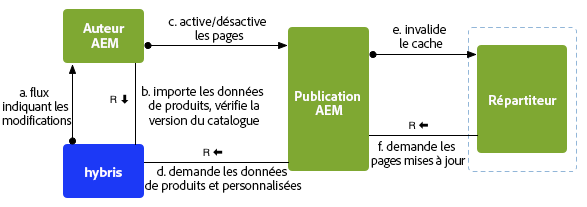
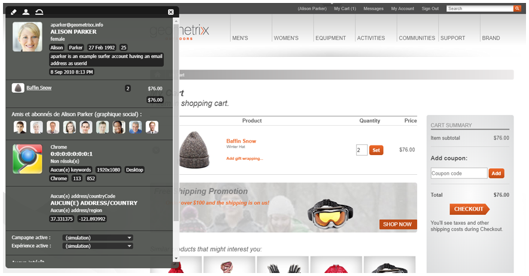

# Développement avec SAP Commerce Cloud {#developing-with-sap-commerce-cloud}

>[!NOTE]
>
>La structure eCommerce peut être utilisée avec n’importe quelle solution eCommerce. Certaines fonctionnalités et certains exemples traités ici font référence à la solution [hybris](https://www.hybris.com/).

La structure d’intégration comprend une couche d’intégration avec une API. Ce permet d’effectuer les opérations suivantes :

* connecter un système eCommerce et d’extraire les données produit vers AEM ;

* créer des composants AEM afin de disposer de fonctionnalités de commerce indépendantes du moteur eCommerce spécifique.



>[!NOTE]
>
>[La documentation relative à l’API](/help/sites-developing/ecommerce.md#api-documentation) est également disponible.

Un certain nombre de composants AEM prêts à l’emploi sont fournis pour utiliser la couche d’intégration. Actuellement, il s’agit des composants suivants :

* Composant d’affichage de produit
* Panier
* Passage en caisse

Pour rechercher, le crochet d’intégration fourni vous permet d’utiliser la recherche AEM, la recherche du système eCommerce, une recherche tiers (comme Search&amp;Promote) ou une combinaison de ces éléments.

## Sélection du moteur eCommerce {#ecommerce-engine-selection}

La structure eCommerce peut être utilisée avec n’importe quelle solution d’eCommerce. Le moteur utilisé doit être identifiable par AEM :

* Les moteurs eCommerce sont des services OSGi prenant en charge l’interface `CommerceService`.

   * Les moteurs peuvent être distingués par une propriété de service `commerceProvider`.

* aem prend en charge `Resource.adaptTo()` les `CommerceService` et `Product`

   * The `adaptTo` implementation looks for a `cq:commerceProvider` property in the resource&#39;s hierarchy:

      * Si elle est trouvée, la valeur est utilisée pour filtrer la recherche de service de commerce.

      * Dans le cas contraire, le service de commerce le mieux classé est utilisé.
   * A `cq:Commerce` mixin is used so the `cq:commerceProvider` can be added to strongly-typed resources.


* La propriété `cq:commerceProvider` est également utilisée pour référencer la définition de fabrique de commerce appropriée.

   * Par exemple, une propriété `cq:commerceProvider` avec la valeur `hybris` est corrélée à la configuration OSGi pour **Day CQ Commerce Factory for** (com.adobe.cq.commerce.hybris.impl.HybrisServiceFactory), où le paramètre `commerceProvider` possède aussi la valeur `hybris`hybris.

   * D’autres propriétés, telles que **Version du catalogue**, peuvent être configurées ici, le cas échéant.

Consultez les exemples ci-dessous :

| `cq:commerceProvider = geometrixx` | dans une installation AEM standard, une mise en oeuvre spécifique est requise ; par exemple, l’exemple geometrixx, qui inclut des extensions minimales à l’API générique. |
|--- |--- |
| `cq:commerceProvider = hybris` | mise en oeuvre de l&#39;hybris |

### Exemple {#example}

```shell
/content/store
+ cq:commerceProvider = hybris
  + mens
    + polo-shirt-1
    + polo-shirt-2
    + employee
+ cq:commerceProvider = jcr
  + adobe-logo-shirt
    + cq:commerceType = product
    + price = 12.50
  + adobe-logo-shirt_S
    + cq:commerceType = variant
    + size = S
  + adobe-logo-shirt_XL
    + cq:commerceType = variant
    + size = XL
    + price = 14.50
```

>[!NOTE]
>
>À l’aide de CRXDE Lite, vous pouvez voir comment cela est géré par le composant de produit pour la mise en œuvre hybris :
>
>`/apps/geometrixx-outdoors/components/hybris/product/product.jsp`

### Développement pour hybris 4 {#developing-for-hybris}

L&#39;extension hybris du cadre d&#39;intégration du commerce électronique a été mise à jour pour prendre en charge Hybris 5, tout en maintenant une compatibilité ascendante avec Hybris 4.

Les paramètres par défaut du code sont optimisés pour hybris 5.

Afin de développer pour hybris 4, les éléments suivants sont nécessaires :

* Lors de l&#39;appel de maven, ajoutez l&#39;argument de ligne de commande suivant à la commande

   `-P hybris4`

   Il télécharge la distribution Hybris 4 préconfigurée et l&#39;incorpore dans l&#39;assemblage `cq-commerce-hybris-server`.

* Dans Configuration Manager OSGi :

   * Désactivez la prise en charge d’hybris 5 pour le service d’analyseur de réponse par défaut.

   * Assurez-vous que le service de gestionnaire d’authentification de base hybris possède un classement de service inférieur à celui du service de gestionnaire OAuth hybris.

### Gestion de session {#session-handling}

hybris utilise une session utilisateur pour stocker des informations telles que le panier du client. L’ID de session est renvoyé par hybris dans un cookie `JSESSIONID` qui doit être envoyé lors des requêtes ultérieures transmises à hybris. Pour éviter de stocker l’ID de session dans le référentiel, il est codé dans un autre cookie stocké dans le navigateur du client. Les étapes suivantes sont effectuées :

* Lors de la première requête, aucun cookie n’est défini lors de la requête du client. De cette façon, une requête est envoyée à l’instance hybris pour créer une session.

* Les cookies de session sont extraits à partir de la réponse, codés dans un nouveau cookie (par exemple, `hybris-session-rest`) et définis dans la réponse au client. Le codage du nouveau cookie est nécessaire, car le cookie d’origine n’est valide que pour un certain chemin et ne serait sinon pas renvoyé à partir du navigateur lors des requêtes ultérieures. Les informations de chemin doivent également être ajoutées à la valeur du cookie.

* On subsequent requests, the cookies are decoded from the `hybris-session-<*xxx*>` cookies and set on the HTTP client that is used to request data from hybris.

>[!NOTE]
>
>Une nouvelle session anonyme est créée lorsque la session d’origine n’est plus valide.

#### CommerceSession {#commercesession}

* Cette session &quot;possède&quot; le **panier**

   * exécute les ajouts/suppressions/etc. ;

   * effectue les divers calculs sur le panier ;

      `commerceSession.getProductPrice(Product product)`

* Possède l’*emplacement de stockage* pour les **données** des commandes : 

   `CommerceSession.getUserContext()`

* Possède également la connexion du traitement des **paiements**

* Possède également la connexion d’**exécution**

### Synchronisation et publication des produits {#product-synchronization-and-publishing}

Les données produit gérées dans hybris doivent être disponibles dans AEM. Le mécanisme suivant a été mis en œuvre :

* Un chargement initial d’ID est fourni par hybris sous la forme d’un flux. Ce flux peut avoir des mises à jour.
* hybris fournit les informations de mise à jour par le biais d’un flux (interrogé par AEM).
* Lorsqu’AEM utilise les données produit, il renvoie les requêtes à hybris pour les données actives (requête get conditionnelle en utilisant la date de dernière modification).
* Sur hybris, il est possible de spécifier le contenu du flux de manière déclarative.
* Le mappage de la structure de flux au modèle de contenu AEM se produit dans l’adaptateur de flux du côté d’AEM.



* L’importateur (b) est utilisé pour la configuration initiale de l’arborescence de page dans AEM pour les catalogues.
* Les modifications de catalogue dans hybris sont indiquées à AEM par le biais d’un flux, puis propagées vers AEM (b) :

   * Le produit est ajouté/supprimé/modifié par rapport à la version du catalogue.

   * Le produit est approuvé.

* L’extension hybris fournit un importateur d’interrogations (hybris scheme), qui peut être configuré pour importer les modifications dans AEM selon un intervalle de temps donné spécifié en secondes (par exemple, toutes les 24 heures) :

   ```JavaScript
       http://localhost:4502/content/geometrixx-outdoors/en_US/jcr:content.json
        {
        * "jcr:mixinTypes": ["cq:PollConfig"],
        * "enabled": true,
        * "source": "hybris:outdoors",
        * "jcr:primaryType": "cq:PageContent",
        * "interval": 86400
        }
   ```

* La configuration de catalogue dans AEM reconnaît les versions de catalogues **intermédiaires** et **en ligne**.

* La synchronisation des produits entre les versions de catalogue nécessite une (dés-)activation de la page AEM correspondante (a, c) :

   * L’ajout d’un produit à une version de catalogue **en ligne** requiert l’activation de la page du produit.

   * La suppression d’un produit nécessite la désactivation.

* L’activation d’une page dans AEM (c) nécessite une vérification (b) et est possible uniquement si :

   * le produit se trouve dans une version de catalogue **en ligne** pour les pages du produit ;

   * les produits référencés sont disponibles dans une version du catalogue **en ligne** pour d’autres pages (par exemple, des pages de campagne).

* Les pages de produits activées doivent accéder à la version **en ligne** des données de produit (d).

* L’instance de publication AEM doit pouvoir accéder à hybris pour récupérer les données de produit et personnalisées (d).

### Architecture {#architecture}

#### Architecture d’un produit et de ses variantes {#architecture-of-product-and-variants}

Un produit unique peut posséder plusieurs variantes ; par exemple, il peut présenter différentes couleurs et/ou tailles. Un produit doit définir les propriétés pouvant varier que nous appelons *axes des variantes*.

Cependant, toutes les propriétés ne sont pas des axes de variante. Les variantes peuvent également avoir un impact sur d’autres propriétés. Par exemple, le prix peut dépendre de la taille. Ces propriétés ne peuvent pas être sélectionnées par l’acheteur et ne sont donc pas considérées comme des axes de variante.

Chaque produit et/ou variante est représenté par une ressource, et se voit donc mapper selon une relation 1:1 à un nœud du référentiel. Le corollaire est qu’un produit et/ou une variante spécifique peut être identifié par son chemin.

La ressource de produit/variante ne contient pas toujours les données produit. Il peut s’agir d’une représentation de données contenues sur un autre système (comme hybris). Par exemple, les descriptions des produits, les prix, etc. ne sont pas stockés dans AEM, mais sont récupérés en temps réel à partir du moteur eCommerce.

Any product resource can be represented by a `Product API`. Most calls in the product API are variation specific (although variations might inherit shared values from an ancestor), but there are also calls which list the set of variations ( `getVariantAxes()`, `getVariants()`, etc.).

>[!NOTE]
>
>In effect a variant axes is determined by whatever `Product.getVariantAxes()` returns:
>* hybris le définit pour la mise en œuvre hybris.
>
>
Bien que les produits (en général) peuvent présenter plusieurs axes de variante, le composant de produit prêt à l’emploi n’en prend en charge que deux :
>
>1. `size`
   >
   >
1. plus un
>
>
This additional variant is selected via the `variationAxis` property of the product reference (usually `color` for Geometrixx Outdoors).

#### Références et données de produits {#product-references-and-product-data}

En général :

* product data is located under `/etc`

* and product references under `/content`.

Il doit y avoir un mappage 1:1 entre les variations de produit et les nœuds de données de produit.

Les références de produit doivent également disposer d’un nœud pour chaque variation présentée, mais il n’est pas nécessaire de présenter toutes les variations. Par exemple, si un produit présente des variations S, M et L, les données du produit peuvent être les suivantes :

```shell
etc
|──commerce
|  |──products
|     |──shirt
|       |──shirt-s
|       |──shirt-m
|       |──shirt-l
```

Alors qu’un catalogue « grandes tailles » aurait uniquement :

```shell
content
|──big-and-tall
|  |──shirt
|     |──shirt-l
```

Enfin, il n’est pas nécessaire d’utiliser les données de produits. Vous pouvez placer toutes les données de produits sous les références dans le catalogue, mais vous ne pouvez pas vraiment avoir plusieurs catalogues sans dupliquer toutes les données de produits.

**API**

#### Interface com.adobe.cq.commerce.api.Product {#com-adobe-cq-commerce-api-product-interface}

```java
public interface Product extends Adaptable {

    public String getPath();            // path to specific variation
    public String getPagePath();        // path to presentation page for all variations
    public String getSKU();             // unique ID of specific variation

    public String getTitle();           // shortcut to getProperty(TITLE)
    public String getDescription();     // shortcut to getProperty(DESCRIPTION)
    public String getImageUrl();        // shortcut to getProperty(IMAGE_URL)
    public String getThumbnailUrl();    // shortcut to getProperty(THUMBNAIL_URL)

    public <T> T getProperty(String name, Class<T> type);

    public Iterator<String> getVariantAxes();
    public boolean axisIsVariant(String axis);
    public Iterator<Product> getVariants(VariantFilter filter) throws CommerceException;
}
```

#### com.adobe.cq.commerce.api.VariantFilter  {#com-adobe-cq-commerce-api-variantfilter}

```java
/**
 * Interface for filtering variants and AxisFilter provided as common implementation
 *
 * The <code>VariantFilter</code> is used to filter variants,
 * e.g. when using {@link Product#getVariants(VariantFilter filter)}.
 */
public interface VariantFilter {
    public boolean includes(Product product);
}

/**
 * A {@link VariantFilter} for filtering variants by the given
 * axis and value. The following example returns a list of
 * variant products that have a value of <i>blue</i> on the
 * <i>color</i> axis.
 *
 * <p>
 * <code>product.getVariants(new AxisFilter("color", "blue"));</code>
 */
public class AxisFilter implements VariantFilter {

    private String axis;
    private String value;

    public AxisFilter(String axis, String value) {
        this.axis = axis;
        this.value = value;
    }

    /**
     * {@inheritDoc}
     */
    public boolean includes(Product product) {
        ValueMap values = product.adaptTo(ValueMap.class);

        if(values != null) {
            String v = values.get(axis, String.class);

            return v != null && v == value;
        }

        return false;
    }
}
```

* **Mécanisme de stockage général**

   * Product nodes are `nt:unstructured`.

   * Un nœud de produit peut être soit :

      * une référence, avec les données de produits stockées ailleurs :

         * Product references contain a `productData` property, which points to the product data (typically under `/etc/commerce/products`).

         * Les données de produit sont hiérarchiques. Les attributs de produit sont hérités des ancêtres d’un nœud de données de produit.

         * Les références de produit peuvent également contenir des propriétés locales qui remplacent celles spécifiées dans leurs données de produit.
      * un produit lui-même :

         * Without a `productData` property.

         * Un nœud de produit qui contient toutes les propriétés localement (et ne contient pas de propriété productData) hérite des attributs de produit directement de ses propres ancêtres.


* **Structure de produit générique AEM**

   * Chaque variante doit avoir son propre nœud feuille.

   * L’interface du produit représente à la fois les produits et les variantes, mais le nœud du référentiel associé est spécifique.

   * Le nœud de produit décrit les attributs de produit et les axes de variante.

#### Exemple {#example-1}

```shell
+ banyan_shirt
    - cq:commerceType = product
    - cq:productAttributes = [jcr:title, jcr:description, size, price, color]
    - cq:productVariantAxes = [color, size]
    - jcr:title = Banyan Shirt
    - jcr:description = Flowery, all-cotton shirt.
    - price = 14.00
    + banyan_shirt_s
        - cq:commerceType = variant
        - size = S
        + banyan_shirt_s_red
            - cq:commerceType = variant
            - color = red
        + banyan_shirt_s_blue
            - cq:commerceType = variant
            - color = blue
    + banyan_shirt_m
        - cq:commerceType = variant
        - size = M
        + banyan_shirt_m_red
            - cq:commerceType = variant
            - color = red
        + banyan_shirt_m_blue
            - cq:commerceType = variant
            - color = blue
    + banyan_shirt_l
        - cq:commerceType = variant
        - size = L
        + banyan_shirt_l_red
            - cq:commerceType = variant
            - color = red
        + banyan_shirt_l_blue
            - cq:commerceType = variant
            - color = blue
    + banyan_shirt_xl
        - cq:commerceType = variant
        - size = XL
        - price = 18.00
```

#### Architecture du panier {#architecture-of-the-shopping-cart}

**Composants**

* Le panier est détenu par `CommerceSession:` :

   * `CommerceSession` effectue les ajouts/suppressions/etc.
   * The `CommerceSession` also performs the various calculations on the cart. ``

* Bien que n’étant pas directement associé au panier, `CommerceSession` doit également fournir des informations de prix de catalogue (puisqu’il gère les prix).

   * Les prix peuvent avoir plusieurs modificateurs :

      * Remises en fonction de la quantité.
      * Différentes devises.
      * Sujets ou non à la TVA.
   * Les modificateurs sont totalement ouverts avec l’interface suivante :

      * `int CommerceSession.getQuantityBreakpoints(Product product)`
      * `String CommerceSession.getProductPrice(Product product)`


**Stockage**

* Stockage

   * Dans le cas d’hybris, le serveur hybris possède le panier.
   * Dans les cas génériques d’AEM, les paniers sont stockés dans [ClientContext](/help/sites-administering/client-context.md).

**Personnalisation**

* La personnalisation doit toujours être pilotée via [ClientContext](/help/sites-administering/client-context.md).
* A ClientContext `/version/` of the cart is created in all cases:

   * Products should be added by using the `CommerceSession.addCartEntry()` method.

* Voici un exemple d’informations de panier dans le panier ClientContext :



#### Architecture du passage en caisse {#architecture-of-checkout}

**Données de panier et de commande**

`CommerceSession` possède trois éléments :

1. Contenu du panier
1. Prix
1. Détails de la commande

1. **Contenu du panier**

   Le schéma du contenu du panier est défini par l’API :

   ```java
   public void addCartEntry(Product product, int quantity);
   public void modifyCartEntry(int entryNumber, int quantity);
   public void deleteCartEntry(int entryNumber);
   ```

1. **Prix**

   Le schéma de prix est également fixé par le biais de l’API :

   ```java
   public String getCartPreTaxPrice();
   public String getCartTax();
   public String getCartTotalPrice();
   public String getOrderShipping();
   public String getOrderTotalTax();
   public String getOrderTotalPrice();
   ```

1. **Détails de la commande**

   Toutefois, les détails de la commande *ne sont pas fixés* par le biais de l’API :

   ```java
   public void updateOrderDetails(Map<String, String> orderDetails);
   public Map<String, String> getOrderDetails();
   public void submitOrder();
   ```

**Calculs des frais d’expédition**

* Les formulaires de commande doivent souvent afficher plusieurs options d’expédition (et leurs prix).
* Ils peuvent être basés sur des éléments et des détails de la commande, tels que le poids et/ou l’adresse d’expédition.
* `CommerceSession` a accès à toutes les dépendances, afin qu’il puisse être traité de manière similaire au prix du produit :

   * The `CommerceSession` owns shipping pricing.
   * Can retrieve/update delivery details by using `updateOrder(Map<String, Object> delta)`

>[!NOTE]
>
>Vous pouvez mettre en œuvre un sélecteur d’expédition, par exemple :
>
>`yourProject/commerce/components/shippingpicker` :
>
>* Essentially this could be a copy of `foundation/components/form/radio`, but with callbacks to the `CommerceSession` for:
   >
   >
* vérifier si la méthode est disponible ;
>* ajouter des informations sur les prix.
>* Pour permettre aux utilisateurs de mettre à jour la page de commande dans AEM (y compris le sur-ensemble de méthodes d’expédition et texte les décrivant), tout en gardant le contrôle pour exposer les informations `CommerceSession` appropriées.


**Traitement des paiements**

* `CommerceSession` possède également la connexion du traitement des paiements.

* Les implémenteurs doivent ajouter les appels spécifiques (au service de traitement des paiements de leur choix) à la mise en œuvre de `CommerceSession`.

**Exécution des commandes**

* `CommerceSession` possède également la connexion à l’exécution.
* Les implémenteurs doivent ajouter les appels spécifiques (au service d’exécution des commandes de leur choix) à la mise en œuvre de `CommerceSession`.

### Définition de la recherche {#search-definition}

Suivant le modèle d’API de service standard, le projet eCommerce fournit un ensemble d’API associées à la recherche qui peut être mis en œuvre dans des moteurs de commerce individuels.

>[!NOTE]
>
>Actuellement, seul le moteur hybris implémente l’API de recherche prête à l’emploi.
>
>Cependant, l’API de recherche est générique et peut être implémentée par chaque CommerceService individuellement.

Le projet eCommerce contient un composant de recherche par défaut, situé sous :

`/libs/commerce/components/search`


Il utilise l’API de recherche pour interroger le moteur de commerce sélectionné (voir [Sélection d’un moteur eCommerce](#ecommerce-engine-selection)) :

#### API de recherche {#search-api}

Plusieurs classes génériques/helper sont fournies par le projet principal :

1. `CommerceQuery`

   Sert à décrire une requête de recherche (il contient des informations sur le texte de requête, la page actuelle, le format de page, le tri et les facettes sélectionnées). Tous les services eCommerce qui mettent en œuvre l’API de recherche recevront des instances de cette classe pour effectuer la recherche. A `CommerceQuery` can be instantiated from a request object ( `HttpServletRequest`).

1. `FacetParamHelper`

    Est une classe utilitaire qui fournit une méthode statique, `toParams`, utilisée pour générer les chaînes de paramètre `GET` à partir d’une liste de facettes et d’une valeur basculée. Cela est utile du côté de l’IU, où vous devez afficher un lien hypertexte pour chaque valeur de chaque facette, de façon à ce que, lorsque l’utilisateur clique sur le lien hypertexte, la valeur correspondante soit activée (c’est-à-dire, si elle a été sélectionnée, elle est supprimée de la requête, ou ajoutée dans le cas contraire). Cela prend en charge toute la logique de gestion des facettes multiples/à valeur unique, du remplacement des valeurs, etc.

Le point d’entrée de l’API de recherche est la méthode `CommerceService#search` qui renvoie un objet `CommerceResult`. Consultez la [documentation relative à l’API](/help/sites-developing/ecommerce.md#api-documentation) pour plus d’informations à ce sujet.

### Intégration de l’utilisateur {#user-integration}

L’intégration est fournie entre AEM et différents systèmes eCommerce. Elle requiert une stratégie pour synchroniser les clients entre les différents systèmes de sorte que le code spécifique à AEM doive connaître uniquement AEM et inversement :

* Authentification

   AEM is presumed to be the *only* web front-end and therefore performs *all* authentication.

* Comptes en hybris

   aem crée un compte (Secondaire) correspondant en hybris pour chaque acheteur. Le nom d’utilisateur de ce compte est identique à celui de l’AEM. Un mot de passe aléatoire sur le plan cryptographique est généré automatiquement et stocké (chiffré) dans AEM.

#### Utilisateurs préexistants {#pre-existing-users}

Un système frontal AEM peut être placé devant une mise en œuvre hybris existante. Un moteur hybris peut également être ajouté à une installation AEM existante. Pour ce faire, les systèmes doivent pouvoir gérer intelligemment les utilisateurs existants dans l’un ou l’autre système :

* AEM -> hybris

   * Lors de la connexion à hybris, si l’utilisateur AEM n’existe pas déjà :

      * Créez un utilisateur hybris avec un mot de passe aléatoire au niveau cryptographique.
      * Stockez le nom d’utilisateur hybris dans l’annuaire d’utilisateurs de l’utilisateur AEM.
   * Voir: `com.adobe.cq.commerce.hybris.impl.HybrisSessionImpl#login()`


* hybris -> AEM

   * Lors de l’ouverture d’une session AEM, si le système reconnaît l’utilisateur :

      * Tentez de vous connecter à hybris avec le nom d’utilisateur/mot de passe fourni.
      * En cas de réussite, créez un utilisateur dans AEM avec le même mot de passe (la valeur salt spécifique à AEM engendre un hachage spécifique à AEM).
   * L’algorithme ci-dessus est mise en œuvre dans un `AuthenticationInfoPostProcessor` Sling.

      * Voir: `com.adobe.cq.commerce.hybris.impl.user.LazyUserImporter.java`


### Personnalisation du processus d’importation {#customizing-the-import-process}

Pour exploiter les fonctionnalités existantes, votre gestionnaire d’importation personnalisé :

* has to implement the `ImportHandler` interface

* can extend the `DefaultImportHandler`.

```java
/**
 * Services implementing the <code>ImportHandler</code> interface are
 * called by the {@link HybrisImporter} to create actual commerce entities
 * such as products.
 */
public interface ImportHandler {

  /**
  * Not used.
  */
  public void createTaxonomie(ImporterContext ctx);

  /**
  * Creates a catalog with the given name.
  * @param ctx   The importer context
  * @param name  The catalog's name
  * @return Path of created catalog
  */
  public String createCatalog(ImporterContext ctx, String name) throws Exception;

  /**
  * Creates a product from the given values.
  * @param ctx                The importer context
  * @param values             The product's properties
  * @param parentCategoryPath The containing category's path
  * @return Path of created product
  */
  public String createProduct(ImporterContext ctx, ValueMap values, String parentCategoryPath) throws Exception;

  /**
  * Creates a variant product from the given values.
  * @param ctx             The importer context
  * @param values          The product's properties
  * @param baseProductPath The base product's path
  * @return Path of created product
  */
  public String createVariantProduct(ImporterContext ctx, ValueMap values, String baseProductPath) throws Exception;

  /**
  * Creates an asset for a product. This is usually a product
  * image.
  * @param ctx             The importer context
  * @param values          The product's properties
  * @param baseProductPath The product's path
  * @return Path of created asset
  */
  public String createAsset(ImporterContext ctx, ValueMap values, String productPath) throws Exception;

  /**
  * Creates a category from the given values.
  * @param ctx           The importer context
  * @param values        The category's properties
  * @param parentPath    Path of parent category or base path of import in case of root category
  * @return Path of created category
  */
  public String createCategory(ImporterContext ctx, ValueMap values, String parentCategoryPath) throws Exception;
}
```

For your custom handler to be recognized by the importer, it must specify the `service.ranking`property with a value higher than 0; for example.

```java
@Component
@Service
@Property(name = "service.ranking", value = 100)
public class MyImportHandler extends DefaultImportHandler
{
...
}
```
