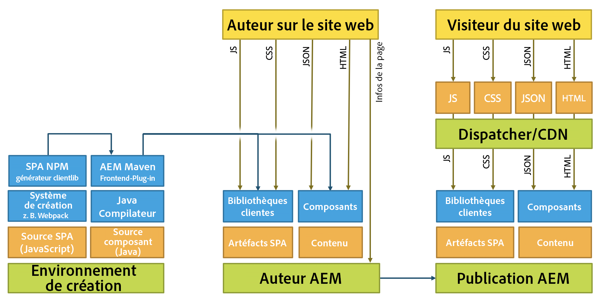

# Développement d’applications monopages pour AEM{#developing-spas-for-aem}

Les applications d’une seule page (SPA) peuvent améliorer considérablement l’expérience des utilisateurs de sites web. Le souhait des développeurs est de pouvoir créer des sites avec des structures SPA. Les auteurs, pour leur part, souhaitent modifier facilement du contenu dans AEM pour un site conçu à l’aide de telles structures.

Cet article présente des questions importantes à prendre en compte lorsque vous demandez à un développeur frontal de développer une application d’une seule page pour AEM et donne un aperçu de l’architecture d’AEM en ce qui concerne le déploiement d’applications d’une seule page sur AEM.

>[!NOTE]
>
>L’éditeur d’application d’une seule page est la solution recommandée pour les projets nécessitant un rendu côté client basé sur la structure d’application d’une seule page (par exemple, Réagir ou Angulaire).

## Principes de développement des applications monopages pour AEM {#spa-development-principles-for-aem}

Le développement d’applications d’une seule page sur AEM suppose que le développeur frontal respecte les bonnes pratiques standard lors de la création d’une application d’une seule page. Si, en tant que développeur frontal, vous suivez ces bonnes pratiques générales ainsi que quelques principes spécifiques à AEM, votre application d’une seule page sera fonctionnelle avec [AEM et ses fonctionnalités](/help/sites-developing/spa-walkthrough.md#content-editing-experience-with-spa)de création de contenu.

* **[Portabilité](/help/sites-developing/spa-architecture.md#portability)-**Comme pour tout composant, les composants doivent être conçus pour être aussi portables que possible. L’application d’une seule page doit être construite avec des composants portatifs et réutilisables.
* **[Structure](/help/sites-developing/spa-architecture.md#aem-drives-site-structure)**du site pilotée par AEM : le développeur principal crée des composants et possède leur structure interne, mais compte sur AEM pour définir la structure du contenu du site.
* **[Rendu](/help/sites-developing/spa-architecture.md#dynamic-rendering)**dynamique : tous les rendus doivent être dynamiques.
* **[Routage](#dynamic-routing)dynamique -**L&#39;application d&#39;une seule page est responsable du routage et AEM l&#39;écoute et les récupère en fonction. Tout routage doit également être dynamique.

Si vous gardez ces principes à l’esprit lorsque vous développez votre application d’une seule page, elle sera aussi flexible et la meilleure preuve possible à l’avenir tout en activant toutes les fonctionnalités de création prises en charge par AEM.

Si vous n’avez pas besoin de prendre en charge les fonctionnalités de création d’AEM, vous devrez peut-être envisager un modèle [de conception d’](/help/sites-developing/spa-architecture.md#spa-design-models)application d’une seule page.

### Portabilité {#portability}

Comme lors du développement d’un composant, vos composants doivent être conçus de manière à optimiser leur portabilité. Tout modèle qui va à l&#39;encontre de la portabilité ou de la réutilisation des composants doit être évité pour assurer la compatibilité, la flexibilité et la maintenabilité à l&#39;avenir.

L’application d’une seule page doit être construite avec des composants hautement portables et réutilisables.

### Structure du site AEM Drives {#aem-drives-site-structure}

Le développeur frontal doit se considérer comme responsable de la création d’une bibliothèque de composants SPA utilisés pour créer l’application. Le développeur frontal contrôle entièrement la structure interne des composants. [Cependant, AEM détient toujours la structure du site.](/help/sites-developing/spa-overview.md)

Cela signifie que le développeur frontal peut ajouter du contenu client avant ou après le point d’entrée des composants et peut également effectuer des appels tiers dans le composant. Cependant, le développeur frontal ne contrôle pas entièrement la manière dont les composants sont imbriqués, par exemple.

### Rendu dynamique {#dynamic-rendering}

L’application d’une seule page repose sur le rendu dynamique du contenu. Il s’agit de l’attente par défaut à laquelle AEM récupère et rend tous les enfants de la structure de contenu. 

Tout rendu explicite pointant vers un contenu spécifique est considéré comme un rendu statique et bien que pris en charge ne sera pas compatible avec les fonctionnalités de création de contenu d’AEM. Cela va aussi à l&#39;encontre du principe de [portabilité](/help/sites-developing/spa-architecture.md#portability).

### Routage dynamique {#dynamic-routing}

Comme pour le rendu, tout le routage doit également être dynamique. Dans AEM, [l’application d’une seule page doit toujours posséder le routage](/help/sites-developing/spa-routing.md) et AEM l’écoute et récupère le contenu en fonction de celui-ci.

Tout routage statique fonctionne en violation du [principe de portabilité](/help/sites-developing/spa-architecture.md#portability) et limite l’auteur en raison de sa non-compatibilité avec les fonctionnalités de création de contenu d’AEM. Par exemple, avec le routage statique, si l’auteur du contenu souhaite modifier un itinéraire ou une page, il doit demander au développeur frontal de le faire.

## Maven Archetype for SPA Starter Kit {#maven-archetype-for-spa-starter-kit}

Adobe recommande de tirer parti du kit [de démarrage](https://github.com/adobe/aem-spa-project-archetype) Maven Archetype for SPA pour vous aider à démarrer votre propre projet SPA pour AEM.

## Modèles de conception SPA {#spa-design-models}

Si les [principes de développement d’applications monopages dans AEM](/help/sites-developing/spa-architecture.md#spa-development-principles-for-aem) sont respectés, votre application d’une seule page sera fonctionnelle avec toutes les fonctionnalités de création de contenu AEM prises en charge. 

Il peut toutefois y avoir des cas où cela n&#39;est pas tout à fait nécessaire. Le tableau suivant donne un aperçu des différents modèles de conception, de leurs avantages et de leurs inconvénients.

<table>
 <tbody>
  <tr>
   <th><strong>Modèle de conception  </strong></th>
   <th><strong>Avantages</strong></th>
   <th><strong>Inconvénients</strong></th>
  </tr>
  <tr>
   <td>AEM est utilisé comme CMS sans en-tête sans utiliser la structure du SDK de l’éditeur <a href="/help/sites-developing/spa-reference-materials.md">d’applications monopages.</a></td>
   <td>Le développeur frontal contrôle entièrement l’application.</td>
   <td>
Les auteurs de contenu ne peuvent pas tirer parti de l’expérience de création de contenu d’AEM.
 
Le code n'est ni portable ni réutilisable s'il contient des références statiques ou un routage.
 
N’autorise pas l’utilisation de l’éditeur de modèles ; le développeur frontal doit donc conserver les modèles modifiables via le JCR.
 </td>
  </tr>
  <tr>
   <td>Le développeur frontal utilise la structure du SDK SPA Editor, mais n’ouvre que certaines zones à l’auteur du contenu.</td>
   <td>Le développeur garde le contrôle de l’application en activant uniquement la création dans des zones restreintes de l’application.</td>
   <td>
Les auteurs de contenu sont limités à un ensemble limité d’expériences de création de contenu AEM.
 
Le code risque de ne pas être portable ni réutilisable s'il contient des références statiques ou un routage.
 
N’autorise pas l’utilisation de l’éditeur de modèles ; le développeur frontal doit donc conserver les modèles modifiables via le JCR.
 </td>
  </tr>
  <tr>
   <td>Le projet tire pleinement parti du SDK SPA Editor et les composants frontend sont développés en tant que bibliothèque et la structure de contenu de l’application est déléguée à AEM.</td>
   <td>
L'application est réutilisable et portable.
 
L’auteur du contenu peut modifier l’application à l’aide de l’expérience de création de contenu d’AEM.  
 
L’application d’une seule page est compatible avec l’éditeur de modèles.
 </td>
   <td>
Le développeur ne contrôle pas la structure de l’application et la partie du contenu déléguée à AEM.
 
Le développeur peut toujours réserver des zones de l’application pour le contenu qui n’est pas destiné à être créé à l’aide d’AEM.
 </td>
  </tr>
 </tbody>
</table>

>[!NOTE]
>
>Bien que tous les modèles soient pris en charge dans AEM, ce n’est qu’en implémentant le troisième modèle (et donc en suivant les principes de développement [d’application monopage recommandés dans AEM](/help/sites-developing/spa-architecture.md#spa-development-principles-for-aem)) que les auteurs de contenu pourront interagir avec le contenu de l’application monopage et le modifier dans AEM tel qu’ils sont habitués.
>

## Migration des applications monopages existantes vers AEM {#migrating-existing-spas-to-aem}

En règle générale, si votre application d’une seule page respecte les Principes de développement de l’ [application d’une seule page pour AEM](/help/sites-developing/spa-architecture.md#spa-development-principles-for-aem), elle fonctionne dans AEM et peut être modifiée à l’aide de l’éditeur d’applications d’une seule page.

Suivez ces étapes pour préparer votre application d’une seule page pour travailler avec AEM.

1. **Rendez vos composants JS modulaires.**

   Rendez-les capables d’être rendus dans n’importe quel ordre, position et taille.
1. **Utilisez les conteneurs fournis par notre SDK pour placer vos composants à l’écran.**

   AEM fournit un composant système de page et de paragraphe que vous pouvez utiliser.
1. **Créez un composant AEM pour chaque composant JS.**

   Les composants AEM définissent la boîte de dialogue et la sortie JSON.

## Instructions destinées aux développeurs frontaux {#instructions-for-front-end-developers}

La principale tâche de création d’une application d’une seule page pour AEM par un développeur frontal consiste à convenir des composants et de leurs modèles JSON.

Vous trouverez ci-dessous un aperçu des étapes qu’un développeur frontal doit suivre lors du développement d’une application d’une seule page SPA pour AEM.

1. **Accepter les composants et leur modèle JSON**

   Les développeurs frontaux et les développeurs d’AEM principaux doivent s’entendre sur les composants nécessaires et sur un modèle afin qu’il existe une correspondance individuelle entre les composants SPA et les composants principaux.

   Les composants AEM sont toujours nécessaires principalement pour fournir des boîtes de dialogue de modification et pour exporter le modèle de composant.

1. **Dans les composants Réagir, accédez au modèle via`this.props.cqModel`**

   Une fois que les composants sont acceptés et que le modèle JSON est en place, le développeur frontal est libre de développer l’application d’une seule page et peut simplement accéder au modèle JSON via `this.props.cqModel`.

1. **Mise en oeuvre de la`render()`méthode du composant**

   Le développeur frontal implémente la `render()` méthode selon ses besoins et peut utiliser les champs de la `cqModel` propriété. Cette opération génère le modèle DOM et les fragments HTML qui seront insérés dans la page. Il s’agit de la méthode standard de création d’une application dans Réagir.

1. **Faites correspondre le composant au type de ressource AEM via`MapTo()`**

   Le mappage stocke les classes de composants et est utilisé en interne par le `Container` composant fourni pour récupérer et instancier dynamiquement les composants en fonction du type de ressource donné.

   Cela sert de &quot;colle&quot; entre le frontal et le back-end pour que l’éditeur sache quels composants correspondent les composants réactifs.

   Les `Page` et `ResponsiveGrid` sont de bons exemples de classes qui étendent la base `Container`.

1. **Définissez le composant`EditConfig`comme paramètre pour`MapTo()`**

   Ce paramètre est nécessaire pour indiquer à l’éditeur comment le composant doit être nommé tant qu’il n’est pas encore rendu ou qu’il n’a aucun contenu à rendre.

1. **Étendre la`Container`classe fournie pour les pages et les conteneurs**

   Les systèmes de pages et de paragraphes doivent étendre cette classe afin que la délégation aux composants internes fonctionne comme prévu.

1. **Implémentez une solution de routage utilisant l’`History`API HTML5.**

   Lorsque la `ModelRouter` est activée, l’appel des `pushState` fonctions et `replaceState` déclenche une demande à la `PageModelManager` section pour récupérer un fragment manquant du modèle.

   La version actuelle de `ModelRouter` ne prend en charge que l’utilisation d’URL pointant vers le chemin de ressource réel des points d’entrée du modèle Sling. Il ne prend pas en charge l’utilisation d’URL ou d’alias vanity.

   Il `ModelRouter` est possible de désactiver ou de configurer la variable pour ignorer une liste d’expressions régulières.

## AEM-Agnostique {#aem-agnostic}

Ces blocs de code illustrent la manière dont vos composants React et Angular n’ont besoin d’aucun élément spécifique à Adobe ou AEM.

* Tout ce qui se trouve dans le composant JavaScript est agnostique AEM.
* Ce qui est toutefois spécifique à AEM est que le composant JS doit être mappé à un composant AEM avec l’aide MapTo.

L&#39; `MapTo` aide est la &quot;colle&quot; qui permet de faire correspondre les composants dorsaux et frontaux :

* Il indique au conteneur JS (ou système de paragraphe JS) quel composant JS est responsable du rendu de chacun des composants présents dans le fichier JSON.
* Il ajoute un attribut de données HTML au code HTML généré par le composant JS, de sorte que l’éditeur d’applications monopages sache quelle boîte de dialogue afficher à l’auteur lors de la modification du composant.

Pour plus d’informations sur l’utilisation `MapTo` et la création d’applications monopages pour AEM en général, consultez le guide de prise en main de votre structure choisie.

* [Prise en main des applications monopages dans AEM - Réagir](/help/sites-developing/spa-getting-started-react.md)
* [Prise en main des applications monopages dans AEM - Angular](/help/sites-developing/spa-getting-started-angular.md)

## Architecture et applications monopages AEM {#aem-architecture-and-spas}

L’architecture générale d’AEM, y compris les environnements de développement, de création et de publication, ne change pas lors de l’utilisation d’applications monopages. Cependant, il est utile de comprendre comment le développement de l&#39;application SPA s&#39;intègre dans cette architecture.

* **Créer un environnement**

   C’est là que la source de l’application SPA et la source du composant sont extraits.

   * Le générateur clientlib NPM crée une bibliothèque cliente à partir du projet SPA.
   * Cette bibliothèque sera prise par Maven et déployée par le module externe Maven Build avec le composant dans AEM Author.

* **Auteur AEM**

   Le contenu est créé sur l’auteur AEM, y compris les applications monopages de création.

   Lorsqu’une application d’une seule page est modifiée à l’aide de l’éditeur d’application d’une seule page dans l’environnement de création :

   1. L’application d’une seule page demande le code HTML externe.
   1. Le fichier CSS est chargé.
   1. Le script JavaScript de l’application SPA est chargé.
   1. Lorsque l’application d’une seule page est exécutée, le fichier JSON est demandé, ce qui permet à l’application de créer le DOM de la page, y compris les `cq-data` attributs.
   1. Ces `cq-data` attributs permettent à l’éditeur de charger des informations de page supplémentaires afin de connaître les configurations de modification disponibles pour les composants.

* **Publication AEM**

   C’est là que le contenu créé et les bibliothèques compilées, y compris les artefacts d’application SPA, les clientlibs et les composants, sont publiés pour la consommation publique.

* **Répartiteur / CDN**

   Le répartiteur sert de couche de mise en cache d’AEM pour les visiteurs du site.

   * Les requêtes sont traitées de la même manière qu’elles se trouvent sur l’auteur AEM. Toutefois, aucune demande d’informations de page n’est envoyée, car cela n’est nécessaire que par l’éditeur.
   * Javascript, CSS, JSON et HTML sont mis en cache, ce qui optimise la page pour une diffusion rapide.

>[!NOTE]
>
>Dans AEM, il n’est pas nécessaire d’exécuter les mécanismes de création Javascript ni d’exécuter le code JavaScript lui-même. AEM héberge uniquement les artefacts compilés de l’application d’application d’une seule page.

## Étapes suivantes {#next-steps}

Pour une présentation de la structure d’une seule application d’une seule page d’accueil dans AEM et de son fonctionnement, reportez-vous au guide de prise en main [Réagir](/help/sites-developing/spa-getting-started-react.md) et [Angular](/help/sites-developing/spa-getting-started-angular.md).

Pour obtenir un guide détaillé sur la création de votre propre application d’une seule page, consultez le didacticiel [Prise en main de l’éditeur d’applications d’une seule page, intitulé AEM SPA Editor - WKND Events Tutorial](https://helpx.adobe.com/experience-manager/kt/sites/using/getting-started-spa-wknd-tutorial-develop.html)(en anglais).

Pour plus d’informations sur le mappage modèle dynamique/composant et son fonctionnement dans les applications monopages dans AEM, voir l’article Mappage modèle [dynamique/composant pour les applications monopages](/help/sites-developing/spa-dynamic-model-to-component-mapping.md).

Si vous souhaitez mettre en oeuvre des applications monopages dans AEM pour une structure autre que React ou Angular ou simplement plonger dans le fonctionnement du SDK SPA pour AEM, reportez-vous à l’article [SPA Blueprint](/help/sites-developing/spa-blueprint.md) .
