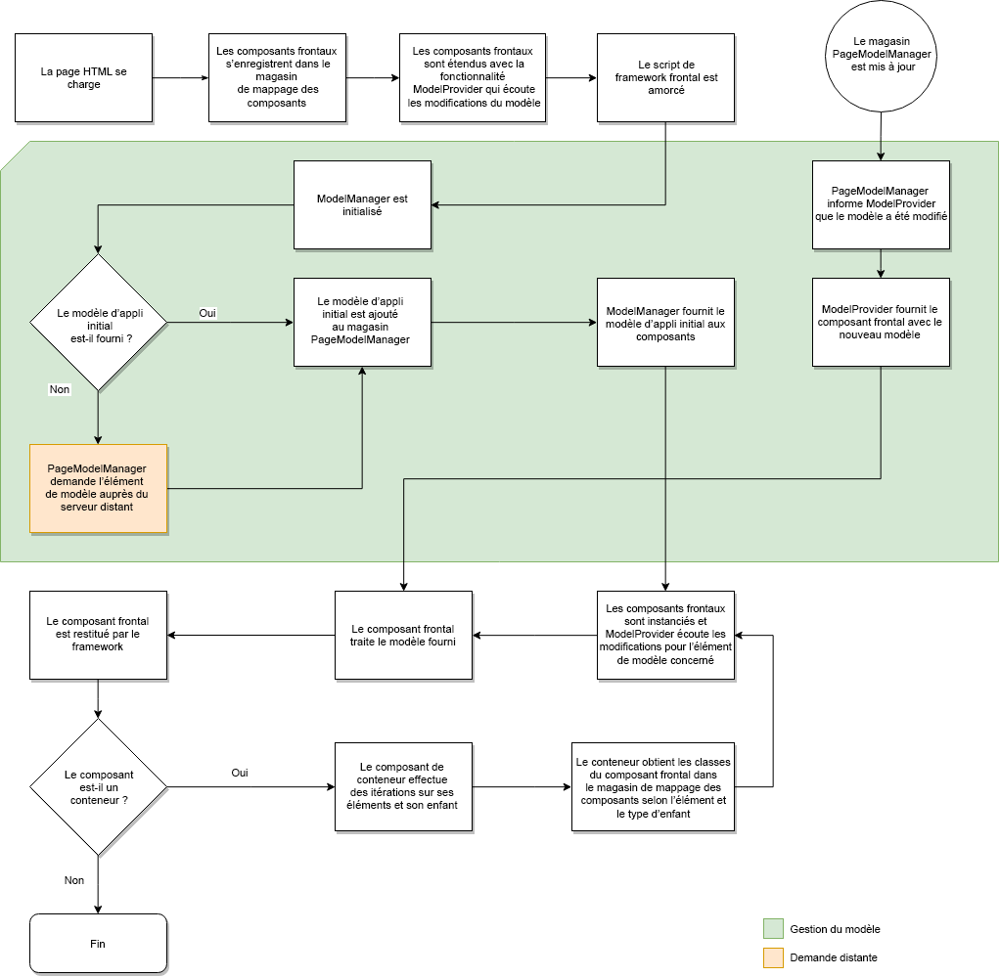

# Mappage Modèle dynamique/Composant pour les applications monopages{#dynamic-model-to-component-mapping-for-spas}

Ce document décrit comment le mappage modèle dynamique/composant se produit dans le SDK SPA JavaScript pour AEM.

>[!NOTE]
>
>L’éditeur d’application d’une seule page est la solution recommandée pour les projets nécessitant un rendu côté client basé sur la structure d’application d’une seule page (par exemple, Réagir ou Angulaire).

## Module ComponentMapping {#componentmapping-module}

The `ComponentMapping` module is provided as an NPM package to the front-end project. Il stocke les composants frontaux et permet à l’application d’une seule page de mapper les composants frontaux aux types de ressources AEM. Ceci active une résolution dynamique des composants lors de l’analyse du modèle JSON de l’application.

Chaque élément présent dans le modèle contient un `:type` champ qui expose un type de ressource AEM. Une fois monté, le composant frontal peut être rendu à l’aide du fragment de modèle reçu des bibliothèques sous-jacentes.

Pour plus d&#39;informations sur l&#39;analyse des modèles et sur l&#39;accès au modèle au composant frontal, veuillez consulter le document [SPA Blueprint](/help/sites-developing/spa-blueprint.md) .

Voir aussi le package npm : [https://www.npmjs.com/package/@adobe/cq-spa-component-mapping](https://www.npmjs.com/package/@adobe/cq-spa-component-mapping)

## Application d’une seule page pilotée par le modèle {#model-driven-single-page-application}

Les applications d’une seule page qui utilisent le SDK SPA Javascript pour AEM sont pilotées par des modèles :

1. Les composants frontaux s’inscrivent dans le magasin [de mappage des](/help/sites-developing/spa-dynamic-model-to-component-mapping.md#componentmapping-module)composants.
1. Ensuite, le [conteneur](/help/sites-developing/spa-blueprint.md#container), une fois fourni avec un modèle par le fournisseur [de](/help/sites-developing/spa-blueprint.md#the-model-provider)modèles, effectue une itération sur son contenu de modèle ( `:items`).

1. Dans le cas d’une page, ses enfants ( `:children`) obtiennent d’abord une classe de composants à partir du mappage [des](/help/sites-developing/spa-blueprint.md#componentmapping) composants, puis l’instancient.

## Initialisation de l’application {#app-initialization}

Chaque composant est étendu avec les fonctionnalités du [ composant `ModelProvider`](/help/sites-developing/spa-blueprint.md#the-model-provider). L’initialisation prend donc la forme générale suivante :

1. Chaque fournisseur de modèles s’initialise et écoute les modifications apportées à la pièce de modèle qui correspond à son composant interne.
1. Le [ fichier `PageModelManager`](/help/sites-developing/spa-blueprint.md#pagemodelmanager) doit être initialisé tel qu’il est représenté par le flux [d’](/help/sites-developing/spa-blueprint.md)initialisation.

1. Une fois stocké, le gestionnaire de modèles de page renvoie le modèle complet de l’application.
1. Ce modèle est ensuite transmis au composant racine principal [Container](/help/sites-developing/spa-blueprint.md#container) de l’application.
1. Les parties du modèle sont finalement propagées à chaque composant enfant individuel.

